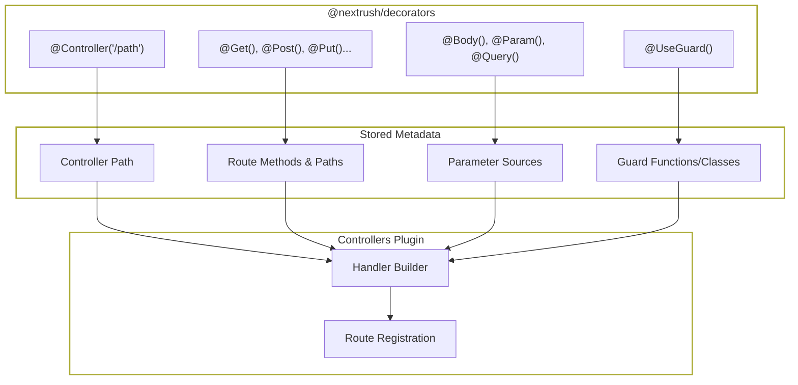
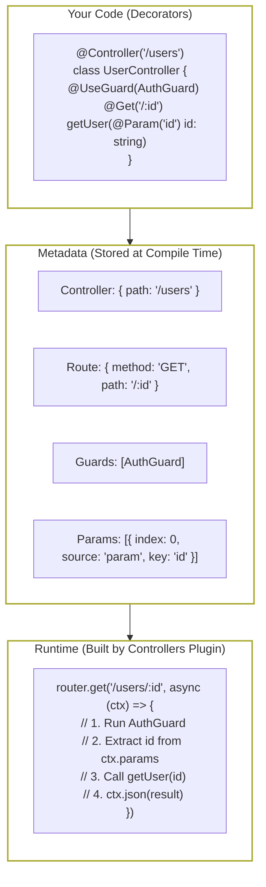
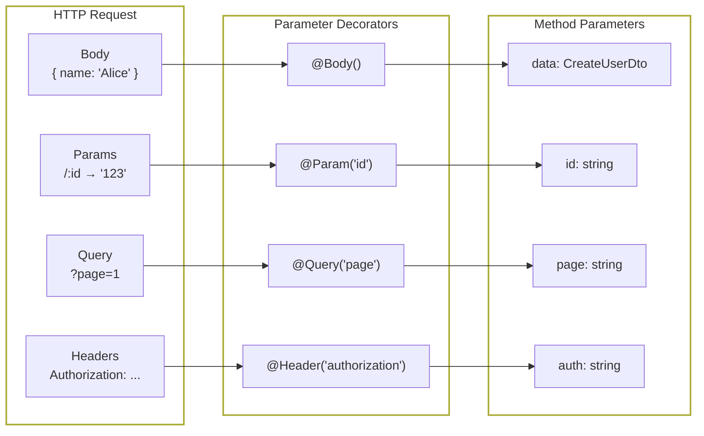
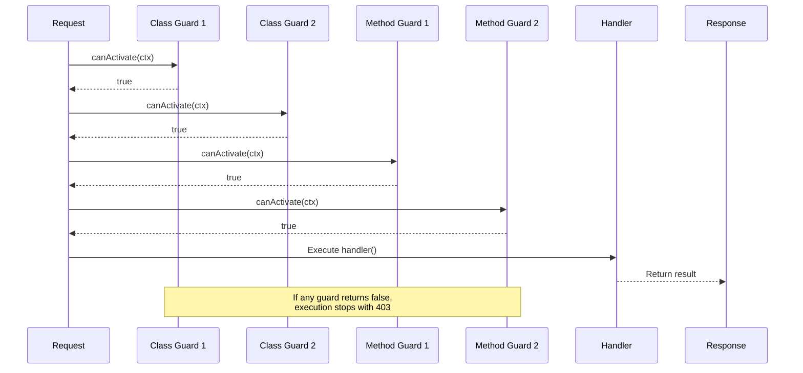

# Decorators

> Type-safe decorators for controllers, routes, parameters, and guards that eliminate boilerplate routing code.

## Architecture Overview



## The Problem

Routing in Node.js frameworks has always been verbose and disconnected from your business logic:

**Route definitions are scattered.** In Express/Koa, routes live in one file, handlers in another, middleware in a third. To understand what `POST /users` does, you jump between 3+ files. Code changes require updates in multiple places.

**Parameter extraction is repetitive.** Every handler starts with the same boilerplate: `const { id } = req.params; const { page } = req.query; const body = req.body`. Repeat this hundreds of times. Forget once, and you get undefined bugs.

**Type safety is an afterthought.** Decorators in other frameworks often lose TypeScript types. You mark a parameter as `@Body()` but get `any`. Your IDE can't help. Runtime errors catch what compile-time should have.

**Guards are awkward to compose.** Want authentication on a route? Add middleware. Want role-based access? Another middleware. Want both on a controller? Wire them up manually. Miss one route, security hole.

## How NextRush Approaches This

NextRush decorators follow a **declaration principle**: mark WHAT you want, the framework handles HOW.

1. **`@Controller('/path')`** — Declares a route group
2. **`@Get()`, `@Post()`** — Declares HTTP methods
3. **`@Body()`, `@Param()`** — Declares where data comes from
4. **`@UseGuard()`** — Declares protection requirements

The framework reads these declarations and builds optimized handlers. You never manually extract parameters or wire routes.

All decorators preserve TypeScript types. `@Body()` knows your DTO type. `@Param('id')` knows it's a string. Your IDE provides full autocomplete.

## Mental Model

Think of decorators as **metadata annotations** that describe your API contract.

### Decorator Flow



Decorators store metadata. The controllers plugin reads metadata and builds handlers.

## Installation

```bash
pnpm add @nextrush/decorators
```

::: tip Using Controllers?
If you're using `@nextrush/controllers`, you don't need to install `@nextrush/decorators` separately:

```typescript
import { Controller, Get, Body, UseGuard } from '@nextrush/controllers';
```
:::

## Quick Start

```typescript
import 'reflect-metadata';
import { Controller, Get, Post, Body, Param } from '@nextrush/decorators';
import { Service } from '@nextrush/di';

@Service()
class UserService {
  private users = new Map([['1', { id: '1', name: 'Alice' }]]);

  find(id: string) {
    return this.users.get(id);
  }

  create(data: { name: string }) {
    const id = String(Date.now());
    const user = { id, ...data };
    this.users.set(id, user);
    return user;
  }
}

@Controller('/users')
class UserController {
  constructor(private userService: UserService) {}

  @Get('/:id')
  getUser(@Param('id') id: string) {
    return this.userService.find(id);
  }

  @Post()
  createUser(@Body() data: { name: string }) {
    return this.userService.create(data);
  }
}
```

## Controller Decorator

### `@Controller(path)`

Marks a class as a controller with a base path.

```typescript
@Controller('/users')
class UserController {
  // All routes prefixed with /users
}

@Controller('/api/v1/products')
class ProductController {
  // All routes prefixed with /api/v1/products
}
```

## Route Decorators

### HTTP Method Decorators

| Decorator | HTTP Method | Example Path |
|-----------|-------------|--------------|
| `@Get(path?)` | GET | `/users`, `/users/:id` |
| `@Post(path?)` | POST | `/users` |
| `@Put(path?)` | PUT | `/users/:id` |
| `@Patch(path?)` | PATCH | `/users/:id` |
| `@Delete(path?)` | DELETE | `/users/:id` |
| `@Head(path?)` | HEAD | `/users/:id` |
| `@Options(path?)` | OPTIONS | `/users` |
| `@All(path?)` | All methods | `/webhook` |

### Route Examples

```typescript
@Controller('/users')
class UserController {
  @Get()           // GET /users
  findAll() {}

  @Get('/:id')     // GET /users/:id
  findOne() {}

  @Post()          // POST /users
  create() {}

  @Put('/:id')     // PUT /users/:id
  replace() {}

  @Patch('/:id')   // PATCH /users/:id
  update() {}

  @Delete('/:id')  // DELETE /users/:id
  remove() {}
}
```

### Path Parameters

```typescript
@Controller('/organizations/:orgId/users')
class OrgUserController {
  @Get('/:userId/posts/:postId')
  // Full path: /organizations/:orgId/users/:userId/posts/:postId
  getPost(
    @Param('orgId') orgId: string,
    @Param('userId') userId: string,
    @Param('postId') postId: string,
  ) {
    return { orgId, userId, postId };
  }
}
```

## Parameter Decorators

Parameter decorators extract data from different parts of the request and inject it into your handler method.



### Request Body

```typescript
// Full body
@Post()
create(@Body() data: CreateUserDto) {
  return this.userService.create(data);
}

// Specific property
@Post()
create(@Body('name') name: string, @Body('email') email: string) {
  return this.userService.create({ name, email });
}
```

### Route Parameters

```typescript
// All params as object
@Get('/:id')
findOne(@Param() params: { id: string }) {
  return this.userService.find(params.id);
}

// Specific param
@Get('/:id')
findOne(@Param('id') id: string) {
  return this.userService.find(id);
}
```

### Query Parameters

```typescript
// All query params
@Get()
findAll(@Query() query: { page?: string; limit?: string }) {
  return this.userService.findAll(query);
}

// Specific query param
@Get()
findAll(@Query('page') page: string, @Query('limit') limit: string) {
  return this.userService.findAll({ page, limit });
}
```

### Headers

```typescript
// All headers
@Get()
info(@Headers() headers: Record<string, string>) {
  return { userAgent: headers['user-agent'] };
}

// Specific header
@Get()
info(@Header('authorization') auth: string) {
  return { authenticated: Boolean(auth) };
}
```

### Full Context

```typescript
@Get()
handler(@Ctx() ctx: Context) {
  // Access full context when needed
  ctx.status = 201;
  return { created: true };
}
```

### Middleware State

```typescript
// Access state set by middleware
@Get()
profile(@State('user') user: User) {
  return { profile: user };
}
```

## Parameter Transforms

Transform parameters before they reach your handler.

### Sync Transform

```typescript
// Convert string to number
@Get('/:id')
findOne(@Param('id', { transform: Number }) id: number) {
  // id is now a number
  return this.userService.find(id);
}

// Parse JSON from query
@Get()
search(@Query('filter', { transform: JSON.parse }) filter: FilterDto) {
  return this.userService.search(filter);
}
```

### Async Transform (Validation)

Use with validation libraries like Zod:

```typescript
import { z } from 'zod';

const CreateUserSchema = z.object({
  name: z.string().min(1),
  email: z.string().email(),
  age: z.number().min(0).optional(),
});

type CreateUserDto = z.infer<typeof CreateUserSchema>;

@Controller('/users')
class UserController {
  @Post()
  async create(
    @Body({ transform: (data) => CreateUserSchema.parseAsync(data) })
    data: CreateUserDto,
  ) {
    // data is validated and typed
    return this.userService.create(data);
  }
}
```

::: info Transform Errors
If a transform throws, the controllers plugin catches it and returns a 400 Bad Request with the error message. You don't need try-catch.
:::

## Guards

Guards protect routes by determining if a request should proceed.

### Function Guards

The simplest guard is a function:

```typescript
import type { GuardFn } from '@nextrush/decorators';

const AuthGuard: GuardFn = async (ctx) => {
  const token = ctx.get('authorization');
  if (!token) return false;

  const user = await verifyToken(token);
  if (!user) return false;

  ctx.state.user = user;
  return true;
};

@UseGuard(AuthGuard)
@Controller('/users')
class UserController {
  @Get('/me')
  profile(@State('user') user: User) {
    return user;
  }
}
```

### Guard Factories

Create configurable guards with factories:

```typescript
const RoleGuard = (roles: string[]): GuardFn => async (ctx) => {
  const user = ctx.state.user as User | undefined;
  if (!user) return false;
  return roles.includes(user.role);
};

@UseGuard(AuthGuard)
@Controller('/admin')
class AdminController {
  @UseGuard(RoleGuard(['admin']))
  @Get('/dashboard')
  dashboard() {
    return { admin: true };
  }

  @UseGuard(RoleGuard(['admin', 'moderator']))
  @Get('/reports')
  reports() {
    return { reports: [] };
  }
}
```

### Class Guards (with DI)

For guards that need dependencies, use class guards:

```typescript
import type { CanActivate, GuardContext } from '@nextrush/decorators';
import { Service } from '@nextrush/di';

@Service()
class AuthGuard implements CanActivate {
  constructor(private authService: AuthService) {}

  async canActivate(ctx: GuardContext): Promise<boolean> {
    const token = ctx.get('authorization');
    if (!token) return false;

    const user = await this.authService.verify(token);
    if (!user) return false;

    ctx.state.user = user;
    return true;
  }
}

@UseGuard(AuthGuard) // Class reference, resolved from DI container
@Controller('/users')
class UserController {}
```

### Guard Context

Guards receive a lightweight `GuardContext` (not the full `Context`):

```typescript
interface GuardContext {
  method: HttpMethod;
  path: string;
  params: Record<string, string>;
  query: Record<string, string>;
  body: unknown;
  headers: Record<string, string>;
  state: Record<string, unknown>;
  get(name: string): string | undefined;
  set(name: string, value: string): void;
}
```

::: info Why GuardContext?
Guards run before the handler and shouldn't send responses. `GuardContext` provides read access and state mutation, but no response methods like `ctx.json()`. This enforces correct guard design.
:::

### Guard Execution Order

Guards execute in order: class guards first, then method guards.



```typescript
@UseGuard(Guard1)    // Runs 1st
@UseGuard(Guard2)    // Runs 2nd
@Controller('/example')
class ExampleController {
  @UseGuard(Guard3)  // Runs 3rd
  @UseGuard(Guard4)  // Runs 4th
  @Get()
  handler() {}
}
```

If any guard returns `false`, execution stops and a 403 Forbidden response is sent.

## Complete Example

```typescript
import 'reflect-metadata';
import { createApp } from '@nextrush/core';
import {
  Controller, Get, Post, Put, Delete,
  Body, Param, Query, UseGuard,
  Service, controllersPlugin,
} from '@nextrush/controllers';
import type { GuardFn } from '@nextrush/controllers';
import { z } from 'zod';

// Validation schemas
const CreateUserSchema = z.object({
  name: z.string().min(1),
  email: z.string().email(),
});

const UpdateUserSchema = CreateUserSchema.partial();

type CreateUserDto = z.infer<typeof CreateUserSchema>;
type UpdateUserDto = z.infer<typeof UpdateUserSchema>;

// Service
@Service()
class UserService {
  private users = new Map<string, { id: string; name: string; email: string }>();

  findAll(page = 1, limit = 10) {
    return Array.from(this.users.values()).slice((page - 1) * limit, page * limit);
  }

  findById(id: string) {
    return this.users.get(id);
  }

  create(data: CreateUserDto) {
    const id = String(Date.now());
    const user = { id, ...data };
    this.users.set(id, user);
    return user;
  }

  update(id: string, data: UpdateUserDto) {
    const user = this.users.get(id);
    if (!user) return null;
    Object.assign(user, data);
    return user;
  }

  delete(id: string) {
    return this.users.delete(id);
  }
}

// Guard
const AuthGuard: GuardFn = async (ctx) => {
  return Boolean(ctx.get('authorization'));
};

// Controller
@UseGuard(AuthGuard)
@Controller('/users')
class UserController {
  constructor(private userService: UserService) {}

  @Get()
  findAll(
    @Query('page', { transform: (v) => Number(v) || 1 }) page: number,
    @Query('limit', { transform: (v) => Number(v) || 10 }) limit: number,
  ) {
    return this.userService.findAll(page, limit);
  }

  @Get('/:id')
  findOne(@Param('id') id: string) {
    const user = this.userService.findById(id);
    if (!user) {
      throw new Error('User not found'); // Would use NotFoundError in real app
    }
    return user;
  }

  @Post()
  create(
    @Body({ transform: (d) => CreateUserSchema.parse(d) }) data: CreateUserDto,
  ) {
    return this.userService.create(data);
  }

  @Put('/:id')
  update(
    @Param('id') id: string,
    @Body({ transform: (d) => UpdateUserSchema.parse(d) }) data: UpdateUserDto,
  ) {
    const user = this.userService.update(id, data);
    if (!user) {
      throw new Error('User not found');
    }
    return user;
  }

  @Delete('/:id')
  remove(@Param('id') id: string) {
    const deleted = this.userService.delete(id);
    return { deleted };
  }
}
```

```typescript
// src/index.ts
import 'reflect-metadata';
import { createApp } from '@nextrush/core';
import { createRouter } from '@nextrush/router';
import { controllersPlugin } from '@nextrush/controllers';

const app = createApp();
const router = createRouter();

// Auto-discover controllers
await app.pluginAsync(
  controllersPlugin({
    router,
    root: './src',
  })
);

app.use(router.routes());
app.listen(3000);
```

## Common Mistakes

### Forgetting `reflect-metadata`

```typescript
// ❌ Decorators won't work - no metadata available
@Controller('/users')
class UserController {}

// ✅ Import at app entry point
import 'reflect-metadata';

@Controller('/users')
class UserController {}
```

### Wrong Decorator Order

```typescript
// ❌ @UseGuard must be ABOVE @Get
@Get()
@UseGuard(AuthGuard)
handler() {}

// ✅ Decorators read bottom-to-top, apply top-to-bottom
@UseGuard(AuthGuard)
@Get()
handler() {}
```

### Sending Response in Guard

```typescript
// ❌ Guards don't have response methods
const BadGuard: GuardFn = (ctx) => {
  ctx.json({ error: 'Unauthorized' }); // Error! json() doesn't exist
  return false;
};

// ✅ Guards just return boolean
const GoodGuard: GuardFn = (ctx) => {
  return Boolean(ctx.get('authorization'));
};
```

### Transform Without Error Handling

```typescript
// ❌ If Number() returns NaN, you get bugs
@Get('/:id')
findOne(@Param('id', { transform: Number }) id: number) {}

// ✅ Handle invalid input
@Get('/:id')
findOne(@Param('id', { transform: (v) => {
  const n = Number(v);
  if (isNaN(n)) throw new Error('Invalid ID');
  return n;
}}) id: number) {}
```

## When NOT to Use Decorators

Decorators add structure but also complexity. Don't use them when:

- **Building a simple API** — Functional routes are faster to write
- **One-off endpoints** — A single route doesn't need a controller
- **Performance-critical paths** — Decorator metadata has (tiny) runtime overhead
- **Non-class-based code** — Decorators require classes

For small apps, functional routing is often cleaner:

```typescript
const router = createRouter();

router.get('/health', (ctx) => ctx.json({ status: 'ok' }));
router.get('/users', (ctx) => ctx.json(users));
router.post('/users', (ctx) => {
  const user = createUser(ctx.body);
  ctx.json(user);
});

app.use(router.routes());
```

Use decorators when:
- You have 10+ routes
- You want dependency injection
- You need guards on multiple routes
- Your team prefers class-based structure

## API Reference

### Class Decorators

| Decorator | Purpose |
|-----------|---------|
| `@Controller(path)` | Define controller with base path |
| `@UseGuard(guard)` | Apply guard to all routes |

### Method Decorators

| Decorator | Purpose |
|-----------|---------|
| `@Get(path?)` | Handle GET requests |
| `@Post(path?)` | Handle POST requests |
| `@Put(path?)` | Handle PUT requests |
| `@Patch(path?)` | Handle PATCH requests |
| `@Delete(path?)` | Handle DELETE requests |
| `@Head(path?)` | Handle HEAD requests |
| `@Options(path?)` | Handle OPTIONS requests |
| `@All(path?)` | Handle all HTTP methods |
| `@UseGuard(guard)` | Apply guard to this route |

### Parameter Decorators

| Decorator | Purpose |
|-----------|---------|
| `@Body()` | Full request body |
| `@Body(key)` | Specific body property |
| `@Param()` | All route parameters |
| `@Param(key)` | Specific route parameter |
| `@Query()` | All query parameters |
| `@Query(key)` | Specific query parameter |
| `@Headers()` | All request headers |
| `@Header(key)` | Specific header |
| `@State()` | Middleware state bag |
| `@State(key)` | Specific state property |
| `@Ctx()` | Full context object |

### Types

```typescript
// Guard function type
type GuardFn = (ctx: GuardContext) => boolean | Promise<boolean>;

// Class guard interface
interface CanActivate {
  canActivate(ctx: GuardContext): boolean | Promise<boolean>;
}

// Guard context (subset of Context)
interface GuardContext {
  method: HttpMethod;
  path: string;
  params: Record<string, string>;
  query: Record<string, string>;
  body: unknown;
  headers: Record<string, string>;
  state: Record<string, unknown>;
  get(name: string): string | undefined;
  set(name: string, value: string): void;
}
```

## Next Steps

- **[Controllers Package](/packages/controllers/)** — Wire decorators to your app
- **[DI Package](/packages/di/)** — Dependency injection
- **[Guards Guide](/guides/guards)** — Authentication and authorization patterns

## Runtime Compatibility

| Runtime | Supported |
|---------|-----------|
| Node.js 20+ | ✅ |
| Bun 1.0+ | ✅ |
| Deno 2.0+ | ✅ |

**Dependencies:** `reflect-metadata` (decorator metadata)
