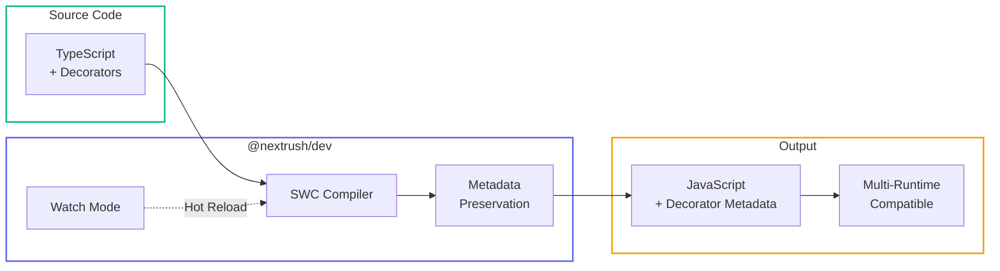

# @nextrush/dev

> Development server and production build tooling for NextRush applications with multi-runtime support.

## Build Pipeline



## The Problem

Modern TypeScript tooling is fragmented. You need different tools for different tasks:

- **Development**: tsx, ts-node, nodemon
- **Building**: esbuild, tsup, tsc
- **Watch mode**: Custom configuration for each tool

Worse, most fast bundlers (esbuild, tsup) strip type information during compilation. This **breaks dependency injection**:

```typescript
// Your code
@Service()
class UserService {
  constructor(private db: Database) {} // ← DI needs to know this is 'Database'
}

// After esbuild/tsup
let UserService = class { constructor(db) {} };
// No type info! DI can't resolve 'Database'
```

You end up with slow tsc builds or broken DI. Neither is acceptable.

## Why NextRush Exists Here

`@nextrush/dev` provides unified development and build tooling that:

| Feature | Benefit |
|---------|---------|
| Single command | `nextrush dev` / `nextrush build` |
| Multi-runtime | Node.js, Bun, Deno |
| Decorator metadata | Always emitted for DI |
| Fast builds | SWC-powered compilation |
| Zero config | Works out of the box |

## Mental Model

Think of `@nextrush/dev` as a **smart wrapper** that:

1. **Detects** which runtime you're using
2. **Chooses** the best tool for that runtime
3. **Ensures** decorator metadata is always emitted

```
nextrush dev
     │
     ▼
┌─────────────┐    ┌─────────────┐    ┌─────────────┐
│   Node.js   │    │     Bun     │    │    Deno     │
│  --watch    │    │  --watch    │    │  --watch    │
│  + tsx/swc  │    │  (native)   │    │  (native)   │
└─────────────┘    └─────────────┘    └─────────────┘
```

```
nextrush build
     │
     ▼
┌─────────────┐    ┌─────────────┐    ┌─────────────┐
│   Node.js   │    │     Bun     │    │    Deno     │
│  @swc/core  │    │ Bun.build() │    │ npm:@swc/   │
│  transform  │    │   native    │    │    core     │
└─────────────┘    └─────────────┘    └─────────────┘
         │                │                  │
         └────────────────┴──────────────────┘
                          │
                          ▼
                  ✅ Decorator Metadata
```

## Installation

```bash
pnpm add @nextrush/dev -D
```

## Quick Start

### Development Server

```bash
# Auto-detects runtime
npx nextrush dev

# Or with specific runtime
bun nextrush dev
deno run -A nextrush dev
```

Features:
- ✅ Hot reload on file changes
- ✅ TypeScript support (no compilation step)
- ✅ Source maps for debugging

### Production Build

```bash
# Build for production
npx nextrush build

# Specify output directory
npx nextrush build --out-dir dist

# Enable minification
npx nextrush build --minify
```

Features:
- ✅ Decorator metadata emission
- ✅ Source maps
- ✅ Type declarations (.d.ts)
- ✅ Fast SWC-powered compilation

## Commands

### `nextrush dev`

Start a development server with hot reload.

```bash
nextrush dev [entry] [options]
```

**Arguments:**

| Argument | Default | Description |
|----------|---------|-------------|
| `entry` | Auto-detected | Entry file path |

**Options:**

| Option | Default | Description |
|--------|---------|-------------|
| `--port`, `-p` | `3000` | Port for the dev server |
| `--host` | `localhost` | Host to bind to |
| `--no-clear` | - | Don't clear console on reload |

**Examples:**

```bash
# Basic usage (auto-finds entry)
nextrush dev

# Specify entry file
nextrush dev src/server.ts

# Custom port
nextrush dev --port 8080

# Bind to all interfaces
nextrush dev --host 0.0.0.0
```

**Entry File Resolution:**

If no entry is specified, looks for (in order):
1. `package.json` → `main` field
2. `src/index.ts`
3. `src/main.ts`
4. `index.ts`

### `nextrush build`

Create a production build with decorator metadata.

```bash
nextrush build [options]
```

**Options:**

| Option | Default | Description |
|--------|---------|-------------|
| `--out-dir`, `-o` | `dist` | Output directory |
| `--minify` | `false` | Minify output |
| `--sourcemap` | `true` | Generate source maps |
| `--no-dts` | - | Skip .d.ts generation |
| `--clean` | `true` | Clean output dir first |

**Examples:**

```bash
# Basic build
nextrush build

# Custom output
nextrush build --out-dir build

# Production with minification
nextrush build --minify

# Skip declaration files
nextrush build --no-dts
```

**Build Output:**

```
dist/
├── index.js         # Compiled JavaScript
├── index.js.map     # Source map
├── index.d.ts       # Type declarations
└── ...              # Other compiled files
```

## Multi-Runtime Support

### Node.js

```bash
# Development
npx nextrush dev

# Build
npx nextrush build
```

**Development tools used:**
- `--watch`: Node.js native file watching (v18+)
- `tsx` or `@swc-node/register`: TypeScript execution

**Build tools used:**
- `@swc/core`: Fast compilation with decorator metadata

### Bun

```bash
# Development
bun nextrush dev

# Build
bun nextrush build
```

**Development:**
- Native TypeScript support
- Native watch mode
- No additional tools needed

**Build:**
- `Bun.build()`: Native bundler with decorator metadata support

### Deno

```bash
# Development
deno run -A nextrush dev

# Build
deno run -A nextrush build
```

**Development:**
- Native TypeScript support
- Native watch mode
- `--node-modules-dir` for npm compatibility

**Build:**
- `npm:@swc/core`: SWC via npm specifier
- Full decorator metadata emission

### Runtime Support Table

| Feature | Node.js | Bun | Deno |
|---------|---------|-----|------|
| Dev server | ✅ | ✅ | ✅ |
| Hot reload | ✅ | ✅ | ✅ |
| Production build | ✅ | ✅ | ✅ |
| Decorator metadata | ✅ | ✅ | ✅ |
| Source maps | ✅ | ✅ | ✅ |
| Type declarations | ✅ | ✅ | ✅ |

## Decorator Metadata

### Why It Matters

Decorator metadata enables dependency injection:

```typescript
@Service()
class UserService {
  constructor(
    private db: DatabaseService,  // ← DI resolves this
    private logger: LoggerService // ← And this
  ) {}
}

// Without metadata, DI doesn't know what types to inject
// With metadata, it works automatically
```

### How NextRush Ensures It

Each runtime uses the appropriate tool:

| Runtime | Tool | Output |
|---------|------|--------|
| Node.js | `@swc/core` | `Reflect.defineMetadata(...)` |
| Bun | `Bun.build()` | `Reflect.metadata(...)` |
| Deno | `npm:@swc/core` | `_ts_metadata(...)` |

All produce equivalent decorator metadata that works with tsyringe, InversifyJS, and other DI containers.

### Verification

Check your build output for metadata:

```bash
# Should find metadata calls in output
grep -r "metadata\|design:paramtypes" dist/
```

Expected patterns:
- `Reflect.defineMetadata("design:paramtypes", ...)`
- `Reflect.metadata("design:paramtypes", ...)`
- `_ts_metadata("design:paramtypes", ...)`

## Configuration

### tsconfig.json

Ensure these options are enabled:

```json
{
  "compilerOptions": {
    "experimentalDecorators": true,
    "emitDecoratorMetadata": true,
    "target": "ES2022",
    "module": "ESNext",
    "moduleResolution": "bundler"
  }
}
```

### package.json

Add scripts for convenience:

```json
{
  "scripts": {
    "dev": "nextrush dev",
    "build": "nextrush build",
    "start": "node dist/index.js"
  }
}
```

## Common Patterns

### Development with Controllers

```typescript
// src/index.ts
import 'reflect-metadata';
import { createApp } from '@nextrush/core';
import { createRouter } from '@nextrush/router';
import { controllersPlugin } from '@nextrush/controllers';

async function main() {
  const app = createApp();
  const router = createRouter();

  // Auto-discover controllers
  await app.pluginAsync(
    controllersPlugin({
      router,
      root: './src',
      debug: true,
    })
  );

  app.use(router.routes());

  app.listen(3000, () => {
    console.log('Server running on http://localhost:3000');
  });
}

main();
```

Start development:

```bash
nextrush dev
# → Watching for file changes...
# → Server running on http://localhost:3000
```

### Production Deployment

```bash
# Build with minification
nextrush build --minify

# Deploy dist/ folder
node dist/index.js
```

### CI/CD Pipeline

```yaml
# .github/workflows/build.yml
jobs:
  build:
    runs-on: ubuntu-latest
    steps:
      - uses: actions/checkout@v4
      - uses: pnpm/action-setup@v4
      - uses: actions/setup-node@v4
        with:
          node-version: 20

      - run: pnpm install
      - run: pnpm nextrush build
      - uses: actions/upload-artifact@v4
        with:
          name: dist
          path: dist/
```

## Troubleshooting

### "Cannot find module" in development

**Cause:** Module not installed or path incorrect.

**Solution:**

```bash
# Ensure dependencies are installed
pnpm install

# Check the import path
# ❌ import { thing } from './module.ts'  # Don't include .ts
# ✅ import { thing } from './module'
```

### Decorator metadata not working

**Cause:** tsconfig.json misconfigured.

**Solution:**

```json
{
  "compilerOptions": {
    "experimentalDecorators": true,
    "emitDecoratorMetadata": true
  }
}
```

### Build output missing files

**Cause:** Files excluded or not in source directory.

**Solution:**

```bash
# Check your source structure
ls src/

# Ensure all files are .ts (not .js)
# Build only processes TypeScript files
```

### Deno build fails

**Cause:** npm packages not accessible.

**Solution:**

```bash
# Ensure --node-modules-dir is used
deno run --allow-all --node-modules-dir nextrush build
```

## Programmatic API

For advanced use cases, import the functions directly:

```typescript
import { dev, build } from '@nextrush/dev';

// Start dev server
await dev({
  entry: 'src/index.ts',
  port: 3000,
});

// Run production build
await build({
  outDir: 'dist',
  minify: true,
  sourcemap: true,
});
```

**Note:** Most users should use the CLI. The programmatic API is for tooling authors.

## Architecture

For deep technical details on how the package works:
- Runtime detection logic
- SWC integration
- Multi-runtime build strategies

See [ARCHITECTURE.md](https://github.com/nextrush/nextrush/blob/main/packages/dev/ARCHITECTURE.md).

## Package Details

| Metric | Value |
|--------|-------|
| Bundle | ~25 KB |
| Dependencies | `@swc/core`, `tsx` |
| Node.js | 20+ |
| Bun | 1.0+ |
| Deno | 2.0+ |

## See Also

- [@nextrush/core](/packages/core) - Core application
- [@nextrush/controllers](/packages/controllers) - Controller decorators
- [@nextrush/di](/packages/di) - Dependency injection
