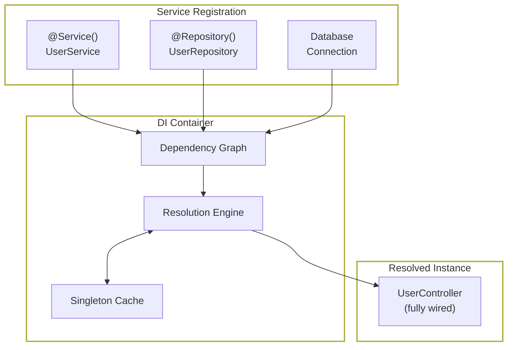
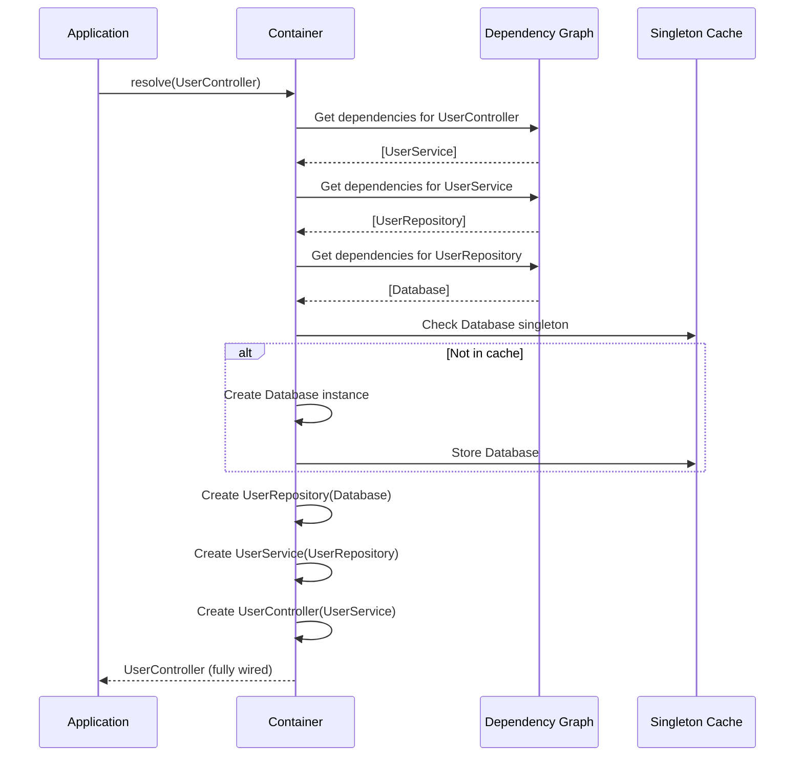
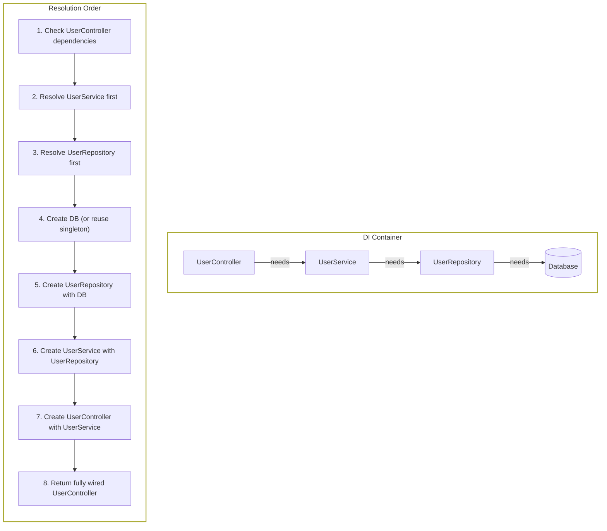
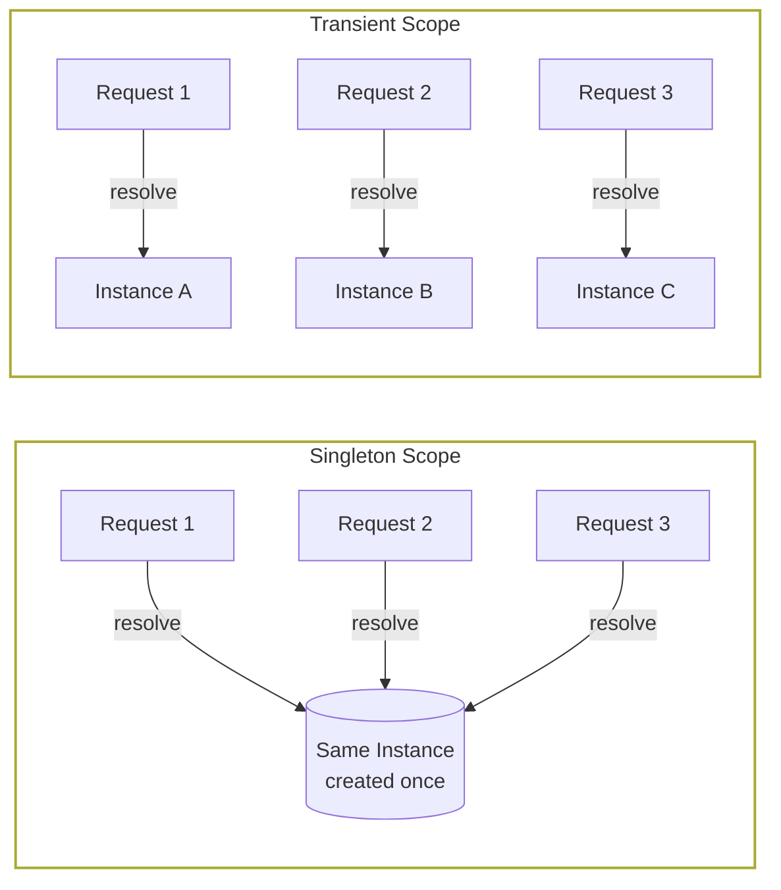
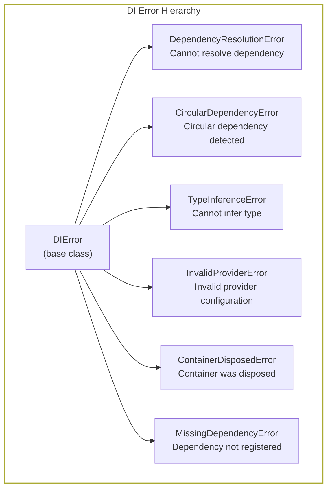

# Dependency Injection

> Automatic dependency resolution that eliminates manual wiring and enables testable, modular architecture.

## How DI Container Works



### Resolution Flow



## The Problem

Building large applications without dependency injection creates cascading problems:

**Manual wiring is tedious.** Every service needs its dependencies passed manually. Create a `UserController`? You need to instantiate `UserService` first. `UserService` needs `UserRepository`. `UserRepository` needs `DatabaseConnection`. Now repeat this everywhere that uses `UserController`.

**Testing becomes painful.** Want to test `UserController` with a mock `UserService`? Without DI, you're stuck with hacky solutions: monkey-patching imports, global test fixtures, or rewriting constructors. Real unit tests become integration tests by accident.

**Circular dependencies crash at runtime.** Service A needs Service B. Service B needs Service A. Without proper container management, your app crashes with cryptic import errors or infinite loops.

**Singletons are managed manually.** Is `DatabaseConnection` a singleton? Who creates it? Who ensures only one instance exists? Every team invents their own patterns—and they're usually wrong.

## How NextRush Approaches This

NextRush DI follows a simple principle: **declare what you need, let the container figure out how to provide it.**

Mark classes with `@Service()` or `@Repository()`. Declare dependencies in constructors. The container:

1. **Scans decorators** at startup to build a dependency graph
2. **Resolves dependencies** automatically when you need an instance
3. **Manages lifecycles** — singletons stay singleton, transients get recreated
4. **Handles circular deps** — with explicit `delay()` when needed
5. **Enables testing** — swap implementations without changing code

No manual wiring. No factory functions. No service locator anti-pattern.

## Mental Model

Think of the DI container as a **smart factory** that knows how to build any registered class.

### The Dependency Graph



When you call `container.resolve(UserController)`, the container walks the dependency tree bottom-up, creating or reusing instances as needed.

### Singleton vs Transient

| Scope | Behavior | Use Case |
|-------|----------|----------|
| `singleton` (default) | One instance shared everywhere | Database connections, config, caches |
| `transient` | New instance every resolve | Request-scoped data, stateful operations |



## Installation

```bash
pnpm add @nextrush/di
```

::: tip Using Controllers?
If you're using `@nextrush/controllers`, you don't need to install `@nextrush/di` separately. The controllers package re-exports everything:

```typescript
import { Service, Repository, container } from '@nextrush/controllers';
```
:::

## Quick Start

```typescript
import 'reflect-metadata'; // Required for decorator metadata
import { Service, Repository, container } from '@nextrush/di';

// Mark classes for DI
@Repository()
class UserRepository {
  findById(id: string) {
    return { id, name: 'Alice' };
  }
}

@Service()
class UserService {
  // Dependencies declared in constructor
  constructor(private userRepo: UserRepository) {}

  getUser(id: string) {
    return this.userRepo.findById(id);
  }
}

// Container resolves everything automatically
const userService = container.resolve(UserService);
console.log(userService.getUser('123')); // { id: '123', name: 'Alice' }
```

**What happened:**
1. `@Repository()` registered `UserRepository` in the container
2. `@Service()` registered `UserService` and noted its dependency
3. `container.resolve()` created `UserRepository` first, then `UserService` with it

## Core Decorators

### `@Service()`

Marks a class as a service. Default scope is singleton.

```typescript
// Singleton (one instance)
@Service()
class ConfigService {
  readonly port = process.env.PORT || 3000;
}

// Transient (new instance each time)
@Service({ scope: 'transient' })
class RequestLogger {
  readonly timestamp = Date.now();
}
```

### `@Repository()`

Semantic alias for `@Service()`. Use for data access classes.

```typescript
@Repository()
class UserRepository {
  async findAll() {
    return db.query('SELECT * FROM users');
  }
}
```

::: info Why Two Decorators?
`@Service()` and `@Repository()` behave identically. The distinction is **semantic**:
- `@Service()` — Business logic
- `@Repository()` — Data access

This makes code self-documenting and follows domain-driven design conventions.
:::

### `@inject()`

Explicitly inject a token when TypeScript can't infer the type.

```typescript
// Interface-based injection
interface ILogger {
  log(message: string): void;
}

@Service()
class AppService {
  constructor(@inject('ILogger') private logger: ILogger) {}
}

// Register the implementation
container.register('ILogger', { useClass: ConsoleLogger });
```

### `delay()`

Handle circular dependencies by deferring resolution.

```typescript
@Service()
class ServiceA {
  constructor(@inject(delay(() => ServiceB)) private b: ServiceB) {}
}

@Service()
class ServiceB {
  constructor(@inject(delay(() => ServiceA)) private a: ServiceA) {}
}
```

::: warning Circular Dependencies
Circular dependencies are usually a design smell. Before using `delay()`, consider:
- Can you extract shared logic to a third service?
- Is the circular dependency actually needed?
- Would events/callbacks be cleaner?
:::

### `@AutoInjectable()`

Allow instantiation with `new` while still resolving DI dependencies.

```typescript
@AutoInjectable()
class ReportGenerator {
  constructor(
    private templateService?: TemplateService, // DI resolved
    private customData?: CustomData            // Can be passed manually
  ) {}

  generate() {
    return this.templateService!.render(this.customData);
  }
}

// Can use new() - DI deps are auto-resolved
const generator = new ReportGenerator(undefined, { title: 'Monthly Report' });
```

::: tip When to Use @AutoInjectable
Use `@AutoInjectable()` when you need to:
- Create instances dynamically with runtime data
- Combine DI-resolved services with constructor parameters
- Gradually migrate existing code to DI
:::

## Helper Functions

These functions help introspect DI metadata for debugging and advanced use cases.

### `hasServiceMetadata(target)`

Check if a class has DI metadata (was decorated with `@Service` or `@Repository`).

```typescript
import { hasServiceMetadata, Service } from '@nextrush/di';

@Service()
class MyService {}

class PlainClass {}

hasServiceMetadata(MyService);  // true
hasServiceMetadata(PlainClass); // false
```

### `getServiceType(target)`

Get the service type from metadata (`'service'` or `'repository'`).

```typescript
import { getServiceType, Service, Repository } from '@nextrush/di';

@Service()
class UserService {}

@Repository()
class UserRepository {}

getServiceType(UserService);    // 'service'
getServiceType(UserRepository); // 'repository'
```

### `getServiceScope(target)`

Get the configured scope for a service (`'singleton'` or `'transient'`).

```typescript
import { getServiceScope, Service } from '@nextrush/di';

@Service()
class SingletonService {}

@Service({ scope: 'transient' })
class TransientService {}

getServiceScope(SingletonService);  // 'singleton'
getServiceScope(TransientService);  // 'transient'
```

## Container API

### `container.resolve<T>(token)`

Get an instance of a registered class.

```typescript
const userService = container.resolve(UserService);
```

### `container.register(token, provider)`

Manually register a class or value.

```typescript
// Register a class
container.register('UserService', { useClass: UserService });

// Register a value (constant)
container.register('CONFIG', { useValue: { port: 3000 } });

// Register a factory
container.register('DB', {
  useFactory: () => createDatabaseConnection(process.env.DATABASE_URL),
});
```

### `container.isRegistered(token)`

Check if a token is registered.

```typescript
if (!container.isRegistered('DB')) {
  container.register('DB', { useValue: mockDb });
}
```

### `createContainer()`

Create an isolated container (useful for testing).

```typescript
import { createContainer } from '@nextrush/di';

const testContainer = createContainer();
testContainer.register(UserRepository, { useClass: MockUserRepository });
```

## Error Handling

NextRush DI provides descriptive errors with actionable messages. All errors extend the base `DIError` class.



### Error Types

| Error | Cause | Solution |
|-------|-------|----------|
| `DependencyResolutionError` | Container cannot create the requested instance | Check that all dependencies are registered |
| `CircularDependencyError` | Service A needs B, B needs A | Use `delay()` or refactor to break the cycle |
| `TypeInferenceError` | TypeScript cannot determine constructor parameter type | Add `@inject(token)` decorator |
| `InvalidProviderError` | Provider configuration is malformed | Check `useClass`, `useValue`, or `useFactory` |
| `ContainerDisposedError` | Container was already disposed | Create a new container or don't call dispose |
| `MissingDependencyError` | Required dependency not found | Register the missing service |

### Catching DI Errors

```typescript
import { container, DIError, CircularDependencyError } from '@nextrush/di';

try {
  const service = container.resolve(MyService);
} catch (error) {
  if (error instanceof CircularDependencyError) {
    console.error('Circular dependency:', error.dependencyChain);
  } else if (error instanceof DIError) {
    console.error('DI error:', error.message);
  }
}
```

### Debugging Resolution Failures

When a service fails to resolve, the error includes the full dependency chain:

```
DependencyResolutionError: Unable to resolve UserController
  → Required: UserService
    → Required: UserRepository
      → Required: DatabaseConnection (not registered)

Did you forget to register DatabaseConnection?
Use: container.register(DatabaseConnection, { useClass: ... })
```

## Testing with DI

DI makes testing easy — swap real implementations for mocks.

### Unit Test Example

```typescript
import { describe, it, expect, beforeEach } from 'vitest';
import { createContainer } from '@nextrush/di';
import { UserService } from './user.service';
import { UserRepository } from './user.repository';

describe('UserService', () => {
  let container;
  let userService: UserService;

  beforeEach(() => {
    // Fresh container for each test
    container = createContainer();

    // Register mock repository
    container.register(UserRepository, {
      useValue: {
        findById: (id: string) => ({ id, name: 'Test User' }),
      },
    });

    // Resolve service with mock dependency
    userService = container.resolve(UserService);
  });

  it('should get user by id', () => {
    const user = userService.getUser('123');
    expect(user.name).toBe('Test User');
  });
});
```

### Integration with Controllers

When using `@nextrush/controllers`, the plugin automatically resolves controllers from the container:

```typescript
import { controllersPlugin, Controller, Get, Service } from '@nextrush/controllers';

@Service()
class GreetingService {
  greet() {
    return 'Hello!';
  }
}

@Controller('/hello')
export class HelloController {
  constructor(private greetingService: GreetingService) {}

  @Get()
  sayHello() {
    return { message: this.greetingService.greet() };
  }
}
```

```typescript
// src/index.ts
import 'reflect-metadata';
import { createApp } from '@nextrush/core';
import { createRouter } from '@nextrush/router';
import { controllersPlugin } from '@nextrush/controllers';

const app = createApp();
const router = createRouter();

// Auto-discover controllers - DI resolves automatically
await app.pluginAsync(
  controllersPlugin({
    router,
    root: './src',
  })
);

app.use(router.routes());
```

## Common Mistakes

### Forgetting `reflect-metadata`

```typescript
// ❌ Error: No metadata available for UserService
@Service()
class UserService {
  constructor(private repo: UserRepository) {}
}

// ✅ Import reflect-metadata at app entry point
import 'reflect-metadata';

@Service()
class UserService {
  constructor(private repo: UserRepository) {}
}
```

### Interface Injection Without Token

```typescript
// ❌ Error: Cannot resolve ILogger (interfaces don't exist at runtime)
@Service()
class AppService {
  constructor(private logger: ILogger) {}
}

// ✅ Use @inject with a string token
@Service()
class AppService {
  constructor(@inject('ILogger') private logger: ILogger) {}
}
```

### Expecting Transient When Singleton

```typescript
// ❌ Bug: Same timestamp for all requests
@Service() // Default is singleton!
class RequestLogger {
  readonly timestamp = Date.now();
}

// ✅ Use transient scope for request-scoped services
@Service({ scope: 'transient' })
class RequestLogger {
  readonly timestamp = Date.now();
}
```

## When NOT to Use DI

DI is powerful but not always necessary:

- **Small scripts** — Just instantiate classes directly
- **Pure utility functions** — No state, no dependencies
- **Simple middleware** — Function closures work fine
- **Performance-critical hot paths** — Container.resolve has overhead

For small apps with 2-3 services, manual wiring is often simpler:

```typescript
// This is fine for small apps:
const db = new Database();
const userRepo = new UserRepository(db);
const userService = new UserService(userRepo);
```

Use DI when:
- You have 10+ services with complex dependency graphs
- You need to swap implementations for testing
- You want lifecycle management (singletons, scopes)
- Your team benefits from consistent patterns

## API Reference

### Decorators

| Decorator | Purpose |
|-----------|---------|
| `@Service()` | Register class as service (singleton by default) |
| `@Service({ scope: 'transient' })` | Register transient service |
| `@Repository()` | Semantic alias for @Service (data access) |
| `@inject(token)` | Explicit token injection |
| `@AutoInjectable()` | Allow new() with DI resolution |
| `delay(() => Type)` | Defer resolution for circular deps |

### Container Methods

| Method | Purpose |
|--------|---------|
| `resolve<T>(token)` | Get instance from container |
| `resolveAll<T>(token)` | Get all instances for a token |
| `register(token, provider)` | Register class, value, or factory |
| `isRegistered(token)` | Check if token is registered |
| `clearInstances()` | Clear singleton cache |
| `reset()` | Reset container to initial state |
| `createChild()` | Create child container |
| `createContainer()` | Create isolated container |

### Helper Functions

| Function | Purpose |
|----------|---------|
| `hasServiceMetadata(target)` | Check if class has DI metadata |
| `getServiceType(target)` | Get service type ('service' or 'repository') |
| `getServiceScope(target)` | Get scope ('singleton' or 'transient') |

### Error Classes

| Error | When Thrown |
|-------|-------------|
| `DIError` | Base class for all DI errors |
| `DependencyResolutionError` | Cannot resolve dependency |
| `CircularDependencyError` | Circular dependency detected |
| `TypeInferenceError` | Cannot infer constructor param type |
| `InvalidProviderError` | Provider config is malformed |
| `ContainerDisposedError` | Container was disposed |
| `MissingDependencyError` | Required dependency not found |

## Next Steps

- **[Controllers Package](/packages/controllers/)** — Use DI with controllers
- **[Decorators Package](/packages/decorators/)** — Route and parameter decorators
- **[Testing Guide](/guides/testing)** — Testing strategies with DI

## Runtime Compatibility

| Runtime | Supported |
|---------|-----------|
| Node.js 20+ | ✅ |
| Bun 1.0+ | ✅ |
| Deno 2.0+ | ✅ |

**Dependencies:** `tsyringe` (DI container implementation), `reflect-metadata` (decorator metadata)
