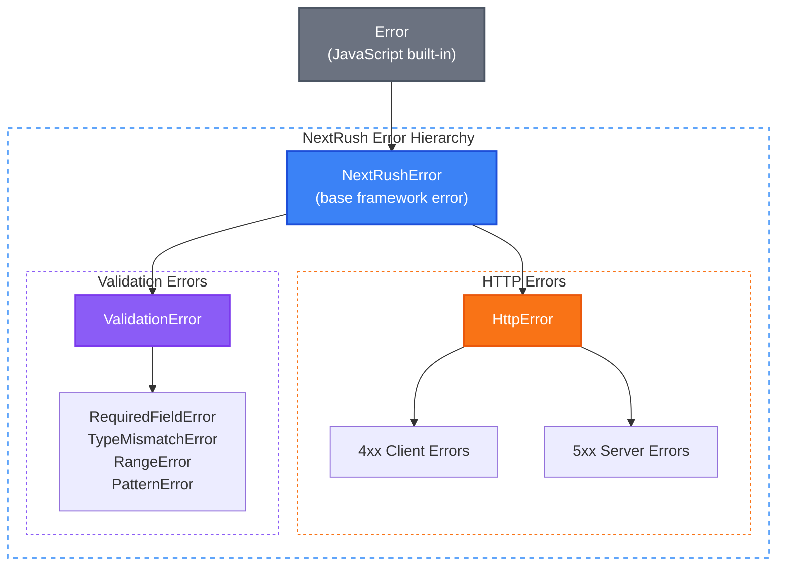

# @nextrush/errors

> Standardized HTTP error handling that eliminates response inconsistency and builds API client trust.

## The Problem

Every API returns errors differently. This creates chaos for both developers and API consumers:

**Inconsistent error responses** plague every backend project. One endpoint returns `{error: "..."}`, another returns `{message: "..."}`, and a third leaks stack traces in production. API clients can't reliably handle errors because there's no standard format.

**Internal errors leak to users.** A database connection timeout becomes `PostgreSQL connection failed on pool "primary"` in the API response. Security researchers see your infrastructure. Users see confusing technical jargon instead of actionable messages.

**Manual error formatting is tedious.** Every route handler manually sets status codes, constructs JSON responses, and decides what to expose. Copy-paste error handling leads to bugs. Forgetting `try-catch` crashes the server.

**No programmatic error handling.** API clients resort to parsing error messages with regex because there are no stable error codes. A typo in an error message breaks production integrations.

## How NextRush Approaches This

NextRush treats **errors as API contracts**, not exceptions.


Every error has three responsibilities:

1. **HTTP status code** - Semantic meaning for browsers and clients
2. **Human message** - Clear explanation for developers/users
3. **Machine code** - Stable identifier for programmatic handling

The framework distinguishes between **client-safe errors** (4xx) and **server-internal errors** (5xx) with an `expose` flag. Client errors show detailed messages. Server errors hide implementation details by default.

All errors serialize to a consistent JSON format automatically. No manual response formatting. No leaked stack traces. No security risks.

## Mental Model

Think of errors as **structured API responses**, not crashes.

### Errors Are Contracts

```
User Request → Handler Logic → Error Thrown → Middleware Catches → JSON Response
```

When you throw `NotFoundError`, you're declaring an API contract:

| Property | Value | Purpose |
|----------|-------|---------|
| Status | `404` | HTTP semantics |
| Code | `NOT_FOUND` | Machine-readable |
| Message | Your custom text | Human-readable |
| Format | `{error, message, code, status}` | Consistent structure |

### The Expose Flag

Every error has an `expose` flag that acts as a **privacy boundary**:

```typescript
// Client errors (4xx): expose = true by default
throw new NotFoundError('User #123 not found');
// → Client sees: {"message": "User #123 not found", "code": "NOT_FOUND"}

// Server errors (5xx): expose = false by default
throw new InternalServerError('Redis connection timeout');
// → Client sees: {"message": "Internal Server Error", "code": "INTERNAL_ERROR"}
// → Server logs: Full error with stack trace
```

This prevents security leaks while maintaining debuggability.

::: info What NextRush Does Automatically
When you throw an `HttpError` with error middleware enabled:
1. **Catches the error** - No uncaught exceptions crash your server
2. **Sets HTTP status** - Correct status code from error class
3. **Formats JSON response** - Consistent `{error, message, code, status}` structure
4. **Applies expose flag** - Hides sensitive 5xx details, shows 4xx details
5. **Logs appropriately** - 5xx logged as errors, 4xx as warnings
6. **Preserves stack traces** - Full debugging in development, hidden in production
:::

## Installation

```bash
pnpm add @nextrush/errors
```

## Quick Start

```typescript
import { createApp } from '@nextrush/core';
import { errorHandler, NotFoundError, BadRequestError } from '@nextrush/errors';

const app = createApp();

// Add error handling middleware FIRST
app.use(errorHandler());

app.get('/users/:id', (ctx) => {
  const user = users.get(ctx.params.id);
  if (!user) {
    throw new NotFoundError('User not found');
  }
  ctx.json(user);
});

app.post('/users', (ctx) => {
  if (!ctx.body.email) {
    throw new BadRequestError('Email is required');
  }
  ctx.json({ success: true });
});
```

**Request:** `GET /users/999`

**Response:** `404 Not Found`
```json
{
  "error": "NotFoundError",
  "message": "User not found",
  "code": "NOT_FOUND",
  "status": 404
}
```

## Error Hierarchy

NextRush provides a clear error class hierarchy:



**4xx Client Errors:**
- `BadRequestError` (400), `UnauthorizedError` (401), `ForbiddenError` (403)
- `NotFoundError` (404), `ConflictError` (409), `UnprocessableEntityError` (422)
- `TooManyRequestsError` (429) and more...

**5xx Server Errors:**
- `InternalServerError` (500), `BadGatewayError` (502)
- `ServiceUnavailableError` (503), `GatewayTimeoutError` (504)

## Two Ways to Create Errors

### Error Classes

Use when you need full control:

```typescript
import { NotFoundError, BadRequestError } from '@nextrush/errors';

throw new NotFoundError('User not found');

throw new BadRequestError('Invalid email', {
  code: 'INVALID_EMAIL',
  details: { field: 'email' },
});
```

### Factory Functions

Use for quick, common errors:

```typescript
import { notFound, badRequest, unauthorized } from '@nextrush/errors';

throw notFound('User not found');
throw badRequest('Invalid input');
throw unauthorized('Please login');
```

Factory functions are more concise. Classes offer more customization.

## Adding Error Codes

Error codes help API clients handle errors programmatically:

```typescript
throw new BadRequestError('Invalid email format', {
  code: 'INVALID_EMAIL',
});

// Client can now:
if (error.code === 'INVALID_EMAIL') {
  highlightEmailField();
  showEmailHelp();
}
```

::: warning Best Practice
Always include error codes for errors that clients need to handle differently. Without codes, clients resort to parsing messages—which breaks when you fix a typo.
:::

## Next Steps

<div class="tip custom-block" style="padding-top: 8px">

**Explore the documentation:**

- [HTTP Errors](/packages/errors/http-errors) - All 4xx and 5xx error classes
- [Validation Errors](/packages/errors/validation-errors) - Input validation errors
- [Error Middleware](/packages/errors/middleware) - errorHandler, notFoundHandler, catchAsync
- [Factory Functions](/packages/errors/factory-functions) - Quick error creation

</div>

## Runtime Compatibility

| Runtime | Supported |
|---------|-----------|
| Node.js 20+ | ✅ |
| Bun 1.0+ | ✅ |
| Deno 2.0+ | ✅ |
| Cloudflare Workers | ✅ |
| Vercel Edge Runtime | ✅ |

**Zero external dependencies.** Uses only standard JavaScript `Error` APIs.
