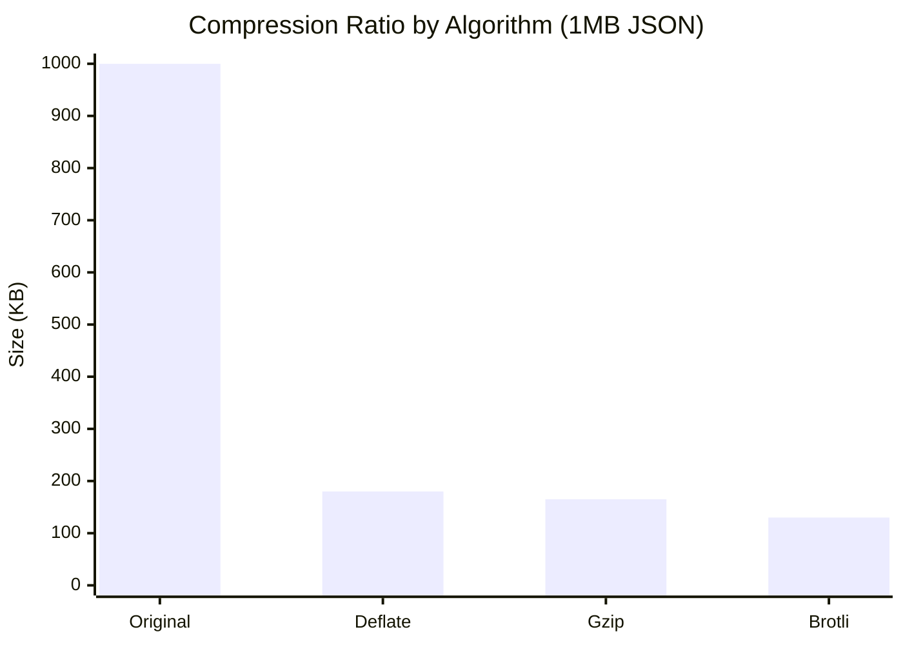
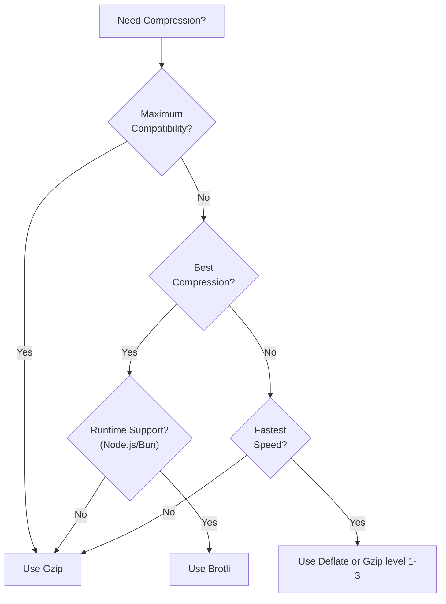

# Compression

> High-performance, multi-runtime response compression middleware with automatic content negotiation, BREACH attack mitigation, and Web Compression Streams API support.

## The Problem

Response compression is critical for web performance, but frameworks often make it either too magical or too complex.

**Magic without control.** Some frameworks compress everything without exposing what's happening. When compression causes issues (BREACH attacks, streaming problems), debugging becomes difficult.

**Node.js-only implementations.** Traditional libraries depend on Node.js `zlib`, breaking deployments to Deno, Cloudflare Workers, or other edge runtimes.

**Security is ignored.** BREACH attacks exploit compression ratios to leak secrets. Most compression middleware offers no protection against this well-known vulnerability.

**Content negotiation mistakes.** Incorrect `Accept-Encoding` parsing leads to sending Brotli to clients that can't decompress it, or missing optimization opportunities.

## How NextRush Approaches This

NextRush's compression middleware prioritizes **transparency, security, and portability**.

Every compression decision is deliberate:

1. **Web Compression Streams API** - Uses standard browser APIs that work across Node.js, Bun, Deno, and edge runtimes
2. **RFC-compliant content negotiation** - Parses `Accept-Encoding` with quality values and respects client preferences
3. **Smart content detection** - Only compresses content types that benefit (text, JSON, SVG) while skipping already-compressed formats (PNG, ZIP)
4. **BREACH attack mitigation** - Optional random padding prevents compression ratio analysis attacks
5. **Transparent behavior** - Compression stats available via `getCompressionInfo()` for debugging and monitoring

The result is compression that **works everywhere** and **fails safely**.

## Mental Model

Think of compression as a **post-processing filter** on responses:

```mermaid
flowchart TD
    A["📥 Your Handler Runs"] --> B["await ctx.next()"]
    B --> C{"Skip Conditions?"}
    C -->|HEAD request| D["⏭️ Skip"]
    C -->|204/304 status| D
    C -->|Already encoded| D
    C -->|Non-compressible type| D
    C -->|Below threshold| D
    C -->|None| E["Parse Accept-Encoding"]
    E --> F{"Negotiate Best<br/>Encoding"}
    F -->|br| G["📦 Compress with Brotli"]
    F -->|gzip| H["📦 Compress with Gzip"]
    F -->|deflate| I["📦 Compress with Deflate"]
    F -->|none supported| D
    G --> J["Set Content-Encoding"]
    H --> J
    I --> J
    J --> K["Update Content-Length"]
    K --> L["Add Vary: Accept-Encoding"]
    L --> M["📤 Compressed Response"]
    D --> N["📤 Uncompressed Response"]
```



Encoding priority follows browser preferences:

```
Client: Accept-Encoding: gzip, deflate, br;q=0.9
Server: Enabled: br, gzip

Result: gzip (br disabled due to lower quality value)
```

## Installation

```bash
pnpm add @nextrush/compression
```

## Basic Usage

```typescript
import { createApp } from '@nextrush/core';
import { compression } from '@nextrush/compression';

const app = createApp();

// Enable compression with sensible defaults
app.use(compression());

app.get('/api/data', (ctx) => {
  // Large responses are automatically compressed
  ctx.json({ data: 'Large response...'.repeat(1000) });
});
```

::: info What happens behind the scenes
When `compression()` middleware runs:
1. Calls `next()` to let your handler set the response
2. Parses `Accept-Encoding` header
3. Checks if response should be compressed
4. Selects best available encoding
5. Compresses the body using Web Compression Streams
6. Updates response headers
:::

## Configuration

```typescript
app.use(compression({
  // Encoding toggles (all enabled by default)
  gzip: true,
  deflate: true,
  brotli: true,  // Auto-disabled in runtimes without support

  // Compression level
  level: 6,  // 0-9 for gzip/deflate, 0-11 for brotli

  // Minimum response size to compress
  threshold: 1024,  // bytes

  // Content types to compress (supports wildcards)
  contentTypes: [
    'text/*',
    'application/json',
    'application/javascript',
    'application/xml',
    'image/svg+xml',
  ],

  // Content types to exclude
  exclude: [
    'image/png',
    'image/jpeg',
    'video/*',
    'audio/*',
    'application/zip',
  ],

  // Custom filter function
  filter: (ctx) => !ctx.path.startsWith('/stream'),

  // Enable BREACH attack mitigation
  breachMitigation: false,
}));
```

## Algorithm-Specific Middleware

Use single-algorithm middleware when you need precise control:

```typescript
import { gzip, deflate, brotli } from '@nextrush/compression';

// Gzip only - universal browser support
app.use(gzip({ level: 6 }));

// Deflate only - slightly faster, similar ratio
app.use(deflate({ level: 6 }));

// Brotli only - best compression (Node.js/Bun only)
app.use(brotli({ level: 4 }));
```

::: warning Brotli Runtime Support
Brotli is only available in Node.js and Bun. In Deno, Cloudflare Workers, and browser environments, the `brotli()` middleware will silently skip compression. Use `gzip()` for maximum compatibility.
:::

## Compression Levels

### Gzip/Deflate (0-9)

| Level | Speed | Ratio | Use Case |
|-------|-------|-------|----------|
| 0 | N/A | None | No compression |
| 1-3 | Fast | Low | Real-time streaming |
| 4-6 | Balanced | Medium | General purpose (default) |
| 7-9 | Slow | High | Static assets |

### Brotli (0-11)

| Level | Speed | Ratio | Use Case |
|-------|-------|-------|----------|
| 0-3 | Fast | Low | Real-time APIs |
| 4-6 | Balanced | Medium | Dynamic content (default) |
| 7-9 | Slow | High | API responses |
| 10-11 | Very Slow | Maximum | Pre-compressed static assets |

::: tip Brotli Level 4
Level 4 is the sweet spot for dynamic content. It compresses ~25% better than gzip-6 with similar CPU cost.
:::

## When to Use Each Algorithm

Understanding when to use Gzip, Deflate, or Brotli helps you optimize both performance and bandwidth.

### Gzip - The Universal Standard

**Best for:** Maximum compatibility, CDN caching, legacy client support

```typescript
app.use(gzip({ level: 6 }));
```

**Use Gzip when:**
- You need to support all browsers (including IE11)
- Your content is served through CDNs that may re-compress
- You're building public APIs consumed by unknown clients
- Response time is more critical than bandwidth savings

**Compression characteristics:**
- Supported by 99%+ of clients
- Good compression ratio (~70-80% reduction for text)
- Fast compression and decompression
- Well-suited for streaming

### Deflate - The Fast Alternative

**Best for:** Low-latency APIs, real-time applications, streaming

```typescript
app.use(deflate({ level: 4 }));
```

**Use Deflate when:**
- You need the fastest compression possible
- You're building WebSocket or SSE endpoints
- CPU resources are limited (edge/serverless)
- Response latency is more important than size

**Compression characteristics:**
- Slightly faster than Gzip (no header overhead)
- Similar compression ratio to Gzip
- Lower memory usage
- Less common in modern usage (Gzip preferred)

### Brotli - Maximum Compression

**Best for:** Static assets, bandwidth optimization, modern browsers

```typescript
app.use(brotli({ level: 4 }));
```

**Use Brotli when:**
- You're serving static assets that can be pre-compressed
- Bandwidth costs are significant
- You know your clients support Brotli (modern browsers)
- You're willing to trade CPU for smaller responses

**Compression characteristics:**
- 15-25% better compression than Gzip
- Slower compression (especially at high levels)
- Fast decompression in browsers
- Not available in all runtimes (Node.js/Bun only)

### Algorithm Comparison Table

| Algorithm | Compression | Speed | Browser Support | Runtime Support |
|-----------|-------------|-------|-----------------|-----------------|
| **Gzip** | Good | Fast | 99%+ | All |
| **Deflate** | Good | Fastest | 99%+ | All |
| **Brotli** | Best | Medium | 95%+ | Node.js, Bun |

### Compression Ratio Comparison (JSON API Response)



### When to Use Which Algorithm



### Recommended Configurations

**General Purpose API:**
```typescript
// Good balance of speed and compression
app.use(compression({
  gzip: true,
  brotli: true,
  deflate: false,  // Gzip is preferred
  level: 6,
}));
```

**High-Traffic Public API:**
```typescript
// Prioritize speed over compression
app.use(compression({
  gzip: true,
  brotli: false,  // Skip for speed
  level: 4,       // Lower level = faster
  threshold: 2048, // Only compress larger responses
}));
```

**Bandwidth-Optimized API:**
```typescript
// Prioritize compression over speed
app.use(compression({
  gzip: true,
  brotli: true,
  level: 9,       // Maximum compression
  threshold: 512, // Compress smaller responses too
}));
```

**Static Asset Server:**
```typescript
// Pre-compress with Brotli at build time, serve at runtime
app.use(compression({
  brotli: true,
  level: 11,  // Maximum for pre-compressed assets
}));
```

**Real-Time/Streaming API:**
```typescript
// Fastest possible compression
app.use(compression({
  gzip: true,
  brotli: false,
  level: 1,       // Minimal compression, maximum speed
  filter: (ctx) => !ctx.path.includes('/stream'),
}));
```

## Automatic Skip Conditions

Compression is automatically skipped in these cases:

| Condition | Reason |
|-----------|--------|
| `Content-Encoding` already set | Avoid double compression |
| Body size < `threshold` | Compression overhead exceeds benefit |
| Non-compressible content type | Images, video, archives already compressed |
| `HEAD` request | No response body |
| Status `204` or `304` | No content responses |
| No matching encoding | Client doesn't support available encodings |
| Custom `filter` returns `false` | Your exclusion logic |

```typescript
app.use(compression({
  filter: (ctx) => {
    // Skip Server-Sent Events
    if (ctx.path.startsWith('/events')) return false;
    // Skip file downloads
    if (ctx.path.startsWith('/downloads')) return false;
    return true;
  },
}));
```

## Security: BREACH Mitigation

BREACH attacks exploit compression to leak secrets by measuring response size changes. If your response contains both:

1. A secret (CSRF token, session ID)
2. User-controlled input (reflected in response)

Then compression can leak the secret byte-by-byte.

### Protection Options

**Option 1:** Disable compression for sensitive endpoints

```typescript
app.use('/api/public', compression());
// No compression for /api/sensitive routes
```

**Option 2:** Enable BREACH mitigation

```typescript
import { compression, secureCompressionOptions } from '@nextrush/compression';

app.use('/api/sensitive', compression(secureCompressionOptions({
  threshold: 512,
})));
```

The `breachMitigation` option adds random-length padding to prevent attackers from measuring compression ratios.

::: warning Performance Impact
BREACH mitigation adds 0-255 random bytes to each response. Only enable it for endpoints that return secrets alongside user input.
:::

## Monitoring Compression

Check compression results for debugging or metrics:

```typescript
import { compression, getCompressionInfo, wasCompressed } from '@nextrush/compression';

app.use(compression());

app.use(async (ctx) => {
  await ctx.next();

  if (wasCompressed(ctx)) {
    const info = getCompressionInfo(ctx);
    console.log({
      encoding: info?.encoding,       // 'gzip' | 'deflate' | 'br'
      originalSize: info?.originalSize,
      compressedSize: info?.compressedSize,
      ratio: info?.ratio,             // 0.0 - 1.0
      duration: info?.duration,       // milliseconds
    });
  }
});
```

## Content Type Detection

### Default Compressible Types

```typescript
// These types are compressed by default
'text/plain'
'text/html'
'text/css'
'text/javascript'
'text/xml'
'application/json'
'application/javascript'
'application/xml'
'application/xhtml+xml'
'application/rss+xml'
'application/ld+json'
'application/graphql+json'
'image/svg+xml'
'image/bmp'
'font/ttf'
'font/otf'
```

### Default Excluded Types

```typescript
// These types are NOT compressed (already compressed)
'image/png'
'image/jpeg'
'image/gif'
'image/webp'
'video/*'
'audio/*'
'application/zip'
'application/gzip'
'application/pdf'
'font/woff2'
```

### Custom Content Types

```typescript
app.use(compression({
  // Add custom compressible type
  contentTypes: [
    ...DEFAULT_COMPRESSIBLE_TYPES,
    'application/x-custom',
  ],

  // Exclude additional types
  exclude: [
    ...DEFAULT_EXCLUDED_TYPES,
    'application/x-no-compress',
  ],
}));
```

## Low-Level API

For advanced use cases, access compression utilities directly:

### Content Negotiation

```typescript
import {
  parseAcceptEncoding,
  negotiateEncoding,
  selectEncoding,
  isEncodingAccepted,
  getEncodingQuality,
  acceptsCompression,
  getAcceptedEncodings,
} from '@nextrush/compression';

// Parse Accept-Encoding header
const entries = parseAcceptEncoding('gzip, br;q=0.9, deflate;q=0.5');
// [{ encoding: 'gzip', quality: 1 }, { encoding: 'br', quality: 0.9 }, ...]

// Select best encoding
const encoding = selectEncoding('gzip, br', { brotli: true, gzip: true });
// 'br' (highest priority)

// Check if client accepts compression
const accepts = acceptsCompression('gzip, deflate');
// true

// Get quality value for specific encoding
const quality = getEncodingQuality('gzip;q=0.5, br', 'gzip');
// 0.5
```

### Content Type Detection

```typescript
import {
  isCompressible,
  isAlreadyCompressed,
  isTextContent,
  isBinaryContent,
  extractMimeType,
  getCompressionRecommendation,
} from '@nextrush/compression';

// Check if type should be compressed
isCompressible('application/json');  // true
isCompressible('image/png');         // false

// Check if already compressed
isAlreadyCompressed('application/zip');  // true

// Get recommendation with reason
const rec = getCompressionRecommendation('text/html');
// { shouldCompress: true, reason: 'Text content compresses well', estimatedRatio: 0.3 }
```

### Direct Compression

```typescript
import {
  compress,
  compressData,
  compressToBuffer,
  detectCapabilities,
  isEncodingSupported,
  estimateCompressedSize,
} from '@nextrush/compression';

// Full compression with stats
const result = await compress('Hello World!'.repeat(1000), 'gzip', { level: 6 });
console.log(result.info);
// { encoding: 'gzip', originalSize: 12000, compressedSize: 48, ratio: 0.004, duration: 1.2 }

// Simple compression
const data = await compressData('Hello World!', 'gzip');
// Uint8Array

// Node.js Buffer output
const buffer = await compressToBuffer('Hello World!', 'gzip');
// Buffer

// Check runtime capabilities
const caps = detectCapabilities();
// { hasCompressionStreams: true, hasNodeZlib: true, hasBrotli: true, runtime: 'node' }

// Check if encoding is supported
const supported = isEncodingSupported('br');
// true (in Node.js)

// Estimate compressed size without compressing
const estimate = estimateCompressedSize(10000, 'gzip', 'application/json');
// ~2400 (24% of original for JSON)
```

## Response Headers

The middleware automatically manages these headers:

```http
Content-Encoding: gzip
Content-Length: 1234
Vary: Accept-Encoding
```

### Vary Header

The `Vary: Accept-Encoding` header tells caches that the response varies based on the `Accept-Encoding` request header. This ensures:

- Different clients get appropriate encodings
- Caches store separate versions for different encodings
- CDNs serve the correct compressed version

## Error Handling

The middleware silently falls back to uncompressed responses on errors:

```typescript
import { CompressionError, CompressionErrorCode } from '@nextrush/compression';

// For direct API usage, handle errors explicitly
try {
  await compress(data, 'br');
} catch (error) {
  if (error instanceof CompressionError) {
    switch (error.code) {
      case CompressionErrorCode.ENCODING_NOT_SUPPORTED:
        // Fall back to gzip
        return compress(data, 'gzip');
      case CompressionErrorCode.SUSPICIOUS_RATIO:
        // Possible decompression bomb
        throw new Error('Invalid compression ratio');
      default:
        // Other compression error
        throw error;
    }
  }
}
```

## Runtime Compatibility

| Runtime | Gzip | Deflate | Brotli | Implementation |
|---------|:----:|:-------:|:------:|----------------|
| Node.js 17+ | ✅ | ✅ | ✅ | Web Streams + zlib |
| Bun | ✅ | ✅ | ✅ | Web Streams |
| Deno | ✅ | ✅ | ❌ | Web Streams |
| Cloudflare Workers | ✅ | ✅ | ❌ | Web Streams |
| Vercel Edge | ✅ | ✅ | ❌ | Web Streams |

::: info Why Web Compression Streams?
The Web Compression Streams API is a standard browser API available in all modern runtimes. It provides consistent behavior across platforms without requiring Node.js-specific code.
:::

## Performance Tips

### 1. Choose Appropriate Levels

```typescript
// Dynamic API responses
app.use('/api', compression({ level: 4 }));

// Static assets (if not pre-compressed)
app.use('/static', compression({ level: 9 }));
```

### 2. Increase Threshold for High Traffic

```typescript
// Reduce CPU usage by skipping small responses
app.use(compression({
  threshold: 2048,  // 2KB minimum
}));
```

### 3. Pre-compress Static Assets

For maximum compression on static files, pre-compress offline:

```bash
# Pre-compress with Brotli level 11
brotli -q 11 bundle.js
gzip -9k bundle.js
```

Then serve pre-compressed files directly.

### 4. Filter Streaming Endpoints

```typescript
app.use(compression({
  filter: (ctx) => {
    // Don't compress SSE
    if (ctx.path.startsWith('/events')) return false;
    // Don't compress WebSocket upgrade
    if (ctx.headers.upgrade === 'websocket') return false;
    // Don't compress large file downloads
    if (ctx.path.startsWith('/downloads')) return false;
    return true;
  },
}));
```

## Common Mistakes

### Compressing Already-Compressed Content

```typescript
// ❌ PNG is already compressed - wastes CPU
app.use('/images', compression({
  contentTypes: ['image/*'],  // Don't do this
}));

// ✅ Let defaults handle it
app.use(compression());  // Skips PNG, JPEG, etc.
```

### Too-Low Threshold

```typescript
// ❌ Compressing tiny responses wastes CPU
app.use(compression({ threshold: 100 }));

// ✅ Use reasonable threshold
app.use(compression({ threshold: 1024 }));
```

### Ignoring BREACH Risks

```typescript
// ❌ Compressing responses with secrets and user input
app.post('/api/profile', (ctx) => {
  ctx.json({
    csrfToken: ctx.state.csrf,  // Secret!
    name: ctx.body.name,        // User input!
  });
});

// ✅ Disable compression or enable mitigation
app.use('/api/sensitive', compression({ breachMitigation: true }));
```

### Missing Vary Header in Custom Implementations

```typescript
// ❌ Custom compression without Vary header
ctx.set('Content-Encoding', 'gzip');
// Missing: ctx.set('Vary', 'Accept-Encoding');

// ✅ Use the middleware - it handles Vary automatically
app.use(compression());
```

## Types

```typescript
import type {
  // Core types
  CompressionEncoding,         // 'gzip' | 'deflate' | 'br'
  CompressionOptions,          // Middleware options
  CompressionInfo,             // Result statistics
  CompressionResult,           // { data, info }

  // Negotiation types
  AcceptEncodingEntry,         // { encoding, quality }
  NegotiationResult,           // { encoding, accepted }

  // Runtime types
  RuntimeCapabilities,         // Runtime detection result

  // Middleware types
  CompressionMiddleware,       // Middleware function type
  CompressionState,            // Context state extension
} from '@nextrush/compression';
```

## Constants

```typescript
import {
  // Defaults
  DEFAULT_THRESHOLD,           // 1024
  DEFAULT_COMPRESSION_LEVEL,   // 6
  DEFAULT_COMPRESSIBLE_TYPES,  // Array of MIME types
  DEFAULT_EXCLUDED_TYPES,      // Array of MIME types
  DEFAULT_OPTIONS,             // Full defaults object

  // Limits
  MAX_ZLIB_LEVEL,              // 9
  MAX_BROTLI_LEVEL,            // 11
  MAX_COMPRESSION_RATIO,       // 1000 (bomb protection)
  MAX_IN_MEMORY_SIZE,          // 10MB

  // Protocol
  ENCODING_PRIORITY,           // ['deflate', 'gzip', 'br']
  VARY_HEADER,                 // 'Accept-Encoding'
  NO_BODY_METHODS,             // ['HEAD']
  NO_COMPRESS_STATUS_CODES,    // [204, 304]
} from '@nextrush/compression';
```

## See Also

- [HTTP Compression - MDN](https://developer.mozilla.org/en-US/docs/Web/HTTP/Compression)
- [BREACH Attack Paper](https://www.breachattack.com/)
- [Web Compression Streams API](https://developer.mozilla.org/en-US/docs/Web/API/CompressionStream)
- [Helmet Middleware](/middleware/helmet) - Security headers
- [CORS Middleware](/middleware/cors) - Cross-origin resource sharing
