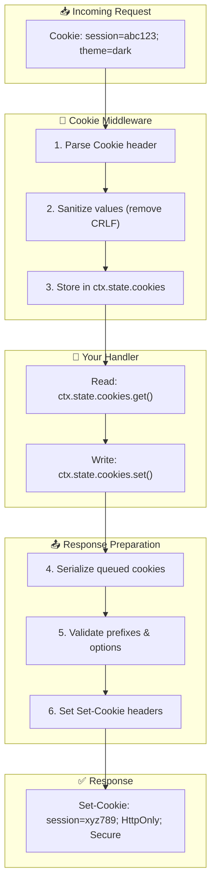
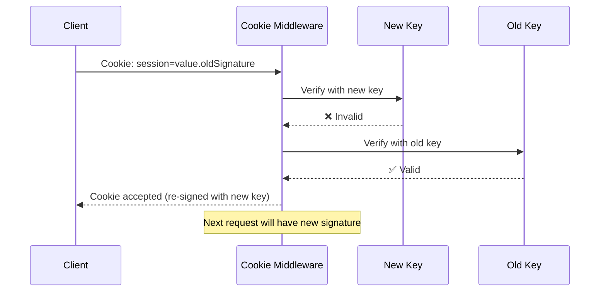

# Cookies

> Secure, RFC 6265-compliant cookie middleware with HMAC signing, CRLF injection protection, and key rotation support.

## The Problem

Cookies seem simple until they're not. Session hijacking, CRLF injection, cross-site request forgery—these attacks exploit frameworks that treat cookies as plain strings.

**Security is an afterthought in most libraries.** Developers must manually handle encoding, validation, and signing. One missed edge case, and attackers have an entry point.

**Magic obscures behavior.** Some frameworks auto-sign everything with no way to understand or customize. When something goes wrong, debugging becomes guesswork.

**Key rotation breaks sessions.** Changing your signing secret invalidates all existing sessions. Most libraries offer no graceful migration path, forcing service downtime.

## How NextRush Approaches This

NextRush's cookie middleware treats **security as a default**, not an option.

Every cookie operation passes through validation:

1. **CRLF injection prevention** - Values are sanitized before serialization
2. **Cookie prefix enforcement** - `__Secure-` and `__Host-` requirements validated automatically
3. **Public suffix blocking** - Cannot set cookies on TLDs like `.com`
4. **Size limits** - Cookies exceeding 4KB are rejected
5. **HMAC-SHA256 signing** - Web Crypto API for runtime compatibility
6. **Key rotation support** - Verify with current key, fall back to previous keys

The result is a cookie system that is both **secure by default** and **transparent in behavior**.

## Mental Model

Think of this middleware as a **cookie vault**:



Signed cookies add a **tamper-detection layer**:

```
Original: session=abc123
Signed:   session=abc123.HmacSignature
```

If someone modifies `abc123`, the signature won't match, and `get()` returns `undefined`.

## Installation

```bash
pnpm add @nextrush/cookies
```

## Basic Usage

```typescript
import { createApp } from '@nextrush/core';
import { cookies } from '@nextrush/cookies';

const app = createApp();

app.use(cookies());

app.get('/profile', async (ctx) => {
  const session = ctx.state.cookies.get('session');
  ctx.json({ session });
});

app.post('/login', async (ctx) => {
  ctx.state.cookies.set('session', 'user-123', {
    httpOnly: true,
    secure: true,
    maxAge: 86400, // 1 day in seconds
  });
  ctx.json({ success: true });
});

app.post('/logout', async (ctx) => {
  ctx.state.cookies.delete('session');
  ctx.json({ success: true });
});
```

::: info What happens behind the scenes
When `cookies()` middleware runs:
1. Parses the `Cookie` header from the request
2. Sanitizes values (removes CRLF sequences)
3. Attaches `ctx.state.cookies` API
4. After your handler, serializes queued cookies
5. Validates cookie names, values, and options
6. Sets `Set-Cookie` headers on the response
:::

## Signed Cookies

For tamper-proof cookies, use the signed cookies middleware:

```typescript
import { signedCookies } from '@nextrush/cookies';

app.use(signedCookies({
  secret: process.env.COOKIE_SECRET!,
}));

app.post('/auth', async (ctx) => {
  await ctx.state.signedCookies.set('userId', 'user-456', {
    httpOnly: true,
    secure: true,
  });
  ctx.json({ success: true });
});

app.get('/profile', async (ctx) => {
  const userId = await ctx.state.signedCookies.get('userId');
  if (!userId) {
    ctx.status = 401;
    return ctx.json({ error: 'Invalid session' });
  }
  ctx.json({ userId });
});
```

::: warning Async Operations Required
Signed cookie operations use the Web Crypto API and return Promises. Always `await` the result:
```typescript
// ❌ Returns Promise, not value
const userId = ctx.state.signedCookies.get('userId');

// ✅ Correct
const userId = await ctx.state.signedCookies.get('userId');
```
:::

### Key Rotation

When rotating secrets, provide previous keys to maintain session continuity:

```typescript
app.use(signedCookies({
  secret: process.env.COOKIE_SECRET_NEW!,
  previousSecrets: [
    process.env.COOKIE_SECRET_OLD!,
  ],
}));
```

**Key Rotation Flow:**



During rotation:
1. New cookies are signed with `secret`
2. Verification tries `secret` first, then `previousSecrets` in order
3. Old sessions remain valid until they naturally expire

## Security Features

### CRLF Injection Prevention

Cookie values are automatically sanitized:

```typescript
// Attacker tries: "value\r\nSet-Cookie: evil=payload"
// Result: "valueSet-Cookie: evil=payload" (CRLF removed)
ctx.state.cookies.set('safe', 'value\r\nSet-Cookie: evil=payload');
```

::: tip Why This Matters
CRLF injection allows attackers to inject arbitrary HTTP headers. By sanitizing values before serialization, NextRush prevents this class of attacks entirely.
:::

### Cookie Prefix Enforcement

The `__Secure-` and `__Host-` prefixes have strict requirements enforced by browsers. NextRush validates these requirements at serialization time:

```typescript
import { serializeCookie } from '@nextrush/cookies';

// ✅ Valid: __Secure- requires secure=true
serializeCookie('__Secure-token', 'value', { secure: true });

// ✅ Valid: __Host- requires secure=true, path='/', no domain
serializeCookie('__Host-session', 'value', { secure: true, path: '/' });

// ❌ Throws SecurityError: __Secure- without secure flag
serializeCookie('__Secure-token', 'value', { secure: false });

// ❌ Throws SecurityError: __Host- with domain
serializeCookie('__Host-session', 'value', {
  secure: true,
  domain: 'example.com'
});
```

### Public Suffix Blocking

Prevents setting cookies on top-level domains:

```typescript
// ❌ Throws SecurityError: Cannot set cookie on public suffix
serializeCookie('session', 'value', { domain: '.com' });
serializeCookie('session', 'value', { domain: '.co.uk' });
```

### Size Limits

Cookies exceeding 4KB are rejected:

```typescript
// ❌ Throws RangeError: Cookie exceeds maximum size
serializeCookie('huge', 'x'.repeat(5000));
```

## Cookie Options

```typescript
interface CookieOptions {
  domain?: string;              // Cookie domain
  expires?: Date | number;      // Expiration date or timestamp
  httpOnly?: boolean;           // Prevent JavaScript access
  maxAge?: number;              // Max age in seconds
  path?: string;                // Cookie path (default: '/')
  sameSite?: 'strict' | 'lax' | 'none' | boolean;
  secure?: boolean;             // HTTPS only
  priority?: 'low' | 'medium' | 'high';
  partitioned?: boolean;        // CHIPS: Third-party cookie partitioning
}
```

### Secure Defaults

NextRush applies secure defaults to all cookies:

| Option | Default | Reason |
|--------|---------|--------|
| `httpOnly` | `true` | Prevents XSS cookie theft |
| `sameSite` | `'lax'` | Prevents CSRF while allowing top-level navigation |
| `path` | `'/'` | Consistent cookie availability |

To override defaults, explicitly set the option:

```typescript
ctx.state.cookies.set('token', 'value', {
  httpOnly: false,  // Allow JavaScript access
  sameSite: 'none', // Allow cross-site requests
  secure: true,     // Required with sameSite='none'
});
```

## Helper Functions

### `secureOptions(options?)`

Returns a preset for secure cookies:

```typescript
import { secureOptions } from '@nextrush/cookies';

ctx.state.cookies.set('session', value, secureOptions({ maxAge: 86400 }));
// Result: httpOnly: true, secure: true, sameSite: 'strict', path: '/', maxAge: 86400
```

### `sessionOptions(options?)`

Returns a preset for session cookies (expire when browser closes):

```typescript
import { sessionOptions } from '@nextrush/cookies';

ctx.state.cookies.set('temp', value, sessionOptions());
// Result: httpOnly: true, secure: true, sameSite: 'strict', path: '/'
// No maxAge or expires - browser deletes on close
```

### `createSecurePrefixCookie(name, value, options?)`

Create a `__Secure-` prefixed cookie:

```typescript
import { createSecurePrefixCookie } from '@nextrush/cookies';

const header = createSecurePrefixCookie('token', 'value', { maxAge: 3600 });
// Validates prefix requirements, returns serialized cookie
```

### `createHostPrefixCookie(name, value, options?)`

Create a `__Host-` prefixed cookie:

```typescript
import { createHostPrefixCookie } from '@nextrush/cookies';

const header = createHostPrefixCookie('session', 'value');
// Validates: secure=true, path='/', no domain
```

## Utility Functions

### Parsing

```typescript
import { parseCookies, getCookie, hasCookie, getCookieNames } from '@nextrush/cookies';

// Parse Cookie header
const cookies = parseCookies('name=value; session=abc123');
// { name: 'value', session: 'abc123' }

// Get single cookie
const session = getCookie('name=value; session=abc123', 'session');
// 'abc123'

// Check existence
const hasSession = hasCookie('name=value; session=abc123', 'session');
// true

// Get all names
const names = getCookieNames('name=value; session=abc123');
// ['name', 'session']
```

### Serialization

```typescript
import { serializeCookie, createDeleteCookie } from '@nextrush/cookies';

// Serialize for Set-Cookie header
const header = serializeCookie('session', 'abc123', {
  httpOnly: true,
  secure: true,
});
// 'session=abc123; Path=/; HttpOnly; Secure; SameSite=Lax'

// Create deletion cookie
const deleteHeader = createDeleteCookie('session');
// 'session=; Path=/; Expires=Thu, 01 Jan 1970 00:00:00 GMT; Max-Age=0'
```

### Signing

```typescript
import { signCookie, unsignCookie, unsignCookieWithRotation } from '@nextrush/cookies';

// Sign a value
const signed = await signCookie('user-123', 'secret');
// 'user-123.BASE64_SIGNATURE'

// Verify and extract
const value = await unsignCookie(signed, 'secret');
// 'user-123' or undefined if tampered

// Verify with key rotation
const value = await unsignCookieWithRotation(signed, {
  current: 'new-secret',
  previous: ['old-secret'],
});
```

## API Reference

### Middleware

#### `cookies(options?)`

Creates cookie middleware that adds `ctx.state.cookies`.

**Signature:**

```typescript
function cookies(options?: CookieMiddlewareOptions): Middleware
```

**Options:**

| Option | Type | Default | Description |
|--------|------|---------|-------------|
| `decode` | `boolean` | `true` | URL-decode cookie values |
| `sanitize` | `boolean` | `true` | Remove CRLF from values |

**Context API (`ctx.state.cookies`):**

| Method | Signature | Description |
|--------|-----------|-------------|
| `get` | `(name: string) => string \| undefined` | Get cookie value |
| `set` | `(name: string, value: string, options?: CookieOptions) => void` | Set cookie |
| `delete` | `(name: string, options?: CookieOptions) => void` | Delete cookie |
| `all` | `() => Record<string, string>` | Get all cookies |
| `has` | `(name: string) => boolean` | Check if cookie exists |

#### `signedCookies(options)`

Creates signed cookie middleware that adds `ctx.state.signedCookies`.

**Signature:**

```typescript
function signedCookies(options: SignedCookieMiddlewareOptions): Middleware
```

**Options:**

| Option | Type | Required | Description |
|--------|------|----------|-------------|
| `secret` | `string` | Yes | Current signing secret |
| `previousSecrets` | `string[]` | No | Previous secrets for key rotation |

**Context API (`ctx.state.signedCookies`):**

| Method | Signature | Description |
|--------|-----------|-------------|
| `get` | `(name: string) => Promise<string \| undefined>` | Get and verify signed cookie |
| `set` | `(name: string, value: string, options?: CookieOptions) => Promise<void>` | Set signed cookie |
| `delete` | `(name: string, options?: CookieOptions) => void` | Delete cookie |
| `allRaw` | `() => Record<string, string>` | Get all raw (unverified) cookies |

### Types

```typescript
import type {
  CookieOptions,
  CookieContext,
  SignedCookieContext,
  ParseOptions,
  SameSiteValue,
  CookiePriority,
  SignedCookieMiddlewareOptions,
} from '@nextrush/cookies';
```

## Common Mistakes

### Setting secure cookies without HTTPS

```typescript
// ❌ Won't work: secure cookies require HTTPS
ctx.state.cookies.set('session', 'value', { secure: true });
// Browser ignores cookie on HTTP
```

**Solution:** Use `secure: true` only in production with HTTPS.

### Using SameSite=None without Secure

```typescript
// ❌ Browsers reject this combination
ctx.state.cookies.set('cross', 'value', { sameSite: 'none' });
```

**Solution:** Always pair `sameSite: 'none'` with `secure: true`:

```typescript
ctx.state.cookies.set('cross', 'value', {
  sameSite: 'none',
  secure: true
});
```

### Forgetting to await signed cookie operations

```typescript
// ❌ Returns Promise, not value
const userId = ctx.state.signedCookies.get('userId');

// ✅ Correct
const userId = await ctx.state.signedCookies.get('userId');
```

### Setting cookies on public suffixes

```typescript
// ❌ Throws SecurityError
ctx.state.cookies.set('session', 'value', { domain: '.com' });
```

**Solution:** Use your actual domain:

```typescript
ctx.state.cookies.set('session', 'value', { domain: '.example.com' });
```

## When NOT to Use Cookies

- **Large data storage** - Cookies have a 4KB limit. Use sessions with server-side storage.
- **Sensitive data without signing** - Never store passwords or tokens in unsigned cookies.
- **Cross-domain state** - Consider tokens or other mechanisms for cross-origin authentication.
- **Mobile APIs** - Mobile apps typically use token-based auth, not cookies.

## Runtime Compatibility

This package uses the Web Crypto API and works in:

| Runtime | Supported |
|---------|-----------|
| Node.js 20+ | ✅ |
| Bun | ✅ |
| Cloudflare Workers | ✅ |
| Deno | ✅ |
| Vercel Edge Runtime | ✅ |

## Security Checklist

Before deploying to production:

- [ ] Use `httpOnly: true` for session cookies
- [ ] Use `secure: true` in production (HTTPS required)
- [ ] Use `sameSite: 'strict'` or `'lax'` for CSRF protection
- [ ] Use signed cookies for any security-sensitive data
- [ ] Store secrets in environment variables, not code
- [ ] Implement key rotation before secrets expire
- [ ] Set appropriate `maxAge` or `expires` values
- [ ] Consider `__Host-` prefix for session cookies

## See Also

- [RFC 6265 - HTTP State Management](https://datatracker.ietf.org/doc/html/rfc6265)
- [OWASP Session Management Cheat Sheet](https://cheatsheetseries.owasp.org/cheatsheets/Session_Management_Cheat_Sheet.html)
- [Body Parser Middleware](/middleware/body-parser) - Request body parsing
- [CORS Middleware](/middleware/cors) - Cross-origin resource sharing
