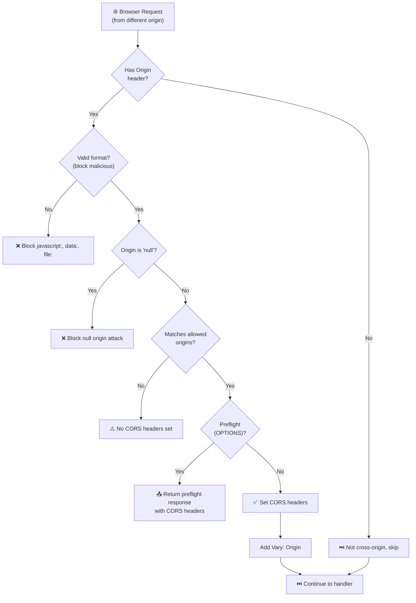

# CORS Middleware

> Enterprise-grade Cross-Origin Resource Sharing with built-in protection against common security vulnerabilities.

## The Problem

CORS is one of the most misconfigured security features on the web. Every API that serves different origins faces the same challenges:

**Security misconfigurations are everywhere.** Using `origin: '*'` with `credentials: true` allows any website to steal user sessions. Reflecting origins without validation enables CSRF attacks. Most developers learn this the hard way—after a security audit.

**Null origin attacks bypass naive validation.** Requests from `file://` URLs, `data:` URLs, and sandboxed iframes send `Origin: null`. Many CORS implementations accept this as a valid origin, creating a massive security hole.

**Regex patterns can crash your server.** Using regular expressions for origin matching is convenient, but patterns with nested quantifiers can trigger catastrophic backtracking (ReDoS), freezing your server for minutes.

**Private Network Access is silently blocked.** Modern browsers require explicit permission for public websites to access local network resources. Without PNA support, legitimate development workflows break mysteriously.

## How NextRush Approaches This

NextRush's CORS middleware treats **security as a first-class feature**, not an afterthought.

Instead of blindly echoing origins, every request passes through validation layers:

1. **Origin format validation** blocks `javascript:`, `data:`, and `file:` protocols
2. **Null origin protection** blocks requests from sandboxed contexts
3. **Credential + wildcard validation** throws errors at configuration time
4. **ReDoS detection** warns about dangerous regex patterns
5. **Fail-secure validators** block requests when custom validators throw errors

The result is a CORS middleware that is both **secure by default** and **flexible for complex use cases**.

## Mental Model

Think of CORS middleware as a **security checkpoint** for cross-origin requests:



Anything that doesn't pass validation simply doesn't receive CORS headers, which means the browser blocks the response from JavaScript.

## Installation

```bash
pnpm add @nextrush/cors
```

## Basic Usage

```typescript
import { createApp } from '@nextrush/core';
import { serve } from '@nextrush/adapter-node';
import { cors } from '@nextrush/cors';

const app = createApp();

// Secure CORS for production
app.use(cors({
  origin: 'https://app.example.com',
  credentials: true,
}));

app.get('/api/data', (ctx) => {
  ctx.json({ message: 'Hello from API' });
});

await serve(app, { port: 3000 });
```

::: info What happens behind the scenes
When `cors()` middleware runs:
1. Checks for `Origin` header (skips if not a cross-origin request)
2. Validates origin format (blocks malicious protocols)
3. Checks origin against your configuration
4. Sets `Access-Control-Allow-Origin` if allowed
5. Handles preflight (OPTIONS) with appropriate headers
6. Always sets `Vary: Origin` for proper caching
:::

## API Reference

### Main Function

```typescript
cors(options?: CorsOptions): Middleware
```

Create CORS middleware with comprehensive security features.

### Options

| Option | Type | Default | Description |
|--------|------|---------|-------------|
| `origin` | `boolean \| string \| string[] \| RegExp \| Function` | `false` | Origin validation |
| `methods` | `string \| string[]` | `'GET,HEAD,PUT,PATCH,POST,DELETE'` | Allowed methods |
| `allowedHeaders` | `string \| string[]` | _reflected_ | Allowed request headers |
| `exposedHeaders` | `string \| string[]` | `undefined` | Headers client can read |
| `credentials` | `boolean` | `false` | Allow cookies/auth |
| `maxAge` | `number` | `undefined` | Preflight cache (seconds) |
| `privateNetworkAccess` | `boolean` | `false` | Enable PNA |
| `blockNullOrigin` | `boolean` | `true` | Block null origins |
| `preflightContinue` | `boolean` | `false` | Pass OPTIONS to next |
| `optionsSuccessStatus` | `number` | `204` | Status for OPTIONS |

### Preset Functions

```typescript
import { simpleCors, strictCors, devCors, internalCors, staticAssetsCors } from '@nextrush/cors';

// Permissive - for development or public APIs
simpleCors(): Middleware

// Strict - for authenticated APIs (origin required)
strictCors(
  origin: string | string[] | OriginValidator,
  options?: Omit<CorsOptions, 'origin' | 'credentials'>
): Middleware

// Development - allows localhost with PNA enabled
devCors(additionalOrigins?: string[]): Middleware

// Internal APIs - for microservice-to-microservice
internalCors(internalDomains: string[]): Middleware

// Static assets - optimized for CDN/asset serving
staticAssetsCors(origins?: string | string[]): Middleware
```

## Origin Configuration

### String (Exact Match)

```typescript
cors({ origin: 'https://example.com' })
```

Only requests from exactly `https://example.com` are allowed. Case-sensitive.

### Array (Whitelist)

```typescript
cors({
  origin: [
    'https://app.example.com',
    'https://admin.example.com',
    'https://staging.example.com',
  ]
})
```

Any origin in the array is allowed. Use this for multi-domain setups.

### Boolean

```typescript
// Reflect mode - echoes request origin (DANGEROUS)
cors({ origin: true })

// Disabled - no CORS headers added
cors({ origin: false })
```

::: warning Using origin: true is dangerous
Reflecting all origins with credentials enabled allows any website to make authenticated requests to your API. Use only in development or with explicit security review.
:::

### RegExp (Pattern Match)

```typescript
// Match all subdomains
cors({ origin: /\.example\.com$/ })

// Match specific subdomains
cors({ origin: /^https:\/\/(app|admin)\.example\.com$/ })
```

::: danger ReDoS Warning
Avoid patterns with nested quantifiers like `(.*)+` or `(.+)*`. These can cause catastrophic backtracking that freezes your server. The middleware warns about detected dangerous patterns.
:::

### Function (Dynamic Validation)

```typescript
// Synchronous
cors({
  origin: (origin, ctx) => {
    return origin.endsWith('.example.com');
  }
})

// Asynchronous (database lookup)
cors({
  origin: async (origin, ctx) => {
    const tenantId = ctx.get('X-Tenant-Id');
    const allowed = await db.getAllowedOrigins(tenantId);
    return allowed.includes(origin);
  }
})

// Return custom origin string
cors({
  origin: (origin, ctx) => {
    if (isAllowed(origin)) {
      return origin; // Return the allowed origin
    }
    return false; // Block
  }
})
```

**Validator signature:**

```typescript
type OriginValidator = (
  origin: string,
  ctx: CorsContext
) => boolean | string | Promise<boolean | string>;
```

## Security Features

### Null Origin Protection

The `null` origin appears in requests from:
- Local `file://` pages
- `data:` URLs
- Sandboxed `<iframe>` elements
- Some redirect scenarios

**Problem:** Many CORS libraries accept `null` as a valid origin, allowing attackers to send requests from local HTML files or sandboxed iframes.

**Solution:** NextRush blocks null origins by default.

```typescript
// Default: null origins blocked
cors({ origin: 'https://example.com' })
// Request with Origin: null → Blocked (no CORS headers)

// Explicitly allow (requires justification)
cors({
  origin: true,
  blockNullOrigin: false,
})
```

### Malformed Origin Rejection

Origins using dangerous protocols are automatically blocked:

```typescript
// These are blocked automatically:
// javascript:void(0)
// data:text/html,<h1>Evil</h1>
// file:///etc/passwd
// ftp://malicious.com
// anything not starting with http:// or https://
```

A security warning is logged in development when malformed origins are rejected.

### Credential + Wildcard Validation

The CORS spec forbids `Access-Control-Allow-Origin: *` with `credentials: true`. This middleware **throws an error at configuration time**:

```typescript
// ❌ This throws an error immediately
cors({
  origin: '*',
  credentials: true,
})
// Error: Cannot use credentials=true with origin="*"

// ✅ Use explicit origin instead
cors({
  origin: 'https://app.example.com',
  credentials: true,
})
```

::: tip Why at configuration time?
Catching this error at startup is better than silently failing in production or sending insecure headers. You'll know about the misconfiguration before deploying.
:::

### ReDoS Mitigation

The middleware detects potentially dangerous regex patterns:

```typescript
// ⚠️ Logs warning for dangerous patterns:
cors({ origin: /(.*)+\.example\.com/ })  // (.*)+
cors({ origin: /(.+)+\.example\.com/ })  // (.+)+
cors({ origin: /(.+)*\.example\.com/ })  // (.+)*

// ✅ Safe patterns (no warning):
cors({ origin: /\.example\.com$/ })
cors({ origin: /^https:\/\/[a-z]+\.example\.com$/ })
```

### Validator Error Handling

If your custom origin validator throws an error, the middleware:
1. Logs a security warning with the error
2. Blocks the request (fail-secure)
3. Continues without crashing

```typescript
cors({
  origin: async (origin) => {
    // If this throws, request is blocked safely
    const result = await db.checkOrigin(origin);
    return result;
  }
})
```

### Private Network Access (PNA)

Enable PNA for local development servers accessed from public sites:

```typescript
cors({
  origin: 'https://external-app.com',
  privateNetworkAccess: true,
})
```

When a browser sends `Access-Control-Request-Private-Network: true` in a preflight, the middleware responds with `Access-Control-Allow-Private-Network: true`.

**Use cases:**
- Local development tools accessed from cloud IDEs
- IoT device configuration from web dashboards
- Internal network services accessed from public web apps

::: info What is Private Network Access?
PNA is a security feature that requires explicit permission for public websites to access local/private network resources. Without it, `fetch('http://localhost:3000')` from a public site is blocked.
:::

## Preflight Handling

Preflight requests (OPTIONS with `Access-Control-Request-Method`) are handled automatically:

```typescript
app.use(cors({
  methods: ['GET', 'POST', 'PUT', 'DELETE', 'PATCH'],
  allowedHeaders: ['Content-Type', 'Authorization', 'X-Custom-Header'],
  maxAge: 86400, // Cache preflight for 24 hours
}));
```

### Custom Preflight Handling

```typescript
app.use(cors({
  preflightContinue: true, // Pass OPTIONS to next middleware
}));

// Custom handler
app.options('/api/special', (ctx) => {
  ctx.set('X-Custom-Preflight', 'handled');
  ctx.status = 204;
});
```

### Headers Reflected

If `allowedHeaders` is not specified, the middleware reflects the `Access-Control-Request-Headers` from the preflight request.

## Common Patterns

### API with Frontend SPA

```typescript
app.use(cors({
  origin: process.env.FRONTEND_URL,
  credentials: true,
  exposedHeaders: ['X-Request-Id', 'X-RateLimit-Remaining'],
  maxAge: 86400,
}));
```

### Public Read-Only API

```typescript
app.use(cors({
  origin: '*',
  methods: ['GET', 'HEAD'],
  maxAge: 86400,
}));
```

### Multi-Tenant SaaS

```typescript
app.use(cors({
  origin: async (origin, ctx) => {
    const tenantId = ctx.get('X-Tenant-Id');
    if (!tenantId) return false;

    const tenant = await db.getTenant(tenantId);
    return tenant.allowedOrigins.includes(origin);
  },
  credentials: true,
}));
```

### Development vs Production

```typescript
const corsOptions = process.env.NODE_ENV === 'production'
  ? {
      origin: ['https://app.example.com', 'https://admin.example.com'],
      credentials: true,
    }
  : {
      origin: true,  // Reflect all origins in development
      credentials: true,
    };

app.use(cors(corsOptions));
```

### Using Presets

```typescript
import { simpleCors, strictCors, devCors, internalCors, staticAssetsCors } from '@nextrush/cors';

// Development: permissive with localhost support
if (process.env.NODE_ENV === 'development') {
  app.use(devCors(['https://staging.example.com']));
}

// Production: strict with credentials
app.use(strictCors('https://app.example.com', {
  exposedHeaders: ['X-Request-Id'],
  maxAge: 86400,
}));

// Internal microservices
app.use(internalCors([
  'https://service1.internal.example.com',
  'https://service2.internal.example.com',
]));

// Static assets / CDN
app.use('/assets', staticAssetsCors(['https://example.com', 'https://cdn.example.com']));
```

## Headers Set

| Header | When Set | Description |
|--------|----------|-------------|
| `Access-Control-Allow-Origin` | Always (if allowed) | The allowed origin or `*` |
| `Access-Control-Allow-Methods` | Preflight only | Allowed HTTP methods |
| `Access-Control-Allow-Headers` | Preflight only | Allowed request headers |
| `Access-Control-Allow-Credentials` | When `credentials: true` | Enables cookies/auth |
| `Access-Control-Expose-Headers` | When configured | Headers client can read |
| `Access-Control-Max-Age` | When configured | Preflight cache duration |
| `Access-Control-Allow-Private-Network` | When PNA requested | Enables private network access |
| `Vary` | Always | `Origin` (and preflight headers) |

## Error Handling

CORS errors are silent—no CORS headers are set, and the browser blocks the response:

```typescript
// For debugging, wrap your CORS configuration
app.use(cors({
  origin: (origin, ctx) => {
    const allowed = ['https://app.example.com'];
    const isAllowed = allowed.includes(origin);

    if (!isAllowed && process.env.NODE_ENV !== 'production') {
      console.warn(`CORS: Blocked origin ${origin}`);
    }

    return isAllowed;
  }
}));
```

## Common Mistakes

### Mistake 1: Wildcard with Credentials

```typescript
// ❌ THROWS ERROR: Security violation
cors({
  origin: '*',
  credentials: true,
})

// ✅ Use explicit origin
cors({
  origin: 'https://app.example.com',
  credentials: true,
})
```

### Mistake 2: Missing CORS Middleware

```typescript
// ❌ Browser blocks the response
app.get('/api/data', (ctx) => {
  ctx.json({ data: 'value' });
});

// ✅ Add CORS middleware before routes
app.use(cors({ origin: 'https://app.example.com' }));
app.get('/api/data', (ctx) => {
  ctx.json({ data: 'value' });
});
```

### Mistake 3: Wrong Middleware Order

```typescript
// ❌ Authentication fails before CORS headers are set
app.use(authMiddleware);
app.use(cors({ origin: 'https://app.example.com' }));

// ✅ CORS first, then authentication
app.use(cors({ origin: 'https://app.example.com' }));
app.use(authMiddleware);
```

### Mistake 4: Dangerous Regex Patterns

```typescript
// ❌ ReDoS vulnerability
cors({ origin: /(.*)+\.example\.com/ })

// ✅ Safe pattern
cors({ origin: /\.example\.com$/ })
```

### Mistake 5: Using origin: true in Production

```typescript
// ❌ Allows any origin to make credentialed requests
app.use(cors({
  origin: true,
  credentials: true,
}));

// ✅ Use explicit whitelist
app.use(cors({
  origin: ['https://app.example.com', 'https://admin.example.com'],
  credentials: true,
}));
```

## TypeScript Types

All types are exported:

```typescript
import type {
  CorsOptions,
  OriginValidator,
  CorsContext,
  CorsMiddleware,
  Context,
  Middleware,
  Next,
} from '@nextrush/cors';
```

### Key Type Definitions

```typescript
type OriginValidator = (
  origin: string,
  ctx: CorsContext
) => boolean | string | Promise<boolean | string>;

interface CorsOptions {
  origin?: boolean | string | string[] | RegExp | OriginValidator;
  methods?: string | string[];
  allowedHeaders?: string | string[];
  exposedHeaders?: string | string[];
  credentials?: boolean;
  maxAge?: number;
  preflightContinue?: boolean;
  optionsSuccessStatus?: number;
  privateNetworkAccess?: boolean;
  blockNullOrigin?: boolean;
}

interface CorsContext {
  readonly method: string;
  readonly path: string;
  readonly headers: Record<string, string | string[] | undefined>;
  get(header: string): string | undefined;
}
```

## Comparison with Popular Libraries

| Feature | @nextrush/cors | cors (Express) | @koa/cors |
|---------|----------------|----------------|-----------|
| Null origin protection | ✅ Default on | ❌ No | ❌ No |
| ReDoS detection | ✅ Yes | ❌ No | ❌ No |
| Credential+wildcard validation | ✅ Throws error | ❌ Silent | ⚠️ Warning |
| Private Network Access | ✅ Yes | ❌ No | ❌ No |
| Malformed origin rejection | ✅ Yes | ❌ No | ❌ No |
| Validator error handling | ✅ Fail-secure | ❌ Crashes | ❌ Crashes |
| Security warnings | ✅ Development | ❌ No | ❌ No |
| TypeScript | ✅ Native | ⚠️ @types | ⚠️ @types |
| Zero dependencies | ✅ Yes | ❌ 2 deps | ❌ 1 dep |

## Security Checklist

Before deploying to production:

- [ ] **Explicit origins**: Don't use `origin: true` or `origin: '*'` with credentials
- [ ] **Credential validation**: Use `strictCors()` or ensure credentials only with explicit origins
- [ ] **Null origin blocked**: Keep `blockNullOrigin: true` (default)
- [ ] **Regex reviewed**: Ensure origin patterns don't have ReDoS vulnerabilities
- [ ] **Exposed headers minimal**: Only expose headers that clients actually need
- [ ] **Max age set**: Use `maxAge` to reduce preflight requests
- [ ] **Console checked**: Look for security warnings in development logs

---

## Architecture Deep Dive

### Design Philosophy

The v3 CORS middleware follows NextRush's core principles:

1. **Security First**: Every feature designed with security implications in mind
2. **Fail Secure**: When in doubt, block the request
3. **Configuration-Time Validation**: Catch errors at startup, not runtime
4. **Zero Dependencies**: No external runtime dependencies

### Package Structure

```
@nextrush/cors/
├── src/
│   ├── index.ts              # Core implementation (~500 lines)
│   └── __tests__/
│       └── cors.test.ts      # 57 comprehensive tests
├── package.json
├── tsconfig.json
└── tsup.config.ts
```

### Security Layers

```
Origin Header
     │
     ▼
┌─────────────────────────────────────┐
│ Layer 1: Format Validation          │
│ - Block non-http(s) protocols       │
│ - Block malformed URLs              │
└─────────────────────────────────────┘
     │
     ▼
┌─────────────────────────────────────┐
│ Layer 2: Null Origin Check          │
│ - Block 'null' by default           │
│ - Configurable for edge cases       │
└─────────────────────────────────────┘
     │
     ▼
┌─────────────────────────────────────┐
│ Layer 3: Origin Matching            │
│ - String exact match                │
│ - Array lookup                      │
│ - Regex test (with ReDoS check)     │
│ - Function validation (fail-secure) │
└─────────────────────────────────────┘
     │
     ▼
┌─────────────────────────────────────┐
│ Layer 4: Credential Validation      │
│ - Reject wildcard + credentials     │
│ - Warn on reflect + credentials     │
└─────────────────────────────────────┘
     │
     ▼
  Set Headers (or block)
```

### Test Coverage

57 comprehensive tests covering:

- **Basic functionality** (4 tests): Same-origin, middleware chain, ctx.next()
- **Origin validation** (13 tests): All origin configuration types
- **Credentials** (3 tests): Header setting, wildcard validation
- **Exposed headers** (2 tests): String and array formats
- **Preflight requests** (8 tests): Methods, headers, max age, PNA
- **Vary header** (2 tests): Always set, append behavior
- **Security features** (8 tests): Null origin, malformed origins, credentials validation
- **Private Network Access** (3 tests): Request/response flow
- **Presets** (9 tests): simpleCors() and strictCors() behavior
- **Edge cases** (5 tests): Empty origin, undefined options, async validators

## Additional Resources

- **Source Code:** `/packages/middleware/cors/src/index.ts`
- **Tests:** `/packages/middleware/cors/src/__tests__/cors.test.ts`
- **OWASP CORS Guide:** [https://owasp.org/www-community/attacks/CORS_OriginHeaderScrutiny](https://owasp.org/www-community/attacks/CORS_OriginHeaderScrutiny)
- **PNA Specification:** [https://wicg.github.io/private-network-access/](https://wicg.github.io/private-network-access/)

**Package:** `@nextrush/cors`
**Version:** 3.0.0-alpha.1
**License:** MIT
**Test Coverage:** 57/57 tests passing ✅
