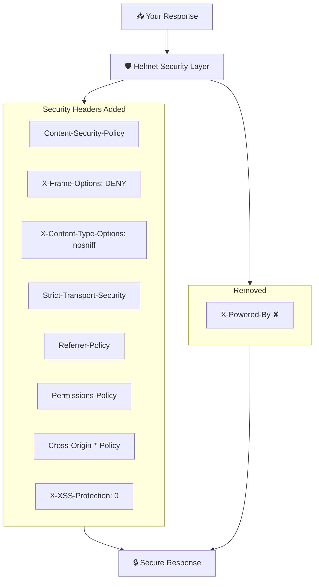

# Helmet Middleware

> Enterprise-grade HTTP security headers with defense-in-depth protection.

## The Problem

Modern web applications face a gauntlet of browser-based attacks. Each requires specific HTTP headers to mitigate:

**XSS attacks exploit missing CSP.** Without Content-Security-Policy, attackers can inject malicious scripts that steal cookies, redirect users, or modify page content.

**Clickjacking tricks users into hidden actions.** Missing X-Frame-Options allows attackers to embed your site in invisible iframes and trick users into clicking buttons they can't see.

**MIME sniffing creates attack vectors.** Browsers "helpfully" guess content types, which attackers exploit to execute JavaScript hidden in uploaded files.

**Information leakage exposes your stack.** Default server headers like `X-Powered-By: Express` help attackers target known vulnerabilities.

## How NextRush Approaches This

NextRush's Helmet middleware provides **defense-in-depth** through multiple security layers:

1. **Content-Security-Policy** blocks XSS and injection attacks
2. **X-Frame-Options** prevents clickjacking
3. **X-Content-Type-Options** stops MIME sniffing
4. **Strict-Transport-Security** enforces HTTPS
5. **Referrer-Policy** controls information leakage
6. **Permissions-Policy** restricts browser features

All headers are **configurable per-environment**, with secure defaults for production.

## Mental Model

Think of Helmet as a **security layer** that wraps every response:



**13 security headers set by default:**

| Header | Protection |
|--------|------------|
| `Content-Security-Policy` | XSS, injection attacks |
| `X-Frame-Options` | Clickjacking |
| `X-Content-Type-Options` | MIME sniffing |
| `Strict-Transport-Security` | Downgrade attacks |
| `Referrer-Policy` | Information leakage |
| `Permissions-Policy` | Browser feature abuse |
| `Cross-Origin-Opener-Policy` | Cross-origin attacks |
| `Cross-Origin-Resource-Policy` | Resource theft |
| `Cross-Origin-Embedder-Policy` | Spectre attacks |

## Installation

```bash
pnpm add @nextrush/helmet
```

## Basic Usage

```typescript
import { createApp } from '@nextrush/core';
import { serve } from '@nextrush/adapter-node';
import { helmet } from '@nextrush/helmet';

const app = createApp();

// Apply all security headers with secure defaults
app.use(helmet());

app.get('/', (ctx) => {
  ctx.html('<h1>Secure Page</h1>');
});

await serve(app, { port: 3000 });
```

::: info What headers are set?
With default configuration, Helmet sets 13 security headers and removes `X-Powered-By`. Each header protects against specific attack vectors.
:::

## API Reference

### Main Function

```typescript
helmet(options?: HelmetOptions): Middleware
```

Create comprehensive security middleware.

### Options Overview

| Option | Type | Default | Description |
|--------|------|---------|-------------|
| `contentSecurityPolicy` | `object \| false` | CSP defaults | Content-Security-Policy |
| `crossOriginEmbedderPolicy` | `object \| false` | `{ policy: 'require-corp' }` | COEP |
| `crossOriginOpenerPolicy` | `object \| false` | `{ policy: 'same-origin' }` | COOP |
| `crossOriginResourcePolicy` | `object \| false` | `{ policy: 'same-origin' }` | CORP |
| `originAgentCluster` | `boolean` | `true` | Origin-Agent-Cluster |
| `referrerPolicy` | `object \| false` | `{ policy: 'no-referrer' }` | Referrer-Policy |
| `strictTransportSecurity` | `object \| false` | HSTS defaults | HSTS |
| `xContentTypeOptions` | `boolean` | `true` | X-Content-Type-Options |
| `xDnsPrefetchControl` | `object \| false` | `{ allow: false }` | X-DNS-Prefetch-Control |
| `xDownloadOptions` | `boolean` | `true` | X-Download-Options |
| `xFrameOptions` | `object \| false` | `{ action: 'SAMEORIGIN' }` | X-Frame-Options |
| `xPermittedCrossDomainPolicies` | `object \| false` | `{ policy: 'none' }` | X-Permitted-Cross-Domain-Policies |
| `xPoweredBy` | `boolean` | `false` | Remove X-Powered-By |
| `xXssProtection` | `boolean` | `true` | X-XSS-Protection: 0 |

## Header Details

### Content-Security-Policy

The most important security header. Defines what resources can be loaded:

```typescript
helmet({
  contentSecurityPolicy: {
    directives: {
      defaultSrc: ["'self'"],
      scriptSrc: ["'self'", "'unsafe-inline'", 'cdn.example.com'],
      styleSrc: ["'self'", "'unsafe-inline'"],
      imgSrc: ["'self'", 'data:', 'images.example.com'],
      connectSrc: ["'self'", 'api.example.com'],
      fontSrc: ["'self'", 'fonts.gstatic.com'],
      objectSrc: ["'none'"],
      mediaSrc: ["'self'"],
      frameSrc: ["'none'"],
      upgradeInsecureRequests: [],
    },
  },
});
```

#### Common CSP Patterns

**API Server (strictest):**
```typescript
helmet({
  contentSecurityPolicy: {
    directives: {
      defaultSrc: ["'none'"],
      frameAncestors: ["'none'"],
    },
  },
});
```

**SPA with CDN:**
```typescript
helmet({
  contentSecurityPolicy: {
    directives: {
      defaultSrc: ["'self'"],
      scriptSrc: ["'self'", 'cdn.jsdelivr.net'],
      styleSrc: ["'self'", "'unsafe-inline'"],
      imgSrc: ["'self'", 'data:', 'blob:'],
      connectSrc: ["'self'", 'api.example.com', 'wss://ws.example.com'],
    },
  },
});
```

**Development (permissive):**
```typescript
helmet({
  contentSecurityPolicy: process.env.NODE_ENV === 'development' ? false : {
    directives: {
      defaultSrc: ["'self'"],
      // ... production directives
    },
  },
});
```

### CSP Builder API

For complex CSP configurations, use the fluent builder:

```typescript
import { createCspBuilder, CspBuilder } from '@nextrush/helmet';

const csp = createCspBuilder()
  .defaultSrc("'self'")
  .scriptSrc("'self'", 'cdn.example.com')
  .styleSrc("'self'", "'unsafe-inline'")
  .imgSrc("'self'", 'data:', 'images.example.com')
  .connectSrc("'self'", 'api.example.com')
  .build();

app.use(helmet({ contentSecurityPolicy: { directives: csp } }));
```

### CSP with Nonce (Inline Scripts)

For dynamic inline scripts, use nonces:

```typescript
import { helmet, generateNonce, createNonceProvider } from '@nextrush/helmet';

const nonceProvider = createNonceProvider();

app.use(async (ctx, next) => {
  // Generate nonce for this request
  ctx.state.nonce = generateNonce();
  await next();
});

app.use(helmet({
  contentSecurityPolicy: {
    directives: {
      'script-src': ["'self'", `'nonce-${nonceProvider()}'`],
    },
  },
}));

// In your HTML
app.get('/', (ctx) => {
  ctx.html(`
    <html>
      <script nonce="${ctx.state.nonce}">
        console.log('This inline script is allowed');
      </script>
    </html>
  `);
});
```

Helper functions for nonce-based CSP:

```typescript
import { createNoncedScript, createNoncedStyle } from '@nextrush/helmet';

const nonce = generateNonce();

// Creates: <script nonce="abc123">console.log('hi')</script>
const script = createNoncedScript(nonce, "console.log('hi')");

// Creates: <style nonce="abc123">body { color: red }</style>
const style = createNoncedStyle(nonce, 'body { color: red }');
```

### Strict-Transport-Security (HSTS)

Forces HTTPS connections:

```typescript
helmet({
  strictTransportSecurity: {
    maxAge: 31536000,        // 1 year
    includeSubDomains: true, // All subdomains
    preload: true,           // Submit to preload list
  },
});
```

::: warning Before enabling preload
Submitting to the HSTS preload list is **permanent**. Ensure all subdomains support HTTPS and you're committed to HTTPS-only before enabling `preload: true`.
:::

### X-Frame-Options

Prevents clickjacking by controlling iframe embedding:

```typescript
// Deny all framing
helmet({ xFrameOptions: { action: 'DENY' } });

// Allow same-origin framing
helmet({ xFrameOptions: { action: 'SAMEORIGIN' } });

// Disable (use CSP frame-ancestors instead)
helmet({ xFrameOptions: false });
```

### Referrer-Policy

Controls what information is sent in the Referer header:

```typescript
helmet({
  referrerPolicy: {
    policy: 'strict-origin-when-cross-origin',
  },
});
```

**Available policies:**
- `no-referrer` - Never send Referer
- `no-referrer-when-downgrade` - Send for same-security-level
- `origin` - Only send origin (no path)
- `origin-when-cross-origin` - Full URL same-origin, origin cross-origin
- `same-origin` - Only send for same-origin requests
- `strict-origin` - Origin for same-security-level
- `strict-origin-when-cross-origin` - Full URL same-origin, origin cross-origin (secure)
- `unsafe-url` - Always send full URL (avoid)

### Cross-Origin Headers (COOP, COEP, CORP)

Enable cross-origin isolation for `SharedArrayBuffer` and high-resolution timers:

```typescript
helmet({
  crossOriginOpenerPolicy: { policy: 'same-origin' },
  crossOriginEmbedderPolicy: { policy: 'require-corp' },
  crossOriginResourcePolicy: { policy: 'same-origin' },
});
```

### Permissions-Policy

Restrict browser features:

```typescript
helmet({
  permissionsPolicy: {
    features: {
      geolocation: [],                    // Disable
      microphone: [],                     // Disable
      camera: [],                         // Disable
      fullscreen: ['self'],               // Allow same-origin
      payment: ['self', 'https://pay.example.com'],
    },
  },
});
```

## Preset Configurations

NextRush Helmet provides pre-configured presets for common use cases:

### Strict Helmet (Maximum Security)

```typescript
import { strictHelmet } from '@nextrush/helmet';

// Maximum protection for high-security applications
app.use(strictHelmet());

// With overrides
app.use(strictHelmet({
  contentSecurityPolicy: {
    directives: { 'script-src': ["'self'", 'cdn.example.com'] }
  }
}));
```

### API Helmet (JSON APIs)

```typescript
import { apiHelmet } from '@nextrush/helmet';

// Optimized for REST/GraphQL APIs (no CSP needed)
app.use(apiHelmet());
```

### Development Helmet

```typescript
import { devHelmet } from '@nextrush/helmet';

// Relaxed settings for local development
if (process.env.NODE_ENV === 'development') {
  app.use(devHelmet());
}
```

::: warning devHelmet() is NOT for production
This preset disables CSP and other protections to allow hot reload and dev tools.
:::

### Static Assets Helmet

```typescript
import { staticHelmet } from '@nextrush/helmet';

// Optimized for serving static files
app.use('/static', staticHelmet());
```

### Logout Helmet (Clear Site Data)

```typescript
import { logoutHelmet } from '@nextrush/helmet';

// Clears browser cache, cookies, and storage on logout
app.post('/logout', logoutHelmet(), async (ctx) => {
  // Logout logic
  ctx.json({ success: true });
});
```

## Disabling Headers

Disable any header by setting it to `false`:

```typescript
helmet({
  // Disable Content-Security-Policy
  contentSecurityPolicy: false,

  // Disable X-Frame-Options
  xFrameOptions: false,

  // Disable cross-origin isolation
  crossOriginEmbedderPolicy: false,
  crossOriginOpenerPolicy: false,
  crossOriginResourcePolicy: false,
});
```

## Environment-Specific Configuration

```typescript
const helmetOptions = process.env.NODE_ENV === 'production'
  ? {
      contentSecurityPolicy: {
        directives: {
          defaultSrc: ["'self'"],
          scriptSrc: ["'self'"],
          styleSrc: ["'self'"],
        },
      },
      strictTransportSecurity: {
        maxAge: 31536000,
        includeSubDomains: true,
      },
    }
  : {
      contentSecurityPolicy: false,
      strictTransportSecurity: false,
    };

app.use(helmet(helmetOptions));
```

## Common Patterns

### SPA with Hot Reload

```typescript
const isDev = process.env.NODE_ENV === 'development';

app.use(helmet({
  contentSecurityPolicy: isDev ? false : {
    directives: {
      defaultSrc: ["'self'"],
      scriptSrc: ["'self'"],
      connectSrc: ["'self'", ...(isDev ? ['ws://localhost:*'] : [])],
    },
  },
}));
```

### API with CORS

```typescript
import { helmet } from '@nextrush/helmet';
import { cors } from '@nextrush/cors';

app.use(cors({
  origin: 'https://app.example.com',
  credentials: true,
}));

app.use(helmet({
  crossOriginResourcePolicy: {
    policy: 'cross-origin', // Allow cross-origin requests
  },
}));
```

### Embedded Widget

```typescript
app.use(helmet({
  xFrameOptions: false, // Allow embedding
  contentSecurityPolicy: {
    directives: {
      frameAncestors: [
        'https://partner1.com',
        'https://partner2.com',
      ],
    },
  },
}));
```

## Headers Reference

| Header | Protection | Default |
|--------|------------|---------|
| Content-Security-Policy | XSS, injection | `default-src 'self'` |
| X-Frame-Options | Clickjacking | `SAMEORIGIN` |
| X-Content-Type-Options | MIME sniffing | `nosniff` |
| Strict-Transport-Security | MITM, downgrade | `max-age=15552000` |
| Referrer-Policy | Info leakage | `no-referrer` |
| Permissions-Policy | Feature abuse | Restrictive defaults |
| X-XSS-Protection | Legacy XSS | `0` (disabled) |
| X-DNS-Prefetch-Control | DNS leakage | `off` |
| X-Download-Options | IE file execution | `noopen` |
| X-Permitted-Cross-Domain-Policies | Flash/PDF | `none` |
| Cross-Origin-Opener-Policy | Spectre | `same-origin` |
| Cross-Origin-Resource-Policy | Spectre | `same-origin` |
| Cross-Origin-Embedder-Policy | Spectre | `require-corp` |
| Origin-Agent-Cluster | Process isolation | `?1` |

## Common Mistakes

### Mistake 1: Disabling CSP for Convenience

```typescript
// ❌ Leaves your app vulnerable to XSS
helmet({ contentSecurityPolicy: false });

// ✅ Configure properly instead
helmet({
  contentSecurityPolicy: {
    directives: {
      defaultSrc: ["'self'"],
      scriptSrc: ["'self'", "'unsafe-inline'"], // If needed
    },
  },
});
```

### Mistake 2: Too Strict in Development

```typescript
// ❌ Breaks hot reload and dev tools
app.use(helmet()); // All defaults

// ✅ Environment-aware configuration
app.use(helmet({
  contentSecurityPolicy: process.env.NODE_ENV === 'production'
    ? { /* strict settings */ }
    : false,
}));
```

### Mistake 3: Using Deprecated X-XSS-Protection

```typescript
// ❌ Enabling X-XSS-Protection can be exploited
helmet({ xXssProtection: true }); // Sets to "1; mode=block"

// ✅ Helmet sets it to "0" by default (disabled)
// This is the correct behavior - rely on CSP instead
```

## TypeScript Types

```typescript
import type {
  HelmetOptions,
  ContentSecurityPolicyOptions,
  StrictTransportSecurityOptions,
  ReferrerPolicyOptions,
  XFrameOptionsOptions,
  PermissionsPolicyOptions,
  Middleware,
} from '@nextrush/helmet';
```

## Security Checklist

Before deploying to production:

- [ ] **CSP configured**: Block inline scripts if possible
- [ ] **HSTS enabled**: With appropriate max-age
- [ ] **X-Frame-Options**: Set to DENY or SAMEORIGIN
- [ ] **Remove X-Powered-By**: Enabled by default
- [ ] **Referrer-Policy**: Set to strict policy
- [ ] **Permissions-Policy**: Disable unused features
- [ ] **Test in staging**: Ensure no functionality breaks

## Comparison with Popular Libraries

| Feature | @nextrush/helmet | helmet (Express) |
|---------|-----------------|------------------|
| TypeScript | ✅ Native | ⚠️ @types |
| Zero dependencies | ✅ Yes | ✅ Yes |
| CSP | ✅ Yes | ✅ Yes |
| COEP/COOP/CORP | ✅ Yes | ✅ Yes |
| Permissions-Policy | ✅ Yes | ✅ Yes |
| Multi-runtime | ✅ Yes | ❌ Node.js only |

---

**Package:** `@nextrush/helmet`
**Version:** 3.0.0-alpha.1
**License:** MIT
**Test Coverage:** 64/64 tests passing ✅
