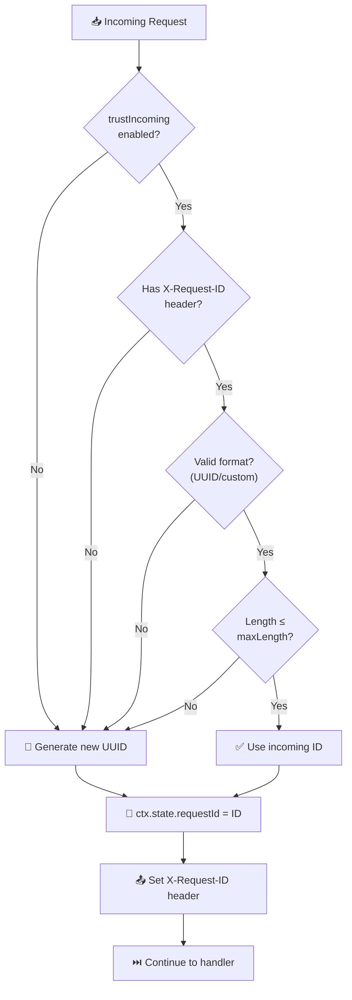

# Request-ID Middleware

> Unique request identification with ID spoofing protection and distributed tracing support.

## The Problem

Debugging distributed systems without request IDs is like finding a needle in a haystack:

**Correlating logs across services is impossible.** When a request fails, you need to search through multiple service logs with no way to connect them.

**ID spoofing creates audit trail gaps.** If clients can inject arbitrary request IDs, attackers can pollute your logs or exploit ID-based systems.

**Inconsistent ID formats cause integration issues.** Different services expecting different ID formats (UUID vs. ULID vs. custom) leads to compatibility problems.

**Log injection attacks via headers.** Malicious request IDs containing newlines or special characters can exploit logging systems.

## How NextRush Approaches This

NextRush's Request-ID middleware provides:

1. **Cryptographically secure ID generation** using `crypto.randomUUID()`
2. **ID validation** to prevent spoofing and injection attacks
3. **Configurable trust levels** for upstream proxy headers
4. **Multiple header support** for compatibility (X-Request-ID, X-Correlation-ID)
5. **Log injection protection** through sanitization

## Mental Model



## Installation

```bash
pnpm add @nextrush/request-id
```

## Basic Usage

```typescript
import { createApp } from '@nextrush/core';
import { serve } from '@nextrush/adapter-node';
import { requestId } from '@nextrush/request-id';

const app = createApp();

// Add request IDs to all requests
app.use(requestId());

app.get('/api/data', (ctx) => {
  // Access the request ID
  console.log('Request ID:', ctx.state.requestId);
  ctx.json({ requestId: ctx.state.requestId });
});

await serve(app, { port: 3000 });
```

**Response Headers:**

```
X-Request-ID: 550e8400-e29b-41d4-a716-446655440000
```

## API Reference

### requestId(options?)

Create request ID middleware:

```typescript
requestId({
  // Header to read/write request ID
  header?: string;              // default: 'X-Request-Id'

  // Custom ID generator function
  generator?: () => string;     // default: crypto.randomUUID

  // Key in ctx.state for the ID
  stateKey?: string;            // default: 'requestId'

  // Trust incoming request ID headers
  trustIncoming?: boolean;      // default: true

  // Custom ID validation function
  validator?: (id: string) => boolean;  // default: UUID validator

  // Maximum length for incoming IDs
  maxLength?: number;           // default: 128

  // Expose ID in response header
  exposeHeader?: boolean;       // default: true
})
```

## Options Reference

| Option | Type | Default | Description |
|--------|------|---------|-------------|
| `header` | `string` | `'X-Request-Id'` | Header name for request ID |
| `generator` | `() => string` | `crypto.randomUUID` | ID generation function |
| `stateKey` | `string` | `'requestId'` | Key in `ctx.state` |
| `trustIncoming` | `boolean` | `true` | Trust incoming headers |
| `validator` | `(id: string) => boolean` | UUID validator | ID validation function |
| `maxLength` | `number` | `128` | Maximum ID length allowed |
| `exposeHeader` | `boolean` | `true` | Set response header |

## Built-in Validators

```typescript
import {
  isValidUuid,        // Standard UUID v4 format
  isSafeId,           // Safe alphanumeric with hyphens/underscores
  permissiveValidator, // Accept any safe non-empty string
  defaultValidator,    // UUID validator (default)
} from '@nextrush/request-id';

// Default: UUID validation
app.use(requestId());
// Only accepts: 550e8400-e29b-41d4-a716-446655440000

// Permissive: any safe non-empty string
app.use(requestId({ validator: permissiveValidator }));
// Accepts: my-custom-id-123

// Safe ID: letters, numbers, hyphens, underscores
app.use(requestId({ validator: isSafeId }));
// Accepts: req_abc123, request-456
```

## Security Features

### ID Validation (Anti-Spoofing)

By default, incoming request IDs must be valid UUIDs:

```typescript
// Valid: Accepted and used
// X-Request-ID: 550e8400-e29b-41d4-a716-446655440000

// Invalid: Rejected, new ID generated
// X-Request-ID: malicious-id
// X-Request-ID: <script>alert(1)</script>
// X-Request-ID: ../../../etc/passwd
```

### Log Injection Protection

All IDs are sanitized to prevent log injection attacks:

```typescript
// These are sanitized before use:
// X-Request-ID: id\r\nSet-Cookie: evil=value
// X-Request-ID: id\x00with\x00nulls
```

### Trust Incoming Configuration

Control whether to accept upstream request IDs:

```typescript
// Trust incoming IDs (load balancer, API gateway)
app.use(requestId({ trustIncoming: true }));

// Never trust incoming IDs (always generate new)
app.use(requestId({ trustIncoming: false }));
```

## Custom ID Generators

### ULID (Sortable)

```typescript
import { ulid } from 'ulid';

app.use(requestId({
  generator: ulid,
  validator: (id) => /^[0-9A-HJKMNP-TV-Z]{26}$/.test(id),
}));
// ID: 01ARZ3NDEKTSV4RRFFQ69G5FAV
```

### Prefixed IDs

```typescript
app.use(requestId({
  generator: () => `req_${crypto.randomUUID()}`,
  validator: (id) => id.startsWith('req_') && isValidUUID(id.slice(4)),
}));
// ID: req_550e8400-e29b-41d4-a716-446655440000
```

### Sequential (Development Only)

```typescript
let counter = 0;
app.use(requestId({
  generator: () => `dev-${++counter}`,
  validator: (id) => id.startsWith('dev-'),
}));
// ID: dev-1, dev-2, dev-3...
```

## Common Patterns

### Logging Integration

```typescript
import { requestId } from '@nextrush/request-id';

app.use(requestId());

app.use(async (ctx) => {
  // All logs include request ID
  console.log(`[${ctx.state.requestId}] Starting request`);
  await ctx.next();
  console.log(`[${ctx.state.requestId}] Request complete`);
});
```

### Correlation with Downstream Services

```typescript
app.use(requestId());

app.use(async (ctx) => {
  // Pass request ID to downstream services
  const response = await fetch('https://api.service.com/data', {
    headers: {
      'X-Request-ID': ctx.state.requestId,
      'X-Correlation-ID': ctx.state.requestId,
    },
  });

  ctx.json(await response.json());
});
```

### Multiple Header Support

```typescript
// Read from multiple headers, write to one
app.use(async (ctx) => {
  const correlationId =
    ctx.get('X-Request-ID') ||
    ctx.get('X-Correlation-ID') ||
    ctx.get('X-Trace-ID');

  ctx.state.traceId = correlationId;
  await ctx.next();
});

app.use(requestId({
  header: 'X-Request-ID',
  stateKey: 'requestId',
}));
```

### Distributed Tracing Context

```typescript
import { requestId } from '@nextrush/request-id';

app.use(requestId());

app.use(async (ctx) => {
  // OpenTelemetry / Jaeger integration
  const span = tracer.startSpan('http-request', {
    attributes: {
      'http.request_id': ctx.state.requestId,
    },
  });

  try {
    await ctx.next();
  } finally {
    span.end();
  }
});
```

## Context State

After middleware runs:

```typescript
// Access the request ID
ctx.state.requestId  // string - The validated/generated ID

// With custom state key
app.use(requestId({ stateKey: 'traceId' }));
ctx.state.traceId    // string
```

## Constants

```typescript
import {
  DEFAULT_HEADER,    // 'X-Request-ID'
  DEFAULT_STATE_KEY, // 'requestId'
} from '@nextrush/request-id';
```

## TypeScript Types

```typescript
import type {
  RequestIdOptions,
  CorrelationIdOptions,
  TraceIdOptions,
  IdValidator,
  IdGenerator,
  RequestIdContext,
  Middleware,
} from '@nextrush/request-id';

interface RequestIdOptions {
  header?: string;
  generator?: IdGenerator;
  stateKey?: string;
  trustIncoming?: boolean;
  validator?: IdValidator;
  maxLength?: number;
  exposeHeader?: boolean;
}

type IdGenerator = () => string;
type IdValidator = (id: string) => boolean;
```

## Runtime Support

Works on all JavaScript runtimes:

- **Node.js** ≥20 (native `crypto.randomUUID`)
- **Bun** ≥1.0
- **Deno** ≥1.0
- **Cloudflare Workers**
- **Vercel Edge**

## Common Mistakes

### Mistake 1: Wrong Middleware Order

```typescript
// ❌ Request ID not available in early middleware
app.use(loggingMiddleware);  // No request ID yet!
app.use(requestId());

// ✅ Request ID first
app.use(requestId());
app.use(loggingMiddleware);  // Can use ctx.state.requestId
```

### Mistake 2: Trusting Incoming IDs Without Validation

```typescript
// ❌ Accepts any incoming ID (spoofing risk)
app.use(requestId({
  trustIncoming: true,
  validator: () => true,  // DANGEROUS
}));

// ✅ Validate incoming IDs
app.use(requestId({
  trustIncoming: true,
  validator: isValidUUID,  // Only accept valid UUIDs
}));
```

### Mistake 3: Not Exposing Header

```typescript
// ❌ Clients can't correlate requests
app.use(requestId({ exposeHeader: false }));

// ✅ Expose for debugging
app.use(requestId({ exposeHeader: true }));
```

## Security Checklist

- [ ] **Validation enabled**: Don't use permissive validator in production
- [ ] **Trust incoming configured**: Only trust if behind load balancer
- [ ] **Response header exposed**: For client-side debugging
- [ ] **Logging integrated**: Include request ID in all logs

## Comparison with Popular Libraries

| Feature | @nextrush/request-id | express-request-id | cls-hooked |
|---------|---------------------|-------------------|------------|
| ID validation | ✅ Built-in | ❌ No | ❌ No |
| Spoofing protection | ✅ Yes | ❌ No | ❌ No |
| Log injection protection | ✅ Yes | ❌ No | ❌ No |
| Custom generators | ✅ Yes | ✅ Yes | N/A |
| Custom validators | ✅ Yes | ❌ No | N/A |
| Multi-runtime | ✅ Yes | ❌ Node.js | ❌ Node.js |
| TypeScript | ✅ Native | ⚠️ @types | ⚠️ @types |

---

**Package:** `@nextrush/request-id`
**Version:** 3.0.0-alpha.1
**License:** MIT
**Build Size:** 2.49 KB ESM, 8.27 KB types
**Test Coverage:** 48/48 tests passing ✅
