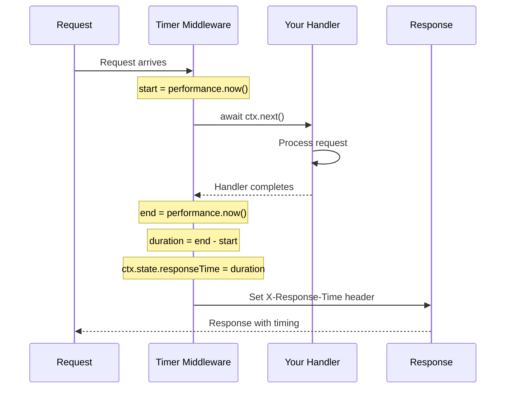

# Timer Middleware

> Precision request timing with microsecond accuracy and Server-Timing API support.

## The Problem

Performance monitoring requires accurate timing data:

**Milliseconds hide latency spikes.** When your P99 latency is 5ms but P99.9 is 50ms, millisecond precision can miss the tail latency that affects real users.

**Manual timing is error-prone.** Calculating `Date.now()` differences in every handler leads to inconsistent measurement points and forgotten timings.

**Server-Timing headers are underutilized.** Browsers and APM tools can consume timing data via the Server-Timing header, but most apps don't implement it.

**Response time logging is scattered.** Without centralized timing, logs have inconsistent formats and measurement points.

## How NextRush Approaches This

NextRush's Timer middleware provides:

1. **High-resolution timing** using `performance.now()` or `process.hrtime.bigint()`
2. **Automatic Server-Timing headers** for browser DevTools integration
3. **Multiple output formats** (ms, μs, ns, human-readable)
4. **Detailed breakdown** with basic and detailed middleware options
5. **Clean state access** via `ctx.state.startTime` and `ctx.state.timing`

## Mental Model



## Installation

```bash
pnpm add @nextrush/timer
```

## Basic Usage

```typescript
import { createApp } from '@nextrush/core';
import { serve } from '@nextrush/adapter-node';
import { timer } from '@nextrush/timer';

const app = createApp();

// Add timing to all requests
app.use(timer());

app.get('/api/data', (ctx) => {
  // Access timing information
  console.log('Request started at:', ctx.state.startTime);
  ctx.json({ data: 'value' });
});

await serve(app, { port: 3000 });
```

**Response Headers:**

```
X-Response-Time: 1.23ms
```

For Server-Timing header support, use the `serverTiming()` middleware instead.

## API Reference

### timer(options?)

Basic timing middleware:

```typescript
timer({
  // Header name for response time
  header?: string;           // default: 'X-Response-Time'

  // Time unit suffix (e.g., 'ms', 's', '')
  suffix?: string;           // default: 'ms'

  // Number of decimal places (0-6)
  precision?: number;        // default: 2

  // Key in ctx.state for timing
  stateKey?: string;         // default: 'responseTime'

  // Set response header
  exposeHeader?: boolean;    // default: true

  // Custom time getter (for testing)
  now?: () => number;        // default: performance.now
})
```

### responseTime(options?)

Alias for `timer()` with common naming:

```typescript
import { responseTime } from '@nextrush/timer';

app.use(responseTime());
```

### serverTiming(options?)

Uses the standard `Server-Timing` header format for DevTools integration:

```typescript
import { serverTiming } from '@nextrush/timer';

app.use(serverTiming());
// Header: Server-Timing: total;dur=123.45

// With description
app.use(serverTiming({
  metric: 'api',
  description: 'API Response Time',
}));
// Header: Server-Timing: api;dur=123.45;desc="API Response Time"
```

### detailedTimer(options?)

Captures complete timing information with timestamps:

```typescript
import { detailedTimer } from '@nextrush/timer';
import type { TimingResult } from '@nextrush/timer';

app.use(detailedTimer({ detailed: true }));

app.use(async (ctx) => {
  await ctx.next();

  const timing = ctx.state.responseTime as TimingResult;
  console.log({
    duration: timing.duration,    // 123.45
    formatted: timing.formatted,  // "123.45ms"
    start: timing.start,          // 1234567890.123
    end: timing.end,              // 1234568013.573
  });
});
```

## Options Reference

### TimerOptions

| Option | Type | Default | Description |
|--------|------|---------|-------------|
| `header` | `string` | `'X-Response-Time'` | Response header name |
| `suffix` | `string` | `'ms'` | Time unit suffix |
| `precision` | `number` | `2` | Decimal places (0-6) |
| `stateKey` | `string` | `'responseTime'` | Key in `ctx.state` |
| `exposeHeader` | `boolean` | `true` | Set response header |
| `now` | `() => number` | `performance.now` | Time getter function |

### ServerTimingOptions

| Option | Type | Default | Description |
|--------|------|---------|-------------|
| `metric` | `string` | `'total'` | Metric name |
| `description` | `string` | - | Optional description |
| `precision` | `number` | `2` | Decimal places (0-6) |
| `stateKey` | `string` | `'responseTime'` | Key in `ctx.state` |
| `exposeHeader` | `boolean` | `true` | Set response header |
| `now` | `() => number` | `performance.now` | Time getter function |

### DetailedTimerOptions

Extends `TimerOptions` with:

| Option | Type | Default | Description |
|--------|------|---------|-------------|
| `detailed` | `boolean` | `false` | Store `TimingResult` object |

## Context State

After middleware runs, timing data is available:

```typescript
// Basic timer
ctx.state.responseTime  // number - Duration in milliseconds (e.g., 123.45)

// Detailed timer
app.use(detailedTimer({ detailed: true }));

ctx.state.responseTime  // TimingResult object
// {
//   duration: 123.45,
//   formatted: "123.45ms",
//   start: 1234567890.123,
//   end: 1234568013.573
// }
```

### TimingResult Interface

```typescript
interface TimingResult {
  duration: number;    // Duration in milliseconds
  formatted: string;   // Formatted string (e.g., "123.45ms")
  start: number;       // Start timestamp (performance.now)
  end: number;         // End timestamp
}
```

## Precision Control

Control the number of decimal places in timing output:

```typescript
// High precision (6 decimal places - microsecond)
timer({ precision: 6 });
// X-Response-Time: 123.456789ms

// Low precision (0 decimal places - whole milliseconds)
timer({ precision: 0 });
// X-Response-Time: 123ms

// Default (2 decimal places)
timer();
// X-Response-Time: 123.45ms
```

::: tip Maximum Precision
The maximum precision is 6 decimal places (microsecond accuracy). Values outside 0-6 are clamped automatically.
:::

## Server-Timing Header

The Server-Timing header integrates with browser DevTools and APM tools:

```typescript
// Basic Server-Timing
app.use(serverTiming());
// Server-Timing: total;dur=1.234

// Custom metric name and description
app.use(serverTiming({
  metric: 'api',
  description: 'API Processing',
}));
// Server-Timing: api;dur=1.234;desc="API Processing"

// Use basic timer (X-Response-Time only, no Server-Timing)
app.use(timer());
// X-Response-Time: 1.234ms
```

### Viewing in Browser DevTools

1. Open DevTools → Network tab
2. Click on a request
3. Look for "Server-Timing" in the Timing section

## Common Patterns

### Logging Response Times

```typescript
import { timer } from '@nextrush/timer';

app.use(timer());

app.use(async (ctx) => {
  await ctx.next();
  console.log(`${ctx.method} ${ctx.path} - ${ctx.state.responseTime}ms`);
});
```

### Multiple Timing Metrics

```typescript
import { serverTiming } from '@nextrush/timer';

app.use(async (ctx) => {
  // Database timing
  const dbStart = performance.now();
  await db.query('...');
  const dbTime = performance.now() - dbStart;

  // Set custom Server-Timing metric
  ctx.set('Server-Timing', `db;dur=${dbTime.toFixed(2)};desc="Database"`);
  await ctx.next();
});

// Total timing
app.use(serverTiming({ metric: 'total' }));
```

### Conditional Timing

```typescript
app.use(timer());

app.use(async (ctx) => {
  await ctx.next();

  // Only log slow requests
  const duration = ctx.state.responseTime as number;
  if (duration > 100) {
    console.warn(`Slow request: ${ctx.path} took ${duration}ms`);
  }
});
```

### APM Integration

```typescript
import { timer } from '@nextrush/timer';

app.use(timer());

app.use(async (ctx) => {
  await ctx.next();

  // Send to your APM
  const duration = ctx.state.responseTime as number;
  apm.recordMetric('http.response_time', duration, {
    method: ctx.method,
    path: ctx.path,
    status: ctx.status,
  });
});
```

### Testing with Mock Time

Use the `now` option to mock time in tests:

```typescript
import { timer } from '@nextrush/timer';
import { describe, it, expect, vi } from 'vitest';

describe('timing', () => {
  it('should measure duration', async () => {
    let time = 0;
    const mockNow = vi.fn(() => {
      time += 100;
      return time;
    });

    const middleware = timer({ now: mockNow });
    const ctx = createMockContext();

    await middleware(ctx);

    expect(ctx.state.responseTime).toBe(100);
  });
});
```

## Constants

All constants are exported for customization:

```typescript
import {
  DEFAULT_HEADER,        // 'X-Response-Time'
  SERVER_TIMING_HEADER,  // 'Server-Timing'
  DEFAULT_SUFFIX,        // 'ms'
  DEFAULT_PRECISION,     // 2
  MAX_PRECISION,         // 6
  DEFAULT_STATE_KEY,     // 'responseTime'
  DEFAULT_METRIC,        // 'total'
  defaultTimeGetter,     // () => performance.now()
} from '@nextrush/timer';
```

## TypeScript Types

```typescript
import type {
  TimerOptions,
  ServerTimingOptions,
  DetailedTimerOptions,
  TimingResult,
  TimeGetter,
  TimerContext,
  Middleware,
} from '@nextrush/timer';
```

## Performance Considerations

- **Overhead**: ~0.01ms per request (negligible)
- **Memory**: Minimal allocations (one object per request)
- **Resolution**: Uses `performance.now()` for best accuracy

### Why performance.now()?

| API | Resolution | Cross-Platform |
|-----|------------|----------------|
| `Date.now()` | ~1ms | ✅ |
| `performance.now()` | ~5μs | ✅ |
| `process.hrtime.bigint()` | ~1ns | Node.js only |

Timer uses `performance.now()` by default for the best balance of precision and portability.

## Runtime Support

Works on all JavaScript runtimes:

- **Node.js** ≥20
- **Bun** ≥1.0
- **Deno** ≥1.0
- **Cloudflare Workers**
- **Vercel Edge**

## Common Mistakes

### Mistake 1: Wrong Middleware Order

```typescript
// ❌ Timer won't measure route handlers
app.get('/api/data', handler);
app.use(timer());

// ✅ Timer first to measure everything
app.use(timer());
app.get('/api/data', handler);
```

### Mistake 2: Forgetting await ctx.next()

```typescript
// ❌ Duration will be wrong
app.use(timer());
app.use((ctx) => {
  // Missing await ctx.next()
  ctx.json({ data: 'value' });
});

// ✅ Properly await downstream
app.use(timer());
app.use(async (ctx) => {
  await ctx.next();
  // Duration is now correct
});
```

## Security

The Timer middleware sanitizes header values to prevent header injection:

```typescript
// Sanitization removes: \r, \n, :
// Safe characters: alphanumeric, -, _, ., spaces
```

---

**Package:** `@nextrush/timer`
**Version:** 3.0.0-alpha.1
**License:** MIT
**Build Size:** 3.15 KB ESM, 7.00 KB types
**Test Coverage:** 44/44 tests passing ✅
