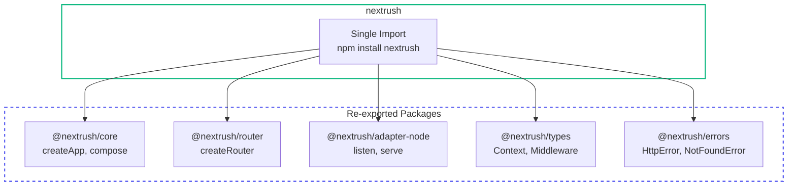

# nextrush

> The meta package that bundles essential NextRush packages for quick setup.

## What's Included



## Installation

```bash
pnpm add nextrush
```

## What's Included

The `nextrush` meta package re-exports from core packages so you can get started with a single import:

| Package | Exports |
|---------|---------|
| `@nextrush/core` | `createApp`, `Application`, `compose` |
| `@nextrush/router` | `createRouter`, `Router` |
| `@nextrush/adapter-node` | `listen`, `serve`, `createHandler` |
| `@nextrush/types` | `Context`, `Middleware`, `Plugin`, `HttpStatus` |
| `@nextrush/errors` | `HttpError`, `NotFoundError`, `BadRequestError`, etc. |

## Quick Start

```typescript
import { createApp, createRouter, listen } from 'nextrush';

const app = createApp();
const router = createRouter();

router.get('/', (ctx) => {
  ctx.json({ message: 'Hello NextRush!' });
});

app.use(router.routes());

listen(app, 3000);
```

## Adding Middleware

Middleware packages are installed separately:

```bash
pnpm add @nextrush/cors @nextrush/body-parser
```

```typescript
import { createApp, listen } from 'nextrush';
import { cors } from '@nextrush/cors';
import { json } from '@nextrush/body-parser';

const app = createApp();

app.use(cors());
app.use(json());

app.use((ctx) => {
  ctx.json({ received: ctx.body });
});

listen(app, 3000);
```

## Error Handling

Built-in HTTP error classes are included:

```typescript
import { NotFoundError, BadRequestError, HttpError } from 'nextrush';

app.use(async (ctx) => {
  const user = await findUser(ctx.params.id);

  if (!user) {
    throw new NotFoundError('User not found');
  }

  if (!isValid(user)) {
    throw new BadRequestError('Invalid user data');
  }

  ctx.json(user);
});
```

## Available Error Classes

| Error | Status Code | Use Case |
|-------|-------------|----------|
| `BadRequestError` | 400 | Invalid input |
| `UnauthorizedError` | 401 | Missing authentication |
| `ForbiddenError` | 403 | Insufficient permissions |
| `NotFoundError` | 404 | Resource not found |
| `ConflictError` | 409 | Resource conflict |
| `UnprocessableEntityError` | 422 | Validation failed |
| `TooManyRequestsError` | 429 | Rate limit exceeded |
| `InternalServerError` | 500 | Server error |

## Direct Package Usage

For maximum control and tree-shaking, skip the meta package:

```typescript
import { createApp } from '@nextrush/core';
import { createRouter } from '@nextrush/router';
import { listen } from '@nextrush/adapter-node';
import { cors } from '@nextrush/cors';
```

This approach is recommended for:
- Production applications where bundle size matters
- When you need specific adapter (Bun, Deno, Edge)
- When you want explicit control over dependencies

## Version

```typescript
import { VERSION } from 'nextrush';
console.log(VERSION); // '3.0.0-alpha.2'
```

## When to Use the Meta Package

**Use `nextrush` when:**
- Getting started quickly
- Building prototypes
- Learning the framework
- You're targeting Node.js only

**Use individual packages when:**
- Deploying to Bun, Deno, or Edge
- You need fine-grained control
- Bundle size is critical
- You want explicit dependency management

## Available Packages

### Core (included in nextrush)

| Package | Description |
|---------|-------------|
| [`@nextrush/core`](/packages/core) | Application & middleware composition |
| [`@nextrush/router`](/packages/router) | High-performance radix tree router |
| [`@nextrush/adapter-node`](/packages/adapters/node) | Node.js HTTP adapter |
| [`@nextrush/types`](/packages/types) | Shared TypeScript types |
| [`@nextrush/errors`](/packages/errors/) | HTTP error classes |

### Middleware (install separately)

| Package | Description |
|---------|-------------|
| [`@nextrush/body-parser`](/packages/middleware/body-parser) | JSON/form/text body parsing |
| [`@nextrush/cors`](/packages/middleware/cors) | CORS headers |
| [`@nextrush/helmet`](/packages/middleware/helmet) | Security headers |
| [`@nextrush/cookies`](/packages/middleware/cookies) | Cookie handling |
| [`@nextrush/compression`](/packages/middleware/compression) | Response compression |
| [`@nextrush/rate-limit`](/packages/middleware/rate-limit) | Rate limiting |
| [`@nextrush/request-id`](/packages/middleware/request-id) | Request ID generation |
| [`@nextrush/timer`](/packages/middleware/timer) | Request timing headers |

### Plugins (install separately)

| Package | Description |
|---------|-------------|
| [`@nextrush/logger`](/packages/plugins/logger) | Structured logging |
| [`@nextrush/static`](/packages/plugins/static) | Static file serving |
| [`@nextrush/websocket`](/packages/plugins/websocket) | WebSocket support |
| [`@nextrush/template`](/packages/plugins/template) | Template rendering |
| [`@nextrush/events`](/packages/plugins/events) | Event emitter |
| [`@nextrush/controllers`](/packages/controllers/) | Class-based controllers |

### Advanced (install separately)

| Package | Description |
|---------|-------------|
| [`@nextrush/di`](/packages/di/) | Dependency injection |
| [`@nextrush/decorators`](/packages/decorators/) | Controller decorators |

### Dev Tools

| Package | Description |
|---------|-------------|
| [`@nextrush/dev`](/packages/dev) | Hot reload dev server |

## TypeScript Support

Full TypeScript support with zero configuration:

```typescript
import type { Context, Middleware, Plugin } from 'nextrush';

const myMiddleware: Middleware = async (ctx: Context) => {
  console.log(ctx.method, ctx.path);
  await ctx.next();
};
```

## Next Steps

- [Quick Start](/getting-started/quick-start) — Build your first app
- [Package Overview](/packages/) — Explore all packages
- [Core Package](/packages/core) — Deep dive into the core
