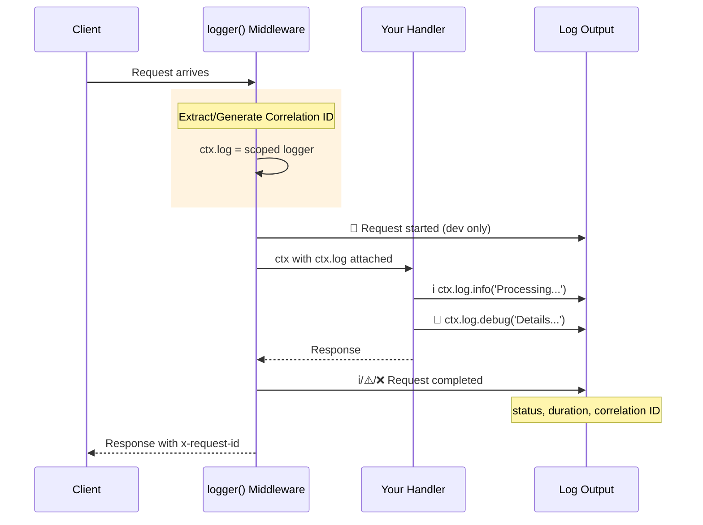
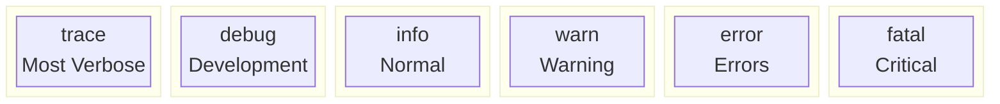

# Logger

> Request logging and application logging for NextRush applications.

## The Problem

Every production application needs logging. Without it:

- Debugging becomes guesswork
- Security incidents go unnoticed
- Performance problems stay hidden
- Request tracing across services is impossible

Traditional logging solutions often force you to choose between:
- **Simple but limited** - Basic console logs that don't scale
- **Powerful but complex** - Heavy libraries with steep learning curves

NextRush Logger wraps [@nextrush/log](https://www.npmjs.com/package/@nextrush/log) to provide production-grade logging with zero configuration.

## Mental Model

Think of logging in NextRush as two distinct but connected concerns:

1. **Request Logging** - Automatic logging of HTTP requests/responses
2. **Application Logging** - Manual logging from your business logic

The `logger()` middleware bridges both. When you add it, every request gets:
- A unique **correlation ID** for tracing
- A **scoped logger** attached to `ctx.log`
- **Automatic request/response logging**



## Installation

```bash
pnpm add @nextrush/logger
```

## Quick Start

```typescript
import { createApp } from '@nextrush/core';
import { logger } from '@nextrush/logger';

const app = createApp();

// Add request logging
app.use(logger());

// Use ctx.log in handlers
app.get('/users/:id', async (ctx) => {
  ctx.log.info('Fetching user', { userId: ctx.params.id });

  const user = await db.users.findById(ctx.params.id);

  if (!user) {
    ctx.log.warn('User not found');
    ctx.status = 404;
    ctx.json({ error: 'Not found' });
    return;
  }

  ctx.json({ user });
});

app.listen(3000);
```

**Output (development):**

```
2025-01-15 10:30:00.123 🐛 [DEBUG] [nextrush] (abc12345-...) Request started
  method: "GET"
  path: "/users/123"
  ip: "127.0.0.1"
2025-01-15 10:30:00.125 ℹ️  [INFO ] [nextrush] (abc12345-...) Fetching user
  userId: "123"
2025-01-15 10:30:00.145 ℹ️  [INFO ] [nextrush] (abc12345-...) GET /users/123
  method: "GET"
  path: "/users/123"
  status: 200
  duration: 22
```

Notice how every log entry shares the same correlation ID (`abc12345-...`). This makes tracing a single request across logs trivial.

## What NextRush Does Automatically

When you use `logger()`:

1. **Extracts correlation ID** from `x-request-id` header (or generates one)
2. **Sets correlation ID** in response header for downstream services
3. **Creates a scoped logger** with the correlation ID baked in
4. **Attaches logger to context** as `ctx.log`
5. **Logs request start** (in development by default)
6. **Logs request completion** with status and duration
7. **Adjusts log level** based on response status (info/warn/error)

You can override or disable any of these behaviors.

## API Reference

### `logger(options?)`

The main middleware that provides full request logging.

```typescript
import { logger } from '@nextrush/logger';

app.use(logger({
  // Minimum log level
  minLevel: 'info',  // 'trace' | 'debug' | 'info' | 'warn' | 'error' | 'fatal'

  // Log levels per response status
  successLevel: 'info',      // 2xx/3xx responses
  clientErrorLevel: 'warn',  // 4xx responses
  serverErrorLevel: 'error', // 5xx responses

  // Request logging
  logRequestStart: true,  // Log when request arrives (default: true in dev)

  // Correlation ID
  correlationIdHeader: 'x-request-id',
  generateCorrelationId: true,  // Generate if not in headers

  // Logger context name
  context: 'nextrush',  // Appears as [nextrush] in logs

  // Skip logging for certain requests
  skip: (ctx) => ctx.path === '/health',

  // Custom message format
  formatMessage: (ctx, duration) => `${ctx.method} ${ctx.path} ${ctx.status}`,

  // Output control
  silent: false,    // No console output (transports still called)
  pretty: true,     // Human-readable format
  colors: true,     // Colorized output
  redact: true,     // Redact sensitive data

  // Custom transports
  transports: [myHttpTransport],
}));
```

### `attachLogger(options?)`

Lightweight alternative that only attaches `ctx.log` without request logging.

Use this when you want the logger but not automatic request logging (e.g., you're using a separate request logging system).

```typescript
import { attachLogger } from '@nextrush/logger';

app.use(attachLogger({
  correlationIdHeader: 'x-request-id',
  generateCorrelationId: true,
  context: 'api',
}));
```

### `hasLogger(ctx)`

Type guard to check if context has a logger attached.

```typescript
import { hasLogger } from '@nextrush/logger';

if (hasLogger(ctx)) {
  ctx.log.info('Logger is available');  // TypeScript knows ctx.log exists
}
```

### `getLogger(ctx, fallbackContext?)`

Get logger from context, or create a fallback.

```typescript
import { getLogger } from '@nextrush/logger';

const log = getLogger(ctx, 'my-handler');
log.info('Works whether logger middleware is used or not');
```

## Using ctx.log

The `ctx.log` object is a full [@nextrush/log](https://www.npmjs.com/package/@nextrush/log) logger instance with:

### Log Levels



```typescript
ctx.log.trace('Verbose details');     // Most verbose
ctx.log.debug('Debug information');
ctx.log.info('General information');
ctx.log.warn('Warning conditions');
ctx.log.error('Error occurred', error);
ctx.log.fatal('Critical failure');    // Most severe
```

### Structured Data

```typescript
// Log with data
ctx.log.info('User action', {
  userId: ctx.params.id,
  action: 'purchase',
  amount: 99.99
});

// Log error with context
ctx.log.error('Payment failed', error, {
  orderId: order.id,
  provider: 'stripe'
});
```

### Performance Timing

```typescript
const timer = ctx.log.time('database-query');
const result = await db.query('SELECT * FROM users');
timer.end('Query completed', { rows: result.length });

// Output:
// 2025-01-15 10:30:00 🐛 [DEBUG] Query completed ⏱ 45.3ms
//   rows: 150
```

### Child Loggers

Create scoped loggers for subsystems:

```typescript
const dbLog = ctx.log.child('database');
dbLog.info('Connection established');
// Output: [nextrush:database] Connection established

const cacheLog = ctx.log.child('cache');
cacheLog.debug('Cache hit', { key: 'user:123' });
// Output: [nextrush:cache] Cache hit
```

### Additional Metadata

Add context that appears in all subsequent logs:

```typescript
const enrichedLog = ctx.log.withMetadata({
  userId: ctx.state.user?.id,
  tenant: ctx.state.tenant
});

enrichedLog.info('Processing request');
// All logs from enrichedLog include userId and tenant
```

### Check Level Enabled

Avoid expensive computation for disabled levels:

```typescript
if (ctx.log.isLevelEnabled('debug')) {
  const expensiveData = computeExpensiveDebugInfo();
  ctx.log.debug('Debug info', expensiveData);
}
```

## TypeScript Integration

For typed access to `ctx.log`:

```typescript
import type { LoggerContext } from '@nextrush/logger';

// Option 1: Type cast
app.get('/users', async (ctx) => {
  (ctx as LoggerContext).log.info('Typed access');
});

// Option 2: Type guard
app.get('/users', async (ctx) => {
  if (hasLogger(ctx)) {
    ctx.log.info('TypeScript knows log exists');
  }
});

// Option 3: getLogger helper
app.get('/users', async (ctx) => {
  const log = getLogger(ctx);
  log.info('Always works');
});
```

## Re-exports from @nextrush/log

This package re-exports everything from `@nextrush/log`. You can use it for application-level logging outside of request handlers:

```typescript
import {
  createLogger,
  configure,
  setGlobalLevel,
  createBatchTransport,
  runWithContext
} from '@nextrush/logger';

// Application logger
const log = createLogger('MyService');
log.info('Application starting');

// Global configuration
setGlobalLevel('debug');

// Custom transport
const httpTransport = createBatchTransport({
  batchSize: 100,
  flushInterval: 5000,
  handler: async (entries) => {
    await fetch('/logs', {
      method: 'POST',
      body: JSON.stringify(entries)
    });
  }
});

configure({
  transports: [httpTransport.transport]
});
```

## Common Patterns

### Skip Health Checks

```typescript
app.use(logger({
  skip: (ctx) => {
    return ctx.path === '/health' ||
           ctx.path === '/ready' ||
           ctx.path.startsWith('/metrics');
  }
}));
```

### Production Configuration

```typescript
app.use(logger({
  minLevel: process.env.LOG_LEVEL || 'info',
  logRequestStart: false,  // Reduce verbosity
  pretty: false,           // JSON output for log aggregators
  redact: true,            // Remove sensitive data
}));
```

### Development Configuration

```typescript
app.use(logger({
  minLevel: 'trace',       // Show everything
  logRequestStart: true,   // See when requests arrive
  pretty: true,            // Human-readable
  colors: true,            // Colorized output
}));
```

### Distributed Tracing

```typescript
// Service A - generate correlation ID
app.use(logger({ generateCorrelationId: true }));

// Service B - use incoming correlation ID
app.use(logger({
  generateCorrelationId: false,  // Don't generate, use header
  correlationIdHeader: 'x-trace-id'
}));
```

### Error Handler Integration

```typescript
app.use(async (ctx) => {
  try {
    await ctx.next();
  } catch (error) {
    ctx.log.error('Unhandled error', error);
    ctx.status = 500;
    ctx.json({ error: 'Internal server error' });
  }
});
```

## Common Mistakes

### Mistake: Accessing ctx.log without middleware

```typescript
// ❌ Wrong - ctx.log is undefined
app.get('/users', async (ctx) => {
  ctx.log.info('This will throw!');
});

// ✅ Correct - add logger middleware first
app.use(logger());
app.get('/users', async (ctx) => {
  ctx.log.info('Now it works');
});
```

### Mistake: Logging sensitive data

```typescript
// ❌ Wrong - password in logs
ctx.log.info('User login', { password: req.body.password });

// ✅ Correct - use redaction
app.use(logger({ redact: true }));  // Redacts password, token, etc.

// Or manually exclude
ctx.log.info('User login', { email: req.body.email });
```

### Mistake: Expensive logging in production

```typescript
// ❌ Wrong - expensive computation always runs
ctx.log.debug('Debug', computeExpensiveDebugInfo());

// ✅ Correct - check level first
if (ctx.log.isLevelEnabled('debug')) {
  ctx.log.debug('Debug', computeExpensiveDebugInfo());
}
```

## Runtime Compatibility

| Runtime | Support | Notes |
|---------|---------|-------|
| Node.js 20+ | ✅ Full | AsyncLocalStorage for automatic context |
| Bun | ✅ Full | AsyncLocalStorage for automatic context |
| Deno | ✅ Full | AsyncLocalStorage for automatic context |
| Edge (Vercel/Cloudflare) | ⚠️ Partial | Fallback context (no AsyncLocalStorage) |
| Browsers | ⚠️ Partial | Fallback context, different formatting |

In runtimes without AsyncLocalStorage, context propagation still works within the same async chain but may not persist across some async boundaries.

## When NOT to Use

- **High-frequency internal calls** - Consider sampling or disabling for internal service-to-service calls that create excessive log volume
- **Sensitive data handlers** - Ensure `redact: true` or manually filter data before logging
- **Minimal overhead requirements** - Use `attachLogger()` instead of `logger()` if you don't need automatic request logging

## See Also

- [@nextrush/log](https://www.npmjs.com/package/@nextrush/log) - The underlying logging library
- [Request ID Middleware](/middleware/request-id) - Generate request IDs
- [Error Handling Guide](/guides/error-handling) - Logging errors properly
