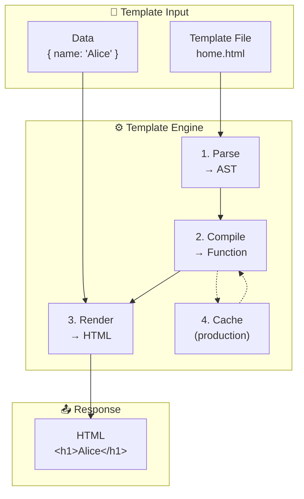
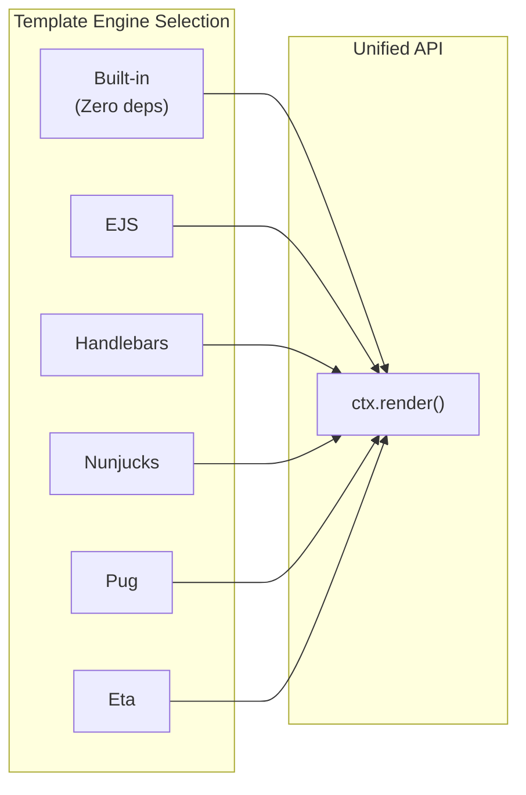
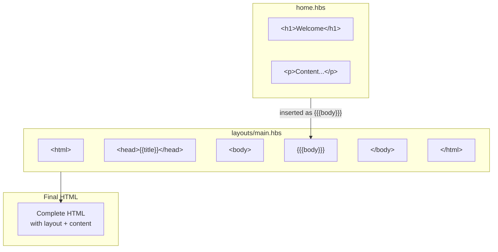
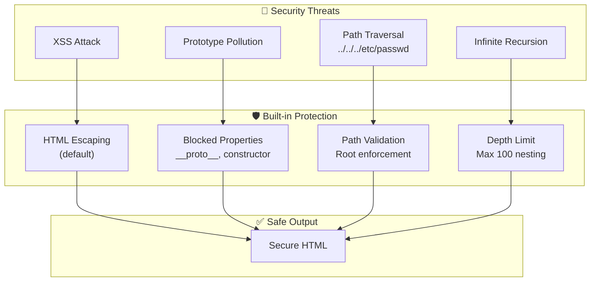

# Template Plugin

> Multi-engine template system with 70+ helpers, layouts, partials, and security-first design.

## The Problem

Server-side rendering requires more than just variable interpolation:

```typescript
// ❌ Naive approach - no escaping, no caching, no structure
const html = `<h1>${user.name}</h1><p>${user.bio}</p>`;
```

This approach is vulnerable to:

- **XSS attacks**: User input rendered without escaping
- **Prototype pollution**: Malicious data accessing `__proto__`
- **Performance issues**: Re-parsing templates on every request
- **Code duplication**: No layouts or partials

## Why NextRush Includes This

Templates are fundamental to server-side rendering:

- **APIs** need to generate HTML emails
- **SSR apps** need fast template rendering
- **Admin panels** need dynamic views
- **Documentation** needs consistent layouts

NextRush provides a security-first template system that works with any popular engine while providing sensible defaults.

## Mental Model



## Installation

```bash
pnpm add @nextrush/template
```

### Optional Engines

Install only the engines you need:

```bash
pnpm add ejs          # For EJS
pnpm add handlebars   # For Handlebars
pnpm add nunjucks     # For Nunjucks
pnpm add pug          # For Pug
pnpm add eta          # For Eta (modern EJS)
```

## Quick Start

```typescript
import { createApp } from '@nextrush/core';
import { template } from '@nextrush/template';

const app = createApp();

// Simplest setup - uses built-in engine
app.use(template());

// With views directory
app.use(template({ root: './views' }));

app.get('/', async (ctx) => {
  await ctx.render('home', { title: 'Welcome' });
});

app.listen(3000);
```

**views/home.html:**
```html
<h1>{{title}}</h1>
<p>Welcome to our site!</p>
```

## Supported Engines



| Engine | Install | Extension | Description |
|--------|---------|-----------|-------------|
| Built-in | - | `.html` | Mustache-like syntax, zero dependencies |
| `ejs` | `pnpm add ejs` | `.ejs` | Embedded JavaScript |
| `handlebars` | `pnpm add handlebars` | `.hbs` | Logic-less templates |
| `nunjucks` | `pnpm add nunjucks` | `.njk` | Mozilla's template engine |
| `pug` | `pnpm add pug` | `.pug` | Indentation-based syntax |
| `eta` | `pnpm add eta` | `.eta` | Modern EJS alternative |

### Engine Examples

#### EJS

```typescript
app.use(template('ejs', { root: './views' }));
```

```html
<!-- views/home.ejs -->
<h1>Hello <%= name %>!</h1>
<% if (items.length) { %>
  <ul>
  <% items.forEach(item => { %>
    <li><%= item %></li>
  <% }) %>
  </ul>
<% } %>
```

#### Handlebars

```typescript
app.use(template('handlebars', {
  root: './views',
  ext: '.hbs',
  layout: 'layouts/main'
}));
```

```handlebars
<!-- views/home.hbs -->
<h1>Hello {{name}}!</h1>
{{#each items}}
  <li>{{this}}</li>
{{/each}}
```

#### Nunjucks

```typescript
app.use(template('nunjucks', {
  root: './views',
  autoescape: true
}));
```

```twig
<!-- views/home.njk -->
<h1>Hello {{ name }}!</h1>

  <li>{{ item }}</li>

```

#### Pug

```typescript
app.use(template('pug', { root: './views', pretty: true }));
```

```pug
//- views/home.pug
h1 Hello #{name}!
ul
  each item in items
    li= item
```

## Configuration Options

```typescript
interface TemplateOptions {
  // Directory containing templates
  root?: string;  // default: './views'

  // File extension (default: based on engine)
  ext?: string;

  // Cache compiled templates
  cache?: boolean;  // default: true in production

  // Default layout template
  layout?: string;

  // Custom helper functions
  helpers?: Record<string, HelperFn>;

  // Enable ctx.render() method
  enableContextRender?: boolean;  // default: true
}
```

## Features

### Layouts



**views/layouts/main.hbs:**
```handlebars
<!DOCTYPE html>
<html>
<head><title>{{title}}</title></head>
<body>
  <nav>...</nav>
  {{{body}}}
  <footer>...</footer>
</body>
</html>
```

**views/home.hbs:**
```handlebars
<h1>{{title}}</h1>
<p>Welcome to our site!</p>
```

**Usage:**
```typescript
app.use(template('handlebars', {
  root: './views',
  layout: 'layouts/main'
}));

app.get('/', async (ctx) => {
  await ctx.render('home', { title: 'Welcome' });
});
```

### Override Layout Per Request

```typescript
// Use different layout
app.get('/admin', async (ctx) => {
  await ctx.render('admin/dashboard', { user }, { layout: 'layouts/admin' });
});

// No layout
app.get('/print', async (ctx) => {
  await ctx.render('report', { data }, { layout: null });
});
```

### Partials

```handlebars
<!-- views/partials/header.hbs -->
<header>
  <h1>{{title}}</h1>
  <nav>...</nav>
</header>

<!-- views/home.hbs -->
{{> header title="Home"}}
<main>
  Content here...
</main>
```

### Custom Helpers

```typescript
app.use(template({
  helpers: {
    formatDate: (date) => new Date(date).toLocaleDateString(),
    currency: (value) => `$${Number(value).toFixed(2)}`,
    uppercase: (str) => String(str).toUpperCase(),
  }
}));
```

**Built-in template usage:**
```html
<p>Date: {{ createdAt | formatDate }}</p>
<p>Price: {{ price | currency }}</p>
<p>Name: {{ name | uppercase }}</p>
```

## Built-in Helpers (70+)

The built-in engine includes comprehensive helpers:

### String Helpers

| Helper | Usage | Description |
|--------|-------|-------------|
| `upper` | <code v-pre>{{ name \| upper }}</code> | Convert to uppercase |
| `lower` | <code v-pre>{{ name \| lower }}</code> | Convert to lowercase |
| `capitalize` | <code v-pre>{{ name \| capitalize }}</code> | Capitalize first letter |
| `titleCase` | <code v-pre>{{ name \| titleCase }}</code> | Title Case String |
| `trim` | <code v-pre>{{ text \| trim }}</code> | Remove whitespace |
| `truncate` | <code v-pre>{{ text \| truncate 100 "..." }}</code> | Limit length |
| `replace` | <code v-pre>{{ text \| replace "old" "new" }}</code> | Replace substring |
| `stripHtml` | <code v-pre>{{ html \| stripHtml }}</code> | Remove HTML tags |

### Number Helpers

| Helper | Usage | Description |
|--------|-------|-------------|
| `round` | <code v-pre>{{ num \| round 2 }}</code> | Round to decimal places |
| `floor` | <code v-pre>{{ num \| floor }}</code> | Round down |
| `ceil` | <code v-pre>{{ num \| ceil }}</code> | Round up |
| `formatNumber` | <code v-pre>{{ num \| formatNumber "en-US" }}</code> | Locale formatting |
| `currency` | <code v-pre>{{ price \| currency "USD" }}</code> | Currency formatting |
| `percent` | <code v-pre>{{ ratio \| percent 2 }}</code> | Percentage formatting |

### Array Helpers

| Helper | Usage | Description |
|--------|-------|-------------|
| `first` | <code v-pre>{{ arr \| first }}</code> | First element |
| `last` | <code v-pre>{{ arr \| last }}</code> | Last element |
| `length` | <code v-pre>{{ arr \| length }}</code> | Array length |
| `sort` | <code v-pre>{{ arr \| sort }}</code> | Sort array |
| `unique` | <code v-pre>{{ arr \| unique }}</code> | Remove duplicates |
| `join` | <code v-pre>{{ arr \| join "-" }}</code> | Join to string |

### Comparison Helpers

| Helper | Usage | Description |
|--------|-------|-------------|
| `eq` | <code v-pre>{{ a \| eq b }}</code> | Equal |
| `ne` | <code v-pre>{{ a \| ne b }}</code> | Not equal |
| `lt` | <code v-pre>{{ a \| lt b }}</code> | Less than |
| `gt` | <code v-pre>{{ a \| gt b }}</code> | Greater than |
| `and` | <code v-pre>{{ a \| and b }}</code> | Logical AND |
| `or` | <code v-pre>{{ a \| or b }}</code> | Logical OR |

### Date Helpers

| Helper | Usage | Description |
|--------|-------|-------------|
| `now` | <code v-pre>{{ now }}</code> | Current date |
| `formatDate` | <code v-pre>{{ date \| formatDate }}</code> | Format date |
| `timeAgo` | <code v-pre>{{ date \| timeAgo }}</code> | Relative time |

## Security



### XSS Protection

By default, all variables are HTML-escaped:

```typescript
const template = compile('{{ comment }}');
template.render({ comment: '<script>alert("XSS")</script>' });
// => '&lt;script&gt;alert(&quot;XSS&quot;)&lt;/script&gt;'
```

Use triple mustache only for **trusted content**:

```txt
{{{ trustedHtml }}}  <!-- Unescaped output -->
```

### Prototype Pollution Protection

Access to dangerous properties is blocked:

```txt
{{ __proto__ }}              <!-- Returns empty -->
{{ constructor }}            <!-- Returns empty -->
{{ obj.__proto__.polluted }} <!-- Returns empty -->
```

### Path Traversal Protection

Template paths are validated:

```typescript
await ctx.render('../../../etc/passwd', {});
// Throws: Path traversal detected
```

### Recursion Protection

Infinite partial loops are prevented:

```typescript
// Max nesting depth: 100
await ctx.render('recursive', {});
// Throws: Maximum template nesting depth exceeded
```

## Context Extension

### `ctx.render(view, data?, options?)`

Render a template and send as HTML response.

```typescript
app.get('/', async (ctx) => {
  await ctx.render('home', { title: 'Home' });
});

// With render options
app.get('/admin', async (ctx) => {
  await ctx.render('admin', { user }, { layout: 'layouts/admin' });
});
```

## API Reference

### `template(engine?, options?)`

Create the template middleware.

```typescript
// Built-in engine (default)
app.use(template());
app.use(template({ root: './views' }));

// Specific engine
app.use(template('ejs', { root: './views' }));
app.use(template('handlebars', { root: './views', ext: '.hbs' }));
```

### `templatePlugin(engine?, options?)`

Create as a plugin instead of middleware.

```typescript
import { templatePlugin } from '@nextrush/template';

app.plugin(templatePlugin('handlebars', {
  root: './views',
  helpers: { /* ... */ }
}));
```

### `compile(source, options?)`

Compile a template string.

```typescript
import { compile } from '@nextrush/template';

const template = compile('Hello {{name}}!');
const result = template.render({ name: 'World' });
// => 'Hello World!'

// Async rendering
const asyncResult = await template.renderAsync({ name: 'World' });
```

### `createEngine(options?)`

Create a template engine instance.

```typescript
import { createEngine } from '@nextrush/template';

const engine = createEngine({
  root: './views',
  ext: '.html',
  cache: true,
  layout: 'layouts/main',
});

const html = await engine.render('home', { title: 'Welcome' });
```

## Runtime Compatibility

| Runtime | String Rendering | File Rendering |
|---------|-----------------|----------------|
| Node.js 20+ | ✅ Full support | ✅ Full support |
| Bun | ✅ Full support | ✅ Full support |
| Deno | ✅ Full support | ✅ With `--allow-read` |
| Edge (Cloudflare/Vercel) | ✅ Full support | ❌ No filesystem |

For edge runtimes, use pre-compiled templates:

```typescript
import { compile } from '@nextrush/template';

// Pre-compile at build time
const homeTemplate = compile(`<h1>{{title}}</h1>`);

// Render at runtime (no filesystem needed)
export default {
  async fetch(request) {
    const html = homeTemplate.render({ title: 'Edge App' });
    return new Response(html, {
      headers: { 'Content-Type': 'text/html' }
    });
  }
};
```

## Common Mistakes

### Mistake: Forgetting to Escape User Input

```html
<!-- ❌ Dangerous for user-provided content -->
{{{userComment}}}

<!-- ✅ Safe by default -->
{{userComment}}
```

### Mistake: Not Setting a Root Directory

```typescript
// ❌ Uses current working directory
app.use(template());

// ✅ Explicit views directory
app.use(template({ root: './views' }));
```

### Mistake: Disabling Cache in Production

```typescript
// ❌ Re-parses templates on every request
app.use(template({ cache: false }));

// ✅ Cache is automatic in production
app.use(template()); // cache: true when NODE_ENV=production
```

## Performance

- **Compiled Templates**: Templates are parsed once and reused
- **Efficient Rendering**: Minimal allocations during rendering
- **Production Caching**: Automatic caching when `NODE_ENV=production`
- **Benchmarks**: Handles 10,000+ items in under 500ms

## Next Steps

- Learn about [Middleware](/concepts/middleware) composition
- See [Static Files](/packages/plugins/static) for serving assets
- Read [Security Best Practices](/guides/security)
