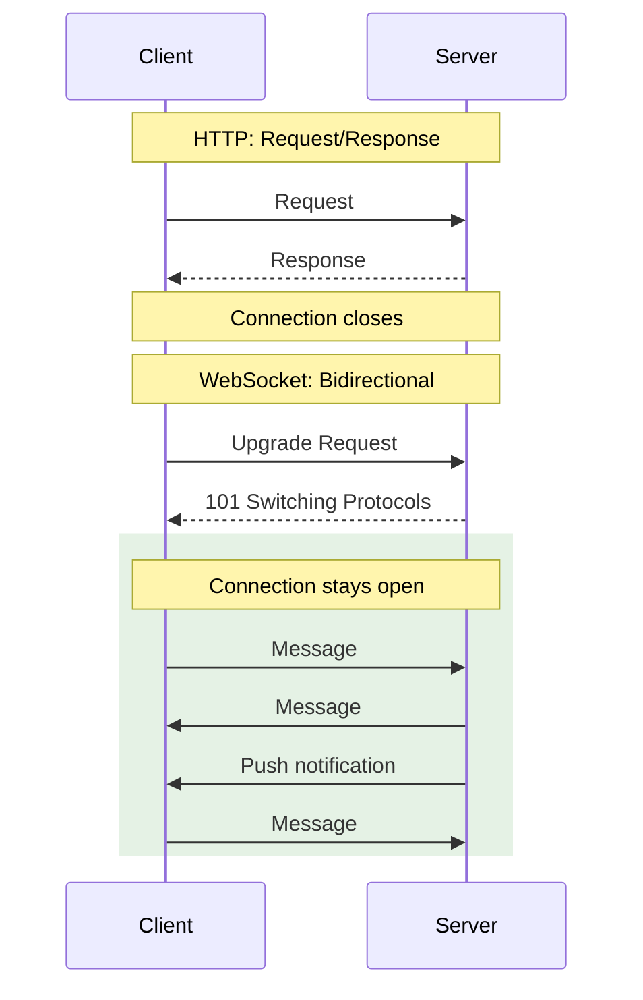
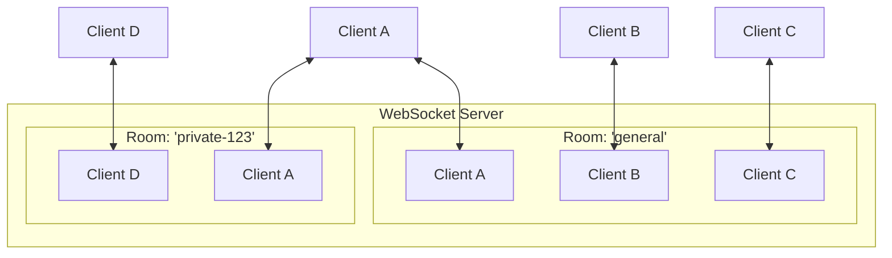
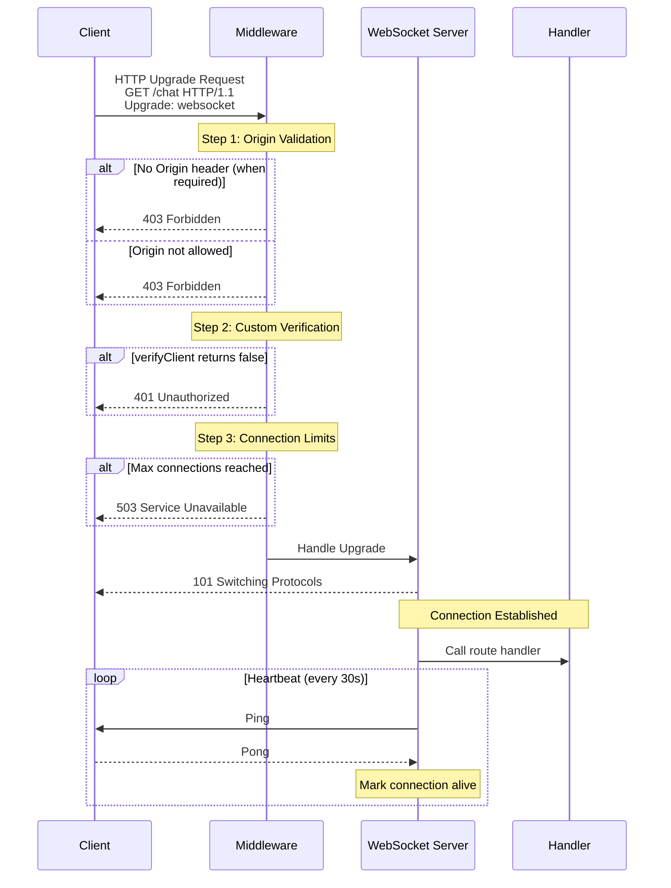
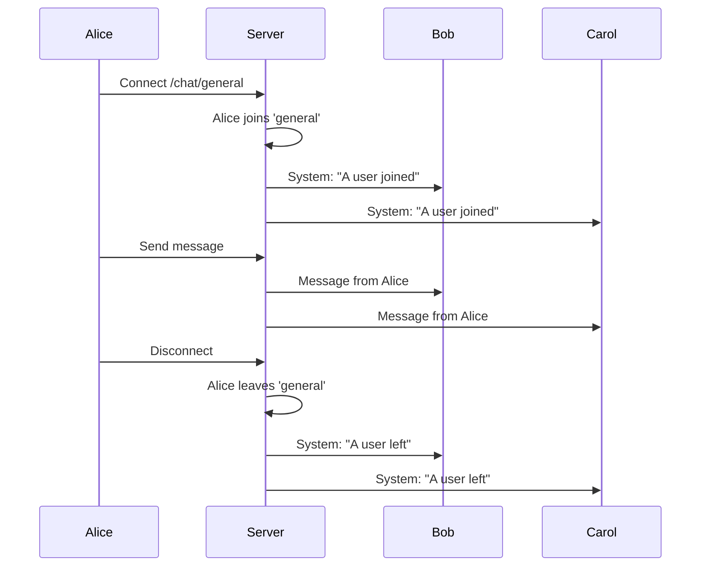
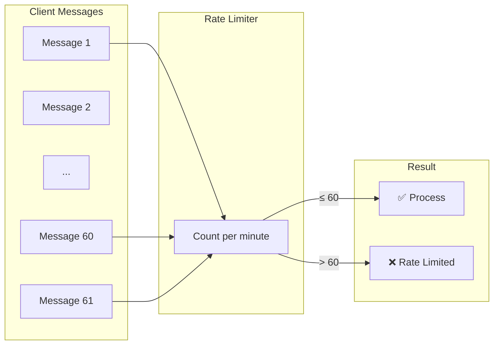
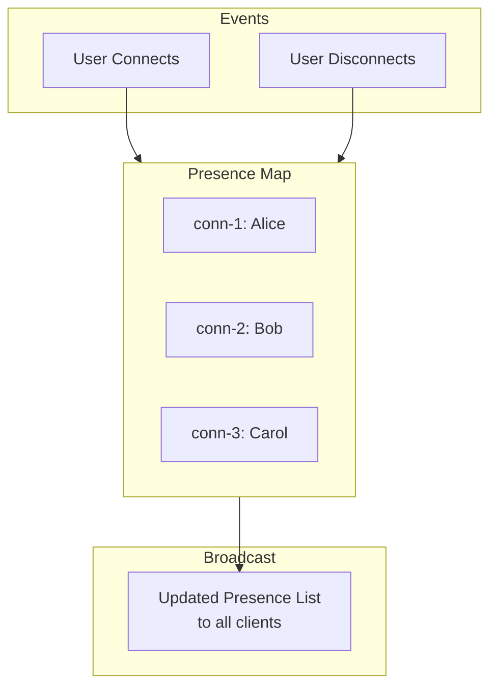
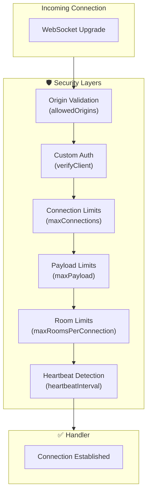

# WebSocket

> Real-time bidirectional communication with rooms, broadcasting, and security.

## The Problem

Building real-time features requires managing WebSocket connections—a fundamentally different paradigm from HTTP request/response.

```typescript
// This approach leads to unmaintainable code
const connections = new Map();

server.on('upgrade', (request, socket, head) => {
  // Manual WebSocket handshake
  // Manual connection tracking
  // Manual room management
  // Manual heartbeat implementation
  // Manual cleanup on disconnect
  // Manual error handling
  // ...hundreds of lines of boilerplate
});
```

Common challenges with raw WebSocket implementations:

- **Connection tracking**: Who's connected? Which rooms are they in?
- **Message routing**: How do you send to specific groups?
- **Health monitoring**: How do you detect dead connections?
- **Security**: Origin validation, authentication, rate limiting?
- **Cleanup**: Memory leaks from unclosed connections

## Why NextRush WebSocket Exists

NextRush WebSocket provides a production-ready abstraction:

```typescript
const wss = createWebSocket({
  allowedOrigins: ['https://example.com'],
  maxConnections: 1000,
  heartbeatInterval: 30000,
});

wss.on('/chat', (conn) => {
  conn.join('general');

  conn.on('message', (msg) => {
    conn.broadcast('general', msg);
  });
});
```

What you get:

- **Automatic connection tracking** with unique IDs
- **Room management** for organized message routing
- **Heartbeat detection** to find dead connections
- **Origin validation** with wildcard support
- **Graceful cleanup** when connections close

## Mental Model

Think of WebSocket as a **persistent phone line** compared to HTTP's **postal service**:



NextRush WebSocket adds a **room system** on top:



When Client A broadcasts to "general", Clients B and C receive the message (not A itself). Rooms enable organized, targeted communication.

## Basic Usage

```typescript
import { createApp } from '@nextrush/core';
import { createWebSocket } from '@nextrush/websocket';

const app = createApp();
const wss = createWebSocket();

// Register route handler
wss.on('/chat', (conn, request) => {
  console.log('New connection:', conn.id);

  // Handle incoming messages
  conn.on('message', (data) => {
    console.log('Received:', data);
    conn.send(`Echo: ${data}`);
  });

  // Handle disconnection
  conn.on('close', (code, reason) => {
    console.log('Disconnected:', code, reason);
  });

  // Handle errors
  conn.on('error', (error) => {
    console.error('Error:', error);
  });
});

// Create upgrade middleware (required)
app.use(wss.upgrade());

// Start server and attach WebSocket
const server = app.listen(3000, () => {
  wss.attach(server);
});
```

**What this does:**

1. Creates a WebSocket server with default settings
2. Registers a handler for connections to `/chat`
3. Echoes messages back to the sender
4. Logs connection lifecycle events
5. Attaches to the HTTP server for upgrade handling

## What Happens Behind the Scenes

When a WebSocket connection is established:



### 1. HTTP Upgrade Request

```
Client sends:
GET /chat HTTP/1.1
Upgrade: websocket
Connection: Upgrade
Sec-WebSocket-Key: dGhlIHNhbXBsZSBub25jZQ==
Origin: https://example.com
```

### 2. Origin Validation

```
If allowedOrigins configured:
  - No Origin header → 403 Forbidden (security: prevents bypass)
  - Origin not in list → 403 Forbidden
  - Origin matches (including wildcards) → Continue
```

### 3. Custom Verification

```
If verifyClient callback provided:
  - Call verifyClient(request)
  - Returns false → 401 Unauthorized
  - Throws error → 500 Internal Server Error
  - Returns true → Continue
```

### 4. Connection Limits

```
If maxConnections configured:
  - Current connections >= max → 503 Service Unavailable
  - Under limit → Continue
```

### 5. Connection Established

```
Server responds:
HTTP/1.1 101 Switching Protocols
Upgrade: websocket
Connection: Upgrade
Sec-WebSocket-Accept: s3pPLMBiTxaQ9kYGzzhZRbK+xOo=
```

### 6. Heartbeat Tracking

```
Every heartbeatInterval:
  - Server pings all connections
  - Marks connection as "waiting for pong"
  - If no pong by next heartbeat → Connection terminated
```

## Configuration Options

### Full Options Reference

```typescript
const wss = createWebSocket({
  // Path matching
  path: ['/ws', '/socket'],      // Allowed paths (default: ['/'])

  // Connection limits
  maxConnections: 1000,          // Max concurrent connections (0 = unlimited)
  maxPayload: 1024 * 1024,       // Max message size in bytes (default: 1MB)
  maxRoomsPerConnection: 100,    // Max rooms per connection (default: 100)

  // Health monitoring
  heartbeatInterval: 30000,      // Ping interval in ms (0 to disable)
  clientTimeout: 60000,          // Terminate if no pong within this time

  // Security
  allowedOrigins: [              // CORS origins (empty = allow all)
    'https://example.com',
    'https://*.example.com',     // Wildcard support
  ],

  // Custom authentication
  verifyClient: async (request) => {
    const token = request.headers.authorization;
    return await validateToken(token);
  },

  // Compression
  perMessageDeflate: false,      // Enable compression (default: false)

  // Lifecycle hooks
  onConnection: (conn) => { },
  onClose: (conn, code, reason) => { },
  onError: (conn, error) => { },
});
```

### Security-Focused Configuration

```typescript
const wss = createWebSocket({
  // Strict origin validation
  allowedOrigins: ['https://myapp.com'],

  // Custom authentication
  verifyClient: async (request) => {
    const token = request.headers['x-auth-token'];
    if (!token) return false;

    try {
      const user = await verifyJWT(token);
      // Store user on request for later access
      (request as any).user = user;
      return true;
    } catch {
      return false;
    }
  },

  // Resource limits
  maxConnections: 500,
  maxPayload: 64 * 1024, // 64KB max message
  maxRoomsPerConnection: 10,

  // Fast dead connection detection
  heartbeatInterval: 15000,
  clientTimeout: 30000,
});
```

### Development Configuration

```typescript
const wss = createWebSocket({
  // Allow all origins in development
  allowedOrigins: [],

  // Disable heartbeat for easier debugging
  heartbeatInterval: 0,

  // Verbose logging
  onConnection: (conn) => {
    console.log('[WS] Connected:', conn.id, conn.url);
  },
  onClose: (conn, code, reason) => {
    console.log('[WS] Closed:', conn.id, code, reason);
  },
  onError: (conn, error) => {
    console.error('[WS] Error:', conn.id, error);
  },
});
```

## Connection API Reference

### Sending Messages

#### `conn.send(data)`

Send raw message (string or Buffer).

```typescript
conn.send('Hello, client!');
conn.send(Buffer.from([0x01, 0x02, 0x03]));
```

#### `conn.json(data)`

Send JSON (automatically stringified).

```typescript
conn.json({ type: 'message', text: 'Hello' });
conn.json({ users: ['Alice', 'Bob'] });
```

**Note:** If `JSON.stringify` fails (circular references, BigInt), the error is silently ignored to prevent server crashes.

### Room Management

#### `conn.join(room)`

Join a room.

```typescript
conn.join('chat');
conn.join('user:alice');
```

**Validation:**
- Room name must be non-empty string
- Maximum length: 256 characters
- Connection can join up to `maxRoomsPerConnection` rooms (default: 100)

```typescript
// Throws TypeError
conn.join('');                    // Empty
conn.join('a'.repeat(300));       // Too long

// Throws MaxRoomsExceededError
for (let i = 0; i < 200; i++) {
  conn.join(`room-${i}`);         // Exceeds limit at 100
}
```

#### `conn.leave(room)`

Leave a room.

```typescript
conn.leave('chat');
```

#### `conn.leaveAll()`

Leave all rooms.

```typescript
conn.leaveAll();
```

#### `conn.getRooms()`

Get list of rooms this connection is in.

```typescript
const rooms = conn.getRooms();
// ['chat', 'user:alice']
```

### Broadcasting

#### `conn.broadcast(room, data)`

Broadcast to all connections in a room (excluding self).

```typescript
// Message from Alice is sent to everyone else in 'chat'
conn.broadcast('chat', 'Alice joined the room');
```

#### `conn.broadcastJson(room, data)`

Broadcast JSON to a room (excluding self).

```typescript
conn.broadcastJson('chat', {
  type: 'message',
  from: 'alice',
  text: 'Hello everyone!',
});
```

### Event Handling

#### `conn.on(event, handler)`

Listen for events.

```typescript
// Messages
conn.on('message', (data) => {
  // data is string or Buffer depending on message type
  console.log('Received:', data);
});

// Connection closed
conn.on('close', (code, reason) => {
  console.log('Closed:', code, reason);
});

// Errors
conn.on('error', (error) => {
  console.error('Error:', error);
});

// Ping/pong (for custom heartbeat)
conn.on('ping', (data) => console.log('Ping received'));
conn.on('pong', (data) => console.log('Pong received'));
```

#### `conn.off(event, handler)`

Remove event handler.

```typescript
const handler = (data) => console.log(data);
conn.on('message', handler);
conn.off('message', handler);
```

### Connection Control

#### `conn.close(code?, reason?)`

Close the connection.

```typescript
conn.close();                           // Normal closure (1000)
conn.close(1008, 'Policy violation');   // With code and reason
```

#### `conn.ping(data?)` / `conn.pong(data?)`

Send ping/pong frames.

```typescript
conn.ping();
conn.ping(Buffer.from('heartbeat'));
```

### Connection Properties

```typescript
conn.id        // Unique connection ID (UUID)
conn.url       // Connection URL path
conn.isOpen    // Whether connection is open
conn.request   // Original HTTP request (IncomingMessage)
```

## Server API Reference

### Broadcasting

#### `wss.broadcast(data, exclude?)`

Broadcast to all connections.

```typescript
wss.broadcast('Server message');
wss.broadcast('Hello others', currentConn); // Exclude one connection
```

#### `wss.broadcastJson(data, exclude?)`

Broadcast JSON to all connections.

```typescript
wss.broadcastJson({ type: 'announcement', text: 'Server restarting' });
```

#### `wss.broadcastToRoom(room, data, exclude?)`

Broadcast to specific room.

```typescript
wss.broadcastToRoom('chat', 'New message in chat');
```

#### `wss.broadcastJsonToRoom(room, data, exclude?)`

Broadcast JSON to specific room.

```typescript
wss.broadcastJsonToRoom('chat', { type: 'message', text: 'Hello' });
```

### Connection Management

```typescript
// Get all connections
const connections = wss.getConnections();

// Get connection count
const count = wss.getConnectionCount();

// Get all room names
const rooms = wss.getRooms();

// Get connections in a room
const chatConnections = wss.getRoomConnections('chat');

// Close all connections
wss.closeAll(1001, 'Server shutdown');

// Cleanup resources
wss.close();
```

## Common Patterns

### Chat Room



```typescript
wss.on('/chat/:room', (conn, request) => {
  const url = new URL(request.url!, `http://${request.headers.host}`);
  const room = url.pathname.split('/').pop()!;

  // Join room on connect
  conn.join(room);

  // Announce arrival
  conn.broadcastJson(room, {
    type: 'system',
    message: 'A user joined the room',
  });

  // Handle messages
  conn.on('message', (data) => {
    try {
      const msg = JSON.parse(data.toString());
      conn.broadcastJson(room, {
        type: 'message',
        from: msg.username,
        text: msg.text,
        timestamp: Date.now(),
      });
    } catch {
      conn.json({ type: 'error', message: 'Invalid message format' });
    }
  });

  // Announce departure
  conn.on('close', () => {
    conn.broadcastJson(room, {
      type: 'system',
      message: 'A user left the room',
    });
  });
});
```

### Authentication Middleware

```typescript
wss.use(async (conn, request, next) => {
  const token = request.headers['authorization']?.replace('Bearer ', '');

  if (!token) {
    conn.json({ type: 'error', code: 'UNAUTHORIZED' });
    conn.close(1008, 'Unauthorized');
    return;
  }

  try {
    const user = await verifyToken(token);
    // Attach user to connection for later use
    (conn as any).user = user;
    next();
  } catch {
    conn.json({ type: 'error', code: 'INVALID_TOKEN' });
    conn.close(1008, 'Invalid token');
  }
});
```

### Rate Limiting



```typescript
const messageCounts = new Map<string, number>();

setInterval(() => messageCounts.clear(), 60000); // Reset every minute

wss.on('/chat', (conn) => {
  conn.on('message', (data) => {
    const count = (messageCounts.get(conn.id) ?? 0) + 1;
    messageCounts.set(conn.id, count);

    if (count > 60) { // 60 messages per minute
      conn.json({ type: 'error', code: 'RATE_LIMITED' });
      return;
    }

    // Process message...
  });
});
```

### Presence Tracking



```typescript
const presence = new Map<string, { id: string; username: string }>();

wss.on('/app', (conn, request) => {
  const username = new URL(request.url!, 'http://localhost').searchParams.get('username');

  // Add to presence
  presence.set(conn.id, { id: conn.id, username: username ?? 'Anonymous' });

  // Broadcast updated presence list
  const broadcastPresence = () => {
    wss.broadcastJson({ type: 'presence', users: Array.from(presence.values()) });
  };

  broadcastPresence();

  conn.on('close', () => {
    presence.delete(conn.id);
    broadcastPresence();
  });
});
```

## Security Considerations

### Security Architecture



### Origin Validation

When `allowedOrigins` is configured:

```typescript
const wss = createWebSocket({
  allowedOrigins: ['https://example.com', 'https://*.example.com'],
});
```

**Behavior:**
- Requests **without** Origin header are **denied** (prevents bypass attacks)
- Wildcard patterns (`*`) are supported for subdomains
- Special regex characters in patterns are properly escaped

### Room Limits

Prevent memory exhaustion attacks:

```typescript
const wss = createWebSocket({
  maxRoomsPerConnection: 50,
});
```

A connection trying to join more rooms than allowed will receive a `MaxRoomsExceededError`.

### Message Size Limits

Prevent large message attacks:

```typescript
const wss = createWebSocket({
  maxPayload: 64 * 1024, // 64KB limit
});
```

### Connection Limits

Prevent connection exhaustion:

```typescript
const wss = createWebSocket({
  maxConnections: 1000,
});
```

### Dead Connection Detection

Automatically terminate unresponsive connections:

```typescript
const wss = createWebSocket({
  heartbeatInterval: 30000,
  clientTimeout: 60000,
});
```

Connections that don't respond to pings within `clientTimeout` are terminated with code 1001.

## Runtime Compatibility

| Runtime | Support | Notes |
|---------|---------|-------|
| Node.js 20+ | ✅ Full | Uses `ws` library |
| Bun | ❌ | Use Bun's native WebSocket API |
| Deno | ❌ | Use Deno's native WebSocket API |
| Cloudflare Workers | ❌ | Use platform WebSocket API |
| Vercel Edge | ❌ | Use platform WebSocket API |

This package is **Node.js only** because it uses:
- `node:http` - HTTP server types
- `node:net` - Socket types
- `node:crypto` - UUID generation
- `ws` library - WebSocket implementation

For other runtimes, use their native WebSocket APIs or platform-specific packages.

## Common Mistakes

### Mistake: Forgetting to attach to HTTP server

```typescript
// ❌ WebSocket won't work
const server = app.listen(3000);
// Missing: wss.attach(server);

// ✅ Correct
const server = app.listen(3000, () => {
  wss.attach(server);
});
```

### Mistake: Not validating message data

```typescript
// ❌ Dangerous: trusting client data
conn.on('message', (data) => {
  const msg = JSON.parse(data.toString());
  db.query(`SELECT * FROM users WHERE id = ${msg.userId}`); // SQL injection!
});

// ✅ Safe: validate and sanitize
conn.on('message', (data) => {
  try {
    const msg = messageSchema.parse(JSON.parse(data.toString()));
    // msg is now validated
  } catch {
    conn.json({ error: 'Invalid message format' });
  }
});
```

### Mistake: Storing sensitive data on connection

```typescript
// ❌ Accessible to other code
(conn as any).password = userPassword;

// ✅ Use separate storage with connection ID as key
const userData = new Map<string, UserData>();
userData.set(conn.id, { /* ... */ });
```

### Mistake: Not handling disconnection

```typescript
// ❌ Memory leak: timer keeps running
conn.on('message', () => {
  const interval = setInterval(() => {
    conn.json({ timestamp: Date.now() });
  }, 1000);
});

// ✅ Clean up on disconnect
let interval: NodeJS.Timer;
conn.on('message', () => {
  interval = setInterval(() => {
    conn.json({ timestamp: Date.now() });
  }, 1000);
});
conn.on('close', () => {
  clearInterval(interval);
});
```

## When NOT to Use WebSocket

### Use HTTP for request/response patterns

```typescript
// ❌ WebSocket overkill for simple API calls
conn.on('message', async (data) => {
  const { action, payload } = JSON.parse(data.toString());
  if (action === 'getUser') {
    const user = await db.users.findById(payload.id);
    conn.json({ type: 'user', data: user });
  }
});

// ✅ Just use HTTP
app.get('/users/:id', async (ctx) => {
  const user = await db.users.findById(ctx.params.id);
  ctx.json(user);
});
```

### Use Server-Sent Events for one-way streaming

If you only need server → client communication (notifications, live updates), SSE is simpler:

```typescript
// SSE is simpler for one-way push
app.get('/events', (ctx) => {
  ctx.set('Content-Type', 'text/event-stream');
  // Stream events...
});
```

### Use message queues for high-volume events

For millions of events per second, use dedicated message brokers (Redis Pub/Sub, Kafka, RabbitMQ) instead of handling everything in your application process.

## Next Steps

- Learn about [Middleware](/concepts/middleware) for request processing
- See [Events Plugin](/plugins/events) for application-level pub/sub
- Read [Deployment Guide](/guides/deployment) for production configuration
