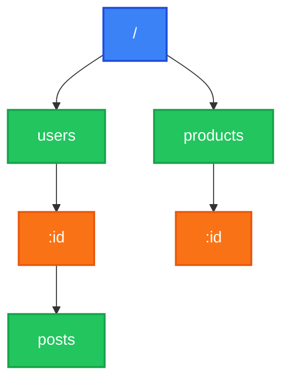

# @nextrush/router

> High-performance radix tree router. O(k) route matching where k = path length, not route count.

## The Problem

Traditional routers in Express, Koa, and most Node.js frameworks use **array-based matching**. Every incoming request iterates through all registered routes until one matches.

This creates real problems at scale:

**Performance degrades linearly with route count.** With 10 routes, matching is fast. With 500 routes in a large API, every request scans hundreds of patterns. Microservices with many endpoints feel this pain.

**Route order creates subtle bugs.** When routes are checked sequentially, the order of registration matters. A catch-all route defined before specific routes swallows requests. Developers learn through trial and error which order "works."

**Parameter extraction happens multiple times.** Array-based routers often re-parse path parameters during the matching process. Each failed route match wastes CPU cycles on parsing that won't be used.

## How NextRush Approaches This

NextRush uses a **radix tree** (compressed prefix tree) for route storage and matching.

Routes are stored in a tree structure where common prefixes are shared:



When a request arrives for `/users/123/posts`:
1. Match `/` → found, descend
2. Match `users` → found, descend
3. Match `:id` → parameter node, capture `123`, descend
4. Match `posts` → found, return handler + params

Four comparisons total, regardless of how many other routes exist.

**The key insight**: Route count doesn't affect lookup time. Whether you have 10 routes or 10,000 routes, matching complexity stays O(k) where k is the path length (typically 10-50 characters).

## Mental Model

Think of routing as **walking a directory tree**, not searching a list.

When you define routes, you're building a filesystem:

```
/
├── api/
│   └── v1/
│       ├── users/
│       │   ├── index (GET, POST)
│       │   └── :id/
│       │       ├── index (GET, PUT, DELETE)
│       │       └── posts/
│       │           └── index (GET)
│       └── products/
│           └── index (GET)
└── health (GET)
```

Request matching is like `cd /api/v1/users/123/posts`. You don't scan every file in the system. You follow the path.

**Parameters are directory wildcards.** `:id` matches any single path segment, like a folder that accepts any name but remembers what you called it.

**Wildcards are recursive globs.** `*` captures everything below, like `find . -type f`.

## Installation

```bash
pnpm add @nextrush/router
```

## Quick Start

```typescript
import { createApp } from '@nextrush/core';
import { createRouter } from '@nextrush/router';

const app = createApp();
const router = createRouter();

router.get('/', (ctx) => {
  ctx.json({ message: 'Home' });
});

router.get('/users/:id', (ctx) => {
  ctx.json({ userId: ctx.params.id });
});

app.use(router.routes());
app.listen(3000);
```

::: info What NextRush Does Automatically
When you call `router.routes()`:
1. **Compiles the radix tree** - Routes are organized for O(k) matching
2. **Returns middleware** - A function compatible with `app.use()`
3. **Sets `ctx.params`** - Extracted parameters are attached to context
4. **Calls next if no match** - Unmatched requests pass to the next middleware
:::

## Route Registration

### HTTP Methods

```typescript
router.get('/resource', handler);
router.post('/resource', handler);
router.put('/resource/:id', handler);
router.patch('/resource/:id', handler);
router.delete('/resource/:id', handler);
router.head('/resource', handler);
router.options('/resource', handler);

// Register for all HTTP methods
router.all('/any-method', handler);

// Register specific method dynamically
router.route('GET', '/dynamic', handler);
```

### Route Parameters

Parameters capture path segments and make them available in `ctx.params`:

```typescript
router.get('/users/:id', (ctx) => {
  console.log(ctx.params.id);  // '123' for /users/123
});

router.get('/users/:userId/posts/:postId', (ctx) => {
  const { userid, postid } = ctx.params;
  // /users/42/posts/7 → { userid: '42', postid: '7' }
});
```

::: warning Parameter Name Case
By default, the router operates in case-insensitive mode. Parameter names are lowercased in `ctx.params`. If you define `:userId`, access it as `ctx.params.userid`.

To preserve original case, use `caseSensitive: true` in router options.
:::

### Wildcard Routes

Wildcards capture all remaining path segments:

```typescript
router.get('/files/*', (ctx) => {
  const path = ctx.params['*'];
  // /files/docs/readme.md → ctx.params['*'] = 'docs/readme.md'
});
```

Wildcards must be the **last segment** in a route. Everything after the `*` is captured as a single string.

```typescript
// ✅ Valid: wildcard at end
router.get('/static/*', handler);

// ❌ Invalid pattern: won't work as expected
router.get('/*/files', handler);
```

## Route Groups

Groups share a common prefix and optionally middleware:

### Simple Grouping

```typescript
router.group('/api', (api) => {
  api.get('/users', listUsers);     // GET /api/users
  api.post('/users', createUser);   // POST /api/users
  api.get('/posts', listPosts);     // GET /api/posts
});
```

### Nested Groups

```typescript
router.group('/api', (api) => {
  api.group('/v1', (v1) => {
    v1.get('/users', v1Handler);    // GET /api/v1/users
  });

  api.group('/v2', (v2) => {
    v2.get('/users', v2Handler);    // GET /api/v2/users
  });
});
```

### Group Middleware

Apply middleware to all routes in a group:

```typescript
const auth = async (ctx, next) => {
  if (!ctx.get('Authorization')) {
    ctx.status = 401;
    ctx.json({ error: 'Unauthorized' });
    return;
  }
  await next();
};

router.group('/admin', [auth], (admin) => {
  admin.get('/dashboard', getDashboard);   // Protected
  admin.get('/settings', getSettings);     // Protected
});

router.get('/public', publicHandler);      // Not protected
```

Nested groups accumulate middleware:

```typescript
router.group('/api', [logMiddleware], (api) => {
  api.group('/admin', [authMiddleware], (admin) => {
    admin.get('/users', handler);
    // Middleware chain: logMiddleware → authMiddleware → handler
  });
});
```

## Route Middleware

Apply middleware to individual routes:

```typescript
router.get('/protected', authMiddleware, handler);

// Multiple middleware execute in order
router.get('/admin', authMiddleware, roleCheck, rateLimiter, handler);
```

The last function is the handler. All preceding functions are middleware.

## Redirects

Built-in redirect support with parameter interpolation:

```typescript
// Permanent redirect (301)
router.redirect('/old-page', '/new-page');

// Temporary redirect (302)
router.redirect('/temp', '/destination', 302);

// External URL
router.redirect('/docs', 'https://docs.example.com');

// Parameter interpolation
router.redirect('/users/:id', '/profiles/:id');
// /users/123 → Location: /profiles/123
```

Supported status codes: `301`, `302`, `303`, `307`, `308`

## Sub-Router Mounting

Compose smaller routers into larger applications:

```typescript
// users.ts
const userRouter = createRouter();
userRouter.get('/', listUsers);
userRouter.get('/:id', getUser);
userRouter.post('/', createUser);

// posts.ts
const postRouter = createRouter();
postRouter.get('/', listPosts);
postRouter.get('/:id', getPost);

// app.ts
const api = createRouter();
api.use('/users', userRouter);
api.use('/posts', postRouter);

app.use(api.routes());
// Resulting routes:
// GET /users, GET /users/:id, POST /users
// GET /posts, GET /posts/:id
```

## Allowed Methods

Handle 405 Method Not Allowed automatically:

```typescript
app.use(router.routes());
app.use(router.allowedMethods());
```

When a path exists but the HTTP method doesn't have a handler:

```
GET  /users     → 200 OK (handler exists)
POST /users     → 405 Method Not Allowed (no POST handler)
                  Allow: GET, HEAD
OPTIONS /users  → 200 OK
                  Allow: GET, HEAD
```

## Router Options

```typescript
const router = createRouter({
  prefix: '/api/v1',     // Prepend to all routes
  caseSensitive: false,  // Case-insensitive matching (default)
  strict: false,         // Ignore trailing slashes (default)
});
```

### Case Sensitivity

```typescript
// Default: case-insensitive
router.get('/Users', handler);
// Matches: /users, /Users, /USERS

// Case-sensitive mode
const router = createRouter({ caseSensitive: true });
router.get('/Users', handler);
// Matches: /Users only
```

### Trailing Slash Handling

```typescript
// Default: trailing slashes normalized
router.get('/users', handler);
// Matches: /users, /users/

// Strict mode preserves distinction
const router = createRouter({ strict: true });
router.get('/users', handler);
router.get('/users/', differentHandler);
```

## Common Patterns

### RESTful Resources

```typescript
const router = createRouter();

// Users resource
router.get('/users', listUsers);
router.post('/users', createUser);
router.get('/users/:id', getUser);
router.put('/users/:id', updateUser);
router.delete('/users/:id', deleteUser);
```

### API Versioning

```typescript
const v1 = createRouter({ prefix: '/api/v1' });
v1.get('/users', v1UsersHandler);

const v2 = createRouter({ prefix: '/api/v2' });
v2.get('/users', v2UsersHandler);

app.use(v1.routes());
app.use(v2.routes());
```

### SPA Fallback

```typescript
// API routes first
router.get('/api/*', apiHandler);

// SPA catch-all for client-side routing
router.get('/*', (ctx) => {
  ctx.html(indexHtml);
});
```

## Common Mistakes

### Forgetting to Mount Routes

```typescript
// ❌ Routes defined but not mounted
const router = createRouter();
router.get('/users', handler);
app.listen(3000);  // No routes work

// ✅ Mount with routes()
const router = createRouter();
router.get('/users', handler);
app.use(router.routes());
app.listen(3000);
```

### Parameter Name Case

```typescript
router.get('/users/:userId', (ctx) => {
  // ❌ Won't work in case-insensitive mode
  const id = ctx.params.userId;

  // ✅ Correct
  const id = ctx.params.userid;
});
```

### Wildcard Placement

```typescript
// ❌ Wildcard must be last
router.get('/*/end', handler);

// ✅ Wildcard at path end
router.get('/start/*', handler);
```

### Missing Error Handling

```typescript
// ❌ No 404 handling
app.use(router.routes());

// ✅ Handle unmatched routes
app.use(router.routes());
app.use((ctx) => {
  if (ctx.status === 404) {
    ctx.json({ error: 'Not found' });
  }
});
```

## Performance

The radix tree router delivers consistent performance regardless of route count:

| Routes | Lookup Time |
|--------|-------------|
| 100 | ~0.02ms |
| 1,000 | ~0.02ms |
| 10,000 | ~0.02ms |

Time complexity: O(k) where k = path length (~10-50 chars), not route count.

Memory is also efficient: shared prefixes are stored once, not duplicated.

## API Reference

### `createRouter(options?)`

Create a new router instance.

**Signature:**

```typescript
function createRouter(options?: RouterOptions): Router
```

**Options:**

| Option | Type | Default | Description |
|--------|------|---------|-------------|
| `prefix` | `string` | `''` | Path prefix for all routes |
| `caseSensitive` | `boolean` | `false` | Enable case-sensitive matching |
| `strict` | `boolean` | `false` | Enable strict trailing slash |

### `router.routes()`

Returns middleware function for mounting on application.

**Signature:**

```typescript
routes(): Middleware
```

### `router.allowedMethods()`

Returns middleware that handles 405 responses and OPTIONS requests.

**Signature:**

```typescript
allowedMethods(): Middleware
```

### `router.match(method, path)`

Manually match a route (useful for testing).

**Signature:**

```typescript
match(method: HttpMethod, path: string): RouteMatch | null
```

**Returns:**

```typescript
interface RouteMatch {
  handler: RouteHandler;
  params: Record<string, string>;
  middleware: Middleware[];
}
```

### `router.group(prefix, middleware?, callback)`

Create a route group.

**Signatures:**

```typescript
group(prefix: string, callback: (router: Router) => void): Router
group(prefix: string, middleware: Middleware[], callback: (router: Router) => void): Router
```

### `router.redirect(from, to, status?)`

Register a redirect route.

**Signature:**

```typescript
redirect(from: string, to: string, status?: 301 | 302 | 303 | 307 | 308): Router
```

## TypeScript Types

```typescript
import { createRouter, Router } from '@nextrush/router';

import type {
  HttpMethod,
  Middleware,
  Route,
  RouteHandler,
  RouteMatch,
  RouterOptions,
} from '@nextrush/router';
```

## Runtime Compatibility

| Runtime | Supported |
|---------|-----------|
| Node.js 20+ | ✅ |
| Bun 1.0+ | ✅ |
| Deno 2.0+ | ✅ |
| Cloudflare Workers | ✅ |
| Vercel Edge Runtime | ✅ |

The router uses only standard JavaScript APIs. No native modules, no runtime-specific code.
