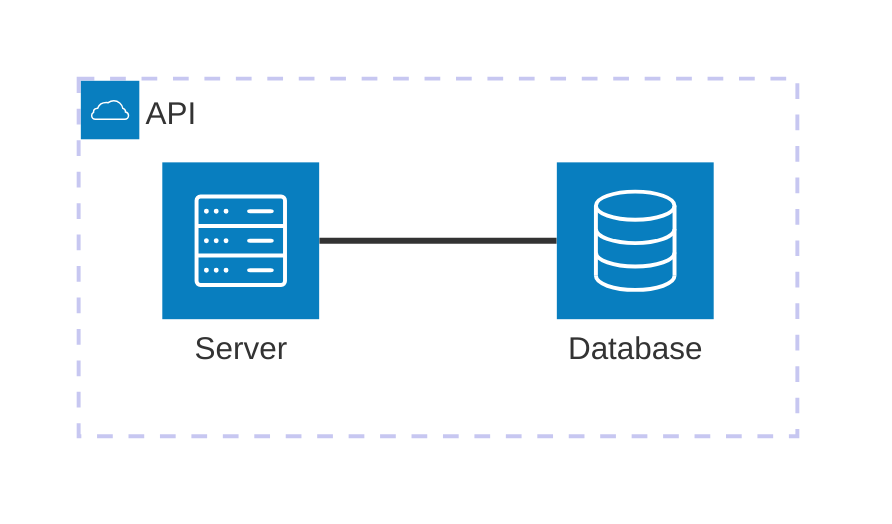
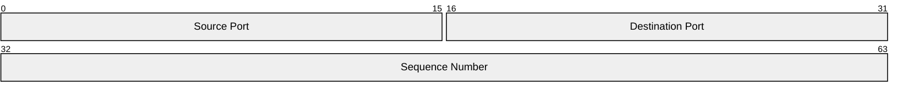
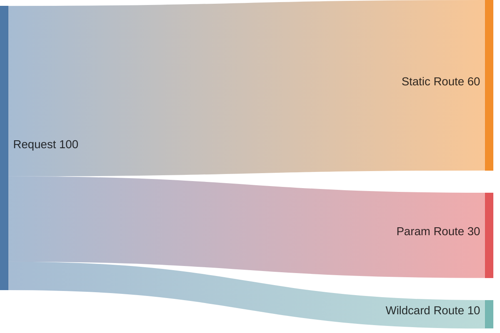
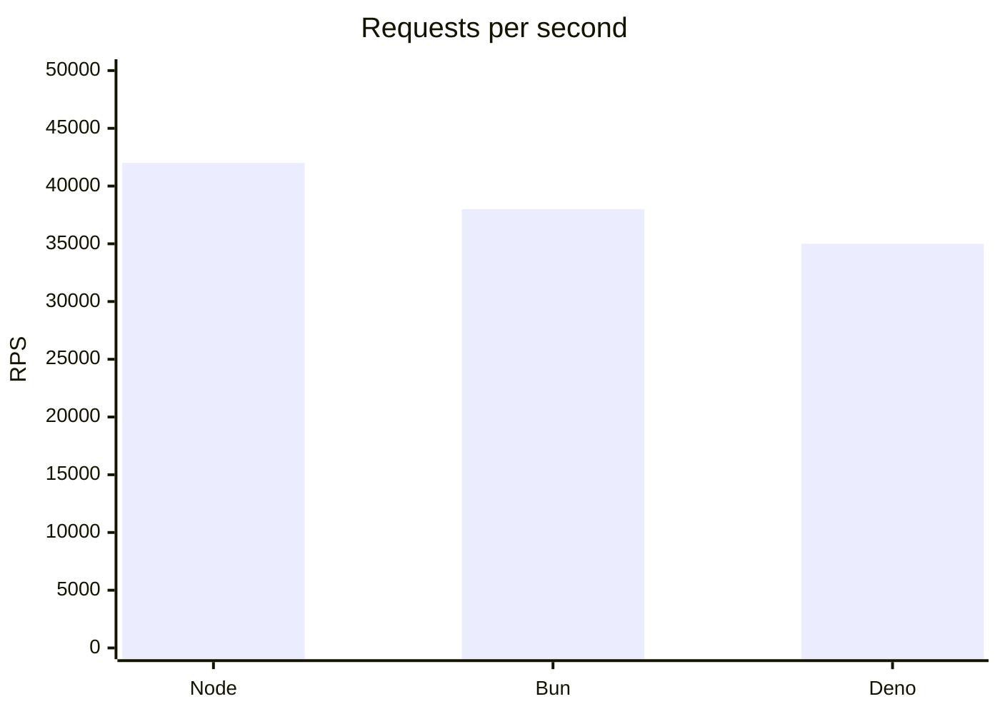
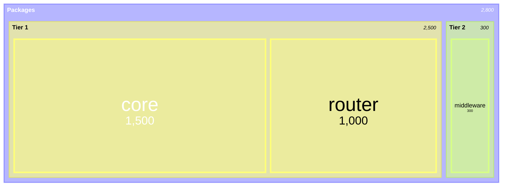
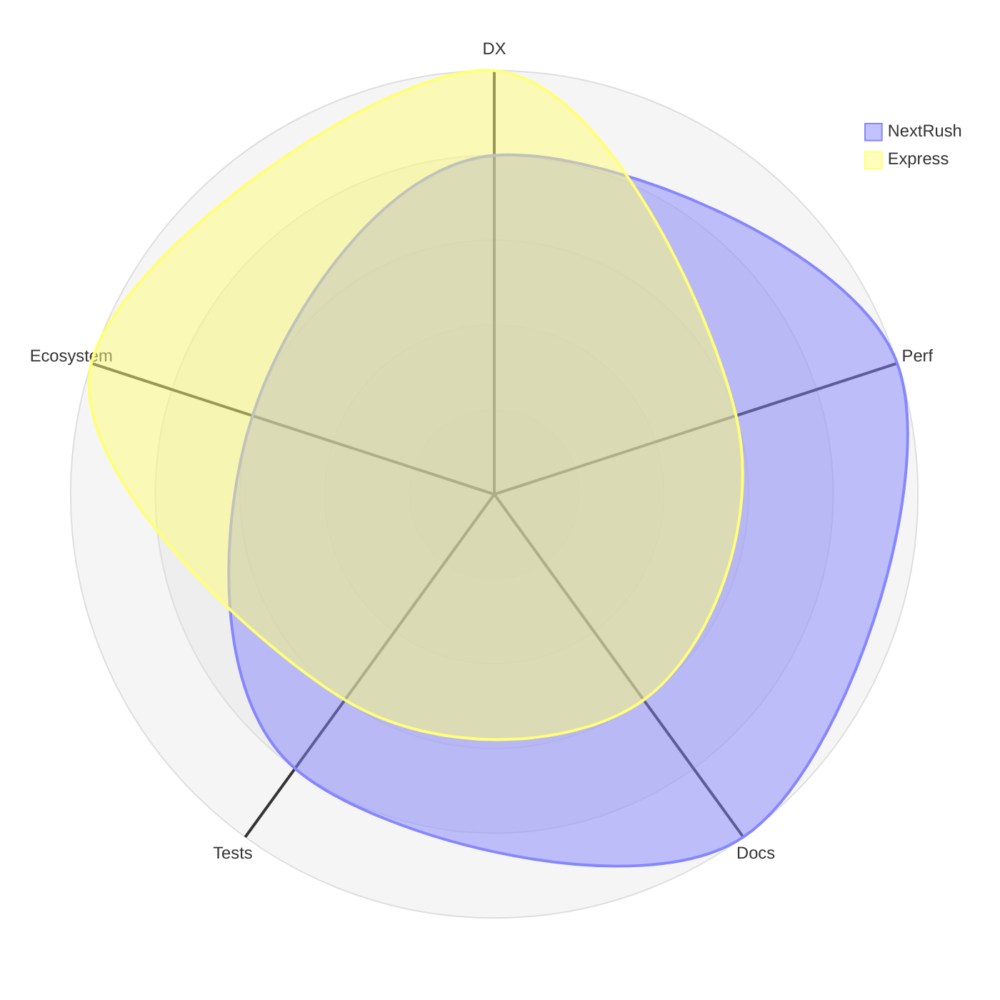
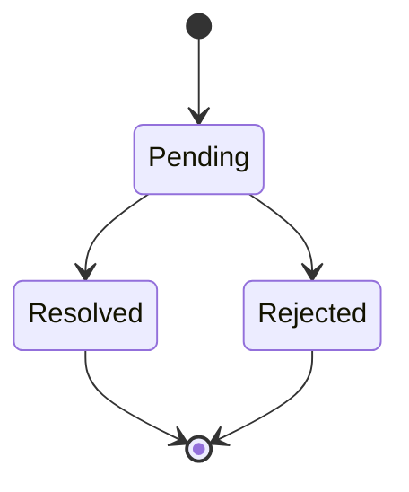
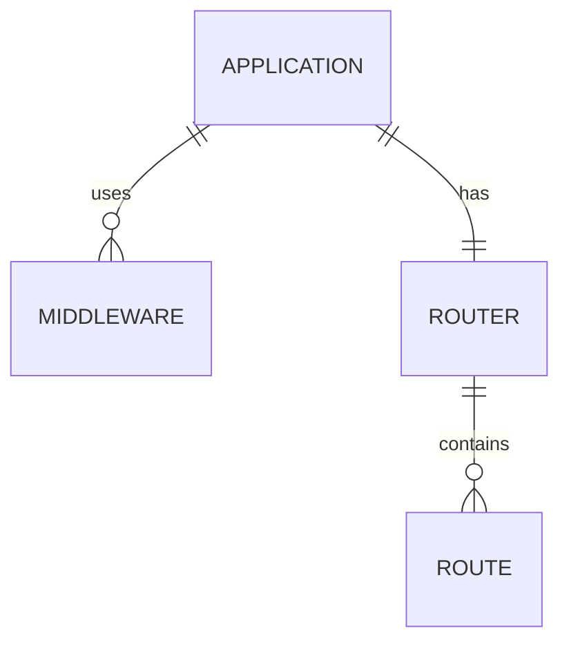
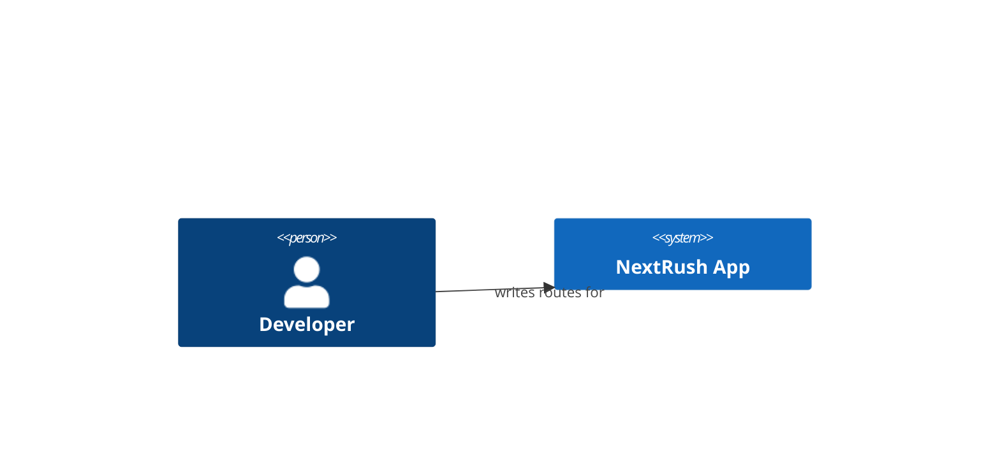
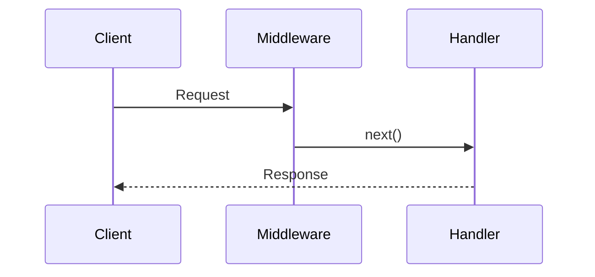

<Callout type="warn" title="Internal verification page — not part of the public IA">
  This page exists solely to smoke-test which Mermaid diagram types render correctly against
  `apps/website`'s actual `<Mermaid>` component (`src/components/mdx/mermaid.tsx`, mermaid 11.16.0).
  It is intentionally excluded from every `meta.json` — visit `/docs/architecture/diagram-smoke-test`
  directly. Re-run this check after any `mermaid` version bump; a type that silently stops
  rendering is a regression EDS-012's downstream diagram choices depend on.
</Callout>

## architecture-beta — topology / containers



## block — module / component structure

**Cannot render in this app.** `block` (and its `block-beta` alias — both accepted by the
detector) triggers a real upstream mermaid.js bug: `setBlockSizes` inside the `block` layout
engine calls `JSON.stringify` on a D3-selected DOM node during size measurement, and in this
app's React-managed container that node carries a `__reactFiber$*` back-reference, producing
`TypeError: Converting circular structure to JSON` and crashing the whole page — the entire
page, not a single isolated diagram, since mermaid's render-time exception here is uncaught by
any per-diagram boundary.
Reproduced with the minimal official reference example (`block\n  a b c`), so this is not a
content/syntax issue — confirmed via `mermaid.render()`'s own stack trace:
`setBlockSizes → layout → Object.draw → Object.render`. Do not use `block`/`block-beta` on this
docs site until upstream mermaid.js fixes this or this app's `<Mermaid>` component works around
it (e.g. rendering into a detached, non-React-owned container before injecting the result).

## packet — binary / protocol layout



## sankey — flow by volume



## xychart — metrics over a range



## treemap — hierarchical size



## radar — multi-dimension comparison



## stateDiagram-v2 — lifecycles



## erDiagram — data relations



## C4Context — experimental, per EDS-012's renderer-reality table



Renders correctly in this renderer version despite upstream's own "experimental" label on the
C4 diagram type — confirmed via DOM inspection (see Outcome below). EDS-012's guidance to prefer
`architecture-beta` for new topology diagrams stands regardless, since C4's syntax stability
across future mermaid versions isn't guaranteed by upstream.

## sequenceDiagram — request lifecycles (baseline, always worked)



## ZenUML — NOT wired (documenting the gap, not faking a render)

ZenUML requires `mermaid.registerExternalDiagrams([zenuml])` plus the
`@mermaid-js/mermaid-zenuml` package, neither of which this site's `<Mermaid>` component
currently loads. The block below is deliberately left as plain text (not a `mermaid` fence) so
this page doesn't silently render a broken diagram — see the decision below.

```text
zenuml
    Client->API: request()
    API->Handler: dispatch()
```

## Outcome (task 2.5 verification result)

Verified against a fresh dev server via both `chrome-devtools` MCP and `playwright-cli`
(cross-checked independently, per this session's zero-trust rule) — DOM inspection
(`document.body.innerText` for the crash boundary text, `document.querySelectorAll('svg')` for
real render counts), not screenshots alone, which proved misleading earlier in this
verification (a stale render can visually resemble success while the live DOM is in a crashed
error-boundary state).

| Type | Renders in this app | Notes |
| ---- | -------------------- | ----- |
| `architecture-beta` | Yes | |
| `block` / `block-beta` | **No — real upstream bug** | See section above; do not use until fixed |
| `packet` | Yes | Not `packet-beta` — that keyword doesn't exist |
| `sankey-beta` | Yes | |
| `xychart` | Yes | Not `xychart-beta` — that keyword doesn't exist |
| `treemap-beta` | Yes | |
| `radar-beta` | Yes | `axis`/`curve` entries need an id + quoted label each |
| `stateDiagram-v2` | Yes | |
| `erDiagram` | Yes | |
| `C4Context` | Yes | Upstream still labels it experimental; prefer `architecture-beta` for new diagrams |
| `sequenceDiagram` | Yes | |
| ZenUML | No — not wired | Needs `@mermaid-js/mermaid-zenuml` + `registerExternalDiagrams()`; use `sequenceDiagram` until wired |

Real syntax bugs found and fixed during this verification (not this page's fault, genuine
mistakes when the page was first authored): `packet-beta` → `packet`, `xychart-beta` →
`xychart`, and a malformed `radar-beta` `axis`/`curve` block. These are the same three types
most likely to be mis-authored elsewhere in this docs site going forward — double-check them
against `~/.kiro/skills/mermaid/references/` before reusing.

**Separately discovered while investigating this**: two already-shipped, user-facing docs pages
(`guides/mounting-and-grouping-routes.mdx` and `concepts/modules.mdx`) used `block-beta` and
were crashing in production before this session's fix — converted to `flowchart TD` (with
`subgraph` for the nested-module case), which preserves the intended visual semantics without
depending on the broken `block` layout engine. 21 package `ARCHITECTURE.md` files (GitHub-
rendered, a separate and independently-versioned mermaid instance, not this app's) also use
`block-beta` — not fixed in this pass, since GitHub's renderer wasn't confirmed to share this
bug; logged as a follow-up to verify separately.
