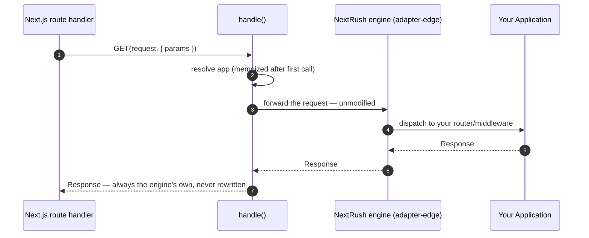

<DocHero eyebrow="Integration · Next.js">

**Run a real NextRush application inside a Next.js route.** No rewrite, no proxy, no wrapper —
one function (`handle()`) bridges your entire NextRush app into `route.ts`, returning all seven
HTTP method exports. The request is never touched.

<div className="not-prose mt-5 flex flex-wrap gap-2">
  <DocHeroPill>One function</DocHeroPill>
  <DocHeroPill>Seven exports</DocHeroPill>
  <DocHeroPill>Zero request rewrite</DocHeroPill>
  <DocHeroPill>~15 min</DocHeroPill>
</div>

</DocHero>

<MentalModelFlow steps={['Next.js route', 'handle()', 'NextRush engine', 'Your app', 'Response']} />

<Callout type="info" title="Not sure this is what you need?">
  This page is for mounting NextRush **inside an existing or new Next.js app**. If you're choosing
  a JS runtime for a standalone NextRush app (no Next.js involved), see the
  [runtime decision guide](/docs/getting-started/runtime/decision-guide) instead.
</Callout>

## Why this exists

Traditional Next.js API routes put everything in one file — logic, middleware, validation, error
handling — per endpoint. Seven endpoints means seven files, each reimplementing the same patterns:

```text
Traditional Next API                    NextRush inside Next.js

app/api/users/route.ts                  app/api/[[...route]]/route.ts
  GET  → logic                            handle(app)  ← one line, seven exports
  POST → logic
app/api/posts/route.ts                  src/server/app.ts
  GET  → logic                            createApp() + createRouter()
  POST → logic                            middleware, validation, error handling
app/api/comments/route.ts                 — grows without touching route.ts
  GET  → logic
  POST → logic
```

With NextRush, `route.ts` never grows. Your routers, middleware, and services live in
`src/server/` and compose the same way they would under `listen()`.

## Before you begin

- ✓ A terminal and a package manager
- ✓ An existing Next.js App Router project (14, 15, or 16) — or a fresh one from `create-next-app`
- ✓ You already know how to run `next dev`
- ✓ ~15 minutes

<div className="install-steps">

<Steps>

### Install NextRush and the Next.js adapter

- **Why this matters:** like every other runtime target, the `nextrush` meta-package does not bundle the Next.js bridge by default.

<PackageInstall packages={['nextrush', '@nextrush/adapter-nextjs']} />

**Behind the scenes:**

- `createApp` and `createRouter` come from `nextrush` — identical to every other runtime
- `handle` is re-exported as `nextrush/nextjs` once `@nextrush/adapter-nextjs` is installed
- Works standalone too — `@nextrush/adapter-nextjs` accepts any `@nextrush/core` `Application` directly

### Build the app in its own file

- **Why this matters:** the single most common mistake is writing the whole API inside `route.ts`. Build the application as an ordinary NextRush app first — the route file's only job is the bridge.

```ts title="src/server/app.ts"
import { createApp, createRouter } from 'nextrush';

const app = createApp();

const api = createRouter();
api.get('/hello', (ctx) => ctx.json({ message: 'Hello Next.js!' }));
app.route('/api', api);

export { app };
```

**Behind the scenes:** this is a completely ordinary NextRush application — nothing about it knows it's about to run inside Next.js. The same file boots unchanged under `listen()`, `@nextrush/adapter-edge`, or any other adapter.

### Mount it with handle()

- **Why this matters:** this is the entire bridge. One import, one function call, seven exports — the route file never grows past this.

```ts title="app/api/[[...route]]/route.ts"
import { app } from '@/server/app';
import { handle } from 'nextrush/nextjs';

export const { GET, POST, PUT, PATCH, DELETE, HEAD, OPTIONS } = handle(app);
```

The `[[...route]]` catch-all segment lets one route file answer every path under `app/api/`.
The mount prefix (`/api`) is decided by `app.route()`, not by this file or by Next's routing.

<Callout type="warn" title="Don't use createFetchHandler directly">
  `export const GET = createFetchHandler(app)` fails `next build`'s type check — Next's route
  context type isn't assignable. Use `handle()` instead.
</Callout>

### Run it and confirm

```bash
next dev
```

<p className="not-prose mt-4 flex items-start gap-2 rounded-lg bg-[color-mix(in_srgb,var(--success)_8%,var(--color-fd-card))] px-3 py-2 text-sm font-medium text-[var(--status-success-text)]">
  <span aria-hidden>✅</span>
  <span>Expected result — <code>curl http://localhost:3000/api/hello</code> returns <code>{"{"}"message": "Hello Next.js!"{"}"}</code></span>
</p>

### What's genuinely different in Next.js

Your server is running. Before moving on, understand what's different — and what isn't.

**Same:** the Context API (`ctx.json`, `ctx.params`, `ctx.query`, `ctx.set`), middleware, error
handling — everything behaves exactly as it does under `listen()`. The request is never rewritten:
`ctx.path`, `ctx.url`, and `ctx.raw.req` inside your handler are the true, original request,
exactly as they'd be under `listen()`.

**Different:**

- **No `listen()`** — Next.js owns the process. `handle()` wires `ctx.waitUntil()` to Next's `after()` API automatically when available. Without this adapter, `ctx.waitUntil()` silently no-ops under a hand-rolled bridge, because Next supplies no execution context of its own the way Cloudflare or Vercel Edge do.
- **Next.js 14 caching** — `GET` handlers are cached statically by default (changed in 15+). Add `export const dynamic = 'force-dynamic'` if needed.

### Middleware in Next.js context

NextRush middleware runs **inside** the NextRush engine, after Next.js has already routed to `route.ts`. This means:

- Next.js middleware (`middleware.ts`) runs **before** `handle()` — it sees the raw request first
- NextRush middleware (`app.use(...)`) runs **after** `handle()` — it sees the request through the NextRush Context API
- They don't interfere with each other — each operates in its own layer

```text
Request → Next.js middleware → route.ts → handle() → NextRush middleware → Router → Response
```

This is the same layering every runtime adapter uses — `handle()` doesn't change the order, it just bridges the request into the NextRush engine.

**The same middleware works everywhere.** NextRush ships `@nextrush/logger` — it runs identically
under `listen()` and under Next.js. Nothing changes:

```ts title="src/server/app.ts"
import { createApp, createRouter } from 'nextrush';
import { logger } from '@nextrush/logger';

const app = createApp();
app.use(logger()); // ← runs on every request, same under listen() and Next.js

const api = createRouter();
api.get('/hello', (ctx) => ctx.json({ message: 'Hello Next.js!' }));
app.route('/api', api);

export { app };
```

The `logger()` middleware doesn't know it's running inside Next.js. It uses `ctx.method` and `ctx.path` — both come from the Context API, which reads the original request unmodified. The same file boots under `listen()`, `@nextrush/adapter-edge`, or `handle()`.

### Common middleware patterns

NextRush ships middleware packages for the most common needs. These work identically under `listen()` and Next.js — expand each to see the code:

<details open>
<summary><strong>Auth — protect routes with a token check</strong></summary>

```ts title="src/server/middleware/auth.ts"
import type { Context, NextFunction } from 'nextrush';

export async function auth(ctx: Context, next: NextFunction) {
  const token = ctx.headers.authorization?.replace('Bearer ', '');
  if (!token) {
    ctx.throw(401, 'Missing authorization token');
    return;
  }

  const user = await verifyToken(token);
  if (!user) {
    ctx.throw(401, 'Invalid or expired token');
    return;
  }

  ctx.state.user = user; // available in every downstream handler
  await next();
}
```

Apply it to specific routes or globally:

```ts title="src/server/app.ts"
// Global — every route requires auth:
app.use(auth);

// Or per-router — only these routes require auth:
const protectedRouter = createRouter();
protectedRouter.use(auth);
protectedRouter.get('/me', (ctx) => ctx.json(ctx.state.user));
```

The same `auth` middleware works under `listen()` — the cookie/header forwarding means Next.js session tokens reach your handler unchanged.

</details>

<details>
<summary><strong>Error handling — catch errors and return consistent JSON</strong></summary>

NextRush's error handling works identically inside Next.js. `ctx.throw()` produces a JSON error response with the correct status code:

```ts title="src/server/middleware/error-handler.ts"
import type { Context, NextFunction } from 'nextrush';

export async function errorHandler(ctx: Context, next: NextFunction) {
  try {
    await next();
  } catch (err: any) {
    const status = err.status || err.statusCode || 500;
    ctx.status = status;
    ctx.json({
      error: err.message || 'Internal server error',
      status,
    });
  }
}
```

```ts title="src/server/app.ts"
app.use(errorHandler); // register FIRST — wraps everything

// Now any handler can throw:
api.get('/users/:id', async (ctx) => {
  const user = await findUser(ctx.params.id);
  if (!user) ctx.throw(404, 'User not found'); // → { error: "User not found", status: 404 }
  ctx.json(user);
});
```

</details>

<details>
<summary><strong>CORS — allow cross-origin requests from your frontend</strong></summary>

NextRush ships `@nextrush/cors` with presets for common scenarios. Don't write CORS headers by hand — the package handles preflight, `Vary` headers, and origin validation:

```ts title="src/server/app.ts"
import { cors, devCors, strictCors } from '@nextrush/cors';

// Development — allows localhost origins:
app.use(devCors());

// Production — explicit origins:
app.use(cors({ origin: ['https://my-frontend.com'] }));

// Strict — credentials + specific origins + max-age:
app.use(strictCors({ origins: ['https://my-frontend.com'], credentials: true }));
```

Available presets: `simpleCors()`, `devCors()`, `strictCors()`, `internalCors()`, `staticAssetsCors()`.

</details>

<details>
<summary><strong>Validation — reject bad input before it hits your handler</strong></summary>

NextRush ships `@nextrush/validation` for schema-based input validation. It integrates with the Context API so validated data is typed:

```ts title="src/server/app.ts"
import { validate } from '@nextrush/validation';

const CreateUser = {
  body: {
    name: { type: 'string', minLength: 1 },
    email: { type: 'string', format: 'email' },
  },
};

usersRouter.post('/users', validate(CreateUser), async (ctx) => {
  // ctx.body is validated and typed
  const user = await createUser(ctx.body);
  ctx.status(201).json(user);
});
```

</details>

<details>
<summary><strong>Rate limiting — protect endpoints from abuse</strong></summary>

NextRush ships `@nextrush/rate-limit` to protect endpoints from abuse:

```ts title="src/server/app.ts"
import { rateLimit } from '@nextrush/rate-limit';

// Global — 100 requests per minute per IP:
app.use(rateLimit({ windowMs: 60_000, max: 100 }));

// Per-route — stricter for auth endpoints:
authRouter.post('/login', rateLimit({ windowMs: 15 * 60_000, max: 5 }), loginHandler);
```

Works identically under `listen()` and Next.js — the adapter forwards the real client IP via `ctx.ip`.

</details>

</Steps>

</div>

<p className="not-prose my-6 flex items-center gap-2 rounded-lg border border-[color-mix(in_srgb,var(--success)_25%,var(--color-fd-border))] bg-[color-mix(in_srgb,var(--success)_6%,var(--color-fd-card))] px-4 py-3 text-sm font-semibold text-[var(--status-success-text)]">
  <span aria-hidden className="text-lg">🎉</span>
  <span>Next.js integration complete — a real NextRush app running inside Next.js. The route file will never need to change.</span>
</p>

## Checkpoint

Confirm the route answers:

```bash
curl -i http://localhost:3000/api/hello
# → HTTP/1.1 200 OK
# → {"message":"Hello Next.js!"}
```

Your project now looks like:

<FileTree
  root="my-app"
  files={[
    'app/api/[[...route]]/route.ts',
    'src/server/app.ts',
  ]}
  highlight={['route.ts']}
/>

<p className="not-prose flex items-start gap-2 rounded-lg bg-[color-mix(in_srgb,var(--success)_8%,var(--color-fd-card))] px-3 py-2 text-sm font-semibold text-[var(--status-success-text)]">
  <span aria-hidden>✓</span>
  <span>Baseline complete — the bridge is working. The route file will never need to change no matter how large <code>src/server/app.ts</code> grows.</span>
</p>

## Mental model

The request is never touched. `handle()` forwards it, unmodified, through the same
request-handling engine every edge/serverless target already uses:



**Rule:** mount prefixes belong to your application (`app.route(prefix, router)`) — this package
never infers or strips one. That's why "Build the app"'s `app.route('/api', api)` and "Mount it"'s folder
(`app/api/[[...route]]/`) both had to agree.

## Growing past one route

A real API is more than one route file. Split by feature, keep business logic out of route
handlers, mount everything once in `src/server/app.ts`:

<FileTree
  root="my-app"
  files={[
    'src/server/app.ts',
    'src/server/routes/users.route.ts',
    'src/server/routes/posts.route.ts',
    'src/server/services/users.service.ts',
    'src/server/services/posts.service.ts',
    'app/api/[[...route]]/route.ts',
  ]}
  highlight={['app.ts', 'route.ts']}
/>

<Tabs items={['users.service.ts', 'users.route.ts', 'app.ts']}>
  <Tab value="users.service.ts">
    ```ts title="src/server/services/users.service.ts"
    // Pure business logic — no ctx, no Request/Response.
    export async function findUser(id: string) {
      return db.user.findUnique({ where: { id } });
    }
    ```
  </Tab>
  <Tab value="users.route.ts">
    ```ts title="src/server/routes/users.route.ts"
    // HTTP concerns only — delegates to the service.
    import { createRouter } from 'nextrush';
    import { findUser } from '../services/users.service';

    export const usersRouter = createRouter();

    usersRouter.get('/:id', async (ctx) => {
      const user = await findUser(ctx.params.id);
      if (!user) return ctx.throw(404, 'User not found');
      ctx.json(user);
    });
    ```
  </Tab>
  <Tab value="app.ts">
    ```ts title="src/server/app.ts"
    // The one place every router gets mounted.
    import { createApp } from 'nextrush';
    import { usersRouter } from './routes/users.route';
    import { postsRouter } from './routes/posts.route';

    const app = createApp();
    app.route('/api/users', usersRouter);
    app.route('/api/posts', postsRouter);

    export { app };
    ```
  </Tab>
</Tabs>

`route.ts` stays exactly as it was in "Mount it with handle()" — the identical `src/server/app.ts` also boots
unchanged under `listen()` or any other adapter.

## Advanced: class-based apps (DI, modules, guards)

`handle()` also accepts a factory instead of a plain app — useful when your app needs an async
boot step like `await registerModule(...)`:

```ts title="src/server/app.module.ts"
import { Module, Controller, Get, Service } from 'nextrush/class';

@Service()
class UserService {
  findAll() { return [{ id: 1, name: 'Alice' }]; }
}

@Controller('/users')
class UserController {
  constructor(private users: UserService) {}
  @Get() findAll() { return this.users.findAll(); }
}

@Module({ controllers: [UserController], providers: [UserService] })
export class AppModule {}
```

```ts title="app/api/[[...route]]/route.ts"
import { createApp } from 'nextrush';
import { registerModule } from 'nextrush/class';
import { handle } from 'nextrush/nextjs';
import { AppModule } from '@/server/app.module';

export const { GET, POST } = handle(async () => {
  const app = createApp();
  await registerModule(app, AppModule, { prefix: '/api' });
  return app;
});
```

<Callout type="warn" title="Decorators need one tsconfig change — and this path isn't build-verified yet">
  `@nextrush/class` compiles with TypeScript's **legacy decorators**
  (`experimentalDecorators` + `emitDecoratorMetadata`), the same ones `reflect-metadata` needs.
  Next.js's SWC compiler does support this — it reads both flags from your `tsconfig.json` and
  maps them to its own decorator transform — but you have to turn them on yourself; a fresh
  `create-next-app` project doesn't set them:

  ```json title="tsconfig.json"
  {
    "compilerOptions": {
      "experimentalDecorators": true,
      "emitDecoratorMetadata": true
    }
  }
  ```

  Being honest about the rest: SWC's decorator transform is its own reimplementation of
  TypeScript's, not TypeScript's actual compiler — and unlike the plain functional path (verified
  against three real Next 14/15/16 `next build`s), this class-based path has not yet been run
  through an equivalent real build in this project's own verification. It should work with the
  `tsconfig.json` change above; treat it as reasonably likely rather than proven until you've
  confirmed `next build` succeeds for your own project.
</Callout>

## Troubleshooting

| Problem | Cause | Fix |
| --- | --- | --- |
| 404 for every route | Mount prefix in `route.ts` folder doesn't match `app.route()` call | Check server log — it names both halves. `app.route('/api', api)` must match `app/api/[[...route]]/` |
| `GET` returns same response (Next.js 14) | Next 14 statically caches `GET` handlers by default | Add `export const dynamic = 'force-dynamic'` to `route.ts` |
| `createFetchHandler(app)` fails `next build` | Next's route context type isn't assignable to the edge adapter's parameter | Use `handle(app)` instead — it solves exactly this mismatch |

<details open>
<summary><strong>Debugging — see what's happening inside the bridge</strong></summary>

**Enable NextRush's built-in logger** to see every request as it passes through the engine:

```ts title="src/server/app.ts"
import { createApp } from 'nextrush';

const app = createApp({ debug: true }); // logs middleware chain, routing, and timing
```

**Inspect the request in your handler** to confirm it's the original, unmodified request:

```ts
api.get('/debug', (ctx) => {
  ctx.json({
    path: ctx.path,           // the real URL path, not a rewritten one
    method: ctx.method,
    headers: Object.fromEntries(Object.entries(ctx.headers)),
    runtime: ctx.runtime,     // 'node' under Next.js
  });
});
```

**Check the mount prefix** — the #1 source of 404s. The server log prints an actionable hint when `app.route()` and the folder disagree. In development, look for:

```text
[NextRush] Mount prefix mismatch: app.route('/api', ...) but the route file is at app/api/[[...route]]/route.ts
```

**Test `src/server/app.ts` directly** — since it's a plain NextRush application, you can test it without Next.js:

```ts title="src/server/__tests__/app.test.ts"
import { app } from '../app';

test('GET /api/hello returns greeting', async () => {
  const res = await app.inject({ method: 'GET', path: '/api/hello' });
  expect(res.status).toBe(200);
  expect(res.json()).toEqual({ message: 'Hello Next.js!' });
});
```

</details>

<details>
<summary><strong>Next.js 14 caching — why GET returns stale data</strong></summary>

Next.js 14 statically caches `GET` route handlers by default (changed to dynamic-by-default in 15.0.0-RC). This means your NextRush handler runs once, and the response is cached for subsequent requests.

**Fix:** add one export to `route.ts`:

```ts title="app/api/[[...route]]/route.ts"
export const dynamic = 'force-dynamic';
```

This tells Next.js to run the handler on every request instead of caching it. The adapter itself doesn't control this — it's Next's own caching behavior.

</details>

## FAQ

**Does `create-nextrush` scaffold a Next.js project?**
No — use Next's own `create-next-app`. This package documents how to wire NextRush into it.

**Can I use this without the `nextrush` meta-package?**
Yes — install `@nextrush/adapter-nextjs` directly and pass any `@nextrush/core` `Application` to `handle()`.

**Does it work on Bun, Deno, or Cloudflare (via OpenNext)?**
Yes — the package is fully Web-standard, no `node:*` or runtime globals.

**Does Next.js support decorators?**
Its SWC compiler does — enable `experimentalDecorators`/`emitDecoratorMetadata` in `tsconfig.json`. See the class-based section above.

**Does it support the Pages Router?**
No — App Router only. The Pages Router hands `(req, res)`, not a `Request`.

**How do I test the mounted app?**
Test `src/server/app.ts` the same way you'd test any NextRush app — it's a plain `Application`
that doesn't know about Next.js. Import it, call `app.inject()` (or your preferred test helper),
and assert on the response. The bridge in `route.ts` is one line and doesn't need its own test —
Next's own routing handles that.

**How do I share auth between Next.js pages and the NextRush API?**
The NextRush app runs inside the same Next.js process, so it shares the same environment and
cookies. Read the session from `ctx.headers` (the cookie header is forwarded unmodified) or pass
the session token from your Next.js middleware via `ctx.state`. The adapter never strips or
rewrites headers — what Next.js sends is what your NextRush handler sees.

## What you learned

- ✓ One `handle()` bridges your entire NextRush app — seven exports, zero configuration
- ✓ Mount prefixes belong to your app (`app.route(prefix, router)`) — keep them in sync with the folder
- ✓ A real API is multiple files — routers, services, and `app.ts` grow independently of the bridge
- ✓ `ctx.waitUntil()` needs this adapter to work under Next.js — without it, background work silently no-ops
- ✓ Next.js middleware runs before `handle()`; NextRush middleware runs after — they don't interfere
- ✓ The same `src/server/app.ts` boots unchanged under `listen()` or any other adapter

## Next steps

<Callout type="info" title="🚀 Build a Task API — recommended · ~20 min">
  Not using Next.js? Go through the same routing/middleware/error-handling ground on a
  standalone NextRush app. [Start the tutorial →](/docs/getting-started/quick-start)
</Callout>

<Cards>
  <Card title="@nextrush/adapter-nextjs reference" href="/docs/reference/platforms/nextjs">
    The full API surface — `handle()`, `NextHandlerOptions`, `AppSource`, and the types Next's route context requires.
  </Card>
  <Card title="Class-based apps (DI, modules, guards)" href="/docs/concepts/class-runtime">
    Build the mounted app with `@Controller`, `@Service`, and `registerModule`.
  </Card>
</Cards>

## Continue learning

<Cards>
  <Card title="Runtime decision guide" href="/docs/getting-started/runtime/decision-guide">
    Choosing a JS runtime for a standalone NextRush app — a different question from framework integration.
  </Card>
  <Card title="Runs on any runtime" href="/docs/concepts/runtime-compatibility">
    Why the exact same `src/server/app.ts` also boots under `listen()` or any other adapter, unchanged.
  </Card>
</Cards>
