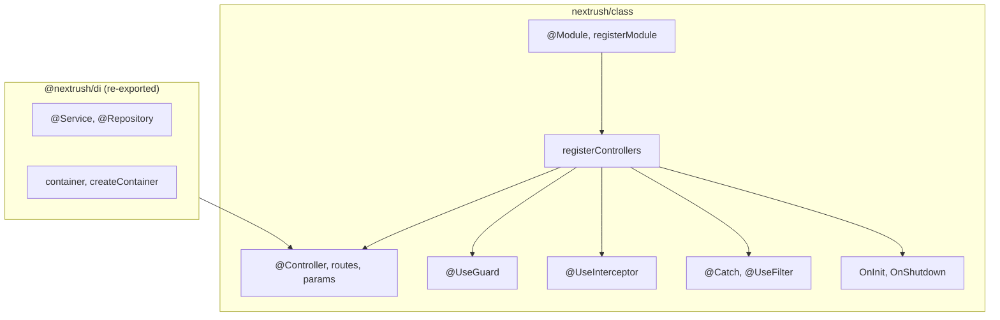

`@nextrush/class` is the single package behind every class-based NextRush API. It merges what
used to be three separate packages — `@nextrush/decorators`, `@nextrush/controllers` (both
removed), and a re-export of `@nextrush/di` — into one import surface: `nextrush/class`.

<Callout type="info" title="Source & internals">
  `@nextrush/class`: [README](https://github.com/0xTanzim/nextRush/blob/main/packages/class/README.md) ·
  [ARCHITECTURE](https://github.com/0xTanzim/nextRush/blob/main/packages/class/ARCHITECTURE.md).
  `@nextrush/di` (re-exported, covered by [DI reference](/docs/reference/class/di)):
  [README](https://github.com/0xTanzim/nextRush/blob/main/packages/di/README.md) ·
  [ARCHITECTURE](https://github.com/0xTanzim/nextRush/blob/main/packages/di/ARCHITECTURE.md).
</Callout>

<Callout type="warn" title="@nextrush/decorators and @nextrush/controllers were removed">
  Both packages were compatibility shims that re-exported from `@nextrush/class`. Import from
  `nextrush/class` directly. See [Removed packages](#removed-packages) below.
</Callout>

---

## Package Overview



| Capability                  | Reference page                                                     |
| --------------------------- | -------------------------------------------------------------------- |
| Controllers, routes, params, guards, interceptors, filters | [Decorators](/docs/reference/class/decorators) |
| Auto-discovery & registration (`registerControllers`)      | [Controllers](/docs/reference/class/controllers) |
| `@Module`, `registerModule`, composing features             | [Modules](/docs/reference/class/modules) |
| Dependency injection — `@Service`, scopes, container         | [Dependency Injection](/docs/reference/class/di) |

For the mental model behind each of these — why NextRush shapes them this way, beyond how to
call them — see the [Concepts](/docs/concepts) pages: [Modules](/docs/concepts/modules),
[Dependency Injection & Scopes](/docs/concepts/dependency-injection),
[Interceptors](/docs/concepts/interceptors), [Exception Filters](/docs/concepts/exception-filters),
[Lifecycle Hooks](/docs/concepts/lifecycle).

---

## Installation

If you use the `nextrush` meta package, everything is included:

<PackageInstall packages={['nextrush']} />

Or install `@nextrush/class` directly:

<PackageInstall packages={['@nextrush/class']} />

<Callout type="info" title="reflect-metadata">
  `@nextrush/class` imports `reflect-metadata` as a side effect at its own entry point — decorator
  metadata (routes, params, DI) depends on this import running before any decorated class is
  defined. The `nextrush` meta package re-exports the same entry point, so no separate setup is
  needed either way.
</Callout>

**Required `tsconfig.json` settings:**

```json title="tsconfig.json"
{
  "compilerOptions": {
    "experimentalDecorators": true,
    "emitDecoratorMetadata": true
  }
}
```

Most modern runners (`tsx`, `esbuild`, `node --experimental-strip-types`) strip types without
emitting decorator metadata. Use `tsc + node` or `@nextrush/dev` for correct behavior.

---

## Quick Example

```typescript
import { createApp, listen } from 'nextrush';
import { Controller, Get, Service, registerControllers } from 'nextrush/class';

@Service()
class UserService {
  findAll() {
    return [{ id: 1, name: 'Alice' }];
  }
}

@Controller('/users')
class UserController {
  constructor(private users: UserService) {}

  @Get()
  findAll() {
    return this.users.findAll();
  }
}

const app = createApp();
await registerControllers(app, { root: './src' });
await listen(app, 8080);
```

---

## Everything Exported From `nextrush/class`

Verified against `packages/class/src/index.ts`. Grouped by concern, not by the old package
split — everything below is one import surface.

<Tabs items={['Decorators & metadata', 'Modules', 'Registration & discovery', 'DI (re-exported)']}>
  <Tab value="Decorators & metadata">

```typescript
// Class & route decorators
import { Controller, Get, Post, Put, Patch, Delete, Head, Options, All } from 'nextrush/class';

// Parameter decorators
import { Body, Ctx, Header, Param, Query, Req, Res, createCustomParamDecorator } from 'nextrush/class';

// Response decorators
import { HttpCode, Redirect, SetHeader } from 'nextrush/class';

// Guards
import { UseGuard, getAllGuards, getClassGuards, getMethodGuards } from 'nextrush/class';

// Exception filters
import { Catch, UseFilter, getAllFilters, getCatchTypes, getClassFilters, getMethodFilters } from 'nextrush/class';

// Interceptors
import { UseInterceptor, getAllInterceptors, getClassInterceptors, getMethodInterceptors } from 'nextrush/class';

// Lifecycle hooks (duck-typed — no decorator)
import type { OnInit, OnShutdown } from 'nextrush/class';
import { isOnInit, isOnShutdown } from 'nextrush/class';

// Metadata readers
import {
  isController,
  getControllerMetadata,
  getControllerDefinition,
  getRouteMetadata,
  getParamMetadata,
  getAllParamMetadata,
  getHttpCode,
  getRedirectMetadata,
  getResponseHeaders,
} from 'nextrush/class';
```

  </Tab>
  <Tab value="Modules">

```typescript
import { Module, getModuleMetadata, isModule } from 'nextrush/class';
import { registerModule } from 'nextrush/class';
import { collectModuleControllers, collectModuleGraph } from 'nextrush/class';

import type {
  ModuleMetadata,
  ModuleOptions,
  ModuleProvider,
  ModuleProviderConfig,
  ModuleRegistrationOptions,
} from 'nextrush/class';
```

  </Tab>
  <Tab value="Registration & discovery">

```typescript
import { registerControllers } from 'nextrush/class';
import { discoverControllers, getControllersFromResults, getErrorsFromResults } from 'nextrush/class';
import { FilesystemSource, MemorySource } from 'nextrush/class';
import { ControllerRegistry } from 'nextrush/class';
import { buildRoutes } from 'nextrush/class';
import { getClassDiagnostics } from 'nextrush/class';

import type { DiscoverySource } from 'nextrush/class';
import type { ApplicationGraph } from 'nextrush/class';
import type {
  CircularDependency,
  DiagnosticsReport,
  DuplicateRoute,
  ProviderEntry,
  RouteEntry,
  TimingEntry,
} from 'nextrush/class';

// Errors
import {
  ControllerError,
  ControllerResolutionError,
  DiscoveryError,
  GuardRejectionError,
  HttpError,
  MissingParameterError,
  NoRoutesError,
  NotAControllerError,
  NotAModuleError,
  ParameterInjectionError,
  RouteRegistrationError,
} from 'nextrush/class';
```

  </Tab>
  <Tab value="DI (re-exported)">

```typescript
// Re-exported from @nextrush/di — same imports, one package
import { Repository, Service, container, createContainer, inject } from 'nextrush/class';
import type { Container } from 'nextrush/class';
```

  </Tab>
</Tabs>

---

## Removed packages

`@nextrush/decorators` and `@nextrush/controllers` were thin compatibility shims that
re-exported the corresponding symbols from `@nextrush/class`, and have been removed from the
workspace — they no longer publish new versions.

| Removed import                    | Replacement                                     |
| --------------------------------- | ------------------------------------------------ |
| `@nextrush/decorators`            | `nextrush/class` — [Decorators reference](/docs/reference/class/decorators) |
| `@nextrush/controllers`           | `nextrush/class` — [Controllers reference](/docs/reference/class/controllers) |

---

## Next Steps

<Cards>
  <Card title="Decorators" description="Controllers, routes, params, guards, interceptors, filters." href="/docs/reference/class/decorators" />
  <Card title="Controllers" description="Auto-discovery and registerControllers()." href="/docs/reference/class/controllers" />
  <Card title="Modules" description="@Module and registerModule() — composing features." href="/docs/reference/class/modules" />
  <Card title="Dependency Injection" description="@Service, scopes, and the container." href="/docs/reference/class/di" />
</Cards>
