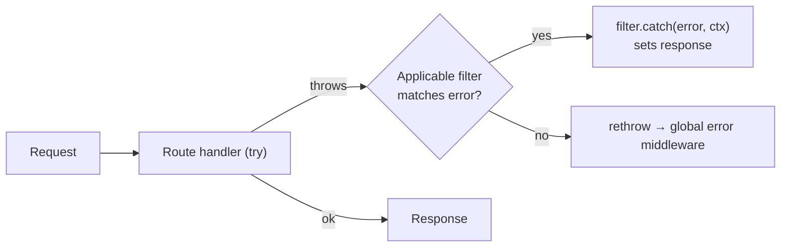

# RFC: Exception Filters (Class-Based Controllers)

**Status:** Accepted (complete-all directive approval)
**Date:** 2026-07-08
**Author:** NextRush Core Team
**Scope:** Additive change to `@nextrush/decorators` (new `@Catch`, `@UseFilter`, `ExceptionFilter`) and `@nextrush/controllers` (per-request filter resolution in the route handler). **Opt-in and non-breaking**: a controller/method with no filter behaves exactly as today — errors propagate to the global error middleware.

---

## 1. Problem

Class-based controllers can already reject requests with typed `HttpError`s, and a guard that throws propagates its error unchanged to the global error middleware (Wave 3). But there is no way to **localize** error handling to a controller or route: mapping a domain error (e.g. `EntityNotFoundError`) to a specific HTTP response currently forces either a `try/catch` inside every handler or a single global error middleware that must know about every controller's domain errors.

Exception filters let a controller (or a single route) declare, declaratively, "when *this* kind of error escapes my handler, *this* filter turns it into a response" — without touching the global error path for everything else.

## 2. Non-Goals

- Replacing the global error middleware. Filters sit **in front of** it; unmatched errors still reach it unchanged.
- Function-based filters. Filters are always classes (resolved from DI), mirroring class-based guards — this keeps DI injection first-class and the matching model simple.
- Changing default behavior for controllers that declare no filter. Zero filter ⇒ zero behavior change.

## 3. API

### `ExceptionFilter` interface (`@nextrush/decorators`)

```typescript
interface ExceptionFilter {
  catch(error: unknown, ctx: Context): void | Promise<void>;
}
```

The filter **sets the response** via `ctx` (e.g. `ctx.status = 404; ctx.json(...)`). It receives the thrown `error` (typed as `unknown`) and the request `Context`.

### `@Catch(...errorTypes)` — class decorator on the filter

Marks which error constructors a filter handles. `@Catch(NotFoundError)` handles `NotFoundError` (and subclasses, via `instanceof`). `@Catch()` with **no arguments** is a **catch-all** — it matches any thrown value.

```typescript
@Catch(EntityNotFoundError)
class NotFoundFilter implements ExceptionFilter {
  catch(error: unknown, ctx: Context) {
    ctx.status = 404;
    ctx.json({ error: 'Not found' });
  }
}
```

### `@UseFilter(...filters)` — class **and** method decorator

Mirrors `@UseGuard`'s shape. Applied at the class level it covers every route on the controller; applied at the method level it covers that route. Accepts one or more filter **classes**.

```typescript
@UseFilter(NotFoundFilter)
@Controller('/users')
class UserController {
  @UseFilter(ConflictFilter)   // method-level, higher precedence
  @Post()
  create() { /* ... */ }
}
```

### Metadata readers (`@nextrush/decorators`)

- `getClassFilters(target)` — class-level filters.
- `getMethodFilters(target, methodName)` — method-level filters.
- `getAllFilters(target, methodName)` — **method filters first, then class filters** (resolution order; see §6).
- `getCatchTypes(filterClass)` — the error constructors from `@Catch` (empty array = catch-all).

Metadata keys: `FILTERS` (on `@UseFilter` targets) and `CATCH` (on `@Catch` filter classes), added to `DECORATOR_METADATA_KEYS`.

## 4. Pipeline Placement

The per-request route handler body — **guard execution → controller resolve → parameter resolution → method call → response application** — is wrapped in a single `try/catch`. Any error thrown anywhere in that body (including a guard's thrown error) enters the filter pipeline.

Placement is entirely inside the controllers' generated route handler, *before* the global error middleware. Middleware ordering is unchanged.



## 5. Resolution

Filters are **class-based** and resolved from the same DI container as guards and controllers (`container.resolve(FilterClass)`). This means a filter can inject services (logger, metrics, mappers). Consumers register filters with the container the same way they register class guards. Resolution happens lazily, only when an error is actually thrown and the filter is about to be invoked.

## 6. Matching & Precedence

On a thrown error, the handler collects applicable filters in **method-first, then class** order (`getAllFilters`). It walks them in order and invokes the **first** whose `@Catch` types match:

- A filter with `@Catch(A, B)` matches when `error instanceof A` **or** `error instanceof B`.
- A filter with no-arg `@Catch()` (or no `@Catch` metadata) is a **catch-all** and matches any error.
- **First matching filter wins**; remaining filters are not consulted.
- If **no** filter matches, the error is **rethrown unchanged**, so the global error middleware handles it exactly as today (this also preserves Wave 3 guard-error propagation).

Method-level filters therefore take precedence over class-level filters, and among filters at the same level, earlier-listed wins.

## 7. Backward Compatibility

Fully additive. A controller/method with no `@UseFilter` produces a handler that is byte-for-byte behaviorally identical to today (the `try/catch` wrapper is only installed when at least one filter is present). No public type is changed; only new symbols are exported.

## 8. Testing

- Decorator metadata: `@Catch` stores types; `@Catch()` = empty (catch-all); `@UseFilter` at class/method level; `getAllFilters` ordering.
- Handler integration: matched filter handles + sets response; unmatched error propagates (filter not invoked); method precedence over class; no-arg catch-all; filter resolved from DI with an injected service.
