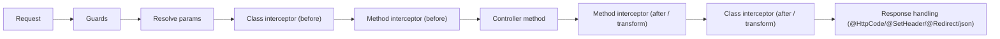

# RFC: Interceptors (Class-Based Controllers)

**Status:** Accepted (complete-all directive approval)
**Date:** 2026-07-08
**Author:** NextRush Core Team
**Scope:** Additive change to `@nextrush/decorators` (new `@UseInterceptor`, `Interceptor`) and `@nextrush/controllers` (per-request interceptor chain in the route handler). **Opt-in and non-breaking**: a controller/method with no interceptor behaves exactly as today — the method's return value flows straight into response handling.

---

## 1. Problem

Class-based controllers already have two cross-cutting hooks: **guards** run *before* a handler and decide whether it runs at all (Wave 3), and **exception filters** wrap a handler to turn a thrown error into a response (Wave 10). Neither can participate in the **normal, successful** path around the method call — there is no supported way to run code both before and after the handler, observe or reshape its return value, add timing/logging, or short-circuit with a cached value.

Interceptors fill that gap. An interceptor wraps the controller-method call (around advice / onion): it runs code before calling `next()`, awaits the downstream result, and may transform or replace it before the value flows into the existing response handling (`@HttpCode` / `@SetHeader` / `@Redirect` / `ctx.json`).

## 2. Non-Goals

- **Observable-based interceptors.** The contract is Promise-based (`intercept(ctx, next): Promise<unknown>`), not RxJS. This keeps the zero-dependency rule intact and matches the framework's async/await-native style.
- **Function-based interceptors.** Interceptors are always classes (resolved from DI), mirroring class-based guards and filters — DI injection stays first-class and the model stays uniform.
- **Replacing middleware.** Global/route middleware still runs in the router pipeline. Interceptors are scoped to a controller/route and wrap only the method invocation, with access to the resolved handler result.
- **Changing default behavior for controllers that declare no interceptor.** Zero interceptor ⇒ zero behavior change.

## 3. API

### `Interceptor` interface (`@nextrush/decorators`)

```typescript
interface Interceptor {
  intercept(ctx: Context, next: () => Promise<unknown>): Promise<unknown>;
}
```

`next()` invokes the rest of the chain (inner interceptors, ultimately the controller method) and resolves to its result. Return `next()`'s value unchanged to pass through, or return a different value to **transform** the response. Wrap `next()` in `try/catch` to **observe or recover from** handler errors; rethrow to propagate.

```typescript
@Service()
class EnvelopeInterceptor implements Interceptor {
  async intercept(ctx: Context, next: () => Promise<unknown>): Promise<unknown> {
    const data = await next();
    return { data, path: ctx.path };
  }
}
```

### `@UseInterceptor(...interceptors)` — class **and** method decorator

Mirrors `@UseGuard`'s shape. Applied at the class level it wraps every route on the controller; applied at the method level it wraps that route. Accepts one or more interceptor **classes**.

```typescript
@UseInterceptor(TimingInterceptor)
@Controller('/users')
class UserController {
  @UseInterceptor(CacheInterceptor)   // method-level, inner layer
  @Get()
  findAll() { /* ... */ }
}
```

### Metadata readers (`@nextrush/decorators`)

- `getClassInterceptors(target)` — class-level interceptors.
- `getMethodInterceptors(target, methodName)` — method-level interceptors.
- `getAllInterceptors(target, methodName)` — **class interceptors first, then method interceptors** (outer-to-inner onion order; see §6).

Metadata key: `INTERCEPTORS` (on `@UseInterceptor` targets), reinstated in `DECORATOR_METADATA_KEYS` (it was reserved-then-removed in Wave 1 as unused; it is now used).

## 4. Pipeline Placement

Interceptors sit **inside** the per-request route-handler body, after guards + controller resolve + parameter resolution, wrapping only the method invocation:

```
guards → resolve controller → resolve params → [ interceptor onion → method ] → response handling
```

Exception filters (Wave 10) wrap the **whole** handler body, so filters are strictly outside interceptors: an error an interceptor does not itself handle propagates out and is catchable by a `@UseFilter`.



## 5. Resolution

Interceptors are **class-based** and resolved from the same DI container as guards, filters, and controllers (`container.resolve(InterceptorClass)`), so an interceptor can inject services (logger, metrics, cache). Consumers register interceptors with the container the same way they register class guards/filters. Resolution happens lazily, at request time, as each layer of the chain is entered.

## 6. Ordering (Onion)

`getAllInterceptors` returns **class interceptors first, then method interceptors**. The runtime folds this list from the innermost layer outward, so:

- **Class interceptors are the outermost layers**; method interceptors are inner, closest to the handler.
- On the way *in*, class `before`-code runs first, then method `before`-code, then the handler.
- On the way *out*, method `after`/transform runs first, then class `after`/transform — the mirror image.
- Within a single level, interceptors run in TypeScript decorator application order (bottom-to-top).

## 7. Backward Compatibility

Fully additive. A controller/method with no `@UseInterceptor` invokes the method directly (no chain, no allocation) — behaviorally identical to today. No public type is changed; only new symbols are exported. Interactions with guards (before), filters (around/outside), and response decorators are unchanged.

## 8. Testing

- Decorator metadata: `@UseInterceptor` at class/method level; bottom-to-top stacking; `getAllInterceptors` class-then-method ordering.
- Handler integration: interceptor runs before and after the handler; interceptor transforms the return value; multiple interceptors nest onion-style (class outermost, then method); interceptor resolved from DI with an injected service; a handler error is observable to an interceptor's `try/catch` around `next()`; an unhandled interceptor error is caught by a `@UseFilter` exception filter (filters wrap interceptors).
