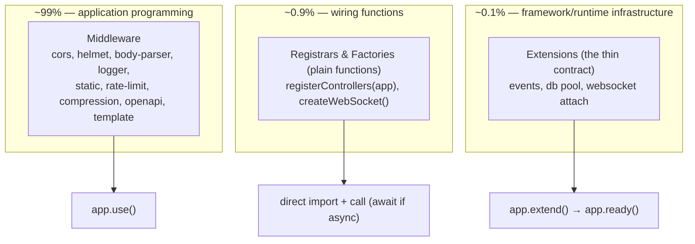

# RFC: Extension Model — Composition-First (Plugin System Redesign)

**Status:** v4 — **DRAFT / ready for approval**. Correctness settled in v3 (R1 validated); v4 applies the final philosophy/editorial refinements from Review Round 2. Supersedes the current `Plugin`/`PluginWithHooks`/`PluginMeta` surface in `@nextrush/types`.
**Date:** 2026-07-07
**Author:** NextRush Core Team (architecture review board)
**Scope:** A **breaking** major change to `@nextrush/types` + `@nextrush/core`, coordinated with the planned class-based/DI breaking changes. One honest extension model for the next decade. No backward-compatibility shims — one major version bump.

---

## Philosophy (read this first)

> **Keep an extension *concept*. Kill the plugin *ceremony*.**

NextRush is **Composition-First**: you extend the framework by *importing a thing and using it*, not by registering it with a plugin runtime. Most framework features are plain **middleware**; a few are **registrars** (functions that wire routes/objects you already hold); and a rare handful are **Extensions** — long-lived runtime services that must attach state to the app and manage a lifecycle.

These three are **not equal in weight**:

```
Middleware   ██████████████████████████████████████  ~99%   application programming
Registrar    ▍                                        ~0.9%  wiring functions
Extension    ·                                        ~0.1%  framework/runtime infrastructure
```

**Extensions are for framework and runtime authors, not everyday application development.** Optimizing the framework *around* plugins would make the rarest case (0.1%) drive the design and tax the common case (99%). NextRush refuses that trade. The plugin machinery this RFC deletes existed because the framework optimized for the least common case; the model it introduces optimizes explicit composition instead.

---

## 0. Revision History

- **v1** — First proposal. Rejected "finish the lifecycle + dependency graph" (Option B, heavy half) and "Fastify-style encapsulation" (Option C); proposed explicit import-and-use as the default plus a thin contract, `app.decorate`, and a deferred `register → ready → close` boot.
- **v2** — Incorporated Review Round 1 (scored v1 **91/100**): `Capability → Extension`; `setup(app) → setup(ctx)`; typed `ExtensionId`; `register()`-after-`ready()` error; specified shutdown; ecosystem non-goals; rejected `app.services.*` namespacing, a formal contract registry, and an `onCleanup` bag.
- **v3** — Resolved R1 (app-owned router vs. package hierarchy) by validating against the real dependency graph: **VALIDATED**, no cycle.
- **v4 (this document)** — Incorporated Review Round 2 (scored v3 **97/100**). Editorial + philosophy hardening, and two surface removals applying this RFC's own "no speculative surface" discipline:
  1. **Philosophy + the tagline moved to the top**; added **§2.4 "Why NextRush does not optimize for plugins."** **Accepted.**
  2. **The three tiers are now explicitly unequal** (§4) — Extension reframed as rare infrastructure for framework/runtime authors. **Accepted.**
  3. **`ExtensionId`/`extensionId()` removed from v1** — `needs: readonly string[]` + the runtime assertion is enough at this scale; a typed id becomes a deferred, additive option (§12). This reverses v2's "accept with refinement": Review Round 2's YAGNI argument (≤~20 extensions ever) is stronger than the cross-package-coupling argument v2 was answering. **Accepted.**
  4. **`decorate` moved off the public `Application` surface onto `ExtensionContext`** (§6) — only code inside `setup(ctx)` can decorate the app; `hasDecorator` (read) stays public. Structurally enforces "extension-authors only" and prevents God-object creep by application code. **Accepted, refined** (stronger than "make it internal").
  5. **`app.register()` → `app.extend()`** (§7) — `register` carries the Fastify echo the RFC exists to shed; `extend` pairs with the `Extension` noun and Composition-First. **Accepted.**

---

## 1. Problem & The Reframe

The architecture audit found NextRush ships a **"plugin system" that is a `Map<string, Plugin>` plus four incompatible integration idioms**, over a genuinely good middleware pipeline:

- **The `Plugin` contract has no single meaning.** `openapi` does `install(app){ app.use(...) }`; `events` redefines `Plugin` locally and attaches via `Object.defineProperty(app, 'events')`; `template` ships the feature twice (`template()` **and** `templatePlugin()`); `controllers.install(_app)` **ignores the app entirely**.
- **Two declared subsystems are dead code.** `PluginWithHooks` (`onRequest`/`onResponse`/`onError`/`extendContext`) has **zero implementers**, yet `callback()` iterates a `hookPlugins` array every request. `PluginMeta.dependencies` is **never read**.
- **`plugin(): this | Promise<this>` is a footgun that already fired.** `apps/playground/src/index.ts` calls the **async** `controllersPlugin` install **without `await`**, then `serve()`s. Cold-start race, silent 404s.
- **App/ctx extension is unsafe and inconsistent.** `Object.defineProperty` (crashes on collision), `(app as unknown as Record<…>)`, `(ctx as LoggerContext)` casts, hand-written `declare module` — four ways, no convention.

**The reframe:** NextRush does not need a plugin system. Real extensibility already flows through the **middleware pipeline** (`compose()`) and the **`ROUTE_METADATA` contribution protocol** — both rated highly by the audit. The `Plugin` interface is ceremony on top of `app.use()`.

| Option | What it is | Verdict |
|---|---|---|
| **A** | Delete the plugin system; middleware + direct composition only | **Adopt as the default** |
| **B** | Finish the ambition: lifecycle + dependency graph + hook ordering | **Reject the graph; adopt only the safe boot phase** |
| **C** | Fastify/avvio encapsulated `register` with scope trees | **Reject** |

---

## 2. Decision

**Adopt "Composition-First":** explicit import-and-use is the default (Option A), plus a *thin `Extension` contract* for the rare extensions that need app-level state + async boot + teardown, wired through a deferred `extend → ready → close` lifecycle (the safe half of Option B). **Encapsulation (C) and automatic dependency-graph ordering (heavy B) are explicit non-goals** (§9).

### 2.1 Why reject C (encapsulation)

Fastify's encapsulation is the gold standard for a **large third-party marketplace**. NextRush has none, and the model carries a permanent DX cost — encapsulation is Fastify's most common newcomer confusion ("I decorated the instance, why is it `undefined`?"). Importing that cost to solve a problem NextRush doesn't have contradicts "Minimal Core" and "Modern DX." **Rejected.**

### 2.2 Why reject the graph half of B (auto dependency ordering)

A topological sorter with cycle detection is correctness-critical machinery. NextRush extensions barely interact — the only app-state extensions are `events` and (post-refactor) a DI container; none depends on another. Auto-ordering also **hides** run order, violating "Explicit design over accidental design." We keep dependency *safety* (declare-and-assert, §8) without dependency *magic*. **Rejected.**

### 2.3 The default is explicit import-and-use

```ts
import { cors } from '@nextrush/cors';
import { openapi } from '@nextrush/openapi';
import { registerControllers } from '@nextrush/controllers';

app.use(cors());                          // middleware   → request pipeline
app.use(openapi(app.router));             // middleware   → serves /openapi.json + /docs
await registerControllers(app, {          // registrar    → registers routes, may do async I/O
  root: './src', prefix: '/api',
});
```

Superior on every axis that matters to NextRush: tree-shakeable (unused → never ships), fully type-safe (no `getPlugin<T>` string cast), zero magic (the call site *is* the wiring), ESM-native and Hono-aligned (the north star has no plugin system).

### 2.4 Why NextRush does not optimize for plugins

Most framework features fall naturally into one of three categories:

- **Middleware** — participate in the request pipeline (cors, auth, logging, body parsing…). The overwhelming majority.
- **Registrars** — plain functions that wire routes or objects you already hold (controller registration, route groups).
- **Plain libraries** — imported and called directly, no framework coupling at all (a template engine, a validator).

**Only long-lived runtime *services* — things that live for the whole process, own state on the app, and must boot and shut down cleanly — genuinely need an Extension.** That is a small set: an event bus, a database/connection pool, a websocket attach.

Designing a framework *around* plugins optimizes this least-common case while making the common case (writing middleware and calling functions) more ceremonious. NextRush therefore optimizes **explicit composition** and keeps the Extension contract deliberately small and out of the everyday path. A plugin-centric architecture is not a feature NextRush is missing — it is a trade NextRush declines.

---

## 3. Design Goals & Non-Goals

**Goals**

1. One idiom per extension kind (§4) — predictable behavior.
2. Kill the async cold-start race by construction — deferred boot; no un-awaited installs possible (§7).
3. One safe way to extend `app`/`ctx` — extension-scoped `decorate()` + a `declare module` convention (§6).
4. Zero request hot-path cost — no per-request hook iteration (§13).
5. Delete every unimplemented type — the contract never advertises a capability the code doesn't deliver.
6. Coordinate with the class-based/DI breaking changes in the same major (§11).
7. Every axis clears 90 (§14).

**Non-Goals** (revisited only with evidence from real third-party authors — §12): plugin encapsulation; automatic topological ordering; a runtime hook tier (`PluginWithHooks`); discovery/marketplace metadata; config contracts; health checks; typed extension identifiers.

---

## 4. The Extension Taxonomy — three *unequal* kinds, one idiom each



| Kind | Frequency | When | Idiom | Examples |
|---|---|---|---|---|
| **Middleware** | ~99% | Runs in the request pipeline | `app.use(fn())` | cors, helmet, body-parser, logger, static, rate-limit, compression, cookies, csrf, timer, request-id, **openapi**, **template** |
| **Registrar / Factory** | ~0.9% | Wires the app/router or constructs an object; no lifecycle | direct import + call (`await` if async) | **`registerControllers(app, opts)`**, **`createWebSocket()`** |
| **Extension** | ~0.1% | A long-lived service that attaches app state, boots async, and/or tears down | `app.extend(ext)` + `await app.ready()` | **events** (`app.events`), a DB pool, websocket attach |

> **Extension is infrastructure, not application code.** A developer building an app writes middleware and calls registrars; they should almost never author an Extension. The docs must lead with middleware and treat Extension as an advanced, framework-author concern — not present the three as peers on a menu.

> **On the middle tier's name** (Review Round 1): "Builder" was vague — these are plain functions, so the tier is *labeled* "Registrars & Factories" but introduces **no new type**. Over-formalizing plain functions into a `Registrar` interface would add the exact ceremony this RFC removes.

**The rule a developer memorizes once:** *middleware for the pipeline; a plain function when you already hold the thing it configures; an Extension only for a long-lived service that must live on the app.*

---

## 5. The `Extension` Contract

Replaces `Plugin`, `PluginWithHooks`, `PluginMeta`, `PluginFactory` in `@nextrush/types`.

```typescript
// @nextrush/types
export interface Extension {
  /** Unique name — collision detection, dependency assertion, diagnostics. */
  readonly name: string;

  /**
   * Names of other extensions that MUST already be registered before this one.
   * Asserted at app.ready() in registration order — NOT auto-sorted (§8).
   */
  readonly needs?: readonly string[];

  /**
   * Set up the extension. Runs once, at app.ready(), in registration order.
   * Receives an ExtensionContext (§5.1) — decorate the app, register middleware, do async I/O.
   */
  setup(ctx: ExtensionContext): void | Promise<void>;

  /** Tear down on app.close(). Runs in reverse registration order (§7.3). */
  destroy?(): void | Promise<void>;
}
```

Deliberately **not** here: no `install` (renamed `setup`, runs at the boot barrier — this is what makes the race impossible); no lifecycle hooks (expressible as middleware); no `version`/`PluginMeta`; no generic `getPlugin<T>`; **no typed `ExtensionId`** (v4 — see §8).

### 5.1 `ExtensionContext` — the setup argument

```typescript
export interface ExtensionContext {
  /** The application instance — add middleware, read config. */
  readonly app: Application;
  /** This app's DI container (per-app, not a global singleton — §11.2). */
  readonly container: Container;
  /** The app logger (structured, pluggable). */
  readonly logger: Logger;
  /** The JS runtime the app booted in ('node' | 'bun' | 'deno' | 'edge'). */
  readonly runtime: Runtime;
  /** Environment mode. */
  readonly env: 'development' | 'production' | 'test';
  /** This extension's own name (for scoped logging/diagnostics). */
  readonly name: string;

  /**
   * Attach a value to the app under `name`. Extension-author primitive (§6).
   * Throws if `name` is already decorated or is a reserved core member.
   */
  decorate<K extends string, V>(name: K, value: V): void;
}
```

**Why a context object** (Review Round 1): `setup(app)` would grow parameters over time (config, telemetry…). A context object makes that growth *additive* — new fields never break existing extensions, exactly like VS Code's `activate(context)`. **It carries only fields that exist today**; `config`/`telemetry` land here later as additive fields, never as empty aspirational surface now.

---

## 6. Extending `app` and `ctx` safely

`decorate` is the safe replacement for `Object.defineProperty(app, …)` / `(app as unknown as Record<…>)`. **It is an extension-author primitive, not an application API** — it lives on `ExtensionContext` (§5.1), so only code running inside a `setup(ctx)` can decorate the app. `Application` exposes only the read side:

```typescript
class Application {
  /** True if a decoration (or core member) already occupies `name`. Read-only; public. */
  hasDecorator(name: string): boolean;
  // NOTE: there is no public `app.decorate()`. Decoration happens via ExtensionContext.
}
```

`events`, cleanly:

```typescript
// @nextrush/events
export function events<T extends EventMap = EventMap>(opts?: EventsOptions): Extension {
  const emitter = new EventEmitter<T>(opts);
  return {
    name: 'events',
    setup(ctx) { ctx.decorate('events', emitter); },   // extension-only, collision-checked
    destroy() { emitter.clear(); },
  };
}

declare module '@nextrush/core' {
  interface Application { readonly events: EventEmitter; }  // typed surface, shipped BY the package
}
```

### 6.1 Why `decorate` is not a public app API (Review Round 2)

If `app.decorate()` were public, application code would use it (`app.decorate('foo', …)`) and `Application` would drift into a God object outside anyone's architectural control. But *extensions* legitimately need it. Putting `decorate` on `ExtensionContext` resolves the tension **structurally**: the capability exists exactly where it's warranted (inside an Extension's `setup`) and nowhere else. Application developers never see it; extension authors get it with collision detection. This is stronger than a "please don't use this" doc note — the type system simply doesn't offer `decorate` to app code.

### 6.2 Why not `app.services.*` namespacing (Review Round 1, rejected)

`app.events.emit()` is materially better DX than `app.services.events.emit()`; namespacing taxes every call site. Flat decoration + collision detection (Fastify's proven model) is safe, and with `decorate` now extension-only (§6.1), the God-object risk is already contained at the source.

### 6.3 Request-scoped values

Per-request values (e.g. `ctx.log`) stay set by **middleware**, typed via `declare module '@nextrush/types'` augmentation of `Context` — the pattern `@nextrush/template` already uses for `ctx.render`. Two rules: app-wide static value → an Extension's `ctx.decorate()` + `declare module '@nextrush/core'`; per-request value → middleware + `declare module '@nextrush/types'`.

---

## 7. Lifecycle — deferred boot kills the async race by construction

```mermaid
sequenceDiagram
    participant U as User code
    participant A as Application
    participant AD as Adapter (serve/listen)
    U->>A: app.use(mw)            (sync, chainable)
    U->>A: app.extend(ext)        (sync, chainable — queues; setup NOT run)
    U->>AD: serve(app)
    AD->>A: await app.ready()
    Note over A: for each ext in registration order:<br/>assert needs, run setup(ctx) awaiting async;<br/>then FREEZE config
    AD->>A: app.callback()        (snapshot AFTER ready)
    AD->>A: app.start()
    AD->>A: await app.close()     (reverse-order destroy; §7.3)
```

```typescript
class Application {
  use(...mw: Middleware[]): this;              // sync, chainable — throws after ready() (§7.2)
  extend(ext: Extension): this;                // sync, chainable — queues; throws after ready()
  async ready(): Promise<this>;                // runs all setups once, in order; idempotent
  callback(): (ctx: Context) => Promise<void>; // adapter calls AFTER ready()
  start(): void;
  async close(): Promise<Error[]>;             // §7.3
}
```

### 7.1 Why this eliminates the critical bug

`extend()` is **sync, returns `this`** — chaining works; **no `this | Promise<this>` union** to drop a promise on. Async setup happens once, at `ready()`, which **adapters call automatically before `start()`**; the simple path never sees it (tests call `await app.ready()` explicitly — idempotent). `setup()` runs **before** `callback()` snapshots the middleware stack, so middleware an extension registers is always included.

### 7.2 `extend()` / `use()` after `ready()` — hard error

Config freezes at the **end of `ready()`** (setups mutate config *during* `ready()`). After that, `extend()`, `use()`, and `route()` throw: `Cannot extend/use after app.ready() — configuration is frozen.` Extends the existing `assertNotRunning` guard to the boot barrier.

### 7.3 Shutdown semantics on `destroy()` failure — contractual

1. Extensions are destroyed in **reverse registration order**.
2. A throwing `destroy()` **does not halt shutdown** — every remaining `destroy()` runs (`Promise.allSettled`).
3. Rejections are **aggregated** and returned as `Error[]` (empty on full success).
4. After teardown, the registry is cleared and the app returns to a non-ready state (tests may re-`extend`/`ready`).

---

## 8. Dependency Handling — declare-and-assert, not auto-sort, strings only

An extension declares `needs: readonly string[]`. At `ready()`, in registration order, before running each `setup()`, the app asserts every dependency has already been set up. If not:

```
ExtensionDependencyError: "db" needs "events", but "events" was not registered before it.
Register events() before db().
```

No topological sort, no cycle detection — registration order *is* the order; the assertion catches mistakes with an actionable message (Fastify's `dependencies`-check approach: assert, don't reorder). ~90% of a dependency graph's safety at ~10% of its complexity, with no hidden behavior.

**No typed `ExtensionId` (v4 decision).** Review Round 1 asked for typed dependency tokens; v2 added a branded `ExtensionId`. Review Round 2 correctly countered on YAGNI grounds: with ≤~20 extensions ever and a clear runtime assertion, a branded-id concept isn't worth the surface — and a token that must be imported reintroduces cross-package coupling anyway. **Strings + the runtime assertion are sufficient for v1.** A typed identifier remains an *additive, non-breaking* future option (§12) if real evidence shows name typos are a genuine problem across a third-party ecosystem. Applying this RFC's own rule — no speculative surface — to a surface the RFC itself had proposed.

---

## 9. What we explicitly reject / defer, and why

| Idea | Source | Disposition |
|---|---|---|
| Encapsulation / scope trees | Fastify (Option C) | **Reject** — off-brand; permanent newcomer confusion; no marketplace to justify it. |
| Automatic topological ordering | avvio / heavy Option B | **Reject** — hides ordering; machinery for extensions that don't interact. |
| Runtime hook tier (`onRequest`, …) | `PluginWithHooks` | **Reject** — expressible as middleware; dead code; per-request cost. |
| Discovery/marketplace metadata | current `PluginMeta` | **Reject/defer** — never consumed; premature (§12). |
| String-keyed `getPlugin<T>` registry | current core | **Reject** — typed decorations are safer, no cast. |
| `app.services.*` namespacing | Review Round 1 | **Reject** — DX regression; containment via extension-only `decorate` (§6.1). |
| `onCleanup` subscriptions bag | Review Round 1 | **Reject** — two-ways-to-do-teardown; a single `destroy()` suffices. |
| Public `app.decorate()` | Review Round 2 | **Reject (public)** — moved to `ExtensionContext` (§6.1). |
| Typed `ExtensionId` | Review Round 2 | **Defer** — strings + assertion suffice at this scale (§8, §12). |

---

## 10. Extension Contracts — named growth path, not v1 scope

Eventually packages may need to cooperate through shared **contracts** rather than concrete decorations. **NextRush already has the mechanism, and it is the framework's best idea:** the `ROUTE_METADATA` `Symbol.for('nextrush.route.metadata')` contribution protocol, through which `validate()`, `endpoint()`, controllers, and `@nextrush/openapi` cooperate via a shared data contract with no package importing another.

**Decision: generalize the pattern only on demand; do not build a formal registry in v1.** When a *second* cross-extension contract need appears (e.g. a "telemetry sink" both `logger` and a future `metrics` consume), introduce it as another `Symbol.for` protocol modeled on `ROUTE_METADATA` — additive, no core change. **A contract ships at ≥2 real consumers, never speculatively.**

---

## 11. Coordination with the Class-Based / DI Breaking Changes

Same major, co-designed so we break once.

### 11.1 App owns a first-class routing surface — **VALIDATED (R1 spike, §0 v3)**

Give `Application` a built-in primary router — `app.get/post/put/patch/delete/route` delegate to a router exposed as `app.router`. Hono-style; highest-DX-leverage decision available (no router threading; functional routes + controllers + extensions all contribute to one route table → one `ROUTE_METADATA` source). `createRouter()` remains for sub-router composition.

The concern was that `core` might import "up" into `@nextrush/router`. The real dependency graph disproves it — `core` → `errors`+`types` (never `router`); `router` → `types` (never `core` at runtime; `core` is an unused optional peer whose `src` imports only `@nextrush/types`); the `nextrush` meta-package wires both. `core` and `router` are **decoupled siblings on `types`**, and `@nextrush/types` already ships a complete `Router` interface. Wiring — no new edge, no cycle:

```ts
// @nextrush/core — type-only import (core already depends on types)
import type { Router } from '@nextrush/types';
class Application {
  readonly router?: Router;                          // injected, never constructed here
  constructor(opts: ApplicationOptions & { router?: Router } = {}) {
    if (opts.router) { this.router = opts.router; this.use(opts.router.routes()); }
  }
  get(path: string, ...e: RouteEntry[]): this { this.#requireRouter().get(path, ...e); return this; }
  // …delegate post/put/patch/delete/head/options/all to this.router
}

// nextrush meta-package — the batteries-included createApp (what the README already imports)
import { Application } from '@nextrush/core';
import { createRouter } from '@nextrush/router';
export const createApp = (o: AppOpts = {}) => new Application({ ...o, router: o.router ?? createRouter() });
```

**Documented consequence (by design):** core cannot self-provide a default router without importing router — so the batteries-included `createApp` lives in the **`nextrush` meta-package** (where the README already imports it). `createApp` from `@nextrush/core` directly is the minimal engine (inject a `Router` or use `app.route(path, router)`; `app.get()` throws a clear "no router configured" error otherwise). Core = engine; meta = batteries.

### 11.2 Per-app DI container (kill the global mutable singleton)

`@nextrush/di` exports a **global mutable `container`**; `createContainer()` returns a *child of the global* then `reset()`s it (leaky isolation), violating "no global mutable state." **Change:** each `Application` owns its container, exposed as `app.container` and passed to extensions via `ExtensionContext.container`. `registerControllers` and DI guards resolve from it. `createApp({ container })` injects a custom container for tests. The global singleton is removed.

### 11.3 Controllers become a registrar that reads app state

```typescript
const app = createApp();
await registerControllers(app, { root: './src', prefix: '/api' }); // reads app.router + app.container; awaited → no race
await serve(app, { port });
```

No fake plugin, no ignored `_app`, no ctor-threaded router/container.

---

## 12. Ecosystem Roadmap — intentionally postponed

v4 optimizes for **official, first-party** extensions. If a third-party ecosystem forms, these become relevant — deliberately out of scope now to avoid shipping surface nothing consumes:

| Concern | Status | Additive, non-breaking home |
|---|---|---|
| Typed extension identifiers (`ExtensionId`) | Postponed (§8) | `needs: (string \| ExtensionId)[]` — additive if typos prove a real ecosystem problem. |
| Name reservation / namespacing (`@scope/name`) | Postponed | Naming convention + `extend()` collision diagnostics. |
| Config contracts (typed options schemas) | Postponed | Additive `ExtensionContext.config` field (§5.1 seam). |
| Runtime-compat metadata (`supports: ['node','bun',…]`) | Postponed | Optional `Extension.supports`, asserted at `ready()` against `ctx.runtime`. |
| Health checks / readiness probes | Postponed | An additive contract via the §10 `Symbol.for` pattern. |
| Extension-exposed commands / CLI hooks | Postponed | `@nextrush/dev` integration, outside the core contract. |

**Principle:** each is introduced only when a real consumer exists. Documenting them here as *known and deferred* is the honest alternative to building them speculatively or pretending they don't matter.

---

## 13. Performance

- **Zero request hot-path cost.** The per-request `hookPlugins` loop is **deleted** (no hook tier); `callback()` composes the middleware stack and nothing else. The `compose()` fast paths (audit: 85+) are untouched.
- **All extension work is registration/boot-time**, matching the `ROUTE_METADATA` philosophy ("collect once, serve from memory").
- **`ctx.decorate` is O(1)** with a one-time collision check.
- **Cold start:** `ready()` runs setups once, sequentially, awaiting async — before `listen` resolves, so the server never accepts traffic half-booted.

---

## 14. Scoring trajectory

| Round | Version | External score | What moved it |
|---|---|---:|---|
| Audit baseline | shipped system | Consistency 52, Lifecycle 58, Architecture 62 (etc.) | — |
| Review Round 1 | v1 | **91/100** | The reframe ("do we even need plugins?"), taxonomy, hook deletion, `ready()`, `decorate`. |
| Review Round 2 | v3 | **97/100** | `setup(ctx)`, R1 *validated* (not assumed), Registrar naming, no invented abstractions. |
| — | **v4 (this)** | targets ≥97, closing the residual notes | Philosophy-first framing, unequal tiers, `ExtensionId` removed, `decorate` extension-only, `extend()` naming, "why not plugins" section. |

The design has reached the point the reviewer flagged: **further features would make it worse, not better.** v4's changes are all *subtractive or clarifying* — no new surface. The heaviest levers remain: deleting the dead hook/metadata tiers, the deferred `ready()` boot, and framing Extension as rare infrastructure rather than a co-equal extension mechanism.

---

## 15. Comparison Recap — what we borrow, what we refuse

- **Hono:** composition-first, app-as-router → **borrow** (§2.3, §11.1).
- **Fastify:** `await app.ready()` boot barrier, `decorate()` + collision detection, `dependencies` as *assertion* → **borrow these three; refuse encapsulation; rename `register`→`extend` to shed the echo.**
- **NestJS / VS Code:** app-owned DI container + boot phase, `activate(context)`/`deactivate()` → **borrow** (`setup(ctx)`/`destroy`); refuse module encapsulation.
- **Vite/Rollup:** `enforce`-style hook ordering → **refuse** (no hook tier).
- **VS Code contribution points:** → **already have it** as `ROUTE_METADATA`; §10 generalizes the pattern on demand.

---

## 16. Rollout (single major version)

1. **types + core:** add `Extension`, `ExtensionContext` (with `decorate`), `app.extend`/`ready`/`hasDecorator`; delete `Plugin`/`PluginWithHooks`/`PluginMeta`/`PluginFactory`, `plugin()`/`pluginAsync()`, `onError`-setter, `getPlugin`/`hasPlugin`, and the public `app.decorate`. (TDD: RED tests for `ready()` ordering, `needs` assertion, `extend`-after-`ready` error, decoration collision, shutdown aggregation.)
2. **adapters:** `serve`/`listen` `await app.ready()` before `callback()`/`start()`; cross-adapter parity (Node/Bun/Deno/Edge).
3. **app-owned router + per-app container** (§11.1–11.2). R1 validated (§0 v3).
4. **Migrate packages** (below); relocate `logger`/`static` to `middleware/`.
5. **Docs:** lead with middleware; present Extension as advanced/framework-author; three-kind taxonomy; migration guide (before/after per package); update playground to awaited `registerControllers` + `ready()`.

**Migration table**

| Package | Today | v4 | Kind |
|---|---|---|---|
| `openapi` | `Plugin`, `install → app.use` | `app.use(openapi(app.router, opts))` | Middleware |
| `events` | local `Plugin` + `defineProperty` | `Extension`: `setup(ctx){ ctx.decorate('events', emitter) }` + `destroy` | Extension |
| `template` | `template()` **and** `templatePlugin()` | `app.use(template(...))` only; delete `templatePlugin` | Middleware |
| `controllers` | `Plugin`, `install(_app)` ignores app | `await registerControllers(app, opts)` | Registrar |
| `websocket` | factory | `createWebSocket()` + `app.use(wss.upgrade())`; optional `attach` Extension | Registrar / Extension |
| `logger` | middleware + `(ctx as LoggerContext)` | middleware; `ctx.log` via `declare module` — cast removed | Middleware |
| `static` | middleware under `plugins/` | middleware; relocate to `middleware/` | Middleware |

---

## 17. Risks & Open Questions

- **R1 — App-owned router vs. the package hierarchy. RESOLVED / VALIDATED (§11.1).** `core` deps = `errors`+`types` only; `router` deps = `types` only; `types` already defines a complete `Router`. Core holds a type-only `Router` and delegates to an injected instance; the meta-package constructs the default. No new edge, no cycle.
- **R2 — Migration blast radius.** Breaking the contract touches every `plugins/*` package + playground/docs. Mitigated by single-major, test-first rollout; each package migrates behind its own tests.
- **R3 — `needs` without auto-sort.** Accepted: clear error at `ready()`; auto-ordering remains an additive future option, never retrofit-breaking.

---

## 18. Final Verdict

**Keep an extension concept; kill the plugin ceremony.** The default is explicit import-and-use — tree-shakeable, type-safe, zero-magic, Hono-aligned. A thin `Extension` contract with `setup(ctx)`/`destroy`, a deferred `ready()` boot, and an extension-only `decorate()` covers the rare long-lived-service case honestly and out of the everyday path. The dead hook and metadata tiers are deleted, the async race is designed out, the class-based/DI breaking changes land in the same coordinated major on an app-owned router (R1 validated) and a per-app container, and NextRush explicitly declines a plugin-centric architecture because it would optimize the 0.1% case at the expense of the 99%.

This is smaller than what NextRush ships today, not bigger — and every round since has made it smaller still. That is the signal the design is done.
