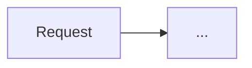
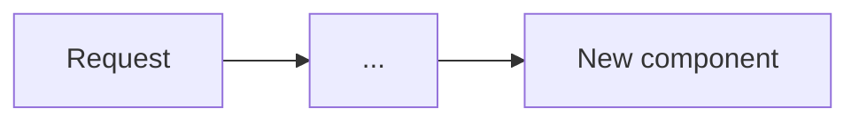

<!--
============================================================================
 NextRush RFC TEMPLATE  —  copy this file, do not edit it in place.
============================================================================

HOW TO USE
  1. Copy this file to the right group folder with the next global number:
       docs/RFC/<group>/<NNN>-<kebab-title>.md
       e.g. docs/RFC/request-data/019-cookie-signing.md
     Groups: release-process/ · request-data/ · class-runtime/ · runtime-adapters/
     (see docs/RFC/INDEX.md — add a new group only for a genuinely new area).
  2. Fill the sections. Rule (relaxed for small RFCs):
       - Every section must either contain content OR an explicit
         "_Not applicable — <one-line reason>_".
       - For documentation-only or process RFCs, sections that genuinely do not
         apply (Architecture, Success Metrics, Rollback, Cross-Cutting) may be a
         single N/A line — do not pad them with boilerplate.
       - Never silently DELETE a section heading; a missing heading reads as
         "the author forgot", an N/A line reads as "considered, doesn't apply".
  3. Delete every guidance block. Guidance blocks are the HTML comments
     (<!-- ... -->) and the "> 📝" note lines. Nothing marked as guidance ships.
  4. Register the RFC in docs/RFC/INDEX.md (row in the "All RFCs" table).
  5. RFC before implementation — no code before this document is approved
     (see .kiro/steering/tdd-workflow.md). A shipped decision that outlives the
     RFC is promoted to docs/adr/ and cross-linked.

SECTION MAP (fixed order — every RFC follows it)
  TOP-MATTER (unnumbered): metadata table · Progress Tracker
  0 Revision History · 1 Summary · 2 Decision Summary · 3 Problem & Motivation
  4 Goals & Non-Goals · 5 Impact · 6 Proposed Solution · 7 Architecture
  8 Detailed Design · 9 Alternatives · 10 Rejected Ideas · 11 Risks
  12 Backward Compatibility · 13 Cross-Cutting Concerns · 14 Success Metrics
  15 Phased Implementation · 16 Rollback Plan · 17 Future Work
  18 Open Questions · 19 Decisions Log · 20 References

PROGRESS BAR CONVENTION (identical in the ADR & audit-report templates)
  Bar = 20 cells, one filled cell (█) per 5%; empties are ░. Show percent + count.
    e.g.  [██████████░░░░░░░░░░] 50% — 2 / 4 phases complete
  Legend:  ✅ done · 🔄 in progress · ⬜ not started · ⛔ blocked · ➖ N/A
  Keep the Progress Tracker in sync with §15 as phases land — it is the single
  glance that answers "how far along is this, and which part is left".
============================================================================
-->

# RFC-<NNN>: <Concise, specific title — name the thing and what it does>

<!--
> 📝 Title rules:
>   - Prefix with the package if it introduces/changes one: "`@nextrush/cookies` — signed cookies".
>   - Be specific: "Request-scoped dependency injection", NOT "DI improvements".
>   - This title must match the row you add to docs/RFC/INDEX.md verbatim.
-->

| Field                | Value                                                                 |
| -------------------- | --------------------------------------------------------------------- |
| **Status**           | `Draft` <!-- Draft → In Review → Approved → Shipped → Superseded / Rejected / Deferred --> |
| **RFC number**       | `NNN` <!-- global, authorship order; never renumber a shipped RFC --> |
| **Date**             | `YYYY-MM-DD` <!-- created; keep original, track edits in Revision History --> |
| **Author(s)**        | `<name / team>`                                                       |
| **Group**            | `request-data` <!-- release-process | request-data | class-runtime | runtime-adapters --> |
| **Packages touched** | `@nextrush/<pkg>` <!-- every package this changes; "none" if pure doc/process --> |
| **Framework impact** | `Additive, non-breaking` <!-- one line: Additive/non-breaking · Breaking (needs major + migration) · Internal-only --> |
| **Supersedes**       | `—` <!-- RFC/ADR number this replaces, or "—" -->                     |
| **Superseded by**    | `—` <!-- filled in later if this RFC is retired -->                   |
| **Related**          | `RFC-0xx`, `ADR-000x` <!-- prior art this builds on -->               |

<!--
> 📝 Status definitions (use these exact words, no synonyms):
>   Draft       — being written, not ready for review.
>   In Review   — complete, awaiting approval.
>   Approved    — accepted, implementation may start (or is underway).
>   Shipped     — implemented and released; cross-link the ADR if one exists.
>   Deferred    — accepted as a design, intentionally not built yet (state the gating driver).
>   Rejected    — decided against; keep the RFC as the record of *why*.
>   Superseded  — replaced; fill "Superseded by".
> Never delete an RFC. History is the point.
-->

---

## Progress Tracker

<!--
> 📝 The one-glance status of this RFC. Update the bar and the phase rows as the
>    phases in §15 land — this and §15 must always agree. Bar = 20 cells, one █
>    per 5% (see the PROGRESS BAR CONVENTION at the top of this file).
>    Legend: ✅ done · 🔄 in progress · ⬜ not started · ⛔ blocked · ➖ N/A
-->

**Overall:** `[░░░░░░░░░░░░░░░░░░░░]` 0% — 0 / 4 phases complete · Doc status: `Draft`

| Phase | Part / deliverable                     | Status         |
| ----- | -------------------------------------- | -------------- |
| P0    | _Foundation primitive / internal core_ | ⬜ Not started  |
| P1    | _Engine / internal abstraction_        | ⬜ Not started  |
| P2    | _Public API surface_                   | ⬜ Not started  |
| P3    | _Docs + examples + adapter parity_     | ⬜ Not started  |

---

## 0. Revision History

<!--
> 📝 One bullet per meaningful revision: WHAT changed and WHY, one line each.
>    This is how a reader trusts the current version. Keep it even for v1.
>    Its absence is why old RFCs feel untrustworthy.
-->

- **v1 (`YYYY-MM-DD`)** — Initial draft.

---

## 1. Summary (TL;DR)

<!--
> 📝 3–5 sentences, plain language. After this section alone a reader knows WHAT
>    is proposed and WHY. No jargon that isn't defined later. If you can't
>    summarise it here, the design isn't clear yet.
-->

_One paragraph: the problem in one sentence, the proposed change in one sentence,
and the single most important consequence (what gets better, what it costs)._

---

## 2. Decision Summary

<!--
> 📝 The 30-second skim. Most reviewers read only this. State the decision as
>    bullet verbs (Introduce / Remove / Keep / Change) and the two facts everyone
>    asks first: is it breaking, and is there migration work.
-->

- **Status:** `Draft`
- **Decision:**
  - _Introduce `<X>`_
  - _Remove / deprecate `<Y>`_
  - _Keep `<Z>` unchanged_
- **Breaking:** `No` | `Yes — see §12`
- **Migration required:** `None` | `<one line — see §12>`
- **Blast radius:** `<low | medium | high>` — _see §5 for who's affected._

---

## 3. Problem & Motivation

<!--
> 📝 THE most important section. Rules:
>   - Describe CURRENT behaviour concretely — show the code, API, error, or
>     measurement as it is TODAY. Not "the design is suboptimal".
>   - Every claimed problem gets evidence: a snippet, a benchmark number, a bug
>     reference, or a reproducible scenario. No unbacked assertions.
>   - Explain WHY NOW — what forces this decision at this point.
>   - Number the problems so each maps to a solution (§6) and a phase (§15).
-->

### 3.1 Current state (what exists today)

_Describe today's behaviour with concrete artefacts. Example of the shape:_

```ts
// TODAY: every handler validates by hand — repetitive, inconsistent error shapes.
app.post('/users', (ctx) => {
  if (typeof ctx.body?.email !== 'string') { /* ad-hoc 400 */ }
});
```

### 3.2 The problems (enumerated)

1. **`<Short problem name>`** — _What breaks / hurts, and the concrete evidence
   (snippet, metric, or scenario)._
2. **`<Short problem name>`** — _…_
3. **`<Short problem name>`** — _…_

### 3.3 Why now

_What makes this the right time (a blocking dependency, an ecosystem shift, a
recurring bug, an upcoming major release, a performance ceiling now hit)._

---

## 4. Goals & Non-Goals

<!--
> 📝 Goals = checkable success statements (they become §15 exit conditions and
>    §14 metrics). Non-Goals = what this RFC deliberately does NOT do, each with
>    a one-line reason. An unstated non-goal is a hidden assumption.
-->

### 4.1 Goals

- _Measurable outcome 1 (maps to problem 3.2.1)._
- _Measurable outcome 2 (maps to problem 3.2.2)._

### 4.2 Non-Goals

- _Thing intentionally out of scope — **why** it's excluded (deferred → §17? separate RFC? never?)._

---

## 5. Impact

<!--
> 📝 The blast radius, at a glance. Reviewers use this to decide how hard to look.
>    Be exhaustive on "affected packages" (it drives the test matrix) and explicit
>    on "no impact" (it's what reassures reviewers).
-->

- **Affected packages:** `@nextrush/<pkg>`, `@nextrush/<pkg>` <!-- each one this changes -->
- **Affected audiences:** _Application developers · Plugin/middleware authors · Adapter authors · Contributors_ <!-- keep only those that apply -->
- **Explicitly NOT affected:** _e.g. existing applications; the functional (`nextrush`) entry; other adapters._

---

## 6. Proposed Solution (overview)

<!--
> 📝 The high-level answer, mapped 1:1 to the problems in §3.2. Conceptual only —
>    mechanics go in §8. A reader sees "problem N → solved like this" before the
>    detail.
-->

| # | Problem (from §3.2)        | Solution (this RFC)                          |
| - | -------------------------- | -------------------------------------------- |
| 1 | _`<problem name>`_         | _`<how it's solved, one line>`_              |
| 2 | _`<problem name>`_         | _`<how it's solved, one line>`_              |

_Then 1–3 paragraphs describing the approach as a whole and the key idea that
makes it work._

---

## 7. Architecture

<!--
> 📝 For a backend framework, a diagram beats pages of prose. Show the system
>    BEFORE and AFTER, then justify the shape. Use Mermaid (renders on GitHub).
>    Pick the diagram type that fits: component/C4 for structure, sequence for a
>    request lifecycle, flowchart for a workflow. N/A only for pure doc/process RFCs.
-->

### 7.1 Before



### 7.2 After



### 7.3 Why this architecture

_What the diagram doesn't say on its own: the key constraint or principle that
drove this shape (layering, runtime independence, hot-path cost, package
hierarchy). Tie back to the package graph in `.kiro/steering/architecture.instructions.md`._

---

## 8. Detailed Design

<!--
> 📝 The engineering substance — a reader should be able to implement from here.
>    Split into the subsections below (drop any that don't apply, with an N/A
>    line). Prefer real code and diagrams over prose. Do not write one wall of
>    text — the same clarity discipline as source files
>    (.kiro/steering/code-structure.md).
-->

### 8.1 Public API / surface

```ts
// The exact exported signatures a user or downstream package will touch.
// This is a contract — see §12 before changing it after approval.
```

### 8.2 Internal components

_The internal pieces and each one's single responsibility. What owns what._

### 8.3 Request / execution flow

```text
request → <step> → <step> → <decision?> → <result>
```

### 8.4 Data structures

_Key types, records, metadata shapes, storage layout — and why they're shaped
this way (e.g. chosen for O(1) lookup on the hot path)._

### 8.5 Error handling

_Which errors, which `HttpError` subclass, which status, and the exact response
shape. No internal paths/stack traces leak in production (project-rules §3–§4)._

### 8.6 Edge cases

| Scenario                    | Behaviour                                  |
| --------------------------- | ------------------------------------------ |
| _`<edge case>`_             | _`<exact defined behaviour>`_              |
| _`<invalid input>`_         | _`<error type, status, message shape>`_    |

### 8.7 Examples

```ts
// End-to-end usage as a developer will actually write it. Before/after if it
// replaces an existing pattern.
```

---

## 9. Alternatives Considered

<!--
> 📝 Whole-approach alternatives (vs §10, which is smaller ideas rejected during
>    design). At least one real alternative plus "do nothing". For each: what it
>    is and the specific reason it lost. This is where reviewers catch a wrong
>    top-level decision.
-->

### 9.1 `<Alternative approach A>`
_What it is, and **why rejected** (concrete reason, not "we preferred ours")._

### 9.2 Do nothing
_What happens if this RFC is not adopted — the cost of the status quo._

---

## 10. Rejected Ideas

<!--
> 📝 The smaller ideas raised and dropped DURING design of the chosen approach.
>    Writing them down stops the same debate recurring in six months. One line of
>    "rejected because…" each is enough.
-->

- **`<Idea>`** — _Rejected because `<reason>`._
- **`<Idea>`** — _Rejected because `<reason>`._

---

## 11. Risks & Mitigations

<!--
> 📝 Distinct from alternatives and trade-offs: a RISK is something that could go
>    wrong AFTER we adopt this. State the mitigation, and rate likelihood/impact
>    so reviewers can prioritise. Empty is not an answer — every non-trivial
>    change has at least one risk.
-->

| Risk                     | Mitigation                        | Likelihood | Impact |
| ------------------------ | --------------------------------- | ---------- | ------ |
| _`<what could go wrong>`_ | _`<how we prevent/contain it>`_   | Low/Med/High | Low/Med/High |

---

## 12. Backward Compatibility & Migration

<!--
> 📝 State impact plainly. Additive/non-breaking → say so and why. Breaking →
>    this is a HARD GATE: MUST include a version-bump note and a concrete
>    before/after migration path (engineering-standards.md, project-rules §7).
-->

- **Compatibility:** _Additive & non-breaking_ | _Breaking — requires major bump._
- **Migration path (if breaking):**

  ```ts
  // Before
  // After
  ```

- **Deprecation window:** _`@deprecated` JSDoc + docs updated same commit; removed in vX._

---

## 13. Cross-Cutting Concerns

<!--
> 📝 Fill each, or "_Not applicable — <reason>_". Silence is not an answer —
>    these are the concerns that get "discovered in production". NextRush is a
>    portable, multi-runtime, security-sensitive framework; none are optional.
-->

- **Security:** _Untrusted-input handling, header/prototype-pollution vectors, size
  limits, auth ordering, no secret/PII leak in errors (project-rules §3–§4)._
- **Performance:** _Hot-path allocations, cold-start/bundle impact — quantified in §14._
- **Runtime independence:** _No runtime-specific API (`process`/`Deno`/`Bun`) leaks
  into core/middleware; adapters keep identical observable behaviour (AGENTS.md §7)._
- **Observability:** _What is logged/measured; nothing sensitive logged._
- **Zero-dependency rule:** _No new runtime dep in core/router/errors/types/adapters/
  middleware without a documented size/security justification (project-rules §6)._

---

## 14. Success Metrics

<!--
> 📝 How we know it worked, in numbers — the RFC isn't "done" until these hold.
>    Mandatory for anything touching the request lifecycle or performance; N/A
>    (with reason) for pure API/doc RFCs. Give a baseline and a target/threshold,
>    measured on the harness in apps/benchmark (project-rules §5).
-->

| Metric                | Baseline (today) | Target / threshold          |
| --------------------- | ---------------- | --------------------------- |
| _Latency (p50/p99)_   | _`<n>`_          | _no regression / `<target>`_ |
| _Memory footprint_    | _`<n>`_          | _`<target>`_                |
| _Bundle size_         | _`<n>`_          | _`<target>`_                |
| _Startup / cold start_| _`<n>`_          | _`<target>`_                |
| _Test coverage_       | —                | _90%+ lines/functions_      |

---

## 15. Phased Implementation Plan

<!--
> 📝 Build foundation-first, lowest layer upward (tdd-workflow.md): primitive →
>    engine → abstraction → public API → examples. Never start at the public API.
>    Each phase is independently shippable/revertible, test-first (RED→GREEN→
>    REFACTOR), and has a CHECKABLE exit condition — not "looks done".
-->

| Phase | Goal (what ships)                     | Depends on | Exit condition (checkable)                     | Status         |
| ----- | ------------------------------------- | ---------- | ---------------------------------------------- | -------------- |
| **P0** | _Foundation primitive / internal core_ | —          | _Unit tests green; behaviour X observable_     | ⬜ Not started  |
| **P1** | _Engine / internal abstraction_        | P0         | _Integration test green_                       | ⬜ Not started  |
| **P2** | _Public API surface_                   | P1         | _Public usage test green; API matches §8.1_    | ⬜ Not started  |
| **P3** | _Docs + examples + adapter parity_     | P2         | _Docs updated; cross-adapter suite identical_  | ⬜ Not started  |

<!-- 📝 When a phase's exit condition is met, flip its Status to ✅ here AND update
     the Progress Tracker bar at the top. The two must never disagree. -->


### 15.1 Testing strategy

- **Unit:** _pure logic, many, fast._
- **Integration:** _real adapter/dependency at the boundary._
- **Cross-adapter:** _identical observable behaviour across node/bun/deno/edge (if relevant)._
- **Coverage:** _90%+ lines/functions per package (CI-enforced, project-rules §7)._

---

## 16. Rollback Plan

<!--
> 📝 How to undo this safely if a phase fails in the wild. Production always
>    plans the exit. State the trigger and the concrete steps per phase. N/A only
>    for design-only/deferred RFCs that ship no code.
-->

- **Trigger:** _What signals a rollback (regression on a §14 metric, a P2 integration failure, a reported break)._
- **Steps:**
  - _Revert `@nextrush/<pkg>` to `<version>`._
  - _Keep the compatibility shim / feature flag until the next attempt._
  - _`<what state must be cleaned up — cache, migration, published tag>`._

---

## 17. Future Work

<!--
> 📝 Explicitly out of THIS RFC — the scope fence. Naming these keeps the current
>    RFC small and stops scope creep; each becomes a candidate follow-up RFC.
-->

- _`<capability intentionally deferred>` — likely a follow-up RFC._
- _`<optimization / extension not needed for v1>`._

---

## 18. Open Questions

<!--
> 📝 Unresolved decisions, listed openly. An open question is honest; a hidden
>    assumption is a landmine. Move each to §19 with its answer as it resolves —
>    don't delete it.
-->

- [ ] _`<question needing a decision before/during implementation>`_

---

## 19. Decisions Log

<!--
> 📝 Every settled decision, so the "why" survives after the debate is forgotten.
>    Append-only during review; a future maintainer reads this first.
-->

| Question                    | Decision                | Rationale                        |
| --------------------------- | ----------------------- | -------------------------------- |
| _`<what was debated>`_      | _`<what was chosen>`_   | _`<why, in one line>`_           |

---

## 20. References

<!-- 📝 Prior RFCs/ADRs, external specs, benchmarks, issue links, source files. -->

- _`docs/RFC/<group>/<nnn>-<title>.md`_
- _`docs/adr/ADR-000x-<title>.md`_
- _External spec / prior art_

<!--
============================================================================
 FINAL CHECK before setting Status to "In Review" — every box true:
   [ ] §2 Decision Summary readable in 30 seconds (breaking? migration? decided).
   [ ] Every section has content OR an explicit "Not applicable — reason".
   [ ] Every problem in §3.2 has evidence and a matching solution in §6.
   [ ] §5 Impact lists affected packages (drives the test matrix) + "not affected".
   [ ] §7 has before/after diagrams (or N/A for doc/process RFCs).
   [ ] §9 has ≥1 real alternative + "do nothing"; §10 records rejected ideas.
   [ ] §11 Risks separated from trade-offs, each with a mitigation.
   [ ] Backward-compat stated (§12); migration path present if breaking.
   [ ] Every §13 cross-cutting concern answered, not left silent.
   [ ] §14 metrics have baseline + target (or N/A with reason).
   [ ] §15 phases each have a checkable exit condition and are test-first.
   [ ] Progress Tracker (top) matches §15 phase Status column — bar % = done/total.
   [ ] §16 rollback plan present for anything shipping code.
   [ ] All guidance blocks (HTML comments + "> 📝" lines) deleted.
   [ ] Registered in docs/RFC/INDEX.md.
============================================================================
-->
