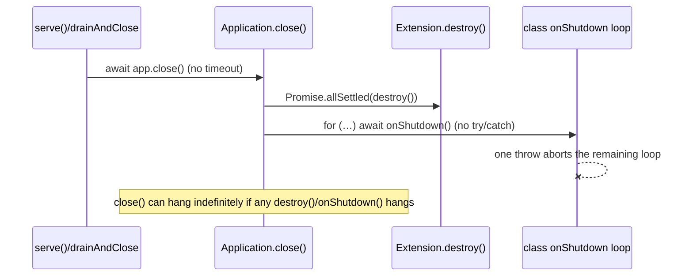
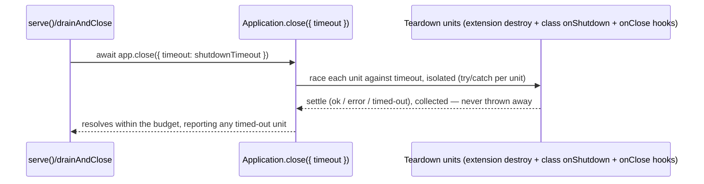

# RFC-022: `@nextrush/core` — Bounded, cancellation-aware teardown lifecycle

| Field                | Value                                                                 |
| -------------------- | ---------------------------------------------------------------------- |
| **Status**           | `Shipped` |
| **RFC number**       | `022` |
| **Date**             | `2026-07-22` |
| **Author(s)**        | Reliability hardening change (`harden-framework-reliability`) |
| **Group**            | `class-runtime` |
| **Packages touched** | `@nextrush/core`, `@nextrush/adapter-node`, `@nextrush/adapter-bun`, `@nextrush/adapter-deno`, `@nextrush/websocket` |
| **Framework impact** | `Additive, non-breaking` |
| **Supersedes**       | `—` |
| **Superseded by**    | `—` |
| **Related**          | `ADR-0010` (Node timeout→504 parity — a distinct, already-decided question this RFC does NOT re-litigate), `docs/RFC/class-runtime/009-lifecycle-hooks.md` |

---

## Progress Tracker

**Overall:** `[████████████████████]` 100% — 4 / 4 phases complete · Doc status: `Shipped`

| Phase | Part / deliverable                     | Status         |
| ----- | --------------------------------------- | -------------- |
| P0    | `Application.close({ timeout })` budget + per-hook isolation | ✅ Done |
| P1    | `Application.onClose(hook)` registration API | ✅ Done |
| P2    | WebSocket server disposed via the Extension lifecycle | ✅ Done |
| P3    | Docs + adapter parity (Bun/Deno wiring, README updates) | ✅ Done |

---

## 0. Revision History

- **v1 (`2026-07-22`)** — Initial draft, narrowed during `harden-framework-reliability` apply after
  discovering `ADR-0010` already ratifies the Node-timeout question this RFC originally also
  covered; that decision was removed from scope here to avoid duplicating it.
- **v2 (`2026-07-22`)** — All four phases (P0-P3) implemented, tested, and independently verified
  as part of the `harden-framework-reliability` OpenSpec change. Status moved to `Shipped`.

---

## 1. Summary (TL;DR)

`Application.close()` today tears down extensions with no time bound and, in the class-runtime
`OnShutdown` bridge, with no per-hook error isolation — so one hung or throwing teardown hook can
hang the whole process past its shutdown budget or strand every later hook's cleanup. This RFC
introduces a bounded, per-hook-isolated teardown contract (`close({ timeout })`), a general
`app.onClose(hook)` registration API for resources outside the extension system (WebSocket servers,
stateful middleware), and converts the WebSocket server to a self-disposing Extension. The cost is
one new optional parameter and one new public method; the benefit is that graceful shutdown becomes
provably bounded instead of best-effort.

---

## 2. Decision Summary

- **Status:** `Approved`
- **Decision:**
  - _Introduce_ an optional teardown `timeout` on `Application.close()`, racing each teardown unit
    against it and collecting (not swallowing) any that don't finish in time.
  - _Introduce_ `Application.onClose(hook)` — a registration API for teardown callbacks outside the
    extension system, run under the same bounded/isolated guarantee.
  - _Change_ the class-runtime `OnShutdown` bridge to isolate each hook's failure (currently a bare
    sequential `await` with no try/catch).
  - _Change_ `@nextrush/websocket` to offer its server as a self-disposing Extension (`destroy()`
    calls `wss.close()`); keep the existing `createWebSocket()` factory for manual/advanced use.
  - _Keep_ the existing `Promise.allSettled` isolation across extensions unchanged.
- **Breaking:** `No`
- **Migration required:** `None` — every change is additive/opt-in; omitting the new options
  reproduces exactly today's behavior.
- **Blast radius:** `Low` — new optional parameters and one new method on `Application`; no signature
  is removed or narrowed.

---

## 3. Problem & Motivation

### 3.1 Current state (what exists today)

```ts
// packages/core/src/application.ts — Application._shutdown() (today)
const results = await Promise.allSettled(
  destroyable.map((e) => Promise.resolve().then(() => e.destroy()).catch(...))
);
// No timeout anywhere in this function.
```

```ts
// packages/class/src/lifecycle/lifecycle.ts — registerLifecycleExtension().destroy() (today)
async destroy(): Promise<void> {
  for (const instance of [...instances].reverse()) {
    if (isOnShutdown(instance)) {
      await instance.onShutdown(); // no try/catch — one throw aborts the whole loop
    }
  }
}
```

```ts
// packages/extensions/websocket/src/index.ts (today)
export function createWebSocket(options: WebSocketOptions = {}): WebSocketServer {
  return new WebSocketServer(options); // plain object — not wired to app.close() at all
}
```

### 3.2 The problems (enumerated)

1. **Unbounded extension/service teardown** — `Application.close()` has no time bound. A hung
   `destroy()` (e.g. awaiting a DB pool drain that never resolves) hangs the whole process past its
   configured shutdown window, defeating the point of a graceful-shutdown timeout that the Node
   adapter already applies to the *socket* drain but not to this phase (evidence:
   `packages/adapters/node/src/adapter.ts` `drainAndClose` bounds only `server.close()`, then does
   an un-timed `await app.close()`).
2. **No per-hook isolation in the class-runtime bridge** — a throwing `onShutdown()` aborts the
   `for` loop in `registerLifecycleExtension.destroy()`, so every service registered *after* the
   throwing one never gets torn down (e.g. a cache's `onShutdown()` throws first, and the database
   connection registered after it is never closed).
3. **No lifecycle hook for non-extension resources** — stateful middleware (e.g. the rate-limit
   `MemoryStore`'s cleanup interval) and long-lived services created outside `app.extend()` (the
   WebSocket server) have no registration point in the app lifecycle, so their cleanup depends on
   the developer remembering a manual out-of-band call.
4. **The WebSocket server is not disposed by anything** — `createWebSocket()` returns a plain
   object; nothing calls `wss.close()` on `app.close()`, so its heartbeat interval survives a
   graceful shutdown unless the developer calls `wss.close()` manually.

### 3.3 Why now

A dedicated reliability audit (`report/reliability/reliability-framework-review.md`, commit
`6ab26e9`) traced these to concrete production failure modes — an orchestrator `SIGKILL` after a
hung teardown, and a process that never exits after "successful" graceful shutdown because of the
WebSocket heartbeat — and the `harden-framework-reliability` OpenSpec change exists specifically to
close them. Fixing them requires a public-API addition (`close({ timeout })`, `onClose`), which per
repo governance (§20/§21) is RFC-gated before implementation.

---

## 4. Goals & Non-Goals

### 4.1 Goals

- `Application.close({ timeout })` resolves within the given budget even if a teardown hook hangs,
  and reports which hook(s) did not complete in time (maps to problem 3.2.1).
- Every teardown hook (extension `destroy()`, class `onShutdown()`, `onClose` registration) runs
  isolated from the others — one throwing/hanging hook never prevents the rest from running (maps
  to 3.2.2).
- `app.onClose(hook)` gives any subsystem a deterministic place to register cleanup, run under the
  same bounded/isolated guarantee (maps to 3.2.3).
- The WebSocket server disposes its heartbeat and connections when `app.close()` runs, via the
  Extension lifecycle (maps to 3.2.4).

### 4.2 Non-Goals

- **Not** re-deciding the Node request-timeout→504 question — that is `ADR-0010`'s decision,
  already Accepted; this RFC does not touch it.
- **Not** changing Bun/Deno's own drain mechanics (`server.stop()`/`server.shutdown()`) — only the
  `await app.close(...)` call each already makes gains a budget argument.
- **Not** building a generic dependency-injection-aware shutdown *ordering* system — ordering stays
  reverse-of-registration, as today.
- **Not** covering Edge/serverless — both have a documented no-teardown / per-invocation contract;
  out of scope by design.

---

## 5. Impact

- **Affected packages:** `@nextrush/core`, `@nextrush/class`, `@nextrush/adapter-node`,
  `@nextrush/adapter-bun`, `@nextrush/adapter-deno`, `@nextrush/websocket`.
- **Affected audiences:** Application developers using graceful shutdown; extension/middleware
  authors who need deterministic cleanup; WebSocket users.
- **Explicitly NOT affected:** the functional (`nextrush`) entry's request-handling surface; Edge
  and serverless adapters (no shutdown phase); any app that does not opt into the new `timeout`/
  `onClose` parameters (behavior is unchanged).

---

## 6. Proposed Solution (overview)

| # | Problem (from §3.2)        | Solution (this RFC)                          |
| - | -------------------------- | --------------------------------------------- |
| 1 | Unbounded teardown          | `close({ timeout })` races each teardown unit against the budget |
| 2 | No per-hook isolation (class bridge) | Wrap each `onShutdown()` in try/catch inside the reverse loop, matching the app-level `allSettled` guarantee |
| 3 | No hook for non-extension resources | `Application.onClose(hook)` — registered hooks run under the same bounded/isolated teardown |
| 4 | WebSocket server undisposed | Offer it as a self-disposing Extension whose `destroy()` calls `wss.close()` |

The core idea: teardown becomes a **flat list of independently-isolated, budget-raced units** —
extension `destroy()`, class `onShutdown()`, and `onClose` hooks are all the same shape from
`_shutdown()`'s point of view, so the same bounding/isolation logic covers all three without a
separate mechanism per source.

---

## 7. Architecture

### 7.1 Before



### 7.2 After



### 7.3 Why this architecture

Treating extension `destroy()`, class `onShutdown()`, and `onClose` hooks as one uniform "teardown
unit" shape (rather than three separately-bounded mechanisms) keeps `_shutdown()` a single loop with
one isolation/timeout implementation — consistent with the package's small-API, one-mechanism
principle (AGENTS.md §5/§9) and avoids the class bridge silently drifting from the app-level
guarantee the way it has today.

---

## 8. Detailed Design

### 8.1 Public API / surface

```ts
// packages/core/src/application.ts

export interface CloseOptions {
  /** Bound, in ms, on total teardown time. Omitted = unbounded (today's behavior). */
  timeout?: number;
}

class Application {
  /** Register a teardown hook, run under the same bounded/isolated guarantee as
   *  extension destroy() and class onShutdown(). Reverse of registration order. */
  onClose(hook: () => void | Promise<void>): void;

  /** Existing signature widened additively — omitting options is unchanged. */
  close(options?: CloseOptions): Promise<Error[]>;
}
```

```ts
// packages/extensions/websocket/src/index.ts — additive form
export function createWebSocketExtension(options?: WebSocketOptions): Extension<{ wss: WebSocketServer }>;
// createWebSocket() (the existing factory) is unchanged, for manual attach.
```

### 8.2 Internal components

- **Teardown unit list** — `_shutdown()` builds one array of `{ name, run }` units from (a)
  extension `destroy()`s, (b) the class lifecycle bridge's per-hook wrapped calls, (c) registered
  `onClose` hooks — each already wrapped in its own try/catch.
- **Race helper** — a small internal `withTimeout(promise, ms)` racer, only invoked when `timeout`
  is provided; omission preserves today's unbounded `Promise.allSettled` exactly.

### 8.3 Request / execution flow

```text
app.close({ timeout }) → build unit list (extensions reverse, class hooks reverse, onClose reverse)
  → for each unit: Promise.race([unit.run().catch(collect), timeout ? delay(timeout).then(markTimedOut) : never])
  → await all races → return collected errors (including "unit X timed out")
```

### 8.4 Data structures

No new persisted data structures; `_closePromise` memoization (existing H-3 guard) is unchanged.

### 8.5 Error handling

A teardown unit that throws is caught and its error collected in the returned `Error[]`, identical
in shape to today's extension-`destroy()` errors — a timed-out unit is reported as a distinct
`Error` (e.g. `TeardownTimeoutError` naming the unit) appended to the same array, so callers get one
consistent error-collection contract regardless of source.

### 8.6 Edge cases

| Scenario                                          | Behaviour                                                        |
| -------------------------------------------------- | ------------------------------------------------------------------ |
| `close()` called with no `timeout`                 | Unbounded, identical to today's behavior                          |
| A unit resolves before the timeout                  | Contributes normally; no wait for the budget to elapse            |
| Two units hang simultaneously                        | Both are reported as timed-out; neither blocks the other          |
| `onClose` registered after `close()` already started | Not run in that shutdown (registration is pre-shutdown only)      |
| WebSocket Extension `destroy()` throws               | Isolated like any other extension; error collected, others proceed |

### 8.7 Examples

```ts
// Bounded shutdown from an adapter
await app.close({ timeout: shutdownTimeout }); // never hangs past the budget

// Stateful middleware registers its own cleanup
export function rateLimit(app: Application, opts: RateLimitOptions) {
  const store = new MemoryStore(opts);
  app.onClose(() => store.shutdown());
  return middleware(store);
}

// WebSocket disposed by the app lifecycle
const app = createApp().extend(createWebSocketExtension({ heartbeatInterval: 30_000 }));
await app.ready();
// ... app.wss.on('/chat', ...) ...
await app.close(); // heartbeat cleared, connections closed — no manual wss.close() needed
```

---

## 9. Alternatives Considered

### 9.1 A separate `shutdownTimeout` mechanism per subsystem (extension vs class vs middleware)
Rejected — three bounding/isolation implementations would drift the way the class bridge already
drifted from the app-level `Promise.allSettled` guarantee; a single uniform teardown-unit shape
avoids repeating that mistake.

### 9.2 Middleware becomes an object `{ handler, dispose }` instead of `app.onClose`
Rejected — breaks the "middleware is a function" contract that the whole framework relies on
(AGENTS.md §3); `app.onClose` generalizes to any subsystem without changing that contract.

### 9.3 Do nothing
The process keeps risking an orchestrator `SIGKILL` on a hung teardown, and the WebSocket heartbeat
keeps requiring a manual `wss.close()` call to avoid blocking process exit — both confirmed
production failure modes in the source review.

---

## 10. Rejected Ideas

- **A required `AbortSignal` parameter on `destroy()`/`onShutdown()`** — rejected in favor of a
  simple race-based timeout; a required signal parameter would be a breaking change to every
  existing `destroy()`/`onShutdown()` implementation.
- **Automatically inferring shutdown order from the DI graph** — rejected as unnecessary complexity;
  reverse-of-registration is simple, predictable, and already what the codebase does.

---

## 11. Risks & Mitigations

| Risk                                                        | Mitigation                                                          | Likelihood | Impact |
| ------------------------------------------------------------ | --------------------------------------------------------------------- | ---------- | ------ |
| A timed-out unit leaks the one resource it owned              | Reported by name in the returned errors, visible to operators (N13 observability task) | Medium | Medium |
| `onClose` hooks registered after boot silently do nothing useful | Documented: register during setup, before `close()` is called       | Low        | Low    |

---

## 12. Backward Compatibility & Migration

- **Compatibility:** Additive & non-breaking. `close()` without `options` behaves exactly as today
  (unbounded `Promise.allSettled`); `onClose` is a new method with no prior behavior to preserve.
- **Migration path (if breaking):** N/A — not breaking.
- **Deprecation window:** N/A — nothing is deprecated.

---

## 13. Cross-Cutting Concerns

- **Security:** No untrusted input is involved; teardown errors are internal diagnostics, not
  exposed to any client-facing surface.
- **Performance:** Zero cost when `timeout`/`onClose` are unused (no new allocation on the request
  hot path — this is a shutdown-only change).
- **Runtime independence:** No runtime-specific API introduced in `@nextrush/core`; the Bun/Deno
  wiring passes the same budget into their existing `await app.close()` calls, not a Node-specific
  mechanism.
- **Observability:** Timed-out units are named in the returned error array; full structured
  shutdown observability is the companion N13 task in the same OpenSpec change.
- **Zero-dependency rule:** No new runtime dependency in any touched package.

---

## 14. Success Metrics

| Metric                | Baseline (today)                          | Target / threshold                                    |
| ---------------------- | -------------------------------------------- | --------------------------------------------------------- |
| Shutdown bound          | Unbounded (can hang indefinitely)             | Resolves within the configured `timeout`, always          |
| Teardown isolation      | Class bridge: one throw aborts remaining hooks | All hooks run regardless of earlier failures               |
| Test coverage           | —                                              | 90%+ lines/functions on touched files (repo-wide gate)     |

---

## 15. Phased Implementation Plan

| Phase | Goal (what ships)                                          | Depends on | Exit condition (checkable)                                       | Status  |
| ----- | ------------------------------------------------------------ | ---------- | -------------------------------------------------------------------- | ------- |
| **P0** | `close({ timeout })` budget + isolated class `onShutdown` loop | —          | Hung-hook test: `close()` resolves within budget, reports the hook; throwing-hook test: later hooks still run | ✅ Done |
| **P1** | `Application.onClose(hook)` API                                | P0         | Registered hook runs under the same bounded/isolated teardown (test)  | ✅ Done |
| **P2** | WebSocket server disposed via the Extension lifecycle          | P1         | WebSocket Extension `destroy()` calls `wss.close()`; heartbeat cleared on `app.close()` (test) | ✅ Done |
| **P3** | Docs + Bun/Deno budget wiring + README updates                 | P0         | Bun/Deno `close()` pass the budget into `app.close()`; READMEs document the new API | ✅ Done |

### 15.1 Testing strategy

- **Unit:** teardown-unit racing/isolation logic in `@nextrush/core`, in isolation from any real I/O.
- **Integration:** a fixture app with a hanging `destroy()`/`onShutdown()`, asserting the process
  exits within budget (mirrors the existing `graceful-shutdown.integration.test.ts` pattern).
- **Cross-adapter:** Node, Bun, and Deno all exercise the same bounded `app.close()` path.
- **Coverage:** 90%+ lines/functions on `@nextrush/core`, `@nextrush/class`, `@nextrush/websocket`.

---

## 16. Rollback Plan

- **Trigger:** a regression where `close({ timeout })` returns before genuinely-complete teardown
  finishes cleanup that used to complete under the old unbounded wait.
- **Steps:**
  - Revert `@nextrush/core` to the pre-RFC version (no `timeout`/`onClose`); adapters revert their
    budget-passing call sites.
  - No data/schema migration exists to unwind — this is in-memory process lifecycle only.

---

## 17. Future Work

- Native Bun/Deno WebSocket support wired through the same Extension lifecycle (currently
  `@nextrush/websocket` is Node-only via `ws`).
- Structured shutdown observability (draining state, per-unit teardown duration) — tracked as a
  companion task (N13) in the same OpenSpec change, not part of this RFC's public API.

---

## 18. Open Questions

_None outstanding — resolved during design (see §19)._

---

## 19. Decisions Log

| Question                                                          | Decision                                              | Rationale                                                    |
| --------------------------------------------------------------------- | -------------------------------------------------------- | ------------------------------------------------------------ |
| Should this RFC also decide the Node request-timeout→504 question?      | No — excluded; `ADR-0010` already decided it            | Avoid duplicating one decision across two RFC/ADRs (AGENTS.md §21) |
| Should middleware become an object with `dispose()`?                    | No — `app.onClose(hook)` instead                        | Preserves "middleware is a function" (AGENTS.md §3)          |
| Should teardown order be inferred from the DI graph?                    | No — stays reverse-of-registration                      | Simpler, predictable, matches existing behavior               |

---

## 20. References

- `report/reliability/reliability-framework-review.md` — source audit (F-02, F-03, F-04, F-07)
- `docs/adr/ADR-0010-cross-runtime-parity-hardening.md` — the related-but-distinct, already-decided
  Node timeout→504 question this RFC deliberately does not re-litigate
- `docs/RFC/class-runtime/009-lifecycle-hooks.md` — the `OnInit`/`OnShutdown` hooks this RFC
  hardens the teardown side of
- `openspec/changes/harden-framework-reliability/` — the OpenSpec change this RFC gates
