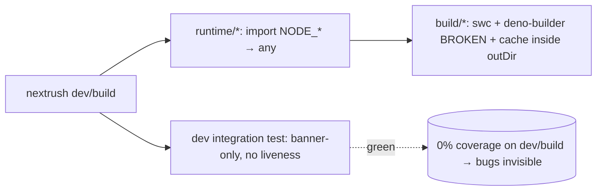
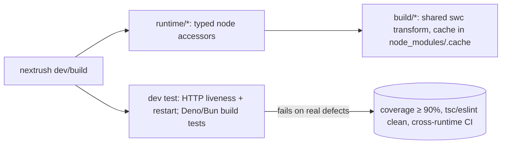

# RFC-019: `@nextrush/dev` — the dev-tooling capability & verification-first hardening

| Field                | Value                                                                 |
| -------------------- | --------------------------------------------------------------------- |
| **Status**           | `Approved`                                                           |
| **RFC number**       | `019`                                                                |
| **Date**             | `2026-07-20`                                                         |
| **Author(s)**        | Developer Tooling review                                             |
| **Group**            | `dev-tooling`                                                        |
| **Packages touched** | `@nextrush/dev`                                                     |
| **Framework impact** | `Additive / bug-fix, non-breaking` — two documented CLI behavior changes (watch default, `.d.ts` gating); no public programmatic-API signature changes |
| **Supersedes**       | `—`                                                                  |
| **Superseded by**    | `—`                                                                  |
| **Related**          | `ADR-0008`, `ADR-0005` (package tiers), OpenSpec change `dev-tooling-reliability`, `report/dev/dev-tooling-review.md` |

---

## Progress Tracker

**Overall:** `[░░░░░░░░░░░░░░░░░░░░]` 0% — 0 / 4 phases complete · Doc status: `Approved`

| Phase | Part / deliverable                                            | Status         |
| ----- | ------------------------------------------------------------- | -------------- |
| P0    | Verification backstop (typed built-ins, liveness/Deno/Bun tests) | ⬜ Not started  |
| P1    | P1 correctness fixes (Deno build, cache, `.d.ts` gating)      | ⬜ Not started  |
| P2    | Robustness & diagnostics (watch, shutdown, loader, preflight) | ⬜ Not started  |
| P3    | Codemod, path parity, hygiene, docs, gates                    | ⬜ Not started  |

---

## 0. Revision History

- **v1 (`2026-07-20`)** — Initial draft. Establishes the `dev-tooling` capability and the
  verification-first hardening derived from `report/dev/dev-tooling-review.md` (commit `ef95e3f`).

---

## 1. Summary (TL;DR)

`@nextrush/dev` is the toolchain every NextRush developer uses (`dev`, `build`, `generate`,
`codemod`) but it is the only major surface with no capability spec, and a deep review found it
shipping real correctness bugs behind a green test suite (39.79% coverage; 0% on the dev-server and
build modules). This RFC establishes `dev-tooling` as a durable capability with an explicit,
testable contract, and hardens the package **verification-first**: land a real verifier (typed
Node built-ins + a liveness-checked dev test + Deno/Bun build tests) before fixing the correctness
defects, so the fixes are validated independently rather than self-reported. The cost is a modest
CI expansion (real Bun/Deno jobs) and one round of coverage work; the payoff is a toolchain whose
"stable" claims are true.

---

## 2. Decision Summary

- **Status:** `Approved`
- **Decision:**
  - Introduce a new `dev-tooling` OpenSpec capability (no existing capability owns the dev
    server/build/watch pipeline).
  - Adopt a verification-first sequencing: the verifier lands before the correctness fixes.
  - Fix the shipped defects the review found (Deno build, dead cache, `.d.ts` gating, `any`-typed
    built-ins) and improve watch portability, shutdown, diagnostics, and codemod safety.
- **Breaking:** `No` — no public programmatic-API signature changes. Two observable CLI **behavior
  changes** (default watch flag; `.d.ts` no longer gated on decorator metadata) are documented, not
  contract breaks.
- **Migration required:** `None` for the programmatic API; the watch-default change is transparent.
- **Blast radius:** `medium` — one package, but it is on every developer's critical path (see §5).

---

## 3. Problem & Motivation

### 3.1 Current state (what exists today)

`@nextrush/dev` works on the primary Node path and is architecturally sound (SWC-for-decorator-
metadata, native-watcher restart, local-`tsc` declarations, a thin cross-runtime layer). But it has
no capability spec, so its guarantees are implicit, and its verifier is weak: the suite is green
(208 tests) while line coverage is 39.79% with the dev-server, SWC-builder, Deno-builder, and
Bun-builder at **0%**. Concrete artefacts from the review (`report/dev/dev-tooling-review.md`):

```ts
// deno-builder.ts — files are TypeScriptFile objects { path, ext }, used as strings:
for (const file of files) {
  const relativePath = path.relative(srcDir, file);   // node:path throws on a non-string
  const source = await fs.readFile(file, 'utf-8');     // …but compiles clean (see 3.2.4)
}
```

```ts
// swc-builder.ts — the cache lives inside outDir, which clean() wipes first:
const cacheFile = path.join(outPath, '.nextrush', 'build-cache.json');
// build.ts: if (resolved.clean) await cleanDirectory(outPath);  // deletes the cache every build
```

### 3.2 The problems (enumerated)

1. **No capability contract** — the dev toolchain's guarantees are undocumented and untestable as a
   spec; "what does `nextrush dev`/`build` promise?" is unanswerable today.
2. **Deno production build is broken** — `deno-builder.ts` passes `TypeScriptFile` objects to
   `node:path` string APIs; `node:path.relative` throws `ERR_INVALID_ARG_TYPE`, so the build fails
   on the first file and the native fallback repeats the bug — while docs claim "Stable".
3. **The incremental cache is dead by default** — it is stored inside `outDir`, which `--clean`
   (default on) deletes before every build, so the cache never survives; every rebuild is full.
4. **`tsc` is blind to the I/O layer** — Node built-ins imported via `import(NODE_*)` (variable
   specifier) are typed `any`, which is exactly why problem 3.2.2 compiled clean.
5. **`.d.ts` is gated on the wrong flag** — `--no-decorator-metadata` silently drops all declaration
   output regardless of `--dts`.
6. **The verifier cannot see failures** — the one dev integration test asserts a banner printed
   *before* the child is spawned plus the absence of one specific error string, never an HTTP
   liveness probe, so a dev server whose child crashed still passes green.
7. **Watch/shutdown/diagnostics gaps** — reliance on `--watch-path` (Node docs mark it macOS/
   Windows-only; empirically works on modern Linux but with no fallback/guard); shutdown does not
   await the child and reports no crash; a missing target runtime yields a raw `ENOENT`; the loader
   path uses first-`/dist/`; the codemod relocates license headers; unused `tsx` dep.

### 3.3 Why now

The review just mapped the whole package and the branch (`feat/dev`) is where it is being
stabilized toward release. The defects are latent (green CI) and will surface as "Deno build
broken", "builds are always slow", "my library shipped without types", or "my dev server silently
died" reports post-release. Establishing the capability contract and closing the verification gap
now is far cheaper than after adoption.

---

## 4. Goals & Non-Goals

### 4.1 Goals

- A durable `dev-tooling` capability spec with testable requirements (maps to 3.2.1).
- The correctness defects fixed and each covered by a test that was RED before the fix (3.2.2, 3.2.3, 3.2.5).
- `tsc` restored as a backstop over the I/O layer (3.2.4).
- A dev integration test that proves the server actually serves and restarts (3.2.6).
- Portable watching, crash-reporting shutdown, actionable diagnostics, and a comment-preserving
  codemod (3.2.7), with per-package coverage at or above 90%.

### 4.2 Non-Goals

- **HMR / state-preserving reload** — auto-restart via native watchers is retained deliberately; a
  backend dev loop does not need module-state preservation. (Not deferred — a settled non-goal.)
- **A new bundler** — SWC-per-file (Node/Deno) and `Bun.build` (Bun) stay; this is not a
  compilation-strategy rewrite.
- **Changing `adapter-development-kit`** — the `generate adapter` scaffolder is untouched.
- **Public programmatic-API changes** — `dev()`/`build()`/exported types stay locked.

---

## 5. Impact

- **Affected packages:** `@nextrush/dev` (only).
- **Affected audiences:** Application developers (every one — dev/build is the critical path),
  Contributors (the capability spec + ARCHITECTURE rewrite).
- **Explicitly NOT affected:** the runtime request path (`core`/`router`/adapters), the
  `nextrush`/`nextrush/class` runtime entries, and `adapter-development-kit`'s scaffolder.

---

## 6. Proposed Solution (overview)

| # | Problem (from §3.2)                    | Solution (this RFC)                                                        |
| - | -------------------------------------- | -------------------------------------------------------------------------- |
| 1 | No capability contract                 | New `dev-tooling` OpenSpec capability with testable requirements           |
| 2 | Deno build broken                      | Use `file.path`/`file.ext` + shared `mapExtension`; Deno build test        |
| 3 | Cache dead by default                  | Relocate cache to `node_modules/.cache/nextrush/`; `clean`/`cache` orthogonal |
| 4 | `tsc` blind to I/O layer               | Typed `node:*` accessors that keep the anti-stripping variable specifier   |
| 5 | `.d.ts` gated on decorator metadata    | Gate on `--dts` only; pin `tsc` `--rootDir` to SWC's layout                |
| 6 | Verifier can't see failures            | Dev test asserts HTTP liveness + restart; raise coverage to 90%            |
| 7 | Watch/shutdown/diagnostics gaps        | Default bare `--watch`; await child + crash report; preflight; `lastIndexOf`; AST codemod |

The unifying idea: **make the verifier real before touching the code it guards.** The correctness
bugs live in 0%-coverage files; fixing them without first landing an independent verifier would
repeat the failure mode that shipped them.

---

## 7. Architecture

### 7.1 Before



### 7.2 After



### 7.3 Why this architecture

The change is entirely inside `@nextrush/dev` and respects the package hierarchy — the dev package
is tooling, above the runtime layers, and imports nothing new from lower packages. The typed-
accessor decision (D3) preserves the one genuinely subtle constraint the current code solves: the
variable-specifier `import(NODE_*)` that stops esbuild/tsup rewriting the `node:` prefix (which Deno
requires). Types are restored without losing that property. The verifier sits at the package
boundary (spawned CLI + real runtimes), matching the review's finding that unit-testing arg arrays
is not the same as proving the server serves.

---

## 8. Detailed Design

### 8.1 Public API / surface

No exported signatures change. `dev(entry?, options?)` and `build(entry?, options?)` and all
exported types stay identical (surface locked per ADR-0005). New internals only:

```ts
// runtime/node-modules.ts (or fs.ts) — typed accessors, variable specifier preserved:
export async function getNodePath(): Promise<typeof import('node:path')> {
  return (await import(NODE_PATH)) as typeof import('node:path');
}
// …getNodeFsPromises(), getNodeChildProcess(), etc.
```

### 8.2 Internal components

- `runtime/` — typed built-in accessors (D3); `buildDevArgs` gains platform-guarded watch selection (D4).
- `commands/build/` — shared SWC transform used by both Node and Deno builders (removes drift);
  cache relocated (D5); `.d.ts` gating decoupled + explicit `--rootDir` (D6).
- `commands/dev.ts` — child-exit handler + awaited shutdown (D9); runtime-binary preflight (F-11).
- `codemods/` — `consolidate-imports` reimplemented on the SWC AST (D8).

### 8.3 Request / execution flow

```text
nextrush dev  → detect runtime → find entry → buildDevArgs (bare --watch default) →
                spawn child → [on exit → report + mirror code] → [SIGINT → kill → await → exit]
nextrush build → clean (outDir only) → scan → shared SWC transform (cache in node_modules/.cache) →
                 tsc --emitDeclarationOnly --rootDir <src> (gated on --dts) → done
```

### 8.4 Data structures

Build-cache record shape is unchanged; only its location moves (`node_modules/.cache/nextrush/
build-cache.json`). `TypeScriptFile` (`{ path, ext }`) is now consumed correctly by every builder.

### 8.5 Error handling

A crashed child surfaces via a new `onExit` handler with an actionable message and a mirrored
non-zero exit code. A missing target runtime maps `ENOENT` to a message naming the runtime and the
fix. No internal paths/stack traces leak in these messages (project-rules §3–§4). `nextrush build`
retains its fail-fast decorator-config preflight.

### 8.6 Edge cases

| Scenario                                          | Behaviour                                                        |
| ------------------------------------------------- | ---------------------------------------------------------------- |
| `--watch-path` unsupported (older Node / FS)      | Fall back to bare `--watch` + one-line warning                   |
| Install path with a `dist`-named ancestor         | Loader resolves via `lastIndexOf('/dist/')` → correct dir        |
| `--no-decorator-metadata` with `--dts`            | `.d.ts` still emitted                                            |
| Target runtime binary not installed               | Actionable "install X / run under Node" message, non-zero exit   |
| Codemod on a file with a leading license header    | Header preserved above the consolidated imports                  |

### 8.7 Examples

```bash
# Deno build now works and emits mapped outputs (was broken):
deno run -A nextrush build         # .ts→.js, .mts→.mjs, .cts→.cjs, decorator metadata emitted

# Warm rebuild is now actually incremental (cache survives clean):
nextrush build && nextrush build   # 2nd run: "N file(s) (N cached)"
```

---

## 9. Alternatives Considered

### 9.1 Fold requirements into `adapter-development-kit` instead of a new capability
It owns only the `generate adapter` scaffolder; stretching it to cover the dev server and build
pipeline would make a change-shaped misfit and still leave "what does `nextrush dev` guarantee?"
unanswerable. Rejected — the registry already holds tooling capabilities (`performance-gate`,
`runtime-proof-harness`), so a durable `dev-tooling` capability fits and is honest.

### 9.2 Fix the bugs first, add tests later
Rejected — it repeats the exact failure mode that shipped the bugs (fixes into 0%-coverage files,
validated by self-report). Verification-first is the whole point (§6).

### 9.3 Do nothing
The Deno build stays broken under a "Stable" banner, the cache stays inert, `tsc` stays blind, and
the next dev/build regression ships green. The cost of the status quo is eroded trust in the one
package every user touches.

---

## 10. Rejected Ideas

- **Per-call-site casts for built-ins** — Rejected because it is easy to miss a site; a shared typed
  accessor is one place to get right (D3).
- **Make `clean` skip the cache subdir** — Rejected as fragile/surprising; relocating the cache out
  of `outDir` is cleaner (D5).
- **A smarter regex for the codemod** — Rejected because it stays lossy on headers/default/namespace
  imports; the SWC AST is already a dependency (D8).

---

## 11. Risks & Mitigations

| Risk                                                      | Mitigation                                                             | Likelihood | Impact |
| --------------------------------------------------------- | --------------------------------------------------------------------- | ---------- | ------ |
| Bare-`--watch` default changes which files trigger restart | `--watch <path>` still does directory watching; document the semantics | Med        | Low    |
| Deno/Bun tests need those runtimes in CI                  | Gate as runtime-specific jobs; mark uncovered path "experimental"     | Med        | Med    |
| Typed accessors accidentally re-enable prefix-stripping   | Keep the variable specifier; `validate:esm-only` + Deno build test    | Low        | High   |
| CPU-scaled concurrency raises peak memory                 | Cap at `min(availableParallelism, 8)`; measurement-gate the change    | Low        | Low    |

---

## 12. Backward Compatibility & Migration

- **Compatibility:** Additive & non-breaking for the programmatic API. Two observable CLI behavior
  changes: (a) Node dev defaults to bare `--watch` (more portable; `--watch <path>` unchanged);
  (b) `--no-decorator-metadata` now emits `.d.ts` (a bug fix — previously it silently did not).
- **Migration path:** None required. Both behavior changes are strictly more-correct/more-portable.
- **Deprecation window:** the unused `tsx` dependency is removed (it was never part of any documented
  API); no `@deprecated` cycle needed.

---

## 13. Cross-Cutting Concerns

- **Security:** No new untrusted-input surface. The Deno permission model (extend-only, fail-fast)
  is unchanged. Crash/diagnostic messages must not leak internal paths (project-rules §3–§4).
- **Performance:** Rebuild latency improves once the cache survives `clean` (3.2.3) and concurrency
  scales; both are measurement-gated (§14).
- **Runtime independence:** Behavior parity across Node/Bun/Deno is part of the capability contract;
  the typed accessors keep the `node:` prefix so Deno loading is unaffected (AGENTS.md §7).
- **Observability:** A crashed dev child is now logged with an actionable message + exit code.
- **Zero-dependency rule:** No new runtime dependency is added; one unused dependency (`tsx`) is
  removed. `@swc/core`/`@swc-node/register` remain approved toolchain deps (project-rules §6).

---

## 14. Success Metrics

| Metric                         | Baseline (today) | Target / threshold                          |
| ------------------------------ | ---------------- | ------------------------------------------- |
| `@nextrush/dev` line coverage  | 39.79%           | ≥ 90% (dev/build/deno/bun no longer 0%)      |
| Deno `nextrush build`          | fails            | succeeds; covered by a Deno CI job           |
| Warm rebuild (unchanged src)   | full rebuild     | cached files skipped (measured A/B)          |
| Dev-server liveness in test    | banner-only      | asserts HTTP 200 + restart-on-change         |
| `tsc --noEmit` on I/O layer    | passes on bug    | catches non-string-to-`node:path` misuse     |

---

## 15. Phased Implementation Plan

| Phase | Goal (what ships)                                                | Depends on | Exit condition (checkable)                                              | Status         |
| ----- | ---------------------------------------------------------------- | ---------- | ----------------------------------------------------------------------- | -------------- |
| **P0** | Verification backstop: typed built-ins; liveness/restart dev test; Deno & Bun build tests | —          | New tests exist and FAIL on current defects; `tsc` flags the I/O misuse | ⬜ Not started  |
| **P1** | Correctness fixes: Deno build, cache relocation, `.d.ts` gating   | P0         | P0's failing tests now GREEN                                            | ⬜ Not started  |
| **P2** | Robustness/DX: watch default+guard, shutdown/crash report, loader `lastIndexOf`, runtime preflight | P1         | Lifecycle + watch + loader tests green                                  | ⬜ Not started  |
| **P3** | Codemod (AST), path parity, hygiene (drop `tsx`, pin SWC), ARCHITECTURE rewrite, concurrency, gates | P2         | Coverage ≥ 90%; tsc/eslint clean; cross-runtime CI; docs match code     | ⬜ Not started  |

### 15.1 Testing strategy

- **Unit:** `buildDevArgs`, cache, codemod AST transform, path parity, typed-accessor type test.
- **Integration:** spawned-CLI dev liveness + restart; Node/Deno/Bun `nextrush build` producing real outputs.
- **Cross-adapter/runtime:** Node/Bun/Deno build & dev behaviors run on their real runtimes in CI.
- **Coverage:** ≥ 90% lines/functions for `@nextrush/dev` (CI-enforced, project-rules §7).

---

## 16. Rollback Plan

- **Trigger:** a regression on a §14 metric, a P1 integration failure, or a reported break on any runtime.
- **Steps:**
  - Revert `@nextrush/dev` to its pre-change version (single package; no cross-package coupling).
  - The build-cache relocation is self-healing (a missing cache just triggers a full rebuild); no
    persisted-state cleanup is required.
  - Re-pin `@swc/core`/`@swc-node/register` to the previously-shipping versions if a bump is implicated.

---

## 17. Future Work

- **Watch ergonomics** — optional ignore-globs/debounce on top of the native watcher (deferred; the
  native watcher covers the common case).
- **Raise the `engines` floor** once the minimum Node version supporting Linux `--watch-path` is
  confirmed, potentially retiring the D4 guard.
- **HMR** — explicitly out of scope; would be its own RFC if ever justified for backend dev.

---

## 18. Open Questions

- [ ] Minimum Node version where Linux `--watch-path` is supported — determines whether the D4
  fallback is permanent or the `engines` floor is raised.
- [ ] Does Bun guarantee `emitDecoratorMetadata`-equivalent output across all supported versions —
  determines keep-vs-soften for the Bun "verified" claim.

---

## 19. Decisions Log

| Question                                        | Decision                                         | Rationale                                                        |
| ----------------------------------------------- | ------------------------------------------------ | ---------------------------------------------------------------- |
| New capability vs. extend an existing one       | New `dev-tooling` capability                     | None of the 16 own the dev server/build; fits the tooling pattern |
| Fix order                                       | Verification backstop before correctness fixes   | Bugs live in 0%-coverage files; avoid re-shipping unverified fixes |
| Preserve the `import(NODE_*)` anti-strip trick   | Keep it, add a typed cast wrapper                | Deno needs the `node:` prefix; types must not cost that property |
| Cache location                                  | `node_modules/.cache/nextrush/`                  | Conventional, ignored, orthogonal to `--clean`                   |

---

## 20. References

- `report/dev/dev-tooling-review.md` — the source review (findings F-01…F-16).
- `openspec/changes/dev-tooling-reliability/` — the OpenSpec change this RFC governs (proposal/design/specs/tasks).
- `docs/adr/ADR-0008-dev-tooling-capability-and-verification-first.md` — the terse decision record.
- `docs/adr/ADR-0005-package-tiers-sealed-surface-deprecation.md` — public-surface lock this respects.
- Node.js CLI docs — `--watch` / `--watch-path` (platform-support caveat, verified empirically).
