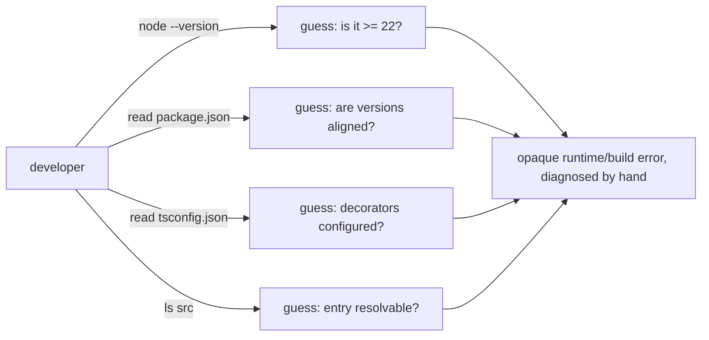
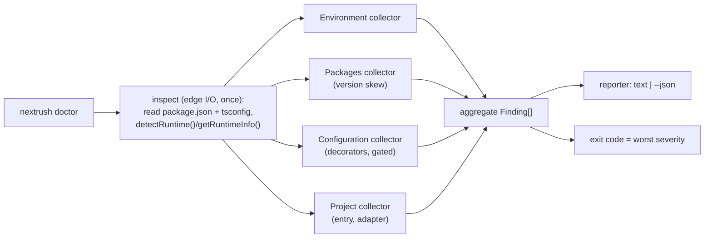

# RFC-023: `@nextrush/dev` — `nextrush doctor` project health diagnostics

| Field                | Value                                                                 |
| -------------------- | --------------------------------------------------------------------- |
| **Status**           | `Draft` |
| **RFC number**       | `023` |
| **Date**             | `2026-07-22` |
| **Author(s)**        | Developer Tooling |
| **Group**            | `dev-tooling` |
| **Packages touched** | `@nextrush/dev` (new `doctor` command); reads — never imports — `nextrush`, `@nextrush/class`, adapters, and the project's `package.json`/`tsconfig.json` |
| **Framework impact** | `Additive, non-breaking` — a new CLI subcommand; no existing command, programmatic API, or runtime path changes |
| **Supersedes**       | `—` |
| **Superseded by**    | `—` |
| **Related**          | `RFC-019` (dev-tooling capability), `ADR-0013` (CLI launcher discoverability), `ADR-0008`, `fed.md` |

---

## Progress Tracker

**Overall:** `[░░░░░░░░░░░░░░░░░░░░]` 0% — 0 / 4 phases complete · Doc status: `Draft`

| Phase | Part / deliverable                                            | Status         |
| ----- | ------------------------------------------------------------- | -------------- |
| P0    | `Check`/`Finding` model + pure collector contract + reporter core | ⬜ Not started  |
| P1    | Collectors: environment, packages/version-skew, configuration, project | ⬜ Not started  |
| P2    | `doctor` CLI command wired into `cli.ts` (text + `--json`, exit codes) | ⬜ Not started  |
| P3    | Docs, cross-adapter runtime checks, coverage + gates          | ⬜ Not started  |

---

## 0. Revision History

- **v1 (`2026-07-22`)** — Initial draft. Promotes the `nextrush doctor` idea deferred as a Non-Goal
  by the `dev-cli-discoverability` change (ADR-0013) and raised in `fed.md`'s "one thing I would
  add" into a full design.

---

## 1. Summary (TL;DR)

When a NextRush project misbehaves before a request is ever served — wrong Node version, a
`@nextrush/dev` older than `nextrush`, missing decorator settings in `tsconfig.json`, no adapter
for the target runtime — a developer today diagnoses it by hand across several files. This RFC adds
`nextrush doctor`: a **read-only** diagnostic command in `@nextrush/dev` that inspects the project's
environment, installed NextRush packages, configuration, and entry points, and prints an actionable,
grouped health report (with a `--json` mode for CI), exiting non-zero when it finds a real problem.
It **composes existing detectors** rather than adding new ones and makes no network calls, so it is
deterministic and offline. The cost is one new command surface to maintain; the payoff is that the
most common "why won't my project start" questions answer themselves.

---

## 1a. Terminology

`Check`
: A single, named, read-only inspection (e.g. "Node version meets the `>=22` engine floor") that
  yields zero or more Findings.

`Finding`
: The result of a Check that isn't a clean pass — carries a severity (`error` | `warn` | `info`),
  a human message, and an actionable `fix` string. A Check with no Findings is a pass.

`Collector`
: A pure function grouping related Checks over an inspected project (Environment, Packages,
  Configuration, Project) and returning `Finding[]`. Collectors do I/O only through injected
  readers, never directly, so they are unit-testable without a real filesystem.

`version skew`
: The situation where installed `@nextrush/*` packages are on incompatible versions relative to the
  `nextrush` meta-package a project depends on (e.g. `@nextrush/dev` older than `nextrush`).

---

## 2. Decision Summary

- **Status:** `Draft`
- **Decision:**
  - _Introduce_ a `nextrush doctor` subcommand in `@nextrush/dev` that runs read-only Checks and
    reports actionable Findings, with human and `--json` output and a non-zero exit on any `error`.
  - _Reuse_ the existing `runtime/detect.ts` helpers and (optionally, if installed) `@nextrush/class`
    diagnostics as Collectors — add no duplicate detection logic.
  - _Keep_ every other command, the runtime, and the launcher (ADR-0013) unchanged; `doctor` is
    purely additive.
- **Breaking:** `No`
- **Migration required:** `None` — a new command; existing invocations are untouched.
- **Blast radius:** `low` — one new, read-only command in one package; nothing on the request path.

---

## 2a. Decision Drivers

Priority (highest → lowest):

1. **Developer experience** — the command exists to turn opaque setup failures into a fix list.
2. **Zero surprise / safety** — read-only, no file writes, no network, no code execution of the
   user's app.
3. **Runtime independence** — must produce correct diagnostics under Node, Bun, and Deno.
4. **Composition over duplication** — reuse existing detectors; do not reimplement version/runtime
   detection.
5. **Maintainability** — a small, testable Check/Collector model, not a monolith.

---

## 3. Problem & Motivation

### 3.1 Current state (what exists today)

There is no single command that answers "is my NextRush project set up correctly?". A developer
diagnoses setup problems manually, across disconnected sources:

```bash
# "nextrush dev" fails or behaves oddly — today the developer checks, by hand:
node --version                      # is it >= 22?  (engines floor)
cat package.json | grep nextrush    # which @nextrush/* versions? are they aligned?
cat tsconfig.json                   # experimentalDecorators / emitDecoratorMetadata set? (class users)
ls src/                             # is there a resolvable entry file?
```

The launcher from ADR-0013 already handles exactly one setup problem — `@nextrush/dev` not being
installed — by printing an actionable message. That is effectively a zero-dependency *micro*-doctor
for a single check. Nothing generalizes it to the other common setup failures.

### 3.2 The problems (enumerated)

1. **No aggregated setup diagnosis** — the checks above are tribal knowledge, rediscovered per
   developer; nothing collects them or explains the fix.
2. **Version skew is invisible until it breaks** — a `@nextrush/dev` older than the `nextrush` in
   use (or mismatched `@nextrush/*` packages) surfaces as a confusing runtime/build error, not a
   clear "these versions are incompatible, align them" message. This is the exact concern
   `docs/RFC/framework-composition/020-...` §18 and the `dev-cli-discoverability` design left open.
3. **Decorator misconfiguration is a silent class-user trap** — a class-based app with
   `emitDecoratorMetadata` unset compiles but fails at runtime with an opaque DI error; nothing
   points at `tsconfig.json`.
4. **Runtime-floor mismatches are opaque** — running under Node < 22 (below the framework's
   `engines` floor) produces assorted downstream errors rather than one clear message.

### 3.3 Why now

The launcher (ADR-0013) established the *pattern* — explain-on-use, actionable messages, package-
manager-aware — and `fed.md` explicitly named `nextrush doctor` as the natural next step ("one thing
I would add"). The building blocks already exist (`runtime/detect.ts`, `@nextrush/class`
diagnostics), so the marginal cost is assembling them behind a command, not building detection from
scratch. Doing it now, while `@nextrush/dev` is pre-1.0 and unpublished, avoids adding a command to
an already-shipped surface later.

---

## 4. Goals & Non-Goals

### 4.1 Goals

- `nextrush doctor` reports the project's runtime, installed `@nextrush/*` versions, decorator/
  tsconfig configuration, and entry/adapter presence, with an actionable fix per Finding (maps to
  3.2.1).
- It detects and explains version skew across `@nextrush/*` packages (maps to 3.2.2).
- It flags missing `experimentalDecorators`/`emitDecoratorMetadata` **only when** the project uses
  the class API (maps to 3.2.3).
- It flags a runtime below the `>=22` engine floor (maps to 3.2.4).
- It exits non-zero when any `error`-severity Finding exists, so CI can gate on it; `--json` emits a
  machine-readable report.
- It runs read-only, offline, and deterministically under Node, Bun, and Deno.

### 4.2 Non-Goals

- **No auto-fix / no file mutation** — `doctor` diagnoses; it never rewrites `package.json`/
  `tsconfig.json`. An eventual `--fix` is deferred to §17 (a mutating command needs its own safety
  design).
- **No network calls / no "is there a newer version" check** — v1 is offline and deterministic; a
  registry-backed "update available" check is deferred (§17) to avoid nondeterminism and a network
  dependency in a diagnostic.
- **Not a linter or security scanner** — it checks NextRush setup coherence, not application code
  quality or vulnerabilities (those are separate tools/concerns).
- **Not a runtime/core API** — `doctor` is a dev-time CLI concern living in `@nextrush/dev`; no
  diagnostic code enters `@nextrush/core` or the request path.

---

## 5. Impact

- **Affected packages:** `@nextrush/dev` (new command + collectors + reporter). Reads, but does not
  import as a runtime dependency, the project's own `nextrush`/`@nextrush/*`/config files.
- **Affected audiences:** Application developers (new diagnostic command); contributors (new command
  surface to maintain).
- **Explicitly NOT affected:** the `nextrush` runtime and its request path; the launcher (ADR-0013);
  `@nextrush/core`/`router`/adapters' code; existing `dev`/`build`/`generate`/`codemod` commands;
  install-time behavior (RFC-020's no-install-script rule is preserved — `doctor` runs only on
  explicit invocation).

---

## 6. Proposed Solution (overview)

| # | Problem (from §3.2)                     | Solution (this RFC)                                                        |
| - | ---------------------------------------- | -------------------------------------------------------------------------- |
| 1 | No aggregated setup diagnosis            | A `doctor` command that runs a fixed set of Collectors and prints a grouped, actionable report |
| 2 | Version skew is invisible                | A Packages collector that reads installed `@nextrush/*` versions and flags incompatible combinations |
| 3 | Silent decorator misconfiguration        | A Configuration collector that checks `tsconfig.json` decorator flags, gated on class-API usage |
| 4 | Opaque runtime-floor mismatch            | An Environment collector that compares the detected runtime version to the `>=22` engine floor |

The key idea: `doctor` is a **thin orchestrator over pure Collectors**. Each Collector is a pure
function `(project: InspectedProject) => Finding[]` given already-read inputs (package manifests,
tsconfig, detected runtime) — so the detection I/O happens once, at the edge, and every Check is
unit-testable with plain fixtures. The reporter turns the aggregated `Finding[]` into either a
grouped human report or JSON, and the process exit code is a pure function of the worst severity
present. Detection itself is not new code: it delegates to `runtime/detect.ts` and, when the project
has `@nextrush/class` installed, its existing diagnostics.

---

## 6a. Trade-offs

### Benefits

- One command replaces a scattered manual checklist; every Finding carries its own fix.
- Version skew and decorator traps — today's most confusing silent failures — become explicit.
- Pure Collector model makes each Check cheap to test and cheap to add.
- CI-usable (`--json` + exit code) so teams can gate setup coherence.

### Costs

- A new command surface in `@nextrush/dev` that must be kept in sync as the package set / engine
  floor / config expectations evolve (an out-of-date Check is worse than no Check — mitigated by
  §11 and by driving expectations from real sources, not hardcoded copies).
- Version-skew logic needs a defined compatibility policy to check against (see §18) — some upfront
  design cost.

---

## 7. Architecture

### 7.1 Before



### 7.2 After



### 7.3 Why this architecture

Edge-I/O-once + pure Collectors mirrors the same "compute shared state once, pass immutable context
downstream" discipline the framework uses elsewhere, and keeps Collectors free of filesystem/runtime
coupling so they run identically on Node/Bun/Deno and are trivially unit-tested. Placement in
`@nextrush/dev` (not core) respects the package hierarchy in
`.kiro/steering/architecture.instructions.md`: diagnostics are a dev-tooling concern and must never
enter the runtime packages.

---

## 7a. Architecture Invariants

- **Core/runtime packages import no diagnostic code** — `doctor` lives entirely in `@nextrush/dev`;
  preserved.
- **No runtime-identity branching for capability decisions** (AGENTS.md §7) — runtime *reporting*
  (naming Node/Bun/Deno) is a diagnostic output, not a capability decision; detection reuses the
  `runtime/detect.ts` helpers, which are the sanctioned detection seam.
- **No install-time execution** (RFC-020) — `doctor` runs only on explicit invocation; preserved.
- **Reads `nextrush`/`@nextrush/class` but does not hard-depend on them** — they are the project's
  packages, inspected via the filesystem/optional resolution, never added as runtime deps of
  `@nextrush/dev`; preserved.

---

## 8. Detailed Design

### 8.1 Public API / surface

```bash
nextrush doctor            # human-readable grouped report; exits non-zero on any error
nextrush doctor --json     # machine-readable report for CI
nextrush doctor --help     # usage
```

```ts
// @nextrush/dev — new, internal to the package (not a runtime export)
export type Severity = 'error' | 'warn' | 'info';

export interface Finding {
  readonly check: string;        // stable id, e.g. 'env.node-version'
  readonly severity: Severity;
  readonly message: string;      // what is wrong
  readonly fix: string;          // how to fix it (actionable — AGENTS.md §12)
}

/** Everything the Collectors need, read once at the edge. */
export interface InspectedProject {
  readonly cwd: string;
  readonly runtime: RuntimeInfo;                 // from runtime/detect.ts (reused)
  readonly rootPackageJson: PackageManifest | null;
  readonly tsconfig: TsconfigView | null;
  readonly installedNextrushVersions: ReadonlyMap<string, string>; // '@nextrush/*' -> version
  readonly usesClassApi: boolean;                // gates decorator checks
}

export type Collector = (project: InspectedProject) => readonly Finding[];

/** Orchestrator: inspect → run collectors → aggregate. Pure given an injected inspector. */
export function runDoctor(
  inspect: () => Promise<InspectedProject>,
  collectors?: readonly Collector[],
): Promise<{ findings: readonly Finding[]; exitCode: number }>;
```

### 8.2 Internal components

- **`inspect()`** — the only I/O boundary: reads `package.json`/`tsconfig.json`, calls
  `getRuntimeInfo()`, resolves installed `@nextrush/*` versions, derives `usesClassApi`. Injected
  into `runDoctor` so tests pass a fixture instead of touching disk.
- **Collectors** (`environment`, `packages`, `configuration`, `project`) — pure `Finding[]`
  producers, one responsibility each, each in its own file (per the 300-line ceiling).
- **`reporter`** — formats `Finding[]` as grouped text or JSON; owns no logic beyond presentation.
- **`severityToExitCode`** — pure: `error` present → non-zero, else zero.
- **CLI glue in `cli.ts`** — routes `doctor` to `runDoctor(realInspect)` and prints via `reporter`,
  matching the existing `dev`/`build`/`generate` command shape.

### 8.3 Request / execution flow

```text
nextrush doctor
  → inspect() reads manifests + tsconfig + detectRuntime()   (edge I/O, once)
  → for each Collector: collector(project) → Finding[]
  → aggregate all Finding[]
  → reporter prints (text | --json)
  → exit(worstSeverity === 'error' ? 1 : 0)
```

### 8.4 Data structures

`Finding` is intentionally flat (`check`/`severity`/`message`/`fix`) so the `--json` shape is stable
and CI-parseable, and so grouping in the text reporter is a simple partition by the `check` id's
namespace prefix (`env.*`, `packages.*`, `config.*`, `project.*`). `InspectedProject` is a
read-once immutable snapshot — Collectors receive it by value and never re-read the filesystem,
guaranteeing every Check sees a consistent view.

### 8.5 Error handling

`doctor` distinguishes *findings* from *failures*. A project problem is a `Finding`, not a thrown
error. A genuine failure of `doctor` itself (e.g. an unreadable `tsconfig.json` that is malformed
JSON) is reported as an `error`-severity Finding with a fix ("`tsconfig.json` is not valid JSON:
<parser message>") rather than a stack trace — no internal paths/stack traces leak (project-rules
§3–§4). `doctor` never throws for a merely-unhealthy project; it exits non-zero via the severity
rule instead.

### 8.6 Edge cases

| Scenario                                             | Behaviour                                                                 |
| ---------------------------------------------------- | --------------------------------------------------------------------------- |
| No `package.json` in `cwd`                           | `error` Finding "not a Node project / run from the project root", fix given |
| `@nextrush/class` not installed (functional app)     | Decorator/tsconfig Checks are skipped (gated on `usesClassApi`), not failed |
| `tsconfig.json` absent                               | `info` for functional apps; `warn` for class apps with a fix to add it      |
| Malformed `tsconfig.json`/`package.json`             | `error` Finding naming the file + parser message; no stack trace            |
| Running under Bun/Deno                               | Runtime reported correctly via `detectRuntime()`; version-floor Check applies per runtime |
| All checks pass                                      | Clean report, exit 0                                                        |
| Only `warn`/`info` findings                          | Report shown, exit 0 (warnings do not fail CI)                              |

### 8.7 Examples

```text
$ nextrush doctor

NextRush Doctor

Environment
  ✓ Runtime: Node.js v22.4.0 (meets >=22 engine floor)

Packages
  ✗ Version skew: @nextrush/dev@1.0.0 is older than nextrush@3.1.0
    → Align them: pnpm add -D @nextrush/dev@latest

Configuration
  ⚠ tsconfig.json: "emitDecoratorMetadata" is not set, but this project uses @Controller/@Service
    → Set "emitDecoratorMetadata": true and "experimentalDecorators": true in tsconfig.json

Project
  ✓ Entry file: src/index.ts
  ✓ Adapter: @nextrush/adapter-node present for the Node runtime

1 error, 1 warning — see fixes above.
$ echo $?
1
```

```bash
# CI usage
nextrush doctor --json | jq '.findings[] | select(.severity=="error")'
```

---

## 9. Alternatives Considered

### 9.1 Fold the checks into existing commands (e.g. run them at `nextrush dev` startup)
Auto-run diagnostics implicitly before `dev`/`build`. **Rejected:** implicit checks slow the common
path, blur "the diagnostic" from "the action", and can't be run on demand or in CI as a standalone
gate. An explicit `doctor` is discoverable and composable; `dev`/`build` can still surface a
one-line "run `nextrush doctor`" hint on a hard startup failure without embedding the whole suite.

### 9.2 A separate `@nextrush/doctor` package
**Rejected:** it is squarely the `@nextrush/dev` toolchain's concern (RFC-019's capability), reuses
that package's runtime detection, and a separate package fragments the CLI surface and the install
story for no benefit.

### 9.3 Do nothing
**Rejected:** the status quo leaves the four §3.2 problems as tribal knowledge; the launcher already
proved the value of turning one setup failure into an actionable message, and the building blocks for
the rest already exist.

---

## 10. Rejected Ideas

- **Network "newer version available" check in v1** — Rejected: introduces nondeterminism and a
  network dependency into a diagnostic; deferred to §17 as an opt-in flag.
- **`--fix` auto-remediation in v1** — Rejected: mutating `package.json`/`tsconfig.json` needs its
  own safety/blast-radius design; diagnose first, fix later (§17).
- **Hardcoding the expected `@nextrush/*` version set** — Rejected: it would rot immediately; the
  Packages collector derives expectations from the installed `nextrush` version + a compatibility
  policy (§18), not a baked-in list.
- **Throwing on an unhealthy project** — Rejected: unhealthy ≠ crashed; a `Finding` + exit code is
  the correct contract, reserving thrown errors for `doctor`'s own internal failures.

---

## 11. Risks & Mitigations

| Risk                                                                 | Mitigation                                                                                     | Likelihood | Impact |
| ---------------------------------------------------------------------- | ------------------------------------------------------------------------------------------------ | ---------- | ------ |
| A Check goes stale (e.g. engine floor bumps to 24) and misreports      | Drive expectations from real sources (the package's own `engines`, the installed manifest), not hardcoded copies; unit tests per Check | Medium     | Medium |
| Version-skew policy has false positives, eroding trust in `doctor`     | Start conservative — flag only clearly-incompatible combinations; `warn` (not `error`) for uncertain skew; document the policy (§18) | Medium     | Medium |
| Diagnostics behave differently across Node/Bun/Deno                    | Detection goes through `runtime/detect.ts`; a cross-runtime test asserts identical Findings for identical fixtures | Low        | Medium |
| Reading a huge/hostile `tsconfig`/`package.json`                       | Bounded read + JSON parse with a caught error → `error` Finding, never a crash or unbounded work | Low        | Low    |

---

## 12. Backward Compatibility & Migration

- **Compatibility:** Additive & non-breaking — a new subcommand. No existing command, flag, exit
  code, or programmatic API changes.
- **Migration path (if breaking):** _Not applicable — nothing to migrate._
- **Deprecation window:** _Not applicable — no deprecation._

---

## 13. Cross-Cutting Concerns

- **Security:** Read-only — no writes, no network, no execution of the user's application code.
  Parser errors are reported as Findings without leaking stack traces/internal paths (project-rules
  §3–§4). It reads `package.json`/`tsconfig.json` only within the project `cwd`.
- **Performance:** Not on any request hot path. Target: completes well under a second on a normal
  project with a bounded number of file reads and zero network I/O (see §14).
- **Runtime independence:** Detection routes through `runtime/detect.ts`; Collectors are pure and
  runtime-agnostic; a cross-runtime test asserts identical output for identical fixtures (AGENTS.md
  §7).
- **Observability:** Its entire purpose is observability of project setup; output is the report. It
  logs nothing sensitive (versions and config flags only, never file contents wholesale).
- **Zero-dependency rule:** No new runtime dependency — `doctor` uses only Node built-ins already
  available to `@nextrush/dev` and that package's existing detection helpers (project-rules §6).

---

## 14. Success Metrics

| Metric                          | Baseline (today) | Target / threshold                                  |
| ------------------------------- | ---------------- | --------------------------------------------------- |
| Setup problems with a one-command diagnosis | 0 (manual)       | The four §3.2 problem classes all covered           |
| `doctor` run time (normal project) | —                | < 500ms, zero network calls                         |
| Cross-runtime output parity      | —                | Identical Findings for identical fixtures on Node/Bun/Deno |
| False-positive version-skew reports | —                | 0 on the aligned scaffolds `create-nextrush` produces |
| Test coverage                    | —                | 90%+ lines/functions on the new code (CI-enforced)  |

---

## 15. Phased Implementation Plan

| Phase | Goal (what ships)                                            | Depends on | Exit condition (checkable)                                             | Status         |
| ----- | ------------------------------------------------------------- | ---------- | ------------------------------------------------------------------------ | -------------- |
| **P0** | `Finding`/`Severity`/`InspectedProject`/`Collector` types, `runDoctor` orchestrator, reporter + `severityToExitCode` | RFC-019 | Unit tests: `runDoctor` over fixture Collectors aggregates + computes exit code; reporter renders text + JSON |  ⬜ Not started  |
| **P1** | The four Collectors (environment, packages/skew, configuration, project) as pure functions | P0 | Unit tests per Collector over fixtures cover each §8.6 edge case         | ⬜ Not started  |
| **P2** | Real `inspect()` + `doctor` wired into `cli.ts` with `--json`/`--help` and exit codes | P1 | E2E: `nextrush doctor` on a healthy fixture exits 0; on a skewed/misconfigured fixture exits 1 with the expected Findings |  ⬜ Not started  |
| **P3** | Docs (dev README + docs site), cross-runtime parity test, coverage + gates | P2 | Docs updated; cross-runtime suite identical; 90%+ coverage; `openspec validate --strict` green |  ⬜ Not started  |

### 15.1 Testing strategy

- **Unit:** each Collector over plain `InspectedProject` fixtures (no disk); `runDoctor` orchestration
  with injected Collectors; reporter text/JSON snapshots; `severityToExitCode`.
- **Integration:** real `inspect()` against generated fixture projects (healthy, version-skewed,
  decorator-missing, wrong-runtime).
- **Cross-adapter/runtime:** identical Findings for identical fixtures under Node/Bun/Deno.
- **Coverage:** 90%+ lines/functions (CI-enforced, project-rules §7).

---

## 16. Rollback Plan

- **Trigger:** `doctor` produces false-positive `error` Findings that fail real CI, or diverges
  across runtimes.
- **Steps:**
  - The command is additive and isolated — revert the `doctor` command registration in `cli.ts` and
    the `doctor/` module; all other commands are untouched.
  - No persisted state, migration, cache, or published tag to clean up (read-only command).
  - Optionally down-grade an over-eager Check from `error` to `warn` instead of a full revert.

---

## 17. Future Work

- **`nextrush doctor --fix`** — opt-in auto-remediation for the mechanical fixes (add tsconfig flags,
  align versions), with its own blast-radius/safety design — a follow-up RFC.
- **Registry-backed "update available" check** — an opt-in, network-gated flag reporting newer
  `@nextrush/*` versions; deliberately out of the offline v1.
- **`dev`/`build` hard-failure hint** — on an unrecoverable startup error, surface a one-line "run
  `nextrush doctor`" pointer (does not embed the suite; see §9.1).
- **IDE integration** — surfacing Findings in an editor (fed.md Option 5), well beyond this RFC.

---

## 18. Open Questions

- [ ] **What is the exact `@nextrush/*` compatibility policy the Packages collector checks against?**
  Options: (a) same major as the installed `nextrush`; (b) a published compatibility matrix; (c)
  `@nextrush/dev` must be `>=` the `nextrush` minor. Leaning (a)+(c) for v1 (conservative, no
  external matrix to maintain) — to be settled before P1.
- [ ] **How is `usesClassApi` detected reliably?** Candidate signals: `@nextrush/class` present in
  `dependencies`, or an import of `nextrush/class` in the entry graph. Static manifest presence is
  the cheap, deterministic default; deeper detection deferred unless it proves insufficient.
- [ ] **Should `doctor` also validate the adapter matches the scaffolded target runtime** (e.g.
  `@nextrush/adapter-bun` present when the project targets Bun)? Likely yes as a `warn`; confirm the
  signal for "target runtime" (scripts vs. an explicit field).

---

## 19. Decisions Log

| Question                                            | Decision                                             | Rationale                                                                  |
| ----------------------------------------------------- | ------------------------------------------------------ | ---------------------------------------------------------------------------- |
| Where does `doctor` live?                             | In `@nextrush/dev`                                     | It is the dev-tooling capability's concern (RFC-019) and reuses its detectors |
| Diagnose only, or auto-fix?                           | Diagnose only in v1                                    | Mutation needs its own safety design; `--fix` deferred to §17               |
| Network version check in v1?                          | No — offline & deterministic                           | A diagnostic must be reproducible and dependency-free; opt-in network deferred |
| Unhealthy project → throw or Finding?                 | `Finding` + non-zero exit                              | Unhealthy ≠ crashed; reserve throws for `doctor`'s own internal failures    |
| Collectors: pure or do their own I/O?                 | Pure, given an injected `InspectedProject`             | Testable without disk; consistent snapshot; cross-runtime determinism        |

---

## 20. References

- `docs/RFC/dev-tooling/019-dev-tooling-capability.md` — the dev-tooling capability this extends.
- `docs/adr/ADR-0013-nextrush-cli-launcher-discoverability.md` — the launcher whose micro-message
  pattern `doctor` generalizes.
- `docs/RFC/framework-composition/020-framework-composition-integrity.md` §18 — the version-skew
  open question `doctor` is the home for.
- `fed.md` — external review; "one thing I would add" proposed `nextrush doctor`.
- `packages/dev/src/runtime/detect.ts` — `getRuntimeInfo`/`detectRuntime` and version helpers reused
  as detection seams.
- `packages/class/src/diagnostics/collector.ts` — existing class diagnostics (`detectCircularDependencies`)
  optionally composed when the project uses the class API.
