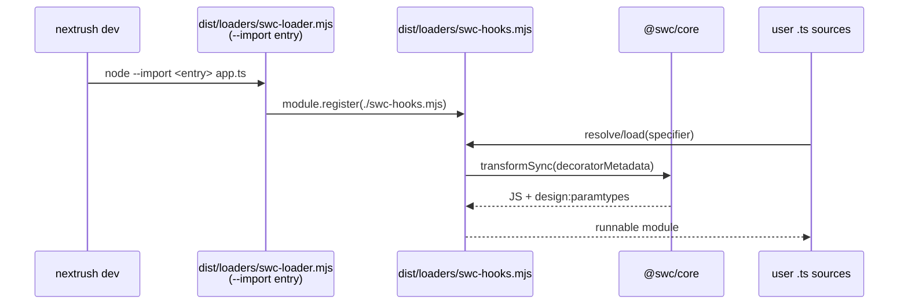

# RFC-038: `@nextrush/dev` — dev runtime loader owned in-repo on `@swc/core`

| Field                | Value                                                                 |
| -------------------- | --------------------------------------------------------------------- |
| **Status**           | `Shipped`                                                             |
| **RFC number**       | `038`                                                                 |
| **Date**             | `2026-09-28`                                                          |
| **Author(s)**        | `software-engineer agent (finish-ts7-toolchain-migration)`            |
| **Group**            | `dev-tooling`                                                         |
| **Packages touched** | `@nextrush/dev`, `create-nextrush` (comment only), `examples/dev-cli-fixture` (dotenv), `examples/dev-di-fixture` (new) |
| **Framework impact** | `Internal-only` — no public API change; CLI surface, generated projects, and all runtime packages unaffected |
| **Supersedes**       | `—`                                                                   |
| **Superseded by**    | `—`                                                                   |
| **Related**          | `RFC-019` (dev-tooling capability), `RFC-037` (TypeScript 7 + Oxlint migration), `ADR-0027` (linter/compiler lockstep) |

> Note on process: this RFC is a retrospective promotion. The `finish-ts7-toolchain-migration`
> change proceeded without a pre-implementation RFC under explicit authorization; the durable
> decision is recorded here before archive, per repo governance (AGENTS.md §21). The design
> below describes what shipped, including one refinement made at build time (D5).

---

## Progress Tracker

**Overall:** `[████████████████████]` 100% — 4 / 4 phases complete · Doc status: `Shipped`

| Phase | Part / deliverable                     | Status         |
| ----- | -------------------------------------- | -------------- |
| P0    | Hooks module (`swc-hooks.mjs`) + unit tests | ✅ done   |
| P1    | Entry rewiring + DI integration proof  | ✅ done        |
| P2    | Legacy removal (dep, override, guard)  | ✅ done        |
| P3    | Docs/comments + full-suite verification | ✅ done       |

---

## 0. Revision History

- **v1 (`2026-09-28`)** — Initial (retrospective) draft, written from the shipped implementation.

---

## 1. Summary (TL;DR)

`nextrush dev` transpiles TypeScript via an in-repo Node hooks module (`packages/dev/src/loaders/swc-hooks.mjs`, copied verbatim to `dist/loaders/`) built on the already-pinned `@swc/core@1.15.47`. It emits `design:paramtypes` decorator metadata so constructor-injection DI resolves, and imports no TypeScript compiler JavaScript API — so it works unchanged on any installed TypeScript major, including TypeScript 7, whose main entry removed that API. This deletes `@swc-node/register`, the `@swc-node/register>typescript` override, and the lockfile self-heal guard.

---

## 1a. Terminology

- **Hooks module**: a Node module exporting `resolve`/`load` customization hooks, installed via `module.register()`.
- **Loader entry**: `dist/loaders/swc-loader.mjs`, the `--import` target `dev` spawns; it registers the hooks module.
- **`design:paramtypes`**: decorator metadata SWC emits with `legacyDecorator` + `decoratorMetadata`; the DI container's sole source of constructor parameter types.

---

## 2. Decision Summary

- Own the dev-time TypeScript transform in-repo on `@swc/core`; remove `@swc-node/register`.
- Keep `module.register()` (not `registerHooks()`) and the `dist/loaders/swc-loader.mjs` entry path.
- Mirror (not import) the shared SWC-options seam's parser/decorator constants in the hooks module; guard drift with `design:paramtypes` unit assertions.
- Map `.cts` to CommonJS, everything else to ESM; retry `.js`/`.mjs`/`.cjs` relative specifiers against `.ts` counterparts.

## 2a. Decision Drivers

- TypeScript 7 removed the compiler JS API from its main entry; the old loader's peer range (`>= 4.3 < 7`) plus ~21 root TS API imports made it unloadable without a TS 6 override pin.
- The override + self-heal script was fragile (pnpm re-resolution silently un-keys manual lockfile surgery) and blocked one-compiler migration.
- `@swc/core` was already pinned and proven for decorator metadata on the build path.
- Oxc/`oxc-node` has known `emitDecoratorMetadata` divergences; esbuild/`tsx` cannot emit decorator metadata at all; waiting on TS 7.1's stabilized API blocks on an external timeline.

---

## 3. Problem & Motivation

`@swc-node/register@1.12.1` could only load under a workspace override pinning its TypeScript to 6.0.3 plus a postinstall guard re-keying the lockfile after every install. Every `pnpm update` risked silently restoring the broken state; every TypeScript major bump re-opened the question. The dev loader is the only component that ever needed the compiler's *JavaScript* API at runtime — removing that need removes the entire failure class.

---

## 4. Goals & Non-Goals

**Goals:**

- `nextrush dev` serves decorated, constructor-injected apps identically on TypeScript 6 and 7.
- One compiler and one dependency less: no TS override, no guard script, no second transpiler dependency.
- Loader-path resolution stays deterministic across install layouts (same entry path, same `--import` wiring).

**Non-Goals:**

- No change to the framework's public API, request pipeline, adapters, or runtime contract.
- Not migrating `nextrush build`'s transform pipeline; only the dev-time loader.
- Not adopting `registerHooks()` (engine floor is `>=22.0.0`, it needs 22.15+).

---

## 5. Impact

- **Code**: `packages/dev/src/loaders/` (new `swc-hooks.mjs`, rewired `swc-loader.mjs`), `tsdown.config.ts` (copy both), `runtime/node-modules.ts` (src-context fallback), `runtime/spawn.ts` (comment), two test-docblock mechanism notes, one template comment, one fixture dep.
- **Dependencies removed**: `@swc-node/register`; override + guard script deleted.
- **Risk**: dev-mode DI correctness — proven by a live type-injected controller served over HTTP plus unit-level `design:paramtypes` assertions *before* the override was deleted.

---

## 6. Proposed Solution

`swc-loader.mjs` (unchanged path, still the `--import` entry) registers the sibling `swc-hooks.mjs` by absolute file URL. The hooks module:

- `resolve`: assigns `module`/`commonjs` format when Node reports `ERR_UNKNOWN_FILE_EXTENSION` for owned extensions; retries `.js`→`.ts`/`.tsx` (`.mjs`→`.mts`, `.cjs`→`.cts`, `.jsx`→`.tsx`) for verbatim-syntax relative imports.
- `load`: `transformSync` with `legacyDecorator` + `decoratorMetadata` + inline sourcemaps; passes `node_modules` and `.d.ts` through untouched.

Both files are plain `.mjs` (JSDoc-typed for the type-aware lint), runnable from `src/` and `dist/` alike.

## 6a. Trade-offs

- Mirrored constants instead of a shared import (runtime-loadability forces it) — drift guarded by tests, not by construction. Accepted: the alternative (bundled hooks) couples loader availability to the build and risks inlining the native binding.
- `module.register()` deprecation warning (DEP0205) prints on dev boot — accepted, recorded in D4; the replacement API is unavailable on the engine floor.

---

## 7. Architecture

## 7a. Architecture Invariants

- The loader never imports the TypeScript compiler package (any major).
- The entry path `dist/loaders/swc-loader.mjs` and `--import` wiring do not change.
- `design:paramtypes` is emitted for every owned TypeScript source, always.

---

## 8. Detailed Design

- Extensions owned: `.ts`, `.tsx`, `.mts`, `.cts` (minus `.d.*`); `node_modules` never transformed.
- SWC options per file: `syntax: typescript` (+`tsx` for `.tsx`), `target: es2022`, `legacyDecorator`, `decoratorMetadata`, `keepClassNames`, `module: commonjs` iff `.cts` else `es6`, `sourceMaps: inline`, no minify.
- Bare specifiers are never intercepted (Node's errors propagate unchanged).
- Failing compiler states (non-1 exit, signal, stderr-without-diagnostics) throw rather than report clean — same fail-loud policy as the docs compile-check rewrite in this migration.

---

## 9. Alternatives

- Keep `@swc-node/register` + TS 6 override: the fragile status quo this RFC removes.
- Oxc/`oxc-node`: `emitDecoratorMetadata` divergences (enums, aliases, `accessor`→`Object`) silently corrupt DI metadata.
- esbuild/`tsx`: cannot emit decorator metadata (upstream wontfix for DI use).
- Wait for TS 7.1 stabilized programmatic API: unbounded external timeline with the override accruing risk meanwhile.
- `registerHooks()`: needs Node 22.15+; engine floor is 22.0.0.

## 10. Rejected Ideas

- Bundling the hooks module through tsdown: couples dev-loader availability to a successful build and risks inlining the native `@swc/core` binding; the verbatim-copy pattern (same as its sibling entry) keeps it runnable everywhere.
- Per-file `tsc` spawning for dev: startup latency unacceptable for a watcher; SWC is the established transform.

## 11. Risks

- **SWC/native-binding load failure in exotic installs** → the loader fails fast at `--import` time with the native error; mitigation: `@swc/core` stays pinned, as before.
- **Option drift vs the build seam** → guarded by `design:paramtypes` + mapping unit tests (deliberate, see §6a).
- **`.js`→`.ts` retry cost on genuinely-missing files** → two extra failed resolutions per missing relative import; negligible against the alternative (generated projects not booting).

## 12. Backward Compatibility

Internal-only. CLI flags, generated projects, runtime packages, and the loader entry path are unchanged. `examples/dev-di-fixture` (new) and the `dotenv` fixture-dep addition are test-only.

## 13. Cross-Cutting Concerns

- _Not applicable — Node-only dev path; no adapter, runtime-contract, security-boundary, or telemetry surface._

## 14. Success Metrics

- `dev-loader-di-integration` (independence assertion + live type-injected HTTP proof) green on TS 7.
- `swc-hooks-loader` unit suite green (8 tests: metadata × 4 extensions, sourcemap, 2 passthroughs, extension mapping).
- `@nextrush/dev` suite 304/304; `create-nextrush` suite 403/403 (parity smoke included).
- Zero `swc-node` references in manifests/lockfile/code (excluding historical docs).

## 15. Phased Implementation

**Overall:** `[████████████████████]` 100% — 4 / 4 phases complete

| Phase | Part / deliverable                     | Status         |
| ----- | -------------------------------------- | -------------- |
| P0    | Hooks module + unit tests (RED→GREEN)  | ✅ done        |
| P1    | Entry rewiring + DI integration proof  | ✅ done        |
| P2    | Legacy removal (dep, override, guard)  | ✅ done        |
| P3    | Docs/comments + full-suite verification | ✅ done       |

## 16. Rollback Plan

Each step landed as its own commit group; revert restores `@swc-node/register`, the override, and the guard verbatim. The TS 6 pins are recoverable from git history (`pnpm-workspace.yaml`, `packages/dev/package.json`).

## 17. Future Work

- Adopt `module.registerHooks()` once the engine floor reaches Node 22.15+ (removes the DEP0205 notice).
- Prune `findFiles` generated-dir walks (`node_modules`, `.next`) speeding every website verify check (logged as a finding in the change evidence).

## 18. Open Questions

None — the `fumadocs-typescript` TS 7 question and the Oxlint parity question from the parent change were both resolved inside it by gating tasks.

## 19. Decisions Log

- **D1 (this RFC):** dev loader owned in-repo on `@swc/core`, independent of the TypeScript JS API.
- **D2:** keep `module.register()` + `dist/loaders/swc-loader.mjs` path (engine floor).
- **D3:** mirror (not import) the shared SWC-options seam; tests guard drift.
- **D4:** `.cts`→CommonJS, rest ESM; `.js`-style specifiers retry TS counterparts.

## 20. References

- `openspec/changes/finish-ts7-toolchain-migration/` (proposal, `specs/dev-tooling/spec.md`, `design.md`, `tasks.md`, `evidence.md`)
- Upstream: swc-project/swc-node#1049 (unresolved; the reason waiting was rejected)
- `packages/dev/src/loaders/swc-hooks.mjs`, `swc-loader.mjs`; `src/__tests__/swc-hooks-loader.test.ts`, `dev-loader-di-integration.test.ts`
