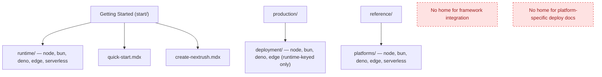
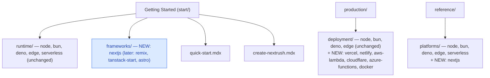

# RFC-025: Docs-site information architecture — split runtime, framework-integration, and deployment-platform axes

| Field                | Value                                                                 |
| -------------------- | --------------------------------------------------------------------- |
| **Status**           | `Shipped`                                                             |
| **RFC number**       | `025`                                                                 |
| **Date**             | `2026-07-25`                                                          |
| **Author(s)**        | Tanzim Hossain                                                        |
| **Group**            | `documentation`                                                       |
| **Packages touched** | `none` — this RFC affects only `apps/website/content/docs/**` (docs-site content structure), no `@nextrush/*` package |
| **Framework impact** | `Internal-only` — no runtime code, no public API, no package changes |
| **Supersedes**       | `—`                                                                   |
| **Superseded by**    | `—`                                                                   |
| **Related**          | `RFC-024` (`@nextrush/adapter-nextjs` — the framework-integration example that surfaced this gap), `.kiro/steering/documentation.instructions.md` (docs-site config this RFC's decisions become steering facts for) |

---

## Progress Tracker

**Overall:** `[████████████████████]` 100% — 4 / 4 phases complete · Doc status: `Shipped`

| Phase | Part / deliverable                                                          | Status        |
| ----- | ---------------------------------------------------------------------------- | -------------- |
| P0    | `start/frameworks/` section — Next.js page, wired into `start/meta.json`      | ✅ Done |
| P1    | `reference/platforms/nextjs.mdx` — API-lookup depth entry                     | ✅ Done |
| P2    | `production/deployment/` re-keyed by platform (Vercel, Netlify, AWS Lambda, Cloudflare, Azure Functions, Docker) alongside existing runtime-keyed pages | ✅ Done — `aws-lambda.mdx`, `gcf.mdx`, and `azure-functions.mdx` shipped, each verified against its real deploy-verification fixture (`lambda-app`/`gcf-app`/`azure-app`; Azure honestly flagged as locally-verified-only, not yet CI-executed against a real subscription). Vercel/Netlify/Cloudflare stay unwritten by design — already fully covered by the existing runtime-keyed `edge.mdx` (§8.6's anti-duplication rule). |
| P3    | Cross-linking pass — decision guide, compatibility matrix, and each runtime page point at the right platform pages | ✅ Done — `aws-lambda.mdx` links back to the serverless runtime tutorial and forward to the compatibility matrix (§8.4); `deployment/index.mdx` gained a "Pick a platform" section; `serverless.mdx`'s stale "no deployment guide" card fixed. |

---

## 0. Revision History

- **v3 (`2026-07-26`)** — Closed every remaining item from v2's Future Work list: shipped
  `production/deployment/gcf.mdx` and `azure-functions.mdx` (verified against the real
  `gcf-app`/`azure-app` deploy-verification fixtures; Azure honestly flagged as not yet
  CI-executed against a real subscription); promoted §8.3's placement rule into
  `documentation.instructions.md`'s content map; discovered `decision-guide.mdx`'s
  framework-integration Callout already existed (added before this RFC, not new work); shipped
  `concepts/(runtime-streaming)/event-mapping.mdx` with two `sequenceDiagram`s (request/response
  round-trip, mapper-selection logic) after review flagged the concept page as missing both a
  clear problem statement and any diagram. §17/§18 updated to reflect all of the above as done.
- **v2 (`2026-07-26`)** — P2 and P3 completed: `production/deployment/aws-lambda.mdx` shipped
  (verified against the real `lambda-app` deploy-verification fixture), `deployment/index.mdx`
  gained a "Pick a platform" section, and `serverless.mdx`'s stale "no deployment guide" card was
  corrected. Cross-linking pass done per §8.4. Status moved `Draft` → `Shipped`; all 4 phases
  complete. Also added a Future Work item (§17) for a `concepts/event-mapping.mdx` page — written
  the same session, not part of this RFC's own scope (§4.2), but named here as the dependency
  §8.6's platform-page rule needed to link out to instead of re-explaining event translation
  inline.
- **v1 (`2026-07-25`)** — Initial draft. Written after RFC-024 (`@nextrush/adapter-nextjs`) shipped
  and its docs placement was debated in review: putting a Next.js integration guide inside
  `start/runtime/` (alongside Node/Bun/Deno/Edge/Serverless) would have conflated two different
  questions a reader arrives with — "which JS engine runs my code" vs. "I already have an app in
  framework X, how do I mount NextRush inside it." That same review also surfaced that
  `production/deployment/` is currently keyed by **runtime** (`node.mdx`, `bun.mdx`, `deno.mdx`,
  `edge.mdx`), which will collide the same way the moment platform-specific guides (Vercel,
  Netlify, AWS Lambda) are written, because a platform and a runtime are not the same axis either.

---

## 1. Summary (TL;DR)

The docs site currently has one clean axis (`start/runtime/` — which JS runtime executes your
code) and is about to grow two more axes that must not be flattened into it or into each other:
**framework integration** (mounting NextRush inside another framework's request lifecycle, e.g.
Next.js, and later Remix/TanStack Start/Astro) and **deployment platform** (which vendor you ship
to — Vercel, Netlify, AWS Lambda, Cloudflare, Azure Functions, Docker — each with its own CLI,
config file, and event-adapter shape, independent of which runtime it happens to use under the
hood). This RFC proposes a new `start/frameworks/` section as a sibling to `start/runtime/`, and a
platform-keyed layer added alongside (not replacing) `production/deployment/`'s existing
runtime-keyed pages. The most important consequence: three distinct reader questions each get an
unambiguous home, instead of one Hono-style flat list that conflates all three (verified against
Hono's own `getting-started/` sidebar, which lists Cloudflare Workers, Next.js, Netlify, AWS
Lambda, and Node.js at the same flat depth — runtime, framework, and platform all mixed together).

---

## 1a. Terminology

`Runtime`
: The JS engine executing the code — Node.js, Bun, Deno, or a V8 isolate (edge/workerd). Answers
"what runs my code." Already correctly modeled by `start/runtime/` and
`@nextrush/adapter-{node,bun,deno,edge,serverless}`.

`Framework integration`
: Mounting a NextRush `Application` inside another framework's own request lifecycle, where that
framework — not NextRush — owns the process (`next dev`/`next build`, a Remix loader, etc.).
Answers "I already have an app in framework X, how do I add NextRush to it." Exactly what
`@nextrush/adapter-nextjs` (RFC-024) does for Next.js.

`Deployment platform` (or "host")
: The specific vendor/service the running app ships to — Vercel, Netlify, AWS Lambda, Cloudflare,
Azure Functions, a Docker container on a VPS. Answers "where do I ship this, which CLI, which
config file." Orthogonal to runtime: Vercel can run Node or Edge functions; Netlify can run Node
or Deno-based Edge Functions; a platform choice does not by itself decide the runtime.

---

## 2. Decision Summary

- **Status:** `Draft`
- **Decision:**
  - **Introduce** `start/frameworks/` — a new Getting Started section, sibling to `start/runtime/`,
    for framework-integration guides. First page: Next.js (already shipped as
    `@nextrush/adapter-nextjs`, RFC-024) — its content moves here rather than into
    `start/runtime/`.
  - **Introduce** a platform-keyed layer inside `production/deployment/`, added alongside its
    existing runtime-keyed pages (`node.mdx`, `bun.mdx`, `deno.mdx`, `edge.mdx`) — not replacing
    them. New pages: `vercel.mdx`, `netlify.mdx`, `aws-lambda.mdx`, `cloudflare.mdx`,
    `azure-functions.mdx`, `docker.mdx`.
  - **Keep** `start/runtime/` exactly as-is — no change to its five existing pages or its role as
    the runtime axis.
  - **Keep** `reference/platforms/` exactly as-is in structure (it already correctly documents
    adapter API surface per-runtime); it gains one new entry (`nextjs.mdx`) for the already-shipped
    `@nextrush/adapter-nextjs`.
- **Breaking:** `No`
- **Migration required:** `None` — this is new content plus a re-key of one existing folder's
  internal organization; no existing published URL is removed (see §12).
- **Blast radius:** `low` — pure documentation-site content and navigation; no `@nextrush/*`
  package, no public API, no runtime behavior is touched.

---

## 2a. Decision Drivers

Priority (highest → lowest):

1. **One question, one page.** A reader arrives with exactly one of three questions ("which
   runtime," "how do I integrate with framework X," "where do I deploy") — the IA must not force
   them to scan a flattened list to find which section actually answers their question.
2. **Don't conflate axes that are genuinely orthogonal.** Runtime, framework, and platform are
   independent choices in practice (e.g. Next.js on Node, deployed to Vercel — three separate
   decisions). Mixing them into one list (as Hono's sidebar does) is a structural defect to avoid,
   not a pattern to copy.
3. **Extensibility without restructuring later.** Today only Next.js and zero platforms exist;
   tomorrow's Remix/TanStack Start/Astro and Vercel/Netlify/AWS Lambda additions must slot into
   the same three homes without another IA rework.
4. **No content duplication.** A platform page documents platform-specific mechanics (CLI, config
   file, event shape); it does not re-explain the runtime or framework-integration concepts already
   owned by `start/runtime/` or `start/frameworks/` — it links to them.
5. **Preserve every existing URL.** `start/runtime/`'s five pages and `production/deployment/`'s
   four existing pages keep their current paths; this RFC only adds siblings.

---

## 3. Problem & Motivation

### 3.1 Current state (what exists today)

`start/meta.json` currently orders Getting Started as:

```json
{ "pages": ["index", "overview", "installation", "runtime", "quick-start", "create-nextrush"] }
```

`start/runtime/meta.json` lists exactly the runtime axis, correctly:

```json
{ "pages": ["decision-guide", "node", "bun", "deno", "edge", "serverless"] }
```

`production/deployment/meta.json` lists four pages — `node.mdx`, `bun.mdx`, `deno.mdx`,
`edge.mdx` — keyed by **runtime**, not by platform. `reference/platforms/meta.json` mirrors the
same five-runtime list (`index`, `node`, `bun`, `deno`, `edge`, `serverless`) for API-lookup depth.

Nowhere in this structure is there a home for "I have a Next.js app, how do I add NextRush," nor
for "I'm deploying to Vercel/Netlify/AWS Lambda specifically, what do I need to know about that
platform." Both questions were about to be answered by writing content into whichever folder
looked closest — which is exactly how Hono's own docs ended up with Next.js, Netlify, AWS Lambda,
Azure Functions, Google Cloud Run, and Node.js all listed at the same flat sidebar depth under one
"Getting Started" heading (verified directly against `https://hono.dev/docs/getting-started/`).

### 3.2 The problems (enumerated)

1. **Framework integration has no dedicated home.** `@nextrush/adapter-nextjs` (RFC-024, shipped)
   produced a README and an `ARCHITECTURE.md`, but its docs-site tutorial page was never written
   because there was no clear answer to "which folder" — `start/runtime/` was the closest fit but
   is the wrong fit, since Next.js is not a JS runtime.
2. **`production/deployment/` is runtime-keyed, and platform docs don't fit that key.** A future
   `vercel.mdx` would need to answer "which runtime" (it supports both Node and Edge functions) —
   forcing either an awkward duplicate page per runtime-per-platform, or silently wedging platform
   content into a runtime-keyed page where a reader searching "Vercel" wouldn't expect to find it
   under `deployment/edge.mdx` or `deployment/node.mdx`.
3. **No structural signal preventing a future flat-list conflation.** Without an explicit RFC
   pinning the three-axis split, the next contributor adding Vercel/Netlify/AWS Lambda docs has no
   documented reason not to just add them next to `start/runtime/`'s five pages, recreating Hono's
   flat-list conflation one page at a time.

### 3.3 Why now

RFC-024 shipped `@nextrush/adapter-nextjs` with a complete README/ARCHITECTURE.md but an
explicitly deferred docs-site page (its own P3 exit condition names `start/runtime/` + a
`reference/platforms/` entry, which — per this RFC's decision — was the wrong target folder for the
tutorial half). Writing that page without first deciding the IA would either misplace it (inside
`start/runtime/`, conflating axes) or block on an unscoped decision. Better to settle the structure
once, in a small design-only RFC, before any platform-specific content (Vercel/Netlify/AWS Lambda)
exists to misplace as well.

---

## 4. Goals & Non-Goals

### 4.1 Goals

- **G1** (→ 3.2.1) A framework-integration guide (starting with Next.js) has one unambiguous home:
  `start/frameworks/`, sibling to `start/runtime/`, inside Getting Started.
- **G2** (→ 3.2.2) A deployment-platform guide (starting with none today; Vercel/Netlify/AWS
  Lambda/Cloudflare/Azure Functions/Docker are named future additions) has one unambiguous home:
  `production/deployment/`, re-keyed to accept platform-named pages alongside its existing
  runtime-named pages.
- **G3** (→ 3.2.3) The three axes (runtime, framework, platform) are each defined once, in this
  RFC's Terminology (§1a), so a future contributor has a documented rule to check against instead
  of re-deriving it.
- **G4** Every existing published docs URL under `start/runtime/`, `production/deployment/`, and
  `reference/platforms/` keeps working unchanged — this RFC is additive only.

### 4.2 Non-Goals

- **Writing the Vercel/Netlify/AWS Lambda/Cloudflare/Azure Functions/Docker platform pages
  themselves.** This RFC settles *where* they go and *what* they should and shouldn't contain
  (§8.6); the actual content is future work, written page-by-page as each platform is verified
  against a real deployment (matching this repo's "claims require verification" bar, `tdd-workflow.md`).
- **Writing the Remix/TanStack Start/Astro framework-integration pages or their adapters.** Only
  Next.js exists today (`@nextrush/adapter-nextjs`, shipped). This RFC reserves the shape
  (`start/frameworks/<name>.mdx`) for when/if those adapters are built — it does not commit to
  building them.
- **Restructuring `start/runtime/` or `reference/platforms/`.** Both are already correctly
  runtime-keyed and stay exactly as they are.
- **A `nextrush create --platform vercel` or similar scaffolding capability.** Purely a docs-site
  organization RFC; no `create-nextrush` change is proposed here.

---

## 5. Impact

- **Affected packages:** `none` — no `@nextrush/*` package changes.
- **Affected audiences:** Documentation readers (clearer navigation); docs contributors (a
  documented rule for where new framework/platform content goes, avoiding re-litigation per page).
- **Explicitly NOT affected:** every existing `@nextrush/*` package; every existing docs-site URL
  (this RFC adds pages and folders, it does not move or remove any existing one — see §12); the
  `create-nextrush` scaffolder; any RFC/ADR governing runtime adapters themselves (RFC-013,
  RFC-014, RFC-024) — this RFC only concerns where their *documentation* lives, not their design.

---

## 6. Proposed Solution (overview)

| # | Problem (from §3.2)                                  | Solution (this RFC)                                                          |
| - | ------------------------------------------------------ | ----------------------------------------------------------------------------- |
| 1 | Framework integration has no dedicated home            | New `start/frameworks/` section, sibling to `start/runtime/` (§8.1)            |
| 2 | `production/deployment/` is runtime-keyed, not platform-keyed | Add a platform-keyed page set alongside the existing runtime-keyed pages (§8.2) |
| 3 | No documented rule preventing future flat-list conflation | This RFC's Terminology (§1a) + a documented placement rule (§8.3) that future contributors check against |

The core idea: three reader questions ("which runtime," "how do I integrate with framework X,"
"where do I deploy") map to three folders, each named after the axis it answers, each independently
extensible. No folder is asked to answer more than one question. A platform page never re-teaches
runtime or framework concepts — it links to the page that owns that explanation and focuses only on
what's platform-specific (CLI, config file, event/request shape, environment variables, secrets).

---

## 6a. Trade-offs

### Benefits

- A reader with any of the three questions lands in the right section on the first click, not
  after scanning a flattened list the way Hono's sidebar requires.
- `production/deployment/`'s existing four runtime-keyed pages are untouched — this is additive,
  not a rename/migration of existing content.
- The three-axis split scales cleanly: adding Remix later is one new `start/frameworks/remix.mdx`
  page, not a re-think of the whole section; same for adding GCP Cloud Run under
  `production/deployment/`.
- Cross-linking (§8.4) means a reader who lands on the "wrong" axis for their real need (e.g.
  searches "Vercel" but really needs the Edge runtime concepts) is one link away from the right
  page, rather than the content being duplicated across both.

### Costs

- **One more top-level Getting Started section** (`start/frameworks/`) — a small addition to the
  sidebar's cognitive load, accepted because the alternative (burying framework integration inside
  `start/runtime/`) actively misleads rather than just adding a section.
- **`production/deployment/` will contain two different key types side by side** (runtime-named
  and platform-named pages) — accepted because splitting it into two separate top-level folders
  (`deployment-by-runtime/`, `deployment-by-platform/`) would be a heavier restructuring for a
  distinction most readers won't need spelled out at the folder level, as long as each page's own
  intro sentence states which runtime it uses (§8.6).
- **A platform page inevitably restates a small amount of runtime context** (e.g. "Vercel Functions
  run on Node by default") even though it links to the fuller runtime page — a deliberate, small,
  accepted duplication in service of not forcing a click just to know which runtime a platform
  defaults to.

---

## 7. Architecture

_Not applicable in the code-architecture sense — this RFC has no request lifecycle, no runtime
component diagram, and touches no package. §7.3 below substitutes a content-structure diagram,
which is the closest analog for a documentation-IA RFC._

### 7.1 Before



### 7.2 After



### 7.3 Why this architecture

Each axis gets its own folder because each answers a genuinely different reader question (§1a),
and none of the three subsumes another: a runtime is not a framework and not a platform; a
framework integration doesn't dictate a runtime (Next.js on NextRush still runs on Node underneath,
per RFC-024 §13) or a platform (the same Next.js app can deploy to Vercel, a Docker container, or
self-hosted); a platform doesn't dictate a framework (Vercel hosts plain Node apps, Next.js apps,
and Edge functions alike). Folding any two of these into one folder would force that folder's
pages to answer a question its key doesn't natively organize around — exactly the failure already
observed in Hono's flat `getting-started/` list (§3.1).

---

## 7a. Architecture Invariants

- **Preserved — every existing docs-site URL keeps resolving.** No page under `start/runtime/`,
  `production/deployment/`, or `reference/platforms/` is renamed, moved, or removed by this RFC.
- **Preserved — `documentation.instructions.md`'s content map.** This RFC operates entirely within
  the existing `start/` (onboarding) and `production/` (day-2 ops) content-type boundaries defined
  there; it does not introduce a new top-level content type.
- **New invariant this RFC establishes** — a framework-integration guide never lives inside
  `start/runtime/`, and a platform-specific deployment guide never lives inside `start/frameworks/`
  or is invented as a new top-level folder outside `production/deployment/`. Any future RFC
  proposing to add framework or platform content elsewhere must justify deviating from this
  explicitly, not drift past it silently (per AGENTS.md §20's spirit, applied to docs IA).

---

## 8. Detailed Design

### 8.1 `start/frameworks/` — new Getting Started section

```json
// start/frameworks/meta.json
{
  "title": "Framework Integrations",
  "pages": ["nextjs"]
}
```

`start/meta.json`'s `pages` array gains `"frameworks"`, placed after `"runtime"` and before
`"quick-start"` — a reader who has already picked a runtime (or skipped that question entirely
because they're integrating into an existing app) sees framework integration as the next natural
fork before the general quick-start tutorial:

```json
{ "pages": ["index", "overview", "installation", "runtime", "frameworks", "quick-start", "create-nextrush"] }
```

`start/frameworks/nextjs.mdx` follows the same tutorial shape already established by
`start/runtime/edge.mdx` (DocHero, Steps, Checkpoint, "What you learned", "Next steps") — see
RFC-024 §8.8 for the exact code examples to source from (the golden-path `handle(app)` example,
the layered `src/server/{app,routes,services}` structure from `@nextrush/adapter-nextjs`'s
README). This RFC does not re-author that content; it only fixes where it goes.

### 8.2 `production/deployment/` — platform-keyed pages added alongside runtime-keyed pages

No rename of `node.mdx`/`bun.mdx`/`deno.mdx`/`edge.mdx`. New sibling pages, keyed by platform name:

```json
// production/deployment/meta.json (illustrative future state — not built by this RFC)
{
  "pages": [
    "index",
    "node", "bun", "deno", "edge",
    "vercel", "netlify", "aws-lambda", "cloudflare", "azure-functions", "docker"
  ]
}
```

Each platform page's required opening paragraph states which runtime(s) it defaults to or
supports, with a link to the owning runtime page — e.g. `vercel.mdx` opens by stating Vercel
Functions default to Node and link to `start/runtime/node`, with a note that Edge Functions are
available via `start/runtime/edge`. This is the deliberate small duplication accepted in §6a.

### 8.3 Placement rule (for future contributors)

Documented here as the binding rule this RFC establishes, to be additionally recorded in
`documentation.instructions.md`'s content map once this RFC is approved (§17):

> Before writing a new integration or deployment guide, ask: does this answer "which runtime,"
> "how do I add NextRush to framework X," or "where/how do I deploy"? Route to `start/runtime/`,
> `start/frameworks/`, or `production/deployment/` respectively. Never add a fourth top-level
> section for one of these three questions, and never answer more than one question in a single
> page's primary content — link instead.

### 8.4 Cross-linking requirements

- Each `start/frameworks/<name>.mdx` page's "Next steps" section links to the runtime page its
  underlying adapter targets (Next.js → `start/runtime/node`, since `@nextrush/adapter-nextjs`
  documents Node as the default per RFC-024 §13) and to `reference/platforms/<name>` for API depth.
- Each `production/deployment/<platform>.mdx` page links back to whichever `start/runtime/` page
  matches its default runtime, and forward to `help/compatibility-matrix.mdx` if the platform's
  adapter has partial/unverified status there.
- `start/runtime/decision-guide.mdx` gains one short paragraph (future work, §17) noting that
  "already have an app in Next.js/Remix/etc." routes to `start/frameworks/` instead of a runtime
  choice — the decision guide currently only disambiguates among Node/Bun/Deno/Edge/Serverless and
  has no branch for "I'm not choosing a runtime, I'm integrating into an existing framework."

### 8.5 `reference/platforms/nextjs.mdx`

Added to `reference/platforms/meta.json`'s `pages` array alongside the existing five. Same
API-lookup depth and structure as `reference/platforms/edge.mdx` — full `handle()` signature,
`NextHandlerOptions`, `NextRouteContext`/`NextRouteHandlers` types, sourced from
`@nextrush/adapter-nextjs`'s already-shipped README/ARCHITECTURE.md (RFC-024 §8.1). This is the one
piece of this RFC's scope that documents an *already-shipped* package rather than reserving a
folder for future content — included because RFC-024's own P3 named it as an exit condition that
was not actually completed (its tutorial half was misdirected at `start/runtime/`, per this RFC's
motivating review).

### 8.6 What a platform page must and must not contain

**Must:** the platform's CLI/tooling setup, its config file format, its specific request/event
shape if it requires an adapter translation (mirroring how `@nextrush/adapter-serverless` already
documents AWS Lambda/GCF/Azure Functions event shapes), environment variable and secrets handling
specific to that platform, and a link to the runtime page it defaults to.

**Must not:** re-explain what a NextRush `Application`/`Context`/router is (that's `concepts/`),
re-explain runtime-independence mechanics already owned by `start/runtime/` or
`concepts/runtime-compatibility.mdx`, or duplicate a framework-integration tutorial that belongs in
`start/frameworks/` (e.g. a "Vercel + Next.js" page is a Next.js integration page that happens to
deploy to Vercel — it lives in `start/frameworks/nextjs.mdx` with a "Deploying to Vercel" subsection
or cross-link, not as a new `deployment/vercel-nextjs.mdx` hybrid page).

### 8.7 Examples

_Not applicable in the code-example sense — see §8.1's meta.json snippets above for the concrete
structural change; there is no runtime API surface to demonstrate for a docs-IA RFC._

---

## 9. Alternatives Considered

### 9.1 Flatten everything into `start/runtime/`, matching Hono's `getting-started/`

**Rejected.** This is the status quo Hono itself has, and it's the pattern this RFC exists to
avoid: Next.js, Netlify, AWS Lambda, and Node.js all listed at one sidebar depth conflates three
independent axes into a reader's single scan, forcing them to already know which of the ~17 items
answers their actual question. It does not scale cleanly either — every new platform or framework
integration is one more flat sidebar entry with no structural signal about which kind of thing it
is.

### 9.2 Two new top-level sections instead of one — split `start/frameworks/` and `production/deployment/`'s platform layer into entirely separate parent folders outside `start/`/`production/`

**Rejected.** `start/frameworks/` genuinely belongs inside Getting Started (a reader integrating
Next.js is still onboarding, per `documentation.instructions.md`'s existing content-type
boundaries), and platform deployment genuinely belongs inside `production/` (day-2 ops, same file).
Inventing new top-level folders would duplicate content-type boundaries that `documentation.instructions.md`
already defines correctly — the fix here is adding siblings inside the existing correct parents, not
inventing new parents.

### 9.3 Do nothing — write the Next.js tutorial page directly into `start/runtime/`, and future platform pages directly into `production/deployment/`'s existing runtime-keyed set

**Rejected — this is the status quo this RFC replaces.** The cost of doing nothing: the Next.js
tutorial page (RFC-024's own deferred P3 deliverable) has no non-misleading home today, and every
future platform page decision gets silently re-litigated (or silently defaults toward Hono's flat
conflation) with no documented rule to check against.

---

## 10. Rejected Ideas

- **Naming the new section `start/integrations/` instead of `start/frameworks/`.** Rejected because
  "integrations" is broad enough to later attract middleware/third-party-tool integration content
  (Redis, Stripe, etc.), which is a different concern than "another framework hosts NextRush's
  request lifecycle." "Frameworks" precisely scopes the section.
- **Merging `reference/platforms/` and the new platform-keyed `production/deployment/` pages into
  one folder.** Rejected — they're different depths for different tasks: `reference/platforms/` is
  API-lookup depth (what does `createFetchHandler` accept), `production/deployment/` is
  operational depth (how do I actually ship this to Vercel today). Same distinction already exists
  between `reference/` and `production/` for every other package; no reason to special-case
  platforms.
- **Writing all six named future platform pages (Vercel, Netlify, AWS Lambda, Cloudflare, Azure
  Functions, Docker) as part of this RFC's implementation.** Rejected — none of that content is
  verified yet (no real deployment has been tested against most of these), and writing unverified
  platform instructions would violate this repo's "claims require verification" bar
  (`tdd-workflow.md`). This RFC settles structure only; content is future work per page (§17).

---

## 11. Risks & Mitigations

| Risk | Mitigation | Likelihood | Impact |
| --- | --- | --- | --- |
| A future contributor adds a platform page directly under `start/frameworks/` or a framework page under `production/deployment/`, missing the axis distinction | §8.3's placement rule gets promoted into `documentation.instructions.md` (§17) so it's checked during doc review, not just recorded in this RFC | Medium | Low |
| `production/deployment/` becomes a large flat folder once six+ platform pages are added, alongside the four runtime pages | Accepted in §6a as a small cost; if it grows unwieldy later, splitting into `deployment/by-runtime/` and `deployment/by-platform/` sub-folders is a small, non-breaking follow-up (URLs would need redirects at that point — noted, not solved here) | Low | Low |
| The Next.js tutorial content (§8.1) drifts from `@nextrush/adapter-nextjs`'s README if the package changes later | Both are already governed by the same RFC-024 architectural invariants; the docs page cross-links the README/ARCHITECTURE.md rather than re-deriving content, minimizing drift surface | Low | Low |

---

## 12. Backward Compatibility & Migration

- **Compatibility:** Additive & non-breaking. No existing page under `start/runtime/`,
  `production/deployment/`, or `reference/platforms/` is renamed, moved, or removed — this RFC only
  adds new sibling pages and one new folder (`start/frameworks/`).
- **Migration path (if breaking):** _Not applicable — no breaking change._
- **Deprecation window:** _Not applicable — nothing is deprecated._

---

## 13. Cross-Cutting Concerns

- **Security:** _Not applicable — pure documentation content structure; no code, no request
  handling, no user input surface._
- **Performance:** _Not applicable — no runtime or bundle impact; docs-site build time impact is
  negligible (a handful of additional static MDX pages)._
- **Runtime independence:** _Not applicable — no `@nextrush/*` package code is touched._
- **Observability:** _Not applicable — no logging/metrics surface introduced._
- **Zero-dependency rule:** _Not applicable — no runtime dependency is added to any package; this
  is docs-site content only._

---

## 14. Success Metrics

_Largely not applicable — this is a documentation-IA RFC with no runtime/performance surface (per
§13). The closest checkable outcomes are structural, not benchmarked:_

| Metric | Baseline (today) | Target / threshold |
| --- | --- | --- |
| Homes for the three axes (runtime / framework / platform) | 1 of 3 exist (`start/runtime/` only) | 3 of 3 exist, each independently extensible |
| `production/deployment/` page-key consistency | 100% runtime-keyed, 0% platform-keyed | Both key types coexist, each documented with which is which |
| Docs-site link-check (`pnpm docs:verify`) | N/A — pages don't exist yet | Green on every new page, per `documentation.instructions.md`'s CI gate |
| RFC-024's deferred P3 docs deliverable | Not written | Written, correctly homed under `start/frameworks/` + `reference/platforms/` |

---

## 15. Phased Implementation Plan

| Phase | Goal (what ships) | Depends on | Exit condition (checkable) | Status |
| --- | --- | --- | --- | --- |
| **P0** | `start/frameworks/` section — `meta.json` + `nextjs.mdx`, wired into `start/meta.json` | — | Page renders, follows the `edge.mdx`-style tutorial shape (§8.1), passes `pnpm docs:verify` | ✅ Done |
| **P1** | `reference/platforms/nextjs.mdx` | P0 (cross-links to it) | Page renders, documents the full `handle()` surface per RFC-024 §8.1, added to `reference/platforms/meta.json`, passes `pnpm docs:verify` | ✅ Done |
| **P2** | `production/deployment/` gains its first platform-keyed page(s) — exact platform(s) to be chosen when this phase starts, verified against a real deployment before writing (no unverified platform instructions per §10) | P0, P1 | At least one platform page ships with content verified against a real deployment, `meta.json` updated, passes `pnpm docs:verify` | ✅ Done — `aws-lambda.mdx` shipped, verified against the real `lambda-app` conformance fixture (`nodejs22.x`, Function URL, `AuthType: NONE`). Chosen over Cloudflare/Vercel/Netlify specifically because those are already fully covered by the runtime-keyed `edge.mdx` — a separate platform page for them would have duplicated content against §6a/§8.6. |
| **P3** | Cross-linking pass — `decision-guide.mdx` gains the "already have an app in a framework" branch (§8.4); every new page's outbound links verified | P0, P1, P2 | `pnpm docs:verify`'s internal link-check green across all new pages; decision guide updated | ✅ Done — `aws-lambda.mdx` cross-links to the serverless runtime tutorial and the compatibility matrix (§8.4); `deployment/index.mdx` gained a "Pick a platform" section; `serverless.mdx`'s stale "no deployment guide published" card corrected. `pnpm docs:verify` green (0 new findings). |

### 15.1 Testing strategy

- **Unit:** _Not applicable — no code._
- **Integration:** _Not applicable — no code._
- **Docs-site verification:** `pnpm docs:verify` (internal link-check, terminology, import-style,
  forbidden marketing words, heading intent, callout density — per `documentation.instructions.md`)
  is the applicable gate for every phase, in place of a test suite.
- **Coverage:** _Not applicable — no line/function coverage concept for MDX content._

---

## 16. Rollback Plan

- **Trigger:** A phase's content is found to be misplaced against the axis rule (§8.3) during
  review, or `pnpm docs:verify` cannot be made green for a new page.
- **Steps:**
  - Each phase ships independently (§15); a problematic page can be removed or reverted via normal
    git revert with no cross-package dependency, no migration, and no published-package version to
    roll back — this RFC touches only `apps/website/content/docs/**`.
  - No cache, feature flag, or persisted state to clean up — static MDX content only.

---

## 17. Future Work

- **Writing the remaining named platform pages** (Vercel, Netlify, Cloudflare) — each gated on a
  real, verified deployment before its page is written (§10). AWS Lambda, Google Cloud Functions,
  and Azure Functions are **done** (see the Progress Tracker). Vercel/Netlify/Cloudflare
  intentionally don't get a separate page, since they're already fully covered by the
  runtime-keyed `edge.mdx` (§8.6's anti-duplication rule) — Docker's deployment path is also
  already covered (`docker.mdx`).
- **Writing framework-integration pages for Remix, TanStack Start, and Astro** — each gated on a
  corresponding `@nextrush/adapter-*` package existing first (mirroring RFC-024's own gating: the
  docs page follows the shipped adapter, not the other way around).
- **Promoting §8.3's placement rule into `documentation.instructions.md`'s content map** — **Done**
  — see the "`start/` and `production/`'s three orthogonal axes (RFC-025)" subsection added to
  that file's content map.
- **`start/runtime/decision-guide.mdx`'s new "already integrating into framework X" branch** (§8.4)
  — **Already done, discovered rather than newly built**: the page already carries an "Already
  have an app in Next.js (or another framework)?" Callout at the top, added in an earlier session
  before this RFC's own P3 work began. §18's second open question, resolved with this finding.
- **A `concepts/` page explaining event mapping** (how a serverless platform's proprietary event
  shape — Lambda Function URL, API Gateway v1/v2, GCF, Azure Functions — gets normalized into the
  same `ctx` every other adapter produces, via `@nextrush/adapter-serverless`'s `EventMapper`
  contract). **Done** — `concepts/(runtime-streaming)/event-mapping.mdx`, cross-linked from all
  three serverless deployment pages, the serverless runtime tutorial, and the serverless adapter
  reference page.
- **Possible `deployment/by-runtime/` / `deployment/by-platform/` sub-split** if
  `production/deployment/` grows unwieldy once six+ platform pages exist (§11) — explicitly not
  designed now, noted as a contingency only.

---

## 18. Open Questions

- [x] Which platform should be written first in P2 — Vercel (highest likely reader demand, given
  Next.js integration already ships) or Cloudflare (already has partial adapter-edge conformance
  coverage, per RFC-024 §13's compatibility table)? **Resolved: neither — AWS Lambda.** Both
  Vercel and Cloudflare are already fully covered by the existing runtime-keyed `edge.mdx`
  (Cloudflare Workers, Vercel Edge, and Netlify Edge deployment paths, CLI, config, and env
  bindings); a separate platform page for either would have duplicated that content against
  §6a/§8.6's own anti-duplication rule. Lambda was the platform with a real gap (`serverless.mdx`
  explicitly flagged "a dedicated serverless deployment guide is not published yet") and real,
  verified deployment backing (the `lambda-app` conformance fixture).
- [ ] Should `start/frameworks/nextjs.mdx`'s "Next steps" link to a platform page once one exists
  (e.g. "Deploying your Next.js + NextRush app to Vercel"), or should that stay purely as a
  cross-link from the platform page inward? Leaning toward the latter (§8.6's "must not duplicate a
  framework tutorial" rule), but not settled until a platform page actually exists to test the flow
  against.

---

## 19. Decisions Log

| Question | Decision | Rationale |
| --- | --- | --- |
| Should framework-integration docs live inside `start/runtime/`? | **No — new sibling `start/frameworks/`** | A framework integration is not a runtime choice; conflating them is the exact defect observed in Hono's flat `getting-started/` sidebar (§3.1, §7.3). |
| Should `production/deployment/`'s existing runtime-keyed pages be renamed/restructured to make room for platform pages? | **No — add platform-keyed pages alongside, unchanged existing pages** | Preserves every existing URL (§12); a full restructuring is a heavier, unjustified change for what's currently a 4-page folder (§6a). |
| `start/frameworks/` or `start/integrations/`? | **`start/frameworks/`** | "Integrations" is too broad and would likely attract middleware/third-party-tool content later; "frameworks" precisely scopes to framework-integration guides. |
| Where does `reference/platforms/nextjs.mdx` go — is it in scope for this RFC or a separate one? | **In scope — it documents an already-shipped package (RFC-024) whose docs deliverable was never actually completed** | RFC-024 named this exact page as a P3 exit condition; this RFC is the corrective placement decision, not new scope. |
| Should this RFC also write the Vercel/Netlify/AWS Lambda content? | **No — structure only, content is future work per platform (§17)**, each gated on a real verified deployment | Matches `tdd-workflow.md`'s "claims require verification" bar — unverified platform instructions would be worse than no instructions. |
| Does this need a new RFC group (`documentation/`), or does it fit an existing one? | **New group: `documentation/`** | No existing group (`release-process`, `request-data`, `class-runtime`, `runtime-adapters`, `dev-tooling`, `framework-composition`, `scaffolding`) covers docs-site IA; per AGENTS.md §20, a new group is warranted only for a genuinely new, durable area — docs-site information architecture is exactly that, and is likely to recur as more sections grow. |

---

## 20. References

- `docs/RFC/runtime-adapters/024-adapter-nextjs.md` — the framework-integration example that
  surfaced this gap; its own §15 (P3) named the two docs deliverables this RFC's P0/P1 fulfill.
- `docs/adr/ADR-0014-adapter-nextjs-prepend-only.md` — the ADR RFC-024 produced; unaffected by this
  RFC.
- `.kiro/steering/documentation.instructions.md` — the docs-site content-map and MDX-component
  reference this RFC's decisions extend, and which should absorb §8.3's placement rule per §17.
- `apps/website/content/docs/start/runtime/edge.mdx` — the structural template this RFC's
  `start/frameworks/nextjs.mdx` (P0) should follow.
- `apps/website/content/docs/reference/platforms/edge.mdx` — the structural template this RFC's
  `reference/platforms/nextjs.mdx` (P1) should follow.
- Hono, [`Getting Started`](https://hono.dev/docs/getting-started/basic) sidebar — the flat-list
  conflation this RFC's three-axis split deliberately avoids (verified directly, §3.1, §9.1).
- Hono, [AWS Lambda](https://hono.dev/docs/getting-started/aws-lambda) · [Netlify](https://hono.dev/docs/getting-started/netlify) ·
  [Azure Functions](https://hono.dev/docs/getting-started/azure-functions) — read directly to
  confirm these are genuinely deployment-platform concerns (CLI, config file, event-shape adapter),
  not runtime or framework concerns, supporting this RFC's axis definitions (§1a).
