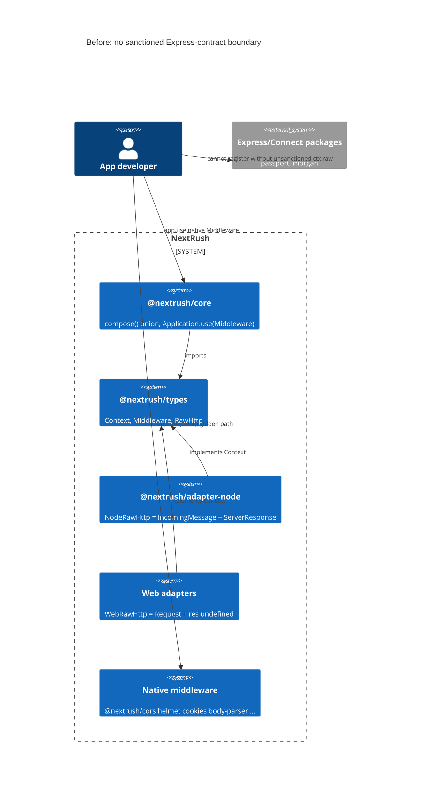
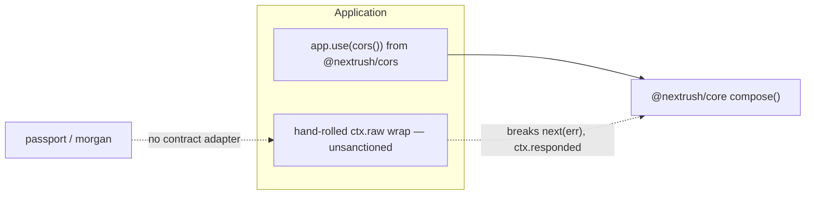
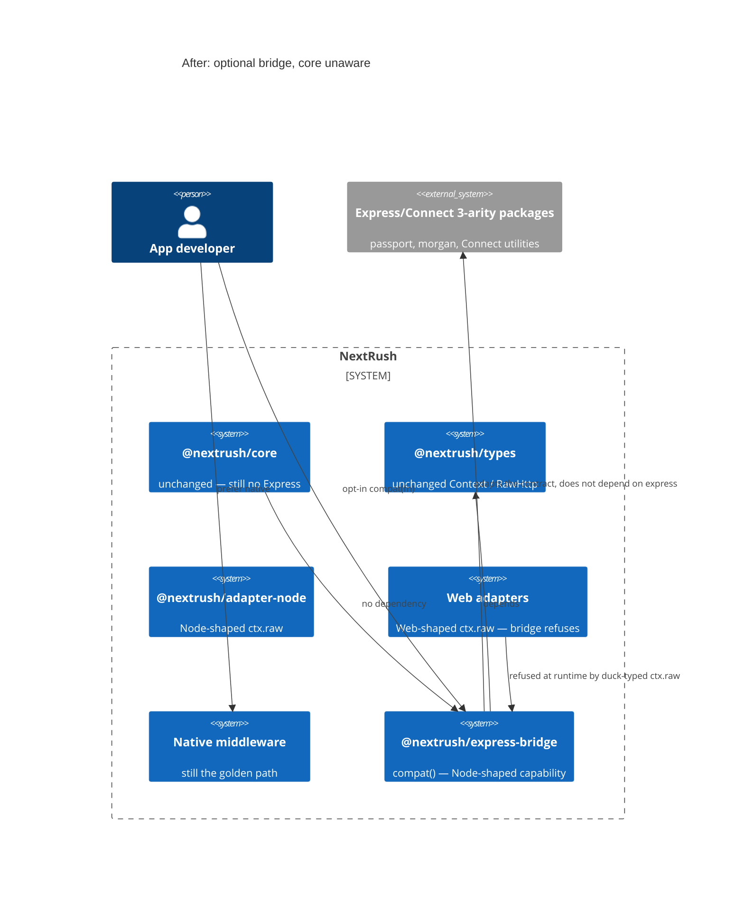
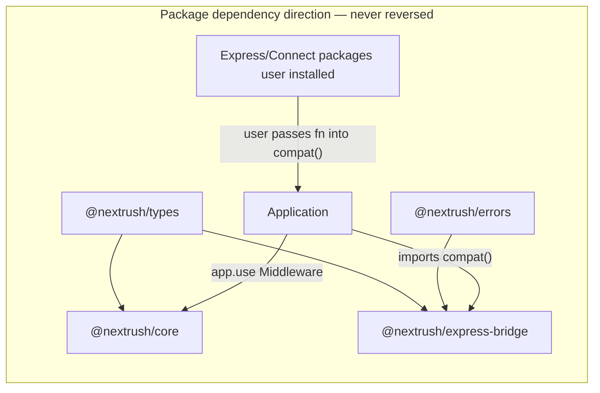
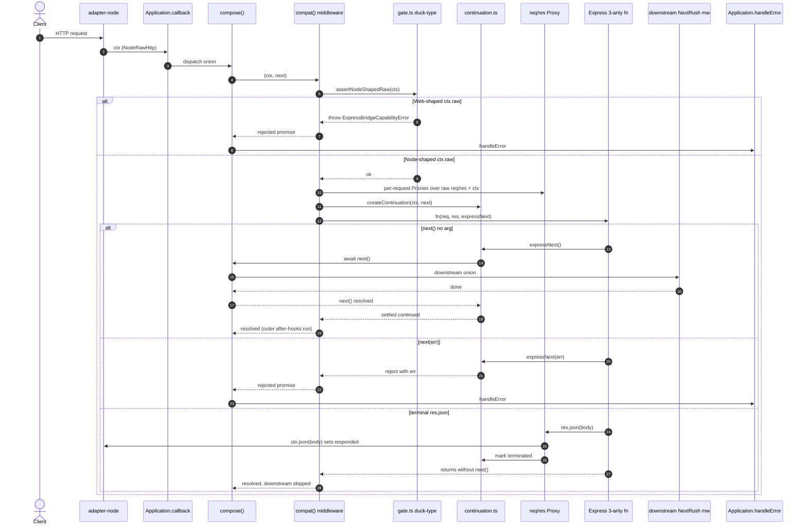

# RFC-035: Ecosystem interoperability — `@nextrush/express-bridge`

| Field                | Value                                                                 |
| -------------------- | --------------------------------------------------------------------- |
| **Status**           | `Shipped` |
| **RFC number**       | `035` |
| **Date**             | `2026-08-21` |
| **Author(s)**        | NextRush maintainers |
| **Group**            | `ecosystem-interop` (new — see §5 / §7.3) |
| **Packages touched** | `@nextrush/express-bridge` (new). Does **not** change `@nextrush/core`, `@nextrush/router`, `@nextrush/types`, or any adapter except as a *consumer* of the existing `Context` / `ctx.raw` contracts. Workspace glob `pnpm-workspace.yaml` gains `packages/interop/*`. A new ADR (ADR-002x, see PR-2c) adds the **Public — interop** tier and points at ADR-0005 rather than editing that shipped ADR in place. |
| **Framework impact** | `Additive, non-breaking` |
| **Supersedes**       | `—` (absorbs the informal draft `feedback/draft_rfc.md` and GitHub issue #54; those remain historical, not specs) |
| **Superseded by**    | `—` |
| **Related**          | GitHub [#54](https://github.com/0xTanzim/nextRush/issues/54), GitHub [#53](https://github.com/0xTanzim/nextRush/issues/53) (gRPC — future integration, out of this RFC), RFC-013, RFC-020, RFC-030, RFC-032, RFC-034, ADR-0002, ADR-0005, ADR-0007 |

---

## Progress Tracker

**Overall:** `[░░░░░░░░░░░░░░░░░░░░]` 0% — 0 / 4 phases complete · Doc status: `Draft`

| Phase | Part / deliverable | Status |
| ----- | ------------------ | ------ |
| P0    | Compatibility Surface Report (~20 packages; required APIs; native-overlap table). No production adapter. | ⬜ Not started |
| P1    | Spike adapter + continuation-table unit tests on Node (unpublished). | ⬜ Not started |
| P2    | `@nextrush/express-bridge` with sealed `compat()`, real-package tests, Edge refusal test, public-surface lock. | ⬜ Not started |
| P3    | Benchmarks + living registry + README/ARCHITECTURE + docs-site page + OpenSpec spec. Status → `Shipped` when the package publishes. | ⬜ Not started |

**Governance:** this RFC lands in-tree as **Approved** (`docs/RFC/ecosystem-interop/035-express-bridge.md` + `docs/RFC/INDEX.md`) **before** any implementation PR. P0 (research report, no `compat()`) may run in parallel with review. P1 does not merge until the RFC is Approved **and** the P0 report is in tree. P2 does not start until P1's continuation table is green.

---

## 0. Revision History

- **v1 (`2026-08-21`)** — Initial production RFC. Promotes `feedback/draft_rfc.md` / issue #54 into the house template. Corrects the draft's native-package golden path (`compat(cors())` / `compat(helmet())`), locks continuation semantics against `compose()`, gates the bridge on duck-typed `ctx.raw` (not `ctx.runtime`), and refuses Edge/serverless fetch-shaped raw HTTP.
- **v2 (`2026-08-21`)** — Review revision. Splits hang detection by return type (thenable fail-closed; callback-style is Express continuation). Replaces allow-list-vs-trap with a four-bucket Proxy algorithm (overlay / known-unsupported / Node pass-through / ad-hoc state). Double-`next` is warn+no-op so the outer promise is not double-settled. RFC lands Approved in-tree before implementation. `on-headers` is a surface fixture, not `compat(onHeaders)`. Cookie serializer uses Express defaults and ms `maxAge`. Unused-path oracle is the import graph, not a 10% RPS window.
- **v3 (`2026-08-21`)** — Leftover-consistency pass. `expressNext` checks idle before `'route'`/`'router'`. Unused-path alloc is a hard gate on a named `native-hello-alloc` harness. `@nextrush/runtime` is a runtime dep for `assertHeaderSafe`. `writeHead` is bucket 3 only. Import-graph gate is a workspace `package.json` edge test, not a new cruiser toolchain.
- **v4 (`2026-08-21`)** — `writeHead` wrap captures `origWriteHead` at Proxy creation and never looks up `target.writeHead` at call time (avoids `on-headers` recursion). Settlement table drops review-thread jargon.
- **v5 (`2026-08-21`)** — Approval-review precision pass. Normative contract narrowed to 3-arity (2-arity/0-arity P0-gated). P0 made authoritative over the §8.4 surface. Promoted the continuation state table to normative (§8.6) with `response + next()` = response-wins locked. Defined `req.* ↔ ctx.state` last-write-wins collision semantics. Explained Express naming vs Connect contract, added non-transitive-compatibility and explicit-interop invariants, expanded Proxy security to prototype mutation, split the unused-path guarantee from its alloc-benchmark verification, and recorded `assertHeaderSafe`'s home in `@nextrush/runtime`.

---

## 1. Summary (TL;DR)

NextRush already ships first-party middleware for CORS, Helmet, cookies, compression, body parsing, multipart, rate-limit, CSRF, logging, and more. What it does **not** ship is a way to reuse the remaining Express/Connect **execution contract** — `(req, res, next)` — for packages the framework does not own (`passport`, `morgan`, Connect utilities, community auth strategies). This RFC adds an **optional**, **Node-shaped** package `@nextrush/express-bridge` whose entire public runtime API is `compat(middleware)`, wrapping that contract as a NextRush `Middleware`. Core, router, types, and adapters stay unaware of Express. Unused apps pay zero overhead (proven by an import-graph oracle, not a 10% RPS window). Native `@nextrush/*` remains the golden path; the bridge is an opt-in ecosystem lever, not a portable middleware package, and it is **not** claimed on Edge/serverless fetch adapters.

---

## 1a. Terminology

`Native`
: A package designed for NextRush (`@nextrush/cors`, `@nextrush/helmet`, …) and registered with `app.use(fn())` (ADR-0002). Always the preferred path when it exists.

`Direct library`
: A framework-neutral npm package (Prisma, Zod, Pino, Redis clients) used without a compatibility shim.

`Integration`
: A deliberate NextRush package around an external **protocol or infrastructure system** (OpenTelemetry today; Kafka / gRPC later). Not a middleware bridge. gRPC is GitHub #53 — out of this RFC.

`Compatibility` / `Bridge`
: An adapter that lets an external **stable execution contract** run inside NextRush. This RFC's contract is Express/Connect 3-arity `(req, res, next)`, not Express-the-framework. The package is named `@nextrush/express-bridge` because **Express names the largest ecosystem being targeted**, while the actual compatibility contract is the narrower Connect/Express 3-arity middleware model — the name is a market/ecosystem pointer, not a claim that Express-the-framework is reproduced.

`Express middleware (3-arity)`
: A function `(req, res, next) => void` (or a thenable-returning variant) as defined by Connect and used by Express 4. This is the only normative contract v1 wraps. 2-arity and 0/1-arity are P0-gated, never normative (§8.6).

`Express error middleware (4-arity)`
: `(err, req, res, next)`. **Unsupported in v1.** NextRush already has `Application.setErrorHandler` and class exception filters (RFC-011).

`Node-shaped raw HTTP`
: `ctx.raw` structurally matching Node's `{ req: IncomingMessage-like, res: ServerResponse-like }` — EventEmitter-style `req.on`, `res.setHeader` / `res.end` / `res.headersSent`. This is a **shape**, not `ctx.runtime === 'node'`.

`Web-shaped raw HTTP`
: `ctx.raw` as produced by `WebContextBase` (`packages/runtime/src/web-context-base.ts`): `{ req: Request, res: undefined }`. Edge, serverless fetch handlers, and the Bun/Deno **web** adapters expose this. The bridge **refuses** it.

`Compatibility level`
: One of `Full` / `Partial` / `Unsupported` / `Unknown`. `Unknown` is never advertised as supported. Native-overlap rows are labeled **native-preferred**, not `Full`.

`Living registry`
: The compatibility matrix whose claims are generated or validated by tests in `@nextrush/express-bridge`. The registry is not a marketing table.

---

## 2. Decision Summary

- **Status:** `Draft`
- **Decision:**
  - _Introduce_ a new RFC group `ecosystem-interop` and a new durable OpenSpec capability `ecosystem-interop`.
  - _Introduce_ `@nextrush/express-bridge` at `packages/interop/express-bridge/`, exporting `compat()` (plus error classes and types). The package depends on `@nextrush/types`, `@nextrush/errors`, and `@nextrush/runtime` only — never on `express`, never on `@nextrush/core` at runtime, never reverse-imported by core.
  - _Introduce_ a Node-shaped raw-HTTP **runtime gate** that duck-types `ctx.raw` and throws an actionable error on Web-shaped raw HTTP. No Express-compat flag on `@nextrush/core`. No new `RuntimeCapabilities` bit in `@nextrush/types` for v1.
  - _Keep_ every native `@nextrush/*` middleware as the golden path (`app.use(cors())` from `@nextrush/cors`). `compat()` examples use packages NextRush does **not** own.
  - _Keep_ RFC-032: `@nextrush/session` will be first-party; `express-session` is **Unsupported in v1** of this bridge.
  - _Keep_ `ctx` framework-agnostic: no `req.user` field on `Context`; shared state lives on `ctx.state` via a per-request Proxy.
  - _Do not_ extract `@nextrush/compat-core` until a second real adapter proves shared requirements.
  - _Do not_ add `@nextrush/express-bridge` to the `nextrush` meta-package dependencies (RFC-020: optional install).
- **Breaking:** `No`
- **Migration required:** `None` — opt-in package; existing apps unchanged.
- **Blast radius:** `low` for existing applications (they never import the package). `medium` for the new package itself (foreign middleware is an unbounded surface; contained by the compatibility registry and fail-closed unsupported-API traps).

---

## 2a. Decision Drivers

Priority (highest → lowest):

1. **Runtime independence of core** — AGENTS.md §7. The bridge is a Node-shaped capability isolated in its own package; core/router/middleware gain no `node:*`, no `process`, no Express types, no `if (runtime === 'x')`.
2. **Native-first DX** — when a first-party package exists, it is the documented golden path. The bridge must not teach `compat(cors())` as the happy path.
3. **Tiny, sacred public API** — `compat(fn)` and error classes. No `RequestAdapter` / `ResponseAdapter` in the public surface (ADR-0005).
4. **Semantic compatibility over TypeScript-shape compatibility** — if a behaviour cannot be implemented correctly, it is `Unsupported`, not faked.
5. **Zero unused-path cost** — the architectural guarantee is **no import edge and no runtime execution path** from core/router/types/runtime/adapters/`nextrush` into the bridge. The workspace `package.json` edge test and the `native-hello-alloc` delta `=== 0` harness are the *verification* of that guarantee, not the guarantee itself.
6. **Honest claims** — every `Full` / `Partial` cell is backed by a real-package test; `Unknown` is never sold as supported; the bridge is **not** in the adapter conformance suite.

---

## 3. Problem & Motivation

### 3.1 Current state (what exists today)

NextRush middleware is Koa-style onion, not Express continuation:

```ts
// packages/types/src/context.ts
export type Next = () => Promise<void>;
export type Middleware = (ctx: Context, next: Next) => void | Promise<void>;
```

`compose()` in `packages/core/src/middleware.ts` awaits `next()`, rejects a second `next()` with the exact string `'next() called multiple times'`, adopts thenables, and optionally warns when `ctx.responded` is true and `next()` is still called. `Application.use` (`packages/core/src/application.ts`) accepts only `Middleware`. Errors rejected out of `compose()` enter `Application.handleError` → `setErrorHandler` or `writeDefaultErrorResponse`.

The Node adapter already exposes the Node HTTP pair as an escape hatch:

```ts
// packages/adapters/node/src/context.ts
type NodeRawHttp = RawHttp<IncomingMessage, ServerResponse>;
get raw(): NodeRawHttp {
  return (this._raw ??= { req: this._req, res: this._res });
}
```

Web adapters do **not**:

```ts
// packages/runtime/src/web-context-base.ts
export type WebRawHttp = RawHttp<Request, undefined>;
get raw(): WebRawHttp {
  return (this._raw ??= { req: this._req, res: undefined });
}
```

Architecture instruction (`.kiro/steering/architecture.instructions.md`): application code should "never touch raw `req`/`res`". That rule is correct for applications. There is today **no sanctioned package** that is allowed to speak `(req, res, next)` so a developer can reuse `passport` or `morgan`.

Meanwhile first-party middleware already covers the packages the informal draft used as its DX examples. ADR-0005 classifies these as **Public — middleware/registrar**. ADR-0002: they register with `app.use(fn())`.

| Ecosystem package the draft treated as the happy path | First-party package that already exists |
| ------------------------------------------------------ | --------------------------------------- |
| `cors` | `@nextrush/cors` (`packages/middleware/cors`) |
| `helmet` | `@nextrush/helmet` |
| `compression` | `@nextrush/compression` |
| `cookie-parser` | `@nextrush/cookies` (`ctx.cookies`, RFC-034) |
| `body-parser` / `express.json` | `@nextrush/body-parser` (`ctx.body` / `ctx.bodySource`) |
| `multer` | `@nextrush/form-data` |
| `express-rate-limit` | `@nextrush/rate-limit` |
| `csurf` | `@nextrush/csrf` |
| `morgan` (overlap, different API) | `@nextrush/logger` (prefer native for new apps; `morgan` remains a valid *bridge* target because NextRush does not own it) |
| `express-session` | **Not bridged.** RFC-032 / ADR-0020: the framework will own `@nextrush/session`. |

A developer who needs Passport today has three bad options: reimplement it, drop NextRush, or reach through `ctx.raw` and hope. Reaching through `ctx.raw` is untyped, undocumented, and breaks the onion (`next(err)` does not enter `handleError`; Express `res.send` does not set `ctx.responded` unless it happens to hit `headersSent` checks in `NodeContext.json` / `send`).

### 3.2 The problems (enumerated)

1. **Framework-bound ecosystem packages are unusable without a contract adapter** — Passport, `morgan`, Connect utilities, and community strategies expect `(req, res, next)`. Evidence: issue #54; no package under `packages/` wraps that contract. (`http-proxy-middleware` is a later integration concern — streaming is unclaimed in v1.)
2. **The informal draft teaches the wrong golden path** — `app.use(compat(cors()))` / `compat(helmet())` duplicates first-party middleware and would train users to pay bridge cost for work NextRush already owns. Evidence: `packages/middleware/{cors,helmet,compression,cookies,body-parser,form-data}` and ADR-0005.
3. **`ctx.raw` is an application-forbidden escape hatch, not a product** — using it directly skips `compose()` continuation rules, `ctx.responded`, `ctx.state`, and `ctx.cookies`. Evidence: `NodeContext.json` no-ops on `_responded \|\| _res.headersSent`, but `compose`'s double-response warning keys only on `ctx.responded`; a raw `res.end()` leaves `ctx.responded === false`.
4. **Express middleware is a Node IncomingMessage/ServerResponse contract** — it cannot run on Cloudflare Workers / Vercel Edge / `adapter-edge` / serverless fetch handlers, whose `ctx.raw` is `{ req: Request, res: undefined }`. Advertising it as portable middleware would violate AGENTS.md §7.
5. **Unbacked compatibility claims are a trust defect** — listing `cors` as `Full` because "it only sets headers" without a test, and without disclosing that `@nextrush/cors` exists, is how registries rot. AGENTS.md §14: claims require verification.

### 3.3 Why now

Issue #54 exists, the native middleware set is already broad enough that a bridge can be scoped to **what we do not own**, and RFC-032 has already reserved session as first-party — so this RFC can draw a hard `Unsupported` line around `express-session` instead of accidentally becoming the session story. Shipping a bridge after a native session package would be easier; shipping a bridge that *undermines* RFC-032 would be expensive to unwind. The public API is one function: this is the cheap time to lock the architecture (ADR-0007's lesson: freeze the contract before adoption).

---

## 4. Goals & Non-Goals

### 4.1 Goals

- **G1.** A developer can write `app.use(compat(morgan('combined')))` (or another v1-matrix package) on `@nextrush/adapter-node` and get semantic Express 3-arity behaviour mapped onto NextRush `Middleware`. (Problem 3.2.1)
- **G2.** Every public example, README, and docs-site page prefers native packages when they exist. Registry rows for `cors` / `helmet` / `cookie-parser` / `compression` / `multer` (and other native overlaps) are labeled **native-preferred — bridge is fallback only**. (Problem 3.2.2)
- **G3.** `@nextrush/core`, `@nextrush/router`, `@nextrush/types`, and `@nextrush/runtime` gain **zero** Express types, flags, or `node:*` imports. Dependency arrow is `express-bridge → types/errors/runtime`, never the reverse. (Problem 3.2.3)
- **G4.** The bridge refuses Web-shaped `ctx.raw` with an actionable error (what happened, why, how to fix: use native `@nextrush/*` or run on a Node-shaped adapter). Gate is duck-typing `ctx.raw`, not `ctx.runtime === 'node'`. (Problem 3.2.4)
- **G5.** Compatibility levels `Full` / `Partial` / `Unsupported` / `Unknown` exist; `Unknown` is never advertised as supported; the v1 matrix is backed by tests against **installed** package versions, not fakes. (Problem 3.2.5)
- **G6.** Unused-path overhead is **zero**: (1) no import/dependency edge from `@nextrush/core`, `@nextrush/router`, `@nextrush/types`, `@nextrush/runtime`, any adapter, or the `nextrush` meta-package into `@nextrush/express-bridge` (workspace `package.json` edge test — no new toolchain); (2) native hello-world alloc-bench delta is `=== 0` on `apps/benchmark/scripts/alloc/native-hello-alloc.js` (P3 hard gate; see §8.10). The existing `REGRESSION_TOLERANCE` 0.1 RPS gate remains a *sanity* check on native scenarios, not the unused-path oracle. (Problem 3.2.3)
- **G7.** Continuation semantics are locked in §8.6 (3-arity only; `next()` awaits downstream; `next(err)` rejects into `compose`; double-`next` is warn+no-op so the outer promise is not double-settled; thenable hang fails closed; callback-style Express continuation is not microtask-failed). Implementable without a design meeting.
- **G8.** OpenSpec gains a new durable capability `ecosystem-interop` (justified in §8.9). This RFC is the architecture and must be **Approved and landed in INDEX.md before implementation** (template / `tdd-workflow.md`). A later change's tasks validate it (TDD).

### 4.2 Non-Goals

- Reimplementing Express, Connect, or NestJS — never; we adapt one contract.
- A NestJS emulator (`@nextrush/nest-bridge`), Nest `ExecutionContext` / Guards / Interceptors / Modules / DI — never in this RFC; NextRush already has `@nextrush/class` (RFC-005…012). Nest middleware that is actually 3-arity Express may work *through this bridge* where its dependencies permit; that is incidental, not a Nest compatibility claim.
- A universal framework emulator (Koa + Fastify + Express + Nest in one abstraction) — never.
- Supporting every npm package, `express.Router`, `app.param`, `res.render` / view engines, `res.download`, or 4-arity error middleware — Unsupported until a later RFC.
- Claiming streaming, proxying, or request-body piping as v1 `Full` — streaming is **not claimed**; Phase 0 may mark specific packages `Partial` or defer them.
- Adding the bridge to the `nextrush` meta-package or to adapter conformance (`packages/adapters/conformance`). Native NextRush middleware remains the portable, cross-adapter path.
- Extracting `@nextrush/compat-core` — deferred until a second real adapter proves shared requirements.
- Kafka / RabbitMQ / NATS / gRPC packages — §17 / issue #53 only.
- Changing `Context` (no `req.user` field, no Express types in `@nextrush/types`, no new `RuntimeCapabilities` bit in v1).
- Undermining RFC-032 by treating `express-session` as a supported substitute for `@nextrush/session`.

---

## 5. Impact

- **Affected packages:** `@nextrush/express-bridge` (new). Workspace: `pnpm-workspace.yaml` gains `packages/interop/*`. A new ADR-002x adds the **Public — interop** tier and points at ADR-0005 (do not silently rewrite the shipped ADR's table). OpenSpec registry gains `ecosystem-interop`. `.kiro/steering/architecture.instructions.md` package-hierarchy diagram gains an `interop/*` row beside middleware (exact snippet in §7.3).
- **Affected audiences:** Application developers who opt in on Node-shaped adapters; contributors maintaining the registry; docs authors (native-first examples).
- **Explicitly NOT affected:** Existing applications; the functional `nextrush` entry; `@nextrush/core` `compose()` / `Application.use`; `@nextrush/router`; all adapters' request path; native middleware behaviour and performance; Edge / serverless / Bun-web / Deno-web fetch handlers (they refuse the bridge; they do not change); `@nextrush/types` `Context` / `RuntimeCapabilities`; adapter conformance suite observable behaviour.

**New RFC group justification.** `ecosystem-interop` is a durable *external-ecosystem* concern: adapting a foreign execution contract. It is not `framework-composition` (RFC-020 — how *our* packages compose into one install) and not `runtime-adapters` (RFC-013 — `ServerAdapter` / `FetchAdapter`). Putting this RFC under either existing group would mis-file the capability for every future interop RFC (Connect-as-separate, Fastify, …). The group is created because the area is new, not because the change is large.

---

## 6. Proposed Solution (overview)

| # | Problem (from §3.2) | Solution (this RFC) |
| - | ------------------- | ------------------- |
| 1 | Framework-bound packages unusable | Optional `@nextrush/express-bridge` wrapping 3-arity `(req, res, next)` as `Middleware` via `compat()`. |
| 2 | Wrong golden path in the draft | Native examples first; `compat()` examples are `morgan` / `passport` / Connect 3-arity middleware. Native-overlap registry rows are not `Full`. `http-proxy-middleware` is Unsupported in v1 (§8.8 / §17). |
| 3 | `ctx.raw` is an unsanctioned escape hatch | The bridge is the **sanctioned** exception, isolated in its own package. Adapter objects are Proxies over the real Node `req`/`res` plus `ctx`, so `ctx.responded`, `ctx.state`, and `ctx.body` stay coherent. |
| 4 | Express is a Node HTTP contract | Duck-type `ctx.raw` in the bridge package; refuse Web-shaped raw with an actionable error. No core flag. No conformance-suite parity claim. |
| 5 | Unbacked compatibility claims | Living registry driven by real-package tests; `Unknown` ≠ supported; Phase 0 measures ~20 packages before the production surface freezes. |

The key idea: **bridge the contract, not the framework.** NextRush continues to own the onion (`compose`), Context, and native middleware. The bridge is a single function that (1) refuses to run unless `ctx.raw` is Node-shaped, (2) presents a measured Express-like `req`/`res` as Proxies over that raw pair and `ctx`, (3) translates `next()` / `next(err)` / terminal `res.send` into `compose()`'s continuation and error pipeline, and (4) traps unimplemented Express APIs with errors that teach.

---

## 6a. Trade-offs

### Benefits

- Ecosystem leverage for packages NextRush does not own, without putting Express in core.
- Native path remains the fast, portable, documented default.
- One-function public API is reviewable and hard to accidentally widen (ADR-0005 snapshot test).
- Fail-closed behaviour (unsupported Express prototype APIs, wrong runtime shape, thenable hang) teaches instead of throwing `Cannot read properties of undefined`. Callback-style Express continuation is preserved (it may wait on I/O; that is the ecosystem contract).
- Session story stays coherent with RFC-032.

### Costs

- Bridged middleware is **not portable**. Apps that use `compat()` cannot move that layer to Edge/serverless without replacing it with native packages. This is accepted and documented, not a bug.
- Bridged middleware is Express-continuation inside a Koa onion: a bridged function has no after-`next()` hook of its own. Outer NextRush middleware still have onion after-hooks. Developers who expect Koa-style after-hooks *inside* a bridged function will not get them. Callback-style middleware that forgets `next()` can hang until the adapter/server timeout; v1 does not invent a hang timer for that pattern (see §8.6).
- Proxy traps add per-request allocation on the **bridge path only**. Native path is unaffected. Bridged p99 will be slower than native NextRush; we document the measured delta rather than promising otherwise.
- A living registry is a maintenance surface. Mitigated by making tests the source of truth (a failing integration test cannot leave a `Full` cell standing).
- Explicit `compat()` wrapping is one extra import versus magic auto-detection. Accepted: explicitness is the v1 DX (AGENTS.md: no magic).

---

## 7. Architecture

### 7.1 Before

Today there is no interop family. Express middleware cannot enter `Application.use` without the user hand-wrapping `ctx.raw` (unsanctioned, broken continuation).





### 7.2 After

The application **optionally** depends on `@nextrush/express-bridge`. Core still does not know the package exists. `compat()` returns a normal `Middleware`, so `Application.use` is unchanged.






`compat()` returning a `Middleware` function is **not** a package dependency on `@nextrush/core`. The `Middleware` type lives in `@nextrush/types`. `@nextrush/express-bridge` does not declare `express` (or `passport`, or `morgan`) in `dependencies` or `peerDependencies`. The user installs the ecosystem package; `compat` accepts a function; `Application.use` accepts the result because it is already `Middleware`.

### 7.3 Why this architecture

- **Package hierarchy.** `.kiro/steering/architecture.instructions.md` places middleware under adapters and forbids lower layers from importing higher ones. The bridge is not portable middleware and not a `ServerAdapter`, so it does not live in `packages/middleware/` or `packages/adapters/`. PR-2c pastes this exact snippet (interop sits *above* adapters in the dependency arrow: it may import types/errors; it must not be imported by them; it is a sibling of middleware, not a member of it):

  ```text
  types      → shared TypeScript types (no deps)
    ↓
  errors     → HttpError hierarchy (depends on types)
    ↓
  core       → Application, Context, middleware composition
    ↓
  router     → segment-trie routing
    ↓
  runtime    → capability profiles, request/response primitives
    ↓
  di / class → optional class runtime
    ↓
  adapters/* → node, bun, deno, edge, serverless
    ↓
  middleware/*  → portable request middleware (cors, helmet, cookies, …)
  interop/*     → Node-shaped ecosystem bridges (express-bridge). NOT portable.
    ↓
  extensions/* → events, websocket
    ↓
  nextrush     → meta package (does NOT depend on interop)
  ```

  **Size caps (paste with the hierarchy in PR-2c):** `middleware/*` keeps its **300 LOC package** cap (architecture.instructions.md). That cap does **not** apply to `interop/*` — a contract adapter's request-proxy + surface will exceed 300 easily. Interop follows the global per-file 300-line ceiling (`code-structure.md`) and a **package cap of 1500 LOC** (same band as `core`). Split files rather than growing a god-module.

- **RFC-020.** Optional install: the `nextrush` meta-package does **not** gain this dependency, matching how `@nextrush/adapter-edge` / `adapter-serverless` stay out of the default install (ADR-0007 §5).
- **AGENTS.md §7.** Behaviour is decided by the shape of `ctx.raw` (a negotiated, structural capability), not by `ctx.runtime`. A Bun or Deno process whose adapter exposes Node-compatible `IncomingMessage`/`ServerResponse` on `ctx.raw` **may** work; that is a **follow-up probe after v1** (§17), not claimed now and **not** part of RFC P2. Today's `adapter-bun` / `adapter-deno` / `adapter-edge` use `WebContextBase` and will refuse.
- **AGENTS.md §4.** Framework complexity (Proxies, continuation state machine, registry) is owned by the bridge so application code stays `app.use(compat(passport.initialize()))`.

---

## 7a. Architecture Invariants

This RFC **preserves**:

- **Core imports no runtime API and no Express.** `packages/core`, `packages/router`, `packages/types` stay free of `node:*`, `process`, `Buffer`, Express types, and any `compat` flag. (AGENTS.md §7, architecture.instructions.md.)
- **`Application.use` accepts `Middleware` only.** The bridge returns `Middleware`. No overload, no auto-detection of `(req, res, next)`.
- **`compose()` semantics** — onion order, `'next() called multiple times'`, thenable adoption, `warnDoubleResponse` when `ctx.responded && next()`. The bridge translates into these; it does not fork them.
- **`Context` stays framework-agnostic.** No `user` field, no Express `Request` in `@nextrush/types`. Application data remains `ctx.state` (`ContextState = Record<string | symbol, unknown>`). HTTP capabilities remain first-class slots (`ctx.cookies`, RFC-034).
- **Native middleware behaviour and performance** are byte-identical when the bridge is not imported.
- **Adapter conformance suite** remains the parity oracle for *native* NextRush behaviour. This RFC does **not** add express-bridge cases to `packages/adapters/conformance`.
- **RFC-032 session position.** Bridging `express-session` would create a competing session story. It is Unsupported in v1.
- **RFC-020 optional composition.** Interop packages are not stuffed into the meta-package "to make them discoverable".

This RFC **does not break** any existing invariant. It **adds** these package-local invariants:

- **The bridge is a Node-shaped raw-HTTP capability.** Web-shaped `ctx.raw` is a hard refusal, not a best-effort emulation.
- **Public surface is sealed.** Runtime exports are `compat` plus the error classes in §8.5. `RequestAdapter` / `ResponseAdapter` / continuation helpers are not exported (ADR-0005 `public-surface.test.ts`).
- **P0 is authoritative over the candidate Express surface.** No §8.4 key is v1-supported without a selected real package, defined semantics, a test, and an assigned level. The RFC never becomes the implementation spec from memory.
- **Interop is explicit.** NextRush never auto-detects or auto-wraps foreign middleware; `app.use(fn)` never silently means `compat(fn)`, and there is no automatic fallback from native to bridge.
- **Compatibility is not transitive.** A compatible middleware function does **not** imply compatibility of its transitive framework dependencies (Express router internals, `app`, `res.render`, view engines, etc.). Compatibility is evaluated at the package boundary only; a package whose dependency tree requires unsupported Express behaviour is `Partial`/`Unsupported`, never `Full` by association.

---

## 8. Detailed Design

### 8.1 Public API / surface

```ts
// @nextrush/express-bridge — public runtime + types. Nothing else is exported.

import type { Middleware } from '@nextrush/types';

/**
 * Connect/Express 3-arity middleware. The bridge does not import `express`.
 * `req` / `res` are untyped at the boundary on purpose: the adapter is a
 * Proxy, and TypeScript-shape compatibility is not semantic compatibility.
 */
export type ExpressMiddleware = (
  req: unknown,
  res: unknown,
  next: ExpressNext,
) => unknown;

export type ExpressNext = (err?: unknown) => void;

/**
 * Wrap one Express/Connect middleware function as a NextRush `Middleware`.
 *
 * The v1 contract is the 3-arity `(req, res, next)` signature. 2-arity
 * `(req, res)` and 0/1-arity functions are **not** the normative contract;
 * they are accepted only if Phase 0 evidence shows a selected real package
 * needs them (see §8.6). `.length` is a boot-time guard, not a semantic
 * discriminator — it is never used to *classify* middleware as terminal,
 * callback-style, or otherwise. Does **not** auto-flatten arrays.
 *
 * @throws {ExpressBridgeArityError} if `fn` is an array, or `fn.length >= 4`.
 * @throws {TypeError} if `fn` is not a function (and not handled above).
 *
 * Per-request, the returned middleware:
 * @throws {ExpressBridgeCapabilityError} if `ctx.raw` is not Node-shaped.
 * @throws {UnsupportedExpressApiError} if the wrapped fn touches a
 *   known-unsupported Express prototype API (bucket 2 of the Proxy).
 */
export function compat(fn: ExpressMiddleware): Middleware;
```

**Not exported:** `RequestAdapter`, `ResponseAdapter`, `createContinuation`, `isNodeShapedRaw`, registry internals.

**Also exported (runtime), because errors are part of the API (AGENTS.md §12):**

- `ExpressBridgeCapabilityError` — wrong `ctx.raw` shape.
- `ExpressBridgeArityError` — 4-arity **or an array** passed to `compat()`.
- `ExpressBridgeProtocolError` — hanging **thenable** (`EXPRESS_BRIDGE_HANGING`). Double-`next` is **not** this error (warn+no-op; see §8.6).
- `UnsupportedExpressApiError` — trapped known-unsupported Express prototype APIs (`req.accepts`, `res.render`, `next('route')`, `signed: true` cookies, …).

All four extend `NextRushError` from `@nextrush/errors` (`status: 500`, `expose: false` — developer errors; install/fix text never serializes to the client via `toJSON()`).

`compat` does **not** take a configuration object wrapping the foreign package's options. The foreign package keeps its own API:

```ts
app.use(compat(morgan('combined')));
app.use(compat(passport.initialize()));
// NOT: compat(morgan, { format: 'combined' })
// NOT: compat([mwA, mwB]) — map by hand: arr.forEach((fn) => app.use(compat(fn)))
```

Registration-time checks (function, arity, not-an-array) throw synchronously from `compat()`, so they fail at boot when the user writes `app.use(compat(fn))`, not on the first request. **Do not auto-flatten arrays** (that would be magic; §9.3). Classic `helmet()` returning an array is a native-preferred package anyway — use `@nextrush/helmet`. If a non-native package returns an array, the error must teach: "map `compat` over the array or use a native package."

### 8.2 Internal components

Single-responsibility modules inside `packages/interop/express-bridge/src/` (not public):

| Module | Owns |
| ------ | ---- |
| `compat.ts` | Public `compat()`; arity check; returns the NextRush `Middleware`. |
| `gate.ts` | `assertNodeShapedRaw(ctx)` — structural duck-type of `ctx.raw`. **No `ctx.runtime` read for the gate.** |
| `request-proxy.ts` | Per-request `Proxy` over the real `IncomingMessage`. Implements the four-bucket get/set algorithm in §8.4 (overlay / known-unsupported / Node pass-through / ad-hoc state). |
| `response-proxy.ts` | Per-request `Proxy` over the real `ServerResponse`. Same four buckets. Overlay methods that Express documents as chainable return **this Proxy**, even though `ctx.json`/`ctx.send`/`ctx.set` return `void`. |
| `continuation.ts` | The §8.6 state machine: `next()`, `next(err)`, double-next warn+no-op, thenable adoption, thenable-hang fail-closed. Does **not** live on the req/res Proxy. |
| `errors.ts` | The four `NextRushError` subclasses with WHAT / WHY / HOW / docs-link messages. |
| `surface.ts` | Frozen overlay key set, known-unsupported Express prototype set, proto denylist. **Not** "anything else throws." |
| `cookie-serialize.ts` | Bridge-local `Set-Cookie` serializer with **Express** defaults and ms `maxAge`. No `cookie` package dependency. |

`compat.ts` does **not** import `@nextrush/core`. It does not call `isMiddleware`; a function that returns `Middleware` is enough for `Application.use`.

### 8.3 Request / execution flow

Happy path (`next()` delegates downstream) and the two other exits (`next(err)`, terminal `res.send`):



The req/res Proxy handles property access and overlay methods (`res.json`, `req.body`). `expressNext` is owned by `continuation.ts`, not the Proxy.

`Application.callback` (`packages/core/src/application.ts`) already does `fn(ctx).then(undefined, (error) => this.handleError(error, ctx))`. The bridge's job on `next(err)` and thrown errors is to **reject the composed promise** with an `Error` (wrap non-Errors like `compose()` does: `err instanceof Error ? err : new Error(String(err))`). The strings `'route'` and `'router'` are **not** generic errors — they throw `UnsupportedExpressApiError`, and only when continuation is still `idle` (see §8.6 `expressNext` order). Class exception filters (RFC-011) that wrap *route handlers* are not re-implemented here; app-level bridged middleware errors go to `setErrorHandler` / the default serializer, same as any other `compose()` rejection.

### 8.4 Data structures

#### Runtime gate (no new `RuntimeCapabilities` bit)

`RuntimeCapabilities` today (`packages/types/src/runtime.ts`) has `nodeStreams`, `webStreams`, `fileSystem`, `webSocket`, `fetch`, `cryptoSubtle`, `workers`, `secureServing`, `http2`. None of these means "exposes Node `IncomingMessage`/`ServerResponse` on `ctx.raw`". Adding `nodeHttpRaw?: boolean` would force a `@nextrush/types` change, an adapter-plumbing change, and a conformance conversation — for a v1 that only needs to say "this Proxy will not work on a Web `Request`".

**v1 decision:** duck-type inside the bridge package. Suggested structural check (P1 may tighten this check):

```ts
function isNodeShapedRaw(raw: RawHttp): boolean {
  const req = raw?.req as { on?: unknown } | undefined;
  const res = raw?.res as {
    setHeader?: unknown;
    end?: unknown;
    headersSent?: unknown;
  } | undefined;
  return (
    req != null &&
    typeof req.on === 'function' &&
    res != null &&
    typeof res.setHeader === 'function' &&
    typeof res.end === 'function' &&
    typeof res.headersSent === 'boolean'
  );
}
```

Web-shaped raw fails: `res` is `undefined`, and `Request` has no EventEmitter `on`. **Do not read `ctx.runtime`.** A future Node-compat `ctx.raw` on Bun/Deno would pass this gate even if `ctx.runtime !== 'node'`; that is intended, and is a **follow-up probe after v1** (§17), not RFC P2.

#### Per-request adapter: four-bucket Proxy over the real Node objects (v1 default)

Do **not** clone the request, headers, or body. Express `req`/`res` **are** Node `IncomingMessage`/`ServerResponse`. The Proxy target is the real pair (`ctx.raw.req` / `ctx.raw.res`). Do **not** allocate a frozen adapter object unless the P0/P1 spike shows a named v1-matrix package breaking on `Proxy`. The public API does not change if the fallback is used.

`surface.ts` implements one get/set/`has`/`ownKeys`/`defineProperty`/`getPrototypeOf` algorithm with **four buckets**, in this order. "Allow-list vs throw on anything else" is **not** the model — it would trap `res.writeHead`, `res.on`, `req.socket`, and `req.pipe`, which real packages (including `morgan` via `on-finished`) use.

**Get (`[[Get]]`):**

1. **Express overlay** — key is in the candidate tables below. Return the mapped value / bound overlay method. Chainable overlay methods return the **Proxy** `res`, not `void`, even though `ctx.json` / `ctx.send` / `ctx.set` / `ctx.redirect` return `void`.
2. **Known-unsupported Express prototypes** — key is in the frozen unsupported set (`req.accepts`, `req.acceptsCharsets`, `req.acceptsEncodings`, `req.acceptsLanguages`, `req.is`, `req.xhr`, `res.render`, `res.download`, `res.sendFile`, `res.format`, `res.links`, `app`, `param`, …). Throw `UnsupportedExpressApiError`.
3. **Node HTTP pass-through** — if the key exists on the target (own or prototype: `'key' in target` / `Reflect.has`), forward get to the target. This is how `res.on` / `once` / `emit`, `res.finished`, `req.socket`, `req.on`, `req.pipe`, `req.read`, `res.write` work. **`writeHead` Get is the bucket-3 special case below** (assert-wrap), not a raw prototype get. Streaming via pass-through keys is still **unclaimed** in v1 (Partial/unknown behaviour if a package depends on it) but it is **not** thrown as unsupported.
4. **Ad-hoc app state** — else read `ctx.state[key]` if present, otherwise `undefined`. **Do not throw on random gets.** Throw only on bucket 2.

**Set (`[[Set]]` / `defineProperty`):**

1. **Express overlay** — writable overlay fields (`body`, `statusCode`, mapped setters). Overlay `res.set` / `res.setHeader` / `res.cookie` go through the mappings in the response table.
2. **Known-unsupported** — throw `UnsupportedExpressApiError`.
3. **Node HTTP pass-through** — if the key exists on the target, set on the target. **This is required** for `on-headers`, which does `const orig = res.writeHead; res.writeHead = function wrap(...) { ...; return orig.apply(res, arguments); }`. Assigning `writeHead` must **not** land in `ctx.state`.
4. **Ad-hoc app state** — else `req[key] = value` → `ctx.state[key]`, except the proto denylist below.

**`has` / `in` / `ownKeys` / `getPrototypeOf`:** `getPrototypeOf` returns `Object.getPrototypeOf(target)` so `req instanceof IncomingMessage` and `res instanceof ServerResponse` keep working (P1 must assert this). `ownKeys` is `Reflect.ownKeys(target)` plus overlay own-keys that are not already on the target (`body`, `params`, …) — enough for `Object.keys` not to explode; do not invent a full Express own-key snapshot. `has` is true if overlay, or `key in target`, or (for non-denylisted keys) `key in ctx.state`.

**`writeHead` is bucket 3, not overlay.** Do **not** put `writeHead` in the overlay Set list (that is how a naive overlay trap would send `res.writeHead = fn` into `ctx.state` and break `on-headers`). Special-case only this key inside bucket 3. Calling the **current** `target.writeHead` from the assert-wrap **recurses** after `on-headers` assigns an own property (Node `end()` → own wrap → orig assert-wrap → current own wrap → …). Lock this algorithm (P1 encodes it):

1. **At Proxy creation**, capture `origWriteHead = target.writeHead` (typically `ServerResponse.prototype.writeHead`). Do **not** look it up again at call time.
2. **[[Get]] `writeHead`:** if the target has an **own** `writeHead` that is not `origWriteHead` and not the assert-wrap, return that own function (so an `on-headers` assignment is visible). Otherwise return the assert-wrap.
3. **Assert-wrap:** parse Node overloads — `(status)`, `(status, message)`, `(status, headers)`, `(status, message, headers)`. For each header entry whose value is **not** `undefined`, call `assertHeaderSafe(name, value)` imported from `@nextrush/runtime` (`packages/runtime/src/response-builder.ts`; public export). Skip `undefined` (Node `OutgoingHttpHeaders` allows it; `assertHeaderSafe`'s value type is `string | number | string[]`). Then `origWriteHead.apply(this, originalArgs)` — `this` is whatever the caller passed (Proxy or raw `ServerResponse`). Never `target.writeHead(...)` here.
4. **[[Set]] / `defineProperty` `writeHead`:** pass-through to the target (unchanged). Required so `on-headers` can assign.

P1: `onHeaders(res, () => { res.setHeader('X-Time', '1'); });` then `res.end()` (or equivalent) **fires the listener once**, does **not** stack-overflow, and a CRLF header still throws.

Residual risk: a wrapper that does not call through to `orig`, or a caller that uses `ctx.raw.res` directly — both already existed as Node escape hatches; the bridge must not add a *second* unvalidated overlay path.

P1 tests **must** include:

```ts
onHeaders(res, () => { res.setHeader('X-Time', '1'); });
res.end(); // listener fires once; no stack overflow
res.on('finish', handler);
req.socket; // pass-through, not throw
req.pipe;   // pass-through, not throw (streaming still unclaimed)
res.status(201).json({ ok: true }); // chain: ctx.status === 201 && ctx.responded
```

Fallback (spike-gated, §18): a frozen adapter object that delegates to the same four buckets, used only if a named v1-matrix package is observably broken by `Proxy` traps.

#### Candidate request overlay (bucket 1 — confirmed or reduced by Phase 0)

> **P0 is authoritative over the candidate Express surface.** Nothing in §8.4 is v1-supported *merely because it appears in this RFC*. A key becomes v1-supported only when **all four** hold: (1) required by a selected real package, (2) semantics are defined, (3) a test exists, and (4) a compatibility level is assigned. P0 may reduce, keep, or (with a named package) expand this surface. The frozen "known-unsupported" and "pass-through" buckets are the only ones not re-derived from P0 — they are identity and fail-closed traps, not an Express emulation.

| Property / method | Maps to | Notes |
| ----------------- | ------- | ----- |
| `method` | `ctx.method` | Underlying `req.method` is already this. |
| `url` | `ctx.url` (or underlying `req.url`) | Path + query. |
| `originalUrl` | **same as `url`**: `ctx.url` / underlying `req.url` | Express `originalUrl` is the unmodified `req.url` (path **+ query**). **`ctx.originalPath` is not used** — it is query-free and pre-canonical; "fixing" originalUrl to `originalPath` would drop the query string. Mount rewriting (`createPrefixMount` rewrites `ctx.path`) is **Unsupported**; do not claim `originalUrl` "survives mounts." |
| `path` | `ctx.path` | Query-stripped, router-canonicalized per RFC-029. |
| `query` | `ctx.query` | Already parsed by the adapter. |
| `params` | `ctx.params` | Empty until the router has run. Bridged middleware registered *before* the router sees `EMPTY_PARAMS`. |
| `headers` | underlying `req.headers` | No clone. Also reachable via bucket 3. |
| `get(field)` | `ctx.get(field)` | Case-insensitive. |
| `body` | `ctx.body` (read/write) | Bridged parsers that set `req.body` must write `ctx.body` too. See §8.6 (mixing parsers is Unsupported). |
| `ip` | `ctx.ip` | RFC-030 trust policy already applied by the adapter. Do not re-parse `X-Forwarded-For`. |
| `protocol` | `'https'` if `req.socket.encrypted`, else `'http'` | `req.socket` is bucket 3 pass-through. No new proxy-trust API for forwarded proto in v1. If Phase 0 needs `X-Forwarded-Proto`, mark the package `Partial`. |
| `secure` | `protocol === 'https'` | |
| `hostname` | `Host` header (strip port) | |
| `cookies` | own-property overlay, **not** `ctx.cookies` | Bridged `cookie-parser` may set this (bucket 1 write). Native `ctx.cookies` (RFC-034) wins when both are used; do not mix. |

#### Candidate response overlay (bucket 1 — confirmed or reduced by Phase 0)

**Returns column:** overlay methods Express documents as chainable return the Proxy `res`. `end()` matches Node (`res`). NextRush Context methods stay `void`; the overlay is the adaptor.

| Property / method | Maps to | Returns | Notes |
| ----------------- | ------- | ------- | ----- |
| `status(code)` | `ctx.status = code` | Proxy `res` | P1: `res.status(201).json({ ok: true })` sets `ctx.status === 201` and `ctx.responded`. |
| `statusCode` | `ctx.status` (get/set) | number | |
| `set(field, value)` | `ctx.set` | Proxy `res` | Overlay path uses `assertHeaderSafe` (CRLF). |
| `setHeader(field, value)` | `ctx.set` | Proxy `res` | Same as `set`. Distinct from raw `writeHead` (bucket 3, wrapped). |
| `get(field)` / `getHeader` | `res.getHeader` / `ctx` | value | |
| `removeHeader` | underlying `res.removeHeader` | Proxy `res` | |
| `send(body)` | `ctx.send(body)` | Proxy `res` | Sets `ctx.responded`. |
| `json(body)` | `ctx.json(body)` | Proxy `res` | Sets `ctx.responded`. |
| `end(...)` | `ctx.send` / target `end` | `res` (Node) | Prefer routing through `ctx.send` so `NodeContext._responded` is set. If a call still only hits `res.end`, `NodeContext.json`/`send` already no-op on `headersSent`; after the Express function settles, if `res.headersSent && !ctx.responded`, duck-call `markResponded()` when present on the context (Node adapter, not on the `Context` interface). Do **not** add `markResponded` to `Context` in this RFC. |
| `redirect(...)` | `ctx.redirect` | Proxy `res` | **Three** Express overloads. If the first argument is a `number`, treat as `(status, url)`. Otherwise `(url, status?)` matching `ctx.redirect`. Tests: `redirect('/x')`, `redirect(301, '/x')`, `redirect('/x', 301)`. |
| `cookie(name, val, opts)` | bridge-local serializer → `ctx.set('Set-Cookie', string)` | Proxy `res` | **Do not** pass Express option objects into `ctx.cookies.set`. See cookie rules below. |
| `headersSent` | underlying `res.headersSent` | boolean | Also bucket 3. |
| `locals` | per-request `Object.create(null)` | object | **Not** `{}` and **not** `ctx.state`. P1: `res.locals.__proto__` assignment does not pollute `Object.prototype`. Phase 0 may reverse the `ctx.state` choice if a v1 package must share `locals` with NextRush handlers; null-prototype stays. |

**Bucket 2 (throw `UnsupportedExpressApiError`) — Express prototypes, not Node HTTP:** `res.render`, `res.download`, `res.sendFile`, `res.format`, `res.links`, `req.accepts*`, `req.is`, `req.xhr`, `app`, `param`, `express.Router` detection (`fn.stack` / `fn.handle` at `compat()` is best-effort). `res.location` / `res.vary` stay bucket 2 unless Phase 0 shows they are one-liners (`ctx.set('Location')` / `ctx.set('Vary')`) required by a named v1 package.

**Bucket 3 (pass-through, unclaimed if streaming):** `req.pipe`, `req.read`, `res.write`, `res.cork`/`uncork`, EventEmitter methods, `req.socket`. Do **not** list these as traps.

#### Cookie overlay rules (`res.cookie`)

`packages/types/src/cookies.ts`: NextRush `CookieOptions.maxAge` is **seconds**; `httpOnly` defaults to **`true`**; `secure` defaults to **`'auto'`**; `sameSite` defaults to **`'lax'`**. Express/`cookie` `maxAge` is **milliseconds**; Express `httpOnly`/`secure` are **unset** unless provided. Passing Express `opts` into `ctx.cookies.set` would silently shorten cookies by 1000× and emit HttpOnly/Secure/SameSite the foreign middleware did not ask for.

v1 serializer (internal, no `cookie` npm dependency):

- Always emit **one** `Set-Cookie` string and call `ctx.set('Set-Cookie', serialized)` (string form **appends** on Node; array form **replaces** — never pass an array here).
- **Express defaults:** `httpOnly` / `secure` / `sameSite` omitted unless the caller provided them. `path` defaults to `'/'` only if Express does (Express `cookie` default path is `/`).
- `maxAge` in **milliseconds** from the caller → `Max-Age` in **seconds** in the header (`Math.floor(maxAge / 1000)`). P1: `res.cookie('sid', 'x', { maxAge: 1000 })` → header contains `Max-Age=1`.
- `signed: true` → `UnsupportedExpressApiError` (cookie-parser is native-preferred; NextRush `CookieOptions` has no `signed` flag).
- Do **not** call `ctx.cookies.set`. Native cookie defaults cannot leak into the Express API. Native `ctx.cookies` still wins for NextRush handlers reading cookies (RFC-034).

#### Ad-hoc state and prototype denylist (bucket 4)

```text
req.user = user     →  ctx.state.user = user   (safe key)
ctx.state.user      →  visible as req.user
req.session         →  ctx.state.session       (still Unsupported to *drive* express-session)
```

Do not invent `req.user` on `Context`. Passport's `req.user` is the motivating case and is exactly `ctx.state.user`.

**Shared-namespace collision semantics (locked):** `req.<key>` ad-hoc reads/writes are a shared compatibility namespace backed by `ctx.state` — a single object reference, not a copy. Collision between NextRush `ctx.state.foo` and a bridged middleware's `req.foo = …` is therefore **last-write-wins on the same key**. This is deliberate (it is what makes Passport's `req.user` visible downstream) and is documented, not "mysterious": bridged middleware may read/write `ctx.state` through `req.<key>`, and application code must not rely on undocumented cross-layer property names. Native `ctx.state` remains the canonical NextRush surface.

**Denylist (frozen):** `__proto__`, `prototype`, `constructor`. Get/set of these as ad-hoc keys is ignored (no-op set, `undefined` get) or throws `UnsupportedExpressApiError` — P1 picks throw vs ignore; either is fine so long as it does **not** write `ctx.state['__proto__']`. `NodeContext.state` is a plain `{}` (`this._state ??= {}`), not `Object.create(null)`, so a naive `ctx.state[key] = value` is a pollution path.

Implementation: project only **safe keys** onto `ctx.state` (`Object.defineProperty(ctx.state, key, { value, writable: true, enumerable: true, configurable: true })` after the denylist check). P1 `state.test.ts` **must** include `req['__proto__'] = { polluted: true }` and assert `({}).polluted === undefined` and `ctx.state.polluted === undefined`.

**Prototype-mutation security (beyond `ctx.state` pollution):** because the adapter is a Proxy over the **real** `IncomingMessage`/`ServerResponse`, P1 must explicitly cover prototype-chain mutation on both objects, not only ad-hoc-key pollution:

- `req.__proto__`, `req.constructor`, `res.__proto__`, `res.constructor` — reads return the real prototype/constructor (via `getPrototypeOf` passthrough); writes do **not** pollute `ctx.state` or the denylist.
- `Object.setPrototypeOf(req, x)` and `Object.setPrototypeOf(res, x)` — rejected or no-op'd on the Proxy; the real Node object is never re-prototyped.
- `Object.defineProperty(req/res, key, desc)` — routed through the same four-bucket Set/`defineProperty` algorithm; denylisted keys and known-unsupported Express prototypes are trapped.

These are additions to the frozen denylist and the existing `state.test.ts` pollution assertion, not a separate hardening pass.

Cookie collision: native `app.use(cookies())` activates `ctx.cookies`. Bridged `cookie-parser` sets `req.cookies`. If both run, **native wins** for anything NextRush handlers should read (`ctx.cookies`). Document: do not mix.

### 8.5 Error handling

All bridge errors extend `NextRushError` with `status: 500`, `expose: false`, stable `code`, and a message that answers what / why / how / where. They must never surface as `TypeError: Cannot read properties of undefined`.

**`ExpressBridgeCapabilityError`** (`code: 'EXPRESS_BRIDGE_WRONG_RAW'`), thrown from the per-request gate:

```text
@nextrush/express-bridge cannot run on this request.

What happened:
  compat() received a context whose ctx.raw is not Node-shaped HTTP
  (IncomingMessage-like req + ServerResponse-like res).

Why:
  Express/Connect middleware is a Node HTTP contract. This adapter
  exposes Web-shaped raw HTTP ({ req: Request, res: undefined }),
  which is what Edge / serverless fetch / WebContextBase use.

How to fix:
  1. Prefer a native NextRush package (e.g. app.use(cors()) from
     @nextrush/cors, app.use(helmet()) from @nextrush/helmet).
  2. If you need this Express package, run the app on
     @nextrush/adapter-node (or any adapter that exposes Node-shaped
     ctx.raw).
  3. See the compatibility registry for packages that are Full/Partial.

Docs: https://nextrush.dev/docs/reference/express-bridge
```

**`ExpressBridgeArityError`** (`code: 'EXPRESS_BRIDGE_ERROR_MIDDLEWARE'` or `'EXPRESS_BRIDGE_NOT_A_FUNCTION'`), thrown at `compat()`:

```text
compat() wraps one function. The v1 normative contract is 3-arity
(req, res, next); 2-arity is P0-gated and terminal-only; 0/1-arity is
P0-gated. Arrays and 4+-arity error middleware are rejected.

What happened:
  You passed an array, or a function with 4 or more parameters
  (Express error middleware).

Why:
  NextRush already has Application.setErrorHandler and class exception
  filters. Emulating (err, req, res, next) would fork that pipeline.
  Arrays are not auto-flattened — that would be magic.

How to fix:
  Use app.setErrorHandler((err, ctx) => { ... }) for app-level errors.
  If a package returned an array of middleware, map it:
    for (const fn of mwArray) app.use(compat(fn));
  If this function is actually 3-arity, bind it so .length is 3
  or wrap it: compat((req, res, next) => fn(req, res, next)).
  If a native NextRush package exists (e.g. helmet → @nextrush/helmet),
  use that instead.
```

**`ExpressBridgeProtocolError`** (`code: 'EXPRESS_BRIDGE_HANGING'`): thenable hang only. See §8.6. Double-`next` does **not** construct this error (warn+no-op; constructing a rejection would double-settle the outer promise).

Hanging **thenable** message:

```text
[express-bridge] middleware neither called next() nor finished the response.

What happened:
  The wrapped function returned a thenable that fulfilled while
  continuation was still idle and the response was not committed.

Why:
  Accidental `async (req, res, next) => { await work; }` with no next()
  is the Express 5 / async footgun. Failing closed is safer than hanging.

How to fix:
  Call next() after the async work, or send a response (res.json/res.send)
  and do not call next(). Classic callback-style middleware that returns
  undefined is not this error — it is Express continuation.
```

Double-next **warning** (not a thrown error), `NODE_ENV !== 'production'` only:

```text
[express-bridge] next() called multiple times; the second call was ignored.

What happened:
  The wrapped middleware invoked next() more than once, or called
  next() after next(err) / after a terminal res.send.

Why:
  NextRush compose() rejects a second next() so the pipeline cannot
  run twice. Express next() is void, so a second reject would
  double-settle the already-in-flight bridge promise. First
  continuation wins; the second is a no-op.

How to fix:
  Call next() at most once. If you need to end the request, call
  res.send/res.json and do not call next().
```

**`UnsupportedExpressApiError`** (`code: 'EXPRESS_BRIDGE_UNSUPPORTED_API'`), includes the property name and the native-package hint when we have one:

```text
Unsupported Express API: req.accepts

What happened:
  The wrapped middleware read req.accepts, which is not on the v1
  compatibility surface.

Why:
  The bridge implements a measured minimum surface, not Express.

How to fix:
  1. Check the compatibility registry for this package's level.
  2. If you needed content negotiation, handle it in NextRush
     middleware via ctx.get('Accept').
  3. If this package is on the native-overlap list, use the
     first-party package instead.

Docs: https://nextrush.dev/docs/reference/express-bridge#surface
```

`next(err)` does **not** construct a new error class when `err` is already an `Error`; it rejects with that error so `writeDefaultErrorResponse` / `setErrorHandler` see the original (`cause` chain preserved by `Error` itself). Non-Error values other than the strings `'route'` / `'router'` are wrapped `new Error(String(err))`, matching `compose()`. `'route'` and `'router'` throw `UnsupportedExpressApiError` **only when continuation is still `idle`** — see §8.6 `expressNext` order (a second `next('route')` after `next()` is warn+no-op, not a throw).

### 8.6 Edge cases

This table is the v1 continuation contract. P1 unit tests encode it. Changing a cell after P2 is a breaking change of the bridge (major), not of core.

**Normative continuation state table (locked — this is the contract, not an implementation note):**

| Middleware action | Result |
| ----------------- | ------ |
| `next()` (no arg) | Set continuation = `continued`; `await` downstream NextRush `next()`; then fulfill the bridge promise. Outer NextRush after-hooks run. |
| `next(err)` | Set continuation = `error`; reject the bridge promise with `err`; `compose()` catch → `handleError`. Never swallow. |
| Terminal `res.send`/`json`/`end`/`redirect`, no `next()` | Set continuation = `terminated`; do **not** call NextRush `next()`; fulfill the bridge promise. Downstream is skipped. |
| Sync return, no `next()`, no response | **Callback-style continuation** (Express semantics) — do **not** fail on a microtask; the function may call `next()` later from I/O/`setImmediate`. May hang until adapter timeout if `next()` is never called (documented; no v1 timer). |
| Thenable resolves, no `next()`, no response | **`ExpressBridgeProtocolError`** — fail closed (`EXPRESS_BRIDGE_HANGING`). |
| `next(); next()` | First continuation wins; second is **warn+no-op** (never double-settle). |
| `next(err); next()` | First wins (`error`); second warn+no-op. |
| **Terminal response, then `next()`** | **Response wins.** The response was already committed; `next()` is **warn+no-op** (matches `compose`'s `warnDoubleResponse` when `ctx.responded`). Downstream is not run; the promise is not rejected. |
| `next()` then later terminal response | The `await` of downstream is already in flight; the later `res.send` is a **no-op + dev warning** (already-sent), and does not double-run the pipeline. |
| `next()` then later thenable rejection | First continuation wins (`continued`); late rejection is `console.warn` (dev only); does not re-enter `handleError`. |

`expressNext` **evaluation order (locked — implement this, do not invert):**

1. If continuation is **not** `idle` (`continued` / `error` / `terminated`): apply the settlement table (warn+no-op, `return`). **Do not throw**, including when the argument is `'route'` or `'router'`.
2. Else if the argument is `'route'` or `'router'`: throw `UnsupportedExpressApiError` (first continuation becomes that thrown error → reject the bridge promise).
3. Else: `next()` (no arg) or `next(err)` as in the rows below.

P1 **must** include `next(); next('route')`: does **not** throw, does **not** double-settle the outer promise.

| Scenario | Behaviour |
| -------- | --------- |
| `compat(fn)` where `typeof fn !== 'function'` (including arrays) | Throw `ExpressBridgeArityError` (array) or `TypeError` (other) at wrap time. Do not auto-flatten. Message teaches mapping `compat` over the array. |
| `fn.length === 3` | **Normative v1 contract.** `(req, res, next)`. Behaviour per the rows below. |
| `fn.length === 2` | **P0-gated, not normative.** A 2-arity `(req, res)` is only supported if P0 shows a selected real package requires it; when accepted it is **terminal only** (must send a response; `next` is absent). Do **not** assume 2-arity is valid Express — arity does not distinguish terminal middleware from an accidental `next` omission. |
| `fn.length` 0 or 1 | **P0-gated.** Accepted only with real ecosystem evidence. Never a silent default. |
| `fn.length >= 4` | Throw `ExpressBridgeArityError` at wrap time. 4-arity is Unsupported in v1. |
| 3-arity `next()` (no arg) | Set continuation = `continued`. `await` the NextRush downstream `next()`, then fulfill the bridge middleware's promise. Outer NextRush after-hooks run. The Express function itself has **no** after-`next` onion. |
| `next(err)` where `err` is an `Error` or other non-`'route'`/`'router'` value | Set continuation = `error`. Reject the bridge promise with the error (wrap non-Errors except the two strings below). Never swallow. `compose()` catch → `Application.handleError`. Do **not** also call NextRush `next()`. |
| `next('route')` / `next('router')` while `idle` | **Unsupported.** Throw `UnsupportedExpressApiError` (teaches: NextRush has no Express route-skip). Do not wrap as `Error: route` (mysterious 500). No `express.Router` emulation. **Second** `next('route')` after a first continuation is step 1 of `expressNext` (warn+no-op), not this throw. |
| Thrown error from `fn` (sync) | Same as `next(err)`. |
| `fn` returns a thenable | Adopt it (`Promise.resolve(result)`), same as `compose()`. After it **fulfills**: if continuation is still `idle` and neither `ctx.responded` nor `res.headersSent`, reject `EXPRESS_BRIDGE_HANGING`. If already `continued` / `terminated` / `error`, ignore the fulfill. If `headersSent`/`responded`, treat as `terminated`. |
| `fn` returns non-thenable (`undefined` / other) | **Express continuation. Do not fail on a microtask.** Classic Connect/Express calls `next()` later from I/O, `setImmediate`, or a strategy callback (the RFC's own Passport example). The request may hang until the adapter/server timeout if `next()` is never called; that is documented, not a v1 timer. Optional later: an opt-in hang timeout — not v1 default. P1 **must** include a fixture that calls `next()` from `setImmediate` (and a resolved-then-I/O callback) and **must not** be classified as hanging. |
| Double `next()` — settlement (locked) | See the settlement table immediately below. **First continuation wins. Second call is warn+no-op. Never reject a promise already in flight.** |
| `next()` + later thenable rejection | First continuation wins (`continued`). The late rejection is `console.warn` when `NODE_ENV !== 'production'`. It does **not** re-enter `handleError` or re-run downstream. |
| Terminal `res.send` / `res.json` / `res.end` / `res.redirect` without `next()` | Set continuation = `terminated`. Do **not** call NextRush `next()`. Fulfill the bridge promise so outer after-hooks run. Downstream NextRush middleware is skipped (Express semantics). |
| `res.send` (etc.) after `ctx.responded` or `res.headersSent` | No-op the write (NodeContext already no-ops on `_responded \|\| headersSent`). When `NODE_ENV !== 'production'`: `console.warn` aligned with `compose`'s `emitDoubleResponseWarning`. Do not throw. |
| `ctx.raw` Web-shaped | Throw `ExpressBridgeCapabilityError` before calling `fn`. |
| Mixing `@nextrush/body-parser` and a bridged Express body parser on the same request | **Unsupported.** Document: pick one. Bridged parsers that set `req.body` must also set `ctx.body`. Native parser uses `ctx.bodySource`; Express parsers consume the Node stream. The second reader loses. |
| Mixing `cookies()` and bridged `cookie-parser` | Native `ctx.cookies` wins for NextRush handlers. `req.cookies` may still be populated. Recommend not mixing. |
| Streaming (`req.pipe`, `res.write` chunks, `compression` flush, proxy) | **Not claimed in v1** (behaviour unknown/Partial). **Not thrown** — these keys are bucket 3 Node pass-through. If Phase 0 shows a target *intended* package requires correct streaming, mark `Partial` or drop it from v1. |
| Client abort | The real `IncomingMessage` is the Proxy target (bucket 3), so Node `'close'` / `'aborted'` listeners the foreign package attaches still fire. `Context.signal` already exists. This RFC does **not** invent a new abort mapping and does **not** change core. |
| `express.Router`, `app.param`, `res.render` | Bucket 2 trap, or refuse at `compat()` if we can detect a router object (`fn.stack` / `fn.handle`). Detection is best-effort. |

**Double-`next` settlement table (P1 encodes every cell):**

| First state | Second `next` / `next(err)` / `res.send` | Effect on Express function | Effect on bridge promise |
| ----------- | ----------------------------------------- | -------------------------- | ------------------------ |
| `continued` (downstream in flight) | second `next` or `next(err)` **including `next('route')`/`next('router')`** or terminal write | **warn+no-op** when `NODE_ENV !== 'production'`; silent no-op in production. Do **not** throw from `expressNext` (foreign `try/catch` would swallow it; a throw would reject a promise already in flight). | **Unchanged** — still awaiting downstream. Never double-settle. |
| `error` | second continuation | same warn+no-op | unchanged (already rejecting) |
| `terminated` | second continuation | same warn+no-op | unchanged (already fulfilling) |
| `idle` | first `next()` then sync second `next()` | first wins (`continued`); second as above | single settle via the first `await next()` |

`compose()` analogue: the second *Express* `next` is like the second NextRush `next()` returning a rejected promise that **Express ignores** because `expressNext` is `void`. The bridge must not turn that into a second rejection of the middleware promise.

**Diagnostic verbosity switch (locked):** all `console.warn` paths (double-`next`, late thenable rejection, already-sent write) fire iff `process.env.NODE_ENV !== 'production'`. That is the **only** switch. It can diverge from `createApp({ env: 'production' })` when `NODE_ENV` is unset (core's `warnDoubleResponse` uses Application `env`, not `process.env`). Matching Application env would require importing `@nextrush/core` or adding `ctx.env` — both forbidden. Fail-closed rejects (capability, arity, thenable hang, unsupported API) are environment-independent.

Bridged middleware is **not** Koa middleware. This is the lifecycle:

```mermaid
stateDiagram-v2
    [*] --> Idle: compat() invoked for this request
    Idle --> Gating: assertNodeShapedRaw
    Gating --> Refused: Web-shaped raw
    Refused --> [*]
    Gating --> Running: Node-shaped raw, fn called
    Running --> Continued: next() no arg
    Running --> Terminated: res.send / json / end / redirect
    Running --> Errored: next(err) or throw
    Running --> ProtocolError: thenable hang (idle after fulfill)
    Running --> Running: callback-style idle; next() later from setImmediate
    Continued --> Continued: second next is warn plus no-op
    Continued --> ContinuedSettled: downstream next() fulfilled
    Continued --> Errored: downstream next() rejected
    Terminated --> Terminated: further res.send no-op plus dev warning
    Errored --> Errored: second next is warn plus no-op
    ContinuedSettled --> [*]
    Terminated --> [*]
    Errored --> [*]
    ProtocolError --> [*]
```



### 8.7 Examples

**Golden path — native (always show this first):**

```ts
import { createApp, listen } from 'nextrush';
import { cors } from '@nextrush/cors';
import { helmet } from '@nextrush/helmet';
import { cookies } from '@nextrush/cookies';

const app = createApp();
app.use(helmet());
app.use(cors());
app.use(cookies());
app.get('/health', (ctx) => ctx.json({ ok: true }));
const { port } = await listen(app, 3000);
```

**Bridge path — packages NextRush does not own:**

```ts
import { createApp, listen } from 'nextrush';
import { compat } from '@nextrush/express-bridge';
import morgan from 'morgan';
import passport from 'passport';
import { Strategy as JwtStrategy, ExtractJwt } from 'passport-jwt';

const app = createApp();

app.use(compat(morgan('combined')));

passport.use(
  new JwtStrategy(
    {
      jwtFromRequest: ExtractJwt.fromAuthHeaderAsBearerToken(),
      secretOrKey: process.env.JWT_SECRET,
    },
    (payload, done) => done(null, payload),
  ),
);
app.use(compat(passport.initialize()));
app.use(
  // req/res are `unknown` on ExpressMiddleware (Proxy ≠ Express.Request).
  // Application code may annotate `any` at the callback; that is honest.
  compat((req: any, res: any, next) => {
    passport.authenticate('jwt', { session: false }, (err: unknown, user: unknown) => {
      if (err) return next(err);
      if (!user) return next(); // or res.status(401).end()
      req.user = user; // visible as ctx.state.user downstream
      next();
    })(req, res, next);
  }),
);

app.get('/me', (ctx) => {
  ctx.json({ user: ctx.state.user ?? null });
});

const { port } = await listen(app, 3000);
```

**Wrong (do not document as the happy path):**

```ts
import { compat } from '@nextrush/express-bridge';
import cors from 'cors';
app.use(compat(cors())); // native @nextrush/cors exists — use that
```

**Edge refusal (the test in P2 constructs this):**

```ts
// Web-shaped ctx.raw (adapter-edge / WebContextBase):
// ctx.raw === { req: Request, res: undefined }
// compat(morgan('tiny')) throws ExpressBridgeCapabilityError
```

### 8.8 Compatibility registry (v1 hypothesis)

Levels: `Full` | `Partial` | `Unsupported` | `Unknown` | **`Native-preferred`** (not a compatibility success — a product direction).

Phase 0 measures ~20 packages and **may reduce** the candidate surface. It must not *silently upgrade* `Unsupported` to `Full` without tests.

**Native-preferred (bridge is fallback only — never advertised as the intended path):**

| Package | Native | Notes |
| ------- | ------ | ----- |
| `cors` | `@nextrush/cors` | Do not list as Full. |
| `helmet` | `@nextrush/helmet` | |
| `cookie-parser` | `@nextrush/cookies` | Collision: native `ctx.cookies` wins. |
| `compression` | `@nextrush/compression` | Streaming; even as fallback likely Partial. |
| `body-parser` / `express.json` | `@nextrush/body-parser` | Mixing parsers Unsupported. |
| `multer` | `@nextrush/form-data` | Multipart semantics; fallback Partial at best. |
| `express-rate-limit` | `@nextrush/rate-limit` | |
| `csurf` | `@nextrush/csrf` | |
| `serve-static` | `@nextrush/static` | |
| `morgan` vs `@nextrush/logger` | `@nextrush/logger` is native-preferred for **new** apps; `morgan` is still a v1 **bridge Full candidate** because NextRush does not own `morgan`'s API. Show both in the registry. |

**v1 bridge matrix (hypothesis — P0/P2 confirm):**

| Package | Level | Why |
| ------- | ----- | --- |
| `morgan` | Full (candidate) | Header/log-only; uses `req.method/url` + `res.on('finish')` (bucket 3). Real-package P2 test: `app.use(compat(morgan('tiny')))`. |
| `on-headers` | **Not a registry Full cell** | npm `on-headers` is `onHeaders(res, listener)`, length 2 — a Connect *utility*, not `(req, res, next)` middleware. `compat(onHeaders)` would pass `req` as `res` and throw. P2 tests it **inside** wrapped middleware (surface fixture), not as a package-level Full claim. See test snippet below. |
| `response-time` | Full (candidate) | Header-only 3-arity middleware. |
| `method-override` | Partial (candidate) | Needs `req.body` or headers; document method-rewrite vs NextRush router. |
| `passport` (`initialize` + session-less strategy) | Partial | `req.user` via `ctx.state`. `passport.session()` / `express-session` Unsupported. Real-package P2 test for initialize + one session-less strategy. |
| `passport-jwt` / similar strategies | Partial | Same state mapping; no session. |
| `http-proxy-middleware` | **Unsupported in v1** | Needs streaming. Mention only here and in §17 — not in golden-path example lists. |
| `express-validator` | Partial (candidate) | Uses `req`; may need `req.body`. |
| `connect-timeout` | Partial / P0 | Abort vs `ctx.signal`; do not claim until measured. |
| `express-session` | **Unsupported** | RFC-032: NextRush will own `@nextrush/session`. Bridging this would undermine that position. |
| `cookie-session` | **Unsupported** | Same session-position reason. |
| `express.Router` | **Unsupported** | Framework routing; NextRush has `@nextrush/router`. |
| View engines / `res.render` | **Unsupported** | Use `@nextrush/template`. |
| 4-arity `errorhandler` | **Unsupported** | Use `setErrorHandler`. |
| Anything untested | **Unknown** | Must not appear in README "supported" lists. |

**Used-inside-wrapped-middleware (surface fixtures, not `compat(utility)`):**

| Utility | How it is tested | Why not Full |
| ------- | ---------------- | ------------ |
| `on-headers` | See snippet. Proves bucket 3 `writeHead` assign + `assertHeaderSafe` wrap. | Not 3-arity middleware. Registry-lock tests key off middleware packages (`morgan`, `passport`) plus this named fixture. |

```ts
import onHeaders from 'on-headers';

app.use(
  compat((req, res, next) => {
    onHeaders(res, () => {
      res.setHeader('X-Time', '1');
    });
    next();
  }),
);
```

**Phase 0 research set (~20, required):** `cors`, `helmet`, `cookie-parser`, `compression`, `body-parser`, `multer`, `morgan`, `passport`, `passport-jwt`, `http-proxy-middleware` (expect Unsupported), `method-override`, `response-time`, `on-headers` (utility — measure required `res` APIs, do not list as Full middleware), `express-validator`, `connect-timeout`, `express-session`, `express.Router`, `csurf`, `express-rate-limit`, `serve-static`, plus one trivial header-only Connect **middleware** (even an in-repo fixture) as the baseline Full candidate. For each: required `req`/`res` APIs, lifecycle (`next` / terminal / thenable), stream/abort/body assumptions, native overlap, proposed level.

Deliverable: `docs/RFC/ecosystem-interop/035-compatibility-surface-report.md` (or `report/035-compatibility-surface.md`). **P1 implementation does not merge without this file and an Approved in-tree RFC (PR-RFC).**

### 8.9 Package layout, OpenSpec, workspace

```text
packages/interop/express-bridge/
  package.json            # @nextrush/express-bridge
  src/index.ts            # public barrel: compat + errors + types
  src/compat.ts
  src/gate.ts
  src/request-proxy.ts
  src/response-proxy.ts
  src/continuation.ts
  src/surface.ts
  src/cookie-serialize.ts
  src/errors.ts
  src/__tests__/public-surface.test.ts
  src/__tests__/continuation.test.ts
  src/__tests__/gate.test.ts
  src/__tests__/state.test.ts
  src/__tests__/unsupported-api.test.ts
  src/__tests__/writehead-on-headers.test.ts  # surface fixture, not compat(onHeaders)
  src/__tests__/packages/morgan.test.ts       # real package
  src/__tests__/packages/passport.test.ts     # real package
  README.md               # from docs/templates/package-readme.template.md (P3)
  ARCHITECTURE.md         # from docs/templates/package-architecture.template.md (P3)
```

**Dependencies:** `@nextrush/types`, `@nextrush/errors`, **`@nextrush/runtime`** (for `assertHeaderSafe` on the `writeHead` wrap — interop sits *above* runtime in the hierarchy, so this edge is legal). **Not:** `express`, `@nextrush/core` (runtime import), any adapter. Unused-path graph still forbids **core / router / types / runtime / adapters / `nextrush` → express-bridge**; `express-bridge → runtime` is the opposite direction and does not contaminate unused apps.

**`assertHeaderSafe` home (decided, not left open):** `assertHeaderSafe` stays in `@nextrush/runtime`. It is already the canonical shared header-safety primitive — `NodeContext.set` and the Web adapters both consume it, and `@nextrush/runtime` is already a public export (not `Internal` tier), so `interop → runtime` is a downward dependency in the hierarchy, not a new coupling. Relocating it to a lower-level shared HTTP/security package would be a breaking, cross-cutting move with no second consumer to justify it yet; the bridge is an additional *consumer*, not the reason the primitive exists. If a future second consumer (e.g. a Fastify bridge) reveals a need, that is a separate RFC — out of this one.

**devDependencies:** `vitest`, `@types/node`, `@nextrush/core`, `@nextrush/adapter-node`, and pinned real packages (`morgan`, `passport`, `passport-jwt` or a session-less strategy, `on-headers` as a **surface fixture**).

**Workspace:** add `packages/interop/*` to `pnpm-workspace.yaml` (today: `packages/*`, `packages/middleware/*`, `packages/extensions/*`, `packages/adapters/*`). Without that glob the package is invisible to pnpm.

**Package tier:** **Public — interop**. Support: stable, semver-guarded, **Node-shaped raw HTTP only**. Not Public — middleware (that tier implies portable `app.use(fn())` on every adapter). Landed as **ADR-002x** that updates the ADR-0005 table by reference (additive amendment dated with RFC-035). Do not silently rewrite shipped ADR-0005 in place.

**OpenSpec — new capability `ecosystem-interop`.** Justification against `openspec/README.md` "the one rule": none of the 20 existing capabilities own "adapt a foreign HTTP middleware execution contract." `core-middleware` is `compose()`. `portable-middleware` is NextRush middleware staying edge-portable — the opposite of this package. `runtime-adapter-contract` is `ServerAdapter`/`FetchAdapter`. `framework-composition` is the meta-package install graph. Creating `express-bridge-fastpath` (change-shaped) would be the failure mode the registry exists to prevent. `ecosystem-interop` is the durable name; Express is the first implementation. Purpose (draft for `openspec/specs/ecosystem-interop/spec.md`, written when the implementing change lands — not in this task):

> Optional, opt-in adapters that wrap a stable *external* execution contract into NextRush `Middleware`, without reversing the dependency arrow into core, without claiming Edge portability, and with a test-backed compatibility registry.

### 8.10 Performance design

- **Unused path:** the native `app.use(nextrushCors())` path must not import the bridge. No `core` lazy-require. Tree-shaking/ESM: if the app doesn't import `@nextrush/express-bridge`, the module is not evaluated.
- **Unused-path guarantee vs. verification (distinct, not conflated):** the **architectural guarantee** is "the bridge introduces no import edge and no runtime execution path when unused." The two hard gates below are the **verification** of that guarantee — they are a way to *detect* a violation, not a promise that allocations are literally zero in every environment (alloc measurement is inherently noisy and environment-sensitive).
- **Unused-path verification (CI, P2/P3) — both are hard gates:**
  1. **Import-graph (P2 hard gate):** no edge from `@nextrush/core`, `@nextrush/router`, `@nextrush/types`, `@nextrush/runtime`, any adapter, or `nextrush` → `@nextrush/express-bridge`. Implement as a **tiny test that reads workspace `package.json` `dependencies` / `peerDependencies` / `imports` fields** (and the meta-package's). **Do not add dependency-cruiser** or any new toolchain for this; the repo has none. Presence in the workspace is not proof.
  2. **Native hello-world alloc (P3 hard gate):** `apps/benchmark/scripts/alloc/native-hello-alloc.js` — **new** script in P3, same method as `handler-alloc.js` / `context-alloc.js` / `dispatch-alloc.js` (child process, `--max-semi-space-size`, `heapUsed` delta ÷ N, GC-during-window rejected and retried). Measures a native `createApp` + one `ctx.json` handler via `createHandler` **without importing `@nextrush/express-bridge`**. Pin a baseline; P3 **fails** if `node scripts/alloc/check-alloc-regression.js --harness native-hello-alloc --tolerance 0` reports any mean increase (delta ≠ 0). That script does not exist today — P3 adds it. Not "optional but preferred." Not "alloc delta documented." This is a *violation detector*, not the definition of "zero cost" — the definition is the import-graph + no-execution-path guarantee above.
  3. Existing `REGRESSION_TOLERANCE = 0.1` RPS gate remains a **sanity** check on native scenarios. It **cannot** prove unused-path zero cost (a stray import could hide inside 10%). Do not claim 0 bytes because RPS stayed inside 10%.
- **Bridge path:** one `Proxy` for `req`, one for `res`, one continuation record per request that *enters* a `compat()` middleware. No clone of `headers`, `query`, or `body`. Lazy: do not build Proxies until after the gate passes.
- **Benchmarks** (`apps/benchmark`, PERF-001): three servers, same scenario (header-only / request logging — **not** CORS, because native CORS exists):
  - **(A)** Native NextRush (`@nextrush/logger` or a one-line native header middleware).
  - **(B)** NextRush + `compat(morgan('tiny'))`.
  - **(C)** Native Express + `morgan('tiny')`.
- **Targets:** unused-path proven by the P2 import-graph hard gate **and** the P3 `native-hello-alloc` hard gate (delta `=== 0`). Native RPS sanity: no regression beyond `REGRESSION_TOLERANCE = 0.1` as a secondary check only. Bridged path (B): **document the measured p50/p99 delta** vs (A) and vs (C). There is **no** "5% overhead" budget in this RFC — inventing one without a baseline would fail PERF-001 ("Evidence Before Opinion"). The bridge does **not** need to beat native NextRush and must not be marketed as faster than native.

### 8.11 Testing strategy (detail; also §15.1)

- **Unit:** four-bucket surface; each §8.6 row **including** `setImmediate` next() (must not hang) and thenable-hang; double-next settlement table (warn+no-op, outer promise single-settles); **`next(); next('route')` does not throw and does not double-settle**; idle `next('route')` → `UnsupportedExpressApiError`; `req.user` ↔ `ctx.state.user`; proto denylist; `res.locals` null proto; `res.status(201).json({})` chain; `res.cookie` maxAge=1000 → `Max-Age=1`; `res.setHeader` CRLF throw; **`onHeaders` + `res.end()` fires once, no stack overflow, CRLF still throws**; `req['__proto__']` pollution; `req.body` ↔ `ctx.body`; already-sent no-op; unsupported-API trap; arity/array throw at wrap time; gate throw on `{ req: new Request('http://x'), res: undefined }`; gate pass on a Node-like pair; `redirect` three overloads.
- **Contract:** a 3-arity function that calls `next()` becomes a NextRush `Middleware` whose `await next()` order matches `compose()` onion with an outer NextRush after-hook (prove after-hooks still run).
- **Real packages (P2, required, not fakes):** installed `morgan`, `passport.initialize()` + one session-less strategy. Pin versions in `package.json` and record them in the registry. `on-headers` is a **surface fixture** inside a 3-arity wrapper, not `compat(onHeaders)`.
- **CI runtime:** Node + `@nextrush/adapter-node` only in v1. Explicit test that Edge-shaped `ctx.raw` throws `ExpressBridgeCapabilityError`.
- **Public surface:** `public-surface.test.ts` locks runtime keys (`compat` + four error classes) and type-only exports (`ExpressMiddleware`, `ExpressNext`).
- **Registry:** a test fails if README/registry claims `Full` for a *middleware* package without a corresponding integration test file. `on-headers` must not appear as Full.
- **Unused-path oracle:** P2 workspace `package.json` edge test (no new toolchain); P3 `native-hello-alloc` delta `=== 0` via `check-alloc-regression.js --harness native-hello-alloc --tolerance 0`.
- **Not in v1 CI:** Bun/Deno Node-compat `ctx.raw` (a **follow-up probe after v1**, §17; do not claim). Adapter conformance suite (explicitly excluded).

---

## 9. Alternatives Considered

### 9.1 Rebuild every Express package as `@nextrush/*`

_What it is:_ continue the first-party middleware program until Passport, Morgan, proxy, etc. exist natively.

_Why rejected as the **sole** strategy:_ NextRush should keep building native packages where it differentiates (RFC-032 session, RFC-034 cookies, CORS/Helmet). Requiring that program to finish before a user can run Passport is an adoption block the constitution rejects ("framework owns complexity" is not "framework reimplements npm"). The bridge is the lever for the remainder; native remains preferred where it exists.

### 9.2 Run an Express application inside NextRush (mount `express()` as a sub-app)

_What it is:_ `express()` instance, `app.use(expressApp)`, duplicate routing/error/view stacks.

_Why rejected:_ a second framework runtime, duplicate `req`/`res` identity, debugging across two onions, Express as a hard dependency, Edge impossibility even more confused. We adapt the **contract**, not the framework.

### 9.3 Magic auto-detection of `(req, res, next)` in `Application.use`

_What it is:_ `app.use(morgan('tiny'))` without `compat()`.

_Why rejected:_ arity is a terrible heuristic (`(ctx, next)` is also length 2; error middleware is length 4; bound functions lie). Hidden cost on every `use()`. Violates "explicit before magic" and makes performance and types unpredictable. v1 is explicit `compat()`.

### 9.4 Put Express compatibility into `@nextrush/core` or a `compat: true` Application flag

_Why rejected:_ contaminates the native path, forces Express types or `any` into core, violates AGENTS.md §7 and RFC-020's "install only what you use".

### 9.5 New `RuntimeCapabilities.nodeHttpRaw` bit in `@nextrush/types` for v1

_Why rejected for v1:_ requires types + every adapter + conformance to grow for a check the bridge can perform by looking at `ctx.raw`. Revisit if a second consumer needs the bit (e.g. a future `connect-bridge` or docs-time capability tables). Default: duck-type in the bridge package.

### 9.6 Universal framework emulator (Express + Nest + Koa + Fastify in one abstraction)

_What it is:_ one `compat-core` kernel that claims to wrap every framework's middleware/plugin/guard model.

_Why rejected:_ there is no shared execution contract. Nest Guards/Interceptors/`ExecutionContext` are not `(req, res, next)`. Koa is already what NextRush `compose()` is. Fastify plugins are encapsulated contexts with `decorateRequest`. A universal emulator either lies (TypeScript-shape compatibility) or becomes four emulators with one name. It also cannot be Edge-portable (AGENTS.md §7) without a second, honest native path — which we already have. Support the **contract**, not the framework name.

### 9.7 Thin wrapper: `compat(fn) => (ctx, next) => fn(ctx.raw.req, ctx.raw.res, (err) => { ... })` with no registry, gate, or continuation table

_What it is:_ ~40 lines over `ctx.raw`, which is the unsanctioned path §3.2.3 exists to replace.

_Why rejected:_ evidenced today. Express `next(err)` does not enter `Application.handleError` unless the wrapper rejects the composed promise. Express `res.send` does not set `ctx.responded` (`compose`'s double-response warning keys only on `ctx.responded`; `NodeContext.json` no-ops on `headersSent` but after-hooks still see `responded === false`). No Edge refusal (silent `TypeError` on `res.setHeader`). No `req.user` → `ctx.state`. No errors that teach. A thin wrapper is how we get "it compiled and hung in production."

### 9.8 Do nothing

_What happens:_ users keep reaching through `ctx.raw` (broken continuation, no registry, no errors that teach) or they do not adopt NextRush when Passport (etc.) is a requirement. Issue #54 stays an unanswerable architecture hole. Native-first is correct but not sufficient for the packages we do not own.

---

## 10. Rejected Ideas

- **`compat(cors())` as the README golden path** — Rejected because `@nextrush/cors` exists; teaching the bridge first is a product defect.
- **Listing `cors`/`helmet`/`cookie-parser`/`compression`/`multer` as registry `Full`** — Rejected; native-preferred.
- **Supporting `express-session` in v1 "until `@nextrush/session` exists"** — Rejected; RFC-032 already committed the framework to owning session. A Partial bridge would become the de facto session API.
- **4-arity error middleware in v1** — Rejected; NextRush error pipeline already exists. `next(err)` from 3-arity is enough.
- **Cloning req/res into plain objects** — Rejected; loses streams, abort, identity (`===`), and allocates on every request.
- **Typed `ctx.user` / Express `Request` in `@nextrush/types`** — Rejected; Context stays framework-agnostic; `ctx.state` is the bag.
- **Extracting `@nextrush/compat-core` now** — Rejected; one adapter does not prove a kernel. Premature abstraction. (Universal emulator is §9.6.)
- **Adding the package to the `nextrush` meta-package** — Rejected; RFC-020 optional install; Edge users must not download a Node HTTP bridge.
- **Conformance-suite parity for the bridge** — Rejected; the bridge is not portable middleware. Native remains the portable path.
- **`if (ctx.runtime === 'node')` gate** — Rejected; AGENTS.md §7. Duck-type `ctx.raw`.
- **Promising Kafka/RabbitMQ/gRPC in this RFC** — Rejected; those are integrations (issue #53 for gRPC), not this bridge.
- **Auto-implementing the entire Express `Request`/`Response` prototype "just in case"** — Rejected; Phase 0 measures; bucket 2 trap for Express prototypes; bucket 3 pass-through for Node HTTP.
- **Microtask fail-closed on non-thenable callback-style middleware** — Rejected; that is Express continuation (Passport, `setImmediate`). Thenable hang still fail-closed.
- **Throwing `ExpressBridgeProtocolError` on the second `next()`** — Rejected; would double-settle the outer promise. Warn+no-op.
- **Passing Express cookie `opts` into `ctx.cookies.set`** — Rejected; maxAge units and NextRush secure defaults would leak.
- **`compat(onHeaders)` as a Full registry cell** — Rejected; it is not 3-arity middleware.
- **Proxy-trust reimplementation for `req.ip`/`req.protocol`** — Rejected; `ctx.ip` already applies RFC-030; protocol uses the socket.
- **Using `REGRESSION_TOLERANCE` 0.1 as the unused-path oracle** — Rejected; 10% RPS cannot prove 0 allocations. Import-graph is the oracle.

---

## 11. Risks & Mitigations

| Risk | Mitigation | Likelihood | Impact |
| ---- | ---------- | ---------- | ------ |
| Compatibility surface grows into a second Express | Frozen candidate surface; unsupported trap; Phase 0 report is the gate for adding a property; public API cannot export adapters | Medium | High |
| Users assume 100% Express compatibility | Registry levels; `Unknown` never sold as supported; README native-first; Edge refusal is loud | High | Medium |
| Proxy traps break a popular package (`IncomingMessage` identity, enumerability) | P1 spike against the v1 matrix; fallback frozen adapter object without changing `compat()` | Medium | Medium |
| Performance regression on unused path | P2 import-graph hard gate (workspace `package.json` edges; no core/router/types/runtime/adapters/`nextrush` → bridge). P3 `native-hello-alloc` delta `=== 0` (`check-alloc-regression.js --tolerance 0`). `REGRESSION_TOLERANCE` 0.1 RPS is a parenthetical sanity signal only, not this oracle. | Low | High |
| Bridged parser + native parser consume the body twice | Documented Unsupported; if we can detect `bodySource.consumed` + `req.body` already set, development warning | Medium | Medium |
| Security bugs in foreign packages attributed to NextRush | Registry + docs: the foreign package is the user's dependency; the bridge is a contract adapter, not a security audit of Passport | High | Medium |
| `next(err)` loses error information | Reject the original `Error`; wrap non-Errors like `compose()`; `NextRushError.cause` chain unchanged | Low | Medium |
| Bun/Deno claimed to work and don't | v1 docs: only duck-typed Node-shaped raw is supported; today's web adapters refuse; follow-up probe after v1 (§17) is explicit and non-claiming | Medium | Low |
| Registry rot (Full cell, red test) | Test fails the build if a Full claim has no integration test | Medium | Medium |
| `res.end` bypasses `ctx.responded` | Route Express methods through `ctx.json`/`ctx.send`; post-settle duck-call `markResponded()` when present | Medium | Medium |

---

## 12. Backward Compatibility & Migration

- **Compatibility:** Additive & non-breaking. No existing export, type, or behaviour changes. Apps that never install `@nextrush/express-bridge` are unaffected.
- **Migration path (if breaking):** _Not applicable — not breaking._ Optional adoption:

  ```ts
  // Before (impossible / unsanctioned)
  app.use(async (ctx, next) => {
    someExpressMw(ctx.raw.req, ctx.raw.res, (err) => { /* ? */ });
  });

  // After
  import { compat } from '@nextrush/express-bridge';
  app.use(compat(someExpressMw));
  ```

  When a native package exists, migrate *off* the bridge:

  ```ts
  // Fallback (discouraged)
  app.use(compat(cors()));
  // Native
  import { cors } from '@nextrush/cors';
  app.use(cors());
  ```

- **Deprecation window:** _Not applicable — no deprecated API._

---

## 13. Cross-Cutting Concerns

- **Security:** The bridge is a trust boundary. `res.locals` is a per-request `Object.create(null)`, not `{}` and not `ctx.state`. Ad-hoc `req[key]` writes use a proto denylist (`__proto__`, `prototype`, `constructor`) before projecting **safe** keys onto `ctx.state` (`NodeContext.state` is a plain `{}`). Because the adapter is a Proxy over the **real** Node objects, prototype mutation is covered explicitly (`setPrototypeOf`, `defineProperty`, `req/res.__proto__`/`constructor`) — see §8.4. Overlay `res.set` / `res.setHeader` / `res.cookie` go through `ctx.set` → `assertHeaderSafe` (CRLF). Raw `writeHead` uses the captured-`origWriteHead` algorithm in §8.4 (assert-wrap never looks up current `target.writeHead`). Residual risk: foreign packages that reach `ctx.raw.res` directly, or that replace `writeHead` without calling through, already had this Node escape hatch; the bridge must not add a *second* unvalidated path on the Proxy. P1: `onHeaders` + `res.end()` fires the listener once, does not stack-overflow; `res.setHeader('X-Foo', 'a\r\nSet-Cookie: x=y')` throws/rejects. `req.ip` does not re-parse forwarded headers (RFC-030 stays in the adapter). Foreign middleware is the user's dependency: document that NextRush does not CVE-scan Passport for them. `expose: false` on all bridge errors so fix-text never leaks to clients.
- **Performance:** The unused-path **guarantee** is no import edge and no runtime execution path from core/router/types/runtime/adapters/`nextrush` into the bridge; P2 import-graph + P3 `native-hello-alloc` are the *verification* of that guarantee (§8.10). Bridge path = two Proxies + continuation record; no clones. Measured in `apps/benchmark` per §8.10 / §14. No invented 5% budget. The 0.1 RPS gate is sanity only.
- **Runtime independence:** Core/router/middleware unchanged. The bridge package is **allowed** to use `node:*` types (`IncomingMessage` structurally) and `process.env.NODE_ENV` as the **only** diagnostic-verbosity switch (accepted divergence from Application `env`; §8.6). The **gate** still does not branch on `ctx.runtime`. No express-bridge cases in `packages/adapters/conformance`. Portable apps use native `@nextrush/*`.
- **Observability:** Production is quiet unless `compat` throws (those errors already go through `handleError` / the logger). Diagnostic `console.warn` (double-`next`, late thenable rejection, already-sent) uses **`process.env.NODE_ENV !== 'production'` as the only switch** — accepted divergence from `createApp({ env })` (see §8.6). Optional debug (`DEBUG=nextrush:express-bridge`) may log middleware name + continuation outcome; default off. No PII in messages (don't dump headers/body).
- **Zero-dependency rule:** The new package's runtime deps are only `@nextrush/types`, `@nextrush/errors`, and `@nextrush/runtime` (for `assertHeaderSafe`, §8.4). No `express`. Real Express packages are **devDependencies** for tests and **user dependencies** at the application. Justified: adding `express` would pull a second framework into every bridge user and contradict §6.3 of the draft / this RFC's "contract not framework" rule.

---

## 14. Success Metrics

| Metric | Baseline (today) | Target / threshold |
| ------ | ---------------- | ------------------ |
| Unused-path import graph | No `@nextrush/express-bridge` today | **Hard gate (P2):** zero edges from core/router/types/runtime/adapters/`nextrush` → express-bridge, asserted by a tiny workspace `package.json` reader test (no new toolchain) |
| Unused-path allocations | No native-hello-alloc harness today | **Hard gate (P3):** add `apps/benchmark/scripts/alloc/native-hello-alloc.js`; fail if `check-alloc-regression.js --harness native-hello-alloc --tolerance 0` reports any mean increase |
| Native RPS sanity | Current pinned baseline | No regression beyond `REGRESSION_TOLERANCE` 0.1 — *sanity only*, not the unused-path oracle |
| Bridged-path p50/p99 vs native NextRush (scenario: morgan/header-only) | Unmeasured | **Document measured delta** in the P3 report. Not a pass/fail "faster than native". Fail the P3 write-up if the delta is unpublished. |
| Bridged-path p50/p99 vs native Express + same middleware | Unmeasured | Documented comparison only (honesty, not a marketing claim) |
| Bundle / install of `nextrush` meta-package | Current `package.json` dependencies | Unchanged — bridge not added |
| Edge/web adapter: `compat()` | N/A | 100% of gate tests throw `ExpressBridgeCapabilityError` on Web-shaped raw |
| Continuation table | N/A | 100% of §8.6 rows have a unit test, all green on Node |
| Registry honesty | N/A | Zero `Full` cells without a real-package test; zero `Unknown` in "supported" README lists |
| Public surface | N/A | `public-surface.test.ts` green; only `compat` + four error classes as runtime exports |
| Test coverage (`@nextrush/express-bridge`) | — | 90%+ lines/functions (CI-enforced, project-rules) |

---

## 15. Phased Implementation Plan

**RFC-before-implementation.** This document lands in-tree as **Approved** (`docs/RFC/ecosystem-interop/035-express-bridge.md` + INDEX group + row) **before** P1 merges. P0 (research report, no `compat()`) may proceed in parallel with review. TDD (RED → GREEN → REFACTOR) from P1. P3 moves status to **Shipped** when the package publishes — never "Approved after implementation."

| Phase | Goal (what ships) | Depends on | Exit condition (checkable) | Status |
| ----- | ----------------- | ---------- | -------------------------- | ------ |
| **P0** | Compatibility Surface Report for ~20 packages: required `req`/`res` APIs, lifecycle, stream/abort/body, native-overlap table, proposed Full/Partial/Unsupported. Check in `docs/RFC/ecosystem-interop/035-compatibility-surface-report.md` (or `report/035-compatibility-surface.md`). Reduce or confirm §8.4 candidate overlay. | — (may run during RFC review) | Report merged; every package in §8.8's research set has a row; native-overlap labeled; `on-headers` not listed as Full middleware; no production `compat()` implementation required | ⬜ Not started |
| **P1** | Unpublished spike **after Approved RFC**: Proxies + four-bucket surface + continuation state machine + unit tests for **every §8.6 row** (including `setImmediate` next() and thenable hang) on Node. Decide Proxy vs frozen object for the v1 matrix. Not merged until Approved. No npm publish. | Approved RFC + P0 | `continuation.test.ts` + `gate.test.ts` + `state.test.ts` + `writehead-on-headers.test.ts` green on Node; spike note: Proxy default holds **or** fallback triggered for named package X | ⬜ Not started |
| **P2** | Publishable `@nextrush/express-bridge`: sealed `compat()`, error classes, real-package tests (`morgan`, `passport` initialize/session-less), `on-headers` surface fixture, Edge-shaped raw refusal, `public-surface.test.ts`, workspace glob, import-graph unused-path oracle, ADR-002x interop tier. | P1 | `pnpm --filter @nextrush/express-bridge test` green; public surface matches §8.1; registry test forbids untested Full claims; no `on-headers` Full cell; package not in `nextrush` dependencies; workspace `package.json` edge test green | ⬜ Not started |
| **P3** | Benchmarks A/B/C + documented deltas; `native-hello-alloc` harness; living registry in README; README.md + ARCHITECTURE.md from `docs/templates/`; docs-site reference + migrate-from-express cross-link; OpenSpec `ecosystem-interop` spec; architecture.instructions.md hierarchy + size-cap snippet. Status → **Shipped**. | P2 | Benchmark report checked in; unused-path **import-graph** gate green; **`native-hello-alloc` delta `=== 0`** (`check-alloc-regression.js --harness native-hello-alloc --tolerance 0` exits 0 — P3 **fails** otherwise); docs pages published; templates' done-checklists satisfied; RFC status `Shipped` | ⬜ Not started |

### 15.1 Testing strategy

- **Unit:** pure continuation/gate/surface/error-message tests, many, fast, no listen().
- **Integration:** real `morgan` / `passport` against `Application` + `adapter-node`; `on-headers` only as a fixture inside a 3-arity wrapper.
- **Cross-adapter:** **not claimed.** v1 CI is Node only, plus a unit test that Web-shaped raw throws. Do not add express-bridge to `packages/adapters/conformance`.
- **Coverage:** 90%+ lines/functions on `@nextrush/express-bridge`.

### 15.2 Docs (P3, do not write in this RFC task)

- Package `README.md` from `docs/templates/package-readme.template.md`. Identity: Package type **Interop** (not Middleware); **Included in `nextrush`?** No; **Runtime** Node-shaped raw HTTP, not Edge.
- Package `ARCHITECTURE.md` from `docs/templates/package-architecture.template.md` (sequence + state diagrams from this RFC).
- Docs-site (RFC-025 axes): this is **not** `getting-started/frameworks/` (that is mounting NextRush *inside* Next.js). Place a **reference** page at `apps/website/content/docs/reference/(interop)/express-bridge.mdx` and a **guide** at `guides/api-development/express-middleware.mdx`. Cross-link `migrate/from-express.mdx`. Native-first examples on every page.

---

## 16. Rollback Plan

- **Trigger:** unused-path **import-graph** edge appears; `native-hello-alloc` delta ≠ 0 (`check-alloc-regression.js --harness native-hello-alloc --tolerance 0` fails); a P2 real-package test that cannot be fixed without cloning Express; security issue in the Proxy overlay; accidental core import of the bridge. Native RPS beyond 0.1 is a sanity signal, not by itself the unused-path rollback trigger.
- **Steps:**
  - Unpublish-not-required if P0/P1 only (no package). Delete the spike branch.
  - If P2 published: deprecate `@nextrush/express-bridge` on npm, remove workspace glob consumers, keep the package out of `nextrush` (already). Apps opt in — they pin and can remove `compat()` independently. No data migration, no Context change to revert.
  - If a property was added to `Context` in violation of this RFC: that is a **separate revert** and a process failure; this RFC forbids it so rollback of the bridge never requires a core revert.
  - Registry claims: yank `Full` to `Unknown`/`Unsupported` in the same patch as a failing test; that is a docs+test change, not a runtime rollback.

---

## 17. Future Work

- A second real adapter (e.g. a Fastify plugin bridge) — only then consider extracting `@nextrush/compat-core`.
- Streaming / `http-proxy-middleware` as Full — follow-up RFC after P0 evidence.
- 4-arity Express error middleware — follow-up only if `setErrorHandler` is proven insufficient for a real package.
- `express.Router` — not planned; NextRush routing is `@nextrush/router`.
- Bun/Deno **Node-compat** `ctx.raw` certification — a **follow-up probe after v1** (§17), not RFC P2. Prove duck-typing, then document. Not a v1 claim.
- Opt-in hang timeout for callback-style middleware that forgets `next()` — not v1 default.
- `RuntimeCapabilities` bit if a second consumer appears.
- `@nextrush/session` implementation RFC (RFC-032 P1) — **not** this bridge.
- gRPC / Kafka / RabbitMQ / NATS — **integrations**, not bridges. See GitHub issue #53 for gRPC. Out of this RFC.
- Community-contributed registry rows (test + docs + surface bump if needed).
- Docs-site cookbook recipes once the v1 matrix is real.

---

## 18. Open Questions

Everything that could be decided from architecture is in §19. Remaining items are **spike-gated**, each with a default if the spike is inconclusive.

- [ ] **Exact minimum overlay property set.** Default: the candidate overlay tables in §8.4. Phase 0 may **reduce** overlay keys. Phase 0 may move a key from bucket 2 → 1 only with a named package that requires it. Node pass-through (bucket 3) is not "minimum Express surface" — it is identity. If inconclusive, ship the candidate overlay and keep bucket 2 traps + bucket 3 pass-through.
- [ ] **Proxy vs frozen adapter object.** Default: Proxy over the real Node req/res. If a named v1-matrix package is broken by Proxy traps (document which, with a repro in the P0/P1 report), use the frozen adapter object for v1 without changing `compat()`.
- [ ] **Does any v1 *intended* package require *correct* streaming?** Default: no — streaming is unclaimed (bucket 3, not thrown); `http-proxy-middleware` starts **Unsupported**. If P0 finds `morgan` needs more than `res.on('finish')`, either implement that narrow piece or drop the package from v1 Full.
- [ ] **Do Bun/Deno Node-compat `ctx.raw` shapes pass the duck-type?** Default: **do not claim**. Today's `WebContextBase` adapters will refuse. A **follow-up probe after v1** (§17) may record a result; it does not change v1 docs and is not RFC P2.
- [ ] **`res.locals` vs `ctx.state`.** Default: adapter-local `Object.create(null)`, not `ctx.state`. Reverse the alias only if a v1 package must share `locals` with NextRush handlers; null-prototype stays.

---

## 19. Decisions Log

| Question | Decision | Rationale |
| -------- | -------- | --------- |
| Golden-path example | Native `app.use(cors())` from `@nextrush/cors`; `compat()` uses `morgan`/`passport`/Connect | First-party packages already exist; the draft was wrong |
| `cors`/`helmet`/`cookie-parser`/`compression`/`multer` registry level | Native-preferred, not Full | ADR-0005 / ADR-0002; bridge is fallback only |
| `express-session` | Unsupported in v1 | RFC-032 / ADR-0020: framework will own session |
| Where the package lives | `packages/interop/express-bridge/` | Not portable middleware, not a ServerAdapter |
| Public API | `compat()` + error classes + types; no adapters exported | AGENTS.md §5, ADR-0005 |
| Depend on `express`? | No | Contract, not framework |
| In `nextrush` meta-package? | No | RFC-020 optional install |
| Core Express flag / types? | No | AGENTS.md §7 |
| New `RuntimeCapabilities` bit? | Not in v1 | Duck-type `ctx.raw` in the bridge |
| Gate condition | Structural Node-shaped raw, not `ctx.runtime` | AGENTS.md §7; Bun/Deno *may* work later |
| Conformance-suite parity | Not claimed | Bridge is Node-ecosystem, not portable middleware |
| Continuation: normative contract | 3-arity `(req, res, next)` only; 4-arity throws at wrap; 2-arity and 0/1-arity are P0-gated, never normative | `.length` is a boot guard, not a semantic classifier |
| `next()` | `await` NextRush `next()` | Preserve outer onion after-hooks |
| `next(err)` | Reject into `compose` | Same catch path as thrown errors |
| Double `next()` | First wins; second is warn+no-op; never double-settle the outer promise | Express `next` is void; a second reject is illegal once `await next()` is in flight |
| Thenable hang | Fail closed after fulfill if still idle | Express 5 / accidental `async` footgun |
| Callback-style hang | Do **not** microtask-fail; may wait until adapter timeout | Dominant Connect/Express pattern; P1 `setImmediate` fixture |
| `next('route')` / `next('router')` | `UnsupportedExpressApiError` **only if idle**; if not idle, warn+no-op | `expressNext` order: settlement first, then `'route'` check |
| Runtime dep | `@nextrush/runtime` for `assertHeaderSafe` | Interop sits above runtime; unused-path still forbids runtime → bridge |
| `fn.length` | 3-arity normative; 2-arity terminal-only and P0-gated; 0/1 P0-gated; ≥4 throws | `.length` is a guard, not a semantic classifier |
| `next()` then late rejection | First continuation wins; `NODE_ENV` warn | Avoid double pipeline |
| Already-sent `res.send` | No-op + `NODE_ENV` warning | Match `NodeContext` + `warnDoubleResponse` |
| Proxy model | Four buckets: overlay / unsupported Express / Node pass-through / ad-hoc state | Allow-list-vs-trap would break `writeHead`/`on`/`socket` |
| Chainable overlay | Methods return the Proxy `res` | `ctx.json` is `void`; Express is chainable |
| Shared state | Ad-hoc writes → `ctx.state` with proto denylist | `NodeContext.state` is `{}`; `__proto__` must not pollute |
| `res.locals` | `Object.create(null)`, not `ctx.state` | §13 vs §8.4 were contradictory |
| `req.user` on Context | No | Context stays framework-agnostic |
| `res.cookie` | Bridge serializer; Express defaults; maxAge ms; `signed: true` traps; always `ctx.set('Set-Cookie', string)` | Do not leak NextRush cookie defaults or seconds `maxAge` |
| Cookie collision | Native `ctx.cookies` wins for NextRush reads | RFC-034 |
| `originalUrl` | `ctx.url` / underlying `req.url`; **not** `ctx.originalPath` | originalPath is query-free; mounts Unsupported |
| Header safety | Overlay via `ctx.set`; `writeHead` assert-wrap calls captured `origWriteHead`, never current `target.writeHead` | Looking up current `writeHead` recurses after `on-headers` assigns |
| Body mixing | Unsupported | `ctx.bodySource` vs Node stream |
| Streaming | Unclaimed, **not** thrown (bucket 3) | Need Phase 0 evidence for Full |
| Abort | Real `IncomingMessage` events; `ctx.signal` already exists; no core change | Honest about what Context already has |
| `on-headers` | Surface fixture inside 3-arity wrapper | Not `compat(onHeaders)` |
| `@nextrush/compat-core` | Do not extract | One adapter ≠ a kernel |
| OpenSpec | New capability `ecosystem-interop` | Durable area; not change-shaped |
| RFC group | New `ecosystem-interop` | Not composition, not adapters |
| RFC landing | Approved + INDEX **before** implementation | Template / tdd-workflow.md |
| Package tier | New ADR-002x pointing at ADR-0005 | Do not silently rewrite a shipped ADR |
| Interop size cap | Per-file 300; package 1500; not middleware 300 package cap | Proxy+surface will exceed 300 |
| Performance budget | Unused path = architectural no-import/no-execution guarantee; P2 `package.json` edges + P3 `native-hello-alloc` delta `=== 0` are its *verification* (hard); bridged path = document measured delta | "Zero alloc" is a noisy measurement, not the guarantee |
| Diagnostic switch | `NODE_ENV !== 'production'` only | Cannot observe Application env without importing core |
| Normative middleware contract | 3-arity `(req, res, next)` only; 2-arity terminal-only & P0-gated; 0/1 P0-gated; ≥4 throws | `.length` is a boot guard, never a semantic classifier |
| P0 authority | P0 is authoritative over §8.4; nothing is v1-supported by appearing in the RFC | Avoid re-implementing Express from memory |
| Terminal response + `next()` | Response wins; `next()` is warn+no-op | Response already committed; matches `warnDoubleResponse` |
| `req.*` ↔ `ctx.state` collision | Shared single-object namespace; last-write-wins on the same key | Makes `req.user` visible downstream; documented, not mysterious |
| Package name vs contract | `express-bridge` names the ecosystem; the contract is Connect/Express 3-arity | Name is a market pointer, not an Express-emulation claim |
| Compatibility transitivity | Not transitive; evaluated at package boundary only | A compatible fn does not imply its deps are compatible |
| Prototype-mutation security | Proxy must cover `setPrototypeOf`/`defineProperty`/`__proto__`/`constructor` on req+res | Proxy over real Node objects, not just `ctx.state` pollution |
| Interop auto-detection | Explicit only; never auto-wrap or auto-fallback | "No magic" (§9.3); protects DX/debugging |
| `assertHeaderSafe` home | Stays in `@nextrush/runtime` | Already the canonical shared primitive; moving it is breaking with no second consumer |

---

## 20. References

- Informal draft: `feedback/draft_rfc.md`
- GitHub issue #54: https://github.com/0xTanzim/nextRush/issues/54
- GitHub issue #53 (gRPC, out of scope): https://github.com/0xTanzim/nextRush/issues/53
- `docs/RFC/TEMPLATE.md`
- `docs/RFC/INDEX.md` (currently ends at RFC-034)
- `docs/RFC/runtime-adapters/013-adapter-contract.md`
- `docs/RFC/framework-composition/020-framework-composition-integrity.md`
- `docs/RFC/runtime-adapters/030-typed-proxy-trust.md`
- `docs/RFC/class-runtime/032-session-position.md`
- `docs/RFC/request-data/034-cookies-first-class-context-capability.md`
- `docs/RFC/documentation/025-docs-ia-runtime-framework-platform-split.md` (docs placement)
- `docs/adr/ADR-0002-extension-model.md` (`app.use(fn())`)
- `docs/adr/ADR-0005-package-tiers-sealed-surface-deprecation.md`
- `docs/adr/ADR-0007-serverless-adapter-and-enforced-contract.md`
- `docs/adr/ADR-0020-session-position.md`
- `openspec/README.md` (the one rule; capability registry)
- `openspec/config.yaml` (RFC gating; new capability justification)
- `.kiro/steering/architecture.instructions.md` (package hierarchy)
- `AGENTS.md` §5 public API, §7 runtime independence, §12 errors, §14 tests, §21 specs
- `packages/core/src/middleware.ts` — `compose`, `MULTIPLE_NEXT_MESSAGE`, thenable adoption, `warnDoubleResponse`
- `packages/core/src/application.ts` — `use`, `callback`, `handleError`, `setErrorHandler`, `ErrorHandler`
- `packages/core/src/error-handler.ts` — `writeDefaultErrorResponse`
- `packages/types/src/context.ts` — `Context`, `Middleware`, `Next`, `state`, `responded`, `raw`, `cookies`, `signal`, `body`, `bodySource`
- `packages/types/src/http.ts` — `RawHttp`
- `packages/types/src/runtime.ts` — `RuntimeCapabilities`, `BodySource`
- `packages/types/src/cookies.ts` — `CookieCapability`
- `packages/adapters/node/src/adapter.ts` — `listen(app, port = 8080)` (async; not an options bag)
- `packages/adapters/node/src/context.ts` — `NodeRawHttp`, lazy `raw`, `markResponded`, `signal`
- `packages/runtime/src/web-context-base.ts` — `WebRawHttp = RawHttp<Request, undefined>`
- `packages/errors/src/capability.ts` — `CapabilityNotInitializedError` (pattern for actionable diagnostics)
- `packages/errors/src/base.ts` — `NextRushError`
- `packages/middleware/cors/src/index.ts` — native CORS public API
- `packages/middleware/cors/src/__tests__/public-surface.test.ts` — sealed-surface pattern
- `docs/playbooks/PERF-001-performance-engineering-playbook.md`
- `apps/benchmark/config/constants.js` — `REGRESSION_TOLERANCE = 0.1`
- `docs/templates/package-readme.template.md`, `docs/templates/package-architecture.template.md`
- Connect middleware contract: `(req, res, next) => void` (Express 4 uses the same 3-arity)

**Landing (before implementation):** once Approved, this RFC is copied to `docs/RFC/ecosystem-interop/035-express-bridge.md` and registered in `docs/RFC/INDEX.md` (new Groups row `ecosystem-interop` + All RFCs row). That is **PR-RFC**, not P3. P3 sets status to **Shipped**.

---

## Key Decisions

- **Native-first DX:** `app.use(cors())` from `@nextrush/cors` is the golden path; `compat()` is for packages NextRush does not own (`morgan`, `passport`).
- **Tiny public API:** `compat(fn)` plus four `NextRushError` subclasses; no public adapters; no `express` dependency; one function, not arrays.
- **Core stays unaware:** dependency arrow is `express-bridge → types/errors/runtime`; returning `Middleware` is not a core import; not in the `nextrush` meta-package. Runtime still must not import the bridge.
- **Node-shaped capability, not portable middleware:** duck-type `ctx.raw`; refuse Web-shaped raw with an actionable error; no conformance-suite claim.
- **No new types/capability bit in v1:** duck-typing lives in the bridge so `@nextrush/types` stays unchanged.
- **Continuation is locked:** 3-arity normative (2-arity/0-arity P0-gated; ≥4 throws); `next()` awaits onion downstream; `next(err)` rejects into `compose`; terminal-response-then-`next()` = response wins; double-`next` is warn+no-op (no double-settle); `expressNext` order is idle-check **then** `'route'`/`'router'` throw; thenable hang fails closed; callback-style is Express continuation (`setImmediate` is not hanging).
- **Four-bucket Proxy** over real Node req/res: overlay / known-unsupported Express / Node pass-through / ad-hoc state. Chainable overlay methods return the Proxy. Streaming unclaimed but not thrown.
- **Context stays agnostic:** no `req.user` field; proto-denylisted ad-hoc writes to `ctx.state`; `res.locals` is null-prototype, not `ctx.state`; native `ctx.cookies` wins on collision.
- **Cookie serializer is Express-shaped:** ms `maxAge`, no NextRush `httpOnly`/`secure` defaults, `signed: true` traps, always `ctx.set('Set-Cookie', string)`.
- **Streaming and `express-session` are not v1:** streaming unclaimed; session is RFC-032's native package; `http-proxy-middleware` Unsupported.
- **RFC lands Approved in-tree before implementation;** P3 is Shipped. New ADR-002x for the interop tier. New durable capability + RFC group `ecosystem-interop`.
- **Performance:** unused-path **guarantee** is no import edge + no runtime execution path; P2 `package.json` edge test + P3 `native-hello-alloc` delta `=== 0` are its verification (hard); 0.1 RPS is sanity only; bridged path = document measured delta.
- **`assertHeaderSafe`:** import from `@nextrush/runtime` (new runtime dep). `writeHead` is bucket 3: capture `origWriteHead` at Proxy creation; [[Get]] returns own assigned function if present else the assert-wrap; assert-wrap always `origWriteHead.apply(this, args)` (never current `target.writeHead`); [[Set]] pass-through. Skip `undefined` header values. P1: `onHeaders` + `res.end()` fires once, no stack overflow, CRLF still throws.
- **Registry honesty:** tests own the matrix; `on-headers` is a fixture not a Full cell; `Unknown` is never advertised as supported; native-overlap rows are not `Full`.

---

## PR Plan

Map onto §15. Each PR is independently reviewable and revertible.

| PR | Phase | Title | Primary files | Depends on | Description |
| -- | ----- | ----- | ------------- | ---------- | ----------- |
| **PR-RFC** | — (governance) | `docs(rfc): land RFC-035 Approved + INDEX group` | `docs/RFC/ecosystem-interop/035-express-bridge.md`; `docs/RFC/INDEX.md` (new `ecosystem-interop` group + row 035) | RFC review sign-off | **Before implementation.** Status: Approved. Template / tdd-workflow.md. No `compat()` code. |
| **PR-0** | P0 | `docs(rfc): RFC-035 compatibility surface report` | `docs/RFC/ecosystem-interop/035-compatibility-surface-report.md` (and/or `report/035-compatibility-surface.md`); RFC §8.4/§8.8 updated if the overlay shrinks | may parallel PR-RFC | Research-only. ~20 packages, native-overlap table, required APIs, proposed levels. **No `compat()` implementation.** `on-headers` is a utility row, not Full. |
| **PR-1** | P1 | `test(express-bridge): spike continuation table and four-bucket Proxy` | `packages/interop/express-bridge/src/{gate,continuation,request-proxy,response-proxy,surface,cookie-serialize,errors}.ts` + unit tests; `pnpm-workspace.yaml` glob `packages/interop/*` | **PR-RFC + PR-0** | Unpublished spike **after** Approved RFC. RED tests for every §8.6 row including `setImmediate` next(), thenable hang, and **`next(); next('route')` does not throw**; `onHeaders` + `res.end()` fires once / no stack overflow / CRLF still throws; proto denylist; chainable `status().json()`; cookie maxAge. Not merged before approval. |
| **PR-2a** | P2 | `feat(express-bridge): seal compat() public surface` | `src/index.ts`, `src/compat.ts`, `src/__tests__/public-surface.test.ts`, `package.json` | PR-1 | Public `compat()` + error classes only. Arity/array check at wrap time. |
| **PR-2b** | P2 | `test(express-bridge): real morgan, passport + Edge refusal + import-graph` | `src/__tests__/packages/{morgan,passport}.test.ts`, `writehead-on-headers.test.ts`, `gate.test.ts`, `src/__tests__/import-graph.test.ts` | PR-2a | Installed versions, not fakes. `on-headers` only inside a 3-arity wrapper. Web-shaped `ctx.raw` throws. Registry-lock: no Full without a middleware test file; no Full for `on-headers`. Unused-path import-graph: a tiny test that reads workspace `package.json` dependency edges (core/router/types/runtime/adapters/`nextrush` must not list `@nextrush/express-bridge`). **Do not add dependency-cruiser.** |
| **PR-2c** | P2 | `docs(adr): Public — interop tier (ADR-002x) + hierarchy snippet` | new `docs/adr/ADR-002x-public-interop-tier.md` (points at ADR-0005; do not rewrite 0005 in place); `.kiro/steering/architecture.instructions.md` hierarchy + size-cap (`interop/*` package 1500, per-file 300) | PR-2a | Packaging/governance only. |
| **PR-3a** | P3 | `bench(express-bridge): native vs bridged morgan vs Express + native-hello-alloc` | `apps/benchmark/servers/*`, `apps/benchmark/scripts/alloc/native-hello-alloc.js` (+ `-child.js`), `check-alloc-regression.js --harness native-hello-alloc --tolerance 0`, scenarios, report | PR-2b | A/B/C per §8.10. Import-graph still green. **P3 fails if native-hello-alloc delta ≠ 0.** 0.1 RPS sanity. Publish measured *bridged-path* deltas — no 5% invention. |
| **PR-3b** | P3 | `docs(express-bridge): README, ARCHITECTURE, docs-site, OpenSpec; status Shipped` | `packages/interop/express-bridge/{README,ARCHITECTURE}.md` from templates; `apps/website/content/docs/reference/(interop)/express-bridge.mdx`; `guides/api-development/express-middleware.mdx`; `migrate/from-express.mdx` cross-link; `openspec/specs/ecosystem-interop/spec.md`; RFC status → **Shipped** | PR-RFC, PR-2c, PR-3a | Native-first examples. Registry copied from tests. **Does not** land INDEX (already PR-RFC). **Does not** Approve the RFC after implementation. |

**Explicitly out of the PR plan:** changes to `@nextrush/core`, `@nextrush/types` `Context` / `RuntimeCapabilities`, adapter conformance, `nextrush` meta-package dependencies, `@nextrush/session`, gRPC (#53).
