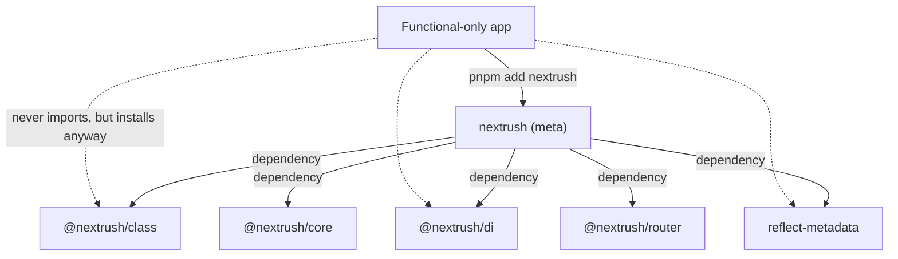
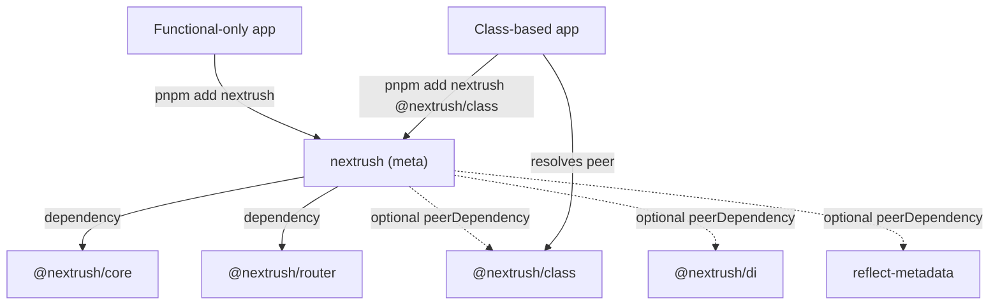

# RFC-020: Framework composition integrity — functional/class install boundary, surface naming, and manifest discipline

| Field                | Value                                                                 |
| -------------------- | --------------------------------------------------------------------- |
| **Status**           | `Shipped` |
| **RFC number**       | `020` |
| **Date**             | `2026-07-22` |
| **Author(s)**        | Framework Architecture Review |
| **Group**            | `framework-composition` |
| **Packages touched** | `nextrush`, `@nextrush/class`, `@nextrush/di`, `create-nextrush`, and every publishable package's manifest |
| **Framework impact** | `Breaking (needs minor + migration) — two independent breaking changes; see §12` |
| **Supersedes**       | `—` |
| **Superseded by**    | `—` |
| **Related**          | `ADR-0005`, `ADR-0009`, `docs/RFC/class-runtime/006-di-container-ownership.md` |

---

## Progress Tracker

**Overall:** `[████████████████████]` 100% — 4 / 4 phases complete · Doc status: `Shipped`

| Phase | Part / deliverable                     | Status         |
| ----- | --------------------------------------- | -------------- |
| P0    | RFC + ADR approved; peer-install matrix confirmed | ✅ Done |
| P1    | Manifest lock + postinstall removal + `RouteMetadata` rename | ✅ Done |
| P2    | Functional install optional peers (BREAKING)      | ✅ Done |
| P3    | Docs reconciliation + changeset + migration guide | ✅ Done |

---

## 0. Revision History

- **v1 (2026-07-22)** — Initial draft, approved same-day following
  `report/framework/framework-composition-review.md`.
- **v2 (2026-07-22)** — Addendum (§21) — the meta-package now ships a thin `bin` launcher to
  fulfill this RFC's already-committed "actionable dev-CLI discovery" scenario. Records the
  first-ever `bin` field on `nextrush` and its coexistence with `@nextrush/dev`'s bin. Governed by
  ADR-0013; implemented by the `dev-cli-discoverability` OpenSpec change. No §1–20 decision changes
  meaning.

---

## 1. Summary (TL;DR)

The `nextrush` meta-package's stated promises — "install only what you need", "zero-dependency
functional core" — hold at runtime but not at install time: every `nextrush` install downloads
the entire class/DI stack regardless of paradigm, a public type name (`RouteMetadata`) means two
different things depending on which subpath it's imported from, and the published README
documents exports that do not exist. This RFC establishes the `framework-composition` capability
— the durable contract for how NextRush's packages compose into one installable framework — and
ratifies the fix: move the class/DI stack to optional peer dependencies, rename the colliding
type, remove the install-time script, and lock all of it with tests so it cannot silently re-drift.

---

## 2. Decision Summary

- **Status:** `Approved`
- **Decision:**
  - _Introduce_ the `framework-composition` capability (`openspec/specs/framework-composition/`)
    and two `public-surface-lock` requirements (cross-subpath type coherence, README↔surface accuracy).
  - _Change_ `nextrush`'s `@nextrush/class`, `@nextrush/di`, and `reflect-metadata` from hard
    `dependencies` to optional `peerDependencies`.
  - _Rename_ `@nextrush/class`'s `RouteMetadata` interface to `ControllerRouteMetadata` (deprecated
    alias for one minor).
  - _Remove_ the `postinstall` script from `nextrush`.
  - _Keep_ the functional `.` runtime surface, `createApp` semantics, and all router/adapter/
    middleware runtime behavior unchanged.
- **Breaking:** `Yes — two independent breaking changes, see §12`
- **Migration required:** `Yes — one line each: 'pnpm add @nextrush/class' for class users;
  'import { ControllerRouteMetadata }' for the renamed type. See §12.`
- **Blast radius:** `medium` — no runtime behavior changes; the install graph and one type name change.

---

## 3. Problem & Motivation

### 3.1 Current state (what exists today)

```jsonc
// packages/nextrush/package.json — TODAY
"dependencies": {
  "@nextrush/adapter-node": "workspace:*",
  "@nextrush/class": "workspace:*",     // ← hard dep, even for functional-only users
  "@nextrush/core": "workspace:*",
  "@nextrush/di": "workspace:*",        // ← hard dep
  "@nextrush/errors": "workspace:*",
  "@nextrush/router": "workspace:*",
  "@nextrush/types": "workspace:*",
  "reflect-metadata": "^0.2.2"          // ← hard dep
}
```

```ts
// import { RouteMetadata } from 'nextrush'         → @nextrush/types shape (request/responses/tags)
// import { RouteMetadata } from 'nextrush/class'   → @nextrush/class shape (method/path/propertyKey)
// Same name, two disjoint shapes, no compiler warning.
```

```md
<!-- packages/nextrush/README.md — TODAY -->
import { VERSION } from 'nextrush';           <!-- VERSION is not exported; not in src/index.ts -->
console.log(VERSION); // '3.0.5'
...
`catchAsync` — plus the deprecated catchAsync   <!-- catchAsync was REMOVED, docs site marks it so -->
```

### 3.2 The problems (enumerated)

1. **Functional install carries the class/DI stack** — `pnpm add nextrush` for a purely functional
   app resolves `@nextrush/class`, `@nextrush/di`, `tsyringe`, and `reflect-metadata` onto disk and
   into the lockfile, even though the `.` entry's runtime import graph never loads any of them
   (verified: `src/index.ts` imports only `core`/`router`/`adapter-node`/`errors`/`types`).
2. **`RouteMetadata` name collision** — the renderer-facing contract (`@nextrush/types`) and the
   decorator-storage internal (`@nextrush/class`) share one name across two subpaths of the same
   package, violating "every capability has exactly one owner" and leaking implementation detail
   (`propertyKey`, `methodName`) through a public barrel.
3. **README documents non-existent/removed exports and withdrawn numbers** — `VERSION` (never
   exported, intentionally, for edge-runtime compatibility), `catchAsync` (removed), and specific
   benchmark RPS figures the root README itself says were withdrawn pending re-measurement.
4. **A `postinstall` script executes on every install** — solely to print an advisory notice about
   the optional `@nextrush/dev` CLI, invisible under `--ignore-scripts` and a standing supply-chain
   review flag regardless.
5. **Manifest incoherence** — `@nextrush/class` declares `@nextrush/core`/`@nextrush/router` as
   both a `dependency` and a required `peerDependency`; the non-standard `module` field is applied
   inconsistently across sibling packages; the meta's `tsup` `target: 'node20'` sits below its own
   `engines.node: ">=22.0.0"` floor; `packages/nextrush/bin/` is an empty, dead directory.

### 3.3 Why now

The review that surfaced these (`report/framework/framework-composition-review.md`) found the
structural core sound but these defects concentrated at the exact surfaces a new adopter meets
first — the npm README, the install command, the type surface. Every release that adds an export
without updating the README, or that grows `@nextrush/class`, widens the gap. Fixing it now, while
the surface is still small (34 runtime symbols, one meta package), is materially cheaper than after
more consumers depend on the current (accidental) shape.

---

## 4. Goals & Non-Goals

### 4.1 Goals

- A functional-only `nextrush` install resolves with zero class/DI/tsyringe/reflect-metadata
  packages on disk (maps to problem 3.2.1).
- `RouteMetadata` resolves to exactly one shape across every subpath of every package; the
  class-specific shape gets its own name (3.2.2).
- The published README never documents an export absent from the locked surface (3.2.3).
- `nextrush` declares zero install-lifecycle scripts (3.2.4).
- Every publishable package manifest follows one canonical, locked shape (3.2.5).

### 4.2 Non-Goals

- No change to the functional `.` runtime surface or `createApp` semantics — this is a packaging
  and naming fix, not a behavior change.
- No barreling of satellite packages (middleware, extensions) into the meta — discoverability is
  solved out-of-band (a catalog), not by growing the meta surface.
- No re-introduction of a `VERSION` export — its omission is deliberate (edge-runtime compatibility,
  no `node:fs`) and out of scope for this RFC to reverse.
- No re-architecture of `@nextrush/di` or `@nextrush/class` internals.

---

## 5. Impact

- **Affected packages:** `nextrush`, `@nextrush/class`, `@nextrush/di` (referenced, not modified),
  `create-nextrush`, and every publishable package's `package.json` (manifest shape).
- **Affected audiences:** Application developers (functional-only installers see a smaller
  footprint; class-based installers gain one explicit install step), plugin/middleware authors
  (manifest convention), contributors (new capability to read/extend).
- **Explicitly NOT affected:** router/adapter/middleware runtime behavior; the `.` functional
  runtime surface; existing class-based applications that keep `@nextrush/class` installed
  (no code change required beyond the deprecated-alias window for `RouteMetadata`).

---

## 6. Proposed Solution (overview)

| # | Problem (from §3.2)                          | Solution (this RFC)                                                      |
| - | --------------------------------------------- | -------------------------------------------------------------------------- |
| 1 | Functional install carries class/DI          | Move `@nextrush/class`, `@nextrush/di`, `reflect-metadata` to optional peers |
| 2 | `RouteMetadata` collision                     | Rename the class-side type to `ControllerRouteMetadata` + deprecated alias  |
| 3 | README documents non-existent/removed exports | Rewrite README from template; add a README↔surface CI guard                |
| 4 | `postinstall` script on every install         | Remove the script; move discovery to README + scaffolder + CLI message     |
| 5 | Manifest incoherence                          | One canonical manifest shape, locked by a repo test                        |

The unifying idea: every fix pairs a **correction** with a **lock test**, so none of these five
problems can silently reopen on a future release. This is the `framework-composition` capability's
whole reason to exist — without an owning capability, exactly this kind of drift has no home to be
caught in.

---

## 7. Architecture

### 7.1 Before



### 7.2 After



### 7.3 Why this architecture

Optional peer dependencies are the correct primitive here — unlike `optionalDependencies` (still
auto-installed when resolvable), an optional `peerDependency` is never installed unless the
consumer explicitly adds it, which is exactly the "pay for what you use" property the functional
core already has at the import level (`.kiro/steering/architecture.instructions.md`'s package
hierarchy already treats `class`/`di` as sitting above `core`/`router` — this RFC makes the
*install* graph agree with that layering, not just the *import* graph).

---

## 8. Detailed Design

### 8.1 Public API / surface

```jsonc
// packages/nextrush/package.json — AFTER
"peerDependencies": {
  "@nextrush/class": "workspace:*",
  "@nextrush/di": "workspace:*",
  "reflect-metadata": "^0.2.2"
},
"peerDependenciesMeta": {
  "@nextrush/class": { "optional": true },
  "@nextrush/di": { "optional": true },
  "reflect-metadata": { "optional": true }
}
```

```ts
// packages/class/src/types.ts — AFTER
/** @deprecated Use ControllerRouteMetadata. Removed in the next major. */
export type RouteMetadata = ControllerRouteMetadata;
export interface ControllerRouteMetadata { /* unchanged fields */ }
```

### 8.2 Internal components

- **`nextrush/src/class.ts`** — unchanged import surface (still imports from `@nextrush/di` and
  `@nextrush/class` directly); only the *manifest* declaration of those two packages changes
  (dependencies → optional peers). See the finding in §8.6 for why the barrel is not re-routed.
- **`nextrush/src/index.ts` (`.` entry)** — untouched; already imports nothing from `di`/`class`.
- **A resolution guard** in `nextrush/src/class.ts` (or a thin wrapper) that catches the
  module-not-found case for `@nextrush/class`/`reflect-metadata` and re-throws with an actionable
  message naming the exact install command.

### 8.3 Request / execution flow

```text
pnpm add nextrush (functional)  → resolves core+router+adapter-node+errors+types only
pnpm add nextrush @nextrush/class (class)  → resolves the above + class + di + tsyringe + reflect-metadata
import 'nextrush/class' (peer missing)  → actionable error naming @nextrush/class + install command
```

### 8.4 Data structures

N/A — no new runtime data structures; this is a manifest and naming change.

### 8.5 Error handling

The `nextrush/class` resolution guard throws a standard `Error` (not an `HttpError` — this fires
at module-load time, before any request context exists) with a message of the form:
`"nextrush/class requires @nextrush/class (and reflect-metadata) as optional peer dependencies. Install them: pnpm add @nextrush/class reflect-metadata"`.

### 8.6 Edge cases

| Scenario                                                          | Behaviour                                                            |
| ------------------------------------------------------------------ | ---------------------------------------------------------------------- |
| `@nextrush/class`'s barrel does not re-export the full DI surface (`Config`, `delay`, `Injectable`, `Optional`, `Token`, etc. — **confirmed missing** by direct inspection of `packages/class/src/index.ts`, which re-exports only `Repository, Service, container, createContainer, inject, Container`) | **Decided (not deferred):** `nextrush` declares all three — `@nextrush/class`, `@nextrush/di`, `reflect-metadata` — as optional peers, and `class.ts` keeps importing directly from both `@nextrush/di` and `@nextrush/class` as it does today. Routing everything through `@nextrush/class`'s barrel alone would silently drop `Config`/`delay`/`Injectable`/`Optional` and the DI type exports from the public surface — an undeclared breaking change this RFC does not authorize. This resolves design Open Question 2 and the D2 fallback clause definitively. |
| A user installs `@nextrush/di` without `@nextrush/class`           | Works: `nextrush/class`'s DI-only re-exports resolve; decorator/controller re-exports throw the resolution guard's error naming `@nextrush/class` specifically. |
| Old lockfile from before this change is reused                     | `@nextrush/class`/`di`/`reflect-metadata` remain present (peer resolution doesn't remove already-installed packages) — no breakage; footprint only shrinks on a fresh install or explicit lockfile regeneration. |

### 8.7 Examples

```ts
// Functional-only project (AFTER) — unchanged usage, smaller install
import { createApp, listen } from 'nextrush';
const app = createApp();
listen(app, 8080);
```

```ts
// Class-based project (AFTER) — one explicit extra install
// pnpm add nextrush @nextrush/class
import { createApp, listen } from 'nextrush';
import { Controller, Get, ControllerRouteMetadata } from 'nextrush/class';
```

---

## 9. Alternatives Considered

### 9.1 Keep the monolithic install; only fix the documentation claim
Soften "install only what you need" in the docs to acknowledge the meta bundles both paradigms.
**Rejected:** zero-effort but permanently forfeits the framework's stated differentiator to save
one install step for class users; the review's own framing (D2 in the design doc) judged the
promise worth making true rather than worth abandoning.

### 9.2 Do nothing
Leave the footprint, the naming collision, and the README as-is.
**Rejected:** every future release without this fix widens the gap between what NextRush claims
and what it ships; the `tsyringe`/`reflect-metadata` supply-chain exposure keeps affecting
functional-only users who never execute that code.

---

## 10. Rejected Ideas

- **Use `optionalDependencies` instead of optional `peerDependencies`** — Rejected because
  `optionalDependencies` still auto-installs when resolvable (which it always is, inside this
  monorepo/registry), so it would not shrink the footprint at all.
- **Unexport `RouteMetadata` from `@nextrush/class` entirely instead of renaming** — Rejected
  because some downstream tooling may already import it; deprecate-then-remove is lower-risk and
  ends at the same encapsulation outcome one minor later.
- **Re-export `@nextrush/stream` via a new `nextrush/stream` subpath** — Rejected (out of scope for
  this RFC's install-boundary focus; tracked as a documented-but-deferred finding, not a naming or
  install-graph decision this RFC needs to make).

---

## 11. Risks & Mitigations

| Risk                                                                 | Mitigation                                                                 | Likelihood | Impact |
| ---------------------------------------------------------------------- | ----------------------------------------------------------------------------- | ---------- | ------ |
| Optional peers behave inconsistently across npm/pnpm/yarn versions      | Confirm the matrix in §12 before implementation; the resolution guard is the universal backstop regardless of package-manager behavior | Medium     | Medium |
| Manual (non-scaffolded) class users miss the new install step           | Actionable resolution-guard error naming the exact command; migration guide; changeset note | Medium     | Low    |
| `RouteMetadata` rename breaks an external consumer's type import        | One-minor `@deprecated` alias before removal                                | Low        | Low    |
| README↔surface / manifest lock tests are too strict and flag false positives | Scope checks to import examples + exports tables / enumerated canonical fields only, not free prose | Low        | Low    |

---

## 12. Backward Compatibility & Migration

- **Compatibility:** `Breaking — two independent changes, each ships in a minor with a deprecation/
  migration note (per this repo's changeset-driven semver practice; ADR-0009 §Consequences records
  the exact version placement).`
- **Migration path:**

  ```bash
  # Before: class-based app — nextrush alone was sufficient
  pnpm add nextrush

  # After: class-based app needs one explicit peer install
  pnpm add nextrush @nextrush/class
  ```

  ```ts
  // Before
  import type { RouteMetadata } from 'nextrush/class';

  // After
  import type { ControllerRouteMetadata } from 'nextrush/class';
  // `RouteMetadata` still resolves for one minor via a @deprecated alias.
  ```

- **Deprecation window:** the `RouteMetadata` alias carries `@deprecated` JSDoc from the moment it
  ships and is removed in the next major; the install-boundary change has no alias (a manifest
  change cannot be aliased) — it is communicated via changeset + migration guide instead.

---

## 13. Cross-Cutting Concerns

- **Security:** removing the `postinstall` script eliminates an install-time code-execution
  surface; the optional-peer change reduces the `tsyringe`/`reflect-metadata` supply-chain exposure
  for functional-only installs (fewer packages resolved → smaller `npm audit` surface).
- **Performance:** none — no runtime path changes; tree-shaking of the `.` entry is unaffected
  (it already excluded `class.js` via `sideEffects`).
- **Runtime independence:** unaffected — this RFC does not touch adapter or runtime-detection code.
- **Observability:** N/A — no new logging; the resolution guard's error message is the only new
  observable signal, and it is not sensitive.
- **Zero-dependency rule:** this RFC *reduces* the effective dependency footprint for the majority
  (functional) use case; no new runtime dependency is introduced anywhere.

---

## 14. Success Metrics

| Metric                                              | Baseline (today)                                   | Target / threshold                                          |
| ---------------------------------------------------- | ---------------------------------------------------- | --------------------------------------------------------------- |
| Packages resolved by a functional-only `nextrush` install | includes `@nextrush/class`, `@nextrush/di`, `tsyringe`, `reflect-metadata` | excludes all four |
| `RouteMetadata` name collisions across subpaths       | 1 (types vs class)                                    | 0                                                                |
| README-documented exports absent from locked surface  | 2 (`VERSION`, `catchAsync`)                           | 0, enforced by CI                                                |
| Publishable packages with an install-lifecycle script | 1 (`nextrush`)                                        | 0                                                                |
| Test coverage                                         | —                                                     | 90%+ lines/functions on every touched package                   |

---

## 15. Phased Implementation Plan

| Phase | Goal (what ships)                                            | Depends on | Exit condition (checkable)                                              | Status         |
| ----- | -------------------------------------------------------------- | ---------- | --------------------------------------------------------------------------- | -------------- |
| **P0** | This RFC + governing ADR approved; peer-install matrix confirmed | —          | RFC Status = Approved; ADR Status = Accepted; matrix recorded in §18/ADR   | ✅ Done         |
| **P1** | Canonical manifest lock, postinstall removal, `RouteMetadata` rename | P0    | Three lock tests green (manifest, no-install-script, cross-subpath coherence) | ⬜ Not started  |
| **P2** | Functional install optional peers (the BREAKING install-graph change) | P1    | Install-graph test green; subpath resolution-guard test green               | ⬜ Not started  |
| **P3** | README rewrite + README↔surface guard + changeset + migration guide | P2    | README↔surface test green; `openspec validate --strict` passes              | ⬜ Not started  |

### 15.1 Testing strategy

- **Unit:** resolution-guard error message; `RouteMetadata`/`ControllerRouteMetadata` type-surface
  compile checks.
- **Integration:** a fresh-install test asserting the resolved dependency tree for a functional-only
  consumer excludes the class/DI stack; a class-based scaffold install test.
- **Coverage:** 90%+ lines/functions on every touched package (CI-enforced).

---

## 16. Rollback Plan

- **Trigger:** a package manager in the confirmed matrix (§18) is found to auto-install an optional
  peer against the documented behavior, defeating the footprint reduction; or the resolution guard
  produces false positives in the wild.
- **Steps:**
  - Revert `packages/nextrush/package.json`'s peer declaration to a hard `dependency` (single-file
    revert).
  - Keep the `RouteMetadata`→`ControllerRouteMetadata` rename and its alias regardless — it is
    independently correct and not coupled to the install-boundary rollback.
  - No persisted state, migration, or published-tag cleanup is involved.

---

## 17. Future Work

- A `nextrush/stream` subpath or equivalent, if satellite-package discoverability work later
  concludes the meta surface should grow — deliberately deferred, see Rejected Ideas §10.
- Extending the canonical-manifest lock test to cover additional conventions as they're identified.

---

## 18. Open Questions

- [x] _Does `@nextrush/class`'s barrel re-export the complete DI surface currently re-exported by
  `nextrush/class.ts`?_ — **Resolved during RFC authoring, see §8.6**: no, it re-exports only
  `Repository, Service, container, createContainer, inject, Container`, missing `Config`, `delay`,
  `Injectable`, `Optional`, and the DI type exports. Decision: declare all three packages as
  optional peers; do not route through `@nextrush/class`'s barrel.
- [ ] _Exact package-manager matrix for optional-peer non-installation_ (npm 7/8/9/10, pnpm 8/9,
  yarn 1/3/4) — to be confirmed and recorded in the governing ADR before P2 implementation begins.

---

## 19. Decisions Log

| Question                                                            | Decision                                                                 | Rationale                                                                      |
| ----------------------------------------------------------------------- | --------------------------------------------------------------------------- | ----------------------------------------------------------------------------------- |
| Optional peers vs. keep monolithic install + soften docs claim         | Optional peers (make the promise true)                                    | The install-graph gap contradicts the framework's stated differentiator; fixing it is worth one extra install step for class users |
| Route `nextrush/class` through `@nextrush/class`'s barrel alone, or declare 3 peers | Declare all three (`@nextrush/class`, `@nextrush/di`, `reflect-metadata`) as optional peers | `@nextrush/class`'s barrel does not re-export the full DI surface (`Config`/`delay`/`Injectable`/`Optional`/types) — routing through it alone would silently break the public surface |
| Rename vs. unexport the colliding `RouteMetadata`                      | Rename to `ControllerRouteMetadata` with a one-minor deprecated alias      | Lower risk for any existing external consumer than an immediate removal            |
| `optionalDependencies` vs optional `peerDependencies`                  | Optional `peerDependencies`                                                | `optionalDependencies` still auto-installs when resolvable — does not shrink the footprint |

---

## 20. References

- `report/framework/framework-composition-review.md` — the review that surfaced all five problems.
- `docs/adr/ADR-0009-framework-composition-and-functional-install-boundary.md` — the governing ADR.
- `docs/adr/ADR-0005-package-tiers-sealed-surface-deprecation.md` — the package-tier policy this
  RFC's ADR extends.
- `docs/RFC/class-runtime/006-di-container-ownership.md` — prior art on DI container ownership,
  relevant to why a single `reflect-metadata`/`tsyringe` instance is preserved by this change.
- `openspec/changes/framework-composition-integrity/` — the OpenSpec change implementing this RFC.

---

## 21. Addendum (v2) — the meta-package's `bin` launcher

This section records an implementation that fulfills a scenario §1–20 already committed to; it
changes no decision above, it makes a committed one true.

### 21.1 What this addendum adds

§6 (row 4) moved dev-CLI discovery off the removed `postinstall` script onto "README + scaffolder
+ **CLI message**". The CLI-message half was specified but unimplemented: `nextrush` shipped **no
`bin` at all**, so there was nothing to print a message when `@nextrush/dev` was absent — the only
package that could print it (`@nextrush/dev`) is the one that might be missing. This addendum adds
the missing piece: `nextrush` ships its own thin `bin` launcher (`bin: { nextrush }`) that resolves
`@nextrush/dev`'s CLI, delegates in-process on success, and prints an actionable,
package-manager-aware install message on absence. This is the **first `bin` field the meta-package
has ever declared**.

### 21.2 Coexistence with `@nextrush/dev`'s bin (investigated, not assumed)

`@nextrush/dev` already declares `bin: { nextrush, nextrush-dev }`. A spike (pnpm 11.10) confirmed
two installed packages declaring the same `nextrush` bin name is **benign**: the install succeeds
with no error and no warning, and pnpm links one of the two. Because both bins route to
`@nextrush/dev`'s `cli()` when it is present, the full-install outcome is identical regardless of
which links; and when `@nextrush/dev` is absent, only the meta declares `nextrush`, so its launcher
links deterministically and prints the discovery message. `@nextrush/dev`'s manifest is therefore
left unchanged — restructuring its bin surface belongs to the `dev-tooling` capability, not this
composition change.

### 21.3 Manifest-lock update

The `package-manifest`/`no-install-script` lock tests previously asserted `nextrush` declares **no**
`bin` (to avoid the then-unresolved bin-link question). This addendum reverses that specific
assertion for the meta-package: the lock now asserts the `bin` **exists**, points to a file present
in `files`, and that file is **not** wired to any `install`/`preinstall`/`postinstall` script — the
"no install-time execution" invariant is preserved, only the "no bin" assertion is superseded.

### 21.4 Governance

Recorded as **ADR-0013** (ADR-0012 is taken by the bounded-teardown decision). Implemented by the
`dev-cli-discoverability` OpenSpec change, which adds the launcher's own delegate-or-explain
requirement to the `framework-composition` capability spec.
