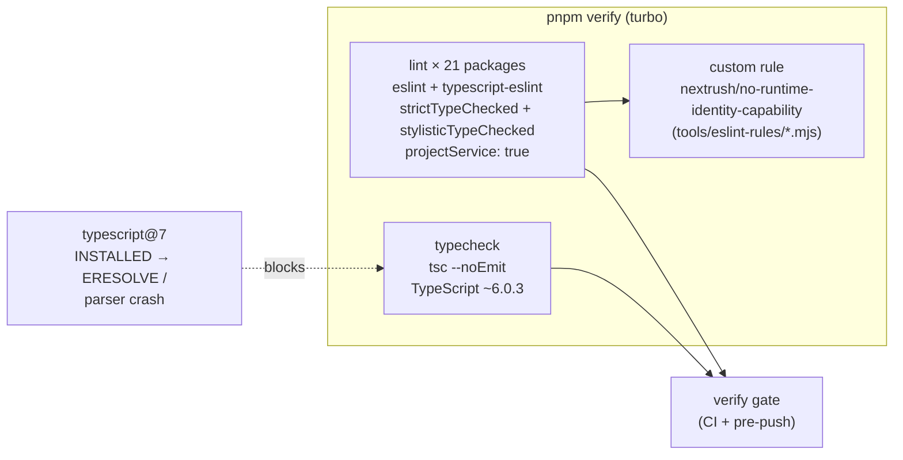
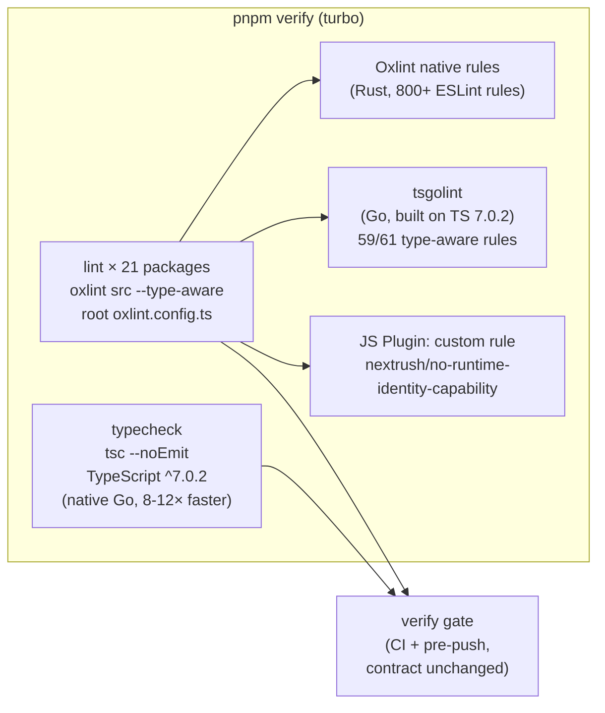

# RFC-037: Repo toolchain — TypeScript 7 adoption via Oxlint (replace ESLint + typescript-eslint)

| Field                | Value                                                                 |
| -------------------- | --------------------------------------------------------------------- |
| **Status**           | `Draft` |
| **RFC number**       | `037` |
| **Date**             | `2026-09-27` |
| **Author(s)**        | Tanzim Hossain (NextRush maintainers) |
| **Group**            | `repo-tooling` |
| **Packages touched** | none (runtime) — repo-internal tooling only: root `package.json`, `pnpm-workspace.yaml`, `eslint.config.mjs` → `oxlint.config.ts`, 21 package-level `lint` scripts, `tools/eslint-rules/*`, `apps/website` config, `create-nextrush` templates |
| **Framework impact** | `Internal-only` — no runtime/public API change; generated-project templates change for NEW scaffolds only (non-breaking) |
| **Supersedes**       | `—` |
| **Superseded by**    | `—` |
| **Related**          | — |

---

## Progress Tracker

**Overall:** `[░░░░░░░░░░░░░░░░░░░░]` 0% — 0 / 4 phases complete · Doc status: `Draft`

| Phase | Part / deliverable                                            | Status         |
| ----- | ------------------------------------------------------------- | -------------- |
| P0    | Spike: Oxlint + tsgolint on TS 6, rule-parity mapping, custom-rule JS Plugin port | ⬜ Not started  |
| P1    | Repo lint cutover — all `lint` scripts → Oxlint, ESLint removed from lint path | ⬜ Not started  |
| P2    | TypeScript 7 (`typescript@^7.0.2`) across the workspace catalog | ⬜ Not started  |
| P3    | Scaffolder, website, docs, RFC close-out                        | ⬜ Not started  |

---

## 0. Revision History

- **v1 (`2026-09-27`)** — Initial draft.

---

## 1. Summary (TL;DR)

NextRush cannot adopt TypeScript 7 while its lint pipeline is ESLint: `typescript-eslint@8.70.1`
(latest, 2026-09-21) declares `peerDependencies.typescript: ">=4.8.4 <6.1.0"`, so installing
`typescript@7` either fails resolution or crashes the parser
(`TypeError: Cannot read properties of undefined (reading 'Cjs')`), and ESLint core's own TS 7
upgrade (eslint/eslint#21070) is openly "blocked on typescript-eslint" with no timeline. This RFC
proposes migrating the monorepo's lint pipeline to **Oxlint + tsgolint** — built directly on
TypeScript 7.0.2, covering 59 of the 61 `typescript-eslint` type-aware rules, and benchmarked
12–18× faster than ESLint + typescript-eslint — then bumping the workspace catalog to
`typescript@^7.0.2`. The payoff is adopting TS 7 now (8–12× faster type-checking) with type-aware
enforcement *kept*, at the cost of a one-time config rewrite, an alpha dependency (Oxlint JS
Plugins, which hosts our custom rule), and a rule-behavior triage pass.

---

## 1a. Terminology

`tsgolint`
: The Go-based type-aware lint engine shipped as `oxlint-tsgolint`; builds TypeScript programs via
  `typescript-go` and executes the `typescript/*` type-aware rules, returning diagnostics to Oxlint.
  Its version encodes its TypeScript version (`7.0.2003` = built for TS 7.0.2, patch 003).

`type-aware linting`
: Lint rules that require resolved type information (e.g. "is this expression a Promise?"), as
  opposed to pure-syntax rules that need only the AST.

`JS Plugin`
: Oxlint's ESLint-compatible plugin host (currently **alpha**) that runs existing ESLint plugins
  and repo-local custom rules inside Oxlint via the `jsPlugins` config key.

`capability-exempt`
: The existing in-source annotation (`// capability-exempt: <reason>`) that our custom rule
  `nextrush/no-runtime-identity-capability` honors to allow genuine platform optimizations —
  behavior that must survive the migration unchanged.

## 2. Decision Summary

- **Status:** `Draft`
- **Decision:**
  - **Introduce** `oxlint` + `oxlint-tsgolint` (catalog `tooling`) as the monorepo's linter,
    with type-aware rules enabled and a root `oxlint.config.ts` derived from the current
    `eslint.config.mjs`.
  - **Port** the custom rule `nextrush/no-runtime-identity-capability` (+ its `RuleTester`
    fixtures) to an Oxlint JS Plugin, preserving all existing semantics and `capability-exempt`
    behavior.
  - **Bump** `catalog:tooling.typescript` from `~6.0.3` → `^7.0.2` and fix `tsconfig.base.json`
    for TS 7 (`ignoreDeprecations: "6.0"`, `ts5to6` validation).
  - **Remove** `typescript-eslint` / `@typescript-eslint/*` / `eslint-config-prettier` / `@eslint/js`
    from the lint path; `eslint` retained only as a devDependency for the custom rule's
    `RuleTester` harness if the fixture port (P0 decision) requires it.
  - **Keep** Prettier as formatter, turbo task names (`lint`/`lint:fix`/`typecheck`/`verify`),
    `pnpm verify`'s contract, and all `// eslint-disable` directives (Oxlint honors `eslint-*`
    suppression syntax natively).
- **Breaking:** `No` — repo-internal tooling; no runtime/public API change. New scaffolds get a
  different lint setup (template change, covered by the existing installable-output guarantee).
- **Migration required:** `None` for framework consumers; contributors run the same commands
  (`pnpm lint`, `pnpm verify`) after `pnpm install`.
- **Blast radius:** `medium` — ~30 config/script files + templates + docs, zero request-path code.

---

## 2a. Decision Drivers

Priority (highest → lowest):

1. **Adopt TypeScript 7 now** — the user-facing goal; TS 7.0.2 is npm `latest` since 2026-07-08
   and gives 8–12× faster `tsc`/typecheck across `pnpm verify`.
2. **Keep type-aware enforcement** — AGENTS.md §14 ("Testing defines trust"): `no-floating-promises`,
   `no-misused-promises`, `prefer-nullish-coalescing` etc. are release gates today; a faster linter
   that silently drops them is not an upgrade.
3. **Preserve the custom architecture rule** — `nextrush/no-runtime-identity-capability` enforces
   RFC/ADR-R6 (capability negotiation) repo-wide; losing or weakening it is unacceptable.
4. **Zero runtime impact** — tooling-only change; runtime packages, adapters, conformance suite
   untouched (AGENTS.md §7 runtime independence unaffected).
5. **Reversibility** — phased, atomic commits so any phase can be reverted independently.
6. **Long-term maintainability** — align with where the ecosystem is going (TS-native tooling),
   not with a dead-end TS 6 + blocked-typescript-eslint pairing.

## 3. Problem & Motivation

### 3.1 Current state (what exists today)

```yaml
# pnpm-workspace.yaml — catalog:tooling (2026-09-27)
typescript: "~6.0.3"      # ← last TS 6 line; TS 7.0.2 has been npm `latest` since 2026-07-08
eslint: "^9.39.5"
"@eslint/js": "^9.39.5"
```

```jsonc
// root package.json devDependencies (abridged)
"@typescript-eslint/eslint-plugin": "^8.66.0",
"@typescript-eslint/parser": "^8.66.0",
"typescript-eslint": "^8.66.0",
"eslint-config-prettier": "^10.1.8"
```

```js
// eslint.config.mjs — the gate that must be preserved, behavior-wise
...tseslint.configs.strictTypeChecked,
...tseslint.configs.stylisticTypeChecked,
// + explicit overrides: no-explicit-any: error, no-non-null-assertion: warn,
//   prefer-nullish-coalescing / prefer-optional-chain / no-floating-promises /
//   await-thenable / no-misused-promises: error, require-await: warn, …
// + custom rule nextrush/no-runtime-identity-capability on packages/**/src/**/*.ts
```

- **21 package-level `lint` scripts** run `eslint src --ignore-pattern '**/__tests__/**'`
  (20 packages + `apps/website`; root's `lint` is `turbo run lint`); turbo `lint` depends on
  `build` and feeds `verify`, which CI (`.github/workflows/ci.yml`) and the pre-push hook both run.
- **89 `eslint-disable*` directives (70 of them `-next-line`, plus 4 matching `eslint-enable`) across 51 source files** (`packages/`, `scripts/`, `tools/`) — verified 2026-09-28.
- `tsconfig.base.json` sets `"ignoreDeprecations": "6.0"` plus
  `experimentalDecorators`/`emitDecoratorMetadata` (required by the `class` DI package).

### 3.2 The problems (enumerated)

1. **TypeScript 7 is hard-blocked by the ESLint stack.** `typescript-eslint@8.70.1` — the latest
   release, 2026-09-21 — peer-depends on `typescript >=4.8.4 <6.1.0`. Reproduction evidence
   (typescript-eslint#12518): `npm ci` fails with `ERESOLVE`, and forcing the install crashes ESLint
   at `@typescript-eslint/typescript-estree/dist/create-program/shared.js` with
   `TypeError: Cannot read properties of undefined (reading 'Cjs')`. Our own lint cannot run on TS 7.
2. **No upstream timeline to wait for.** eslint/eslint#21070 ("Update to TypeScript 7") is
   `accepted` but states: "*eslint, rewrite, and js are currently blocked on typescript-eslint
   adding TypeScript 7 support*" — the blocker is the same project, which has published no TS 7
   support through 8.70.1. Waiting is indefinite.
3. **The current typed-lint path is the slow part of every verify.** ESLint + typescript-eslint
   cold lint is measured at 12–18× slower than tsgolint on real codebases (vscode 83.2s → 6.96s;
   typeorm 13.2s → 0.75s; vuejs/core 12.3s → 0.95s — oxc benchmark, M4 Pro). Every turbo `lint`
   task pays the type-checker-per-package cost; `verify` (build+test+typecheck+lint) is the
   CI/push critical path.
4. **Staying on TS 6 is a dead end.** `~6.0.3` is the terminal TS 6 line; `typescript-eslint`'s
   supported window is `<6.1.0`, so even a future TS 6.x-plus is closed. Meanwhile TS 7 brings
   8–12× faster full builds to `pnpm typecheck` — a gain we currently cannot take.

### 3.3 Why now

TS 7.0 shipped 2026-07-08 (stable `7.0.2`); Oxlint's type-aware linting went **stable on
2026-07-22** specifically as `tsgolint v7`, tracking TypeScript v7.0.2, and `oxlint-tsgolint@7.0.2003`
published 2026-09-24. Oxlint JS Plugins (the host for local custom rules) reached alpha with a
100% pass rate on ESLint's own 33,006-rule test suite. The toolchain needed to replace ESLint
*without losing typed rules* is now real; three months ago it wasn't. Every week on TS 6 deepens
the split between the compiler we could run and the linter we must run.

## 4. Goals & Non-Goals

### 4.1 Goals

- **G1** — `pnpm typecheck` runs on `typescript@^7.0.2` workspace-wide; all typecheck/build/test
  gates green (problems 3.2.1, 3.2.4).
- **G2** — Type-aware linting remains enforced in CI: every type-aware rule currently active in
  `strictTypeChecked` + the explicit override block is either mapped to an Oxlint/tsgolint rule or
  has a documented N/A with rationale — **100% mapping coverage, zero silent drops** (problem 3.2.2).
- **G3** — `nextrush/no-runtime-identity-capability` is enforced by Oxlint with the existing
  fixtures passing unchanged (custom-rule continuity; driver 3).
- **G4** — `pnpm verify` keeps its contract (`build` → `test` + `typecheck` + `lint`) and its
  commands (`pnpm lint`, `pnpm lint:fix`); lint wall-time ≤ baseline, expected ≫5× faster
  (problem 3.2.3).
- **G5** — `create-nextrush` generates Oxlint + TypeScript 7 for new projects and its
  installable-output CI guarantee stays green (P3).

### 4.2 Non-Goals

- **Formatter swap (Prettier → Oxfmt)** — out of scope; Prettier stays. A separate future RFC can
  evaluate Oxfmt (deferred → §17).
- **Rewriting the custom rule as a native Oxlint rule** — Oxlint has no native custom-rule surface;
  JS Plugins is the supported path (a native port would be oxc-upstream work, not ours).
- **Adopting Biome** — evaluated (§9.1), rejected for now; re-evaluate in §17.
- **Runtime code changes** — no source behavior changes beyond whatever new lint findings the
  triage pass surfaces (P1); those are fixes, not features.
- **Removing `eslint` from `devDependencies` outright** — kept, if needed, solely as the
  `RuleTester` harness for the custom rule's fixtures (P0 decision); it leaves the lint path.

---

## 5. Impact

- **Affected packages:** none at runtime. Tooling surfaces: root `package.json`,
  `pnpm-workspace.yaml` (catalog), `eslint.config.mjs` (replaced), `turbo.json` (lint input
  invalidation for the new root config), all 21 package-level `lint` scripts,
  `tools/eslint-rules/no-runtime-identity-capability.{mjs,test.mjs}`, `apps/website`
  (`eslint.config.mjs` + its `eslint-config-next` setup), `packages/create-nextrush` templates
  (`preset.ts`, `package-json.ts` toolchain range single-sourcing), docs mentioning ESLint
  (`CONTRIBUTING.md`, `AGENTS.md` lint references, package READMEs).
- **Affected audiences:** Contributors (new linter binary/config; same commands) ·
  `create-nextrush` users (new projects get Oxlint + TS 7).
- **Explicitly NOT affected:** runtime packages' published artifacts and public API · all
  adapters and the conformance suite · middleware/core request path · Prettier formatting ·
  release pipeline (`changeset`, `verify:release-state`) · existing user projects (templates only
  affect newly generated ones).

---

## 6. Proposed Solution (overview)

| # | Problem (from §3.2)        | Solution (this RFC)                          |
| - | -------------------------- | -------------------------------------------- |
| 1 | TS 7 blocked by typescript-eslint | Replace the lint engine with Oxlint + tsgolint, which is built on TS 7 — then bump the catalog to `^7.0.2` |
| 2 | No upstream timeline       | Self-serve: migrate on our schedule in phased, revertible commits (§15) |
| 3 | Slow typed lint            | tsgolint runs the same typed rules 12–18× faster; turbo task names/contract unchanged |
| 4 | TS 6 dead end              | Catalog bump to `^7.0.2` + `tsconfig` migration (`ts5to6` validation of `ignoreDeprecations: "6.0"`) |

The key idea is **order**: swap the linter *first, while still on TypeScript 6*, where today's lint
is green and any rule-behavior delta is attributable to the linter alone; *then* bump the compiler,
where any delta is attributable to TS 7. Two orthogonal changes, two clean bisect points, instead
of one entangled jump. The custom architecture rule — the one thing ESLint gives us that Oxlint
has no native equivalent for — rides across via Oxlint's ESLint-compatible JS Plugin host, keeping
its fixtures and `capability-exempt` semantics byte-for-byte.

---

## 6a. Trade-offs

### Benefits

- TS 7 adopted immediately instead of indefinitely blocked (8–12× faster typecheck in `verify`).
- Type-aware enforcement retained (59/61 typed rules; the 2 gaps identified in P0 — §18).
- Lint wall-time drops ~12–18× on the same rules (published benchmarks; measured locally in §14).
- One tool for lint + (optionally later) format; ~10 redundant ESLint-family packages removed.
- All 89 `eslint-disable*` directives keep working (`eslint-*` syntax is supported natively).

### Costs

- **One-time rewrite** of `eslint.config.mjs` → `oxlint.config.ts` with a rule-by-rule mapping
  audit (~half a day, including triage of behavior deltas).
- **Alpha dependency**: JS Plugins hosts our custom rule — API churn or edge-case bugs possible.
- **New versioning coupling**: `oxlint-tsgolint` must be bumped in lockstep with `typescript`
  (its version encodes the TS version) — one more catalog pair to keep aligned.
- **Contributor-visible change**: ESLint editor integrations stop reporting; the Oxlint VS Code
  extension must be adopted (extensions.json updated in P3).
- Rule *output* will differ in places: some `strictTypeChecked` findings won't map 1:1 (fixes or
  documented waivers needed in P1).

## 7. Architecture

### 7.1 Before



### 7.2 After



### 7.3 Why this architecture

The shape is dictated by two constraints. First, **type-aware linting needs a real TypeScript
program**, so the linter cannot be a pure-syntax tool — Oxlint delegates typed rules to tsgolint,
which embeds `typescript-go` rather than importing the (now-gone) JS compiler API that broke
typescript-eslint. Second, **our custom rule is repo policy, not a lint rule we can drop** (it
encodes RFC/ADR-R6), so the config must keep a plugin seam — Oxlint's `jsPlugins` is that seam.
Everything else (turbo task graph, `verify` contract, CI workflow, pre-push hook) is deliberately
*unchanged*: the architecture swaps the engine under the pipeline, not the pipeline.

---

## 7a. Architecture Invariants

- **Preserved:** `pnpm verify` = `build` → `test` + `typecheck` + `lint` (turbo.json contract).
- **Preserved:** `nextrush/no-runtime-identity-capability` semantics — same detections, same
  `capability-exempt:` escape hatch, same scope (`packages/**/src/**/*.ts`, tests excluded).
- **Preserved:** type-aware linting is a hard CI gate (AGENTS.md §14 — claims require verification).
- **Preserved:** AGENTS.md §7 runtime independence — a devDependency linter has no bearing on
  runtime parity; conformance suite must stay green untouched.
- **Preserved:** Prettier remains the sole formatter (`format`/`format:check` scripts unchanged).
- **Deliberately changed:** the *implementation* of the lint gate (ESLint → Oxlint) — justification:
  the gate's behavior is defined by its rule set and findings, both audited for parity in P0/P1;
  the engine is explicitly internal (not a public API).

## 8. Detailed Design

### 8.1 Public API / surface

No runtime public API. The developer-facing surface is commands and config:

```jsonc
// package.json — before / after (commands keep their names)
"lint":     "eslint src --ignore-pattern '**/__tests__/**'"        // before
"lint":     "oxlint src --type-aware"                              // after (ignores move to config)
"lint:fix": "eslint src --fix --ignore-pattern '**/__tests__/**'"  // before
"lint:fix": "oxlint src --type-aware --fix"                        // after
```

```ts
// oxlint.config.ts (root) — shape, mapped 1:1 from eslint.config.mjs
import { defineConfig } from 'oxlint';

export default defineConfig({
  options: {
    // typeAware via root config or per-package --type-aware flag; which of the
    // two survives the turbo per-package invocation is decided in P0 (see §8.6).
    reportUnusedDisableDirectives: 'off', // matches today's ESLint default posture
  },
  plugins: ['eslint', 'typescript', 'import', 'promise', 'vitest'],
  rules: {
    // explicit overrides carried over verbatim (severity preserved):
    'eslint/no-unused-vars': ['error', { argsIgnorePattern: '^_', varsIgnorePattern: '^_' }],
    'typescript/no-explicit-any': 'error',
    'typescript/no-non-null-assertion': 'warn',
    'typescript/prefer-nullish-coalescing': 'error',
    'typescript/prefer-optional-chain': 'error',
    'typescript/no-floating-promises': 'error',      // type-aware
    'typescript/await-thenable': 'error',            // type-aware
    'typescript/no-misused-promises': 'error',       // type-aware — verify in P0 (§18)
    'typescript/require-await': 'warn',              // verify in P0 (§18)
    // …strictTypeChecked / stylisticTypeChecked equivalents from the P0 mapping table
  },
  overrides: [
    {
      files: ['packages/**/src/**/*.ts'],
      ignores: ['**/__tests__/**', '**/*.test.ts'],
      jsPlugins: ['./tools/eslint-rules/oxlint-plugin.mjs'],
      rules: { 'nextrush/no-runtime-identity-capability': 'error' },
    },
  ],
  ignorePatterns: [
    '**/node_modules/**', '**/dist/**', '**/coverage/**',
    '**/.turbo/**', '.next/**', 'out/**', 'public/**', // website ignores folded in
  ],
});
```

### 8.2 Internal components

| Component | Responsibility | Notes |
| --- | --- | --- |
| `oxlint.config.ts` (root) | Single source of lint truth: rules, overrides, ignores, plugin wiring | Replaces `eslint.config.mjs`; generated once via `npx @oxlint/migrate`, then hand-tuned for parity |
| Oxlint (Rust binary) | File traversal, non-typed rules, fixes, diagnostics, suppression handling | Per-package invocation keeps turbo caching scoped exactly as today |
| `oxlint-tsgolint` (Go) | Type-aware rules via `typescript-go` programs | Version-pinned to TS (`^7.0.2` ↔ `7.0.2xxx`); requires built `.d.ts` — turbo `lint` already `dependsOn: build` |
| `tools/eslint-rules/oxlint-plugin.mjs` | Thin ESLint-plugin-shaped wrapper exporting `{ rules: { 'no-runtime-identity-capability': … } }` | Wraps the existing rule module; **no logic changes** |
| `tools/eslint-rules/no-runtime-identity-capability.test.mjs` | Fixture harness (RuleTester) | Port decision in P0: keep `eslint` devDep for RuleTester, or migrate harness to `node:test` + direct `rule.create()` |

### 8.3 Request / execution flow

```text
turbo lint (per package, dependsOn build)
  → oxlint src --type-aware
      → load root oxlint.config.ts
      → native pass (Rust rules, eslint-disable directives honored)
      → tsgolint pass (assign files → tsconfig programs → typed rules → diagnostics)
      → JS Plugin pass (nextrush/no-runtime-identity-capability)
      → non-zero exit on error-severity findings → verify gate fails → CI/push blocked
```

### 8.4 Data structures

- **Rule mapping table** (P0 deliverable, checked into `docs/RFC/repo-tooling/` alongside this
  RFC as the parity record): one row per rule in the current `eslint.config.mjs` →
  `oxlint` rule name | type-aware? | severity preserved? | notes. This is the audit artifact that
  proves G2 (no silent drops).
- **Catalog pairing:** `pnpm-workspace.yaml` `tooling` gains `oxlint` + `oxlint-tsgolint` and
  `typescript` moves to `^7.0.2`; `oxlint-tsgolint`'s version must encode the same TS minor/patch
  (documented as a catalog comment).

### 8.5 Error handling

- Findings at `error` severity → non-zero exit → turbo `lint` fails → `verify` fails → CI red /
  pre-push blocked (identical to today's failure semantics).
- `create-nextrush` keeps its `--max-warnings 0` posture via `oxlint --max-warnings 0` (flag supported).
- Unsupported/missing rules surfaced during mapping are **not** silently dropped: each gets either
  an Oxlint equivalent or an explicit `// RFC-037: no oxlint equivalent — <rationale>` entry in the
  mapping table (§8.4) — consistent with AGENTS.md §13 (outdated/silent docs are a bug).

### 8.6 Edge cases

| Scenario                    | Behaviour                                  |
| --------------------------- | ------------------------------------------ |
| `typeAware` in nested/per-package config | Oxlint rejects `options.typeAware` outside the **root** config (oxc#21426). Resolution decided in P0: prefer per-package CLI flag `--type-aware` (flag precedence is documented); fallback = root-config `typeAware: true` + package scripts without the flag if config discovery from package cwd reaches the root config |
| Root config edit doesn't invalidate package lint caches | Add `oxlint.config.ts` to turbo `globalDependencies` (today's `eslint.config.mjs` is likewise absent from `lint.inputs` — same latent gap, fixed as part of this change) |
| Monorepo type-aware needs `.d.ts` | Already satisfied: turbo `lint` `dependsOn: build` |
| Root `tsconfig` includes too much → giant tsgolint program | Root `tsconfig.json` already scoped; validate with `OXC_LOG=debug oxlint --type-aware` in P0 |
| Website (`eslint-config-next`) rules with no Oxlint `nextjs`-plugin equivalent | Fall back to keeping ESLint **scoped to `apps/website` only** until coverage verified — decided in P3 (§18) |
| `minimumReleaseAge: 10080` (7 days) in pnpm workspace | Fresh `oxlint`/`oxlint-tsgolint` releases may be younger than 7 days at install time → add to `minimumReleaseAgeExclude` or wait; verify at P0 install |
| Unused `eslint-disable` directives | Oxlint reports them only with `--report-unused-disable-directives`; default off matches today — no mass directive churn |

### 8.7 Examples

```bash
# Contributor day-to-day — unchanged commands, new engine underneath
pnpm install
pnpm lint          # 21 × oxlint instead of 21 × eslint (expect ≫5× faster wall time)
pnpm lint:fix
pnpm verify        # build → test + typecheck + lint — contract unchanged

# One-off parity/debug runs during P0
npx @oxlint/migrate eslint.config.mjs        # config translation
oxlint src --type-aware --debug timings      # per-rule cost (find typed-rule hotspots)
OXC_LOG=debug oxlint --type-aware            # program assignment sanity (§8.6)
```

---

## 9. Alternatives Considered

### 9.1 Biome v2 ("Biotype")

Biome's type-aware linting infers types **without** the TypeScript compiler — attractive
independence, but its own launch post measured `noFloatingPromises` catching only ~75% of what
typescript-eslint finds, against our requirement of enforcement parity (driver 2). Adopting Biome
also implies a formatter story (it replaces Prettier), widening the blast radius beyond lint.
**Rejected for this RFC**: higher parity risk + larger scope; re-evaluate once its inference
matures (§17).

### 9.2 Do nothing / wait for typescript-eslint TS 7 support

Cost of status quo: TS 7 adoption blocked indefinitely (eslint#21070 explicitly blocked on
typescript-eslint, which has shipped no TS 7 support through 8.70.1); continued slow typed lint;
growing divergence from `typescript@latest`. The wait has no published ETA — "do nothing" here
actually means "stay on TS 6, unless/until upstream ships."

---

## 10. Rejected Ideas

- **Hybrid run (Oxlint for speed + ESLint for the typed/custom rules)** — rejected because
  two live lint pipelines double maintenance and can disagree; and ESLint's typed path *cannot run
  on TS 7* (problem 3.2.1), so the hybrid still blocks the actual goal.
- **Wait for Oxlint JS Plugins to leave alpha before porting the custom rule** — rejected: blocks
  the whole migration on an unrelated timeline; the plugin host passes 100% of ESLint's rule-test
  suite, and our fixtures run in CI to catch regressions immediately.
- **Translate all 89 `eslint-disable` comments to `oxlint-disable` syntax** — rejected as churn:
  `eslint-*` suppression is supported natively; the rename can happen opportunistically later.
- **Pin TS 6 + rewrite lint stack anyway, upgrade TS later** — rejected: inverts the risk order;
  running the new linter against the *new* compiler in a separate phase is what keeps deltas
  attributable (§6).
- **Move formatting to Oxfmt now** — rejected: two format churns (diff noise, review fatigue) in
  one migration; formatter swap gets its own RFC (§17).

## 11. Risks & Mitigations

| Risk                     | Mitigation                        | Likelihood | Impact |
| ------------------------ | --------------------------------- | ---------- | ------ |
| JS Plugin host (alpha) misbehaves on our custom rule | Fixtures run in CI from day one (G3); fallback = temporary standalone AST check script in `verify` if the host regresses | Medium | High |
| Typed-rule parity gap — the 2 of 61 missing tsgolint rules turn out to be rules we actively use | Identified in P0 mapping (§18); mitigations: keep that rule's coverage via `--type-check` overlap, a narrowly-scoped ESLint remnant, or a documented waiver in the mapping table | Medium | Medium |
| New findings from Oxlint's rule semantics differ from typescript-eslint (false positives/negatives) | Linter swap happens on TS 6 where baseline is green; P1 triage pass; severities preserved 1:1 | High | Low |
| `typeAware` root-only constraint fights turbo's per-package invocation | Decided in P0 with a concrete spike (§8.6); fallback options pre-identified | Medium | Medium |
| `oxlint-tsgolint` / TS version lockstep broken by an independent bump | Catalog comment + P2 step bumps them together; tsgolint's version encodes the TS version, making skew visible | Low | Medium |
| pnpm `minimumReleaseAge` (7 days) blocks fresh oxlint releases at install | `minimumReleaseAgeExclude` entry or install-timing check in P0 (§8.6) | Medium | Low |
| Website loses `eslint-config-next` core-web-vitals coverage | P3 fallback: ESLint scoped to `apps/website` only, decided against the coverage audit (§18) | Medium | Low |
| `tsc` 7 surfaces new type errors in runtime packages | Expected and desirable (new checks); fixed in P2 as ordinary commits, conformance suite gates behavior | Medium | Medium |

---

## 12. Backward Compatibility & Migration

- **Compatibility:** Additive & non-breaking for framework consumers — no runtime package version
  changes, no public API touched; the `lint`/`verify` command surface is identical for contributors.
- **Migration path (if breaking):** _Not applicable — tooling-only._ For contributors:
  `pnpm install` picks up the new binaries; the same `pnpm lint` / `pnpm verify` commands run the
  new engine. Editor users swap the ESLint extension for the Oxlint extension (extensions.json
  updated in P3). New scaffolds from `create-nextrush` ship `oxlint.config.ts` + TS 7; existing
  generated projects are untouched (template changes never retrofit).

---

## 13. Cross-Cutting Concerns

- **Security:** Dev-tooling only — no request-path code, no secret/PII surface. Two new packages
  enter `node_modules` (`oxlint`, `oxlint-tsgolint`, platform binaries); both from the oxc project
  (same provenance as Vite's toolchain), pinned via catalog ranges, and subject to the workspace's
  existing `minimumReleaseAge: 10080` quarantine (§8.6).
- **Performance:** Lint wall-time expected to drop ~12–18× (§14 measures locally); typecheck
  expected 8–12× faster with the native `tsc`. Turbo caching scope unchanged. No hot-path/runtime
  impact whatsoever.
- **Runtime independence:** AGENTS.md §7 unaffected — lint tooling never ships in packages;
  conformance suite unchanged; capability-negotiation enforcement (our custom rule) is preserved,
  not weakened (§7a).
- **Observability:** Lint/typecheck failures remain the CI signal; `oxlint --debug timings`
  (§8.7) gives per-rule cost visibility we didn't have — strictly more diagnostic data.
- **Zero-dependency rule:** No new *runtime* dependency anywhere; all additions are root
  devDependencies (catalog `tooling`), consistent with the existing ESLint footprint being removed.

---

## 14. Success Metrics

| Metric                | Baseline (measured) | Target / threshold          | Measured result |
| --------------------- | ---------------- | --------------------------- | --------------- |
| `pnpm typecheck` wall-time | record pre-bump on TS 6.0.3 (P2) | ≥5× faster on TS 7.0.2 (upstream claims 8–12×) | ⬜ pending P2 |
| `pnpm lint` wall-time | **52.97 s** — ESLint, 21 tasks, 0 findings (reproduction 48.36 s) | ≥5× faster (upstream tsgolint: 12–18×) | **19.82 s** after P1 → **2.7×** workspace-level, **3.3×** across the 20 packages that actually moved (47.38 s → 14.43 s). **Target missed** — see note below |
| Rule parity            | 135 enabled ESLint rules | 100% mapped or explicitly waived in the P0 mapping table — **zero silent drops** (G2) | ✅ **135 rows / 135 unique / 0 missing / 0 extra / 0 duplicate**; typed-rule coverage **60/61** of the previous `typescript-eslint` set (`naming-convention` absent, and it was never enabled) |
| Custom rule enforcement | fixtures green under `node --test` | fixtures green, unchanged (G3) | ✅ `RuleTester` suite unchanged (7 valid + 6 invalid) **plus** a new host-level fixture proving the rule is reachable through Oxlint's JS-plugin host; both wired into `pnpm verify` as `validate:lint-rules` |
| `pnpm verify`          | green (CI + pre-push) | green, contract identical (G4) | ⬜ pending close-out |
| Test coverage          | 90%+ lines/functions per package | unchanged (no coverage config touched) | ⬜ pending close-out |

**Note on the missed lint-speed target.** The ≥5× in this table was set from upstream's 12–18× on pure
analysis. Measured end-to-end the workspace gains **2.7×** (20-package subset: **3.3×**), because the
remaining cost is dominated by the ~0.3 s process-spawn floor of 21 separate `pnpm exec` invocations —
not by analysis. Oxlint's own report shows the engine work is sub-400 ms per package. The speedup is real
and material, but it is **not** ≥5× at this task granularity, and it is recorded here as a miss rather than
quietly restated. Reaching ≥5× would mean replacing 21 per-package lint tasks with a single workspace-wide
Oxlint invocation, which trades away per-package turbo caching and the per-package strictness postures
(`--max-warnings 0` in the scaffolder) — deliberately out of scope for this change.

## 15. Phased Implementation Plan

| Phase | Goal (what ships)                     | Depends on | Exit condition (checkable)                     | Status         |
| ----- | ------------------------------------- | ---------- | ---------------------------------------------- | -------------- |
| **P0** | Spike: Oxlint + tsgolint installed on TS 6; `@oxlint/migrate` translation; **rule-mapping table** checked in; custom rule running as JS Plugin; `--type-aware`-under-turbo validated | — | Mapping table covers 100% of current rules (mapped/waived); `oxlint src --type-aware` exits 0 (or on triaged-only findings) per package; custom-rule fixtures green; timing baseline recorded | ⬜ Not started  |
| **P1** | Repo lint cutover: all 21 `lint` scripts → Oxlint, root `oxlint.config.ts` replaces `eslint.config.mjs`, turbo `globalDependencies` fixed, ESLint removed from the lint path, findings triaged | P0 | `pnpm verify` green with zero ESLint in the lint path; lint wall-time recorded vs baseline; every new finding fixed or deliberately waived with rationale | ⬜ Not started  |
| **P2** | TypeScript 7: catalog `typescript` → `^7.0.2`, `oxlint-tsgolint` aligned, `tsconfig.base.json` validated (`ignoreDeprecations`, `ts5to6`), typecheck/build/test fixed | P1 | `pnpm typecheck && pnpm test && pnpm build` green on TS 7.0.2 across the workspace; conformance suite green; timing recorded | ⬜ Not started  |
| **P3** | Scaffolder + website + docs: `create-nextrush` templates emit Oxlint + TS 7 (config, toolchain range, extensions), website lint resolved (§8.6 fallback if needed), docs updated, RFC → Shipped | P2 | Generator installable-output CI test green; `apps/website` lint green; docs no longer instruct ESLint (grep audit); INDEX updated | ⬜ Not started  |

### 15.1 Testing strategy

- **Unit:** custom-rule fixtures (`node --test tools/eslint-rules/*.test.mjs`) — run in P0, P1,
  and CI throughout; unchanged expectations prove the port (G3).
- **Integration:** `pnpm verify` at each phase boundary — the exact gate CI and pre-push run.
- **Parity:** the P0 rule-mapping table (§8.4) is the review artifact; P1 adds a findings-diff
  pass (new-vs-baseline) so no behavioral change ships unexamined.
- **Cross-adapter:** conformance suite (`packages/adapters/conformance`) must stay green — it
  proves the tooling change touched zero runtime behavior.
- **Coverage:** `pnpm check:coverage` unchanged; 90%+ floor preserved.

---

## 16. Rollback Plan

- **Trigger:** P0/P1 findings that can't be reconciled (parity gap on a rule we rely on), JS Plugin
  host instability breaking the custom-rule gate, P2 type errors blocking a release, or any
  regression on a §14 metric that can't be fixed within the phase.
- **Steps:**
  - Each phase is one (or a few) atomic commits per AGENTS.md §20 — `git revert` the phase commit
    set; a P1 revert restores `eslint.config.mjs` + ESLint deps wholesale, back on a green TS 6 base.
  - P2 revert: pin catalog back to `typescript: "~6.0.3"` and restore `tsconfig.base.json`
    (`ignoreDeprecations: "6.0"`) — no emitted artifacts or caches to clean (dev tooling only).
  - P3 revert: templates revert independently; already-generated projects are unaffected by
    design (templates never retrofit).
  - No published tags, migrations, or data state to unwind — this RFC ships no runtime code.

## 17. Future Work

- **Oxfmt adoption** (replace Prettier) — separate RFC; rejected here to isolate format churn (§10).
- **Biome re-evaluation** — when its compiler-free type inference demonstrably closes the parity
  gap it documented at launch (~75% `noFloatingPromises` recall) (§9.1).
- **`--type-check` unification** — optionally fold `tsc --noEmit` diagnostics into the lint run
  (shared TS program) and simplify turbo's `typecheck` task; evaluate after P2 stabilizes.
- **`eslint-disable` → `oxlint-disable` rename** — opportunistic cleanup, no behavioral need (§10).
- **Native port of the custom rule upstream** — if Oxlint's JS Plugin host ever becomes a bottleneck,
  contribute a generalized "capability-not-identity" rule concept; not our repo's work today.
- **`scripts/` lint scope gap** — root `scripts/*.ts` sit outside every package's lint scope
  (pre-existing, noted in an archived change's tasks); worth closing once the engine is settled.

---

## 18. Open Questions

- [ ] **Which 2 of the 61 typescript-eslint type-aware rules does tsgolint not implement, and do we
      use them?** — answered by the P0 mapping table; mitigation chosen from §11 row 2 if needed.
- [ ] **`typeAware` wiring under turbo** — per-package `--type-aware` flag vs root-config discovery:
      decided by the P0 spike (§8.6), documented in the mapping table.
- [ ] **Custom-rule fixture harness** — keep `eslint` devDep for `RuleTester`, or port fixtures to
      a direct `node:test` + `rule.create()` harness to drop the dependency entirely? P0 decision.
- [ ] **Website coverage** — does Oxlint's `nextjs` plugin cover the `core-web-vitals` rules the
      site relies on, or does ESLint stay scoped to `apps/website`? P3 audit (§8.6).
- [ ] **`require-await` / `no-misused-promises` availability** — confirm both exist as tsgolint
      type-aware rules (they are type-aware in typescript-eslint; assumed present among the 59,
      verified in P0).

---

## 19. Decisions Log

| Question                    | Decision                | Rationale                        |
| --------------------------- | ----------------------- | -------------------------------- |
| Which linter replaces ESLint? | Oxlint + tsgolint      | Only option with real-compiler type-aware rules *built on TS 7*, 12–18× faster, ESLint-config migration tooling |
| Biome instead?              | No (this cycle)          | Compiler-free inference had measured parity gaps (~75%); implies formatter swap too |
| Wait for typescript-eslint? | No                      | Blocked with no ETA (eslint#21070); staying on TS 6 is the dead end |
| Linter swap before TS bump? | Yes — P1 before P2      | Keeps each phase's deltas attributable to one change (§6) |
| Custom rule fate            | Port to JS Plugin, unchanged semantics | ADR-R6 enforcement is non-negotiable; fixtures gate the port |
| Formatter                    | Keep Prettier            | Isolate churn; Oxfmt gets its own RFC |
| `eslint-disable` comments    | Keep `eslint-*` syntax   | Natively supported; translation is pure churn |
| Turbo task names / verify contract | Unchanged         | Zero relearning for contributors/CI/hooks |

---

## 20. References

- Announcing TypeScript 7.0 — https://devblogs.microsoft.com/typescript/announcing-typescript-7-0/
- typescript-eslint#12518 — TypeScript 7.0.2 support (peer-dep block + parser crash) —
  https://github.com/typescript-eslint/typescript-eslint/issues/12518
- eslint/eslint#21070 — Change Request: Update to TypeScript 7 ("blocked on typescript-eslint") —
  https://github.com/eslint/eslint/issues/21070
- Type-Aware Linting Stable (tsgolint v7, 59/61 rules, benchmarks) —
  https://oxc.rs/blog/2026-07-22-type-aware-linting-stable.html
- tsgolint Reaches Stable v7 (InfoQ) — https://www.infoq.com/news/2026/09/tsgolint-oxlint-typescript/
- Oxlint: Migrate from ESLint (`@oxlint/migrate`, JS Plugins) —
  https://oxc.rs/docs/guide/usage/linter/migrate-from-eslint.html
- Oxlint JS Plugins (alpha) — https://oxc.rs/blog/oxlint-js-plugins-alpha
- oxc#21426 — typeAware root-only constraint under turbo —
  https://github.com/oxc-project/oxc/issues/21426
- Biome v2 "Biotype" (parity note) — https://biomejs.dev/blog/biome-v2/
- Local: `eslint.config.mjs` · `pnpm-workspace.yaml` (catalog `tooling`) · `tsconfig.base.json` ·
  `turbo.json` · `tools/eslint-rules/no-runtime-identity-capability.mjs` ·
  `packages/create-nextrush/src/templates/{preset,package-json,shared}.ts`

