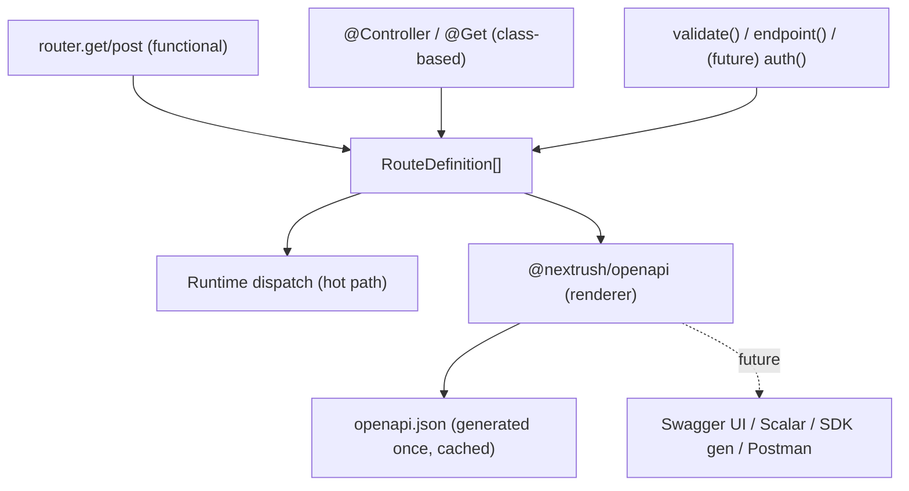

# RFC: Route Metadata System (OpenAPI as the First Renderer)

**Status:** v4 — **APPROVED / architecture frozen**; ready for implementation
**Date:** 2026-07-06
**Author:** NextRush Core Team
**Scope:** A core change (`@nextrush/types` + `@nextrush/router`, both core-lockstep) plus a new ecosystem package (`@nextrush/openapi`). Additive; registration-time only; **zero request hot-path cost by construction** (§7).

---

## 0. Revision History

- **v1** — `RouteDefinition` as single source of truth, collected at registration, consumed by renderers.
- **v2** — Added the metadata-contribution protocol; made the metadata primitive a data marker (not middleware); trimmed renderer-specific fields; added `extensions`.
- **v3** — Renamed the primitive from `meta()`; removed `extensions`/`security` (dead fields in v1); added a canonical route identity; made `openapi()` zero-config.
- **v4 (this document)** — Final naming + semantics lock-down:
  1. **The metadata primitive is `endpoint()`** (not `describe()`). `describe` collides with test frameworks (`import { describe } from 'vitest'`) — a real DX hazard in the test files framework users constantly write. `endpoint()` reads as well and has no collision.
  2. **`RouteDefinition.id` → `RouteDefinition.key`.** `GET /users/:id` is a canonical *key* that encodes meaning and changes under path/param renames — not a rename-stable identifier. Named honestly; a stable opaque id is a future user-assigned `operationId`.
  3. **Merge semantics specified** (§5) — contributions merge in registration order; scalars/arrays last-write-wins; keyed maps merge per key.
  4. **`responses` is numeric-status-only in v1** (§4); OpenAPI `default`/range keys deferred.
  5. **Plugin ordering made explicit** (§8) — lazy snapshot on first request.

Names are settled: `RouteDefinition`, `RouteDefinition.key`, `getRoutes()`, `endpoint()`.

---

## 1. Problem & The Reframe

The ask was "an OpenAPI package." The right architecture is a **route metadata system** that OpenAPI — and later Swagger UI, Scalar, SDK generators, Postman export, typed RPC clients — simply *reads*. `summary`/`tags`/`deprecated`/request+response shapes are route facts every future tool needs, not OpenAPI concepts. And OpenAPI must never touch the request path: correct systems collect metadata **once at startup**, cache the document, and serve from memory.



The router owns `RouteDefinition`. It does **not** know OpenAPI exists.

---

## 2. Existing Foundations

The design is small because the router already works the way it needs to:

- **The router stores an object per route and precompiles at registration** — `HandlerEntry { handler, middleware, executor? }`, with the executor built once for closure-free dispatch. Registration-time collection is the router's existing philosophy, not a new burden. The request path calls `entry.executor(ctx)` and nothing else.
- **Class-based routes already carry metadata** — decorators already have `description`/`deprecated`/`statusCode`/`tags`. Class-based support is mostly mapping.
- **`validate()` already holds request schemas** in its closure — exposing them via a symbol is additive.
- **Schema libraries can emit JSON Schema** (Zod v4, Valibot, ArkType); no uniform converter yet (§A).

---

## 3. Design Goals

1. **Golden path types nothing new** — a route using `validate()` is documented for free.
2. **One new authoring primitive, `endpoint()`,** for facts no schema supplies (responses, summary, tags) — and it is *data*, not middleware.
3. **A general contribution protocol** so any middleware (now `validate()`; later `auth()`/`rateLimit()`) enriches a route without core changes.
4. **Zero request hot-path cost** — collection at registration; metadata read zero times during dispatch (§7).
5. **Closed, curated, renderer-agnostic core** — store raw schema + universal fields only; no renderer-specific fields, no open dumping ground.
6. **Unify functional and class-based** behind one `RouteDefinition`.
7. **Secure by default** — documenting is explicit and scopable (§9).

---

## 4. The Core Object — `RouteDefinition`

Lives in `@nextrush/types`, alongside `Context`.

```typescript
// @nextrush/types
export interface RouteDefinition {
  /** Canonical route key — `${METHOD} ${pathPattern}` (e.g. "GET /users/:id"), the key the
   *  router already uses internally. Deterministic and stable across restarts, but it encodes
   *  the path, so it changes if the path or a param name changes — it is a key, not a
   *  rename-stable opaque id. Tooling needing a refactor-stable identifier assigns one
   *  explicitly (a future user-set `operationId`). */
  readonly key: string;
  readonly method: HttpMethod;
  readonly path: string;               // full, mount/prefix-resolved pattern
  readonly metadata?: RouteMetadata;
}

export interface RouteMetadata {
  /** Request shapes — auto-derived from validate(); never hand-written on the golden path. */
  readonly request?: {
    readonly body?: StandardSchemaV1;
    readonly query?: StandardSchemaV1;
    readonly params?: StandardSchemaV1;
  };
  /** Response shapes by numeric status — supplied via endpoint(); the one thing validate()
   *  cannot know. v1 keys are numeric status codes only (OpenAPI `default`/range keys — §13). */
  readonly responses?: Readonly<Record<number, StandardSchemaV1>>;
  readonly summary?: string;
  readonly description?: string;
  readonly tags?: readonly string[];
  readonly deprecated?: boolean;
  /** Cross-renderer intent — an 'internal' route is excluded from public specs/SDKs. */
  readonly visibility?: 'public' | 'internal';
}
```

Every field is a fact *any* renderer needs, and every field is populated by something that exists in v1 (`validate()` → `request`; `endpoint()` → the rest). Deliberately **not** here:

- **`operationId`** and other renderer artifacts — a renderer derives them (from `key`).
- **`security`** — ships with a future `auth()`, which contributes it via the protocol (§5). Adding it now would be a field nothing populates.
- **An open `extensions` bag** — a dumping ground invites abuse. When a real need for contributed-but-nonstandard metadata arrives (e.g. `rateLimit()`), it gets a deliberate home then, not a junk drawer now.

`RouteMetadata` stores the **raw `StandardSchemaV1`**, not JSON Schema, so each renderer converts its own way. `StandardSchemaV1` **moves to `@nextrush/types`** (currently vendored in `@nextrush/validation`); it is a shared contract now. Validation imports it from types; its public API is unchanged.

---

## 5. The Metadata-Contribution Protocol (the extensibility core)

One well-known symbol in `@nextrush/types` lets any package hand route metadata to the router without either importing the other:

```typescript
// @nextrush/types
export const ROUTE_METADATA: unique symbol = Symbol.for('nextrush.route.metadata');
```

Two kinds of contributor, one protocol:

- **Behavior + metadata** — a real middleware *function* carrying the symbol. `validate()` runs per request *and* contributes `request` schemas. Later, `auth()` contributes `security` (introducing that field with itself). These stay in the executed chain.
- **Pure metadata** — `endpoint()` returns a *marker object* (not a function) carrying only the symbol, contributing `summary`/`responses`/`tags`/etc. It is **never** in the executed chain — it isn't a function, so there is nothing to run and nothing to strip.

Route methods accept a heterogeneous list:

```typescript
type RouteEntry = Middleware | RouteMetaMarker;
post(path: string, ...entries: RouteEntry[]): this;
```

At registration, `addRoute()` — in the loop it *already* runs to compile the executor — partitions entries: **functions → the executor chain; markers → skipped**; and from *every* entry it reads the `ROUTE_METADATA` symbol and merges contributions into the route's `RouteMetadata`. `endpoint()` is literally `(m) => ({ [ROUTE_METADATA]: m })`.

**Merge semantics** (specified, so multiple contributors are unambiguous): contributions merge in **registration (array) order**. Per field:
- Scalars (`summary`, `description`, `deprecated`, `visibility`) and arrays (`tags`): **last contributor wins**.
- Keyed maps (`request`, `responses`): **merged per key**, last write wins per key.

So `validate()`'s `request.body` coexists with a later `endpoint()`'s `responses`; two `endpoint()` calls merge, last-wins per field. This is the extensibility core: the *same* protocol serves `validate()` and `endpoint()` today and any future contributor with zero further core change.

---

## 6. Authoring DX

### 6.1 Golden path — nothing new

```typescript
router.post('/users', validate(User), handler);
// metadata.request.body === User, contributed by validate(). Documented for free.
```

### 6.2 `endpoint()` — the one new primitive (pure data)

```typescript
import { endpoint } from '@nextrush/router';

router.post('/users',
  validate(User),                                    // contributes request.body
  endpoint({ summary: 'Create a user', tags: ['users'], responses: { 201: UserResponse } }),
  handler,
);
```

Explicit ("this endpoint's info"), collision-free (unlike `describe`, which clashes with test frameworks), and says nothing about OpenAPI — it is generic route metadata every renderer reads.

### 6.3 Class-based — already mostly there

Controllers carry `description`/`deprecated`/`tags`. The `controllersPlugin`, when registering onto the router, maps that into `RouteDefinition.metadata`. Response-schema decorators are a follow-up (§13).

### 6.4 Undocumented routes

`router.get('/hello', handler)` still yields a `RouteDefinition` (key + method + path). It appears as an untyped operation — never crashes, never silently vanishes.

---

## 7. Performance — The Crux (measured, not argued)

| Phase | Cost |
| --- | --- |
| **Registration (once, at boot)** | Partition the argument list + read/merge symbols — in the loop the router *already* runs to compile the executor. Set one optional reference on the already-allocated `HandlerEntry`. Affects only cold-start (<30ms budget). |
| **Request dispatch (hot path)** | **Zero.** Dispatch calls `entry.executor(ctx)`; it never reads metadata, which is not on the radix nodes the lookup walks. |
| **`GET /openapi.json`** | Generated **once**, cached, served from memory. |

Metadata is read **zero times** during dispatch, so throughput is unaffected by construction.

**Hard gate, not a claim:** baseline `apps/benchmark` (wrk + autocannon) → land the router change → re-run identical. **Any RPS regression beyond run-to-run noise blocks the change.**

---

## 8. `@nextrush/openapi` — The First Renderer

Zero-config first:

```typescript
app.use(openapi()); // serves /openapi.json and /docs — that's it
```

Every option is optional:

```typescript
app.use(openapi({
  info: { title: 'My API', version: '2.1.0' }, // defaults inferred from package.json
  docs: '/reference',                          // relocate the UI
  exclude: ['/internal/*'],                    // path-level exclusion (§9)
}));
```

On the **first** request to the spec route, it calls `router.getRoutes(): readonly RouteDefinition[]` (a fully immutable view — `readonly T[]` is identical to `ReadonlyArray<T>` and is the form the repo's lint mandates), converts schemas → JSON Schema (§A), assembles OpenAPI 3.1, **caches** it, and serves the cached object thereafter. It skips `visibility: 'internal'` routes and `exclude` matches. It depends only on the public introspection contract + `@nextrush/types`.

**Middleware registration order does not matter.** OpenAPI **snapshots the route registry lazily on the first request** to the spec route — by which point every middleware and route has registered. So `app.use(openapi())` may appear before or after the routers/middleware it documents.

---

## 9. Security

- **Auto-include, with `visibility`.** Every route appears by default (zero-config DX); `endpoint({ visibility: 'internal' })` marks a route out of *all* public artifacts — a cross-renderer semantic.
- **Renderer-level `exclude`.** `openapi({ exclude: ['/internal/*'] })` drops paths without touching route code.
- **Mounting is the conscious opt-in.** The spec exists only because you called `openapi()`. For sensitive deployments, gate it (`app.use(openapi())` only in non-production, or rely on `visibility`/`exclude`). Documented prominently so exposing internal routes is never accidental.

---

## 10. Schema → JSON Schema

No universal Standard-Schema converter exists yet, so `@nextrush/openapi` uses vendor-dispatch for the common libraries (Zod/Valibot/ArkType) with a `toJsonSchema` escape hatch — zero-config for the common case, overridable for the rest. Details and the future Standard JSON Schema path are in **Appendix A**.

---

## 11. Placement, Hierarchy, Versioning

| Package | Change | Tier / version |
| --- | --- | --- |
| `@nextrush/types` | +`RouteDefinition`/`RouteMetadata`/`ROUTE_METADATA`; move `StandardSchemaV1` here | Core lockstep — minor |
| `@nextrush/router` | partition entries, merge contributions, `getRoutes()`, `endpoint()` | Core lockstep — minor |
| `@nextrush/validation` | attach `ROUTE_METADATA` contribution; import type from types | Ecosystem — minor (additive) |
| `@nextrush/controllers` | map decorator metadata → `RouteDefinition` | Core lockstep — minor (phase 2) |
| `@nextrush/openapi` | **new** renderer | Ecosystem — new, `3.0.x` baseline |

Core packages stay zero-dependency; `@nextrush/openapi` uses schema-library converters as **optional peer dependencies**.

---

## 12. Implementation Plan (phased, TDD, benchmark-gated)

1. **Baseline the benchmark.**
2. **`@nextrush/types`**: types + `ROUTE_METADATA`; move `StandardSchemaV1` (validation's tests stay green).
3. **`@nextrush/router`**: entry partitioning + contribution merge + `key` derivation + `getRoutes()` + `endpoint()`, TDD. Assert markers are *not* in the executed chain, `validate()` *is*, and a bare route still yields a definition with a stable `key`.
4. **Re-run benchmark → gate.** No regression, or rework/revert.
5. **`@nextrush/validation`**: attach contribution; end-to-end test that `getRoutes()` sees the schema.
6. **`@nextrush/openapi`**: `RouteDefinition[]` → OpenAPI 3.1, cached; `openapi()` zero-config; conversion (§A). TDD with a fake schema, then real Zod.
7. **Controllers mapping** (basic metadata).
8. **Live proof** in `apps/playground` (real HTTP — the method that caught the `errorHandler` bug), then README + ARCHITECTURE.

Coverage per `v3-testing.instructions.md`: 90/85/90/90.

---

## 13. Non-Goals for v1

- Response *validation* at runtime (`endpoint({ responses })` is doc/metadata only).
- Controller response-schema decorators (`@ApiResponse`) — deferred.
- Renderers beyond OpenAPI JSON + optional UI — future consumers of the same `RouteDefinition[]`.
- Security-scheme generation — ships with a future `auth()`.
- A contributed-nonstandard-metadata home (`extensions`/provenance) — designed when the first real need arrives.
- Per-response `example`s (`endpoint({ example })`) — the `endpoint()` object is extensible; deferred, room kept.
- `responses` `default`/range keys — v1 is numeric-status-only.
- Runtime spec regeneration — generate once, cache.

---

## 14. Decisions — Status (all resolved)

| Question | Resolution |
| --- | --- |
| Core object name | **`RouteDefinition`** (concrete, aligns with routing). |
| Introspection method | **`getRoutes(): readonly RouteDefinition[]`** (fully immutable; `readonly T[]` = `ReadonlyArray<T>`, lint-mandated form). |
| Metadata primitive name | **`endpoint()`** — collision-free (unlike `describe`, which clashes with `vitest`/`jest`), explicit, reads well. |
| `endpoint()` form | Data marker in the flat array via the contribution protocol. |
| Contribution merge | Registration order; scalars/arrays last-write-wins; `request`/`responses` maps merge per key (§5). |
| Route inclusion | Auto-include + `visibility:'internal'` + renderer `exclude` + conscious mount (§9). |
| `StandardSchemaV1` location | **Move to `@nextrush/types`**. |
| `security` / `extensions` | **Removed from v1** — no dead fields; introduced deliberately with their contributor. |
| Route identity | **`key`** (`${METHOD} ${path}`) — canonical, deterministic, honest (a key, not a rename-stable id). |
| `responses` shape | **Numeric-status-keyed map** (`{ 201: Schema }`) — uniform for one or many; `default`/ranges deferred. |
| Class-based v1 scope | Map existing controller metadata; defer `@ApiResponse`. |

**Architecture and names frozen. Approved for implementation.**

---

## 15. Follow-Ups (post-approval)

- Baseline the §7 benchmark before any code.
- After core lands: `@nextrush/openapi`, then controller response decorators, then further renderers and metadata-contributing middleware (`auth()`/`rateLimit()`) — each a thin participant, none touching core again.
- Design a contributed-nonstandard-metadata home when `rateLimit()`-style needs arrive.
- Adopt Standard JSON Schema (Appendix A) once libraries implement it uniformly.

---

## Appendix A. Schema → JSON Schema Conversion (implementation detail)

Standard Schema's `~standard` exposes `validate` + inferred `types`, but not a JSON Schema output, and no uniform converter exists yet. `@nextrush/openapi`:

- **Vendor-dispatch (zero-config for the big three):** reads `~standard.vendor` and dynamically imports that library's converter — `zod` → `z.toJSONSchema`, `valibot` → `@valibot/to-json-schema`, `arktype` → `.toJsonSchema`. Converters are optional peer dependencies, never bundled.
- **User escape hatch:** `openapi({ toJsonSchema: (schema) => {...} })` for any other library or to override.
- **Fallback:** an unknown vendor with no converter yields `{}` (documented as untyped) rather than failing.

**Future clean path:** the emerging **Standard JSON Schema** spec. Once libraries implement it uniformly, the per-vendor dispatch becomes one method call — a non-breaking internal change.
