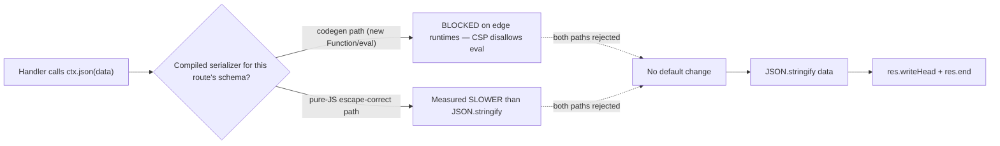

# RFC-018: Response serialization strategy for `ctx.json` — keep `JSON.stringify` as the default

| Field                | Value                                                                 |
| -------------------- | --------------------------------------------------------------------- |
| **Status**           | `Approved` |
| **RFC number**       | `018` |
| **Date**             | `2026-07-19` |
| **Author(s)**        | `NextRush Core Team` |
| **Group**            | `request-data` |
| **Packages touched** | `none` — no production code changes; this RFC closes an investigation |
| **Framework impact** | `Internal-only` — a decision record; `ctx.json` behavior is unchanged |
| **Supersedes**       | `—` |
| **Superseded by**    | `—` |
| **Related**          | `RFC-017` (BodySource limit propagation), `openspec/changes/archive/2026-07-19-request-response-hotpath-round2` (T3b) |

---

## 0. Revision History

- **v1 (`2026-07-19`)** — Initial draft: spike results, decision to keep `JSON.stringify`.
- **v2 (`2026-07-19`)** — Added Option 5 (cache serialized responses), rejected; added the §7
  Runtime compatibility findings ( `eval`/`new Function` codegen is blocked on edge runtimes) as
  a second, independent reason no compiled serializer can be the default; rewritten to the
  standard RFC template.

---

## 1. Summary (TL;DR)

NextRush's POST/JSON throughput sits a measured ~2.6–2.9% behind Fastify/Hono after the
`request-response-hotpath-round2` change, and the remaining gap was hypothesized to be response
serialization — Fastify's own POST edge comes from `fast-json-stringify`, a schema-compiled
serializer, versus NextRush's plain `JSON.stringify`. This RFC evaluates that hypothesis with a
measurement spike and finds it does not hold: a *correct* (string-escaping) compiled serializer is
**slower** than V8's native `JSON.stringify` on NextRush's response shapes, and separately, any
codegen-based serializer (`new Function`/`eval`) cannot run on edge runtimes at all — so it could
never be a cross-runtime default regardless of speed. The decision is to keep `JSON.stringify` as
the permanent default and not add a compiled-serializer package, dependency, or public API.

---

## 2. Decision Summary

- **Status:** `Approved`
- **Decision:**
  - _Keep `ctx.json` → `JSON.stringify` unchanged, as the permanent default serialization path._
  - _Do not introduce a compiled/schema-based response serializer (in-house, Standard-Schema-derived, or an optional package wrapping `fast-json-stringify`)._
  - _Do not introduce a response-cache layer as a substitute for serialization speed (§10)._
- **Breaking:** `No`
- **Migration required:** `None`
- **Blast radius:** `low` — this RFC changes no code; it closes an investigation opened by
  `request-response-hotpath-round2` (T3b) with a documented decision.

---

## 3. Problem & Motivation

### 3.1 Current state (what exists today)

`ctx.json(data)` serializes with the JavaScript built-in, in every adapter's response path:

```ts
// packages/adapters/node/src/context.ts — NodeContext.json()
json(data: unknown): void {
  const json = JSON.stringify(data);
  res.writeHead(this.status, {
    'Content-Type': 'application/json; charset=utf-8',
    'Content-Length': String(Buffer.byteLength(json)),
  });
  res.end(json);
}
```

No schema, no compilation step, no per-route configuration. The Web adapters (Bun/Deno/Edge) use
the equivalent `JSON.stringify` call in their response builder. This is **runtime-agnostic by
construction**: `JSON.stringify` is a JS built-in present and equally optimized on Node, Bun, Deno,
Cloudflare Workers, and Vercel Edge — nothing to install, configure, or that can silently behave
differently on one runtime.

### 3.2 The problems (enumerated)

1. **Residual POST-JSON gap** — a clean pinned benchmark run puts NextRush POST-JSON at ~19,070
   rps versus Fastify's 19,634 and Hono's 19,582 (~2.6–2.9% behind), and ~23% behind raw Node's
   24,888 rps. `request-response-hotpath-round2`'s design attributed part of this residual gap to
   response encoding, on the widely-repeated premise that Fastify's `fast-json-stringify` is a
   large, general win over `JSON.stringify`.
2. **Unverified premise** — that attribution was not measured against NextRush's own response
   shapes before this RFC; it was inherited folklore about `fast-json-stringify`'s historical
   advantage over older V8 versions, not a number produced against the current runtime.

### 3.3 Why now

`request-response-hotpath-round2` (T3b) explicitly gated any serializer work behind "spike first,
implement only if it RFC-approves" — per this repo's "measure before optimizing" rule
(`AGENTS.md` §11) and the change's own design (`design.md` D3). This RFC is that gate being
exercised: before adding a public schema API, a dependency, or a new capability, the actual win
had to be sized.

---

## 4. Goals & Non-Goals

### 4.1 Goals

- Determine, with a reproducible measurement, whether a schema-compiled response serializer is
  faster than `JSON.stringify` on response shapes representative of NextRush's own API/benchmark
  payloads.
- Determine whether any serializer approach that could win on speed is deployable on every runtime
  NextRush supports (Node, Bun, Deno, Cloudflare Workers, Vercel Edge).
- Record a decision (implement / defer / reject) with evidence, so the question is not re-opened
  on assumption.

### 4.2 Non-Goals

- Implementing a compiled serializer — out of scope unless the spike had shown a clear win; it
  did not (§8).
- Chasing full parity with raw Node on POST-JSON at the cost of API clarity or a new dependency —
  out of scope per this repo's design philosophy (`AGENTS.md` §3, §11).
- Re-evaluating the read-side POST cost (async frame count, body buffering) — that is
  `request-response-hotpath-round2`'s T3a, already shipped and out of this RFC's scope.

---

## 5. Impact

- **Affected packages:** `none` — no package changes as a result of this RFC.
- **Affected audiences:** _None directly._ Application developers see no behavior change; `ctx.json`
  is unchanged.
- **Explicitly NOT affected:** every existing application, every adapter (Node/Bun/Deno/Edge/
  serverless), the public `Context` API, and the benchmark suite's parity guarantees.

---

## 6. Proposed Solution (overview)

| # | Problem (from §3.2)                     | Solution (this RFC)                                                     |
| - | ---------------------------------------- | ------------------------------------------------------------------------ |
| 1 | Residual POST-JSON gap attributed to encoding | Measure the actual serialization cost delta before building anything (§8) |
| 2 | Unverified `fast-json-stringify` premise | Run a controlled microbench against NextRush's real response shapes; publish the numbers in this RFC regardless of outcome |

The approach is a spike, not a build: write the smallest correct comparison between
`JSON.stringify` and a compiled equivalent, on the shapes that matter, then decide from the
result rather than from precedent. Because the spike also surfaced a categorical blocker (edge
runtime incompatibility of codegen serializers, §7), the decision does not depend on the
microbench alone — either finding independently closes the door on a compiled default.

---

## 7. Architecture

### 7.1 Before (current, unchanged)


### 7.2 After (evaluated, not adopted)



### 7.3 Why this architecture (i.e. why nothing changes)

A compiled serializer's speed comes specifically from *avoiding escaping work per call* — either by
generating a specialized function via `new Function`/`eval` (Fastify's `fast-json-stringify`), or by
trusting schema-declared "safe" fields to skip escaping. The first mechanism is unavailable on edge
runtimes (Cloudflare Workers, Vercel Edge run under a CSP that disallows dynamic code evaluation);
the second is unsafe for untrusted string values and not something a general-purpose default can
assume. NextRush's core principle is runtime independence — "every runtime is an implementation
detail" behind an adapter (`AGENTS.md` §7) — so a default that only works on Node/Bun is a
non-starter architecturally, independent of the speed question. This is why the diagram above shows
both branches terminating at "no default change": one branch fails on portability, the other fails
on the microbench.

---

## 8. Detailed Design

### 8.1 Public API / surface

_Not applicable — this RFC introduces no API. `ctx.json(data: unknown): void` is unchanged._

### 8.2 Internal components

_Not applicable — no internal components are added. `NodeContext.json` / the Web adapters'
equivalent remain the only serialization call sites, unchanged._

### 8.3 Spike methodology

Microbench (`/tmp/t3b-serialize-spike.mjs`, Node ≥22, disposable — not committed to any package),
2,000,000 iterations × 6 trials, median reported, comparing `JSON.stringify` against a hand-built
"compiled" serializer (string concatenation, mirroring how a schema compiler would generate code)
for two representative response shapes:

- a single flat object (`{ id, name, email, active }` — the shape of a typical single-resource API
  response, close to the benchmark's `POST /json` payload);
- a list of 20 similarly-shaped objects (a typical collection-endpoint response).

Two variants of the compiled path were measured: one that escapes string values correctly via
`JSON.stringify(value)` per field (the only *correct* option — mandatory, since an unescaped `"`
or control character in a name field would corrupt the JSON or enable injection), and one naive
variant with **no escaping at all**, included only to establish the theoretical, unsafe upper
bound `fast-json-stringify`-style codegen is chasing.

### 8.4 Data (the measurement)

| Response shape                                          | `JSON.stringify` | Compiled (escape-correct) | Ratio |
| --------------------------------------------------------- | ----------------- | -------------------------- | ------ |
| single object (`{id,name,email,active}`)                  | 6.34 M/s          | 4.77 M/s                   | **0.75× (slower)** |
| list of 20 objects                                         | 0.50 M/s          | 0.36 M/s                   | **0.72× (slower)** |
| single object, naive **no-escaping** (unsafe, upper bound) | 6.69 M/s           | 14.53 M/s                  | 2.17× (faster, not shippable) |

### 8.5 Error handling

_Not applicable — no new code path, no new error surface._

### 8.6 Edge cases

| Scenario                                                       | Behaviour (unchanged)                                                  |
| ---------------------------------------------------------------- | -------------------------------------------------------------------------- |
| Response value contains a string with `"`, `\`, or control chars | `JSON.stringify` escapes it correctly (as it always has) — this is exactly the property a compiled serializer would have to reproduce to be safe, and reproducing it is what makes it slower (§8.4) |
| Deployment target is Cloudflare Workers / Vercel Edge             | No serializer decision affects this — `JSON.stringify` already runs identically there; a codegen serializer could not (§7.3) |

### 8.7 Examples

_Not applicable — `ctx.json(data)` usage is unchanged; see the existing docs/examples._

---

## 9. Alternatives Considered

### 9.1 In-house schema→serializer compiler (zero-dep)
An in-house compiler that reads a route's declared shape and generates a specialized serializer
function. **Rejected**: to be correct it must escape string values, and the spike (§8.4) shows an
escape-correct compiled serializer is slower than `JSON.stringify`, not faster. If it instead uses
`new Function`/`eval` codegen to be faster, it fails §7's edge-runtime constraint. Either way it is
worse than doing nothing, before counting the cost of a new public schema-registration API and the
maintenance burden.

### 9.2 Reuse the Standard Schema integration (`@nextrush/validation`) to derive a serializer
A Standard Schema already describes a response shape for validation; reusing it to also drive
serialization seems appealing (one schema, two jobs). **Rejected**: this does not change the
underlying cost — per-field escaping is exactly as expensive whether the field list comes from a
hand-written compiler or a schema library's introspection. It adds coupling between validation and
response-serialization concerns for no measured win.

### 9.3 Optional `@nextrush/serializer` package wrapping `fast-json-stringify`
Keep `core` zero-dependency by making a compiled serializer an opt-in package. **Rejected**: it does
not run on edge runtimes at all (`new Function`/`eval` is CSP-blocked on Cloudflare Workers / Vercel
Edge — §7), so it could at best be a Node/Bun-only opt-in that fragments cross-runtime behavior — the
one thing developers should never have to think about per adapter (`AGENTS.md` §7). It would also add
a public schema-registration API (a long-term commitment, `AGENTS.md` §5) for a benefit the spike
does not demonstrate on NextRush's shapes.

### 9.4 Do nothing (chosen)
Keep `ctx.json` → `JSON.stringify`, permanently, as the default. **Cost of the status quo:** the
~2.6–2.9% POST-JSON gap to Fastify/Hono remains unattributed to serialization and is left as-is —
this RFC concludes that gap is not closeable at the serialization layer without an unsafe or
non-portable trade-off, so accepting it is the correct outcome rather than a deferred cost.

---

## 10. Rejected Ideas

- **Cache serialized responses** — rejected. Not a general serialization optimization: it only
  benefits identical, immutable responses and does nothing for dynamic API responses, which are
  the majority of production workloads. At scale it also introduces cache invalidation, memory
  overhead, and stale-response risk, on top of added complexity. This belongs to HTTP/application
  caching (`Cache-Control`, `ETag`, a CDN, Redis), not the response serialization layer — folding
  it into `ctx.json` would blur a clean boundary for a narrow, situational win.
- **Precompiled response templates for fixed-shape hot routes** — considered as a way to skip both
  the escaping cost and codegen, by building a static template once (no `eval`) and splicing
  escaped dynamic values at request time. Not rejected outright — no spike was run against it — but
  deferred (§17) rather than pursued now, since no current route shape in NextRush's own benchmark
  or typical usage demonstrated a need urgent enough to justify the design/implementation cost
  without first measuring it.

---

## 11. Risks & Mitigations

| Risk                                                                            | Mitigation                                                                                          | Likelihood | Impact |
| ---------------------------------------------------------------------------------- | -------------------------------------------------------------------------------------------------------- | ---------- | ------ |
| This decision is challenged later on the same folklore premise, re-litigating a closed question | This RFC's §8.4 evidence table stands as the citable record; any revival must clear §17's three-part bar (safe + portable + measurably faster), not just assert the old premise | Medium | Low |
| A future V8 change alters the relative cost of `JSON.stringify` vs. hand-rolled serialization, invalidating §8.4's numbers | The bar in §17 requires a *new* spike against current V8 before any revival, not a reuse of these numbers | Low | Low |

---

## 12. Backward Compatibility & Migration

- **Compatibility:** Additive & non-breaking — in fact, no code changes at all. `ctx.json`
  behavior is identical before and after this RFC.
- **Migration path (if breaking):** _Not applicable — nothing breaks._
- **Deprecation window:** _Not applicable — nothing is deprecated._

---

## 13. Cross-Cutting Concerns

- **Security:** `JSON.stringify`'s built-in escaping is exactly the property that makes it safe
  against injection via user-controlled string fields; this RFC's conclusion preserves that
  guarantee by not introducing an escaping-optional fast path.
- **Performance:** Quantified in §8.4 — the alternative investigated is slower, not faster, for
  the correct/shippable variant. No performance change results from this RFC.
- **Runtime independence:** Central to the decision (§7.3) — `JSON.stringify` runs identically on
  Node, Bun, Deno, Cloudflare Workers, and Vercel Edge; a codegen serializer would not (`AGENTS.md`
  §7).
- **Observability:** _Not applicable — no new logging or metrics; no behavior change._
- **Zero-dependency rule:** Preserved by this decision — no serializer dependency is added to
  `core`, `adapters`, or `middleware` (`project-rules.instructions.md` §6).

---

## 14. Success Metrics

| Metric                | Baseline (today)      | Target / threshold |
| ---------------------- | ---------------------- | --------------------- |
| POST-JSON rps (pinned, quick profile) | ~19,070 (vs. Fastify 19,634 / Hono 19,582) | No regression — this RFC changes no code, so the existing figure stands unchanged |
| Serialization throughput on representative shapes | `JSON.stringify`: 6.34 M/s (single object), 0.50 M/s (list of 20) | Baseline itself is the accepted target — no alternative measured beats it safely (§8.4) |

---

## 15. Phased Implementation Plan

_Not applicable — this RFC ships no code. The "implementation" was the spike itself (§8.3–8.4),
already executed and recorded above._

### 15.1 Testing strategy

_Not applicable — no production code changed; existing body-parser/adapter-node/conformance suites
and `pnpm bench:validate` were unaffected and remain the relevant regression guard for the
surrounding change (`request-response-hotpath-round2`)._

---

## 16. Rollback Plan

_Not applicable — no code shipped under this RFC to roll back._

---

## 17. Future Work

- **Precompiled, non-codegen response templates for fixed-shape hot routes** — a static template
  built once per route (no `eval`), with escaped dynamic values spliced in at request time. Would
  need its own spike proving it beats `JSON.stringify` on real shapes while staying portable.
- **A future V8 API for faster schema-guided serialization**, if one emerges — would need a fresh
  spike against current numbers, not a reuse of §8.4.
- Any revival of a compiled/schema-based serializer must clear all three of: **(1)** safe — correct
  string escaping, no injection risk; **(2)** portable — no `eval`/`new Function` codegen, so it
  runs on edge runtimes too; **(3)** measurably faster than `JSON.stringify` (beyond benchmark
  noise) on real NextRush response shapes. Each candidate is its own new RFC with its own spike,
  not an amendment to this one.

---

## 18. Open Questions

_None outstanding — the spike (§8) and the runtime-compatibility finding (§7) together resolve
the question this RFC set out to answer. Any future revival opens a new RFC per §17._

---

## 19. Decisions Log

| Question                                                                 | Decision                                                              | Rationale                                                                                                    |
| --------------------------------------------------------------------------- | --------------------------------------------------------------------------- | ------------------------------------------------------------------------------------------------------------------ |
| Should NextRush add a compiled/schema-based response serializer for `ctx.json`? | No — keep `JSON.stringify` as the permanent default.                        | Escape-correct compiled serialization measured slower (§8.4); any faster (codegen) variant is CSP-blocked on edge runtimes (§7), violating runtime independence (`AGENTS.md` §7). |
| Should response caching be used as a substitute lever for serialization speed? | No — out of scope for this layer.                                          | Only helps immutable/identical responses, not the dynamic majority; belongs to HTTP/application caching, not serialization (§10). |
| Is the residual ~2.6–2.9% POST-JSON gap to Fastify/Hono worth closing at the serialization layer? | No — accept it as the cost of a safe, portable default.                    | No safe and portable alternative measured faster; forcing a win here would trade correctness or runtime independence for a small, already-near-parity gap. |

---

## 20. References

- `report/middleware/middleware-body-parser-review.md` — the audit that originated the POST-JSON
  throughput investigation this RFC concludes.
- `openspec/changes/archive/2026-07-19-request-response-hotpath-round2/` — the change whose T3b
  task this RFC resolves.
- `docs/RFC/request-data/017-body-source-limit-propagation.md` — the sibling RFC from the same
  investigation (accepted and shipped; body-limit enforcement, not serialization).
- `AGENTS.md` §7 (Runtime Independence), §6 (Zero-Dependency Rule) — the framework principles this
  decision is measured against.
- `apps/benchmark/results/2026-07-19T12-13-27/` — the pinned benchmark run establishing the
  baseline POST-JSON figures referenced in §14.
