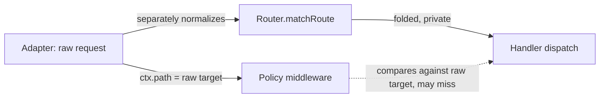
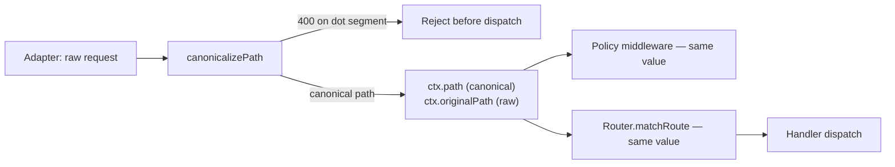

# RFC-029: Canonical request-path ownership, dot-segment rejection, and case-sensitivity default

| Field                | Value                                                                 |
| -------------------- | --------------------------------------------------------------------- |
| **Status**           | `Draft` |
| **RFC number**       | `029` |
| **Date**             | `2026-07-27` |
| **Author(s)**        | `harden-security-boundaries change` |
| **Group**            | `request-data` |
| **Packages touched** | `@nextrush/router`, `@nextrush/adapter-node`, `@nextrush/adapter-bun`, `@nextrush/adapter-deno`, `@nextrush/adapter-edge`, `@nextrush/adapter-serverless`, `@nextrush/csrf` |
| **Framework impact** | `Breaking (needs major + migration)` |
| **Supersedes**       | `—` |
| **Superseded by**    | `—` |
| **Related**          | `ADR-0017`, security-review SEC-02, SEC-09, SEC-15 |

---

## Progress Tracker

**Overall:** `[░░░░░░░░░░░░░░░░░░░░]` 0% — 0 / 4 phases complete · Doc status: `Draft`

| Phase | Part / deliverable                     | Status         |
| ----- | -------------------------------------- | -------------- |
| P0    | `canonicalizePath()` + dot-segment rejection in `@nextrush/router` | ⬜ Not started  |
| P1    | `ctx.path` / `ctx.originalPath` publication in every adapter | ⬜ Not started  |
| P2    | Prefix/mount matching + CSRF exemption matching on canonical path | ⬜ Not started  |
| P3    | `caseSensitive` default flip + migration guide + conformance parity | ⬜ Not started  |

---

## 0. Revision History

- **v1 (2026-07-27)** — Initial draft, extracted from `report/security-review.md` findings SEC-02/SEC-09/SEC-15.

---

## 1. Summary (TL;DR)

`@nextrush/router` folds path case for its own trie lookup and keeps the folded value private;
`ctx.path` stays the raw request target. A path-prefix authorization guard reading `ctx.path` and the
router dispatching a handler are comparing different strings, so `GET /ADMIN/users` bypasses a guard
written for `/admin` while still reaching the handler registered at `/admin/users`. This RFC makes
`@nextrush/router` the single owner of path normalization via one `canonicalizePath()` function,
publishes its output as `ctx.path` (with the untouched target preserved as `ctx.originalPath`),
rejects dot-segment paths with 400 rather than resolving them, and flips the router's
`caseSensitive` default to `true`. The cost is three breaking changes in one release, each with a
named, mechanical migration.

---

## 1a. Terminology

`Canonical path`
: The single normalized form of a request path produced by `canonicalizePath()` — case-folded (if
  the router is case-insensitive), slash-collapsed, trailing-slash-normalized, and free of dot
  segments. The value every security-relevant consumer compares against.

`Original path`
: The untouched request-target path exactly as received, before any normalization, exposed as
  `ctx.originalPath` for the rare consumer that needs it (logging, diagnostics).

---

## 2. Decision Summary

- **Status:** `Draft`
- **Decision:**
  - _Introduce `canonicalizePath()` in `@nextrush/router` as the sole normalization function._
  - _Introduce dot-segment rejection (400) before route matching and before any path-based decision._
  - _Introduce `ctx.originalPath`; redefine `ctx.path` to carry the canonical, router-matched value._
  - _Change the router's `caseSensitive` default from `false` to `true`._
  - _Remove ad-hoc `startsWith`-based prefix matching from `app.use(prefix, …)` and CSRF `excludePaths`, replacing both with router-owned segment-boundary matching._
- **Breaking:** `Yes — see §12`
- **Migration required:** `Yes — one line per change, see §12`
- **Blast radius:** `high` — every application with a path-prefix guard, a case-insensitive route
  dependency, or a client that sends dot-segment paths.

---

## 2a. Decision Drivers

Priority (highest → lowest):

1. Security correctness — a policy decision and a routing decision must never diverge on the same
   input.
2. Runtime independence — identical behavior on Node/Bun/Deno/Edge, proven by conformance.
3. Predictability over convenience — RFC 3986 §6.2.2.1 defines the path as case-sensitive; folding
   by default is convenience purchased with an astonishment cost.
4. Hot-path cost — the router's existing allocation-avoidance fast paths must survive.
5. Migration cost — every breaking change gets a mechanical, one-line fix.

---

## 3. Problem & Motivation

### 3.1 Current state (what exists today)

```ts
// packages/router/src/matching.ts — folds for its own lookup, keeps it local
export function normalizePathForMatch(path, caseSensitive, strict) {
  const folded = caseSensitive || isProvablyLowerAscii(path) ? path : path.toLowerCase();
  return collapseAndStrip(folded, strict);
}

// application code — the idiomatic way to protect a route group
app.use(async (ctx, next) => {
  if (ctx.path.startsWith('/admin')) await requireAdmin(ctx);
  await next();
});
admin.get('/admin/users', listAllUsers);
```

`ctx.path` is the raw request target; `normalizePathForMatch`'s output never leaves the router.

### 3.2 The problems (enumerated)

1. **Case-fold bypass** — `GET /ADMIN/users` matches the route registered at `/admin/users`
   (default `caseSensitive: false`) while the guard above sees `/ADMIN` and never runs.
2. **Slash/trailing-slash bypass** — the same divergence for `/admin/users/` and
   `//admin//users`, which the router's non-strict, slash-collapsing normalization matches but a
   naive prefix or equality test does not.
3. **No dot-segment handling** — `/api/webhooks/../admin` keeps its `..` segment through to
   `ctx.path`; a front-end proxy that resolves dot segments before forwarding and an application ACL
   that does not can disagree about which path was authorized.
4. **Exemption wildcard depth error** — `@nextrush/csrf`'s `excludePaths` single-star pattern
   (`/api/webhooks/*`) matches unlimited depth because it reuses the double-star's `startsWith` test.

### 3.3 Why now

`harden-security-boundaries` closes 19 findings from a completed security review; SEC-02 is one of
two P1s (remote, unauthenticated, single-header authorization bypass). Publishing the canonical path
also closes SEC-09 and SEC-15 structurally rather than as three separate patches, and is a
prerequisite for the CSRF exemption-matching fix in the same change.

---

## 4. Goals & Non-Goals

### 4.1 Goals

- One function is the only place path normalization is defined (maps to problem 3.2.1, 3.2.2).
- A path containing a dot segment, in any encoding, never reaches a handler or a path-based
  middleware decision (3.2.3).
- Every path-prefix guard in the codebase can be deleted in favor of router-owned prefix matching
  (3.2.1, 3.2.2).
- `excludePaths` wildcard semantics match their documented depth exactly (3.2.4).

### 4.2 Non-Goals

- Changing the segment-trie algorithm or its performance characteristics — this RFC adds one
  normalization/rejection pass, not a new matching engine.
- Resolving dot segments to a canonical target — rejecting is the chosen behavior (§9.1).
- A general-purpose URL-normalization library for application use — scope is the request path this
  framework already parses.

---

## 5. Impact

- **Affected packages:** `@nextrush/router`, `@nextrush/adapter-node`, `@nextrush/adapter-bun`,
  `@nextrush/adapter-deno`, `@nextrush/adapter-edge`, `@nextrush/adapter-serverless`,
  `@nextrush/csrf`, `@nextrush/adapters/conformance`.
- **Affected audiences:** Application developers (breaking `ctx.path` semantics and
  `caseSensitive` default); middleware authors reading `ctx.path` for policy; adapter authors.
- **Explicitly NOT affected:** Route-matching correctness for well-formed paths with no dot segments
  — those continue to match exactly as today once case sensitivity is accounted for.

---

## 6. Proposed Solution (overview)

| # | Problem (from §3.2)        | Solution (this RFC)                          |
| - | --------------------------- | --------------------------------------------- |
| 1 | Case-fold bypass             | `canonicalizePath()` is the one normalizer; its output becomes `ctx.path`; `caseSensitive` defaults `true` |
| 2 | Slash/trailing-slash bypass  | Same function, same publication — no separate mechanism needed |
| 3 | No dot-segment handling      | Linear-scan dot-segment detection; reject 400 before matching, body read, or auth |
| 4 | Wildcard depth error         | `/*` matches exactly one segment; `/**` matches any depth — tested against the canonical path |

The router already owns the normalization rules and the options (`caseSensitive`, `strict`) that
parameterize them. This RFC does not move that ownership; it stops the router from keeping its
output to itself, and adds one more normalization concern (dot segments) to the same function.

---

## 6a. Trade-offs

### Benefits

- A security decision and a routing decision are now provably the same input.
- Deleting hand-written prefix guards removes a whole class of future divergence, not just today's
  instance.
- Dot-segment rejection removes an entire proxy-desync failure mode, not just the CSRF near-miss that
  surfaced it.

### Costs

- Three breaking changes ship together; a smaller, safer-feeling change would defer the
  `caseSensitive` flip, but that leaves the *astonishment* half of the problem (§9 considered this;
  see rejected alternative in §10).
- A client that legitimately builds relative paths (rare, and arguably already malformed) now
  receives a 400 instead of a resolved path.
- One additional linear scan per request on the routing hot path.

---

## 7. Architecture

### 7.1 Before



### 7.2 After



### 7.3 Why this architecture

`canonicalizePath()` sits in `@nextrush/router` because the router already owns the per-router
options (`caseSensitive`, `strict`) that parameterize the fold/collapse decisions; moving the logic to
`@nextrush/runtime` would separate it from the options that configure it, and each adapter is a
consumer above the router in the package hierarchy, so an adapter importing the router's export is
legal (`.kiro/steering/architecture.instructions.md`). Running canonicalization once per request in
the adapter, before dispatch, is what makes "the same value everywhere" true by construction instead
of by convention.

---

## 7a. Architecture Invariants

- Preserved: lower packages never import from higher (`router` gains no new dependency; adapters,
  which sit above it, are the only new importers of its new export).
- Preserved: no `node:*`/`process` in `router` — dot-segment detection and case folding are pure
  string operations.
- Preserved: the router's existing hot-path fast paths (`isProvablyLowerAscii`,
  `includes('//')` gate) — canonicalization must not reintroduce an allocation on the common
  all-lowercase-ASCII, slash-clean path.
- Changed, deliberately: `ctx.path` no longer equals the raw request target. Justification: the raw
  value remains available as `ctx.originalPath`; the change closes SEC-02, and every consumer that
  needs "what did the client literally send" has a named replacement.

---

## 8. Detailed Design

### 8.1 Public API / surface

```ts
// @nextrush/router
export function canonicalizePath(
  rawPath: string,
  options: { caseSensitive: boolean; strict: boolean }
): { canonical: string; rejected: boolean };

// Context (all adapters)
interface Context {
  readonly path: string;         // canonical — what the router matched
  readonly originalPath: string; // raw request target, query-string excluded
}
```

### 8.2 Internal components

- `canonicalizePath` — orchestrates: strip query string (caller-specific, as today), scan for dot
  segments (reject early), collapse slashes, apply trailing-slash policy, fold case if configured.
- Adapter context construction — calls `canonicalizePath` once per request, stores both `canonical`
  and the raw target, short-circuits to a 400 response on `rejected`.
- `app.use(prefix, …)` / mounted-router resolution — replaced with a segment-boundary comparison
  against the canonical path (equality or `canonical + '/'` prefix), not `String.startsWith` on the
  raw target.

### 8.3 Request / execution flow

```text
raw target → canonicalizePath → rejected? → 400 (no dispatch, no body read, no auth)
                                → not rejected → ctx.path = canonical, ctx.originalPath = raw
                                → router.matchRoute(ctx.path) → handler
                                → prefix/mount middleware tested against ctx.path
```

### 8.4 Data structures

No new persisted structures. `canonicalizePath`'s return is a small transient object; the adapter
context stores both strings as plain fields, matching the existing `ctx.path` storage shape.

### 8.5 Error handling

A dot-segment rejection throws/returns a framework `BadRequestError` (400) with a message naming the
offending segment class ("path traversal segment") — no internal path or stack in production,
consistent with `project-rules.instructions.md` §3–§4.

### 8.6 Edge cases

| Scenario                    | Behaviour                                  |
| --------------------------- | ------------------------------------------- |
| `/api/webhooks/../admin`    | 400, no dispatch |
| `/api/%2e%2e/admin`         | 400 |
| `/api/%252e%252e/admin`     | 400 (or fails to match; never resolves to `/admin`) |
| `/files/archive.tar.gz`     | Accepted — dots inside a segment are not a dot segment |
| `/users/a%2Eb`               | Accepted, decodes to `a.b` |
| `/../..`, `/./.`             | 400, never resolves to `/` |
| Very long run of `.` characters | Rejected/accepted in linear time — no backtracking regex |
| `caseSensitive: false` router | Folds as before; the folded value is now what `ctx.path` publishes |

### 8.7 Examples

```ts
// Before — hand-written, divergent from the router
app.use(async (ctx, next) => {
  if (ctx.path.startsWith('/admin')) await requireAdmin(ctx);
  await next();
});

// After — router-owned, cannot diverge
app.use('/admin', requireAdmin);
```

---

## 9. Alternatives Considered

### 9.1 Resolve dot segments instead of rejecting

RFC 3986 §5.2.4's `remove_dot_segments` is what proxies already do. Resolving in the application
creates a second, differently-timed resolution — exactly the desync this RFC exists to prevent
(SEC-09). Rejected: rejecting is strictly safer and no legitimate client target contains a dot
segment.

### 9.2 Publish the canonical path without flipping `caseSensitive`

Fixes the *bypass* (SEC-02) without touching the *default*. Rejected as the sole fix: it leaves
`caseSensitive: false` as the default, which is still surprising (RFC 3986 §6.2.2.1) even once safe.
Accepted as a valid *sequencing* choice — see §15 P3's decision gate, which allows deferring the flip
alone to a follow-up major if this release is not one, while P0–P2 ship regardless.

### 9.3 Do nothing

Leaves SEC-02 (P1) open. A remote, unauthenticated attacker bypasses any path-prefix guard by
changing case. Not viable.

---

## 10. Rejected Ideas

- **Normalize in each adapter separately** — Rejected because it is the exact pattern that produced
  SEC-02; four implementations guaranteed to drift.
- **A new `@nextrush/path` package** — Rejected: RFC-gated overhead for one function with no boundary
  benefit; `router` already sits at the bottom of the hierarchy and depends on nothing.
- **Double-encoded dot segments silently pass through** — Rejected: even though the router will not
  resolve them to a match, leaving them unrejected is an inconsistency an auditor would flag next;
  reject explicitly.

---

## 11. Risks & Mitigations

| Risk                                                              | Mitigation                                                                  | Likelihood | Impact |
| ------------------------------------------------------------------ | ---------------------------------------------------------------------------- | ---------- | ------ |
| A client sends dot-segment paths that previously "worked by luck"  | Migration guide documents the exact 400 shape; this is the intended change   | Medium     | Low    |
| `caseSensitive: true` 404s routes that relied on folding            | Ship a boot diagnostic listing non-lowercase registered routes; gate the flip to a major | Medium     | Medium |
| Canonicalization regresses the router hot path                     | `performance-gate` smoke profile + CPU-pinned A/B is a required, blocking gate | Low        | High   |
| A future contributor reintroduces a local `startsWith` prefix check | `runtime-adapter-contract` conformance suite pins canonical-path parity across adapters; code review checklist references this RFC | Low | Medium |

---

## 12. Backward Compatibility & Migration

- **Compatibility:** Breaking — requires a major bump.
- **Migration path:**

  ```ts
  // Before — ctx.path was the raw target
  app.use(async (ctx, next) => {
    if (ctx.path.startsWith('/admin')) { /* ... */ }
    await next();
  });

  // After — use router-owned mounting; if the raw value is genuinely needed
  // (e.g. logging exactly what the client sent), read ctx.originalPath.
  app.use('/admin', requireAdmin);
  logger.info(ctx.originalPath); // raw target, unchanged
  ```

  ```ts
  // Before — implicit case-insensitive default
  const router = createRouter();

  // After — explicit opt-in preserves the old matching behavior
  const router = createRouter({ caseSensitive: false });
  ```

- **Deprecation window:** No deprecation window for the security-relevant half (dot-segment
  rejection, canonical-path publication) — these ship as a direct behavior change with the migration
  guide, because a deprecation window would mean shipping the bypass a while longer. The
  `caseSensitive` default flip may land in this major or a follow-up major per the §15 decision gate.

---

## 13. Cross-Cutting Concerns

- **Security:** This RFC's entire purpose. No new untrusted-input surface is introduced;
  dot-segment detection reduces one. No secret/PII in the 400 error body.
- **Performance:** One linear scan added to the routing hot path; existing fast paths
  (`isProvablyLowerAscii`, no-op slash collapse) preserved. Quantified in §14.
- **Runtime independence:** `canonicalizePath` is pure string logic with no `node:*`/`process`
  import; identical behavior pinned by `runtime-adapter-contract` conformance across Node/Bun/Deno/Edge.
- **Observability:** A rejected dot-segment request logs at the framework's normal request-log level;
  no new sensitive data is logged.
- **Zero-dependency rule:** No new runtime dependency in any touched package.

---

## 14. Success Metrics

| Metric                | Baseline (today) | Target / threshold          |
| ---------------------- | ------------------ | ------------------------------ |
| Router match latency (p50/p99) | current benchmark suite | no regression beyond `performance-gate` smoke threshold |
| Allocations per match (clean path) | current | unchanged (0 new allocations on the fast path) |
| Test coverage (`router`, touched adapters) | current | 90%+ lines/functions |
| Cross-adapter conformance (canonical path + dot-segment reject) | not asserted today | 100% pass, all 4 adapters |

---

## 15. Phased Implementation Plan

| Phase | Goal (what ships)                     | Depends on | Exit condition (checkable)                     | Status         |
| ------ | ---------------------------------------- | ------------ | -------------------------------------------------- | -------------- |
| **P0** | `canonicalizePath()` + dot-segment rejection in `@nextrush/router` | — | Unit tests green: dot-segment matrix rejects, clean paths unaffected | ⬜ Not started  |
| **P1** | `ctx.path` / `ctx.originalPath` in every adapter | P0 | Integration test green on Node; conformance scaffolding extended | ⬜ Not started  |
| **P2** | Prefix/mount matching + CSRF exemption matching on canonical path | P1 | Public usage test green (`/admin` mount matches all forms); `excludePaths` depth test green | ⬜ Not started  |
| **P3** | `caseSensitive` default flip (**decision-gated**) + migration guide + full conformance parity | P2 | Docs updated; conformance suite passes on all 4 adapters; decision recorded either way | ⬜ Not started  |

### 15.1 Testing strategy

- **Unit:** dot-segment matrix (literal, single/double percent-encoded, filename-with-dots,
  param-value-with-encoded-dot), slash/trailing-slash preservation, case-fold correctness.
- **Integration:** prefix-guard bypass reproduction (RED) → fix (GREEN) on the Node adapter.
- **Cross-adapter:** identical `ctx.path`/`ctx.originalPath` and identical dot-segment 400 on all
  four adapters, via `packages/adapters/conformance`.
- **Coverage:** 90%+ lines/functions, `router` and every touched adapter.

---

## 16. Rollback Plan

- **Trigger:** a `performance-gate` regression beyond threshold, or a P2 integration failure
  discovered before merge.
- **Steps:**
  - Revert `@nextrush/router` and the touched adapters to their pre-RFC versions.
  - `@nextrush/csrf`'s exemption-matching change (P2) depends on P0/P1's export — revert together,
    not independently.
  - No migration/data state to clean up; this is a pure code change.

---

## 17. Future Work

- A `strict` canonicalization mode that also rejects trailing slashes without normalizing them,
  for applications that want maximal path predictability — not needed for this RFC's goals.
- Extending dot-segment rejection semantics to query-string parsing, if a future audit finds a
  parallel issue there — out of scope here.

---

## 18. Open Questions

- [x] Does the `caseSensitive` flip ship in this change's release, or a follow-up major? — resolved
  in §19.
- [ ] Should the boot diagnostic (non-lowercase route listing) be silent-log or throw when
  `caseSensitive: true` is the *implicit* default versus explicitly requested? Decide during P3
  implementation.

---

## 19. Decisions Log

| Question                                             | Decision                                                                 | Rationale                                                                    |
| ------------------------------------------------------ | --------------------------------------------------------------------------- | -------------------------------------------------------------------------------- |
| Reject or resolve dot segments?                        | Reject with 400                                                            | Resolving creates a proxy-desync window (§9.1); rejecting has zero legitimate cost |
| Fix the bypass and the default together, or split?     | Publish canonical path unconditionally (P0-P2); gate the default flip (P3) | The security fix must not wait on a release-lane decision; the astonishment fix can |
| Where does `canonicalizePath` live?                     | `@nextrush/router`                                                         | Already owns the options that parameterize it; no new package needed          |

---

## 20. References

- `report/security-review.md` — SEC-02, SEC-09, SEC-15.
- `openspec/changes/harden-security-boundaries/` — proposal, design, specs, tasks.
- `docs/adr/ADR-0017-canonical-request-path.md`.
- `packages/router/src/matching.ts`, `packages/router/src/match-route.ts` — current implementation.
