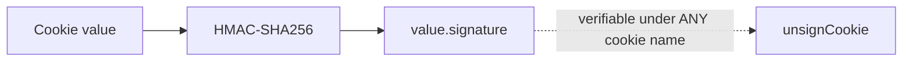
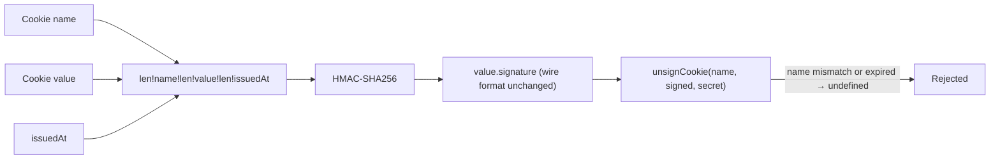

# RFC-031: Context-bound signature construction for signed cookies

| Field                | Value                                                                 |
| -------------------- | --------------------------------------------------------------------- |
| **Status**           | `Approved` |
| **RFC number**       | `031` |
| **Date**             | `2026-07-27` |
| **Author(s)**        | `harden-security-boundaries change` |
| **Group**            | `request-data` |
| **Packages touched** | `@nextrush/cookies` |
| **Framework impact** | `Breaking (needs major + migration)` |
| **Supersedes**       | `—` |
| **Superseded by**    | `—` |
| **Related**          | `ADR-0019`, security-review SEC-07 |

---

## Progress Tracker

**Overall:** `[░░░░░░░░░░░░░░░░░░░░]` 0% — 0 / 4 phases complete · Doc status: `Draft`

| Phase | Part / deliverable                     | Status         |
| ----- | --------------------------------------- | -------------- |
| P0    | Length-prefixed sign/verify with name + issue time | ⬜ Not started  |
| P1    | Legacy value-only acceptance behind an explicit flag | ⬜ Not started  |
| P2    | `signedCookies` middleware threads the cookie name through | ⬜ Not started  |
| P3    | Docs + migration guide + removal-target note | ⬜ Not started  |

---

## 0. Revision History

- **v1 (2026-07-27)** — Initial draft, extracted from `report/security-review.md` finding SEC-07.

---

## 1. Summary (TL;DR)

`@nextrush/cookies`' `signCookie`/`unsignCookie` HMAC the bare cookie value, with no binding to the
cookie's name or issue time. A value signed for one cookie verifies successfully when presented under
a different cookie name, and a signed value never expires independent of the cookie's own `Max-Age`.
`@nextrush/csrf`'s `buildMessage()` already signs a length-prefixed
`<len>!<field>!<len>!<field>` tuple for exactly this reason — this RFC applies the same construction
to `@nextrush/cookies`, adding the cookie name and an issue timestamp to the signed message, with a
time-boxed legacy-acceptance path for rotation.

---

## 1a. Terminology

`Context-bound signature`
: A signature whose input includes not just the payload but the identity/purpose it was issued for
  (here: the cookie name) and, where relevant, a validity window — so the signature cannot be
  replayed under a different identity.

---

## 2. Decision Summary

- **Status:** `Draft`
- **Decision:**
  - _Introduce a length-prefixed `<len>!name!<len>!value!<len>!issuedAt` signing message._
  - _Introduce verification that rejects a name mismatch and an optional expired `issuedAt`._
  - _Introduce `acceptLegacySignatures` (default `false`) for a bounded rotation window._
- **Breaking:** `Yes — see §12`
- **Migration required:** `Yes — a rotation window, see §12`
- **Blast radius:** `medium` — every application using more than one signed cookie, or relying on
  indefinite signed-cookie validity.

---

## 2a. Decision Drivers

Priority (highest → lowest):

1. Security correctness — a signed artifact must not be portable outside the context it was issued for.
2. Consistency — reuse the construction `@nextrush/csrf` already validated, rather than invent a
   second one.
3. Operational continuity — existing signed cookies must have a rotation path, not an instant cliff.

---

## 3. Problem & Motivation

### 3.1 Current state (what exists today)

```ts
// packages/middleware/cookies/src/signing.ts
export async function signCookie(value, secret) {
  const signature = await crypto.subtle.sign(HMAC_ALGORITHM, key, encoder.encode(value));
  return `${value}.${toBase64Url(signature)}`;
}
```

The signed message is the value alone.

### 3.2 The problems (enumerated)

1. **No name binding** — a value signed for cookie `tier` verifies successfully when presented as
   cookie `user`, because the HMAC input never included the name.
2. **No embedded expiry** — a signed value remains valid for as long as the secret is unrotated,
   with no way to bound its lifetime independent of the browser-enforced `Max-Age`.

### 3.3 Why now

SEC-07 is a P2 finding in the completed review; the fix reuses a construction already proven correct
elsewhere in the same codebase (`csrf/token.ts`), so the risk of getting the new construction wrong
is low and the inconsistency of having two standards for the same primitive is itself a maintenance
hazard worth closing now.

---

## 4. Goals & Non-Goals

### 4.1 Goals

- A signed value is rejected when presented under a name other than the one it was signed for (3.2.1).
- A signed value may carry a bounded lifetime enforced independent of the cookie's own attributes
  (3.2.2).
- Existing signed cookies remain verifiable during a defined rotation window.

### 4.2 Non-Goals

- Encrypting cookie values (confidentiality) — this RFC addresses integrity/authenticity binding
  only; `@nextrush/cookies` has no encryption feature today and adding one is a separate RFC.
- A general-purpose signed-token format for use outside cookies — scope is `signCookie`/`unsignCookie`
  and their key-rotation variants.

---

## 5. Impact

- **Affected packages:** `@nextrush/cookies` only.
- **Affected audiences:** Applications using `signedCookies` with more than one signed cookie name, or
  relying on indefinite signed-cookie validity.
- **Explicitly NOT affected:** Plain (unsigned) cookie usage via `cookies()` — unaffected.

---

## 6. Proposed Solution (overview)

| # | Problem (from §3.2) | Solution (this RFC) |
| - | ---------------------- | -------------------------- |
| 1 | No name binding          | Sign `<len>!name!<len>!value!<len>!issuedAt`; verify checks name match |
| 2 | No embedded expiry       | Optional `maxAge` verified from the embedded `issuedAt`, independent of the cookie's own attributes |

---

## 6a. Trade-offs

### Benefits

- One signing construction, one standard, used by both `@nextrush/csrf` and `@nextrush/cookies`.
- A signed value cannot be replayed under a different name even if an application accidentally reuses
  values across cookies.

### Costs

- Breaking for existing deployments; the rotation window (`acceptLegacySignatures`) is itself
  temporary complexity that must be tracked to removal.
- Slightly larger signed payload (name + timestamp now included in the signed message, though not
  necessarily in the wire format — see §8.1).

---

## 7. Architecture

### 7.1 Before



### 7.2 After



### 7.3 Why this architecture

The wire format (`value.signature`) is preserved — only the signed *message* changes, which is why
this is a verification-side breaking change (old signatures fail the new check) rather than a
cookie-format change requiring new parsing. `unsignCookie` gains a required `name` parameter, mirroring
`csrf/token.ts`'s existing `buildMessage(randomHex, sessionId)` shape.

---

## 7a. Architecture Invariants

- Preserved: `@nextrush/cookies` remains dependency-free at runtime (Web Crypto only, as today).
- Preserved: the base64url wire encoding of the signature is unchanged.
- Changed, deliberately: `unsignCookie`'s signature gains a required `name` argument. Justification:
  the whole point of the fix is that verification cannot succeed without knowing the name.

---

## 8. Detailed Design

### 8.1 Public API / surface

```ts
export async function signCookie(
  name: string,
  value: string,
  secret: string,
  options?: { maxAge?: number }
): Promise<string>;

export async function unsignCookie(
  name: string,
  signedValue: string,
  secret: string,
  options?: { acceptLegacySignatures?: boolean }
): Promise<string | undefined>;
```

### 8.2 Internal components

- `buildSignedMessage(name, value, issuedAt)` — length-prefixed construction, mirroring
  `csrf/token.ts`'s `buildMessage`.
- `unsignCookie` — on failure with the new message shape, and only when
  `acceptLegacySignatures` is set, retries verification against the old value-only message before
  returning `undefined`.
- `signedCookies` middleware (`cookies/src/middleware.ts`) — threads `name` through both `get`/`set`
  paths, which it already has in scope.

### 8.3 Request / execution flow

```text
set(name, value, { maxAge }) → signCookie(name, value, secret, { maxAge })
                              → embeds issuedAt = Date.now()
                              → wire cookie unchanged shape: value.signature

get(name) → unsignCookie(name, cookie, secret, { acceptLegacySignatures })
          → verify new message → name+expiry checked
          → (if enabled) fall back to legacy message → log once → return value
          → else undefined
```

### 8.4 Data structures

No new persisted structures; `issuedAt` is embedded in the signed message (not the wire cookie),
recomputed identically at sign and verify time from the same construction.

### 8.5 Error handling

`unsignCookie` returns `undefined` on any failure (name mismatch, expired, malformed) — identical
error-handling shape to today; no new thrown error type, so existing application code that checks
`=== undefined` needs no change beyond the new required `name` argument.

### 8.6 Edge cases

| Scenario                                            | Behaviour                                  |
| ------------------------------------------------------ | -------------------------------------------- |
| Value signed for `tier`, presented as `user`             | `undefined` |
| Signed value past its `maxAge`                          | `undefined` |
| Value containing the separator character                | Round-trips correctly (length-prefixing handles it) |
| Legacy signature, `acceptLegacySignatures: false`        | `undefined` |
| Legacy signature, `acceptLegacySignatures: true`         | Verifies, logs once per process |
| Key rotation combined with the new format                | Each previous key tried against the new message format first, legacy only if enabled |

### 8.7 Examples

```ts
// Before
await ctx.state.signedCookies.set('tier', 'premium');
const value = await ctx.state.signedCookies.get('tier');

// After — same call shape; the middleware threads the name internally
await ctx.state.signedCookies.set('tier', 'premium', { maxAge: 3600 });
const value = await ctx.state.signedCookies.get('tier'); // rejects if replayed as another cookie's value
```

---

## 9. Alternatives Considered

### 9.1 Delimiter-joined message (`name:value:issuedAt`)

Rejected: ambiguous when a field contains the delimiter — the exact class of bug signature-confusion
attacks exploit. Length-prefixing is injective; a delimiter is not, without additional escaping.

### 9.2 Do nothing

Leaves SEC-07 open — a signed value remains portable across cookie names. Not viable for a security
review remediation.

---

## 10. Rejected Ideas

- **JWT as the signed-cookie format** — Rejected: pulls in a JSON envelope and (commonly) a dependency
  for a primitive `@nextrush/cookies` already implements correctly at the crypto level; the fix here
  is the message construction, not the format.

---

## 11. Risks & Mitigations

| Risk                                                     | Mitigation                                                        | Likelihood | Impact |
| ------------------------------------------------------------ | ---------------------------------------------------------------------- | ---------- | ------ |
| Existing signed cookies become unverifiable on upgrade          | `acceptLegacySignatures` rotation window, off by default but documented as the upgrade path | High (expected) | Low (documented, temporary) |
| A developer leaves `acceptLegacySignatures` on indefinitely      | Logs once per process on every legacy acceptance; migration guide states a removal target | Medium | Low |

---

## 12. Backward Compatibility & Migration

- **Compatibility:** Breaking — requires a major bump.
- **Migration path:**

  ```ts
  // Before
  app.use(signedCookies({ secret }));

  // After — during rotation, accept old cookies while issuing new-format ones
  app.use(signedCookies({ secret, acceptLegacySignatures: true }));
  // Remove acceptLegacySignatures once old sessions/cookies have expired naturally.
  ```

- **Deprecation window:** `acceptLegacySignatures` itself is deprecated from introduction — it exists
  to be removed. Target: the following major release after this one ships.

---

## 13. Cross-Cutting Concerns

- **Security:** This RFC's entire purpose.
- **Performance:** One additional length-prefix construction per sign/verify call — negligible
  relative to the existing `crypto.subtle` operation.
- **Runtime independence:** Pure Web Crypto, unchanged from today; no new adapter surface.
- **Observability:** One warning log per process when legacy acceptance is exercised.
- **Zero-dependency rule:** No new runtime dependency.

---

## 14. Success Metrics

| Metric                                   | Baseline (today) | Target / threshold |
| ------------------------------------------- | -------------------- | ---------------------- |
| Cross-name signature replay success rate      | Exploitable today   | 0% |
| Test coverage (`cookies`)                     | current             | 90%+ |

---

## 15. Phased Implementation Plan

| Phase | Goal                                        | Depends on | Exit condition                                    | Status |
| ------ | ---------------------------------------------- | ------------ | ------------------------------------------------------ | -------------- |
| **P0** | Length-prefixed sign/verify with name + issuedAt | — | Cross-name replay test fails as expected (RED→GREEN) | ⬜ Not started |
| **P1** | Legacy acceptance flag                          | P0 | Legacy-signature acceptance test green with flag on/off | ⬜ Not started |
| **P2** | Middleware threads name through                 | P0 | Public usage test green (`set`/`get` unchanged call shape) | ⬜ Not started |
| **P3** | Docs + migration guide                          | P1, P2 | README/ARCHITECTURE rewritten from template            | ⬜ Not started |

### 15.1 Testing strategy

- **Unit:** name-mismatch rejection, expiry rejection, separator round-trip, legacy fallback on/off.
- **Integration:** full `signedCookies` middleware set/get round trip.
- **Coverage:** 90%+ lines/functions.

---

## 16. Rollback Plan

- **Trigger:** a rotation-window defect discovered before merge.
- **Steps:** revert `@nextrush/cookies` to its pre-RFC version; no other package depends on the new
  signature format.

---

## 17. Future Work

- Cookie value encryption (confidentiality) — separate RFC if a future review identifies a need.

---

## 18. Open Questions

- [ ] Is `acceptLegacySignatures`'s removal target the immediately following minor, or the next
  major? Currently proposed as the next major (§12).

---

## 19. Decisions Log

| Question                              | Decision                          | Rationale                                       |
| ----------------------------------------- | -------------------------------------- | ---------------------------------------------------- |
| Delimiter or length-prefix?                | Length-prefix                         | Injective; matches `csrf/token.ts`'s proven construction |
| New format only, or a rotation path?       | Rotation path via explicit opt-in flag | Avoids an instant-cliff break on upgrade             |

---

## 20. References

- `report/security-review.md` — SEC-07.
- `openspec/changes/harden-security-boundaries/` — proposal, design, specs, tasks.
- `docs/adr/ADR-0019-context-bound-signatures.md`.
- `packages/middleware/csrf/src/token.ts` (`buildMessage`) — the construction this RFC reuses.
- `packages/middleware/cookies/src/signing.ts` — current implementation.
