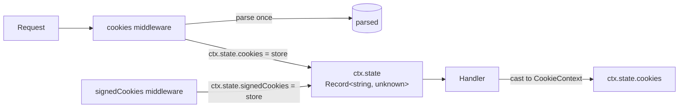
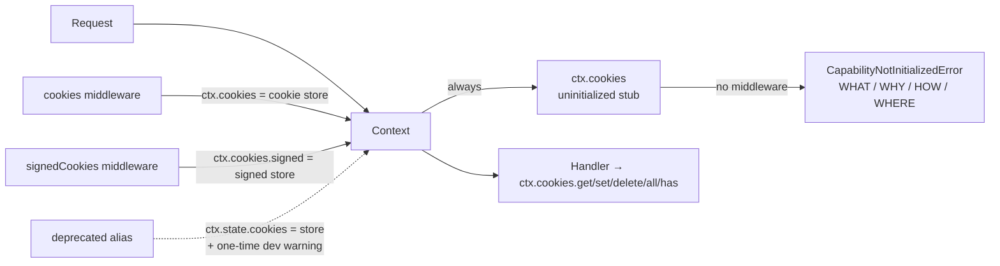

# RFC-034: `@nextrush/cookies` — first-class `ctx.cookies` context capability

| Field                | Value                                                                 |
| -------------------- | --------------------------------------------------------------------- |
| **Status**           | `Accepted` |
| **RFC number**       | `034` |
| **Date**             | `2026-08-16` |
| **Author(s)**        | `Tanzim Hossain` |
| **Group**            | `request-data` |
| **Packages touched** | `@nextrush/types`, `@nextrush/errors`, `@nextrush/runtime`, `@nextrush/cookies`, `@nextrush/adapter-node` |
| **Framework impact** | `Additive, non-breaking (deprecated alias removed in the next major)` |
| **Supersedes**       | `—` |
| **Superseded by**    | `—` |
| **Related**          | `RFC-031`, `ADR-0019`, `ADR-0021` (supersedes `feedback/cookies-rfc.md`, absorbed into this RFC) |

---

## Progress Tracker

**Overall:** `[░░░░░░░░░░░░░░░░░░░░]` 0% — 0 / 4 phases complete · Doc status: `Accepted`

| Phase | Part / deliverable                     | Status         |
| ----- | -------------------------------------- | -------------- |
| P0    | Capability contract in `@nextrush/types`, `CapabilityNotInitializedError`, uninitialized slot in both context bases | ⬜ Not started |
| P1    | `cookies()` / `signedCookies()` middleware refactor to initialize `ctx.cookies`; deprecated alias + one-time warning | ⬜ Not started |
| P2    | Diagnostic message finalization, conformance-suite additions, `previousSecrets` bound | ⬜ Not started |
| P3    | Docs migration (`ctx.cookies` everywhere), migration guide, SameSite wording fix, ADR | ⬜ Not started |

---

## 0. Revision History

- **v1 (2026-08-16)** — Initial draft, consolidates `feedback/cookies-rfc.md` into the house template and resolves its open design questions (uninitialized-state behavior, deferred `Set-Cookie` emission, error scheme).
- **v2 (2026-08-16)** — Status promoted `In Review` → `Accepted`. Pre-acceptance dependency-direction check passed: `@nextrush/cookies` is imported only by itself and `@nextrush/middleware/security` (middleware→middleware); no core/runtime/adapter imports it; its only dependency is types-only `@nextrush/types`. Acceptance is conditional on preserving this invariant through P0–P3 and keeping the existing cookie behavior tests green.

---

## 1. Summary (TL;DR)

Cookies are currently exposed as `ctx.state.cookies`, which mixes an HTTP capability into
open-ended application state and — because `ContextState` is `Record<string | symbol, unknown>`
— makes the cookie API unusable in TypeScript without a manual cast. This RFC promotes cookies to
a first-class `ctx.cookies` property on `Context`, with signed cookies nested as
`ctx.cookies.signed`. The property always exists; when no cookie middleware has run, every
operation throws an actionable `CapabilityNotInitializedError` instead of an
"undefined property" TypeError. `ctx.state.cookies` remains as a deprecated alias for one release
cycle and is removed in the next major.

---

## 1a. Terminology

`Capability`
: A stable, framework-owned feature surface exposed as a first-class `ctx.<name>` property with
  defined semantics (cookies), as opposed to arbitrary middleware/application data, which belongs
  in `ctx.state`.

`Cookie store`
: The per-request object the cookie middleware builds — parsed cookies plus `get`/`set`/`delete`/
  `all`/`has` and the `signed` sub-capability — the thing that actually serves `ctx.cookies`.

`Uninitialized slot`
: A frozen, process-shared stub object that occupies `ctx.cookies` before any cookie middleware
  runs. Accessing the property is always safe; invoking any operation throws
  `CapabilityNotInitializedError`.

---

## 2. Decision Summary

- **Status:** `Accepted`
- **Decision:**
  - _Introduce `ctx.cookies: CookieCapability` on `Context`, activated by the `cookies()` middleware._
  - _Introduce `ctx.cookies.signed` as the nested signed-cookie capability, activated by `signedCookies()`._
  - _Introduce a reusable `CapabilityNotInitializedError` (WHAT/WHY/HOW/WHERE diagnostic) thrown by the uninitialized slot._
  - _Deprecate `ctx.state.cookies` / `ctx.state.signedCookies` as aliases with a one-time-per-process dev warning; remove in the next major._
  - _Move the public cookie data contracts (`CookieOptions`, `SameSiteValue`, `CookiePriority`, `ParsedCookies`) to `@nextrush/types`; `@nextrush/cookies` re-exports them unchanged._
- **Breaking:** `No` — additive today; the alias removal is a scheduled breaking change for the next major, see §12.
- **Migration required:** `None now` — optional adoption; mandatory before the next major, see §12.
- **Blast radius:** `medium` — every application using cookies (type-level change is additive; runtime alias preserved), plus `@nextrush/types` / `@nextrush/runtime` / `@nextrush/errors` internal surface.

---

## 2a. Decision Drivers

Priority (highest → lowest):

1. Developer experience — the cookie API must typecheck without casts and fail with actionable diagnostics.
2. Architectural coherence — HTTP capabilities are first-class; `ctx.state` stays open-ended application state.
3. Runtime independence — identical observable behavior across Node/Bun/Deno/Edge (AGENTS.md §7).
4. Backward compatibility — one release cycle of `ctx.state.cookies` as a deprecated alias.
5. Performance — zero measurable hot-path regression (shared uninitialized stub, parse-once preserved).

---

## 3. Problem & Motivation

### 3.1 Current state (what exists today)

```ts
// packages/types/src/context.ts (today)
export type ContextState = Record<string | symbol, unknown>;

// packages/middleware/cookies/src/middleware.ts (today)
export function cookies(options: CookieMiddlewareOptions = {}): Middleware {
  return async function cookiesMiddleware(ctx, next) {
    const parsed = parseCookies(cookieHeader, { decode: decode === undefined });
    const cookieContext: CookieContext = { get, set, delete, all, has };
    ctx.state.cookies = cookieContext;   // ← the HTTP capability rides on app state
    await next();
  };
}
```

Cookies reach the handler as `ctx.state.cookies` and `ctx.state.signedCookies`, attached at
runtime by middleware. Nothing in the type system knows this: `ctx.state.cookies` is `unknown`,
so every consumer must cast — the package's own tests all write
`ctx.state.cookies as CookieContext` (15 occurrences in `src/__tests__/edge-cases.test.ts`).

### 3.2 The problems (enumerated)

1. **No type safety, no discoverability.** Because `ContextState` is `Record<string | symbol,
   unknown>`, `ctx.state.cookies.get(...)` is a compile error in strict TS. The user-visible
   symptom is real and recurring: "`ctx.state.cookies` is of type 'unknown'" — the docs must
   teach a cast (`apps/website/content/docs/reference/(request-body)/cookies.mdx`, "Typing
   `ctx.state`"), which is a workaround for an architecture problem, not a feature.

2. **`ctx.state` becomes a dependency bucket.** Every middleware capability attaches at the same
   namespace as application data (`ctx.state.user`, `ctx.state.tenant`, `ctx.state.requestId`),
   so framework capabilities and app state are indistinguishable, and the framework reserves no
   way to type one without typing the other.

3. **No failure mode for a missing middleware.** If `cookies()` is not registered (or is skipped
   for the request), `ctx.state.cookies` is simply `undefined` and the handler dies with
   `TypeError: Cannot read properties of undefined (reading 'get')` — no hint about the actual
   mistake. See also problem 4 for the adjacent case.

4. **Two namespaces for one concept.** `signedCookies()` installs a sibling `ctx.state.signedCookies`,
   so signed and unsigned cookies are two unrelated top-level state keys rather than one
   capability with two modes.

### 3.3 Why now

The package is pre-1.0 and the framework is actively codifying its Context contract
(`docs/RFC/request-data/029-canonical-request-path.md`, `docs/adr/ADR-0021`). Every future
middleware that stores a capability in `ctx.state` entrenches the wrong pattern and makes the
eventual migration larger. Fixing the naming now costs one deprecation cycle; fixing it after a
`session`/`auth`/`identity` package ships costs several.

---

## 4. Goals & Non-Goals

### 4.1 Goals

- `ctx.cookies.get/set/delete/all/has` typechecks with no cast (3.2.1).
- `ctx.cookies` exists on every request, and invoking it without the middleware throws an
  actionable NextRush diagnostic naming the fix (3.2.3).
- `ctx.cookies.signed` houses signed cookies under one capability (3.2.4).
- `ctx.state` returns to being open-ended application data only (3.2.2).
- `ctx.state.cookies` keeps working for one release with a one-time dev warning (§12).
- Existing security behavior is untouched: `secure: 'auto'` default (SEC-08), eager `Set-Cookie`
  writes (CK-1), parse-once, first-occurrence-wins, prefix enforcement, key rotation.

### 4.2 Non-Goals

- No `ctx.request` / `ctx.response` / `ctx.session` / `ctx.identity` introduction — this RFC
  only establishes the capability *pattern*; each future capability is its own RFC.
- No encrypted cookies — signing is integrity, not confidentiality (RFC-031).
- No deferred `Set-Cookie` emission — rejected, see §10.
- No module augmentation for `ctx.state` — superseded by the first-class property; `ctx.state`
  stays `unknown`-typed by design.
- No session storage — cookies remain a low-level HTTP primitive (`docs/RFC/class-runtime/032-session-position.md`).

---

## 5. Impact

- **Affected packages:** `@nextrush/types` (contract + moved data types), `@nextrush/errors`
  (new error class), `@nextrush/runtime` (uninitialized stub + slot in `WebContextBase`),
  `@nextrush/adapter-node` (slot in `NodeContext`), `@nextrush/cookies` (middleware refactor +
  re-exports), plus docs (`apps/website/content/docs/**`), tests, and the conformance suite.
- **Affected audiences:** Application developers (new API, deprecated alias), middleware authors
  (the capability pattern), adapter authors (one new field to wire).
- **Explicitly NOT affected:** the functional (`nextrush`) entry point and the meta package
  (cookies remain a separate install); other middleware packages; the `@nextrush/cookies`
  low-level exports (`parseCookies`, `serializeCookie`, `signCookie`, presets, helpers) — all
  unchanged.

---

## 6. Proposed Solution (overview)

| # | Problem (from §3.2) | Solution (this RFC) |
| - | ------------------- | ------------------- |
| 1 | No type safety / discoverability | `ctx.cookies: CookieCapability` on `Context`; `@nextrush/cookies` re-exports the contracts from `@nextrush/types`. |
| 2 | `ctx.state` as dependency bucket | Cookies (and only cookies) move off `ctx.state` onto the first-class property; the design rule in §6 below governs future capabilities. |
| 3 | `undefined` failure mode | `ctx.cookies` always exists; operations on the uninitialized slot throw `CapabilityNotInitializedError` with install instructions. |
| 4 | Two namespaces for one concept | `ctx.cookies.signed` nests signed cookies under the same capability; `signedCookies()` activates it and fails loudly if `cookies()` never ran. |

The key idea: the *property* is a framework contract, the *activation* is middleware's job.
Contexts are created with `cookies` pointing at a frozen, process-shared stub whose methods throw
a four-part diagnostic (WHAT / WHY / HOW / WHERE). `cookies()` replaces the reference with the
per-request cookie store; `signedCookies()` replaces the store's `signed` sub-slot. Accessing
`ctx.cookies` itself never throws, so `console.log(ctx.cookies)` is safe.

Design rule (recorded for future Context decisions):

> If a feature represents a stable HTTP/framework capability with defined semantics, prefer a
> first-class `ctx.<capability>` API. If it represents arbitrary request-scoped data produced by
> middleware or application code, use `ctx.state`.

---

## 6a. Trade-offs

### Benefits

- No casts, no `?.`, no `if (ctx.cookies)` — the API is typed and always present.
- The "forgot the middleware" bug becomes a teaching diagnostic instead of an opaque TypeError.
- One reusable pattern (`CapabilityNotInitializedError` + uninitialized slot) for every future
  middleware-provided capability, instead of per-package ad-hoc behavior.
- `@nextrush/types` owns the cookie contracts, so future packages (session, csrf) can depend on
  them without depending on the middleware package.

### Costs

- A new mandatory property on `Context` — every context implementation (5 adapter classes and
  test doubles) must wire it, and `Context` gets slightly bigger.
- Public data types move packages (`@nextrush/cookies` → `@nextrush/types`), touching import
  sites in the middleware package (mitigated by re-exports).
- One deprecation cycle of dual maintenance for `ctx.state.cookies` alias + warning machinery.

---

## 7. Architecture

### 7.1 Before



### 7.2 After



### 7.3 Why this architecture

The layering constraint is "core/runtime never imports middleware" (AGENTS.md §7, project rules
§2), so the contract and the stub live in the neutral packages: the `CookieCapability` interface
in `@nextrush/types` (which middleware already depends on types-only), the error in
`@nextrush/errors`, and the shared uninitialized stub in `@nextrush/runtime` — which
`WebContextBase` (Bun/Deno/Edge) and `NodeContext` (which does not extend `WebContextBase`) both
import. `@nextrush/cookies` implements the contract without any package in the core/adapters
layer ever knowing the middleware exists. The stub is a process-wide singleton, so requests that
never touch cookies pay zero per-request allocation.

---

## 7a. Architecture Invariants

- **Core/runtime/adapters never import middleware** — preserved: the capability contract lives in
  `@nextrush/types`, the stub in `@nextrush/runtime`; `@nextrush/cookies` remains the sole
  implementation and is not imported upward.
- **Runtime independence (AGENTS.md §7)** — preserved: the stub and store speak only Web-standard
  APIs; `crypto.subtle`, `TextEncoder`, and the existing `@nextrush/errors` base are the only
  runtime surfaces touched.
- **Eager `Set-Cookie` writes (CK-1)** — preserved: stores keep writing `Set-Cookie` at
  `set()`/`delete()` time, because adapters commit the response when the handler sends a body.
- **Zero runtime dependencies for `@nextrush/cookies`** — preserved: the only dependency remains
  types-only `@nextrush/types` (the error class is thrown *by the runtime stub*, not imported by
  the middleware).

---

## 8. Detailed Design

### 8.1 Public API / surface

```ts
// packages/types/src/cookies.ts (new, contract home)
export interface CookieCapability {
  get(name: string): string | undefined;
  set(name: string, value: string, options?: CookieOptions): void;
  delete(name: string, options?: Pick<CookieOptions, 'domain' | 'path'>): void;
  all(): ParsedCookies;
  has(name: string): boolean;
  /** Signed-cookie sub-capability; throws CapabilityNotInitializedError until signedCookies() runs. */
  readonly signed: SignedCookieCapability;
}

export interface SignedCookieCapability {
  get(name: string): Promise<string | undefined>;
  set(name: string, value: string, options?: CookieOptions): Promise<void>;
  delete(name: string, options?: Pick<CookieOptions, 'domain' | 'path'>): void;
}

// packages/types/src/context.ts — the Context contract gains exactly one member:
cookies: CookieCapability; // assigned by cookies() middleware; never optional, never undefined
```

`CookieOptions`, `SameSiteValue`, `CookiePriority`, and `ParsedCookies` move from
`packages/middleware/cookies/src/types.ts` to `packages/types/src/cookies.ts`; `@nextrush/cookies`
re-exports every moved type, so `import type { CookieOptions } from '@nextrush/cookies'` keeps
working. The full default set is unchanged and stays enforceable:

```ts
// DEFAULT_COOKIE_OPTIONS (constants.ts, unchanged)
{ httpOnly: true, sameSite: 'lax', path: '/', secure: 'auto' } // secure: 'auto' per SEC-08
```

```ts
// packages/errors/src/capability.ts (new)
export class CapabilityNotInitializedError extends NextRushError {
  readonly capability: string;
  constructor(capability: string, instructions: string);
  // code: '<CAPABILITY>_NOT_INITIALIZED' (e.g. 'COOKIES_NOT_INITIALIZED'),
  // status: 500, expose: false — a developer error, never serialized to clients.
}
```

### 8.2 Internal components

- **`@nextrush/runtime/src/capabilities.ts`** — owns `UNINITIALIZED_COOKIES`, a frozen
  `CookieCapability` stub whose five methods (plus every `signed` method) throw a
  pre-built `CapabilityNotInitializedError('cookies', COOKIE_INSTALL_INSTRUCTIONS)`. One
  process-wide instance; no state, no allocation per request. Also exports
  `UNINITIALIZED_SIGNED_COOKIES` for the `signed` sub-slot.
- **`WebContextBase`** (Bun/Deno/Edge) and **`NodeContext`** — construct with
  `this.cookies = UNINITIALIZED_COOKIES`. The property is reassignable; that reassignment is the
  activation mechanism and is documented as reserved for the cookie middleware.
- **`cookies()` middleware** — unchanged parsing logic (parse-once, first-occurrence-wins,
  50-cookie cap, CRLF sanitize). After building the store it does:

  ```ts
  ctx.cookies = cookieStore;                 // activation (typed, no cast anywhere)
  ctx.state.cookies = cookieStore;           // deprecated alias, see 8.5
  warnStateCookiesDeprecatedOnce();          // dev-only, once per process
  ```

  The store's `signed` member starts as `UNINITIALIZED_SIGNED_COOKIES`.
- **`signedCookies()` middleware** — first asserts `ctx.cookies !== UNINITIALIZED_COOKIES`,
  throwing the same `COOKIES_NOT_INITIALIZED` diagnostic (cause: "`signedCookies` requires
  `cookies()` to be registered first") when `cookies()` never ran. Then builds the signed store
  (existing HMAC/rotation logic, RFC-031) and assigns `ctx.cookies.signed = signedStore`, plus
  the deprecated `ctx.state.signedCookies` alias.

### 8.3 Request / execution flow

```text
request → adapter builds Context (ctx.cookies = UNINITIALIZED_COOKIES, shared singleton)
        → middleware chain:
            cookies()?  → ctx.cookies = cookie store (parse-once); ctx.state.cookies alias
            signedCookies()? → ctx.cookies.signed = signed store (requires cookies() first)
        → handler: ctx.cookies.get/set/delete/all/has  (typed, no cast)
        → response: Set-Cookie headers already emitted eagerly at set()/delete() time (CK-1)
```

### 8.4 Data structures

`ctx.cookies` is a plain mutable field, not a getter, so the uninitialized state costs one shared
object for the whole process and the initialized state costs the same single per-request store
that exists today. No proxy, no per-access check, no lazy allocation — the activation is one
reference swap on the middleware hot path.

### 8.5 Error handling

`CapabilityNotInitializedError` renders the four-part diagnostic in `message`:

```text
Cookie capability is not initialized.

You called:
  ctx.cookies.get("session")

But no cookie middleware has run for this request. Possible causes:
  1. @nextrush/cookies is not registered:
       import { cookies } from '@nextrush/cookies';
       app.use(cookies());
  2. The middleware is registered after this route.
  3. The middleware is conditionally skipped for this request.

Docs: https://nextrush.dev/docs/reference/cookies
```

The class name is generic so the pattern is reusable (`CapabilityNotInitializedError('session', …)`
tomorrow); the capability name and instructions are per-instance. The deprecated alias does not
change error behavior — it works identically for one release, and emits (in development only, once
per process, following the existing `warnLegacyAcceptanceOnce` pattern) a warning pointing at
`ctx.cookies`.

### 8.6 Edge cases

| Scenario | Behaviour |
| -------- | --------- |
| `ctx.cookies` accessed, no middleware | Property access is safe (returns the stub); any method call throws `CapabilityNotInitializedError` (code `COOKIES_NOT_INITIALIZED`). |
| `signedCookies()` registered without `cookies()` | `signedCookies` middleware throws the same diagnostic at request start with an explicit "register `cookies()` first" cause. |
| `ctx.cookies.signed` used, `cookies()` ran but `signedCookies()` didn't | `signed.get/set/delete` throw `CapabilityNotInitializedError` (code `SIGNED_COOKIES_NOT_INITIALIZED`). |
| Duplicate cookie names in header | First occurrence wins (RFC 6265) — unchanged. |
| Empty value (`session=`) vs missing | Empty string is a present cookie; `get()` returns `''`, `has()` returns `true`; missing returns `undefined` — unchanged, documented. |
| Non-string value passed to `set()` | Silently sanitized to `''` (existing behavior, unchanged); documented in the reference page as a known trap. |
| `ctx.cookies` reassigned by user code | Documented as reserved for the middleware; a user reassignment is a bug that fails loudly on the next operation, same as today's `ctx.state` misuse. |

### 8.7 Examples

```ts
import { createApp } from 'nextrush';
import { cookies, signedCookies } from '@nextrush/cookies';

const app = createApp();

app.use(cookies());                                   // activates ctx.cookies
app.use(signedCookies({ secret: process.env.COOKIE_SECRET! }));

app.post('/login', (ctx) => {
  ctx.cookies.set('token', 'abc123', { httpOnly: true, maxAge: 604800 });
  ctx.json({ ok: true });
});

app.get('/me', async (ctx) => {
  const session = ctx.cookies.get('token');           // typed string | undefined
  const user = await ctx.cookies.signed.get('user');  // typed string | undefined
  ctx.json({ session, user });
});
```

---

## 9. Alternatives Considered

### 9.1 Keep `ctx.state.cookies` + module augmentation

Augment `ContextState` so `ctx.state.cookies` is typed. **Rejected** — it solves only problem
3.2.1 and doubles down on 3.2.2/3.2.4; `ctx.state` remains the dependency bucket, and the
augmentation must be maintained forever as the framework grows.

### 9.2 Optional property (`cookies?: CookieCapability`)

Type it as optional and let `undefined` signal "middleware missing". **Rejected** — forces
`ctx.cookies?.get(...)` and `if (ctx.cookies)` noise into every handler, and `undefined` gives no
diagnostic for *why* (feedback §3.3), violating driver 1.

### 9.3 Do nothing

Keep `ctx.state.cookies` + the documented cast. **Rejected** — the cast tax is permanent, the
"forgot middleware" failure stays an opaque TypeError, and every later capability (session,
identity) either inherits the wrong pattern or forces a larger, later migration (§3.3).

---

## 10. Rejected Ideas

- **Defer `Set-Cookie` emission to response finalization** (feedback §11) — _Rejected because the
  Node adapter commits the response the moment the handler sends a body (CK-1); deferred emission
  would silently drop cookies. Eager writes already produce correct multiple-`Set-Cookie`
  behavior via the adapter's append semantics._
- **Throwing on `ctx.cookies` property access** — _Rejected because reading/inspecting the
  property must be safe (e.g. `console.log(ctx.cookies)`); only operations throw._
- **`NR-COOKIE-001` style error codes** — _Rejected because the repo's code convention is
  `UPPER_SNAKE` (`@nextrush/errors` registry); a `NR-`-prefixed scheme is a separate,
  framework-wide decision. This RFC uses `COOKIES_NOT_INITIALIZED` / `SIGNED_COOKIES_NOT_INITIALIZED`._
- **Per-request deprecation warning for the alias** — _Rejected as log noise; once-per-process
  matches the existing legacy-signature warning pattern._
- **`signedCookies()` auto-registering `cookies()`** — _Rejected because implicit side effects
  hide ordering mistakes; throwing with a cause teaches the fix._
- **Per-request stub allocation** — _Rejected; a shared frozen singleton keeps the non-cookie
  hot path at zero allocations (HP-15-style concern)._

---

## 11. Risks & Mitigations

| Risk | Mitigation | Likelihood | Impact |
| ---- | ---------- | ---------- | ------ |
| Adapter drift — `NodeContext` (not a `WebContextBase` subclass) misses the slot wiring | Shared `UNINITIALIZED_COOKIES` import in both bases plus a conformance-suite case asserting `ctx.cookies` exists and throws identically on all four adapters | Low | High |
| Users miss the deprecation warning (dev-only) and are surprised by alias removal | Migration guide + release notes + docs migration table (§12); removal only in the next major | Medium | Medium |
| The `@nextrush/types` type move breaks deep imports in downstream packages | Re-exports from `@nextrush/cookies` keep every existing import path working; workspace typecheck catches the rest | Low | Medium |
| A future capability copies the pattern inconsistently | §6 design rule + this RFC as the canonical pattern; each new capability is RFC-gated | Low | Low |

---

## 12. Backward Compatibility & Migration

- **Compatibility:** `Additive & non-breaking today` — `ctx.cookies` is new; `ctx.state.cookies`
  and `ctx.state.signedCookies` keep working as aliases. The alias removal is a **breaking change
  scheduled for the next major release**.
- **Migration path:**

  ```ts
  // Before
  ctx.state.cookies.get('session');
  ctx.state.cookies.set('session', value, { httpOnly: true });
  ctx.state.signedCookies.get('user');            // plus the `as CookieContext` cast

  // After
  ctx.cookies.get('session');
  ctx.cookies.set('session', value, { httpOnly: true });
  ctx.cookies.signed.get('user');                 // no cast, fully typed
  ```

- **Deprecation window:** alias retained with a dev-only one-time warning for one release cycle;
  removed in the next major (version bump + migration notes per project rules §7).

---

## 13. Cross-Cutting Concerns

- **Security:** No change to cookie security semantics — `secure: 'auto'` (SEC-08), prefix
  enforcement, CRLF sanitization, constant-time HMAC verification (WebCrypto `crypto.subtle.verify`
  plus the existing `timingSafeEqual` fallback), and key rotation all carry over unchanged. The
  error is a developer diagnostic with `expose: false`; it never serializes install instructions
  or internal paths to clients. Docs additionally reword `SameSite=Lax` claims from "prevents CSRF"
  to "limits cross-site cookie transmission and provides baseline CSRF mitigation" (feedback §15).
- **Performance:** One shared frozen singleton for the uninitialized path (zero per-request
  allocation); the initialized path allocates the same single store object it does today.
  Parse-once-per-request is preserved. No proxy/getter indirection on the hot path.
- **Runtime independence:** Stub, store, and error use only Web-standard APIs and
  `@nextrush/errors`; no `node:*`, `process`, `Deno`, or `Bun` in the new surface. Conformance
  suite (§15) proves identical observable behavior across adapters.
- **Observability:** Nothing new logged except the one-time dev deprecation warning; the
  `CapabilityNotInitializedError` carries `capability` and `code` fields for structured logging
  and is visible in dev error output with the full WHAT/WHY/HOW/WHERE message.
- **Zero-dependency rule:** No new runtime dependencies anywhere; `@nextrush/cookies` remains
  types-only-dependent on `@nextrush/types`.

---

## 14. Success Metrics

| Metric | Baseline (today) | Target / threshold |
| ------ | ---------------- | ------------------ |
| Per-request allocation (cookie path) | 1 store object | 1 store object (no regression) |
| Per-request allocation (no-cookie path) | 0 | 0 (shared stub) |
| Cookie-header parses per request | 1 | 1 (no regression) |
| Casts needed to use cookies in examples | `as CookieContext` everywhere | 0 |
| Test coverage (`@nextrush/cookies`, `@nextrush/runtime`, `@nextrush/errors`) | — | 90%+ lines/functions, CI-enforced |

---

## 15. Phased Implementation Plan

| Phase | Goal (what ships) | Depends on | Exit condition (checkable) | Status |
| ----- | ----------------- | ---------- | -------------------------- | ------ |
| **P0** | `CookieCapability`/`SignedCookieCapability` + moved contracts in `@nextrush/types`; `CapabilityNotInitializedError` in `@nextrush/errors`; `UNINITIALIZED_COOKIES`/`UNINITIALIZED_SIGNED_COOKIES` in `@nextrush/runtime`; slot wired in `WebContextBase` and `NodeContext` | — | Unit tests green: stub methods throw with code `COOKIES_NOT_INITIALIZED`; property access does not throw; both context bases expose the slot | ⬜ Not started |
| **P1** | `cookies()` initializes `ctx.cookies` (parse/validate/eager-write logic unchanged); `signedCookies()` initializes `ctx.cookies.signed` and throws without `cookies()`; deprecated aliases + one-time dev warning; type re-exports from `@nextrush/cookies` | P0 | Existing cookie test suite green against the new property; alias tests green; warning emitted once per process | ⬜ Not started |
| **P2** | Final diagnostic copy (WHAT/WHY/HOW/WHERE); `previousSecrets` bound (cap at 10, config-time throw); conformance-suite cases for the uninitialized path on node/bun/deno/edge | P1 | Conformance green on all four adapters; error snapshot tests green | ⬜ Not started |
| **P3** | Docs migration to `ctx.cookies` across `apps/website/content/docs/**` and package READMEs; migration guide; SameSite wording fix; ADR promotion | P2 | `docs:verify` clean; no `ctx.state.cookies` remains in shipped examples; ADR drafted | ⬜ Not started |

### 15.1 Testing strategy

- **Unit:** stub behavior, error fields/message, store activation, alias + warning, rotation cap.
- **Integration:** full request through each adapter with and without the middleware (both
  failure modes: no `cookies()`, `signedCookies()` without `cookies()`).
- **Cross-adapter:** conformance suite asserts identical observable behavior — `ctx.cookies`
  exists, throws identically when uninitialized, works identically when activated.
- **Coverage:** 90%+ lines/functions per touched package (CI-enforced).

---

## 16. Rollback Plan

- **Trigger:** A §14 metric regression (allocation/parse count) on the benchmark harness, a
  conformance failure on any adapter, or a reported break in `ctx.state.cookies` consumers.
- **Steps:**
  - Revert `@nextrush/runtime` / `@nextrush/errors` / `@nextrush/types` to the previous version —
    `@nextrush/cookies` is unchanged in its parsing/serialization internals, so the old
    `ctx.state.cookies` path is fully restored by reverting the middleware's assignment line.
  - Keep the `ctx.cookies` property on `Context` if already shipped (it is additive and harmless
    uninitialized).
  - No published artifacts, caches, or migrations need cleanup — the change is code-only and
    unshipped at rollback time.

---

## 17. Future Work

- `ctx.session` / `ctx.identity` / `ctx.auth` as first-class capabilities — each its own RFC,
  gated by the §6 design rule (`032-session-position.md` stays authoritative for session scope).
- Encrypted (`ctx.cookies.encrypted`) sub-capability — only with a demonstrated architectural
  need; signing is not encryption (RFC-031).
- A framework-wide `NR-`-prefixed error-code scheme — deferred; this RFC follows the existing
  `UPPER_SNAKE` convention (§10).

---

## 18. Open Questions

- [ ] **Removal release for the `ctx.state.cookies` alias** — this RFC commits to "next major";
      the exact version is decided at release planning.
- [ ] **Should `CapabilityNotInitializedError` live in `@nextrush/errors` or a new
      `@nextrush/capabilities` package?** — Leaning `@nextrush/errors` (zero new packages for one
      class); revisit only if more than two capabilities adopt the pattern.

---

## 19. Decisions Log

| Question | Decision | Rationale |
| -------- | -------- | --------- |
| Where does the capability contract live? | `@nextrush/types` | Core/runtime never imports middleware; types are the contract owner. |
| Where does the uninitialized stub live? | `@nextrush/runtime` (`capabilities.ts`) | Both context families (Web + Node) already depend on runtime; shared singleton prevents drift. |
| Optional property vs always-present stub? | Always-present stub | Property access stays safe; operations fail with the diagnostic (feedback §"don't check at access"). |
| Deferred vs eager `Set-Cookie`? | Eager (unchanged) | CK-1: adapters commit on body send; deferred emission drops cookies. |
| Error code scheme | `COOKIES_NOT_INITIALIZED` / `SIGNED_COOKIES_NOT_INITIALIZED` | Existing `UPPER_SNAKE` convention; no `NR-` scheme exists yet. |
| Deprecation warning frequency | Once per process, dev only | Matches the legacy-signature warning pattern; avoids log noise. |
| `previousSecrets` bound | Cap at 10, throw at config time | Bounds per-verify work during rotation (feedback §21). |
| Accept the RFC | Accepted, conditional | Dependency-direction invariant verified pre-acceptance; condition = invariant preserved in P0–P3 + existing cookie tests stay green. Number `034` is permanently assigned to this decision — never renumbered. |

---

## 20. References

- `feedback/cookies-rfc.md` (deleted) — the original proposal, fully consolidated into this RFC; all of its substantive content appears here.
- `docs/RFC/request-data/031-context-bound-signatures.md` — signed-cookie format (RFC-031).
- `docs/adr/ADR-0019-context-bound-signatures.md`, `docs/adr/ADR-0021-fast-property-request-containers.md`.
- `docs/RFC/class-runtime/032-session-position.md` — session scope fence.
- `packages/types/src/context.ts`, `packages/runtime/src/web-context-base.ts`,
  `packages/adapters/node/src/context.ts`, `packages/errors/src/base.ts`,
  `packages/middleware/cookies/src/{middleware,signed-middleware,secure-resolution,validation}.ts`.
