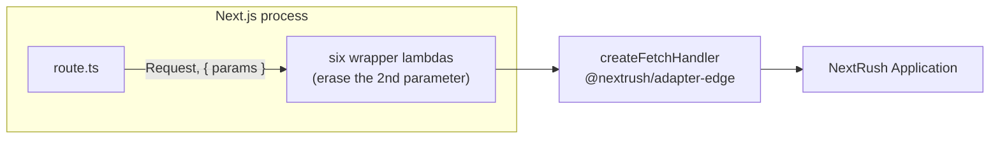
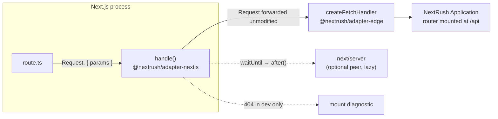

# RFC-024: `@nextrush/adapter-nextjs` — mount a NextRush app in a Next.js App Router route handler

| Field                | Value                                                                 |
| -------------------- | --------------------------------------------------------------------- |
| **Status**           | `Shipped`                                                             |
| **RFC number**       | `024`                                                                 |
| **Date**             | `2026-07-25`                                                          |
| **Author(s)**        | Tanzim Hossain                                                        |
| **Group**            | `runtime-adapters`                                                    |
| **Packages touched** | `@nextrush/adapter-nextjs` (new), `nextrush` (new `./nextjs` subpath), `@nextrush/adapters-conformance` (new driver) |
| **Framework impact** | Additive, non-breaking. No existing package changes. |
| **Supersedes**       | `—`                                                                   |
| **Superseded by**    | `—`                                                                   |
| **Related**          | `RFC-013` (adapter contract), `RFC-014` (`@nextrush/adapter-serverless`), `RFC-020` (optional-peer install boundary), `RFC-023` (`nextrush doctor`), `ADR-0007`, `ADR-0009`, `ADR-0010` |

---

## Progress Tracker

**Overall:** `[████████████████████]` 100% — 4 / 4 phases complete · Doc status: `Shipped` · ADR: `ADR-0014`

| Phase | Part / deliverable                                          | Status        |
| ----- | ----------------------------------------------------------- | ------------- |
| P0    | Mount-mismatch diagnostic (pure function)                    | ✅ Done |
| P1    | `handle()` public surface + `after()` wiring                 | ✅ Done |
| P2    | Cross-runtime conformance driver + `next build` matrix (14/15/16) | ✅ Done |
| P3    | Docs, `ARCHITECTURE.md`, meta exports                        | ✅ Done |

---

## 0. Revision History

- **v1 (`2026-07-25`)** — Initial draft. Verified against Next.js 16.2.11 docs and
  `packages/adapters/{edge,node,serverless}` on `release/4.0.0-beta` (`670fa4b`).
- **v2 (`2026-07-25`)** — Pages Router dropped (§4.2, §9.2), so the package became a single
  Web-standard entry point with no `node:*` import and no changes to any existing package. Version
  matrix pinned to Next 14/15/16.
- **v3 (`2026-07-25`)** — **Path handling reversed to prepend.** Verified that Hono's `basePath()`
  is a *route-registration* prefix, not a request rewrite: `api.get('/book')` registers
  `GET /api/book`, and `c.req.path` stays the true request pathname. NextRush already has that
  mechanism (`app.route('/api', router)`), so the bridge no longer rewrites anything. Removed from
  the design: prefix inference as a routing mechanism, request reconstruction, the `basePath`
  option, `x-forwarded-prefix` propagation, and `getMountPath()`. Consequences: `ctx.path` and
  `ctx.url` are always true, the streaming-body/`duplex` cross-runtime risk disappears with the
  reconstruction that created it, and the bridge adds zero allocations. Inference survives in one
  place only — a development-mode 404 diagnostic (§8.4) that turns the one mistake this design can
  produce into an actionable message, which is more than the prior art does.

---

## 1. Summary (TL;DR)

A NextRush app cannot currently be exported from a Next.js route handler without a hand-written
wrapper per method and a silently broken `ctx.waitUntil()`. This RFC adds
`@nextrush/adapter-nextjs`, imported as `nextrush/nextjs`, whose `handle(app)` returns all seven
route-handler exports in one statement. It rewrites nothing and adds no path semantics: routes are
mounted with `app.route('/api', router)` exactly as they are anywhere else, so the context a
handler sees inside Next is byte-identical to the one it sees under `listen()`. The consequence: a
NextRush API inside Next.js is ordinary NextRush code plus one export line, with no new concepts to
learn and no runtime-specific import in the package.

---

## 1a. Terminology

`Route handler`
: A Next.js App Router `route.ts` file exporting one named function per HTTP method. Next supports
exactly `GET`, `POST`, `PUT`, `PATCH`, `DELETE`, `HEAD`, `OPTIONS`.

`Mount prefix`
: The path segments between the site root and a route file — `/api` for
`app/api/[[...route]]/route.ts`.

`Prepend`
: Registering routes *including* the prefix (`app.route('/api', router)`), so matching runs against
the true request path. What this RFC does, and what Hono's `basePath()` does.

`Strip`
: Rewriting the request to remove the prefix before matching, so routes are registered without it.
Considered and rejected — §9.3.

`Bridge`
: This package's role. It owns no request pipeline, no context type, no error path, and no path
semantics — it delegates to `@nextrush/adapter-edge`'s `createFetchHandler`.

---

## 2. Decision Summary

- **Status:** `Approved`
- **Decision:**
  - **Introduce** `@nextrush/adapter-nextjs`, re-exported as `nextrush/nextjs` (optional peer, same
    wiring as `nextrush/class`).
  - **Introduce** `handle(appOrFactory, options?)` → `{ GET, POST, PUT, PATCH, DELETE, HEAD, OPTIONS }`.
    Options are `timeout` and `onError`. Nothing else.
  - **Prepend, never strip.** Routes are mounted with the prefix; the request is never modified.
  - **App Router only**, Next **14 / 15 / 16**, each proven by a `next build` fixture in CI.
  - **Keep** every existing export in every existing package unchanged.
- **Breaking:** `No`
- **Migration required:** `None`
- **Blast radius:** `low` — purely additive; one new package, one new meta subpath.

---

## 2a. Decision Drivers

Priority (highest → lowest):

1. **The context must not lie.** `ctx.path`, `ctx.url`, and `ctx.raw.req` mean the same thing
   inside Next as everywhere else. A design that trades this for shorter setup is rejected however
   short it gets.
2. **Fewest concepts, not fewest characters.** Minimal DX means nothing new to learn (AGENTS.md
   §1, §3), which is not the same as minimal typing.
3. **No second execution model** (AGENTS.md §7, RFC-013).
4. **Runtime independence** — Web-standard APIs only, so one entry point covers every host Next
   runs on.
5. **Install-footprint honesty** (RFC-020).
6. **Smallest possible public surface** (AGENTS.md §5).

---

## 3. Problem & Motivation

### 3.1 Current state

`@nextrush/adapter-edge` already produces the shape a route handler needs
(`packages/adapters/edge/src/adapter.ts`):

```ts
export type FetchHandler = (request: Request, ctx?: EdgeExecutionContext) => Response | Promise<Response>;
export function createFetchHandler(app: Application, options?: FetchHandlerOptions): FetchHandler;
```

`createRequestRunner` behind it owns the memoized `app.ready()` boot barrier, timeout racing to
`504` with cooperative cancellation via `ctx.signal`, header-preserving finalization, and one error
path. `@nextrush/adapter-serverless` consumes exactly this engine and adds only event mapping — the
precedent this RFC follows.

What a user must write today:

```ts
// app/api/[[...route]]/route.ts — TODAY
import { createApp, createRouter } from 'nextrush';
import { createFetchHandler } from '@nextrush/adapter-edge';

const app = createApp();
const api = createRouter();
api.get('/hello', (ctx) => ctx.json({ ok: true }));
app.route('/api', api);

const handler = createFetchHandler(app);

// Six wrapper lambdas, only to erase a parameter — see 3.2.1
export const GET = (request: Request) => handler(request);
export const POST = (request: Request) => handler(request);
export const PUT = (request: Request) => handler(request);
export const PATCH = (request: Request) => handler(request);
export const DELETE = (request: Request) => handler(request);
export const HEAD = (request: Request) => handler(request);
```

### 3.2 The problems

1. **The second parameter collides with Next's context.** Next passes
   `(request, { params: Promise<…> })` ([`route.js` reference][route-ref]). `FetchHandler`'s second
   parameter is `EdgeExecutionContext`, which requires `waitUntil`; Next's context object is not
   assignable to it, so `export const GET = createFetchHandler(app)` fails the route type check Next
   generates during `next dev` / `next build` / `next typegen`. The wrapper lambdas above exist for
   no other reason.

2. **Seven exports written by hand.** Mechanical repetition with one failure mode: a forgotten
   method 405s at runtime with nothing pointing at the omission.

3. **`ctx.waitUntil()` is a silent no-op under Next.js.** `EdgeContext.waitUntil` forwards only when
   `executionContext?.waitUntil` exists (`edge/src/context.ts`); Next supplies no execution context,
   so background work is dropped with no error and no warning. Next's equivalent is `after()` from
   `next/server`.

4. **A `GET` route can be frozen at build time on Next 14.** Per the `route.js` version history,
   default caching for `GET` handlers changed from **static to dynamic** in `v15.0.0-RC`. On Next 14
   a NextRush `GET` is statically generated unless the file exports `dynamic = 'force-dynamic'` — a
   body baked at build time, with no error to diagnose.

5. **A mount-prefix mistake 404s with no explanation.** The prefix exists in two places by
   necessity — the folder name (`app/api/[[...route]]/`) and the mount call
   (`app.route('/api', api)`). When they disagree, every route 404s and nothing says why. This is
   the residual cost of prepending (§9.3 explains why it is still the right trade), and it is worth
   solving directly rather than accepting: the framework knows both halves and can say so.

6. **No documentation, template, or parity proof.** "NextRush works in Next.js" would be an
   assertion rather than a tested claim (AGENTS.md §14).

### 3.3 Why now

Next.js is the most common place a Node backend already runs, and Next's own direction removes any
reason to treat it as an edge target: the current `route-segment-config/runtime` reference states
the default runtime is `nodejs` and **the Edge runtime is deprecated**, with the `runtime` export to
be removed from route files. Hono documents the same from the other side — *"You can run Hono on
Next.js when using the Node.js runtime."* Node-first means the full NextRush middleware catalogue is
available, not the Web-only subset. Waiting costs more later: users are already hand-rolling the
§3.1 wrapper, and each one becomes a support case the moment `handle()` lands with different
semantics.

[route-ref]: https://nextjs.org/docs/app/api-reference/file-conventions/route

---

## 4. Goals & Non-Goals

### 4.1 Goals

- **G1** (→ 3.2.1) A NextRush app exports from a route handler and type-checks under `next build`
  with no wrapper and no cast, on Next 14, 15, and 16.
- **G2** (→ 3.2.2) All seven methods exported in one statement.
- **G3** (→ 3.2.3) `ctx.waitUntil(p)` runs `p` through `after()` when available.
- **G4** (→ 3.2.4) The Next 14 static-`GET` trap is handled where it belongs — the scaffolding
  template and `nextrush doctor`, not a runtime warning.
- **G5** (→ 3.2.5) A prefix mismatch produces an actionable message in development instead of a
  bare 404.
- **G6** The context inside Next is indistinguishable from the context under `listen()` — same
  `ctx.path`, `ctx.url`, `ctx.raw.req`. No adapter-specific semantics to learn.
- **G7** (→ 3.2.6) The conformance suite runs against the Next.js entry under every runtime runner
  the suite has (node, workerd, deno, bun) with identical observable behaviour.
- **G8** A functional-only `pnpm add nextrush` resolves neither `next` nor this package.
- **G9** Zero runtime-specific imports in the package — no `node:*`, `process`, `Buffer`, or
  runtime global — enforced by lint.

### 4.2 Non-Goals

- **Stripping the mount prefix from the request.** Rejected on correctness grounds — §9.3.
- **The Pages Router.** Deliberately unsupported — §9.2. This is what keeps the package free of
  `node:*` and gives it a single entry point.
- **Next.js 13.x.** Route handlers existed from 13.2, but 13.x adds a third behavioural variant for
  a doubly-superseded line.
- **Rendering, Server Components, Server Actions.** HTTP request path only.
- **`proxy.ts` / Next middleware.** Different contract and lifecycle; separate RFC if demanded.
- **`createApp({ basePath })`.** The one-line prefix declaration that would match Hono's chained
  `basePath()` character-for-character. It is a `@nextrush/core` public-API change usable by every
  adapter, so it earns its own RFC (§17) rather than arriving as a side effect of a Next.js bridge.
- **Typed RPC client generation** (Hono's `hc`). Belongs with `@nextrush/openapi`.
- **WebSocket upgrade inside Next.** Route handlers cannot express an upgrade; see RFC-016.

---

## 5. Impact

- **Affected packages:** `@nextrush/adapter-nextjs` (new), `nextrush` (one new export condition, one
  optional peer), `@nextrush/adapters-conformance` (new driver + fixtures).
- **Affected audiences:** Application developers (new capability); contributors (one driver, three
  `next build` fixtures).
- **Explicitly NOT affected:** every existing adapter, including `@nextrush/adapter-edge`, consumed
  exactly as published; `@nextrush/core`, `@nextrush/runtime`, and the `Context` contract; the
  functional entry point's install footprint; every existing application.

---

## 6. Proposed Solution (overview)

| # | Problem (from §3.2)                  | Solution                                                                   |
| - | ------------------------------------ | -------------------------------------------------------------------------- |
| 1 | Second parameter collides            | Handlers typed against Next's *structural* context shape (§8.1)             |
| 2 | Seven exports by hand                | `handle()` returns a fixed seven-method object to destructure (§8.2)        |
| 3 | `ctx.waitUntil()` drops work         | `after()` resolved once during boot, wired in as an execution context (§8.3) |
| 4 | Next 14 static `GET`                 | Template emits `dynamic = 'force-dynamic'`; `nextrush doctor` checks it (§8.5) |
| 5 | Prefix mismatch 404s silently        | Development-mode diagnostic naming both halves of the mismatch (§8.4)       |
| 6 | No parity proof                      | New conformance driver run under all four runtime runners (§15)             |

The bridge is deliberately almost nothing: `createFetchHandler(app)`, a seven-key object, `after()`
wiring, and a development diagnostic. It does not touch the request, so there is no path semantics
to document, no allocation to justify, and no divergence from how the app behaves under any other
adapter. Everything a developer needs to know about mounting is a fact they already know — routes
are grouped with `app.route(prefix, router)`, the same as in every NextRush app.

That is the whole point of the v3 reversal. The earlier design bought a two-line-shorter setup by
rewriting the request, which made `ctx.path` report `/hello` for a request to `/api/hello` — so
`ctx.redirect('/hello')` emitted a `Location` that 404s and `@nextrush/openapi` generated paths
missing their prefix. Verifying Hono settled it: `basePath()` there is a registration prefix, not a
rewrite, and `c.req.path` stays the true pathname. Prepending is what the prior art does, NextRush
already has the mechanism, and the two lines it costs are ordinary framework idiom rather than a new
concept.

---

## 6a. Trade-offs

### Benefits

- The context never lies: `ctx.path`, `ctx.url`, `ctx.raw.req` are the real request, so redirects,
  generated OpenAPI paths, and logs are correct with no helper and no caveat.
- Zero added allocations — no `URL` parse, no `Headers` copy, no `Request` reconstruction.
- No streaming-body/`duplex` portability question, because nothing is reconstructed. This removed
  the highest-rated risk of v2.
- Nothing new to learn: `app.route('/api', api)` is existing idiom, and `handle()` has no path
  semantics to explain.
- Public surface is one function plus its types. `basePath`, `getMountPath`, and the inference rule
  are all gone.
- A prefix mismatch — the one mistake this design permits — produces an actionable message rather
  than a bare 404, which the prior art does not do.

### Costs

- **The prefix appears twice**: the route file's folder and the `app.route()` call. Accepted
  knowingly; it is the same cost Hono's `basePath('/api')` carries, and §8.4's diagnostic converts
  the failure mode from silent to self-explaining. `createApp({ basePath })` would reduce it to one
  written line but not to zero, and it is a core API change (§17).
- **Two lines more setup than a stripping design** (`createRouter()` + `app.route()`), both of them
  ordinary NextRush code.
- **A Next-version-shaped maintenance surface.** `params` went sync → Promise in 15;
  `RouteContext<'…'>` is newer; `GET` caching flipped in 15. The three-version CI matrix is the
  price of claiming three versions.
- **One more package** (~35 → 36), one more conformance driver, three `next build` fixtures.

---

## 7. Architecture

### 7.1 Before



### 7.2 After



### 7.3 Request lifecycle

```mermaid
sequenceDiagram
    autonumber
    participant C as Client
    participant N as Next.js route handler
    participant B as handle() bridge
    participant E as Edge fetch engine
    participant A as NextRush app

    C->>N: POST /api/users?dry=1
    N->>B: (Request, { params })
    B->>E: Request — unmodified
    alt first invocation on this instance
        E->>A: await app.ready() (memoized; mounts the router)
        E->>A: app.callback() snapshot + app.start()
    end
    E->>A: middleware chain → router matches /api/users
    A-->>E: ctx.getResponse()
    E-->>B: Response
    opt 404 and development
        B->>B: await params, compare mount prefix<br/>with the app's routes → log an actionable hint
    end
    B-->>N: Response
    N-->>C: 201 application/json
```

### 7.4 Why this architecture

The package graph places adapters above core, router, runtime, and class, and forbids a lower
package importing a higher one. This bridge sits in `adapters/*` and depends on
`@nextrush/adapter-edge` — a sibling — exactly as `@nextrush/adapter-serverless` does. Nothing below
adapters learns that Next.js exists.

Two exclusions produce the shape. Dropping the Pages Router removes the only reason to import
`node:*`, so there is one entry point with no conditional exports. Dropping request rewriting
removes the only place the bridge could have introduced behaviour of its own — which is why
"identical to every other adapter" is structural here rather than a promise to keep.

Core's boot sequence is what makes prepending correct rather than merely conventional: the app-owned
router is mounted inside `_boot()` (`packages/core/src/application.ts:525-582`,
`this.middlewareStack.push(this.router.routes())`), which runs during the engine's lazy `ready()`.
An adapter could therefore technically inject a prefix at boot — and must not. A shared app module
imported by both a route file and a standalone `listen()` would then route differently depending on
which entry point booted it. Mount prefixes belong to the application's own configuration, never to
the adapter that happens to serve it.

---

## 7a. Architecture Invariants

- **Preserved — one execution model per request shape.** Every Web-`Request` entry point (edge,
  serverless, now Next.js) runs `createRequestRunner`. This RFC adds an entry point, not a pipeline.
- **Preserved — package hierarchy.** `adapters/*` depends on siblings and on
  core/runtime/types/errors; nothing lower imports this package.
- **Preserved — no runtime-specific API.** No `node:*`, `process`, `Buffer`, or runtime global;
  enforced by lint (G9).
- **Preserved — capabilities, never runtime identity.** No `if (runtime === …)` anywhere. `after()`
  availability is a capability probe (does the import resolve and expose a function).
- **Preserved — the `Context` contract, and its meaning.** Untouched, and — new in v3 — not
  *reinterpreted* either: the adapter does not redefine what `ctx.path` means for its own
  convenience.
- **Preserved — the adapter does not configure the application.** Routing and mount prefixes are the
  app's, not the adapter's (§7.4).
- **Preserved — install boundary.** `@nextrush/adapter-nextjs` and `next` are optional peers of
  `nextrush` (RFC-020, ADR-0009).
- **Preserved — zero-dependency rule.** No new runtime dependency; `next` is a lazily-imported
  optional peer.
- **Narrowed deliberately — `EdgeContext.env`.** Carries Cloudflare bindings, `undefined` under
  Next. Not synthesized (it would shadow `process.env`); documented, with `process.env` as the
  Next-native answer.

---

## 8. Detailed Design

### 8.1 Public API / surface

```ts
// @nextrush/adapter-nextjs — src/index.ts (the only entry point; Web-standard only)

import type { Application } from '@nextrush/core';
import type { Context } from '@nextrush/types';

/** Route params as Next supplies them: a Promise since 15.0.0-RC, a plain object in 14. */
export type NextRouteParams = Record<string, string | string[] | undefined>;

/**
 * The structural minimum of Next's second handler argument. Typed structurally rather
 * than imported from `next`, so the package compiles without `next` installed and does
 * not break when Next renames the concrete type (it already added `RouteContext<'…'>`).
 */
export interface NextRouteContext {
  params?: NextRouteParams | Promise<NextRouteParams>;
}

export type NextRouteHandler = (
  request: Request,
  context?: NextRouteContext
) => Promise<Response>;

/** The seven methods Next.js supports, ready to destructure. */
export interface NextRouteHandlers {
  GET: NextRouteHandler;
  POST: NextRouteHandler;
  PUT: NextRouteHandler;
  PATCH: NextRouteHandler;
  DELETE: NextRouteHandler;
  HEAD: NextRouteHandler;
  OPTIONS: NextRouteHandler;
}

/** An app, or a memoized factory producing one (for class/DI apps that need `await`). */
export type AppSource = Application | (() => Application | Promise<Application>);

export interface NextHandlerOptions {
  /** Per-request timeout in ms, raced to a 504. Default: the edge engine's default. */
  timeout?: number;
  /** Custom error → Response mapping. Same contract as the edge adapter's `onError`. */
  onError?: (error: Error, ctx: Context) => Response | Promise<Response>;
}

export function handle(app: AppSource, options?: NextHandlerOptions): NextRouteHandlers;
```

That is the entire surface: one function, four types, two options. Both options are pass-throughs
to the engine, so there is nothing Next-specific to learn or configure.

```json
{
  "exports": {
    "./nextjs": { "types": "./dist/nextjs.d.ts", "import": "./dist/nextjs.js" }
  }
}
```

### 8.2 Internal components

| Module | Single responsibility |
| --- | --- |
| `src/boot.ts` | Memoizes `AppSource` → `Application`; resolves `after` from `next/server` once. |
| `src/diagnose.ts` | `explainMountMismatch(pathname, params, app)` → an actionable string, or `undefined`. Pure. |
| `src/index.ts` | `handle()` — wires the two above to `createFetchHandler` and builds the seven-method object. |

Three small files; the largest is expected to be under 80 lines.

### 8.3 `waitUntil` → `after()`

`after` is resolved once, during the async boot the engine already performs:

```ts
let afterPromise: Promise<AfterFn | undefined> | undefined;

const resolveAfter = (): Promise<AfterFn | undefined> =>
  (afterPromise ??= import('next/server')
    .then((m) => (typeof m.after === 'function' ? m.after : undefined))
    .catch(() => undefined));
```

The bridge passes an execution-context-shaped object to the engine, so `ctx.waitUntil()` reaches
`after()` with no change to `EdgeContext`:

```ts
const after = await resolveAfter();
const executionContext = after
  ? { waitUntil: (p: Promise<unknown>) => { after(() => p); } }
  : undefined;
```

A capability probe, not a runtime check (§7a): where `next/server` cannot be imported or exports no
`after` (Next < 15.1, or a unit test with no Next installed), `executionContext` is `undefined` and
`ctx.waitUntil()` keeps its existing documented no-op behaviour.

### 8.4 Mount-mismatch diagnostic (development only)

The prefix lives in two places, so it can disagree. The framework knows both halves, so it says so
instead of returning a bare 404:

```text
[nextrush/nextjs] 404 for GET /api/hello

  This route file is mounted at /api (from app/api/[[...route]]/route.ts),
  but your app has no route for /api/hello — it does have /hello.

  Mount your router with the prefix:
      app.route('/api', router)

  (This message appears in development only.)
```

Mechanics: it runs **only** when the engine produced a 404 **and** `app.options.env !== 'production'`.
The mount prefix comes from Next's own `params` — the pathname's segments minus the matched
catch-all segments, counted, never string-matched (Next percent-decodes `params` while
`request.url` stays encoded, so `/api/hello%20world` would defeat a `replace()`). The bridge then
re-dispatches the prefix-stripped path through the engine; if that does not 404, the mismatch is
proven and the hint names both halves. It never *serves* that second response — silently serving a
path the app did not declare would be exactly the kind of magic §2a rules out.

Cost: zero on the happy path, one extra dispatch per 404 in development only. This is the one place
prefix inference survives, and diagnosing a mistake is a use it cannot get wrong: a false negative
means the developer sees a plain 404, which is the status quo.

### 8.5 Next 14 static `GET`

Not a runtime concern and not detectable from inside `handle()` — a module cannot read a sibling
module's `dynamic` export, so any runtime check would be a guess and a false positive on Next 15+ is
pure noise. It is handled where a build-time fact belongs:

- The docs page states `export const dynamic = 'force-dynamic';` for Next 14, with a comment
  naming the version reason, as part of the golden-path example (§8.8).
- `nextrush doctor` (RFC-023) gains a check: a route file that calls `handle()` on Next < 15 without
  a `dynamic` or `revalidate` export.
- The docs page states it once, on the golden path.

Worth noting the prior art does not cover this at all — Hono's Next.js page contains no mention of
`dynamic`, `revalidate`, or caching.

### 8.6 Error handling

No new error path. Errors propagate to the engine: `options.onError` when supplied, otherwise
`app.logger.error` plus `500 {"error":"Internal Server Error"}` with a `Content-Type` set and no
stack trace in production (project-rules §3–§4). Timeout produces the engine's
`504 {"error":"Gateway Timeout"}` after aborting `ctx.signal`; a route miss produces its
`404 {"error":"Not Found"}`. The bridge's own two failure modes are non-fatal by construction: an
unavailable `after` degrades to a no-op, and a failed diagnostic degrades to the plain 404.

### 8.7 Edge cases

| Scenario | Behaviour |
| --- | --- |
| Request path, query, encoding, body | Forwarded unmodified — the bridge never constructs a `Request` |
| `ctx.path` / `ctx.url` / `ctx.raw.req` | The true request values, identical to any other adapter |
| Router mounted at the wrong prefix | 404 plus the §8.4 hint in development; plain 404 in production |
| Route file moved or renamed | 404 plus the hint — the mount call must be updated, and the message says so |
| `next.config.js` sets a global `basePath` | Included in `request.url`, so the app's mount prefix must include it too; the §8.4 hint reports the real prefix |
| `params` is a plain object (Next 14) | `await` handles both — awaiting a non-Promise resolves it |
| Static route file (no catch-all params) | Nothing to infer; the diagnostic is skipped, routing is unaffected |
| `OPTIONS` omitted from the destructure | Next auto-implements `OPTIONS` with an `Allow` header from the other exports |
| Handler exceeds `timeout` | Engine's `504` + `ctx.signal` abort |
| `handle()` factory throws during boot | Surfaces on the first request as a `500` through the engine's error path; the memo is not poisoned — the next request retries |
| `next/server` unavailable | `ctx.waitUntil()` no-ops (documented); nothing else affected |
| Two route files each calling `handle()` | Two independent boot barriers. Supported; the documented shape is one route file (§8.8) |
| `ctx.env` read | `undefined` — Next supplies no bindings; use `process.env` |

### 8.8 Examples

**The golden path.**

```ts
// app/api/[[...route]]/route.ts
import { createApp, createRouter } from 'nextrush';
import { handle } from 'nextrush/nextjs';

const app = createApp();

const api = createRouter();
api.get('/hello', (ctx) => ctx.json({ message: 'Hello Next.js!' }));
api.post('/users', (ctx) => {
  ctx.status = 201;
  ctx.json({ received: ctx.body });
});

app.route('/api', api);

export const { GET, POST, PUT, PATCH, DELETE, HEAD, OPTIONS } = handle(app);
```

`export const runtime = 'nodejs'` is **not** written: it is already Next's default and the Edge
runtime is deprecated upstream. Restating a default is configuration the framework does not need
(AGENTS.md §8). On Next 14 only, add `export const dynamic = 'force-dynamic';` (§8.5).

**As it grows — app in its own module.** The recommended shape past a couple of routes: the app
becomes testable in isolation and reusable by a standalone `listen()` or a script, and there is one
app with one boot barrier.

```ts
// src/server/app.ts
import { createApp, createRouter } from 'nextrush';
import { json } from '@nextrush/body-parser';
import { cors } from '@nextrush/cors';
import { users } from './routes/users';

export function buildApp() {
  const app = createApp();
  app.use(cors());
  app.use(json());

  const api = createRouter();
  api.route('/users', users);
  app.route('/api', api);

  return app;
}
```

```ts
// app/api/[[...route]]/route.ts
import { handle } from 'nextrush/nextjs';
import { buildApp } from '@/server/app';

export const { GET, POST, PUT, PATCH, DELETE, HEAD, OPTIONS } = handle(buildApp());
```

**Class-based / DI, via the factory form.** No top-level `await` in a route file.

```ts
// app/api/[[...route]]/route.ts
import { createApp } from 'nextrush';
import { handle } from 'nextrush/nextjs';
import { registerModule } from 'nextrush/class';
import { AppModule } from '@/server/app.module';

export const { GET, POST, PUT, PATCH, DELETE } = handle(async () => {
  const app = createApp();
  await registerModule(app, AppModule, { prefix: '/api' });
  return app;
});
```

> [!WARNING]
> This path requires `experimentalDecorators` + `emitDecoratorMetadata` in the project's
> `tsconfig.json` (`@nextrush/class`'s legacy-decorator requirement) — Next.js's SWC compiler
> reads and honors both, but a fresh Next.js project doesn't enable them by default. Unlike the
> plain functional path above, this class-based/DI factory form is **not** covered by the
> `nextjs-app-{14,15,16}` real `next build` fixtures (§14/§15) — those fixtures only exercise
> `createApp`/`createRouter` directly. Adding a fourth fixture exercising `registerModule` through
> a real `next build` is open follow-up work, not yet done (see §18).

**Redirects and absolute links need no special handling** — the reason prepend was chosen:

```ts
api.post('/users', async (ctx) => {
  const id = await createUser(ctx.body);
  ctx.status = 201;
  ctx.set('Location', `/api/users/${id}`); // the path the app actually declared
  ctx.json({ id });
});
```

**Background work.**

```ts
api.post('/events', (ctx) => {
  ctx.waitUntil(recordAnalytics(ctx.body)); // → next/server's after()
  ctx.status = 202;
  ctx.json({ accepted: true });
});
```

**Streaming (SSE).** Route handlers return a Web `Response`, and `@nextrush/stream` produces one.

```ts
api.get('/stream', (ctx) =>
  ctx.sse(async (send) => {
    for (const chunk of chunks) send({ data: chunk });
  })
);
```

**Dev-server HMR.** Next re-evaluates a route module on edit, rebuilding and re-booting the app.
Harmless for a pure request pipeline; a resource leak when extensions hold pools or sockets. The
documented pattern is the `globalThis` cache Next users already apply to database clients:

```ts
const g = globalThis as unknown as { __nextrushApp?: Application };
const app = (g.__nextrushApp ??= buildApp());
```

Documentation, not behaviour: caching inside `handle()` would create hidden cross-reload global
state (forbidden by `engineering-standards.md`) and would surprise anyone wanting a fresh app.

---

## 9. Alternatives Considered

### 9.1 Document `createFetchHandler` and ship no package

**Rejected:** it leaves the type collision, the seven hand-written exports, the silent `waitUntil`,
and the Next 14 caching trap unsolved, while still costing a docs page. The framework absorbs
complexity so the application does not (AGENTS.md §4).

### 9.2 Support the Pages Router

v1 proposed `toApiRoute()` on a second subpath. **Rejected:** it is the only reason the package would
import `node:http` and depend on `@nextrush/adapter-node`, forcing a two-subpath split to keep that
out of Web-runtime bundles; it dragged an unrelated defect into scope (`@nextrush/adapter-node`'s
`createHandler` never awaits `app.ready()`, so the Pages path would run an unbooted app — now §17);
it carries two permanent footguns (`bodyParser: false`, and `NODEJS_HELPERS=0` on Vercel); and the
App Router has been the default for three major versions. Anyone on Pages migrates their API route
to `app/api/[[...route]]/route.ts`, which is a smaller change than wiring a bridge for it.

### 9.3 Strip the mount prefix by rewriting the request (v2's design)

Infer the prefix from Next's `params` and rewrite `/api/hello` → `/hello`, so routes are declared
without the prefix and the folder can move freely. **Rejected on correctness.** `WebContextBase`
computes `url`, `path`, and `query` eagerly from `request.url`
(`packages/runtime/src/web-context-base.ts:113-140`), and `ctx.raw.req` is that same `Request`, so
after a rewrite **nothing in the context knows the prefix existed**. Concretely:
`ctx.redirect('/hello')` emits a `Location` that 404s; `@nextrush/openapi` generates `/hello`
instead of `/api/hello`; logs and error reports show a path that is not publicly reachable. v2
mitigated this with an `x-forwarded-prefix` header plus a `getMountPath(ctx)` helper, which works
but asks every developer to remember a helper to undo something the adapter did to them.

Verifying the prior art settled it. Hono's `basePath()` is a *registration* prefix, not a rewrite —
`api.get('/book')` registers `GET /api/book`, `c.req.path` is documented as "the request pathname",
and `c.req.raw` is untouched. The most-adopted framework in this class, whose reputation rests on
DX, writes the prefix explicitly and keeps the request intact. NextRush already has the same
mechanism in `app.route(prefix, router)`.

What stripping actually bought was two lines. What it cost was a context that means something
different inside Next than outside it — a new concept to learn, which is the opposite of minimal DX
under §2a's second driver. Rejecting it also deleted the `basePath` option, the inference rule as a
routing mechanism, the request reconstruction, `x-forwarded-prefix`, `getMountPath()`, and the
streaming-body `duplex` portability risk. The residual cost — the prefix written twice — is
addressed directly by §8.4 rather than designed around.

### 9.4 Let the adapter inject the mount prefix at boot

Core mounts the app-owned router inside `_boot()` (§7.4), which runs during the engine's lazy
`ready()` — so `handle()` could infer the prefix and mount the router under it, getting prepend
semantics with zero user configuration. **Rejected:** an app module imported by both a route file
and a standalone `listen()` would then route differently depending on which entry point booted it,
making the app's routes a property of its host. Mount prefixes belong to the application's own
configuration. This also keeps the "adapters do not configure applications" invariant intact (§7a).

### 9.5 `createApp({ basePath: '/api' })`

A one-line prefix declaration matching Hono's chained `basePath()` exactly, replacing
`createRouter()` + `app.route()`. **Not rejected — deferred (§17).** It is a `@nextrush/core`
public-API change useful to every adapter (API Gateway stage prefixes, reverse-proxy mounts), so it
earns its own RFC rather than arriving as a side effect of a Next.js bridge. Nothing here blocks it,
and it composes: `handle()` neither knows nor cares how the app mounted its routes.

### 9.6 A standalone `@nextrush/next` package with no meta subpath

**Rejected:** breaks the `@nextrush/adapter-*` convention, and `@nextrush/next` reads as "the next
version of NextRush". Full naming decision in §19.

### 9.7 Name the surface after the host, as Hono does (`hono/vercel`)

**Rejected:** the integration is Next.js-specific, not Vercel-specific — the same code runs
self-hosted, on Netlify, on Cloudflare via OpenNext, or in a container.

### 9.8 Do nothing

Users keep hand-rolling the §3.1 wrapper: six lambdas each, background work silently lost, and on
Next 14 a possibly build-frozen `GET`. Those wrappers become the de-facto pattern, so a later
official `handle()` becomes a migration rather than an addition.

---

## 10. Rejected Ideas

- **`nextrush/next` as the subpath.** Two characters shorter, but "next" inside "nextrush" reads
  ambiguously and is a poor documentation search term. One-line change to flip — §19.
- **Supporting Next 13.x.** A third behavioural variant for a doubly-superseded line.
- **A runtime warning for the Next 14 caching trap.** Undetectable from inside `handle()`; moved to
  the template and `nextrush doctor` (§8.5).
- **Serving the successful re-dispatch in §8.4's diagnostic.** Silently serving a path the app never
  declared is exactly the magic §2a rules out. Diagnose, never rescue.
- **Running the diagnostic in production.** An extra dispatch per 404 is a denial-of-service
  amplifier on a 404 flood. Development only.
- **Exporting one handler for the user to alias per method.** That is the prior art's ergonomics;
  the seven-method object is strictly less typing with no lost capability.
- **Caching the app on `globalThis` inside `handle()`.** Hidden cross-reload global state, and it
  removes the developer's choice. Documented as a pattern instead (§8.8).
- **Re-exporting `NextRequest`/`RouteContext` from `next`.** Makes `next` a hard dependency of the
  type surface and couples the bridge to a type name Next has already renamed once.

---

## 11. Risks & Mitigations

| Risk | Mitigation | Likelihood | Impact |
| --- | --- | --- | --- |
| Next changes the route-handler context shape again (already sync → Promise, then `RouteContext<…>`) | Type structurally; `await` params either way; keep the shape in one file; the three-version `next build` matrix fails loudly on drift | Medium | Low |
| A developer mounts at the wrong prefix and does not read the dev log | §8.4's message is written for a log skim (names both halves and the exact fix); the docs golden path shows the mount call inline | Medium | Low |
| The §8.4 re-dispatch has a side effect (a `POST` handler running twice in dev) | Only runs on a 404 — by definition no route matched, so no user handler ran. The re-dispatch is against the *stripped* path, so at most a route the app declared without its prefix runs once in development. Documented, and the diagnostic is skipped for non-idempotent methods if a case is found in P0 | Low | Medium |
| A developer pins `runtime = 'edge'` and hits Node-only middleware | Document the Node-first stance and the upstream deprecation; the package is Web-standard so the pipeline still runs | Low | Low |
| Cold start per Lambda-backed Next route | Boot memoized per instance; extend `serverless/bench/cold-start.mjs`'s method (§14) | Medium | Low |
| Next 14 ages out and its fixture rots | The matrix is explicit in CI, so dropping a version is a deliberate change with a docs update, not drift | Low | Low |

---

## 12. Backward Compatibility & Migration

- **Compatibility:** Additive and non-breaking. A new package, one new meta subpath, and no
  signature or behaviour change to anything published. **No existing package is modified.**
- **Migration:** none required. Users who hand-rolled the §3.1 wrapper delete it:

  ```ts
  // Before
  const handler = createFetchHandler(app);
  export const GET = (request: Request) => handler(request);
  export const POST = (request: Request) => handler(request);

  // After
  export const { GET, POST } = handle(app);
  ```

  Route declarations do not change — this design does not touch paths.
- **Deprecation window:** nothing deprecated.
- **Supported versions:** `next >= 14.0.0`, optional peer, App Router only. Next 14, 15, and 16 each
  get a `next build` fixture in CI (§15 P2). Two version-specific facts are documented rather than
  abstracted: `after()` needs 15.1+ and degrades to a no-op below it, and Next 14 needs
  `dynamic = 'force-dynamic'` for `GET`. Next 13.x and the Pages Router are unsupported (§4.2).

---

## 13. Cross-Cutting Concerns

### Runtime independence

The package uses only `Request` and `Response` (both forwarded, never constructed), dynamic
`import()`, and — in development only — `URL`. No `node:*`, no `process`, no `Buffer`, no
`Deno`/`Bun` global, no timers of its own. No branch on runtime identity: `after()` availability is
probed as a capability (§8.3).

One entry point therefore covers every host Next.js runs on, verified by the P2 driver — the same
conformance suite that certifies the other adapters:

| Host / runtime | How Next.js runs there | Covered by |
| --- | --- | --- |
| Node (self-hosted, `next start`, containers) | Default `nodejs` runtime | `node` runner + Next 14/15/16 `next build` fixtures |
| Vercel Functions | Node runtime | Same; `maxDuration` documented alongside `timeout` |
| Vercel Edge (deprecated upstream) | Web/V8 isolate | `workerd` runner |
| Cloudflare (`@opennextjs/cloudflare`) | workerd | `workerd` runner |
| AWS Lambda (OpenNext) | Node | `node` runner; cold start tracked in §14 |
| Deno | Node-compat | `deno` runner |
| Bun | Node-compat | `bun` runner |

v2 carried a real portability question here — forwarding a streaming request body through a
reconstructed `Request` with `duplex: 'half'`. v3 constructs no `Request`, so the question is gone
rather than mitigated.

### Security

The bridge forwards the request untouched and adds no header, so it introduces no parsing of
untrusted input, no header-injection surface, and no path-rewriting surface. Two notes for the docs:

- **Client IP.** Behind Next an app is always behind at least one hop. `ctx.ip` stays `''` until the
  app opts into `proxy: true`, at which point `x-forwarded-for` is trusted (project-rules §4).
  Undocumented, this produces silently empty IPs in logs.
- **The §8.4 diagnostic is development-only** and prints a request path into the log. It is gated on
  `app.options.env !== 'production'`, so it cannot leak route structure into production logs or
  amplify a 404 flood.

Error responses go through the engine's existing path, which leaks no stack traces in production.

### Performance

Zero added allocations and zero added parsing on every successful request — the bridge passes the
same `Request` object through. The only per-request work is the `await` of a memoized boot promise.
`after` resolution is one cached dynamic import. The §8.4 diagnostic costs one extra dispatch, only
on a 404, only in development.

### Observability

Nothing is logged on the happy path. The mount diagnostic writes through `app.logger` (default
silent) in development only. Because the request is never rewritten, logs and error reports show the
real public path — one of the reasons prepend was chosen. Request correlation remains
`@nextrush/request-id`'s job, unchanged.

### Zero-dependency rule

No new runtime dependency. `@nextrush/adapter-edge` is a workspace sibling; `next` is an optional
peer, lazily imported, never required for the package to load or be tested.

---

## 14. Success Metrics

| Metric | Baseline (today) | Target / threshold |
| --- | --- | --- |
| Integration lines a user writes | 8 (§3.1 wrapper) | 2 (one import, one export) |
| New concepts introduced | — | 0 (no new path/mount semantics) |
| Added latency vs. calling `createFetchHandler` directly | — | no measurable regression |
| Added allocations per request | — | 0 |
| Cold start, `handle()` vs. raw `createFetchHandler` | — | ≤ 2 ms added, via `serverless/bench/cold-start.mjs`'s method |
| Conformance results vs. node/edge/serverless, per runner | — | identical observable behaviour, zero diffs, all four runners |
| `next build` fixtures | — | green on Next 14, 15, 16 with no wrapper and no cast |
| Runtime-specific imports in the package | — | zero, enforced by lint |
| Public exports | — | 1 function + 4 types |
| Test coverage | — | 90%+ lines/functions |

---

## 15. Phased Implementation Plan

| Phase | Goal (what ships) | Depends on | Exit condition (checkable) | Status |
| --- | --- | --- | --- | --- |
| **P0** | `explainMountMismatch` — pure diagnostic | — | Unit tests: correct prefix from single and multi-segment catch-alls, empty optional catch-all, percent-encoded segments, static route file (skipped), no message when the app genuinely has no such route, message names both halves and the fix | ⬜ Not started |
| **P1** | `handle()` + `after()` wiring | P0 | All seven handlers dispatch; the forwarded `Request` is the *same object* (identity assertion, proving no rewrite); boot runs exactly once under concurrent first requests; factory form (sync + async) memoized once and retried after failure; timeout → 504; `onError` honoured; `ctx.waitUntil` reaches a stubbed `after`; no-op without `next/server`; `ctx.path` equals the full request path | ⬜ Not started |
| **P2** | Cross-runtime conformance driver + `next build` matrix | P1 | `nextjs` driver green against `defineConformanceSuite` under **all four** runners (node, workerd, deno, bun) with zero behavioural diffs, including a streaming `POST` body and an SSE response; three fixture apps under `conformance/deploy-verification/nextjs-app-{14,15,16}/` each pass `next build` with no wrapper and no cast; lint rule proves zero runtime-specific imports | ⬜ Not started |
| **P3** | Docs, `ARCHITECTURE.md`, meta exports | P2 | `README.md` + `ARCHITECTURE.md` from `docs/templates/`; docs-site page under `start/runtime/` + a `reference/platforms/` entry, both covering the mount call, the Next 14 `force-dynamic` caveat, and `proxy: true` for client IP; `nextrush/nextjs` resolves from the meta package. **Deliberately excludes a `create-nextrush` scaffold** — Next.js's own scaffolder (`create-next-app`) is the correct, maintained source for a real Next.js project; this package documents how to wire NextRush into an app the user already created or will create themselves, rather than shipping and maintaining a second, drifting approximation of `create-next-app`'s output. | ✅ Done |

### 15.1 Testing strategy

- **Unit:** `explainMountMismatch` (every P0 row), the boot memo (single invocation under
  concurrency, retry after failure), `after` resolution (present, absent, non-function).
- **Integration:** `handle()` end to end against a real `Application` with middleware, an SSE
  response, a `POST` body, and a redirect — asserting `ctx.path` is the full public path.
- **Cross-runtime:** the `nextjs` driver in `packages/adapters/conformance/src/drivers/`, run
  through the existing `defineConformanceSuite` under the node, workerd, deno, and bun runners the
  suite already has.
- **Type-level:** three fixture Next apps (14/15/16) whose `next build` must pass — the only real
  proof that G1 holds against Next's generated route types.
- **Coverage:** 90%+ lines/functions, CI-enforced (project-rules §7).

---

## 16. Rollback Plan

- **Trigger:** a conformance diff against another adapter or runner, a `next build` failure on a
  supported Next version, or a §14 regression.
- **Steps:** deprecate `@nextrush/adapter-nextjs` at the affected version and remove the `./nextjs`
  condition from `nextrush`'s exports map. Both are optional peers, so **no existing install
  breaks** — the subpath stops resolving for anyone who had not adopted it. Users fall back to the
  §3.1 wrapper, which keeps working because `createFetchHandler` is untouched. No other package to
  revert (nothing else is modified), and no persistent state or migration to clean up.

---

## 17. Future Work

- **`createApp({ basePath: '/api' })`** (§9.5) — reduces the mount declaration to one line and
  matches the prior art's ergonomics exactly. A `@nextrush/core` public-API change useful to every
  adapter; its own RFC.
- **`ctx.mountPath` / `ctx.originalUrl`** — the Express `baseUrl`/`originalUrl` model. Would make a
  stripping mode lossless if it is ever wanted, and independently solves API Gateway v1 stage
  prefixes (`/prod/users`). Changes a contract shared by every adapter; its own RFC.
- **`@nextrush/adapter-node`'s missing boot barrier** — `createHandler`
  (`node/src/adapter.ts:170`) never awaits `app.ready()`, so a handler mounted into a foreign server
  runs with extensions un-booted. A real defect, unrelated to Next.js, to file and fix on its own.
- **`proxy.ts` integration** (Next 16's renamed middleware) — different contract and lifecycle.
- **`nextrush generate` awareness of the Next route layout**, so `nextrush g route` scaffolds into
  `app/api/…` and mounts itself.
- **Typed client generation** for a mounted app, through `@nextrush/openapi`.
- **A shared mount-bridge primitive** if a third host framework (Nuxt/Nitro, SvelteKit, Astro) wants
  the same treatment — deliberately not abstracted for one consumer.

---

## 18. Open Questions

- [ ] The class-based/DI factory form (`handle(async () => { ...; await registerModule(...); ...})`,
  §8.8) requires `experimentalDecorators` + `emitDecoratorMetadata` in the consuming project's
  `tsconfig.json` — Next.js's SWC compiler honors both, but this specific combination (SWC's
  decorator transform + `registerModule`'s reflection-based DI) has never been run through a real
  `next build`, unlike the plain functional path (§14/§15's `nextjs-app-{14,15,16}` fixtures,
  which only exercise `createApp`/`createRouter` directly). Discovered post-ship, during a docs
  review that asked "does Next.js's compiler even support decorators?" Needs either a fourth
  `next build` fixture exercising `registerModule`, or an explicit downgrade of the class-based
  path's docs claim from "works" to "expected to work, unverified" until one exists.

The three questions v2 left open are resolved in §19 (Next 14 caching → template
and `nextrush doctor`; app placement → one route file with the app in its own module;
`getMountPath()` → deleted along with stripping).

---

## 19. Decisions Log

| Question | Decision | Rationale |
| --- | --- | --- |
| Prepend or strip the mount prefix? | **Prepend — the request is never modified** | Stripping makes `ctx.path` report `/hello` for `/api/hello`, breaking relative redirects and generated OpenAPI paths (§9.3). Hono's `basePath()` is a registration prefix, not a rewrite, and keeps `c.req.path` true; NextRush already has that mechanism in `app.route()`. Stripping bought two lines and cost a context that means something different inside Next than outside it. |
| Import path: `nextrush/next`, `nextrush/nextjs`, `@nextrush/next`, or a host name like `hono/vercel`? | **`nextrush/nextjs`** (package `@nextrush/adapter-nextjs`) | `nextjs` names the framework unambiguously; `next` inside `nextrush` reads as "next version" and searches poorly; `@nextrush/next` breaks the `adapter-*` convention; a host name mislabels an integration that also runs self-hosted and on Cloudflare. |
| Pages Router: support, defer, or drop? | **Drop — a stated non-goal** | The only reason the package would import `node:*`; forced a two-subpath split; dragged an unrelated node-adapter defect in as a prerequisite (§9.2). |
| Supported Next versions | **14, 15, 16 — App Router only**, each with a `next build` fixture | A support claim needs automated backing (AGENTS.md §14). 13.x excluded as a third variant of a doubly-superseded line. |
| New execution model or reuse the edge engine? | **Reuse `createFetchHandler`** | RFC-013/RFC-014 precedent; a second pipeline would be free to drift from the certified one. |
| Should the adapter inject the prefix at boot for zero-config prepend? | **No** | Core mounts the owned router during `_boot()`, so it is technically possible — but an app shared between a route file and `listen()` would route differently per host. Mount prefixes belong to the app, not its adapter (§9.4). |
| How is the two-places-prefix cost addressed? | **A development-only 404 diagnostic naming both halves and the fix** (§8.4) | The framework knows both the route file's prefix and the app's routes, so the one mistake this design permits explains itself. The prior art returns a bare 404. |
| Does the diagnostic ever serve the re-dispatched response? | **No — diagnose, never rescue** | Silently serving a path the app never declared is the magic §2a rules out. |
| Next 14 static `GET`: detect or document? | **Neither at runtime — template + `nextrush doctor` + one docs line** | A module cannot read a sibling's `dynamic` export, so runtime detection would be a guess and a false positive on 15+ is noise. A build-time fact belongs in build-time tooling (RFC-023). |
| One `handle()` per route file, or several? | **One route file; the app in its own module past a couple of routes** | One boot barrier, one app; the app stays unit-testable and reusable by `listen()` or a script, which an app defined inline in `route.ts` is not. |
| Keep `getMountPath()`? | **Deleted** | It existed only to undo stripping. With prepend there is nothing to undo. |
| `basePath` option on `handle()`? | **Removed** | With prepend the bridge has no path semantics, so the option has nothing to configure. Surface is one function, two pass-through options. |
| One handler per method or a method object? | **A seven-method object to destructure** | One statement instead of seven; Next auto-implements `OPTIONS` when omitted, so dropping it stays correct. |
| Node or Edge runtime as the documented default? | **Node — and write no `runtime` export at all** | `nodejs` is already Next's default and Edge is deprecated upstream; restating a default is configuration the framework does not need. Node also unlocks the full middleware catalogue. |
| Hard or optional `next` dependency? | **Optional peer, lazily imported, capability-probed** | Keeps the install footprint honest (RFC-020), keeps unit tests free of Next, lets `after()` degrade to the existing no-op, and preserves "capabilities, not runtime identity". |
| Class/DI apps: top-level `await` or a factory? | **Factory form accepted by `handle()`** | One option covers the whole class runtime with no new API and no top-level `await` in a route file. |
| HMR app caching inside `handle()`? | **No — document the `globalThis` pattern** | Hidden cross-reload global state is forbidden by `engineering-standards.md`, and the developer should keep the choice. |
| Timeout default | **Inherit the edge engine's default; document it alongside Next's `maxDuration`** | One number across adapters beats a per-host default; `maxDuration` is the platform-side control and belongs in docs. |
| How is "works on all runtimes" proven? | **The existing conformance suite under all four runners, plus a zero-runtime-import lint rule** | A support claim needs automated backing; the runners already exist, so this is a new driver rather than new infrastructure. |

---

## 20. References

- `docs/RFC/runtime-adapters/013-adapter-contract.md` — the `FetchAdapter` contract this bridge consumes
- `docs/RFC/runtime-adapters/014-adapter-serverless.md` — the precedent for reusing the edge engine
- `docs/RFC/framework-composition/020-framework-composition-integrity.md` — optional-peer install boundary
- `docs/RFC/dev-tooling/023-nextrush-doctor.md` — home for the Next 14 `dynamic` check (§8.5)
- `docs/adr/ADR-0007-serverless-adapter-and-enforced-contract.md`; `ADR-0009`; `ADR-0010`
- `packages/adapters/edge/src/adapter.ts` — `createFetchHandler`, `createRequestRunner`
- `packages/adapters/edge/src/context.ts` — `EdgeContext.waitUntil`, `EdgeExecutionContext`
- `packages/runtime/src/web-context-base.ts:113-140` — eager `url`/`path`/`query` derivation (the basis of §9.3)
- `packages/core/src/application.ts:525-582` — `_boot()` mounts the app-owned router (the basis of §7.4, §9.4)
- `packages/adapters/node/src/adapter.ts:170` — `createHandler`'s missing boot barrier (§17, out of scope)
- `packages/adapters/conformance/` — the suite, drivers, and node/workerd/deno/bun runners the new driver joins
- `feedback/nextjs-integration-design.md` — the exploratory design note this RFC formalizes
- Next.js, [`route.js` file convention](https://nextjs.org/docs/app/api-reference/file-conventions/route) — supported methods, `context.params`, `RouteContext`, version history (`params` → Promise and `GET` static → dynamic, both 15.0.0-RC)
- Next.js, [Route Segment Config: `runtime`](https://nextjs.org/docs/app/api-reference/file-conventions/route-segment-config/runtime) — `nodejs` default, Edge deprecated
- Next.js, [`after()`](https://nextjs.org/docs/app/api-reference/functions/after) · [`maxDuration`](https://nextjs.org/docs/app/api-reference/file-conventions/route-segment-config/maxDuration)
- Hono, [Routing — Base path](https://hono.dev/docs/api/routing) and [HonoRequest — `path`](https://hono.dev/docs/api/request) — the prior art establishing prepend semantics (§9.3)
- Hono, [Next.js guide](https://hono.dev/docs/getting-started/nextjs) — prior art for `handle()`
