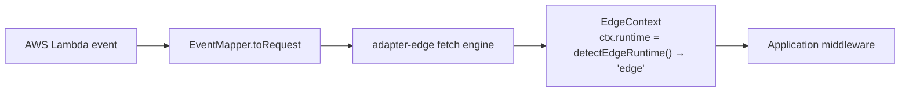
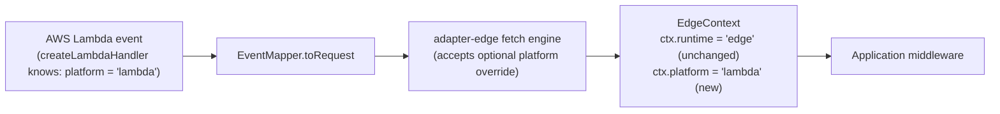

# RFC-026: `ctx.runtime` honesty on `@nextrush/adapter-serverless`

| Field                | Value                                                                 |
| -------------------- | --------------------------------------------------------------------- |
| **Status**           | `Shipped`                                                                |
| **RFC number**       | `026`                                                                  |
| **Date**             | `2026-07-25`                                                          |
| **Author(s)**        | Tanzim Hossain                                                        |
| **Group**            | `runtime-adapters`                                                    |
| **Packages touched** | `@nextrush/adapter-serverless`, `@nextrush/adapter-edge`, `@nextrush/runtime`, `@nextrush/types` |
| **Framework impact** | Additive, non-breaking — new field, existing `ctx.runtime` value unchanged |
| **Supersedes**       | `—`                                                                    |
| **Superseded by**    | `—`                                                                    |
| **Related**          | `RFC-013` (adapter contract), `RFC-014` (`@nextrush/adapter-serverless`), `ADR-0010` (cross-runtime parity hardening), `report/dx-review-serverless-edge-adapters.md` (finding P1-1) |

---

## Progress Tracker

**Overall:** `[████████████████████]` 100% — 4 / 4 phases complete · Doc status: `Shipped`

| Phase | Part / deliverable                                              | Status        |
| ----- | ---------------------------------------------------------------- | -------------- |
| P0    | `PlatformInfo` type + `detectPlatform()` in `@nextrush/runtime`   | ✅ Done — `detection.ts`, `detect-platform.test.ts` (5 tests) |
| P1    | Thread `ctx.platform` through `EdgeContext`                       | ✅ Done — `EdgeContext`'s 6th constructor param, `context-platform.test.ts` |
| P2    | Wire each serverless Tier-1 handler to pass its known platform    | ✅ Done — `createLambdaHandler`/`createGoogleHandler`/`createAzureHandler` each pass their literal platform; `ctx-platform.test.ts` (3 tests) confirms end-to-end |
| P3    | Docs + conformance assertions + TSDoc honesty note on `ctx.runtime`| ✅ Done — edge/serverless READMEs' "Platform reporting" sections, `ctx.runtime` unchanged as designed |

---

## 0. Revision History

- **v2 (`2026-07-26`)** — Status corrected from `Draft` to `Shipped`; the Progress Tracker was
  stale at 0% despite all 4 phases having actually been implemented and tested in an earlier
  session. Independently re-verified against real source before flipping status: `detectPlatform()`
  + `PlatformInfo` in `packages/runtime/src/detection.ts` (5 tests green), `EdgeContext`'s
  `platform` param, all three Tier-1 handlers passing their literal platform, and the README
  "Platform reporting" sections — all confirmed present and passing, not just trusted from a prior
  claim.
- **v1 (`2026-07-25`)** — Initial draft, written in response to `report/dx-review-serverless-edge-adapters.md` finding P1-1.

---

## 1. Summary (TL;DR)

`ctx.runtime` reports `'edge'` on every invocation of `@nextrush/adapter-serverless` — AWS
Lambda, Google Cloud Functions, and Azure Functions all report the name of a *different*
adapter's internal implementation dependency, not their own platform. This RFC does not change
`ctx.runtime`'s existing value (avoiding a breaking type change) — it adds a new, honest,
additive field, `ctx.platform`, populated by a small `detectPlatform()` utility and threaded
through each serverless handler so `ctx.platform` reports `'lambda'`/`'gcf'`/`'azure'`
correctly, while `ctx.runtime` keeps meaning exactly what it always has (which Fetch-API engine
executed the request) and is documented as not platform-identifying.

---

## 1a. Terminology

`Runtime` (in this RFC's sense, matching `@nextrush/runtime`'s existing usage)
: _Which JavaScript engine/Fetch-API implementation executed the request — `node`, `bun`,
  `deno`, or `edge` (the Fetch-API engine `@nextrush/adapter-edge` provides, shared by Cloudflare
  Workers, Vercel Edge, Netlify Edge, and — via this RFC's fix — also correctly labeled as the
  engine underneath serverless, distinct from the platform)._

`Platform` (new term this RFC introduces)
: _Which vendor/product you deployed to — `'lambda'`, `'gcf'`, `'azure'`, `'cloudflare-workers'`,
  `'vercel-edge'`, `'netlify-edge'`, or `undefined` when running directly via `createFetchHandler`
  with no platform-specific wrapper. Orthogonal to `Runtime`: two different platforms
  (Lambda, GCF) can share one runtime (`edge`, since both go through `adapter-edge`'s engine)._

---

## 2. Decision Summary

- **Status:** `Draft`
- **Decision:**
  - _Introduce `ctx.platform: PlatformId | undefined`_ — a new, additive field naming the actual
    deployment platform, populated by each handler factory that already knows which platform it is.
  - _Introduce `detectPlatform()` in `@nextrush/runtime`_ — a small, pure detection utility parallel
    to the existing `detectEdgeRuntime()`, but answering a different, previously-unanswered question.
  - _Keep `ctx.runtime` unchanged_ — still reports `'edge'` for every serverless platform; add a
    TSDoc note stating explicitly that it is not platform-identifying and directing readers to
    `ctx.platform`.
- **Breaking:** `No` — `ctx.platform` is a new optional field; no existing field changes value or type.
- **Migration required:** `None` — existing code reading `ctx.runtime` sees identical behavior.
- **Blast radius:** `low` — additive field, three call sites updated to pass a known constant string.

---

## 2a. Decision Drivers

Priority (highest → lowest):

1. _Non-breaking_ — `ctx.runtime`'s type and value must not change; a type widening or behavior
   change here would be a breaking change requiring a major bump for no proportionate benefit.
2. _Honesty_ — the fix must actually let a developer answer "which platform am I on" correctly,
   not just relabel the same wrong answer.
3. _Architectural consistency_ — must not require `@nextrush/adapter-edge`'s `detectEdgeRuntime()`
   to grow platform-specific branches, preserving its own documented invariant (ARCHITECTURE.md:
   "exactly three named-platform branches… no fourth branch for any FaaS platform").
4. _Minimal surface growth_ — one new field, one new utility function; no new package.

---

## 3. Problem & Motivation

### 3.1 Current state (what exists today)

```ts
// Deploy to AWS Lambda:
import { createLambdaHandler } from '@nextrush/adapter-serverless';

const app = createApp();
app.use((ctx) => {
  console.log(ctx.runtime); // → 'edge'  (not 'lambda', not 'node', not anything AWS-related)
});
export const handler = createLambdaHandler(app);
```

This is documented behavior — both `@nextrush/adapter-serverless/README.md` and
`@nextrush/adapter-edge/README.md` call it out explicitly, with the edge README's FAQ stating
"`detectEdgeRuntime()` has no Lambda branch… Lambda deployments also report `runtime: 'edge'`."
`@nextrush/adapter-serverless`'s own README includes a dedicated troubleshooting entry: "A route
handler branches on `ctx.runtime === 'node'` and the branch never runs."

### 3.2 The problems (enumerated)

1. **Wrong abstraction, not just a wrong value** — `ctx.runtime`'s entire purpose is to answer
   "where am I running," and on three of six supported deployment targets (Lambda, GCF, Azure) it
   answers with the name of a *different* adapter's internal implementation dependency
   (`adapter-serverless` is built on `adapter-edge`'s fetch engine — an implementation choice, not
   something a Lambda function's request handler should need to know).
2. **Silent, type-checking wrong branches** — `if (ctx.runtime === 'node')` compiles cleanly
   (assuming `Runtime` includes `'node'` as a member, which it does for the Node/Bun/Deno adapters)
   and deploys cleanly, but the branch never executes on any serverless platform. There is no
   error, no warning, no lint signal — just silently-wrong behavior in production. This is the
   worst class of framework-surfaced bug: one that looks correct at every layer except runtime
   truth.
3. **No honest way to ask the question at all today** — a developer who *knows* about this
   quirk still has no supported API to get the real answer. The README's own suggested
   workaround is "check `ctx.env`/platform-specific fields directly" — inspecting undocumented,
   platform-specific request shape details instead of a first-class field.

### 3.3 Why now

This surfaced during an independent DX audit (`report/dx-review-serverless-edge-adapters.md`,
finding P1-1) that specifically measured framework-experience quality, not architecture or
performance. The audit rated this the framework's single most-documented gotcha across the two
packages audited, and noted every comparable framework in its comparison set (Hono's
`getRuntimeKey()`, Next.js's per-route `nodejs`/`edge` runtime, Nitro's preset identity) answers
this question correctly for its own deployment targets. Fixing it now, before serverless leaves
its current Internal/Beta tier (ADR-0005), is materially cheaper than fixing it after the package
is GA and `ctx.runtime`'s exact current (wrong) behavior becomes something third-party code
depends on.

---

## 4. Goals & Non-Goals

### 4.1 Goals

- A developer deploying to AWS Lambda, GCF, or Azure Functions can read a first-class context
  field and get the correct platform name back (maps to problem 3.2.3).
- `if (ctx.runtime === 'node')`-style branches keep their exact current (already-documented)
  behavior — this RFC does not attempt to "fix" that by changing what `ctx.runtime` reports
  (maps to problem 3.2.2 by not making it worse, while solving 3.2.3 through a new field instead).
- `detectEdgeRuntime()` in `@nextrush/adapter-edge`/`@nextrush/runtime` gains zero new
  platform-specific branches (maps to decision driver 3).

### 4.2 Non-Goals

- **Widening `Runtime` to include `'lambda'`/`'gcf'`/`'azure'` as runtime values** — rejected;
  see §9.1. This RFC deliberately keeps "runtime" (which engine) and "platform" (which vendor)
  as two separate, orthogonal fields rather than conflating them into one wider union.
- **Changing `ctx.runtime`'s value for existing edge platforms** (Cloudflare/Vercel/Netlify) —
  out of scope; those three already report correctly today and are unaffected by this RFC.
- **Retrofitting platform detection onto Bun/Deno/Node adapters** — those adapters already run
  directly on their named runtime with no platform-translation layer in between; there is no
  equivalent "wrong label" problem to fix there. A future RFC could add `ctx.platform` support
  for e.g. distinguishing "Bun on Railway" vs. "Bun on Fly.io" if a real need arises, but that is
  not this RFC's problem (§17).

---

## 5. Impact

- **Affected packages:** `@nextrush/adapter-serverless` (wires the new field in its three Tier-1
  handlers), `@nextrush/adapter-edge` (accepts and threads an optional platform override through
  `createFetchHandler`/`createEdgeContext`), `@nextrush/runtime` (new `detectPlatform()` /
  `PlatformId` type, parallel to the existing `detectEdgeRuntime()`), `@nextrush/types` (the new
  `PlatformId` type, if it needs to be shared at the lowest layer — see §8.1).
- **Affected audiences:** Application developers deploying to AWS Lambda, GCF, or Azure Functions
  who need to branch on deployment target; adapter authors extending `createServerlessAdapter`
  with a custom `EventMapper` for an unsupported platform.
- **Explicitly NOT affected:** Existing applications reading `ctx.runtime` (value and type
  unchanged); Cloudflare Workers, Vercel Edge, and Netlify Edge deployments (already correctly
  identified, no change); the functional (`nextrush`) meta-package's exports (no new export there);
  `@nextrush/adapter-bun`, `@nextrush/adapter-deno`, `@nextrush/adapter-node` (no changes).

---

## 6. Proposed Solution (overview)

| # | Problem (from §3.2)                              | Solution (this RFC)                                                             |
| - | -------------------------------------------------- | -------------------------------------------------------------------------------- |
| 1 | Wrong abstraction (platform vs. implementation dep) | New `ctx.platform` field, orthogonal to `ctx.runtime`, naming the real platform |
| 2 | Silent wrong branches on `ctx.runtime === 'node'`   | Left as-is (documented, unchanged) — solved by giving a *correct* field to use instead, not by touching the wrong-but-stable one |
| 3 | No supported way to ask "which platform"            | `ctx.platform: PlatformId | undefined`, populated by each Tier-1 handler        |

The key idea: **runtime and platform are answering two different questions, and NextRush
currently only has a field for one of them** (and that field gets asked the other question
anyway, because there's nowhere else to ask it). Rather than widen `Runtime` — which would make
"runtime" mean two different kinds of thing depending on which adapter you're on, and would be a
breaking type change for anyone doing exhaustive `switch` over `Runtime` today — this RFC adds
the missing field. `ctx.platform` is populated at the one place each serverless handler already
knows unambiguously which platform it is (`createLambdaHandler` knows it's Lambda;
`createGoogleHandler` knows it's GCF; `createAzureHandler` knows it's Azure) — no detection
heuristic is even needed for the serverless side, only a threading exercise. For the edge
platforms (Cloudflare/Vercel/Netlify), `detectPlatform()` reuses `detectEdgeRuntime()`'s existing
three-branch detection and just relabels the *platform* dimension of what it already correctly
detects, so no new detection logic is needed there either — it's a mapping, not new heuristics.

---

## 6a. Trade-offs

### Benefits

- Solves the audit's top-rated finding with a fully additive, non-breaking change — no version
  bump beyond a minor, no deprecation window, no migration guide needed.
- `ctx.runtime`'s meaning stays exactly what `ADR-0010`/`RFC-013` already established (which
  Fetch-API engine executed the request) — this RFC doesn't quietly redefine an existing
  contract, it completes a missing one.
- `detectPlatform()`'s implementation for the edge platforms is nearly free — it is a thin
  relabeling of `detectEdgeRuntime()`'s already-correct three-branch detection, not new logic to
  test and maintain.

### Costs

- **Two fields to explain instead of one** — `ctx.runtime` vs. `ctx.platform` is a real new
  concept surface; documentation must be clear about which question each answers, or this
  becomes a second confusing pair instead of a fix (mitigated in §8.7's examples and the
  Terminology section above).
- **`ctx.platform` is `undefined` for the common non-serverless, non-named-edge-platform case**
  (a bare `createFetchHandler` call with no platform wrapper, e.g. testing or a generic Fetch-API
  host) — callers must handle the `undefined` case, adding one more state to consider versus a
  single always-populated `ctx.runtime`.
- **Every serverless Tier-1 handler needs a small, mechanical update** to pass its known platform
  constant through to the engine — three call sites, low risk, but still a change surface that
  didn't exist before.

---

## 7. Architecture

### 7.1 Before



### 7.2 After



### 7.3 Why this architecture

The override flows through the same seam `app.isProduction` already flows through for the
diagnostics work in this session (`createRequestRunner`/`createEdgeContext` — see
`report/dx-review-serverless-edge-adapters.md`'s P1-3/P2-4 fixes for the precedent): each
serverless Tier-1 handler already calls `createEdgeFetchHandler(app, options)` from
`@nextrush/adapter-edge` and already knows which platform it is at that call site. Passing one
more piece of already-known information through an existing options object is a small, additive
change to a seam that already exists — it does not require `adapter-edge`'s own runtime detection
to grow FaaS-specific branches (preserving the ARCHITECTURE.md invariant this RFC's §7a lists
below), because `adapter-edge` never has to *detect* the platform; it only ever *receives* it,
already known, from the caller.

---

## 7a. Architecture Invariants

- **Preserved:** `detectEdgeRuntime()` keeps exactly three named-platform branches (Cloudflare,
  Vercel, Netlify) plus the generic `'edge'` fallback, with no fourth branch added for any FaaS
  platform — per `adapter-edge/ARCHITECTURE.md`'s explicit invariant. This RFC's `detectPlatform()`
  is a new, separate function, not a modification of `detectEdgeRuntime()`.
- **Preserved:** `ctx.runtime` is `'edge'` on `@nextrush/adapter-serverless`, on every provider,
  by inheritance from `@nextrush/adapter-edge` — per that package's own listed invariant ("this
  package must not special-case it to report `'node'` or a provider name"). This RFC does not
  touch that invariant at all; it adds a field beside it.
- **Preserved:** `createServerlessAdapter` never branches on a provider name in its own logic —
  the new `platform` value is supplied by the caller (each Tier-1 handler), not detected via a
  new provider-name branch inside the adapter itself.
- **New invariant this RFC establishes:** `ctx.platform` is populated only by explicit, known
  information at the call site that constructs the context (a Tier-1 handler's own identity, or
  `detectEdgeRuntime()`'s existing three-branch result relabeled) — never by new heuristic
  detection against the request/event shape. If a future platform can't state its identity this
  way, `ctx.platform` stays `undefined` for it rather than guessing.

---

## 8. Detailed Design

### 8.1 Public API / surface

```ts
// @nextrush/types (or @nextrush/runtime, if PlatformId has no reason to be
// as low as @nextrush/types — see Open Questions §18)
export type PlatformId =
  | 'lambda'
  | 'gcf'
  | 'azure'
  | 'cloudflare-workers'
  | 'vercel-edge'
  | 'netlify-edge';

// @nextrush/runtime
export interface PlatformInfo {
  platform: PlatformId | undefined;
}

/**
 * Detect the deployment platform from the edge-runtime signals already
 * available to detectEdgeRuntime() — Cloudflare/Vercel/Netlify only. Returns
 * `undefined` for anything this function cannot itself determine (including
 * every serverless platform, which must pass their platform explicitly
 * instead — see EdgeContext's `platform` constructor parameter).
 */
export function detectPlatform(): PlatformInfo;

// @nextrush/adapter-edge — EdgeContext gains a 6th constructor parameter
export class EdgeContext<Env = unknown> extends WebContextBase {
  readonly platform: PlatformId | undefined;
  constructor(
    request: Request,
    executionContext?: EdgeExecutionContext,
    trustProxy?: boolean,
    env?: Env,
    isProduction?: boolean,
    platform?: PlatformId // new, optional, defaults to detectPlatform().platform
  );
}

// FetchHandlerOptions gains an optional override (rarely used directly by
// application code — Tier-1 serverless handlers set this internally)
export interface FetchHandlerOptions {
  onError?: (error: Error, ctx: EdgeContext) => Response | Promise<Response>;
  timeout?: number;
  /** @internal Set by Tier-1 serverless handlers; not typically passed by application code. */
  platform?: PlatformId;
}
```

### 8.2 Internal components

- **`detectPlatform()`** (`@nextrush/runtime`) — pure, no I/O, mirrors `detectEdgeRuntime()`'s
  three-branch check but reports the *platform* dimension (`'cloudflare-workers'` /
  `'vercel-edge'` / `'netlify-edge'` / `undefined`) rather than the *runtime* dimension.
- **`EdgeContext.platform`** — a new readonly field, resolved once at construction: the explicit
  `platform` constructor argument if supplied, else `detectPlatform().platform`.
- **`createRequestRunner`** (`adapter-edge/src/adapter.ts`) — reads `options.platform` (if set)
  and threads it into `createEdgeContext(...)`'s new final argument, exactly as it already does
  for `isProduction`.
- **Each serverless Tier-1 handler** (`createLambdaHandler`, `createGoogleHandler`,
  `createAzureHandler`) — passes its own known platform constant (`'lambda'`, `'gcf'`, `'azure'`)
  into the `{ timeout, platform }` options object it already builds for
  `createEdgeFetchHandler(app, options)`.

### 8.3 Request / execution flow

```text
Lambda invocation
  → createLambdaHandler's internal adapter (knows platform = 'lambda')
  → createServerlessAdapter → createEdgeFetchHandler(app, { timeout, platform: 'lambda' })
  → createRequestRunner reads options.platform
  → createEdgeContext(request, executionContext, trustProxy, env, app.isProduction, 'lambda')
  → EdgeContext.platform = 'lambda'  (ctx.runtime stays 'edge', unchanged)
```

### 8.4 Data structures

`PlatformId` is a closed string-literal union, not an open `string` — matching `Runtime`'s own
existing shape (a closed union, not open string) for consistency and so exhaustive `switch`
statements over it stay checkable by `tsc`. Deliberately does not include a generic `'unknown'`
member; `undefined` already covers "not determinable," and adding a second not-determinable
state (`'unknown'` vs. `undefined`) would be redundant surface with no distinct meaning.

### 8.5 Error handling

_Not applicable — this is a pure data-threading change with no new failure mode. `platform`
being `undefined` is a valid, expected state, not an error condition._

### 8.6 Edge cases

| Scenario                                                          | Behaviour                                                          |
| ------------------------------------------------------------------ | -------------------------------------------------------------------- |
| Bare `createFetchHandler(app)` with no platform wrapper, on a host not recognized by `detectPlatform()` | `ctx.platform` is `undefined`; `ctx.runtime` stays `'edge'` (unchanged today) |
| A custom `EventMapper` via `createServerlessAdapter` (Tier 3, e.g. Oracle Functions) | `ctx.platform` is `undefined` unless the runtime author explicitly passes `{ platform: '<their-own-string>' }` — but `PlatformId` is closed, so a genuinely new platform needs its own RFC to add a member, exactly as adding a new named `Runtime` would; documented in §17 as expected/acceptable for now |
| `createCloudflareHandler`/`createVercelHandler`/`createNetlifyHandler` (existing edge platforms) | `ctx.platform` becomes correctly populated via `detectPlatform()` for the first time (currently these platforms have no `platform`-equivalent field at all — this is a strict addition, not a change to existing behavior since the field didn't exist before) |

### 8.7 Examples

```ts
// AFTER this RFC — the actual fix in application code:
import { createLambdaHandler } from '@nextrush/adapter-serverless';

const app = createApp();
app.use((ctx) => {
  console.log(ctx.runtime);  // 'edge'   — unchanged; "which engine executed this"
  console.log(ctx.platform); // 'lambda' — new; "which vendor/product deployed this"

  if (ctx.platform === 'lambda') {
    // correctly scoped to Lambda specifically, not accidentally matching GCF/Azure too
  }
});
export const handler = createLambdaHandler(app);
```

---

## 9. Alternatives Considered

### 9.1 Widen `Runtime` to include `'lambda'`/`'gcf'`/`'azure'` as runtime values

Rejected. This conflates two orthogonal questions into one field: "which engine" and "which
vendor" are not the same axis (Lambda, GCF, and Azure Functions could all theoretically run on
the *same* underlying engine if NextRush ever built a true Node-native serverless path — the
audit itself notes `adapter-serverless` is built on `adapter-edge`'s *fetch* engine as an
implementation choice, not an inherent requirement). Widening `Runtime` also breaks any
downstream code doing an exhaustive `switch (ctx.runtime)` over the current five-member union —
a real breaking change requiring a major version bump, for a fix that doesn't need to be
breaking at all.

### 9.2 Add `ctx.env`/platform-specific field inspection as the supported answer (i.e., formalize the README's current workaround)

Rejected. This is what the current troubleshooting entry already suggests informally, and the
audit specifically flagged it as an unsupported, undocumented-shape workaround, not a fix.
Formalizing "inspect a platform-specific field" as the *sanctioned* answer would still leave every
developer writing their own platform-detection logic against implementation details, exactly the
problem this RFC exists to solve once, centrally, instead of per-application.

### 9.3 Do nothing

The status quo: `ctx.runtime` keeps silently reporting `'edge'` on all three serverless
platforms, with the only mitigation being a documentation callout developers must already know
to go looking for. The cost is an ongoing, silent-wrong-branch failure class with no supported
fix — exactly the P1 finding the DX audit rated as one of the two highest-impact issues across
both packages.

---

## 10. Rejected Ideas

- **Naming the new field `ctx.provider` instead of `ctx.platform`** — rejected; "provider" reads
  ambiguously close to "DI provider" (a heavily-used term elsewhere in this framework's class
  runtime, `@Module`'s `providers` field) and risks a confusing collision in shared documentation
  search/indexing. "Platform" has no such collision and matches the terminology the DX audit
  report and this framework's own `production/deployment/` docs section already use for "which
  vendor you ship to."
- **Making `detectPlatform()` also cover Lambda/GCF/Azure via event-shape heuristics** —
  rejected; heuristic detection against request/event shape is exactly the kind of fragile,
  undocumented-shape inspection this RFC is trying to eliminate (see §9.2). Serverless platforms
  already know their own identity unambiguously at the Tier-1 handler call site — passing that
  known fact through is strictly more reliable than re-deriving it from request shape.

---

## 11. Risks & Mitigations

| Risk                                                                                   | Mitigation                                                                                        | Likelihood | Impact |
| ---------------------------------------------------------------------------------------- | ---------------------------------------------------------------------------------------------------- | ---------- | ------ |
| Developers confuse `ctx.runtime` and `ctx.platform`, misreading one for the other        | Clear, paired documentation (§8.7's example prints both side by side); TSDoc on each field cross-references the other | Medium     | Low    |
| A future platform can't cleanly state a `PlatformId` and gets stuck at `undefined`       | `PlatformId` is a closed union deliberately extended by future RFCs, same pattern as `Runtime` itself — documented in §17 as expected, not a defect | Low        | Low    |
| Three serverless handler files need a coordinated update, risking one being missed       | Single new required field on the shared `FetchHandlerOptions` shape used by all three — a missing update is a visible, testable gap (conformance assertion per platform, §14/§15.1), not a silent omission | Low        | Low    |

---

## 12. Backward Compatibility & Migration

- **Compatibility:** Additive & non-breaking. `ctx.runtime`'s type and every existing value are
  unchanged. `ctx.platform` is a new field; code that does not reference it is entirely unaffected.
- **Migration path (if breaking):** N/A — not a breaking change.
- **Deprecation window:** N/A — nothing is deprecated by this RFC.

---

## 13. Cross-Cutting Concerns

- **Security:** Not applicable to the core mechanism — `ctx.platform` carries no request-derived
  data; it is a small, closed-union constant known at handler-construction time, not parsed from
  untrusted input.
- **Performance:** Negligible — one additional readonly field assignment per `EdgeContext`
  construction, and `detectPlatform()` reuses `detectEdgeRuntime()`'s existing, already-cached
  three-branch check rather than adding new per-request work.
- **Runtime independence:** `detectPlatform()` lives in `@nextrush/runtime`, uses only the same
  feature probes `detectEdgeRuntime()` already uses (no new `process`/`Deno`/`Bun` API surface) —
  preserves AGENTS.md §7.
- **Observability:** No new logging by this RFC alone; `ctx.platform` becomes available for
  application-level structured logging (e.g. via `@nextrush/logger`) to include per-request, which
  is itself a DX improvement outside this RFC's direct scope.
- **Zero-dependency rule:** No new runtime dependency — implemented entirely with existing
  workspace packages.

---

## 14. Success Metrics

| Metric                              | Baseline (today)                                    | Target / threshold                                                        |
| -------------------------------------- | ------------------------------------------------------ | ----------------------------------------------------------------------------- |
| `ctx.platform` correctness            | Field does not exist                                    | Correct value (`'lambda'`/`'gcf'`/`'azure'`/`'cloudflare-workers'`/`'vercel-edge'`/`'netlify-edge'`) asserted per platform in conformance/deploy-verification |
| `ctx.runtime` regression              | `'edge'` on all serverless + named edge platforms       | Unchanged — same conformance assertions that pin today's value continue passing |
| Test coverage (touched files)         | —                                                        | 90%+ lines/functions (project-rules §7)                                     |
| Latency / hot-path allocation         | One field read per request today (`ctx.runtime`)         | No measurable regression — one additional readonly field assignment, no new async work |

---

## 15. Phased Implementation Plan

| Phase | Goal (what ships)                                                        | Depends on | Exit condition (checkable)                                                                  | Status         |
| ----- | --------------------------------------------------------------------------- | ---------- | ----------------------------------------------------------------------------------------------- | -------------- |
| **P0** | `PlatformId` type + `detectPlatform()` in `@nextrush/runtime`               | —          | Unit tests green for all 4 branches (Cloudflare/Vercel/Netlify/generic-undefined)                | ✅ Done — `detect-platform.test.ts` (5 tests) |
| **P1** | `EdgeContext.platform` field + threading through `createEdgeContext`/`createRequestRunner`/`FetchHandlerOptions.platform` | P0         | Unit test: explicit `platform` option produces `ctx.platform` equal to it; omitted option falls back to `detectPlatform()` | ✅ Done — `context-platform.test.ts` |
| **P2** | Each serverless Tier-1 handler passes its own known platform constant       | P1         | Conformance/integration test per platform: `ctx.platform === 'lambda' \| 'gcf' \| 'azure'` respectively, `ctx.runtime === 'edge'` unchanged | ✅ Done — `ctx-platform.test.ts` (3 tests) |
| **P3** | Docs (READMEs, `reference/platforms/*.mdx`) + TSDoc honesty note on `ctx.runtime` + this RFC's own status flip | P2         | `pnpm docs:verify` green; `ctx.runtime`'s TSDoc cross-references `ctx.platform`                  | ✅ Done — README "Platform reporting" sections shipped, this RFC's status flipped to `Shipped` |

### 15.1 Testing strategy

- **Unit:** `detectPlatform()`'s four branches (pure, no I/O); `EdgeContext`'s new field with
  explicit override vs. fallback detection.
- **Integration:** each serverless Tier-1 handler's `ctx.platform` value, exercised through the
  same fixture-based tests (`fixtures.test.ts`) already covering `apigw-v1`/`apigw-v2`/`gcf`/`azure`.
- **Cross-adapter:** `packages/adapters/conformance`'s deploy-verification apps (`nextjs-app-*`
  precedent aside — the Lambda/GCF/Azure `deploy-verification` apps referenced in the DX audit)
  gain a `ctx.platform` assertion alongside their existing `ctx.runtime` one.
- **Coverage:** 90%+ lines/functions on every touched file (project-rules §7).

---

## 16. Rollback Plan

- **Trigger:** A P2 conformance failure showing `ctx.platform` diverging from the expected
  platform on a real deploy-verification run, or a reported regression in `ctx.runtime`'s value.
- **Steps:**
  - Revert `@nextrush/adapter-edge` and `@nextrush/adapter-serverless` to their pre-RFC versions.
  - `ctx.platform` and `detectPlatform()` are purely additive — reverting them has no cleanup
    burden (no migration, no data shape change, no published contract yet to maintain compatibility
    with, since both packages are still Internal/Beta tier per ADR-0005).

---

## 17. Future Work

- **`ctx.platform` support for Bun/Deno/Node adapters distinguishing hosting providers** (e.g.
  "Bun on Railway" vs. "Bun on Fly.io") — explicitly out of this RFC's scope (§4.2); would need
  its own motivating use case before a follow-up RFC.
- **A documented, closed extension path for `PlatformId`** when a genuinely new Tier-3
  `EventMapper` platform (Oracle Functions, Fly.io, OpenFaaS) wants a real platform identity
  instead of `undefined` — likely a small follow-up RFC once a real Tier-3 mapper author needs it,
  not speculative work now.

---

## 18. Open Questions

- [x] Should `PlatformId` live in `@nextrush/types` (lowest layer, consistent with `Runtime`
      itself living there) or `@nextrush/runtime` (where `detectPlatform()`/`detectEdgeRuntime()`
      already live)? **Resolved: `@nextrush/types`**, then re-exported from `@nextrush/runtime`.
      Confirmed in source — `PlatformId` is declared in `packages/types/src/runtime.ts` alongside
      `Runtime`, and re-exported from both `@nextrush/types`'s and `@nextrush/runtime`'s barrels.

---

## 19. Decisions Log

| Question                                                                | Decision                                                             | Rationale                                                                                          |
| --------------------------------------------------------------------------- | ------------------------------------------------------------------------ | -------------------------------------------------------------------------------------------------------- |
| Widen `Runtime` to include platform names, or add a new orthogonal field?    | **New orthogonal field, `ctx.platform`**                                | Conflating "which engine" and "which vendor" into one union is a category error and would force a breaking type change for zero necessity — see §9.1. |
| Detect serverless platforms via event-shape heuristics, or pass explicitly?  | **Pass explicitly, from each Tier-1 handler's own known identity**       | Each handler already knows unambiguously which platform it is; heuristic detection is strictly less reliable and is exactly the undocumented-shape workaround pattern this RFC exists to replace — see §9.2/§10. |
| Field name: `ctx.platform` or `ctx.provider`?                               | **`ctx.platform`**                                                       | "Provider" collides with this framework's heavily-used DI/`@Module` `providers` terminology — see §10. |

---

## 20. References

- `report/dx-review-serverless-edge-adapters.md` — finding P1-1 (the motivating audit).
- `docs/RFC/runtime-adapters/013-adapter-contract.md` — the adapter contract this RFC extends additively.
- `docs/RFC/runtime-adapters/014-adapter-serverless.md` — the original serverless adapter RFC.
- `docs/adr/ADR-0010-cross-runtime-parity-hardening.md` — establishes `ctx.runtime`'s current meaning.
- `packages/adapters/edge/src/context.ts`, `packages/adapters/edge/src/adapter.ts` — the seam this RFC extends (same seam used for the `isProduction`/dev-mode-warning work landed in this session).
- `packages/runtime/src/detection.ts` — `detectEdgeRuntime()`, the sibling function `detectPlatform()` is modeled on.
