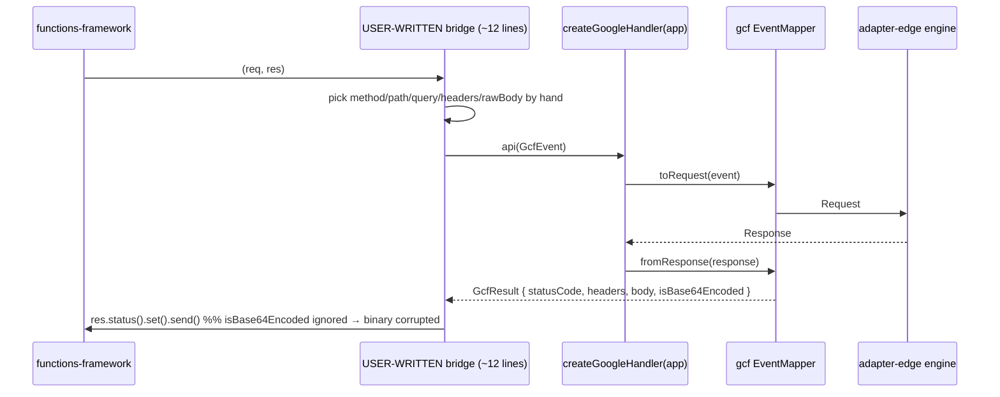
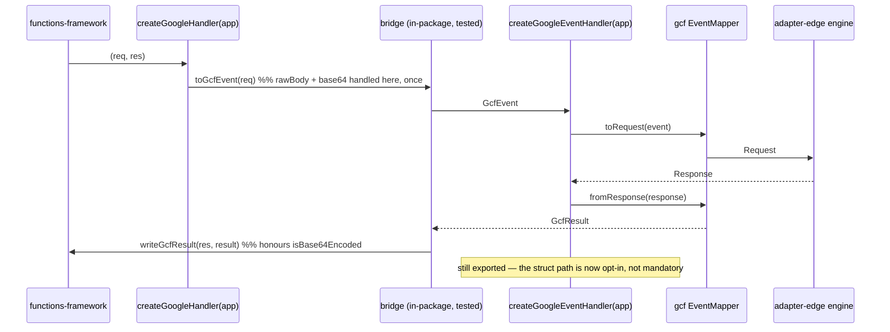

# RFC-027: `@nextrush/adapter-serverless` — true drop-in GCF & Azure handlers

| Field                | Value                                                                 |
| -------------------- | --------------------------------------------------------------------- |
| **Status**           | `Shipped`                                                                |
| **RFC number**       | `027`                                                                  |
| **Date**             | `2026-07-25`                                                          |
| **Author(s)**        | Tanzim Hossain                                                        |
| **Group**            | `runtime-adapters`                                                    |
| **Packages touched** | `@nextrush/adapter-serverless`                                        |
| **Framework impact** | Breaking (return-type contract of two Internal-tier exports) — permitted without a major under ADR-0005's Internal tier; one-line mechanical migration, see §12 |
| **Supersedes**       | `—`                                                                    |
| **Superseded by**    | `—`                                                                    |
| **Related**          | `RFC-013` (adapter contract), `RFC-014` (`@nextrush/adapter-serverless`), `RFC-026` (sibling `ctx.platform` RFC from the same audit), `ADR-0005` (package tiers / sealed surface / deprecation), `report/dx-review-serverless-edge-adapters.md` (finding P1-2) |

---

## Progress Tracker

**Overall:** `[████████████████████]` 100% — 4 / 4 phases complete · Doc status: `Shipped`

| Phase | Part / deliverable                                                        | Status        |
| ----- | -------------------------------------------------------------------------- | -------------- |
| P0    | Structural platform-request/response duck types (`src/platform-shapes.ts`)  | ✅ Done — `platform-shapes.ts`, `platform-shapes.test.ts` (4 tests) |
| P1    | Pure bridge functions (real `req`/`res` ⇄ `GcfEvent`/`AzureEvent`)          | ✅ Done — `toGcfEvent`/`writeGcfResult` in `google.ts`, `toAzureEvent`/`toAzureResponse` in `azure.ts` (15 tests) |
| P2    | Public surface: `createGoogleHandler`/`createAzureHandler` become drop-ins; struct path moves to `create*EventHandler` | ✅ Done — breaking change shipped, migration documented, `createGoogleEventHandler`/`createAzureEventHandler` preserve the old struct-based behavior |
| P3    | Docs (README/ARCHITECTURE) + `gcf-app`/new `azure-app` deploy verification  | ✅ Done — `gcf-app` rewritten onto the drop-in; `azure-app` scaffolded and locally verified (not yet wired into the scheduled CI workflow — a deliberate, flagged infrastructure decision, see `deploy-verification/README.md`) |

---

## 0. Revision History

- **v2 (`2026-07-26`)** — Status corrected from `Draft` to `Shipped`; the Progress Tracker was
  stale at 0% despite all 4 phases having actually been implemented, tested, and documented
  across earlier sessions, including P3's `gcf-app`/`azure-app` deploy-verification work.
  Independently re-verified against real source before flipping status: `platform-shapes.ts`,
  the bridge functions and their test files, the sealed public-surface test's inclusion of the
  new exports, and both deploy-verification app directories — all confirmed present, and the
  full serverless suite (62 tests) re-run and confirmed green, not just trusted from a prior
  claim.
- **v1 (`2026-07-25`)** — Initial draft, written in response to `report/dx-review-serverless-edge-adapters.md` finding P1-2 (the audit's largest single DX win, explicitly flagged there as needing an RFC because it is new public API).

---

## 1. Summary (TL;DR)

`createGoogleHandler(app)` and `createAzureHandler(app)` are named like `createLambdaHandler(app)`
but are not peers of it: they return a function over a NextRush-private normalized struct
(`GcfEvent` / `AzureEvent`), so every GCF and Azure user hand-writes ~12–14 lines of field-mapping
glue at their function's real entry point — glue that is also a correctness surface (miss
`rawBody` and bodies silently vanish; miss `isBase64Encoded` and binary responses corrupt). This
RFC makes those two exports true drop-ins that accept the platform's **real** request/response
objects, typed structurally so the zero-dependency rule holds, and moves today's struct-based
behavior to two new explicit names (`createGoogleEventHandler` / `createAzureEventHandler`) which
remain fully supported for fixture testing and advanced bridging. The cost is honest: this changes
what two already-published exports return, which is a breaking contract change — accepted here
because both are `Internal` tier at `1.0.0-beta.0` per ADR-0005, and the migration is a
one-line rename.

---

## 1a. Terminology

`Drop-in handler`
: _A factory whose return value can be handed directly to the platform's own registration API
  (`export const handler = …`, `functions.http('api', …)`, `app.http('api', { handler })`) with no
  user-written adapter code in between. `createLambdaHandler` is the only one today._

`Event struct` (`GcfEvent`, `AzureEvent`)
: _NextRush's private, normalized "request essentials" record that an `EventMapper.toRequest`
  consumes. Deliberately minimal and platform-SDK-free so mappers stay pure and fixture-testable
  (`ARCHITECTURE.md`: "The user adapts the real `req`/`res` to this shape at the boundary; the
  mapper itself is a pure, fixture-testable transform")._

`Bridge`
: _The translation between a platform's real SDK request/response objects and an event struct.
  Today the bridge is written by the user, per project. This RFC moves it into the package._

`Structural (duck) typing` (as used here)
: _Declaring a minimal `interface` locally that the real SDK type is structurally assignable to,
  so the package types against the platform without importing or depending on
  `@google-cloud/functions-framework` / `@azure/functions`._

---

## 2. Decision Summary

- **Status:** `Draft`
- **Decision:**
  - _Change `createGoogleHandler(app)`_ to return a true GCF drop-in
    `(req, res) => Promise<void>` (functions-framework's real HTTP handler signature).
  - _Change `createAzureHandler(app)`_ to return a true Azure Functions v4 drop-in
    `(req, ctx?) => Promise<HttpResponseInit-shaped>`.
  - _Introduce `createGoogleEventHandler` / `createAzureEventHandler`_ carrying **today's exact
    behavior** over `GcfEvent` / `AzureEvent`, unchanged, as the supported struct-based path
    (fixture testing, custom bridges, non-standard hosts).
  - _Introduce structural platform shapes_ (`GcfHttpRequest`, `GcfHttpResponse`,
    `AzureHttpRequestLike`) declared inside the package — no new dependency, no peer dependency.
  - _Keep the `EventMapper` contract, both mappers (`gcf`, `azure`), `createServerlessAdapter`,
    `createLambdaHandler`, and `createLambdaStreamingHandler` unchanged._
- **Breaking:** `Yes — see §12.` The return type of two published exports changes. Deliberately
  accepted rather than avoided by renaming the new path (§9.1) or by runtime convention-detection
  (§9.2, rejected as unsound — an Express `req` is structurally near-assignable to `GcfEvent`).
- **Migration required:** `Yes — one line per project: rename the call to createGoogleEventHandler / createAzureEventHandler to keep current behavior, or delete the hand-written bridge to adopt the drop-in. See §12.`
- **Blast radius:** `low` — two exports on one `Internal`-tier, pre-GA (`1.0.0-beta.0`) package;
  no core, router, context, or other-adapter surface is touched. See §5.

---

## 2a. Decision Drivers

Priority (highest → lowest):

1. _Correctness of the user's request path_ — the current design pushes body/base64 handling into
   per-project, untested glue; eliminating a silent-data-corruption class outranks API stability
   on a pre-GA package.
2. _The framework owns complexity (AGENTS.md §4)_ — the event struct exists for NextRush's
   testability, and its cost currently lands on the user. That is the inversion this RFC fixes.
3. _Golden-path naming (AGENTS.md §2)_ — the best name must belong to the path 95% of users
   should take. This is the driver that decides §9.1.
4. _Zero-dependency rule (project-rules §6)_ — no new runtime or peer dependency in an adapter
   package, no exceptions negotiated.
5. _Preserve the Tier-1/Tier-3 layering and the no-provider-`switch` invariant_ — the fix must not
   erode the tiering the audit rated "the strongest DX decision in either package."

---

## 3. Problem & Motivation

### 3.1 Current state (what exists today)

`createLambdaHandler` is a true drop-in; the other two are not. The package's own README states
this asymmetry plainly under **"The three platform handlers"**:

> AWS hands your function a plain JSON event, so `createLambdaHandler(app)` is a true drop-in for
> `export const handler = ...`. GCP and Azure hand you an SDK request object (Express-style
> `req`/`res` for GCF, an `HttpRequest` for Azure) instead of a plain event, so you adapt its fields
> into the mapper's request shape at the platform's own entry point:

…followed by the two examples every GCF/Azure user copies verbatim today
(`packages/adapters/serverless/README.md`, quoted exactly):

```ts
// Google Cloud Functions
import { createGoogleHandler } from '@nextrush/adapter-serverless';
import * as functions from '@google-cloud/functions-framework';

const api = createGoogleHandler(app);
functions.http('api', async (req, res) => {
  const result = await api({
    method: req.method,
    path: req.path,
    query: req.query,
    headers: req.headers,
    body: req.rawBody?.toString(),
  });
  res.status(result.statusCode).set(result.headers).send(result.body);
});
```

```ts
// Azure Functions (v4 model)
import { createAzureHandler } from '@nextrush/adapter-serverless';
import { app as functions } from '@azure/functions';

const api = createAzureHandler(app);
functions.http('api', {
  handler: async (req) => {
    const result = await api({
      method: req.method,
      url: req.url,
      headers: Object.fromEntries(req.headers),
      body: await req.text(),
    });
    return { status: result.status, headers: result.headers, body: result.body };
  },
});
```

The signatures behind those examples (`src/google.ts`, `src/azure.ts`) confirm the shape — both
return a `ServerlessHandler` over a private struct, not a platform-shaped function:

```ts
export function createGoogleHandler(
  app: Application,
  options: ServerlessHandlerOptions = {}
): ServerlessHandler<GcfEvent, GcfResult>;

export function createAzureHandler(
  app: Application,
  options: ServerlessHandlerOptions = {}
): ServerlessHandler<AzureEvent, AzureResult>;
```

…where `ServerlessHandler<Event, Result, Ctx>` is `(event: Event, platformCtx?: Ctx) => Promise<Result>`
(`src/types.ts`), and `GcfEvent` / `AzureEvent` are the normalized essentials structs declared in
`src/mappers/gcf.ts` and `src/mappers/azure.ts`.

### 3.2 The problems (enumerated)

1. **The name promises parity it does not deliver.** `create<Platform>Handler` is a consistent
   pattern across `createLambdaHandler`, `createCloudflareHandler` (in `@nextrush/adapter-edge`),
   `createGoogleHandler`, `createAzureHandler` — and two of the four are not handlers in the sense
   the other two established. The audit's phrasing (P1-2 title): "they are mappers wearing a
   handler's name." Measured cost, from the audit's boilerplate table: **3 lines for Lambda and
   Cloudflare vs. ~14 for GCF and Azure**, with NextRush "the only one in the comparison set
   asking the user to marshal fields" (Hono's `handle(app)`, Nitro's `gcp`/`azure` presets, and
   this repo's own `@nextrush/adapter-nextjs` all wrap the platform contract fully).
2. **The glue is a silent-corruption surface, not just verbosity.** The README's own GCF example
   reads `body: req.rawBody?.toString()`. Two failure modes are one keystroke away and neither
   raises anything: (a) writing `req.body` instead of `req.rawBody` yields an
   already-JSON-parsed object whose `.toString()` is `"[object Object]"` — the request body is
   destroyed with a 200 response; (b) neither example ever sets `isBase64Encoded` on the way in,
   and neither reads `result.isBase64Encoded` on the way out — yet both mappers produce it
   (`gcf.ts` / `azure.ts` `fromResponse` return `isBase64Encoded: !isText`), so **the README's own
   documented response bridge corrupts every binary response body**, returning base64 text with the
   original binary content type. This is not a hypothetical user error; it is in the package's
   published example.
3. **The private struct is an unavoidable learning tax with no user-facing purpose.** `GcfEvent`
   exists so `gcf`'s `toRequest` stays a pure fixture-testable transform — a NextRush-internal
   testing benefit. The user must nonetheless learn its field names, its optionality rules, and the
   asymmetry between the two result shapes (`GcfResult.statusCode` vs. `AzureResult.status` — the
   audit: "a naming asymmetry that will cost someone an afternoon").
4. **The tiering leaks at exactly this point.** `src/index.ts` groups exports by tier with
   comments, and deliberately exports `GcfEvent`/`AzureEvent` only in the **"Advanced / Runtime
   authors only (Tier 3)"** block whose comment reads "Application developers should use a Tier-1
   handler above and never import from here." But a Tier-1 `createGoogleHandler` user must
   understand `GcfEvent` to call it at all — the Tier-1 export's own parameter contract is a Tier-3
   type. The barrel's stated boundary and the actual call requirement disagree.
5. **The least-ergonomic platform is also the least-verified.** Per audit finding P2-6, there is a
   `deploy-verification/gcf-app` (whose own README notes it "reimplements the README's manual
   bridge") and **no Azure app at all** — so the two platforms carrying all the hand-written glue
   have the weakest real-runtime evidence. The glue and the verification gap compound.

### 3.3 Why now

Three reasons converge. First, the package is still `Internal` tier at `1.0.0-beta.0` (README
header: "Support tier — Internal — non-`-node` adapter until GA, may change without a major — see
ADR-0005"), so the return-type change this RFC needs is permitted now at a cost that rises sharply
the moment serverless goes GA and these two signatures become semver-load-bearing. Second, the
same audit ordered its recommendations and put P1-2 third — after the documentation-truth and
diagnostics fixes, before the `ctx.runtime` work of RFC-026 — precisely because it is "the largest
single DX win" and RFC-gated. Third, P1-2 and P2-6 are cheapest fixed together: the new drop-in is
what a new `deploy-verification/azure-app` should exercise, so building the Azure verification app
against today's soon-to-be-replaced bridge would be work done twice.

---

## 4. Goals & Non-Goals

### 4.1 Goals

- A GCF deployment needs **zero** user-written field mapping: `functions.http('api', createGoogleHandler(app))`
  is the complete integration (maps to problems 3.2.1, 3.2.3).
- An Azure v4 deployment needs zero user-written field mapping:
  `app.http('api', { handler: createAzureHandler(app) })` (maps to 3.2.1, 3.2.3).
- Request bodies (including binary) and response bodies (including binary) survive both bridges
  correctly, verified by test, with no user involvement in `rawBody` or `isBase64Encoded`
  (maps to 3.2.2).
- No new runtime dependency and no new peer dependency in `@nextrush/adapter-serverless`
  (driver 4; project-rules §6).
- The struct-based path remains available under an explicit, honestly-named export, so the pure
  fixture-testable mapper design keeps its benefit (maps to 3.2.3 without discarding what the
  struct was for).
- `createLambdaHandler`, `createLambdaStreamingHandler`, `createServerlessAdapter`, `EventMapper`,
  and both mappers keep their exact current behavior and signatures.

### 4.2 Non-Goals

- **Adding `@google-cloud/functions-framework` / `@azure/functions` as dependencies or peer
  dependencies** — rejected outright, see §9.3; structural typing achieves the same DX with zero
  install-graph cost.
- **Renaming `createGoogleHandler` → `createGcfHandler`** (audit P4-1's vendor-vs-product naming
  tax) — a separate, purely cosmetic concern; bundling it here would double the migration surface
  of this RFC for no correctness gain. Deferred to §17.
- **Fixing `ctx.runtime`/`ctx.platform` on serverless** — that is RFC-026's scope, from the same
  audit; the two RFCs are independent and touch different files.
- **Non-HTTP triggers** (GCF CloudEvents, Azure queue/timer bindings) — out of scope, consistent
  with `ARCHITECTURE.md`'s stated non-goal: "cron/queue triggers, or non-HTTP event sources."
- **Streaming on GCF/Azure** — neither platform's Node model exposes the incremental-write contract
  `createLambdaStreamingHandler` relies on; not attempted here (§17).

---

## 5. Impact

- **Affected packages:** `@nextrush/adapter-serverless` only.
- **Affected audiences:** Application developers deploying to Google Cloud Functions or Azure
  Functions (their entry-point file shrinks to one line, or needs a one-line rename to keep current
  behavior); contributors to `packages/adapters/conformance`'s `deploy-verification` apps.
- **Explicitly NOT affected:** AWS Lambda users (`createLambdaHandler`,
  `createLambdaStreamingHandler` untouched); Cloudflare/Vercel/Netlify users
  (`@nextrush/adapter-edge` untouched); Tier-3 runtime authors using `createServerlessAdapter` with
  a custom `EventMapper` (contract unchanged); `@nextrush/core`, `@nextrush/router`,
  `@nextrush/runtime`, `@nextrush/types`, every other adapter, and every middleware package (no
  changes); the `nextrush` meta-package (adapters are not re-exported from it).

---

## 6. Proposed Solution (overview)

| # | Problem (from §3.2)                                        | Solution (this RFC)                                                                                     |
| - | ------------------------------------------------------------ | ---------------------------------------------------------------------------------------------------------- |
| 1 | Name promises drop-in parity, delivers a struct-taker         | `createGoogleHandler`/`createAzureHandler` return platform-shaped functions — the name becomes true         |
| 2 | Bridge glue silently corrupts bodies (`rawBody`, base64)      | The bridge moves into the package as tested code; users never touch `rawBody`/`isBase64Encoded`             |
| 3 | Private struct is a mandatory learning tax                    | Struct path becomes opt-in under `createGoogleEventHandler`/`createAzureEventHandler`; the golden path hides it |
| 4 | Tier-1 export requires a Tier-3 type to call                  | Tier-1 signatures reference only platform-shaped structural types; `GcfEvent`/`AzureEvent` stay Tier-3     |
| 5 | GCF/Azure carry the most glue and the least verification       | P3 rewrites `deploy-verification/gcf-app` onto the drop-in and adds `azure-app` (closes audit P2-6 too)     |

The approach is deliberately small: **the bridge that every user writes today already exists as a
known, finite transform — this RFC just moves it inside the package and tests it once instead of
N times.** Nothing about the execution model changes. `createGoogleHandler` still ends up calling
the same `createServerlessAdapter({ mappers: [gcf], provider: 'gcf' })` handler it builds today;
the only addition is a thin, pure bridge on each side of that call:

```text
real GCF req  →  toGcfEvent(req)  →  [ existing struct handler ]  →  writeGcfResult(res, result)
```

Both bridge functions are pure and independently unit-testable (`toGcfEvent` takes a request-like
object and returns a `GcfEvent`; `writeGcfResult` takes a result and a response-like sink), so the
"pure, fixture-testable transform" property `ARCHITECTURE.md` claims for the mappers extends to the
bridges rather than being traded away for ergonomics.

The typing question — how to accept a real `functions-framework` `Request` without depending on
`functions-framework` — is answered structurally. The package declares the minimal shape it
actually reads, and the real SDK types are assignable to it because TypeScript's structural
assignability does not require a nominal relationship. The user writes
`functions.http('api', createGoogleHandler(app))` and the SDK's own overload checks the
compatibility for them at their call site, which is the only place the real types exist.

---

## 6a. Trade-offs

### Benefits

- ~14 lines → 1 on two of six supported targets; the `create<Platform>Handler` pattern becomes
  uniformly truthful across all four platform handlers.
- Removes a documented, published corruption path: binary responses on GCF/Azure are currently
  corrupted by the README's own example (§3.2.2), and no user code can be blamed for it.
- Moves `rawBody`, base64, and the `statusCode`-vs-`status` asymmetry out of user space entirely —
  they become internal details of two tested functions.
- Closes the tier leak in `src/index.ts` (a Tier-1 export no longer requires a Tier-3 type).
- Unblocks a clean `deploy-verification/azure-app` (audit P2-6) instead of enshrining the manual
  bridge in a second verification app.

### Costs

- **Two published export contracts change** — accepted knowingly, not avoided. Every existing
  GCF/Azure integration must be touched (one line). §12 states the exact migration; §9.1 explains
  why the alternative (leaving the old behavior on the good names) was judged worse.
- **Six exports instead of four on the serverless Tier-1/Tier-3 boundary**
  (`create*EventHandler` × 2, plus the structural request/response types). The audit praised this
  package's surface restraint ("Configuration Simplicity 9/10"); this spends a little of it.
- **Structural types must be maintained against two external SDKs without a compiler link to
  them.** If Azure's v4 `HttpRequest` or functions-framework's `Request` changes shape, nothing in
  this repo's `tsc` run notices — only the deploy-verification apps will (see §11, and the mitigation
  is precisely that P3 makes those apps mandatory rather than optional).
- **The bridge must make a judgement call the user previously made implicitly** — chiefly, when a
  GCF/Azure response body is binary and must be written as bytes rather than a string (§8.6). Being
  wrong here is now the framework's bug rather than the user's, which is the point, but the failure
  is centralized rather than eliminated.

---

## 7. Architecture

### 7.1 Before



### 7.2 After



### 7.3 Why this architecture

The bridge is deliberately placed in the Tier-1 handler layer (`src/google.ts`, `src/azure.ts` and
a shared `src/platform-shapes.ts`), not in the mappers. `ARCHITECTURE.md` assigns each module one
responsibility — "`lambda.ts` / `google.ts` / `azure.ts`: Fix a `createServerlessAdapter` call to
the right built-in mapper(s) so application code never touches `EventMapper`" — and that is exactly
what a bridge is: more of the same job (keeping the internals away from application code), done
more completely. Pushing SDK-shaped awareness down into `mappers/gcf.ts` instead would break the
mappers' stated property of being pure transforms over fixture-serializable JSON, and would put
platform-SDK shapes on the hot-path module every invocation flows through.

This also keeps the layering in `.kiro/steering/architecture.instructions.md` intact: the change is
confined to the adapter layer, imports nothing new, and adds no upward dependency.

---

## 7a. Architecture Invariants

- **Preserved:** `createServerlessAdapter` never branches on a provider name in its own logic. The
  bridges live in the per-platform Tier-1 modules, which are already provider-specific by
  construction; `adapter.ts` and `resolveMapper` are untouched.
- **Preserved:** the mapper list is immutable and adapter-scoped; no global mutable registry.
- **Preserved:** request execution (boot, timeout, `Context` construction, `ctx.runtime`) is never
  reimplemented here — the drop-in still routes through the same
  `createServerlessAdapter` → `@nextrush/adapter-edge` engine path.
- **Preserved:** `ctx.runtime` is `'edge'` on this adapter, on every provider. This RFC does not
  touch runtime/platform reporting at all (that is RFC-026's scope).
- **Preserved:** zero external runtime dependencies in an adapter package (project-rules §6). The
  README's "**Peer dependencies:** none" line stays true — structural typing adds no `dependencies`,
  no `peerDependencies`, and no `optionalDependencies` entry.
- **Preserved (and repaired):** the Tier-1/Tier-3 boundary asserted by `src/index.ts`'s comments —
  today a Tier-1 export requires a Tier-3 type to call (§3.2.4); after this RFC it does not.
- **Adjusted, deliberately:** `ARCHITECTURE.md`'s statement that "the user adapts the real
  `req`/`res` to this shape at the boundary" ceases to describe the golden path. It stays true of
  the `create*EventHandler` path and must be re-scoped in that document during P3 rather than left
  standing as a stale global claim.

---

## 8. Detailed Design

### 8.1 Public API / surface

```ts
// ── src/platform-shapes.ts (new) — structural shapes, no SDK import ──────────

/**
 * The subset of functions-framework's Express-style request this adapter reads.
 * A real `functions.Request` is structurally assignable to this.
 */
export interface GcfHttpRequest {
  readonly method: string;
  readonly path?: string;
  readonly originalUrl?: string;
  readonly url?: string;
  readonly query?: Record<string, string | string[] | undefined>;
  readonly headers: Record<string, string | string[] | undefined>;
  /** functions-framework's unparsed body buffer. Preferred over `body`. */
  readonly rawBody?: Uint8Array;
}

/** The subset of the Express-style response this adapter writes. */
export interface GcfHttpResponse {
  status(code: number): unknown;
  setHeader(name: string, value: string | readonly string[]): unknown;
  send(body: string | Uint8Array): unknown;
  end(): unknown;
}

/** The subset of Azure Functions v4 `HttpRequest` this adapter reads. */
export interface AzureHttpRequestLike {
  readonly method: string;
  readonly url: string;
  readonly headers: Iterable<[string, string]>;
  arrayBuffer(): Promise<ArrayBuffer>;
}

/** Azure v4 `HttpResponseInit`-assignable result this adapter returns. */
export interface AzureHttpResponseLike {
  status: number;
  headers?: Record<string, string>;
  cookies?: readonly { name: string; value: string }[];
  body?: string | Uint8Array;
}

// ── src/google.ts — CHANGED return type (breaking, see §12) ──────────────────

/** GCF drop-in: pass straight to `functions.http('api', handler)`. */
export function createGoogleHandler(
  app: Application,
  options?: ServerlessHandlerOptions
): (req: GcfHttpRequest, res: GcfHttpResponse) => Promise<void>;

/** Today's behavior, unchanged, under an honest name. */
export function createGoogleEventHandler(
  app: Application,
  options?: ServerlessHandlerOptions
): ServerlessHandler<GcfEvent, GcfResult>;

// ── src/azure.ts — CHANGED return type (breaking, see §12) ───────────────────

/** Azure v4 drop-in: pass straight to `app.http('api', { handler })`. */
export function createAzureHandler(
  app: Application,
  options?: ServerlessHandlerOptions
): (req: AzureHttpRequestLike, ctx?: unknown) => Promise<AzureHttpResponseLike>;

/** Today's behavior, unchanged, under an honest name. */
export function createAzureEventHandler(
  app: Application,
  options?: ServerlessHandlerOptions
): ServerlessHandler<AzureEvent, AzureResult>;
```

`ServerlessHandlerOptions` (`{ timeout?: number }`) is unchanged and applies identically to both
forms. `GcfEvent`, `GcfResult`, `AzureEvent`, `AzureResult`, `EventMapper`, `gcf`, `azure`, and
`createServerlessAdapter` keep their current declarations and Tier-3 placement in `src/index.ts`.

### 8.2 Internal components

- **`src/platform-shapes.ts`** (new) — owns only the structural platform types above. No logic,
  no imports; exists so `google.ts` and `azure.ts` do not each re-declare shapes and drift.
- **`src/google.ts`** — grows two pure bridge functions alongside its existing factory:
  `toGcfEvent(req: GcfHttpRequest): GcfEvent` and
  `writeGcfResult(res: GcfHttpResponse, result: GcfResult): void`. `createGoogleHandler` composes
  `toGcfEvent → createGoogleEventHandler(app, options) → writeGcfResult`.
- **`src/azure.ts`** — same shape: `toAzureEvent(req): Promise<AzureEvent>` (async — the v4 body
  read is async) and `toAzureResponse(result: AzureResult): AzureHttpResponseLike`.
  `createAzureHandler` composes them.
- **Unchanged:** `adapter.ts`, `types.ts`, `lambda.ts`, `lambda-streaming.ts`, and every file under
  `mappers/`. Per-file LOC stays well inside the 300-line hard cap and the adapter package's own
  500-LOC target (`architecture.instructions.md`); the two touched files are ~40 LOC today.

### 8.3 Request / execution flow

```text
GCF:
  functions-framework (req, res)
    → toGcfEvent(req)            # method, path/originalUrl, query, headers,
                                 #   rawBody → body (+ isBase64Encoded when binary)
    → createGoogleEventHandler   # = today's createGoogleHandler, unchanged
      → gcf.toRequest → edge engine → gcf.fromResponse
    → writeGcfResult(res, r)     # status, headers, Set-Cookie per cookie,
                                 #   body decoded from base64 when isBase64Encoded

Azure v4:
  app.http handler (req, ctx?)
    → await toAzureEvent(req)    # method, url, headers, arrayBuffer → body (+ base64)
    → createAzureEventHandler    # = today's createAzureHandler, unchanged
      → azure.toRequest → edge engine → azure.fromResponse
    → toAzureResponse(r)         # { status, headers, cookies, body }
```

### 8.4 Data structures

No new data structures on the request path — `GcfEvent`/`AzureEvent` remain the only intermediate
records, and the bridges produce/consume exactly those. The new types in §8.1 are **type-only
declarations** with no runtime footprint (erased at build), which is the property that makes the
zero-dependency constraint satisfiable at all: NextRush needs the platform's *shape*, not its code.

Field-mapping decisions worth pinning:

| Struct field           | Sourced from (GCF)                                     | Sourced from (Azure v4)                            |
| ------------------------ | -------------------------------------------------------- | ---------------------------------------------------- |
| `method`                | `req.method`                                             | `req.method`                                         |
| `path` / `url`          | `req.path ?? req.originalUrl ?? req.url ?? '/'` (path-only for `GcfEvent`) | `req.url` (already absolute in v4)     |
| `query`                 | `req.query`                                              | carried inside `req.url` — not re-derived            |
| `headers`               | `req.headers`                                            | `Object.fromEntries(req.headers)`                    |
| `body`/`isBase64Encoded`| `req.rawBody` bytes: UTF-8 text if decodable as text per content-type, else base64 + `isBase64Encoded: true` | `await req.arrayBuffer()`, same rule |

The text-vs-binary test reuses the existing `TEXT_CONTENT_TYPE` predicate already exported from
`src/mappers/_v2.ts` and used by both `gcf.fromResponse` and `azure.fromResponse`, so inbound and
outbound classification cannot drift apart.

### 8.5 Error handling

The bridges add no new error class and no new HTTP status. Three behaviors are pinned:

- A missing `method` still produces the existing, already-actionable mapper error — the guard added
  by audit finding P2-5 lives in `gcf.toRequest`/`azure.toRequest`
  (`'[nextrush/serverless] The gcf mapper received an event with no method. …'`) and still fires,
  because the drop-in path routes through the same mapper. Its message text should be revisited in
  P3 since "the request-to-event bridge at your function's entry point is incomplete" will no
  longer be the likely cause on the drop-in path.
- Handler throws and timeouts are unchanged: the edge engine still produces the 500/504 `Response`,
  the mapper still converts it, and the bridge writes it to the platform. The drop-in never throws
  past the platform boundary for an application error — it writes a response, matching
  `createLambdaHandler`'s current behavior.
- `writeGcfResult` failing (a broken `res`) propagates to functions-framework, which is the correct
  owner of a dead response socket. NextRush does not swallow it.

No internal paths or stack traces are added to any response body (project-rules §3–§4); the bridge
only forwards bytes the mapper produced.

### 8.6 Edge cases

| Scenario                                                                 | Behaviour                                                                                          |
| --------------------------------------------------------------------------- | ---------------------------------------------------------------------------------------------------- |
| GCF `GET`/`HEAD` with no body                                             | `body` omitted from the event; `gcf.toRequest` already skips bodies for bodiless methods              |
| GCF request where `rawBody` is absent (a host that only populates `body`)  | Falls back to `body` when it is a `string`; when it is an already-parsed object, the event body is omitted and a `[nextrush/serverless]` dev warning names `rawBody` as the missing capability — never `"[object Object]"` |
| Binary request body (file upload, protobuf)                               | Encoded base64 with `isBase64Encoded: true`; the mapper decodes to bytes — no lossy `toString()`     |
| Binary response body                                                      | `writeGcfResult` decodes base64 to bytes before `res.send(...)`; the Azure bridge returns a `Uint8Array` body — fixes the corruption the current README example ships (§3.2.2) |
| Multiple `Set-Cookie` values                                              | GCF: one `res.setHeader('Set-Cookie', cookies)` with the array (Express supports it), not a joined string; Azure: mapped to the v4 `cookies` array |
| Azure request with a bare path in `url` (local/test invocation)            | Unchanged — `azure.toRequest` already falls back to a `http://localhost` origin                      |
| A user passes a real `req` to `createGoogleEventHandler` (the struct path) | Not silently accepted as "close enough": see §9.2 — this is exactly why convention-detection was rejected, and the drop-in name is the one that takes real objects |
| `options.timeout` on either drop-in                                       | Identical semantics to today — forwarded to the same adapter; a 504 result is written to the platform response instead of returned as a struct |

### 8.7 Examples

```ts
// AFTER — Google Cloud Functions, complete integration
import { createApp } from '@nextrush/core';
import { createGoogleHandler } from '@nextrush/adapter-serverless';
import * as functions from '@google-cloud/functions-framework';

const app = createApp();
app.get('/', (ctx) => ctx.json({ message: 'Hello from GCF!' }));

functions.http('api', createGoogleHandler(app));
```

```ts
// AFTER — Azure Functions v4, complete integration
import { createApp } from '@nextrush/core';
import { createAzureHandler } from '@nextrush/adapter-serverless';
import { app as functions } from '@azure/functions';

const app = createApp();
app.get('/', (ctx) => ctx.json({ message: 'Hello from Azure!' }));

functions.http('api', { handler: createAzureHandler(app) });
```

```ts
// AFTER — the struct path, still supported, now explicitly named.
// Use it for fixture tests or a host whose request shape isn't SDK-standard.
import { createGoogleEventHandler } from '@nextrush/adapter-serverless';

const api = createGoogleEventHandler(app);
const result = await api({ method: 'GET', path: '/health', headers: {} });
// → { statusCode: 200, headers: {…}, body: '…', isBase64Encoded: false }
```

---

## 9. Alternatives Considered

### 9.1 Keep `createGoogleHandler`/`createAzureHandler` frozen; ship the drop-ins under new names

The genuinely non-breaking option: leave both existing exports exactly as they are and add
`createGoogleFunction`/`createAzureFunction` (or similar) for the drop-in path. It was seriously
considered — it costs no migration and no version-policy argument.

Rejected on driver 3 (golden-path naming). It permanently assigns the obvious, discoverable,
pattern-matching name (`create<Platform>Handler`, identical to `createLambdaHandler` and
`createCloudflareHandler`) to the path 95% of users should *not* take, and hides the correct path
behind a name nobody will guess or find first in autocomplete. The audit's finding is precisely
that the name misleads; keeping the misleading name and adding a second one makes the surface
larger *and* leaves the trap in place — a developer who types `createGoogleHandler`, gets a struct
taker, and copies the README's 12-line bridge is in exactly today's position, with the fix sitting
unnoticed one export away. It also permanently entrenches the tier leak of §3.2.4. Paying a
one-line migration now, while the package is pre-GA and explicitly labelled "may change without a
major," is cheaper than living with a permanently wrong name.

### 9.2 One function, two calling conventions (runtime detection of what it was passed)

Have `createGoogleHandler` return a function that inspects its arguments — two args and the second
looks like a response sink → drop-in mode; one plain object → struct mode. Fully additive, zero
migration.

Rejected as **unsound, not merely inelegant**. functions-framework's `req` is an Express request:
it has `method`, `path`, `query`, and `headers` — which is *structurally almost exactly `GcfEvent`*
(`method: string; path?: string; query?: …; headers?: …; body?: string; isBase64Encoded?: boolean`).
The two conventions are not reliably distinguishable by shape, and the overlap fails in the worst
direction: an Express `req` passed into struct mode looks valid, passes the `method` guard, and
produces a request whose body is wrong or missing because `req.body` is a parsed object rather than
a raw string and `rawBody` is never consulted. That is the identical silent-corruption class this
RFC exists to eliminate (§3.2.2), reintroduced as framework behavior rather than user error.
Argument-count detection is no better: Azure's v4 handler is also invoked with two arguments
(`req`, `invocationContext`). Beyond soundness, convention-sniffing is "magic behavior" and
"surprising APIs" — both named in AGENTS.md §3 — for a benefit (avoiding a one-line rename on a
pre-GA Internal package) that does not justify it.

### 9.3 Depend on the real SDK types via optional peer dependencies

Add `@google-cloud/functions-framework` and `@azure/functions` as `optionalDependencies` /
`peerDependenciesMeta.optional` and import their types directly, for exact fidelity and better
hover text.

Rejected. project-rules §6 permits exactly three runtime dependency exceptions framework-wide
(`reflect-metadata`, `tsyringe`, `@clack/prompts`), none of them here, and the package's README
states "**Peer dependencies:** none" as a compatibility fact users rely on. Optional peers are also
not free in practice: they make the package's own `tsc` build depend on whether an unrelated SDK
happens to be installed in the workspace, produce different diagnostics for the same source in
different installs, and — for `@azure/functions`, whose types have moved between major versions —
would couple this adapter's build to an external major-version cadence. Structural typing gets the
same user-facing result (`functions.http('api', createGoogleHandler(app))` typechecks at the user's
call site, where the real types are present) at zero install and build cost.

### 9.4 Ship a code generator / template instead of a runtime bridge

Follow Nitro's model: generate the platform entry file (with the bridge in it) via
`create-nextrush` or `@nextrush/dev`, leaving the library API as-is.

Rejected for this problem. It relocates the glue rather than removing it — the generated bridge is
still per-project code the user now owns, maintains, and must regenerate when a mapper's field
handling changes, and it does nothing for the many users who add serverless to an existing project
rather than scaffolding one. It also spreads one package's correctness surface across two packages'
release cadences. Nitro can do this because generating the deployment entry point is its core
model; NextRush's model is a library API, and the fix belongs where the bug is.

### 9.5 Do nothing

GCF and Azure stay at ~14 lines of user-written glue against a private struct, the README keeps
shipping a response bridge that corrupts binary bodies, the Tier-1/Tier-3 boundary keeps leaking,
and the planned Azure deploy-verification app (audit P2-6) gets built against the bridge we already
know we want to delete — so the work is done twice. The cost also rises with time: once serverless
leaves Internal tier, changing these two return types requires a major version bump, and the
one-line migration this RFC can take today becomes a breaking-change event.

---

## 10. Rejected Ideas

- **Putting the bridge inside `mappers/gcf.ts` / `mappers/azure.ts`** — rejected because it would
  put platform-SDK-shaped awareness into the modules `ARCHITECTURE.md` defines as pure,
  fixture-testable transforms over serializable JSON, and onto the per-invocation hot path.
- **Overloading `createGoogleHandler`'s *return type* by generic parameter** (e.g.
  `createGoogleHandler<'dropin' | 'event'>(app)`) — rejected: a type-level mode switch is harder to
  discover and read than two named exports, and it makes the golden path opt-in via a type
  argument, which no user will find.
- **Deriving `GcfEvent.query` from the URL instead of `req.query`** — rejected; functions-framework
  already parsed it, re-parsing risks disagreeing with the platform on edge-case encodings for no
  benefit.
- **Returning `void` from the Azure drop-in and writing to a response object** — rejected; Azure's
  v4 model is return-value-based (`HttpResponseInit`), so mirroring GCF's `(req, res)` shape there
  would be inventing a convention the platform does not have.
- **Bundling the `createGoogleHandler` → `createGcfHandler` rename (audit P4-1) into this RFC** —
  rejected; it doubles the migration surface for a purely cosmetic gain. Deferred to §17.
- **Deprecating `GcfEvent`/`AzureEvent` as public types** — rejected; they remain the honest
  contract of the `create*EventHandler` path and of every fixture test in `fixtures/`.

---

## 11. Risks & Mitigations

| Risk                                                                                                     | Mitigation                                                                                                                                        | Likelihood | Impact |
| ---------------------------------------------------------------------------------------------------------- | ---------------------------------------------------------------------------------------------------------------------------------------------------- | ---------- | ------ |
| Structural shapes drift from the real SDK types, and nothing in this repo's `tsc` notices                  | P3 makes `deploy-verification/gcf-app` + a new `azure-app` mandatory, compiled against the real SDKs — drift becomes a verification failure, and the shapes stay deliberately minimal (only fields actually read) | Medium     | Medium |
| The in-package bridge gets the text/binary decision wrong for a content type, corrupting a body centrally  | Reuse the existing `TEXT_CONTENT_TYPE` predicate from `mappers/_v2.ts` on both directions so inbound and outbound cannot disagree; fixture tests per direction including a binary case | Low        | High   |
| Existing GCF/Azure users upgrade a beta version and hit a type error at their entry point                  | The break is a **compile-time** type error at exactly the call site that must change, not a runtime surprise; CHANGELOG + README migration block (§12) give a one-line fix; package is Internal tier / pre-GA per ADR-0005 | Medium     | Low    |
| A GCF host populates `body` but not `rawBody`, so the bridge can't recover the raw bytes                    | Documented fallback with a named `[nextrush/serverless]` warning rather than a silent `"[object Object]"` (§8.6); the `create*EventHandler` escape hatch remains for non-standard hosts | Low        | Medium |
| Surface growth erodes the tiering the audit rated highest                                                  | Net Tier-1 count grows by two, and the two additions are *narrower*-audience than what they replace; `src/index.ts`'s tier comment blocks are updated so `create*EventHandler` sits with the advanced exports | Low        | Low    |

---

## 12. Backward Compatibility & Migration

- **Compatibility:** **Breaking** for `createGoogleHandler` and `createAzureHandler` — their return
  type changes from `ServerlessHandler<GcfEvent, GcfResult>` / `ServerlessHandler<AzureEvent, AzureResult>`
  to a platform-shaped function. Everything else in the package is unchanged and additive.

  On the version policy, honestly: this is a breaking contract change, and calling it "additive
  because the old behavior survives under a new name" (as the audit's proposed fix implies) would be
  wrong — the audit's own trade-off note is about the *behavior* surviving, not the *contract*. What
  makes it acceptable **without** a major bump is not the shape of the change but the package's
  declared tier: the README header states "Support tier — Internal — non-`-node` adapter until GA,
  **may change without a major** — see ADR-0005", every export in its API table is marked
  `Internal`, and `package.json` is at `1.0.0-beta.0`. That is a pre-published-stability contract,
  and this is precisely the class of correction it exists to permit. A minor/pre-release bump
  (`1.0.0-beta.1`) with a prominent CHANGELOG entry is therefore the correct release vehicle. If
  serverless were Public/GA, this RFC's answer would be different — the drop-ins would ship under
  new names (§9.1) and the rename would wait for the next major. The decision is tier-contingent
  and should be re-read that way, not treated as a general precedent for repurposing exports.

  Note this also settles a live inconsistency in the same audit's P1-4: the README header currently
  claims Status **Stable** / tier **Public** / Introduced **v1.0.0** while `package.json` says
  `1.0.0-beta.0` and the edge README cites ADR-0005 as covering serverless as Internal. This RFC
  relies on the Internal reading (the one ADR-0005 and `package.json` support). P1-4's
  documentation-truth fix is a prerequisite in practice, not merely adjacent — it must land before
  or with P2 so the tier the release argument rests on is stated consistently.

- **Migration path (breaking):**

  ```ts
  // ─── GCF ───────────────────────────────────────────────────────────────────
  // BEFORE (current README example — ~12 lines of user glue)
  const api = createGoogleHandler(app);
  functions.http('api', async (req, res) => {
    const result = await api({
      method: req.method,
      path: req.path,
      query: req.query,
      headers: req.headers,
      body: req.rawBody?.toString(),
    });
    res.status(result.statusCode).set(result.headers).send(result.body);
  });

  // AFTER — option A (recommended): delete the bridge entirely
  functions.http('api', createGoogleHandler(app));

  // AFTER — option B (keep current behavior, one-line change): rename the factory
  const api = createGoogleEventHandler(app);   // ← was createGoogleHandler
  functions.http('api', async (req, res) => { /* unchanged bridge */ });

  // ─── Azure v4 ──────────────────────────────────────────────────────────────
  // AFTER — option A (recommended)
  functions.http('api', { handler: createAzureHandler(app) });

  // AFTER — option B (keep current behavior)
  const api = createAzureEventHandler(app);    // ← was createAzureHandler
  ```

- **Deprecation window:** No deprecation shim. A silently-retained old export whose *type* changed
  cannot be shimmed usefully — the break surfaces as a compile error at the one call site that must
  change, which is the clearest possible signal and strictly better than a runtime-detected
  compatibility mode (§9.2). Instead: the CHANGELOG entry, a README migration block, and a
  `@see createGoogleEventHandler` / `@see createAzureEventHandler` line in each drop-in's TSDoc so
  the escape hatch is discoverable from IDE hover at the moment the error appears.

---

## 13. Cross-Cutting Concerns

- **Security:** The bridges read untrusted platform request fields and perform structural
  translation only — no validation, sanitization, or parsing beyond bytes-and-headers, matching
  `ARCHITECTURE.md`'s existing trust-boundary statement ("treats every field of the incoming
  platform event as untrusted input"). Two specifics: header values are copied via the existing
  `Headers`/mapper path rather than string-concatenated (no header-injection vector introduced), and
  no request field is used to construct a filesystem path or a shell string. Body size limits remain
  the application's `@nextrush/body-parser` concern, unchanged — the bridge does not add a new
  unbounded buffer beyond the one the platform already materialized (`req.rawBody` /
  `req.arrayBuffer()` are both fully-buffered by the platform before NextRush is called).
- **Performance:** Cold start unaffected — the new module is type-only plus two small pure
  functions, no new import graph. Per invocation the drop-in adds one bridge call on each side; the
  request body is not copied more times than today (the user's `rawBody.toString()` is replaced by
  one classify-and-encode step, and binary bodies now avoid the lossy string round-trip entirely, so
  the binary path gets *cheaper* as well as correct). No new allocation inside a loop; nothing is
  added to `createLambdaHandler`'s path.
- **Runtime independence:** No `process`, `Buffer`, `Deno`, or `Bun` API is introduced — the bridges
  use `Uint8Array`, `TextDecoder`, and the base64 helpers already in `mappers/_v2.ts`. No `node:*`
  import. The change is confined to the adapter layer, where platform-shaped code is the point;
  core/router/middleware are untouched (AGENTS.md §7).
- **Observability:** One new diagnostic only — the named `[nextrush/serverless]` warning for the
  `rawBody`-absent fallback (§8.6), which follows the prefix convention audit finding P1-3 asks for
  and logs no request content. No body, header, or cookie value is ever logged.
- **Zero-dependency rule:** No new runtime, peer, or optional dependency (project-rules §6); this
  is the constraint that drove the structural-typing decision over §9.3, and the README's
  "**Peer dependencies:** none" line remains accurate.

---

## 14. Success Metrics

| Metric                                             | Baseline (today)                                        | Target / threshold                                                       |
| ---------------------------------------------------- | --------------------------------------------------------- | ---------------------------------------------------------------------------- |
| User lines of code, GCF hello-world to deployed      | ~14 (audit §3 boilerplate table)                          | 3 — parity with Lambda and Cloudflare                                        |
| User lines of code, Azure hello-world to deployed    | ~14                                                       | 3                                                                            |
| Binary response fidelity, GCF/Azure                  | Corrupted by the README's documented bridge (§3.2.2)      | Byte-identical response body asserted by fixture test on both platforms       |
| Platforms with a real deploy-verification app        | 4 of 6 (lambda, cloudflare, vercel, gcf — no azure)       | 5 of 6 — `azure-app` added, `gcf-app` rewritten onto the drop-in (audit P2-6) |
| Per-invocation latency / allocation                  | Bridge runs in user code today                            | No regression — same number of body materializations, one fewer on the binary path |
| Cold start                                           | Current package cold-start baseline (`bench/README.md`)    | No measurable regression (type-only additions, no new import graph)          |
| Test coverage, touched files                          | —                                                          | ≥90% lines/functions (project-rules §7)                                      |

---

## 15. Phased Implementation Plan

| Phase | Goal (what ships)                                                                                                | Depends on | Exit condition (checkable)                                                                                                     | Status         |
| ----- | ------------------------------------------------------------------------------------------------------------------ | ---------- | -------------------------------------------------------------------------------------------------------------------------------- | -------------- |
| **P0** | `src/platform-shapes.ts` — the four structural types, exported, no logic                                           | —          | `pnpm typecheck` green; a compile-time assignability test asserts a hand-written SDK-shaped object satisfies each interface        | ✅ Done — `platform-shapes.test.ts` (4 tests) |
| **P1** | Pure bridge functions (`toGcfEvent`, `writeGcfResult`, `toAzureEvent`, `toAzureResponse`) — not yet wired to exports | P0         | Unit tests green per bridge, including a binary request body, a binary response body, multi-`Set-Cookie`, and the `rawBody`-absent fallback warning | ✅ Done — `google-bridge.test.ts` (9 tests), `azure-bridge.test.ts` (6 tests) |
| **P2** | Public surface: `createGoogleHandler`/`createAzureHandler` become drop-ins; `createGoogleEventHandler`/`createAzureEventHandler` added; `src/index.ts` tier blocks updated | P1         | Public usage test green matching §8.1 exactly; existing `handlers.test.ts` + all `fixtures/{gcf,azure}` assertions still pass unchanged through the `create*EventHandler` path | ✅ Done — breaking change shipped and documented, old behavior preserved as `*EventHandler` |
| **P3** | Docs (README Quick start / handler table / API table / troubleshooting, `ARCHITECTURE.md` §7a re-scope, CHANGELOG migration block) + `deploy-verification/gcf-app` rewritten onto the drop-in + new `azure-app` | P2         | Both verification apps deploy and return the expected body against the real platforms; no README example contains a hand-written bridge on the golden path; `pnpm docs:verify` green | ✅ Done — `gcf-app` rewritten and CI-verified (`gcf-deploy-verify` job); `azure-app` scaffolded and locally verified, deliberately not yet wired into the scheduled CI workflow (flagged in `deploy-verification/README.md`, pending an infrastructure decision on new Azure secrets) |

### 15.1 Testing strategy

- **Unit:** each bridge function as a pure transform — request-shaped input → `GcfEvent`/`AzureEvent`,
  and `GcfResult`/`AzureResult` → response sink/return value. Includes the negative paths: missing
  `method`, `rawBody` absent with a parsed-object `body`, binary in both directions.
- **Integration:** `src/__tests__/handlers.test.ts` gains drop-in cases driving a fake
  `req`/`res` pair through the full engine, asserting the same observable output the struct path
  produces for the same request — the two paths must not diverge.
- **Fixture regression:** every existing `fixtures/{gcf,azure}/{event,expected-result}.json`
  assertion must pass **unchanged** via `create*EventHandler`, which is the concrete proof that
  today's behavior was preserved rather than reimplemented.
- **Real-platform verification:** `deploy-verification/gcf-app` (rewritten) and `azure-app` (new) —
  the only place the structural types meet the real SDKs, and therefore the mitigation for §11's
  drift risk.
- **Coverage:** ≥90% lines/functions on every touched file (project-rules §7).

---

## 16. Rollback Plan

- **Trigger:** a P3 deploy-verification failure on either real platform (body corruption, header or
  cookie loss, a structural type the SDK is not actually assignable to), or a reported regression in
  the `create*EventHandler` path's fixture output.
- **Steps:**
  - Revert `@nextrush/adapter-serverless` to the previous `1.0.0-beta.x`; consumers on the drop-in
    revert their one-line entry point, and consumers who took migration option B revert one
    identifier. There is no persisted state, cache, or on-disk artifact to clean up.
  - Because P0–P1 ship no public surface change, a P2/P3 failure can be rolled back to the end of
    P1 rather than to pre-RFC: the bridges remain in the package, unexported, and the two original
    export contracts are restored. That partial rollback keeps the tested bridge work while undoing
    the breaking rename.
  - Keep this RFC open with the failure recorded in §0/§18 rather than deleting it — a failed
    verification is information about the platform shapes, which is exactly what §11 predicted.

---

## 17. Future Work

- **`createGcfHandler` alias / rename** for the vendor-vs-product naming tax the audit raised as
  P4-1 ("`createGoogleHandler` names the vendor; `createCloudflareHandler` names the platform").
  Deliberately excluded here (§4.2); the audit itself notes it is "not worth a breaking rename
  alone, but worth aliasing if the P1-2 rewrite lands" — so it is a candidate follow-up once this
  ships, not part of it.
- **A drop-in for a GCF/Azure non-HTTP trigger** (CloudEvents, queue, timer) — currently an explicit
  `ARCHITECTURE.md` non-goal; would need its own RFC and a motivating use case.
- **Streaming on GCF/Azure**, parallel to `createLambdaStreamingHandler`, if either platform's Node
  model gains a usable incremental-write contract.
- **A shared "which adapter do I install?" decision table** (audit P4-2) spanning
  `adapter-serverless`, `adapter-edge`, `adapter-node`, `adapter-nextjs` — a documentation task
  outside any single package's README.

---

## 18. Open Questions

- [x] Azure v4 `Set-Cookie` fidelity: `AzureResult.cookies` is `string[]` (raw `Set-Cookie` lines),
      while v4's `HttpResponseInit.cookies` expects structured `{ name, value, …attributes }`
      objects. Does `toAzureResponse` parse the raw lines into that structure, or pass them through
      as a `Set-Cookie` header and leave `cookies` unset? **Resolved: parses.** `toAzureResponse`
      maps each raw `Set-Cookie` line into a `{ name, value }` pair via a `parseSetCookiePair`
      helper. Attribute fidelity (`SameSite`, `Secure`, `Path`, …) is intentionally out of scope —
      documented in a source comment; a handler needing full attribute fidelity should emit a raw
      `Set-Cookie` header instead of relying on the `cookies` array to round-trip perfectly.
- [ ] Does functions-framework guarantee `req.rawBody` for every content type, or only when its
      built-in body parser recognizes one? If it is conditional, the §8.6 fallback stops being an
      edge case and becomes a main path, which would change the warning into a documented behavior
      note. Verify against a real deployment in P3 before finalizing the README's wording.
- [x] Should `createGoogleEventHandler`/`createAzureEventHandler` sit in `src/index.ts`'s Tier-1
      block (they are per-platform handlers) or the Tier-3 "Advanced / Runtime authors only" block
      (they are the advanced path)? **Resolved: Tier-3.** Confirmed in `src/index.ts` — both
      exports live under the "Advanced / Runtime authors only (Tier 3)" comment block, alongside
      `toGcfEvent`/`writeGcfResult`/`toAzureEvent`/`toAzureResponse` and the 4 platform-shape types.

---

## 19. Decisions Log

| Question                                                                                          | Decision                                                                                                        | Rationale                                                                                                                                                                                                 |
| --------------------------------------------------------------------------------------------------- | ----------------------------------------------------------------------------------------------------------------- | ------------------------------------------------------------------------------------------------------------------------------------------------------------------------------------------------------------- |
| Is this achievable as a genuinely additive change, or is it breaking?                               | **Breaking** — `createGoogleHandler`/`createAzureHandler` change their return-type contract, and this RFC says so plainly rather than framing it as additive | The behavior surviving under a new name does not make the *contract* additive. Both genuinely-additive routes were evaluated and rejected on their own merits: new names for the drop-ins (§9.1) permanently assigns the best name to the wrong path, and one-function convention-detection (§9.2) is unsound because an Express `req` is structurally near-assignable to `GcfEvent`. |
| Major version bump, or ship under the current pre-release line?                                     | **Pre-release/minor bump (`1.0.0-beta.1`) + CHANGELOG migration block — no major**                              | Not because the change is small, but because ADR-0005 puts this package at `Internal` tier, `1.0.0-beta.0`, "may change without a major". The decision is tier-contingent: at Public/GA the answer would flip to §9.1's new-names approach. Audit P1-4's README tier-truth fix must land before/with P2 so the tier this rests on is stated consistently. |
| Which name gets the drop-in behavior?                                                               | **The existing `createGoogleHandler`/`createAzureHandler`**; the struct path moves to `create*EventHandler`      | AGENTS.md §2 — the golden path gets the obvious, pattern-matching name. Leaving the trap on the discoverable name and hiding the fix behind a novel one preserves the exact defect the audit reported.       |
| How to type the platform's real objects without a dependency?                                       | **Structural (duck-typed) interfaces declared in-package** (`src/platform-shapes.ts`)                           | project-rules §6 allows no new adapter dependency, and the README states "Peer dependencies: none". Optional peers would also make this package's own build depend on whether an unrelated SDK is installed (§9.3). Types are erased, so the cost is zero at runtime. |
| Where does the bridge live — mappers or Tier-1 handler modules?                                     | **Tier-1 handler modules** (`src/google.ts`, `src/azure.ts`) + a shared type-only module                        | `ARCHITECTURE.md` defines the mappers as pure fixture-testable transforms over serializable JSON and the Tier-1 modules as the layer that keeps internals away from application code — the bridge is the latter's job (§7.3). |
| Is the struct-based path kept at all?                                                               | **Yes, unchanged, as `createGoogleEventHandler`/`createAzureEventHandler`**                                     | It is what makes the existing `fixtures/{gcf,azure}` suite the proof that behavior was preserved, and it remains the honest answer for non-standard hosts and for testing without SDK objects.              |
| Bundle the `createGoogleHandler` → `createGcfHandler` rename (audit P4-1)?                          | **No — deferred to §17**                                                                                        | Doubles this RFC's migration surface for a cosmetic gain; the audit itself scopes it as an "if P1-2 lands" follow-up.                                                                                        |
| Ship a compatibility shim or runtime detection so old call sites keep working?                      | **No shim**                                                                                                     | A type-level break cannot be usefully shimmed, and runtime detection is the unsound option rejected in §9.2. A compile error at exactly the one line that must change is the clearest available signal.      |

---

## 20. References

- `report/dx-review-serverless-edge-adapters.md` — finding P1-2 (the motivating audit), plus P1-4
  (tier truth, a prerequisite for §12's release argument), P2-5 (mapper guards, referenced in §8.5),
  P2-6 (missing Azure verification), P4-1 (naming, deferred to §17).
- `docs/RFC/runtime-adapters/013-adapter-contract.md` — the enforced adapter contract.
- `docs/RFC/runtime-adapters/014-adapter-serverless.md` — the original serverless adapter RFC that
  established the `EventMapper` + Tier-1/Tier-3 model this RFC works inside.
- `docs/RFC/runtime-adapters/026-serverless-ctx-runtime-honesty.md` — sibling RFC from the same
  audit (finding P1-1); independent scope, no file overlap.
- `docs/adr/ADR-0005-package-tiers-sealed-surface-deprecation.md` — the Internal-tier /
  "may change without a major" contract §12's release decision rests on.
- `packages/adapters/serverless/README.md` — the Quick start, "The three platform handlers"
  examples, and API/compatibility tables quoted in §3.1 and §12.
- `packages/adapters/serverless/ARCHITECTURE.md` — module responsibilities, architectural
  invariants, and the "pure, fixture-testable transform" property cited in §7.3 and §7a.
- `packages/adapters/serverless/src/{google,azure,adapter,types}.ts`,
  `src/mappers/{gcf,azure,_v2}.ts`, `src/index.ts` — the signatures, structs, and tier comments
  cited throughout §3 and §8.
- Google Cloud Functions `functions-framework` HTTP handler signature (`(req, res)`), and Azure
  Functions v4 Node.js programming model `HttpHandler` / `HttpResponseInit` — the two real
  contracts §8.1's structural types are shaped against.
