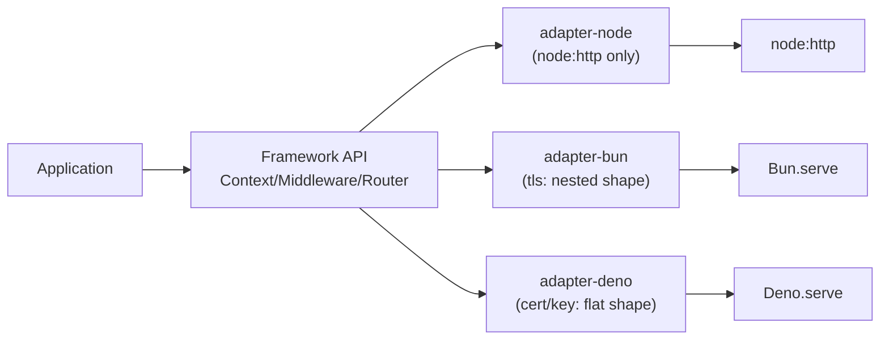
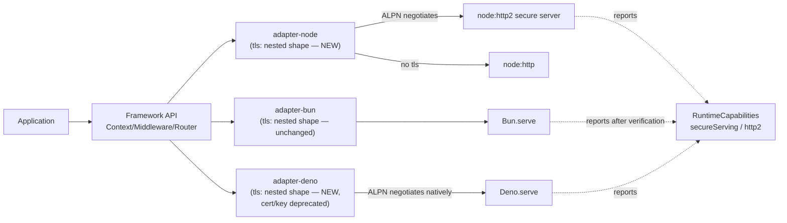

# RFC-028: TLS & Negotiated Transport for Runtime Adapters

| Field                | Value                                                                 |
| -------------------- | ---------------------------------------------------------------------- |
| **Status**           | `In Review`                                                            |
| **RFC number**       | `028`                                                                   |
| **Date**             | `2026-07-26`                                                            |
| **Author(s)**        | `NextRush core`                                                        |
| **Group**            | `runtime-adapters`                                                      |
| **Packages touched** | `@nextrush/adapter-node`, `@nextrush/adapter-bun`, `@nextrush/adapter-deno`, `@nextrush/runtime` |
| **Framework impact** | `Additive for Node/Bun; scoped breaking change for Deno (see §12)`     |
| **Supersedes**       | `—`                                                                     |
| **Superseded by**    | `—`                                                                     |
| **Related**          | `RFC-013` (adapter contract), `RFC-016` (edge-native WebSocket, same "adapter owns transport" pattern) |

---

## Progress Tracker

**Overall:** `[░░░░░░░░░░░░░░░░░░░░]` 0% — 0 / 4 phases complete · Doc status: `In Review`

| Phase | Part / deliverable                     | Status         |
| ----- | -------------------------------------- | -------------- |
| P0    | `RuntimeCapabilities` — `secureServing`/`http2` flags | ⬜ Not started  |
| P1    | Node adapter — TLS + ALPN-negotiated HTTP/2           | ⬜ Not started  |
| P2    | Bun capability verification + Deno shape standardization | ⬜ Not started  |
| P3    | Conformance parity + docs                             | ⬜ Not started  |

---

## 0. Revision History

- **v1 (`2026-07-26`)** — Initial draft, synthesized from three reviewed RFC drafts (broad
  transport-abstraction draft, scoped TLS-negotiation draft, canonical-serve-API draft) plus
  source verification against the current adapter implementations.

---

## 1. Summary (TL;DR)

`@nextrush/adapter-node` has no TLS support today; `@nextrush/adapter-bun` and
`@nextrush/adapter-deno` already have TLS, but with two different option shapes. This RFC adds
TLS + ALPN-negotiated HTTP/2 to the Node adapter, standardizes all three server adapters on
Bun's existing `tls: { cert, key, ca? }` shape, and extends `RuntimeCapabilities` with
`secureServing`/`http2` flags — all decided by capability negotiation, never by runtime
identity, and never exposing a `protocol` option to application code. The main cost: a scoped,
deprecation-windowed breaking change to Deno's flat `cert`/`key` fields, and an unresolved
empirical question about whether Bun's native `tls` option negotiates HTTP/2 at all.

---

## 1a. Terminology

`ALPN`
: Application-Layer Protocol Negotiation — the TLS handshake extension that lets a client and
server agree on HTTP/1.1 vs HTTP/2 without extra round-trips, before any HTTP data is sent.

`h2` / `h2c`
: `h2` is HTTP/2 over TLS (negotiated via ALPN); `h2c` is HTTP/2 over plain TCP with no TLS.
This RFC only supports `h2`, never `h2c` (see §10).

`Negotiated (vs. selected) transport`
: A transport chosen automatically by the platform/TLS layer based on what the connecting
client offers, as opposed to a transport explicitly requested by the application through an
API option. This RFC's central design principle is negotiated, never selected.

---

## 2. Decision Summary

- **Status:** `In Review`
- **Decision:**
  - _Introduce `ServeOptions.tls: { cert, key, ca? }` on `@nextrush/adapter-node`_
  - _Introduce the same `tls` shape on `@nextrush/adapter-deno`, deprecating its existing flat `cert`/`key`_
  - _Keep `@nextrush/adapter-bun`'s existing `tls` shape unchanged (it is already canonical)_
  - _Introduce `secureServing`/`http2` on `RuntimeCapabilities`, probed per runtime_
  - _Add ALPN-negotiated HTTP/2 to the Node adapter via `node:http2`'s `createSecureServer`_
- **Breaking:** `Yes, scoped — Deno's flat cert/key fields (see §12); Node/Bun are additive.`
- **Migration required:** `Deno consumers of flat cert/key rename to tls: { cert, key } within one minor's deprecation window.`
- **Blast radius:** `Medium` — three adapter packages plus `@nextrush/runtime`'s capability matrix; no change to `Context`, routing, or middleware.

---

## 2a. Decision Drivers

Priority (highest → lowest):

1. Runtime independence — application code never branches on runtime identity or protocol (AGENTS.md §7).
2. Capability negotiation over runtime branching — extends the existing `RuntimeCapabilities` mechanism rather than inventing a parallel one.
3. Minimal, honest public API — no `protocol` option; ALPN negotiates, the framework never asks the developer to choose.
4. Backward compatibility — Node/Bun changes are additive; Deno's break is minimized and given a deprecation window.
5. Conformance — no capability flag ships `true` without a passing cross-adapter test proving it.

---

## 3. Problem & Motivation

### 3.1 Current state (what exists today)

```ts
// packages/adapters/node/src/adapter.ts — verified: no tls/cert/key field exists.
export interface ServeOptions {
  port?: number;
  host?: string;
  onListen?: (info: { port: number; host: string; hostname: string }) => void;
  onError?: (error: Error) => void;
  timeout?: number;
  keepAliveTimeout?: number;
  logger?: Logger;
  shutdownTimeout?: number;
  gracefulShutdown?: boolean | GracefulShutdownOptions;
  // no tls field — serve() only ever constructs a plain node:http server.
}

// packages/adapters/bun/src/adapter.ts — verified: already has a nested tls shape.
tls?: { cert: string | Buffer; key: string | Buffer; ca?: string | Buffer };

// packages/adapters/deno/src/adapter.ts — verified: flat fields, no ca, string only.
cert?: string;
key?: string;
```

### 3.2 The problems (enumerated)

1. **Node has no TLS at all** — the only escape hatch is `createHandler()`, documented as
   "bring your own `http2.createSecureServer()`" (`packages/adapters/node/README.md`). A
   developer wanting HTTPS or HTTP/2 on Node gets zero framework support today.
2. **Bun and Deno already disagree on shape** — nested `tls: {}` vs. flat `cert`/`key`, `Buffer`
   vs. `string`-only, `ca` present vs. absent. A developer moving an app between the two
   adapters must rewrite their TLS config, contradicting the "one serving API regardless of
   runtime" goal already implicit in the adapter architecture.
3. **HTTP/2 support is unverified per-runtime, risking a false assumption of parity** — Deno's
   own docs state `Deno.serve()` supports HTTP/1.1 and HTTP/2 via ALPN once a cert is supplied;
   Bun's docs instead point to a *separate* `node:http2` API for HTTP/2, meaning its existing
   `tls` option is very likely HTTP/1.1-only. Treating the three adapters as symmetric would
   silently overstate Bun's capability.

### 3.3 Why now

Node's TLS gap was surfaced during a scoped architecture review of runtime transport support
(see revision history) and is a genuine, currently-unfilled capability gap, not speculative —
Bun and Deno adapters shipping first with incompatible shapes makes this the right moment to
standardize before a third, Node-specific shape accretes independently.

---

## 4. Goals & Non-Goals

### 4.1 Goals

- Node adapter gains TLS via a `tls` option and negotiates HTTP/2 automatically via ALPN when the connecting client offers it (maps to problem 3.2.1).
- Bun and Deno adapters expose the identical `tls: { cert, key, ca? }` shape (maps to problem 3.2.2).
- `RuntimeCapabilities.secureServing`/`http2` report the empirically verified truth per adapter, never an assumed parity (maps to problem 3.2.3).
- Conformance suite proves byte-identical framework behavior across HTTP/1.1, HTTPS/1.1, and negotiated HTTP/2 wherever a capability flag reports `true`.

### 4.2 Non-Goals

- No `protocol` option in the public API — rejected explicitly during review as reintroducing transport leakage; deferred permanently, not just for v1.
- No HTTP/3, QUIC, or Unix-socket support — no concrete need identified yet; would be a follow-up RFC (§17).
- No change to `@nextrush/adapter-edge`/`-serverless` public surface — TLS/protocol negotiation is already correctly the hosting platform's job (documented in the existing edge adapter architecture); this RFC only makes that explicit in the capability profile, not a new capability.
- No h2c (cleartext HTTP/2) support — near-zero real client support; not worth the surface (§10).

---

## 5. Impact

- **Affected packages:** `@nextrush/adapter-node`, `@nextrush/adapter-bun` (verification only, no shape change), `@nextrush/adapter-deno`, `@nextrush/runtime`, `@nextrush/adapters/conformance`
- **Affected audiences:** Application developers deploying with TLS termination inside the process (rather than behind a reverse proxy); adapter authors
- **Explicitly NOT affected:** `Context`, `Request`/`Response`, routing, middleware composition, the functional (`nextrush`) entry surface beyond `ServeOptions`, the edge/serverless adapters' public API

---

## 6. Proposed Solution (overview)

| # | Problem (from §3.2)        | Solution (this RFC)                          |
| - | --------------------------- | --------------------------------------------- |
| 1 | Node has no TLS             | Add `tls` option; construct `node:http2` secure server with ALPN, fallback to HTTP/1.1 |
| 2 | Bun/Deno shapes disagree    | Standardize both on Bun's existing nested `tls: {}` shape; deprecate Deno's flat fields |
| 3 | HTTP/2 parity assumed, unverified | `secureServing`/`http2` are probed capability flags, never hardcoded true; Bun's value is set only after empirical verification |

Each adapter still owns its own transport construction — this RFC does not introduce a shared
transport-abstraction layer between the adapter and the native runtime API. It standardizes the
public *option shape* and the *capability-reporting contract*, leaving the internal
implementation (how each adapter talks to `node:http2`/`Bun.serve()`/`Deno.serve()`) adapter-specific,
consistent with the existing `runtime-adapter-contract` capability's "adapters own transport"
principle.

---

## 6a. Trade-offs

### Benefits

- One TLS shape to learn, usable across Node/Bun/Deno without rewriting config.
- HTTP/2 arrives "for free" (via ALPN) wherever the underlying runtime supports it — no new application-facing concept.
- Capability flags let advanced code (or the conformance suite) query real per-runtime truth instead of assuming symmetry.

### Costs

- Deno consumers using flat `cert`/`key` must migrate within the deprecation window — a real, if narrow, disruption.
- Node's adapter gains real implementation complexity (`node:http2`'s stream/request shape differs from `node:http`'s) that must be bridged into the existing `AdapterContextFactory` without duplicating pipeline logic.
- Bun may end up with `http2: false` after verification, meaning "one canonical `tls` shape" does not imply "one canonical capability set" — the shape is unified, the capability truth is not, and documentation must be honest about that gap rather than implying parity.

---

## 7. Architecture

### 7.1 Before



### 7.2 After



### 7.3 Why this architecture

Each adapter keeps sole ownership of its transport construction — consistent with
`runtime-adapter-contract`'s existing "adapters own transport" principle and
`architecture.instructions.md`'s adapter layer sitting below `@nextrush/runtime`'s shared
primitives. What changes is the *public option shape* (standardized) and the *capability
truth* (now explicitly probed and exposed), not the layering itself. No new package or layer
is introduced — extending, not restructuring, per AGENTS.md §20's "edit an existing capability"
rule.

---

## 7a. Architecture Invariants

- Preserved: core/router/middleware import no runtime-specific API — this RFC's changes are entirely within the adapter and runtime-capability layers (AGENTS.md §7).
- Preserved: capability decisions are never made by branching on runtime identity — `secureServing`/`http2` are read, never used to gate a `runtime === 'node'`-style check (enforced by the existing `no-runtime-identity-capability` lint rule).
- Preserved: adapters build `Context` via the shared `AdapterContextFactory` shape and delegate to `app.callback()` — the Node HTTP/2 path must not re-implement middleware composition or routing (`runtime-adapter-contract`).
- Preserved: zero-dependency rule for core/router/adapters — `node:http2` is a Node built-in, not a new runtime dependency.

---

## 8. Detailed Design

### 8.1 Public API / surface

```ts
// @nextrush/adapter-node — NEW
export interface ServeOptions {
  // ...existing fields unchanged...
  tls?: {
    cert: string | Buffer;
    key: string | Buffer;
    ca?: string | Buffer;
  };
}

// @nextrush/adapter-deno — NEW field, existing fields deprecated
export interface ServeOptions {
  // ...existing fields unchanged...
  tls?: { cert: string; key: string; ca?: string };
  /** @deprecated Use `tls: { cert }` instead. Removed in the next minor after v<X>. */
  cert?: string;
  /** @deprecated Use `tls: { key }` instead. Removed in the next minor after v<X>. */
  key?: string;
}

// @nextrush/runtime — NEW capability fields
interface RuntimeCapabilities {
  // ...existing flags unchanged...
  secureServing: boolean;
  http2: boolean;
}
```

No `protocol` option exists anywhere in this surface — deliberate, per §4.2.

### 8.2 Internal components

- **Node**: a small, named helper constructs either a `node:http2` `createSecureServer` (when `tls` present) with an ALPN callback selecting `h2`/`http/1.1`, or the existing plain `node:http` server (when `tls` absent). Both paths converge on the same request-handling function built via `AdapterContextFactory`.
- **Deno**: the existing `cert`/`key` plumbing into `Deno.serve()` is reused; the new `tls` field maps onto the same internal call, and the deprecated flat fields become a compatibility shim reading into the same internal variables.
- **Bun**: no internal change unless the verification task (§18) concludes otherwise.
- **`@nextrush/runtime`**: `capabilitiesFor()` gains two new branches per runtime; profiles derive from it, not a separate constant.

### 8.3 Request / execution flow

```text
connection → TLS handshake (if tls configured) → ALPN offers ['h2', 'http/1.1']
  → h2 negotiated  → node:http2 stream → AdapterContextFactory → app.callback() → Context
  → http/1.1 (or no tls) → node:http request → AdapterContextFactory → app.callback() → Context
```

Both branches produce the identical `Context` shape — this is the conformance-tested invariant.

### 8.4 Data structures

`RuntimeCapabilities` gains two boolean fields (`secureServing`, `http2`); no new complex type.
`ServeOptions.tls` mirrors Bun's existing inline object type — no new named type needed, kept
consistent with how the existing `gracefulShutdown` option is typed inline where reasonable.

### 8.5 Error handling

A malformed `tls.cert`/`tls.key` (unreadable, invalid PEM) surfaces as the existing
`ServerStartError` / `normalizeStartupError()` path already used for bind failures — no new
error type; reuses the established typed-error contract (`@nextrush/runtime`).

### 8.6 Edge cases

| Scenario                                       | Behaviour                                                        |
| ------------------------------------------------ | ------------------------------------------------------------------ |
| `tls` absent                                     | Identical to pre-RFC behavior — plain `node:http`, HTTP/1.1 only  |
| `tls` present, client does not offer ALPN         | Serves HTTPS/1.1 (TLS without HTTP/2) — not an error              |
| `tls` present, client offers `h2` in ALPN         | Serves HTTP/2 over TLS                                            |
| Deno: both `tls` and flat `cert`/`key` supplied   | `tls` wins; flat fields are ignored with a deprecation warning    |
| Bun: `http2` capability verification incomplete   | `capabilitiesFor('bun').http2` reports `false` until verified true by a passing conformance scenario |

### 8.7 Examples

```ts
// Node — new capability, was previously impossible without createHandler()
import { serve } from '@nextrush/adapter-node';
import { readFileSync } from 'node:fs';

await serve(app, {
  tls: {
    cert: readFileSync('certificate.pem'),
    key: readFileSync('private-key.pem'),
  },
});
// HTTP/2 negotiates automatically for clients that support it; HTTPS/1.1 otherwise.
```

---

## 9. Alternatives Considered

### 9.1 Full transport-abstraction layer (Application → Framework API → Canonical Transport Layer → Adapter → Runtime)
Considered in an earlier draft. Rejected because `@nextrush/runtime`'s existing capability-negotiation model already satisfies "applications never branch on transport" without inserting a new architectural layer — adding one would duplicate a decision already made and shipped (AGENTS.md §20).

### 9.2 Explicit `protocol: 'http2'` option
Considered explicitly. Rejected because it reintroduces the exact transport-leakage problem this RFC exists to avoid, and does not match how HTTP/2 is actually negotiated in production (ALPN, not a client-stated preference).

### 9.3 Do nothing
Node stays without TLS/HTTP2 indefinitely; Bun/Deno's shape divergence persists and likely grows a third shape the next time an adapter needs TLS config. Cost: a real, currently-missing capability stays missing, and the shape divergence compounds.

---

## 10. Rejected Ideas

- **h2c (cleartext HTTP/2) support** — Rejected: near-zero real client support outside internal mesh traffic; not worth the surface area for a case nothing exercises.
- **`hostname` as the canonical host field** — Rejected: an earlier draft proposed this without checking; the Deno adapter's own doc comment already records `host` as the settled outcome of a prior audit (F-05). This RFC does not reopen it.
- **A new named `TlsOptions` exported type** — Rejected in favor of an inline object type matching how `gracefulShutdown`'s options are already typed in this codebase — avoids growing the public type surface for a three-field shape.

---

## 11. Risks & Mitigations

| Risk                                                                | Mitigation                                                                                          | Likelihood | Impact |
| -------------------------------------------------------------------- | ------------------------------------------------------------------------------------------------------ | ---------- | ------ |
| Bun's `Bun.serve()` `tls` option does not negotiate HTTP/2 at all    | Empirical `se-spike` verification before `http2` ships `true` for Bun; capability defaults to `false` until proven | Medium     | Low — Bun still gets TLS parity even if `http2` stays `false` |
| Node's `node:http2` stream shape breaks parity with existing `Context` | Conformance suite (task group 7) proves byte-identical behavior before any capability flag ships true | Low        | High — would break the core adapter contract |
| Deno consumers miss the deprecation notice and break on removal      | `@deprecated` JSDoc + README migration note shipped in the same commit as the new field; one full minor deprecation window | Low        | Medium |

---

## 12. Backward Compatibility & Migration

- **Compatibility:** Additive for Node and Bun. Breaking, narrowly, for Deno's flat `cert`/`key` fields — but only after a deprecation window, not immediately.
- **Migration path (if breaking):**

  ```ts
  // Before (Deno, deprecated)
  await serve(app, { cert, key });

  // After
  await serve(app, { tls: { cert, key } });
  ```

- **Deprecation window:** `@deprecated` JSDoc lands in the same commit as the new `tls` field; flat fields keep working through one minor version, then are removed.

---

## 13. Cross-Cutting Concerns

- **Security:** TLS material (`cert`/`key`) is never logged; error paths reuse the existing `ServerStartError` normalization, which does not leak key material or internal paths. `ca` support lets deployments pin a custom trust chain rather than defaulting to a wildcard trust assumption.
- **Performance:** ALPN negotiation is a one-time per-connection cost, not per-request; no hot-path allocation added to the existing request pipeline. Measured against the existing `apps/benchmark` suite before this ships (task group 9).
- **Runtime independence:** No `node:http2`-specific code leaks into core/router/middleware — confined entirely to `packages/adapters/node/src`. `secureServing`/`http2` are queried via capability, never via `runtime === 'node'`.
- **Observability:** Adapter `logger` continues to receive structured startup/error logs; no new sensitive data is logged.
- **Zero-dependency rule:** `node:http2` is a Node built-in — no new runtime dependency introduced anywhere in this RFC.

---

## 14. Success Metrics

| Metric                | Baseline (today)                    | Target / threshold                                   |
| ---------------------- | -------------------------------------- | -------------------------------------------------------- |
| Latency (p50/p99)      | Node HTTP/1.1 baseline (`apps/benchmark`) | No regression on the existing HTTP/1.1 path            |
| Conformance parity     | N/A — no HTTP/2 scenarios exist today | 100% pass on HTTP/1.1 + HTTPS/1.1 + HTTP/2 for every adapter reporting `http2: true` |
| Test coverage          | —                                       | 90%+ lines/functions on every touched package           |

---

## 15. Phased Implementation Plan

| Phase | Goal (what ships)                                          | Depends on | Exit condition (checkable)                                              | Status         |
| ----- | -------------------------------------------------------------- | ---------- | ---------------------------------------------------------------------------- | -------------- |
| **P0** | `RuntimeCapabilities.secureServing`/`http2` flags (default false) | —          | Unit tests green; flags present on every `CapabilityProfile`                | ⬜ Not started  |
| **P1** | Node adapter — `tls` option + ALPN-negotiated `node:http2` path | P0         | Conformance suite green for Node across HTTP/1.1, HTTPS/1.1, HTTP/2         | ⬜ Not started  |
| **P2** | Bun capability verification (`se-spike`) + Deno shape standardization | P0         | Bun's `http2` flag matches empirical proof; Deno's `tls` field + deprecated aliases both pass tests | ⬜ Not started  |
| **P3** | Full cross-adapter conformance + docs                      | P1, P2     | Certification matrix updated; all touched READMEs/ARCHITECTURE.md updated  | ⬜ Not started  |

### 15.1 Testing strategy

- **Unit:** capability-flag derivation, `tls` option parsing/validation, per-adapter.
- **Integration:** real TLS handshake + ALPN negotiation against each adapter's actual server construction (not mocked).
- **Cross-adapter:** the extended conformance suite (`packages/adapters/conformance`) — identical observable behavior across Node/Bun/Deno for every transport each reports supporting.
- **Coverage:** 90%+ lines/functions per touched package (project-rules §7).

---

## 16. Rollback Plan

- **Trigger:** a conformance regression, an unresolvable Node `node:http2`/`Context` parity break, or a benchmark regression on the existing HTTP/1.1 path.
- **Steps:**
  - Revert the affected adapter package to its pre-RFC published version.
  - Node/Bun: no compatibility shim needed — the `tls` option was purely additive, so reverting removes it cleanly.
  - Deno: keep the deprecated flat `cert`/`key` fields functioning (they are not removed until the deprecation window ends independently of this rollback) so a partial rollback doesn't strand existing consumers.

---

## 17. Future Work

- HTTP/3/QUIC support, if a concrete driver emerges — a follow-up RFC, not implied by this one.
- h2c support, if an internal-mesh use case is identified — currently explicitly rejected (§10).
- A `node:http2`-based HTTP/2 path for Bun, if the §18 verification concludes Bun's native `tls` option cannot negotiate `h2` — tracked as a distinct follow-up, not silently folded into this RFC's scope. **Confirmed by §18's empirical spike: Bun's native `tls` path does not negotiate `h2`** — this follow-up is now a live candidate, not hypothetical.
- Extending the shared `ConformanceDriver`/`DispatchInit` contract (`packages/adapters/conformance/src/drivers/types.ts`) to carry TLS/protocol configuration, so TLS/HTTP2 parity scenarios can run through the same `describe.each` mechanism as every other conformance check instead of as a standalone Node-only test file. This change's conformance work (tasks.md §7.1) proves the parity requirement holds via a focused, non-integrated test — extending the shared driver contract itself is a separate, larger design decision (which fields belong on `DispatchInit`, how Bun/Deno's `fetch`-based drivers would even express TLS) deferred to its own RFC.

---

## 18. Open Questions

- [x] Does `Bun.serve()`'s existing `tls` option negotiate `h2` via ALPN, or does Bun require the separate `node:http2` API entirely? **Resolved**: empirically verified via a standalone spike — Bun's native `tls` path does not negotiate `h2` (`connect error: h2 is not supported`); `capabilitiesFor('bun').http2` correctly reports `false`.
- [ ] Exact deprecation window length for Deno's flat `cert`/`key` — this RFC defaults to one minor version; escalate only if a real consumer needs longer.

---

## 19. Decisions Log

| Question                                            | Decision                                              | Rationale                                                                 |
| ------------------------------------------------------ | ---------------------------------------------------------- | ------------------------------------------------------------------------------ |
| Canonical TLS shape — Bun's nested vs. Deno's flat form | Bun's nested `tls: { cert, key, ca? }`                 | Richer of the two existing shapes (has `ca`); only Deno needs to change      |
| Protocol option vs. automatic negotiation               | Automatic ALPN negotiation, no `protocol` option           | Matches real-world HTTP/2 negotiation; avoids leaking transport into the API |
| `host` vs. `hostname` as canonical field                | Keep `host`                                                 | Already a settled audit decision (F-05) recorded in the Deno adapter itself |
| h2c support                                             | Rejected                                                     | Near-zero real client support; not worth the surface                        |

---

## 20. References

- `docs/RFC/runtime-adapters/013-adapter-contract.md` — the `ServerAdapter`/`FetchAdapter` contract this RFC's Node changes must continue to satisfy.
- `packages/adapters/node/src/adapter.ts`, `packages/adapters/bun/src/adapter.ts`, `packages/adapters/deno/src/adapter.ts` — current source verified during review.
- `openspec/changes/tls-transport-negotiation/` — the OpenSpec change (proposal, design, specs, tasks) this RFC formalizes.
- Deno documentation confirming `Deno.serve()` supports HTTP/1.1 and HTTP/2 via ALPN; Bun documentation pointing to a separate `node:http2` API for HTTP/2 (see design.md's Context section for the exact claims verified).
