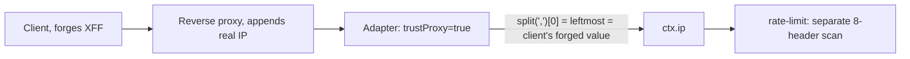

# RFC-030: Typed proxy-trust boundary for client-IP resolution

| Field                | Value                                                                 |
| -------------------- | --------------------------------------------------------------------- |
| **Status**           | `Draft` |
| **RFC number**       | `030` |
| **Date**             | `2026-07-27` |
| **Author(s)**        | `harden-security-boundaries change` |
| **Group**            | `runtime-adapters` |
| **Packages touched** | `@nextrush/types`, `@nextrush/runtime`, `@nextrush/adapter-node`, `@nextrush/adapter-bun`, `@nextrush/adapter-deno`, `@nextrush/adapter-edge`, `@nextrush/rate-limit` |
| **Framework impact** | `Breaking (needs major + migration)` |
| **Supersedes**       | `—` |
| **Superseded by**    | `—` |
| **Related**          | `ADR-0018`, security-review SEC-01 |

---

## Progress Tracker

**Overall:** `[░░░░░░░░░░░░░░░░░░░░]` 0% — 0 / 4 phases complete · Doc status: `Draft`

| Phase | Part / deliverable                     | Status         |
| ----- | --------------------------------------- | -------------- |
| P0    | `proxy` option type + `resolveClientIp` rewrite in `@nextrush/runtime` | ⬜ Not started  |
| P1    | Adapter wiring (Node/Bun/Deno/Edge)      | ⬜ Not started  |
| P2    | `@nextrush/rate-limit` migrates off its own header scan | ⬜ Not started  |
| P3    | Conformance parity + migration guide     | ⬜ Not started  |

---

## 0. Revision History

- **v1 (2026-07-27)** — Initial draft, extracted from `report/security-review.md` finding SEC-01.

---

## 1. Summary (TL;DR)

`resolveClientIp()` selects the leftmost `X-Forwarded-For` entry when proxying is trusted, which is
always the value the client itself wrote — a conforming proxy appends, never overwrites, so the
leftmost position is never the proxy's own assertion. `@nextrush/rate-limit` independently accepts
the first of eight vendor headers with no trust check at all. Both let a remote, unauthenticated
attacker forge their own IP by setting a header, defeating rate limits, IP allow/deny lists, and any
audit log keyed on `ctx.ip`. This RFC replaces the boolean `proxy` option with `false | number |
string[]` — a hop count or a trusted-peer CIDR list — and rewrites `resolveClientIp()` to walk the
forwarded chain from the right, stopping at the first untrusted entry.

---

## 1a. Terminology

`Hop count`
: The number of proxy hops between the application and the internet that are trusted to append a
  correct entry to `X-Forwarded-For`. `proxy: 1` means "trust exactly one intermediary."

`Trusted-peer list`
: An array of CIDR ranges whose direct connection to the application is trusted to assert forwarded
  headers. Selection walks the chain right-to-left, continuing only while each successive peer is in
  the set.

---

## 2. Decision Summary

- **Status:** `Draft`
- **Decision:**
  - _Introduce `proxy: false | number | string[]` replacing the boolean._
  - _Introduce a right-to-left, trust-gated `X-Forwarded-For` walk in `resolveClientIp()`._
  - _Remove `@nextrush/rate-limit`'s independent eight-header scan; it consumes `ctx.ip`._
  - _Reject `proxy: true` and `proxy: 0` at boot with actionable errors._
- **Breaking:** `Yes — see §12`
- **Migration required:** `Yes — one line, see §12`
- **Blast radius:** `high` — every application deployed behind any reverse proxy or load balancer.

---

## 2a. Decision Drivers

Priority (highest → lowest):

1. Security correctness — the safe configuration must be expressible, not just documented.
2. Runtime independence — one policy, consumed identically by Node/Bun/Deno/Edge.
3. Fail-safe defaults — an ambiguous or malformed chain must fall back to the direct peer, never to
   an untrusted entry.
4. Migration cost — the type change must fail loudly, not silently misbehave.

---

## 3. Problem & Motivation

### 3.1 Current state (what exists today)

```ts
// packages/runtime/src/headers.ts
export function resolveClientIp(get, options) {
  const { trustProxy, directIp, cloudflare = false } = options;
  if (trustProxy) {
    if (cloudflare) { const cf = isValidClientIp(get('cf-connecting-ip')); if (cf) return cf; }
    const forwarded = get('x-forwarded-for');
    if (forwarded) { const first = isValidClientIp(forwarded.split(',')[0]); if (first) return first; }
    const realIp = isValidClientIp(get('x-real-ip'));
    if (realIp) return realIp;
  }
  return directIp;
}
```

`trustProxy` is a boolean; when true, the *leftmost* entry wins.

### 3.2 The problems (enumerated)

1. **Leftmost selection trusts the client** — a conforming proxy appends to the right; the leftmost
   entry is always client-authored input, not a proxy assertion.
2. **Eight-header scan in `@nextrush/rate-limit` with no trust gate** — independently vulnerable, and
   duplicates a policy that should live in one place.
3. **No safe configuration is expressible** — the boolean forces a choice between "broken behind a
   load balancer" (`false`) and "spoofable" (`true`); there is no third option.

### 3.3 Why now

SEC-01 is one of two P1 findings — remote, unauthenticated, single-header, and it corrupts every
downstream decision (rate limiting, allowlisting, audit logging) that trusts `ctx.ip`.

---

## 4. Goals & Non-Goals

### 4.1 Goals

- A safe configuration is expressible and typed (3.2.3).
- The resolution walk cannot select a client-authored entry when a trust specification is configured
  correctly (3.2.1).
- `@nextrush/rate-limit` has exactly one source of truth for client IP (3.2.2).

### 4.2 Non-Goals

- Automatic proxy discovery or a dynamic trust list fetched at runtime — configuration is static per
  process, matching how `ApplicationOptions` works elsewhere.
- A string-DSL trust syntax (Express's `'loopback, 10.0.0.1'`) — rejected in favor of typed values
  (§9.2).
- IPv6-specific CIDR edge cases beyond what the existing `isValidIpv6`/`parseCidr` utilities in
  `@nextrush/rate-limit` already handle — this RFC reuses that logic, not rewrites it.

---

## 5. Impact

- **Affected packages:** `@nextrush/types` (option type), `@nextrush/runtime` (policy),
  `@nextrush/adapter-{node,bun,deno,edge}` (wiring), `@nextrush/rate-limit` (key generation).
- **Affected audiences:** Application developers deployed behind any proxy/load balancer; anyone
  relying on `ctx.ip` for logging or access control.
- **Explicitly NOT affected:** Applications with `proxy: false` (or omitted) — direct-peer resolution
  is unchanged.

---

## 6. Proposed Solution (overview)

| # | Problem (from §3.2)        | Solution (this RFC)                          |
| - | ----------------------------- | ------------------------------------------------ |
| 1 | Leftmost selection             | Walk `X-Forwarded-For` right-to-left; stop at first entry outside the trust set |
| 2 | Duplicated header scan          | `rate-limit` reads `ctx.ip`; its own header constants and parser are deleted |
| 3 | No safe configuration           | `proxy: false \| number \| string[]`; `true` rejected at boot |

---

## 6a. Trade-offs

### Benefits

- The safe configuration is now the only configuration the type system accepts.
- One implementation serves every adapter and every consumer (including rate-limit), so a future fix
  applies everywhere at once.

### Costs

- Every `proxy: true` deployment fails to boot until migrated — a hard stop, chosen deliberately over
  a silent behavior change (§9.1).
- The Edge adapter cannot verify a trusted-peer list (no direct peer address) and must refuse that
  configuration, leaving hop-count as the only Edge-compatible form.

---

## 7. Architecture

### 7.1 Before



### 7.2 After


### 7.3 Why this architecture

`resolveClientIp()` already exists as the one shared policy consumed by all four adapters
(`report/security-review.md` calls this out as the correct pattern already in place — the *policy*
was centralized, only its *content* was wrong). This RFC changes the content and the input type, not
the ownership. `@nextrush/rate-limit` sits above `runtime` in no formal hierarchy but is logically a
consumer, not a policy owner, so it loses its own resolution logic entirely.

---

## 7a. Architecture Invariants

- Preserved: `resolveClientIp` remains the single shared implementation; no adapter gains its own
  header-precedence logic.
- Preserved: zero-dependency rule — CIDR matching reuses existing pure-function utilities already in
  `@nextrush/rate-limit`, promoted to a shared location rather than duplicated.
- Changed, deliberately: the `proxy` option's type. Justification: a boolean cannot express "how many
  hops," and the review shows that gap is exploitable, not cosmetic.

---

## 8. Detailed Design

### 8.1 Public API / surface

```ts
// @nextrush/types
export type ProxyTrust = false | number | string[]; // number = hop count; string[] = CIDR peers

interface ApplicationOptions {
  proxy?: ProxyTrust; // default: false
}

// @nextrush/runtime
export interface ClientIpOptions {
  trust: ProxyTrust;
  directIp: string;
  peerIp?: string; // the immediate connecting peer, needed to validate a peer list
  cloudflare?: boolean;
}
export function resolveClientIp(get: HeaderLookup, options: ClientIpOptions): string;
```

### 8.2 Internal components

- `resolveClientIp` — branches on `trust`: `false` → `directIp`; `number` → parse
  `X-Forwarded-For`, take the `n`-th entry from the right, falling back toward `directIp` if the
  chain is shorter; `string[]` → walk right-to-left while each successive entry (and the immediate
  peer) is within the CIDR set, returning the first entry outside it, or `directIp` if the peer
  itself is untrusted.
- Boot validation — a new check (shared with the WS-F production audit) that rejects `true` and `0`
  before the adapter starts listening.
- `@nextrush/rate-limit`'s `key-generator.ts` — `extractClientIp` deleted; `defaultKeyGenerator` reads
  `ctx.ip` directly.

### 8.3 Request / execution flow

```text
request arrives → adapter reads direct peer + forwarded headers
                → resolveClientIp(get, { trust, directIp, peerIp }) → ctx.ip
                → every consumer (rate-limit, logging, app code) reads ctx.ip only
```

### 8.4 Data structures

No persisted structures. CIDR parsing reuses `parseCidr`/`isIpv4InCidr`/`isIpv6InCidr` from
`rate-limit/src/utils/key-generator.ts`, relocated to `@nextrush/runtime` so both the policy and
`rate-limit` share one implementation instead of two.

### 8.5 Error handling

Boot-time rejection of `proxy: true` or `proxy: 0` throws a plain `Error` (not an `HttpError` — this
is a configuration-time failure, not a request-time one) naming both valid replacements. A
malformed forwarded-header entry at request time is skipped, never thrown — request-time failures
degrade to the direct peer, per the fail-safe-default driver.

### 8.6 Edge cases

| Scenario                                                             | Behaviour                                   |
| ------------------------------------------------------------------- | -------------------------------------------- |
| `proxy: 1`, chain has 2 entries, forged leftmost                     | Second-from-right entry returned              |
| `proxy: ['10.0.0.0/8']`, direct peer outside the range               | Direct peer returned (chain not consulted)    |
| Hop count larger than chain length                                   | Falls back to direct peer                    |
| Malformed entry mid-chain (`not-an-ip`)                               | Skipped; resolution continues past it or falls back |
| `cf-connecting-ip` present, peer untrusted                            | Ignored |
| Edge adapter, `proxy: ['cidr']`, no peer address available            | Boot throws, directs to a hop count           |
| IPv4-mapped IPv6 peer (`::ffff:10.0.0.5`) against a trusted list       | Normalized before comparison; matches as `10.0.0.5` would |

### 8.7 Examples

```ts
// Single reverse proxy in front of the app (nginx, one hop)
createApp({ proxy: 1 });

// Known internal network of trusted load balancers
createApp({ proxy: ['10.0.0.0/8', '192.168.0.0/16'] });
```

---

## 9. Alternatives Considered

### 9.1 Fix only the direction (still leftmost-adjacent, but from a configurable offset)

Considered a `proxy: { skip: n }` shape identical in effect to `proxy: number` but nested. Rejected:
adds a layer of object nesting with no behavioral difference; a bare number is simpler and matches
how the trust decision is actually made (count of hops).

### 9.2 String-DSL trust syntax (Express-style)

Rejected: stringly-typed configuration in a framework whose stated differentiator is type safety
(`README.md` "Type-Safe — Full TypeScript with zero `any`"); parsing a DSL is more code than the two
typed shapes chosen here.

### 9.3 Do nothing

Leaves SEC-01 open — a remote attacker defeats rate limiting and allowlisting with one header. Not
viable.

---

## 10. Rejected Ideas

- **Trust by default when behind any detected proxy** — Rejected: "detecting" a proxy from request
  shape alone is unreliable and reintroduces an implicit trust decision the RFC exists to make explicit.
- **Separate CIDR-matching implementations for runtime vs. rate-limit** — Rejected: exactly the
  duplication problem 3.2.2 identifies; relocate and share instead.

---

## 11. Risks & Mitigations

| Risk                                                          | Mitigation                                                              | Likelihood | Impact |
| ---------------------------------------------------------------- | ---------------------------------------------------------------------------- | ---------- | ------ |
| A deployment with `proxy: true` fails to boot on upgrade           | Boot error names both replacements verbatim; migration guide gives the exact one-line fix | High (by design) | Low (caught at deploy, not mid-traffic) |
| A misconfigured hop count still trusts too much                   | Documentation states the hop count must equal the actual proxy chain depth, not an approximation | Medium     | Medium |
| Edge's peer-list refusal surprises a developer expecting parity with Node | RFC and migration guide state the constraint explicitly with the hop-count alternative | Low        | Low    |

---

## 12. Backward Compatibility & Migration

- **Compatibility:** Breaking — requires a major bump.
- **Migration path:**

  ```ts
  // Before
  createApp({ proxy: true });

  // After — one reverse proxy
  createApp({ proxy: 1 });

  // After — known proxy network
  createApp({ proxy: ['10.0.0.0/8'] });
  ```

- **Deprecation window:** None — `proxy: true` throws immediately at boot rather than warning, because
  a silently-continuing spoofable configuration is the vulnerability this RFC closes.

---

## 13. Cross-Cutting Concerns

- **Security:** This RFC's entire purpose; no new attack surface introduced.
- **Performance:** The chain walk is bounded by header length (already capped by header-size limits
  elsewhere in the stack); no new allocation on the `trust: false` fast path, preserved from today.
- **Runtime independence:** One `resolveClientIp` implementation, pinned identical across all four
  adapters by conformance.
- **Observability:** No new logging; `ctx.ip` remains the one value consumers log.
- **Zero-dependency rule:** No new runtime dependency; CIDR logic is relocated, not added.

---

## 14. Success Metrics

| Metric                                     | Baseline (today) | Target / threshold     |
| --------------------------------------------- | -------------------- | -------------------------- |
| Requests where a forged leftmost XFF is honored | Exploitable today   | 0, under any trust config  |
| `resolveClientIp` implementations             | 2 (runtime + rate-limit) | 1 |
| Cross-adapter conformance (client-IP scenarios) | Not asserted today  | 100% pass, all 4 adapters |
| Test coverage (`runtime`, `rate-limit`, adapters) | current             | 90%+ |

---

## 15. Phased Implementation Plan

| Phase | Goal (what ships)                     | Depends on | Exit condition (checkable)                     | Status         |
| ------ | ---------------------------------------- | ------------ | -------------------------------------------------- | -------------- |
| **P0** | `proxy` type + `resolveClientIp` rewrite | — | Unit tests: hop-count and peer-list selection matrix green | ⬜ Not started  |
| **P1** | Adapter wiring                          | P0 | Integration test on Node; Bun/Deno/Edge follow    | ⬜ Not started  |
| **P2** | `rate-limit` migration                  | P0 | Rotating-XFF-does-not-mint-new-keys test green    | ⬜ Not started  |
| **P3** | Conformance + migration guide           | P1, P2 | All 4 adapters pass identical client-IP scenarios | ⬜ Not started  |

### 15.1 Testing strategy

- **Unit:** chain-walk selection under every trust form; malformed-entry skipping; boot rejection of
  `true`/`0`.
- **Integration:** rate-limit bypass reproduction (RED) → fix (GREEN).
- **Cross-adapter:** identical resolution for the same headers and trust spec, all four adapters.
- **Coverage:** 90%+ lines/functions.

---

## 16. Rollback Plan

- **Trigger:** a conformance failure discovered before merge, or a boot-rejection false positive on a
  legitimate configuration not yet covered by the type.
- **Steps:**
  - Revert `@nextrush/types`, `@nextrush/runtime`, touched adapters, and `@nextrush/rate-limit`
    together — they share the type change and cannot be reverted independently once merged.
  - No migration/data state to clean up.

---

## 17. Future Work

- Dynamic trusted-peer discovery (e.g. from a cloud provider's published proxy ranges) — deferred; a
  static list is sufficient for the threat this RFC closes.

---

## 18. Open Questions

- [ ] Should a peer-list configuration on an adapter with a peer address but an unparseable one (rare
  transport edge case) warn or throw? Decide during P1.

---

## 19. Decisions Log

| Question                                  | Decision                                | Rationale                                              |
| -------------------------------------------- | ------------------------------------------- | ------------------------------------------------------------ |
| Boolean, number, or CIDR list, or all three? | `false \| number \| string[]`              | Covers "no proxy," "N hops," and "known peers" without a DSL |
| Where does CIDR matching live?               | `@nextrush/runtime`, reused by `rate-limit` | One implementation, not two                                  |
| Refuse or warn on `proxy: true`?              | Refuse (throw at boot)                      | A warning still ships the vulnerability                      |

---

## 20. References

- `report/security-review.md` — SEC-01.
- `openspec/changes/harden-security-boundaries/` — proposal, design, specs, tasks.
- `docs/adr/ADR-0018-typed-proxy-trust.md`.
- `packages/runtime/src/headers.ts`, `packages/middleware/rate-limit/src/utils/key-generator.ts`.
