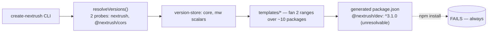
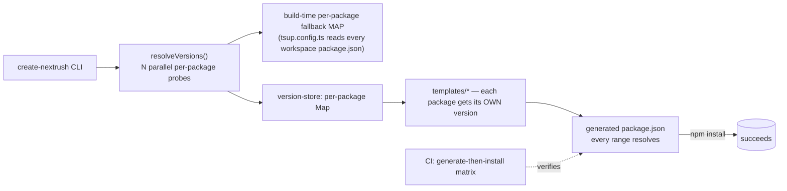

# RFC-021: `create-nextrush` — the project-scaffolding capability & per-package version resolution

| Field                | Value                                                                 |
| -------------------- | --------------------------------------------------------------------- |
| **Status**           | `Approved`                                                            |
| **RFC number**       | `021`                                                                 |
| **Date**             | `2026-07-22`                                                          |
| **Author(s)**        | Scaffolding/CLI audit                                                |
| **Group**            | `scaffolding`                                                        |
| **Packages touched** | `create-nextrush`                                                     |
| **Framework impact** | `Additive / bug-fix, non-breaking` — `create-nextrush`'s exported functions/types are unchanged; the changes correct a currently non-installable generated output, not a break of a working contract |
| **Supersedes**       | `—`                                                                   |
| **Superseded by**    | `—`                                                                   |
| **Related**          | `ADR-0011`, `docs/RFC/dev-tooling/019-dev-tooling-capability.md`, `ADR-0008`, `report/scaffolding/scaffolding-cli-review.md` |

---

## Progress Tracker

**Overall:** `[████████████████████]` 100% — 4 / 4 phases complete · Doc status: `Approved`

| Phase | Part / deliverable                                              | Status         |
| ----- | ----------------------------------------------------------------- | -------------- |
| P0    | Verification backstop (generate-then-install matrix, resolver unit tests) | ✅ Done        |
| P1    | Per-package version resolution + fallback map + diagnostics       | ✅ Done        |
| P2    | Runtime honesty (Deno/Bun) + generated-config correctness         | ✅ Done        |
| P3    | Conventions/onboarding batch + gates                              | ✅ Done        |

---

## 0. Revision History

- **v1 (`2026-07-22`)** — Initial draft, written alongside implementation of the
  `project-scaffolding-hardening` OpenSpec change (derived from
  `report/scaffolding/scaffolding-cli-review.md`, commit `6ab26e9`).

---

## 1. Summary (TL;DR)

`create-nextrush` is every developer's first contact with NextRush, but its version resolver
probes only two packages (`nextrush`, `@nextrush/cors`) and reuses those two ranges across
~10 independently-versioned packages, so every generated project pins an unresolvable range
(`@nextrush/dev: ^3.1.0` when the package is actually `1.0.0`) and `npm install` fails for every
scaffold. This RFC establishes `project-scaffolding` as a durable capability with an explicit
contract — every generated dependency resolves from its own registry entry, with a build-time
per-package fallback map, verified by a generate-then-install CI matrix — and fixes the
runtime-honesty and generated-config defects the review found alongside it. The most important
consequence: a generated project installs and runs on every offered `{style, runtime,
middleware}` combination, permanently, because a CI gate — not a human — now proves it.

---

## 2. Decision Summary

- **Status:** `Approved`
- **Decision:**
  - _Introduce_ the `project-scaffolding` capability — no existing capability owns
    `create-nextrush`; `adapter-development-kit` owns only `generate adapter`, and `dev-tooling`
    is scoped to `@nextrush/dev`.
  - _Introduce_ per-package version resolution with a build-time per-package fallback map,
    replacing the two-probe (`nextrush` + `@nextrush/cors`) proxy.
  - _Introduce_ a generate-then-install CI matrix as the system-of-record verifier for the
    install-integrity claim.
  - _Keep_ `create-nextrush`'s public API (exported functions/types) unchanged.
- **Breaking:** `No`
- **Migration required:** `None` — the changes correct a currently-broken generated output.
- **Blast radius:** `low` for most fixes (single-file, independently revertible); `medium` for
  the version resolver and the CI matrix (touch every generated `package.json` / shared CI).

---

## 3. Problem & Motivation

### 3.1 Current state (what exists today)

```ts
// npm-version.ts — TODAY: probes exactly two packages
export async function resolveVersions(): Promise<NpmVersionCache> {
  const [coreVer, mwVer] = await Promise.all([
    fetchVersion('nextrush'),
    fetchVersion('@nextrush/cors'),
  ]);
  cached = { core: coreVer ? `^${coreVer}` : CORE_FALLBACK, mw: mwVer ? `^${mwVer}` : MW_FALLBACK };
  return cached;
}
```

```ts
// shared.ts::getDependencies — TODAY: the `core` range is fanned onto @nextrush/dev
const devDependencies: Record<string, string> = {
  '@nextrush/dev': core, // core = nextrush's version (3.1.0-line); @nextrush/dev is actually 1.0.0
  '@nextrush/types': core,
  typescript: '^6.0.2',
  '@types/node': '^26.0.0',
};
```

Verified workspace versions (read from each package's own `package.json`): `nextrush`,
`@nextrush/types`, `@nextrush/class`, `@nextrush/di` = `3.1.0`; `@nextrush/dev`,
`@nextrush/rate-limit`, `@nextrush/request-id`, `@nextrush/adapter-bun`, `@nextrush/adapter-deno`
= `1.0.0`. `.changeset/config.json`'s `fixed` group explicitly excludes `@nextrush/dev` and every
middleware/adapter package — they are independently versioned by design.

### 3.2 The problems (enumerated)

1. **Two-probe version proxy fans an unrelated version onto independently-versioned packages** —
   every generated project pins `@nextrush/dev: ^3.1.0` in `devDependencies`, which has no
   matching published version (`@nextrush/dev` is `1.0.0`), so `npm install` fails for every
   style/runtime/middleware combination. `full` adds `rate-limit`/`request-id` failures; `bun`/
   `deno` add adapter failures.
2. **No verifier exists for "does the generated project install?"** — the existing
   `generator.test.ts` calls `setVersions('^3.0.5', '^3.0.5')` and asserts only on structure; it
   never resolves a generated range against a real published version. This is the maintainability
   root cause: the bug is invisible to the one test suite that exists.
3. **Install/git failures run with `stdio: 'ignore'`** — a failed install (which is every install,
   today, per problem 1) prints only `"Dependency installation failed. Run install manually."`
   with the actual registry/resolution error suppressed.
4. **Deno + class-based/full generates a project whose DI cannot work** — the Deno `dev` script
   bypasses `nextrush dev` entirely and no `deno.json` is emitted, so `emitDecoratorMetadata` is
   never configured and constructor DI fails at runtime.
5. **Generated config is looser than the framework's own standard** — no `isolatedModules` despite
   an SWC per-file toolchain, no `engines`/`packageManager`, hardcoded/drifted
   `typescript`/`@types/node`, hardcoded `registry.npmjs.org` ignoring `.npmrc`.
6. **Generated docs describe files that don't exist** — the package README's `full` structure
   lists a `not-found.ts` the generator never emits; the generated project's own README always
   shows the `functional` structure unless the style is exactly `functional`.

### 3.3 Why now

The scaffolder is the one durable NextRush product with no capability spec, and the review
(`report/scaffolding/scaffolding-cli-review.md`) just proved its core promise (install → build →
run) is broken for every combination today. Every day this ships is another failed first
impression; fixing the verifier and the resolver together is the same "verifier is the
bottleneck" lesson the sibling `dev-tooling` RFC already applied.

---

## 4. Goals & Non-Goals

### 4.1 Goals

- Every generated `{style, runtime, middleware}` combination resolves, installs, builds, and runs
  with working DI (maps to problems 3.2.1, 3.2.4).
- A generate-then-install CI matrix exists and is the system-of-record verifier (3.2.2).
- Install/git failures are diagnosable (3.2.3).
- Generated config/docs match the framework's own standards and its own emitted output (3.2.5, 3.2.6).

### 4.2 Non-Goals

- No change to `create-nextrush`'s public API — deferred to a future RFC if ever needed.
- No re-opening of the `dev-tooling` capability — the Bun/Deno *builder*-side metadata guarantee
  stays owned and enforced there; this RFC only fixes the *generated* config/scripts that make it
  reachable.
- No new interactive features, template styles, or runtimes.
- No move off `@clack/prompts` or the SWC toolchain.

---

## 5. Impact

- **Affected packages:** `create-nextrush` only.
- **Affected audiences:** Every application developer scaffolding a new NextRush project;
  contributors maintaining the scaffolder.
- **Explicitly NOT affected:** `@nextrush/dev` (consumed, not modified), `adapter-development-kit`
  (`generate adapter`), the runtime/request-path packages.

---

## 6. Proposed Solution (overview)

| # | Problem (from §3.2)                                | Solution (this RFC)                                                          |
| - | --------------------------------------------------- | ----------------------------------------------------------------------------- |
| 1 | Two-probe proxy fans a wrong version                | Per-package registry resolution + a build-time per-package fallback map       |
| 2 | No install verifier                                 | Generate-then-install CI matrix over every `style × runtime × middleware` cell |
| 3 | Swallowed install/git failures                      | Capture stderr on failure; print the retry command; stay quiet on success     |
| 4 | Deno DI cannot work                                 | Route Deno dev/build through `@nextrush/dev`; drop `@latest`/`-A`             |
| 5 | Generated config looser than the framework's own    | `isolatedModules`, `engines`, `packageManager`, resolved toolchain versions, registry-aware probing |
| 6 | Generated docs drift from generated output          | Derive the generated README's structure section from the actual `FileMap`     |

The unifying idea: resolve every dependency the way the framework itself is actually versioned
(independently, per package), and prove the result installs with a real CI gate — not a mocked
unit test.

---

## 7. Architecture

### 7.1 Before



### 7.2 After



### 7.3 Why this architecture

The package hierarchy is untouched — `create-nextrush` still sits above the meta package and adds
no new dependency. The key structural change is replacing two scalar globals with a per-package
map, which is the only representation consistent with the framework's documented independent-
versioning model (`.changeset/config.json`'s `fixed` group is intentionally small). The CI matrix
sits outside the package as a shared verifier, matching the `dev-tooling` precedent
(`ADR-0008`) of landing the verifier before/alongside the fix so a fix is never trusted on
self-report alone.

---

## 8. Detailed Design

### 8.1 Public API / surface

No exported signatures change. New internal shape:

```ts
// version-store.ts (after)
export function setVersionMap(versions: ReadonlyMap<string, string>): void;
export function getPackageRange(pkgName: string): string; // per-package lookup, not core/mw
```

### 8.2 Internal components

- `npm-version.ts` — resolves every package name the current `{style, runtime, middleware}` needs,
  in parallel, under one shared timeout budget; returns a `Map<string, string>`.
- `version-store.ts` — holds the resolved map (or the build-time fallback map) and exposes
  per-package lookup.
- `tsup.config.ts` — reads every relevant workspace `package.json` at build time and injects a
  `__FALLBACK_VERSIONS__` JSON map (replacing the two `__CORE_RANGE__`/`__MW_RANGE__` scalars).
- `constants.ts` / `templates/shared.ts` — resolve each dependency's range via
  `getPackageRange(pkgName)` instead of a shared `core`/`mw` scalar.

### 8.3 Request / execution flow

```text
CLI start → resolveVersions(requiredPackageNames) → parallel /{pkg}/latest probes (5s budget)
          → per-package Map (registry hit ?? fallback map entry)
          → setVersionMap(map)
          → generateProject() reads getPackageRange(pkg) per dependency
          → writeFiles() → package.json with every range independently resolved
```

### 8.4 Data structures

```ts
type VersionMap = ReadonlyMap<string, string>; // packageName -> semver range, e.g. "^1.0.0"
```

Chosen over an object record for structural clarity with dynamic package-name keys and to keep
`.has()`/`.get()` explicit at every call site (no implicit `undefined` from bracket access).

### 8.5 Error handling

A failed per-package probe falls back to that package's own fallback-map entry — never to another
package's value. If a fallback entry is itself missing (a genuinely new package the fallback map
doesn't know), scaffolding fails fast with a message naming the package, rather than silently
emitting an unresolvable range.

### 8.6 Edge cases

| Scenario                                                    | Behaviour                                                        |
| ------------------------------------------------------------ | ----------------------------------------------------------------- |
| Registry unreachable for one package but not others          | That package uses its own fallback entry; others still use live data |
| A package absent from both the registry and the fallback map | Scaffold fails fast, naming the missing package                   |
| `npm_config_registry` set to a private mirror                | Probes target that registry, not `registry.npmjs.org`             |

### 8.7 Examples

```ts
// After: @nextrush/dev resolves to ITS OWN version, not nextrush's
const devDeps = { '@nextrush/dev': getPackageRange('@nextrush/dev') }; // "^1.0.0", never "^3.1.0"
```

---

## 9. Alternatives Considered

### 9.1 Add the drifted packages to the changeset `fixed` group
Rejected — it would couple release cadence framework-wide purely to satisfy the scaffolder, and
fights the documented independent-versioning model (`.changeset/config.json`).

### 9.2 Hardcode a version table in templates
Rejected — this is the exact staleness the original dynamic-probe design was built to avoid; it
would silently drift on every release.

### 9.3 Do nothing
Every generated project keeps failing `npm install`; the scaffolder cannot deliver its one
promise. Cost: eroded trust at the first five minutes of every new user's experience.

---

## 10. Rejected Ideas

- **A single build-time fallback scalar with per-package overrides** — rejected; a full per-package
  map is no more complex to build (`tsup.config.ts` already walks the workspace) and closes the
  entire class of drift, not just the currently-known cases.
- **Mocked-registry unit test as the sole verifier** — rejected; it re-encodes the same wrong
  assumption the current suite already has and never touches a real resolver (§6, problem 2).

---

## 11. Risks & Mitigations

| Risk                                                        | Mitigation                                                             | Likelihood | Impact |
| ------------------------------------------------------------ | ----------------------------------------------------------------------- | ---------- | ------ |
| Per-package resolution adds N registry calls at scaffold time | One `Promise.all` under a single shared timeout budget (same 5s ceiling as today) | Low | Low |
| The fallback map goes stale if `tsup.config.ts` stops reading a package | The CI matrix (§6, problem 2) fails on any unresolvable range, catching staleness | Low | Med |
| CI matrix cost grows with combination count                  | Full install only where the runtime is present in CI; resolution-only check elsewhere | Low | Low |

---

## 12. Backward Compatibility & Migration

- **Compatibility:** Additive & non-breaking. `create-nextrush`'s exported functions/types are
  unchanged; only the internal resolution mechanism and generated output change.
- **Migration path (if breaking):** N/A — not breaking.
- **Deprecation window:** N/A.

---

## 13. Cross-Cutting Concerns

- **Security:** No new untrusted-input surface; install/git commands remain fixed argument arrays,
  never shell-interpolated user input. Captured stderr on failure is printed to the user's own
  terminal, not logged/transmitted anywhere.
- **Performance:** Bounded by one shared timeout budget for all per-package probes in parallel —
  no worse than today's two-probe ceiling.
- **Runtime independence:** N/A to this package directly — `create-nextrush` runs only on the
  scaffolding host's Node.js; it does not touch the request-path runtime-independence rules. The
  *generated* Deno/Bun scripts route through `@nextrush/dev`, which owns that guarantee.
- **Observability:** Install/git failures now surface captured stderr to the user directly; nothing
  is logged remotely.
- **Zero-dependency rule:** No new runtime dependency added; `@clack/prompts` remains the only one.

---

## 14. Success Metrics

| Metric                                      | Baseline (today)                  | Target / threshold                          |
| -------------------------------------------- | ---------------------------------- | -------------------------------------------- |
| Generate-then-install matrix pass rate       | 0% (fails on `@nextrush/dev` today) | 100% across every `style × runtime × middleware` cell |
| `create-nextrush` line coverage              | existing baseline                  | ≥ 90%                                        |
| `tsc --noEmit` / ESLint                      | clean                              | remains clean                                |

---

## 15. Phased Implementation Plan

| Phase | Goal (what ships)                                             | Depends on | Exit condition (checkable)                                   | Status  |
| ----- | -------------------------------------------------------------- | ---------- | -------------------------------------------------------------- | ------- |
| **P0** | Verification backstop + resolver unit tests, RED against current code | — | Tests exist and fail, naming `@nextrush/dev`                  | ✅ Done |
| **P1** | Per-package resolver + fallback map + diagnosable install/git failures | P0 | P0 tests GREEN                                                | ✅ Done |
| **P2** | Deno/Bun runtime honesty + generated tsconfig/package.json/registry/docs correctness | P1 | Runtime + config assertions GREEN | ✅ Done |
| **P3** | Conventions/onboarding batch + coverage/lint/tsc/openspec gates | P2 | All gates green; RFC/ADR archived | ✅ Done |

### 15.1 Testing strategy

- **Unit:** resolver, version-store, template generators (all pure functions).
- **Integration:** file-writing (`writeFiles`), CLI arg parsing.
- **CI matrix:** generate-then-install/resolve across every combination — the system-of-record
  verifier for the install-integrity claim.
- **Coverage:** 90%+ lines/functions (CI-enforced).

---

## 16. Rollback Plan

- **Trigger:** the matrix gate regresses to red on `main`, or a reported install failure on a
  published `create-nextrush` version.
- **Steps:**
  - Revert `create-nextrush` to its prior published version — it has no dependents inside the
    monorepo (it is a standalone CLI), so this is a clean, isolated revert.
  - No persisted state to clean up (the scaffolder holds no state between runs).

---

## 17. Future Work

- Enforcing `exports.exports` restrictions or `@nextrush/*` module encapsulation is out of scope
  here — tracked separately if ever needed.
- A richer offline mode (bundling a full dependency graph) is not needed while the fallback map
  covers the known package set.

---

## 18. Open Questions

_None outstanding — all decisions in this RFC were confirmed against the current workspace
`package.json` files and `.changeset/config.json` during implementation (see §19)._

---

## 19. Decisions Log

| Question                                                        | Decision                                          | Rationale                                                                 |
| ------------------------------------------------------------------ | -------------------------------------------------- | ---------------------------------------------------------------------------- |
| Real install vs. resolution-only per CI runner                    | Resolution check (`npm view`) against publish versions in CI; real install locally/where feasible | The matrix job doesn't have every runtime; a resolution check against real registry data is the correct, portable proof for the install-integrity claim |
| `verbatimModuleSyntax` vs `isolatedModules` for generated projects | `isolatedModules` (minimum), `verbatimModuleSyntax` only where templates compile clean | Matches the risk noted in design.md — avoid surprising beginners with `import type` errors unless proven safe |
| Deno default: toolchain-routing vs `deno.json`                    | Route `dev`/`build` through `@nextrush/dev`, which already has a correct Deno spawn path | One dev entry point across runtimes; avoids duplicating decorator-metadata handling in the generated script |

---

## 20. References

- `report/scaffolding/scaffolding-cli-review.md` — the source review (findings F-01…F-19).
- `openspec/changes/project-scaffolding-hardening/` — the OpenSpec change this RFC governs.
- `docs/adr/ADR-0011-project-scaffolding-version-resolution.md` — the terse decision record.
- `docs/RFC/dev-tooling/019-dev-tooling-capability.md`, `docs/adr/ADR-0008-dev-tooling-capability-and-verification-first.md` — the precedent this RFC mirrors (verification-first sequencing).
