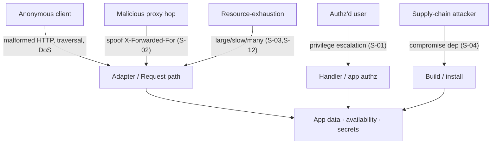
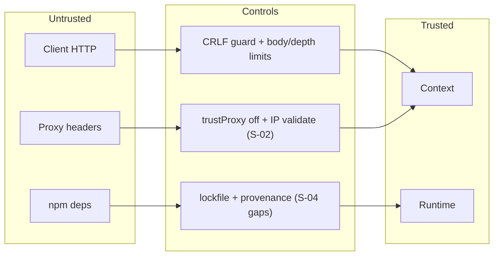
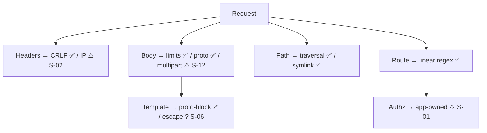
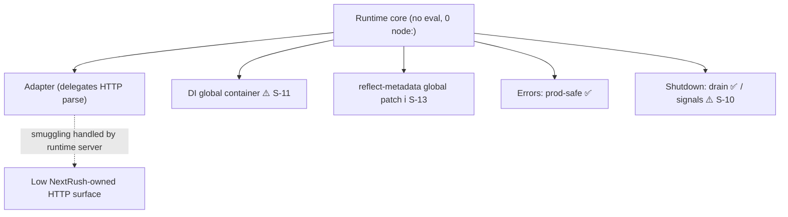
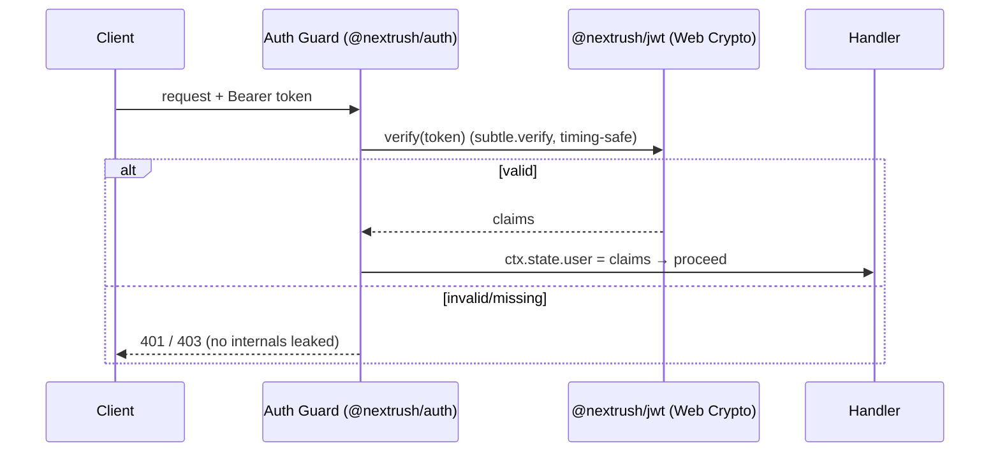
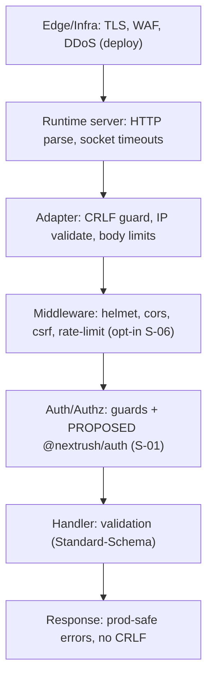
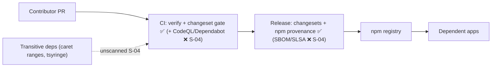

# NextRush — Independent Security Review

> **Reviewer stance:** Adversarial. Code is assumed insecure until proven otherwise; developer intent is not trusted; every claim is validated against the repository.
> **Context (not repeated):** `01-production-readiness-audit.md`, `02-production-roadmap.md`, `03-gap-checklist.md`, `07-runtime-architecture.md`.
> **Evidence discipline:** findings cite the file that proves them. Unconfirmed items are marked **[UNVERIFIED]** and phrased as "recommend confirming," never asserted.
> **Finding IDs:** `S-##`. Full detail (Evidence · Risk · Impact · Exploitation · Severity · Likelihood · Priority · Recommendation · Effort · Validation) lives in *Prioritized Recommendations*; sections reference IDs.
> **Severity:** Critical / High / Medium / Low / Informational, with CVSS-style reasoning where useful.

---

# Executive Summary

**Headline:** NextRush's *own code is secure by construction* — it demonstrably defends against the classic framework vulnerabilities (path traversal, CRLF/header injection, prototype pollution, HTML-injection-via-redirect, weak cookie signing). What it lacks is **enterprise security *capability*** (authentication/authorization, audit logging, distributed rate limiting) and **supply-chain assurance in CI** (no Dependabot, CodeQL, SBOM, or disclosure policy). The distinction matters: these are gaps of *omission*, not exploitable defects in shipped code.

**What I verified is genuinely strong:**
- **Injection defenses:** `assertHeaderSafe` blocks CR/LF in header field+value on **both** the Node adapter (`adapters/node/src/context.ts:416`) and the Web adapters (`runtime/src/response-builder.ts:100`) — no response-splitting. Prototype pollution is blocked in body-parser (`isForbiddenKey` in `utils/url-decode.ts`), template rendering (`BLOCKED_PROPERTIES` in `template/src/helpers.ts`), and header records (`Object.create(null)` in `runtime/src/headers.ts`).
- **Path/file safety:** `static/src/utils.ts` `safeJoin` blocks `..` and verifies `startsWith(root + sep)`; `statSafe` rejects symlinks by default and `realpath`-validates them within root; dotfiles detectable; range parsing is bounded.
- **Cryptography:** cookie signing is HMAC-SHA256 via **Web Crypto** with timing-safe `crypto.subtle.verify`, key rotation, and a bounded key cache (`cookies/src/signing.ts`).
- **Safe defaults:** `trustProxy` defaults **off** (no blind `X-Forwarded-For` trust); CORS **throws** on the `credentials + origin:'*'` footgun at config time (`cors/src/middleware.ts:69`); production error responses hide stack/message; body size + JSON depth limits exist.

**What blocks enterprise production (the real risk):**
- **No built-in authentication/authorization/JWT/session** (S-01) — OWASP A01/A07 are left entirely to the application.
- **Rate limiting is in-memory only** (S-03) — per-process, defeated behind a load balancer.
- **`X-Forwarded-For` leftmost-trust with no trusted-hop count** (S-02) — spoofable when `trustProxy` is enabled behind multiple proxies.
- **No supply-chain scanning / disclosure policy in CI** (S-04, S-05) — no Dependabot, CodeQL, SBOM, or `SECURITY.md`; runtime deps on caret ranges; `tsyringe` is maintenance-mode.
- **No security audit-logging seam** (S-07) — OWASP A09; incident response has nothing to consume.

**Verdict:** *Safe to build on; not yet safe to certify.* Suitable for security-aware teams that supply their own auth/observability. **Not** enterprise-production-ready as-shipped for regulated workloads until S-01, S-03, S-04, S-07 close.

---

# Security Score

| Dimension | Score /10 | Basis |
|---|---|---|
| **Secure coding (framework's own code)** | **8.0** | Verified defenses against traversal, CRLF, proto-pollution, weak signing; prod error hygiene |
| **Secure defaults** | **7.5** | trustProxy off; CORS footgun blocked; body limits; helmet available — but not auto-applied |
| **Cryptography** | **8.5** | HMAC-SHA256 via Web Crypto, timing-safe verify, key rotation, edge-portable |
| **Attack-surface hygiene** | **7.5** | Small core, isolated Node coupling, immutable-after-boot, no eval/dynamic exec in hot path |
| **Enterprise security capability** | **5.0** | No authn/authz, audit logging, distributed rate-limit |
| **Supply-chain assurance** | **6.0** | Provenance + lockfile good; no Dependabot/CodeQL/SBOM; caret ranges; tsyringe risk |
| **Observability / incident support** | **4.5** | request-id + logger only; no security event log, no trace correlation |
| **Compliance readiness** | **4.5** | No audit trail, DPA hooks, or documented controls |
| **Overall security posture** | **≈ 6.8 / 10** | Secure code, incomplete security *platform* |

**Interpretation:** the *lower* scores are all **capability gaps**, not vulnerabilities. There is no Critical or High finding that is an exploitable defect in shipped code; the High finding (S-01) is a missing protection.

---

# Threat Model

**Assumptions (per brief):** attackers have full internet access, know the framework and its source, and target application, server, infrastructure, data, availability, integrity, and confidentiality.

## Actors & goals

| Actor | Capability | Goal |
|---|---|---|
| Anonymous internet client | Send arbitrary HTTP; craft headers/bodies/paths | Traversal, injection, DoS, access-control bypass |
| Malicious proxy / MITM hop | Inject `X-Forwarded-For`/`X-Real-IP` | IP spoofing → rate-limit/allowlist bypass (S-02) |
| Authenticated-but-unauthorized user | Valid session, escalate | Broken access control (app-owned; framework gives only the guard seam) — S-01 |
| Supply-chain attacker | Compromise a dependency / typosquat | RCE via transitive dep (S-04) |
| Insider / compromised CI | Push to main, publish | Malicious release (mitigated by provenance; gaps in S-04/S-05) |
| Resource-exhaustion attacker | Slow/large/nested requests | Memory/CPU/connection exhaustion (S-03, S-08) |

## Assets

Application data & integrity · user credentials/sessions (app-owned) · server availability · the npm supply chain (a compromised `nextrush` release poisons every dependent) · secrets in env/config.

## In scope / out of scope

- **In scope:** the framework's request path, adapters, middleware defaults, crypto, dependency posture, CI/release.
- **Out of scope (app responsibility, but the framework must *enable* security):** business-logic authz decisions, the app's own SQL/ORM usage, secret storage backend. The framework is judged on whether it gives apps the *tools and safe defaults* to get these right — where it does not (auth, audit log), that is a finding.

---

# Trust Boundaries

Every arrow crossing a boundary is an attack surface. See *Mermaid Diagrams → Trust Boundaries*.

| Boundary | Untrusted side | Trusted side | Control at the boundary | Status |
|---|---|---|---|---|
| **Client → Adapter** | raw HTTP (headers, body, path, method) | `Context` | CRLF guard, body limits, path safety, IP validation | ✅ enforced |
| **Proxy → Adapter (IP)** | `X-Forwarded-For`/`X-Real-IP`/`cf-connecting-ip` | `ctx.ip` | `trustProxy` gate (default off) + format validation; **no trusted-hop count** | ⚠️ S-02 |
| **Request body → Parser** | JSON/urlencoded/multipart | `ctx.body` | size limit, JSON depth limit, `isForbiddenKey` (proto-pollution) | ✅ enforced |
| **Filesystem → Static** | URL path | file bytes | `safeJoin` (traversal), `statSafe` (symlink) | ✅ enforced |
| **Middleware → Handler** | `ctx.state` (set by upstream) | handler logic | app-owned; no framework authz | ⚠️ S-01 (no built-in authz) |
| **Error → Response** | thrown internals | client | prod hides stack/message; `expose` opt-in | ✅ enforced |
| **Dependencies → Runtime** | npm packages (transitive) | executing code | lockfile + provenance; **no scanning** | ⚠️ S-04 |
| **Config/env → Runtime** | env vars, files | frozen config | validation planned, not shipped | ⚠️ [PROPOSED T035] |

**Key observation:** the *client→adapter* and *filesystem→static* boundaries — the two most attacked in HTTP frameworks — are the best-defended here. The weak boundaries are *proxy→IP* (S-02), *middleware→authz* (S-01, by omission), and *dependencies→runtime* (S-04).

---

# Attack Surface

Ranked by exposure. See *Mermaid Diagrams → Request/Runtime Attack Surface*.

| Surface | Exposure | Primary risks | Defense status |
|---|---|---|---|
| **HTTP request parsing** (adapter) | Internet-facing, every request | smuggling, CRLF, oversized/slow bodies | CRLF ✅; smuggling delegated to the runtime's HTTP server (Node/Bun/Deno/platform) — **NextRush does not parse raw HTTP itself**, reducing its smuggling surface |
| **Header/IP handling** | every request | injection ✅, IP spoofing ⚠️ (S-02) | mixed |
| **Body parsing** | POST/PUT/PATCH | proto-pollution ✅, DoS via size/depth ✅, multipart limits [UNVERIFIED S-12] | mostly ✅ |
| **Static files** | if `@nextrush/static` used | traversal ✅, symlink ✅, TOCTOU ⚠️ (S-08 low) | ✅ |
| **Template rendering** | if `@nextrush/template` used | SSTI / proto access ✅ (`BLOCKED_PROPERTIES`) | ✅ |
| **Routing** | every request | ReDoS (router regex `/\/+/g` linear — safe) | ✅ |
| **Cookies/sessions** | if used | forgery ✅ (HMAC-SHA256), session mgmt ⚠️ (no built-in session S-01) | mixed |
| **DI / reflection** | boot + request | metadata forgery (needs in-process code — low); global `Reflect` mutation (class path) | Low/Informational |
| **Compression** | if `@nextrush/compression` used | BREACH/CRIME if secrets reflected + compressed | Low/Informational S-09 |
| **Supply chain** | build/install | malicious/vulnerable dep | ⚠️ S-04 |
| **CI/CD & release** | maintainers | malicious publish | provenance ✅; scanning gaps ⚠️ S-04/S-05 |

**Surface-reduction wins (verified):** NextRush does **not** implement its own HTTP/1 parser, chunked-encoding decoder, or multipart boundary scanner at the socket level — it rides the runtime's server (`node:http`, `Bun.serve`, `Deno.serve`, platform fetch). This materially shrinks its exposure to **request smuggling / desync / chunked-encoding** classes: those are the runtime's responsibility, and NextRush inherits the runtime's (well-tested) parser. This is a genuine architectural security advantage of the "runtime is an adapter" model.

---

# Runtime Security

| Component | Finding | Evidence | Status |
|---|---|---|---|
| **Runtime/core** | No `eval`/`Function()`/dynamic code exec; core imports no runtime API | 0 `node:` in core (audit 01/§6) | ✅ |
| **Context** | Immutable request identity; `ctx` never escapes the request; `state` is per-request | `types/src/context.ts` | ✅ |
| **Request** | Read-only accessors; body not read until a parser opts in | `runtime/src/body-source.ts` | ✅ |
| **Response** | Write-once (double-response detected); CRLF-guarded `set`; 1xx rejected; redirect body `text/plain` | `runtime/src/response-builder.ts` | ✅ |
| **Router** | Segment trie; no user-input regex on hot path; `/\/+/g` is linear (no ReDoS) | `router/src/router.ts` | ✅ |
| **Middleware** | `next()`-called-twice rejected; sync throw → rejection (no swallowed errors) | `core/src/middleware.ts` | ✅ |
| **Plugin/Extension** | Fail-fast `setup()`; `destroy()` isolated via `allSettled`; decorate collision throws | `core/src/application.ts` | ✅ |
| **Dependency Injection** | Global container default → cross-app service visibility in-process | RFC-DI-OWNERSHIP; opt-in isolation only | ⚠️ S-11 (isolation) |
| **Decorators / Reflection** | Legacy dialect + `reflect-metadata` global `Reflect` patch (class path only); metadata keys via global `Symbol.for` registry (forgeable only with in-process code) | `nextrush/class` | ℹ️ Informational |
| **Serialization** | `JSON.stringify` for responses; `JSON.parse` at body boundary is guarded (limits + proto) | body-parser | ✅ |
| **Streaming** | Web Streams; `writer.signal` observes disconnect; backpressure native | `@nextrush/stream` | ✅ |
| **Error handling** | Prod hides internals; default handler cannot crash the request | `errors/src/middleware.ts`, `core/src/application.ts` | ✅ |
| **Shutdown** | Graceful drain exists; **signals not auto-wired** (manual) | `adapter-node/src/adapter.ts` | ⚠️ S-10 (availability) |

**Runtime-specific (edge/serverless/Bun/Deno/WinterCG):**
- **Capability detection** is passive and cached; no privileged API is probed by executing it. ✅
- **Edge/Serverless:** no filesystem/secrets-on-disk assumptions in the core; secrets come from platform env. The `reflect-metadata` global mutation on cold isolates is Informational (S-13).
- **Global/shared state:** only cached runtime detection (idempotent) and the DI container (S-11). No other module-level mutable request state. ✅
- **Secrets/env:** core forbids reading `process.env`; config-layer secret redaction is [PROPOSED T035]. Today, secret handling is app-owned.

---

# HTTP Security

The single most important fact: **NextRush delegates raw HTTP parsing to the runtime's server** (`node:http`, `Bun.serve`, `Deno.serve`, platform fetch). It does not implement its own HTTP/1 line parser, chunked-encoding decoder, or content-length reconciler. This removes NextRush as the *source* of most HTTP-layer attacks and inherits the runtime's hardened parser.

| Vector | Assessment | Evidence / reasoning |
|---|---|---|
| **HTTP parsing** | Delegated to runtime; NextRush surface minimal | adapters bridge `IncomingMessage`/`Request`, don't parse bytes |
| **Header validation** | CRLF/injection blocked on write (`assertHeaderSafe`, both adapters); read headers normalized to null-proto record | `response-builder.ts:100`, `node/context.ts:418`, `headers.ts` |
| **Host header** | Not independently validated by NextRush; **recommend a host-allowlist option** for host-header attacks / cache poisoning | [UNVERIFIED default] → S-06-adjacent |
| **Trusted proxy** | `trustProxy` default **off**; when on, XFF/XRI/CF validated by format — **but leftmost XFF, no hop count** | `headers.ts` `resolveClientIp` → **S-02** |
| **Reverse proxy** | Supported via `trustProxy`; docs must state the multi-proxy hop-count caveat | S-02 |
| **Content-Length / chunked / smuggling / desync** | Delegated to runtime server; NextRush adds no reconciliation logic → low NextRush-owned surface | architectural (see Attack Surface) |
| **Response splitting / CRLF injection** | Blocked at the boundary (both adapters) | ✅ |
| **Header injection** | Blocked (`assertHeaderSafe`) | ✅ |
| **HTTP method validation** | Router matches known methods; `@All` expands (functional correctness, not a security issue) | ✅ |
| **Content negotiation** | App-owned; no framework-level Accept parsing vuln | n/a |

**Net:** HTTP-layer security is **strong**, primarily because NextRush's architecture keeps it out of the byte-parsing business. The one owned weakness is IP provenance (S-02). A host-header allowlist option is a recommended hardening (S-06-adjacent, Low).

---

# Request Security

| Concern | Assessment | Evidence | Finding |
|---|---|---|---|
| **Request body** | Size limit (`DEFAULT_BODY_LIMIT`) + JSON depth limit + proto-pollution key block | `runtime/body-source.ts`, `body-parser` `json-depth-default.test.ts`, `isForbiddenKey` | ✅ |
| **Multipart uploads** | Streaming parser; **default file-count/size limits [UNVERIFIED]** — recommend confirming + documenting hard caps | `@nextrush/multipart` | ⚠️ S-12 (Medium) |
| **Cookies** | Signed via HMAC-SHA256 (Web Crypto), timing-safe verify, key rotation, secure serialization + dedicated `security.test.ts` | `cookies/src/signing.ts` | ✅ |
| **Sessions** | **Not provided** — no session store/rotation/fixation defense built in | absent | ⚠️ S-01 |
| **Authentication** | **Not provided** — guard *seam* only | absent | ⚠️ S-01 (High) |
| **Authorization** | Guard/`CanActivate` mechanism exists (class); **no policy/RBAC**; decisions app-owned | `class/src/guards` | ⚠️ S-01 |
| **CSRF** | `@nextrush/csrf` present with tests | `middleware/csrf` | ✅ (verify default token strategy) |
| **CORS** | Present; **blocks `credentials + origin:'*'` at config time**; dedicated `security.ts` | `cors/src/middleware.ts:69`, `cors/src/security.ts` | ✅ / default origin [UNVERIFIED] S-06 |
| **JWT** | **Not provided** — edge-portable JWT is [PROPOSED T030] | absent | ⚠️ S-01 |
| **Validation** | Standard-Schema (Zod/Valibot/ArkType) with `security.test.ts` | `middleware/validation` | ✅ |
| **File uploads** | See multipart (S-12); disk storage is Node-only | `multipart/storage/disk.ts` | ⚠️ S-12 |
| **Static files** | Traversal + symlink + dotfile + bounded range defenses | `static/src/utils.ts` | ✅ |
| **Template rendering** | Prototype/dangerous-property access blocked (`BLOCKED_PROPERTIES`); auto-escaping [recommend confirming default HTML-escape] | `template/src/helpers.ts` | ✅ / S-06-adjacent |
| **Serialization** | JSON only; no unsafe deserialization (no `node-serialize`/YAML-load of untrusted input in core) | — | ✅ |

**Request-security summary:** the *mechanisms that exist* are implemented correctly (cookies, CSRF, CORS, validation, static, template). The risk is the *mechanisms that don't* (auth/session/JWT — S-01) and two defaults to confirm (CORS zero-config origin, template auto-escape — S-06; multipart caps — S-12).

---

# Dependency Security

| Item | Finding | Evidence |
|---|---|---|
| **Runtime dependencies (core)** | Functional core is dependency-free; class/DI path pulls `reflect-metadata ^0.2.2` + `tsyringe ^4.10.0` | `@nextrush/di` `package.json` |
| **Version ranges** | **Caret ranges** on runtime deps + all devDeps (`typescript ^6`, `@types/node ^25`, `eslint ^10`, `vitest ^4`) | `package.json` files |
| **Lockfile** | `pnpm-lock.yaml` present (458 KB) — pins the resolved transitive tree | repo root |
| **Transitive deps** | Minimal for core; tsyringe is the notable transitive-surface driver on the class path | lockfile |
| **Deprecated/maintenance-risk** | **`tsyringe` is low-activity**, and NextRush pokes its internals (audit 01/R-2) — a break/abandonment is a framework-level incident | `di/src/container.ts` |
| **Known CVEs** | Not scanned in CI (no automated advisory check) | no Dependabot/audit step in `ci.yml` |
| **Maintainer risk** | Single maintainer across ~35 packages (bus-factor) | `package.json` author |
| **License** | MIT throughout; no incompatible copyleft observed | package manifests |

**Findings:** S-04 (no CI dependency scanning + caret ranges), and the strategic dependency of the DI path on maintenance-mode `tsyringe` (tracked to be replaced, `03` T050).

**Positive:** the *functional* path has **zero** runtime dependencies — the smallest possible dependency attack surface for the most common deployment. Caret ranges are a dev-time exposure (lockfile pins actual installs), but they weaken reproducibility and let a compromised patch release in on `pnpm update`.

---

# Supply Chain

| Control | Status | Evidence |
|---|---|---|
| **npm provenance** | ✅ Present | `release.yml`: `changeset publish --provenance` |
| **Lockfile-pinned installs** | ✅ | `pnpm-lock.yaml` + `setup-toolchain` action |
| **Changeset release gate** | ✅ | PR changeset guard in `ci.yml` |
| **CI least-privilege** | ✅ (mostly) | `ci.yml` `permissions: contents: read`; `release.yml` scoped tokens |
| **Dependabot / Renovate** | ❌ **Absent** | no `.github/dependabot.yml` |
| **CodeQL / SAST** | ❌ **Absent** | no CodeQL workflow |
| **SBOM (CycloneDX/SPDX)** | ❌ **Absent** | not generated on release |
| **SLSA attestation** | ⚠️ Partial | npm provenance ≈ SLSA-adjacent build provenance; no full SLSA level claimed |
| **Release signing (sigstore)** | ⚠️ Provenance only | no additional artifact signature |
| **`SECURITY.md` / disclosure policy** | ❌ **Absent** | not in repo root or `.github/` |
| **Branch protection** | [UNVERIFIED] | GitHub setting, not visible in repo |

**Findings:** S-04 (Dependabot + CodeQL + SBOM), S-05 (`SECURITY.md`/disclosure policy). The **provenance + lockfile + changeset-gated release** baseline is above average for a project this size — the gaps are automated scanning and a disclosure path, both cheap to add.

---

# Cryptography Review

| Primitive | Implementation | Assessment |
|---|---|---|
| **Randomness** | Web Crypto / `crypto.randomUUID` for request IDs; no `Math.random` for security tokens observed | ✅ (verify no `Math.random` in any token path — S-06-adjacent) |
| **Secure hashing** | HMAC-SHA256 for cookie signing; FNV-1a for ETags (non-security, correct choice) | ✅ |
| **Password storage** | **N/A** — no auth, so no password hashing shipped (would need argon2/scrypt when S-01 lands) | ⚠️ S-01 dependency |
| **Secret generation** | App-owned today; JWT/secret helpers are [PROPOSED T030] | ⚠️ S-01 |
| **Token generation** | Cookie signatures via `crypto.subtle.sign`; base64url encoded | ✅ |
| **JWT handling** | **Absent** — recommend Web-Crypto HS/RS/ES + rotation (T030) | ⚠️ S-01 |
| **Cookie signing** | HMAC-SHA256, `crypto.subtle.verify` (timing-safe), key rotation, bounded key cache | ✅ **Strong** |
| **Crypto API choice** | **Web Crypto (`crypto.subtle`)** — edge-portable, avoids `node:crypto` coupling | ✅ Excellent for the runtime story |
| **Timing attacks** | Signature verify uses `subtle.verify` (constant-time); `timingSafeEqual` fallback folds length + compares full length | ✅ |

**Assessment:** cryptography is a **strength**. The decision to use Web Crypto (not `node:crypto`) is exactly right for an edge-first framework and means the eventual JWT/auth layer can be edge-portable too. No weak primitive (MD5/SHA1-for-security, `Math.random`-for-tokens, ECB) was found in the reviewed crypto paths. **[UNVERIFIED]** recommend a repo-wide grep confirming no `Math.random` feeds any security token or ID.

---

# Secure Defaults

*Is NextRush secure by default? Mostly — with one important nuance: security middleware is opt-in, so a bare app is not hardened until the developer adds it.*

| Control | Default | Verdict |
|---|---|---|
| **CSP** | Available via `@nextrush/helmet` (`csp.ts`, nonce support); **not auto-applied** | ⚠️ opt-in |
| **HSTS** | Available via helmet presets/constants; **not auto-applied** | ⚠️ opt-in |
| **Helmet (all headers)** | Full impl (CSP/HSTS/nonce/permissions-policy/validation); **install + `app.use(helmet())` required** | ⚠️ opt-in |
| **Secure cookies** | Signing available; secure/httpOnly/sameSite flags supported | ✅ when used |
| **SameSite** | Supported in serializer; recommend `Lax`+ default | ✅/verify default S-06 |
| **Trusted proxy** | **Off by default** — no blind `X-Forwarded-For` trust | ✅ (safe default) |
| **Default headers** | `@nextrush/static` sets `X-Content-Type-Options: nosniff`; core sends none unprompted | partial |
| **Compression safety** | No built-in BREACH/CRIME mitigation (don't compress secret-bearing responses) | ⚠️ S-09 (Low) |
| **Body limits** | `DEFAULT_BODY_LIMIT` enforced | ✅ |
| **Timeout defaults** | `DEFAULT_TIMEOUT_MS = 30_000`, `keepAliveTimeout = 5_000`, `shutdownTimeout = 30_000` | ✅ |
| **Rate limiting** | Available; **in-memory only** (per-process) | ⚠️ S-03 |
| **Error leakage** | Prod hides stack/message by default | ✅ |

**The nuance that matters:** NextRush is **secure-by-default in its *primitives*** (safe error handling, safe proxy default, body/timeout limits, CRLF/traversal/proto defenses always on) but **opt-in for *policy* middleware** (helmet, CORS, CSRF, rate-limit). A developer who ships `createApp()` with routes and nothing else gets a server that won't leak stack traces or allow traversal, but **has no CSP/HSTS/security headers**. This is the Express/Fastify model (headers are opt-in) — defensible, but the docs MUST prominently prescribe a secure baseline stack, and a `create-nextrush` "secure preset" (helmet+cors+rate-limit pre-wired) would materially improve real-world posture (S-06 recommendation).

---

# Enterprise Security

## OWASP Top 10 (2021) coverage

| Category | NextRush posture | Finding |
|---|---|---|
| **A01 Broken Access Control** | Guard/`CanActivate` seam only; no built-in authz/RBAC/policy | ⚠️ S-01 (High) |
| **A02 Cryptographic Failures** | Strong crypto primitives (HMAC-SHA256/Web Crypto); prod error hygiene | ✅ |
| **A03 Injection** | CRLF/header ✅, proto-pollution ✅, template proto-access ✅, SQL/command **N/A** (no DB/shell layer — app-owned; framework never builds queries/shell from input) | ✅ (framework surface) |
| **A04 Insecure Design** | Immutable-after-boot, fail-fast boot, capability negotiation, small surface | ✅ (good design) |
| **A05 Security Misconfiguration** | Safe error/proxy defaults; **but security headers opt-in** | ⚠️ S-06 |
| **A06 Vulnerable & Outdated Components** | Lockfile + provenance; **no automated scanning**; tsyringe risk | ⚠️ S-04 |
| **A07 Identification & Auth Failures** | **No built-in auth/session/JWT** | ⚠️ S-01 (High) |
| **A08 Software & Data Integrity Failures** | npm provenance ✅; no SBOM/SLSA/signing beyond provenance | ⚠️ S-04 |
| **A09 Security Logging & Monitoring Failures** | request-id + logger; **no security event log / audit trail / trace correlation** | ⚠️ S-07 (Medium) |
| **A10 SSRF** | Framework makes no outbound requests from user input; SSRF is app-owned. No `fetch(userUrl)` in core | ✅ (framework surface) |

## Attack-vector coverage (verified)

| Vector | Status | Evidence |
|---|---|---|
| Prototype Pollution | ✅ Blocked | `isForbiddenKey` (body-parser), `BLOCKED_PROPERTIES` (template), `Object.create(null)` (headers) |
| Path / Directory Traversal | ✅ Blocked | `safeJoin` (`static/utils.ts`) |
| Symlink attacks | ✅ Blocked | `statSafe` `lstat` + `realpath`-within-root |
| File disclosure / dotfiles | ✅ | `isDotfile`, root-confinement |
| CRLF / Response Splitting / Header Injection | ✅ Blocked | `assertHeaderSafe` (both adapters) |
| ReDoS | ✅ Low risk | router regex linear; IP regex bounded |
| Billion Laughs / XML / Zip bombs | ✅ N/A | no XML/entity parser; no archive extraction in core |
| Deserialization | ✅ Safe | JSON-only; no unsafe deserializer |
| Buffer/Memory/CPU exhaustion | ⚠️ Partial | body/depth/timeout limits ✅; multipart caps [UNVERIFIED S-12]; rate-limit per-process S-03 |
| Slowloris / Slow requests | ⚠️ Delegated | socket timeouts set (`server.timeout`); slow-header defense is the runtime server's |
| DoS (volumetric) | ⚠️ | rate-limit in-memory only (S-03); needs infra + distributed store |
| Command / SQL Injection | ✅ N/A | framework builds no shell/SQL from input |
| XSS / Template Injection | ✅ | template blocks proto access; redirect `text/plain`; app owns output encoding |
| Timing attacks | ✅ | `subtle.verify` for signatures |
| Cache Poisoning | ⚠️ | recommend host-header allowlist (S-06-adjacent) |
| Request Replay | ⚠️ App-owned | no built-in nonce/idempotency (expected; note for auth layer) |
| TOCTOU / Race | ⚠️ Low | static stat→open window mitigated by symlink+size checks (S-08) |

## Compliance readiness

| Framework | Readiness | Gap |
|---|---|---|
| **SOC 2** | ⚠️ Low | No audit logging (S-07), no documented controls |
| **ISO 27001** | ⚠️ Low | No security policy/`SECURITY.md` (S-05), no logging |
| **PCI DSS** | ⚠️ Low | No audit trail, no built-in auth, rate-limit not distributed |
| **HIPAA** | ⚠️ Low | No audit logging, no encryption-at-rest guidance, no access logs |
| **GDPR** | ⚠️ Partial | Secrets not logged (good); no data-subject/audit hooks, no PII-redaction logging contract |
| **Auditability** | ⚠️ Low | request-id exists; no security event log |

**Enterprise verdict:** NextRush is **not compliance-ready** today — the blocker is uniformly the absence of an **audit-logging/security-event seam (S-07)** and **built-in identity (S-01)**, not any insecure behavior. Both are on the roadmap (`03` T025–T031). A regulated deployment today would require the team to build auth + audit logging on top.

---

# Risk Matrix

| ID | Finding | Severity | Likelihood | CVSS-style reasoning | Priority |
|---|---|---|---|---|---|
| **S-01** | No built-in authn/authz/JWT/session | **High** | High | Not a defect but a missing control; every app reinvents access control → high aggregate risk of A01/A07 in the wild. No CVSS (design gap). | **P0** |
| **S-02** | `X-Forwarded-For` leftmost-trust, no hop count | **Medium** | Medium | AV:N/AC:L/PR:N — spoof `ctx.ip` when `trustProxy` on behind >1 proxy → bypass IP rate-limit/allowlist. Gated by opt-in. ~5.3 | **P1** |
| **S-03** | Rate-limit in-memory only | **Medium** | High | AV:N/AC:L — per-process limits defeated behind LB → brute-force/DoS. ~5.9 | **P1** |
| **S-04** | No CI dep-scan/SAST/SBOM + caret ranges + tsyringe | **Medium** | Medium | Supply-chain: unscanned CVEs + maintenance-mode dep → potential transitive RCE over time. ~6.1 | **P1** |
| **S-05** | No `SECURITY.md` / disclosure policy | **Medium** | High | No coordinated path → public 0-day disclosure risk; enterprise/OSS blocker. | **P1** |
| **S-06** | Security headers opt-in; CORS/template/cookie/host defaults to confirm | **Medium** | Medium | Bare app lacks CSP/HSTS; misconfig risk (A05). | **P1** |
| **S-07** | No security audit-logging/event seam | **Medium** | High | A09 — no incident-response signal; compliance blocker. | **P1** |
| **S-08** | Static stat→open TOCTOU residual | **Low** | Low | AC:H race, mitigated by symlink+size checks. ~3.1 | **P2** |
| **S-09** | No BREACH/CRIME guidance for compression | **Low** | Low | Requires secret reflected + compressed + attacker-observed; app-conditional. | **P2** |
| **S-10** | Graceful shutdown not signal-wired | **Medium** | High | Availability: SIGTERM mid-request → dropped requests/502 on every deploy. | **P1** |
| **S-11** | DI global container default | **Medium** | Medium | In-process cross-app service visibility/replacement; multi-tenant/warm-reuse risk. | **P2** |
| **S-12** | Multipart default caps unverified/undocumented | **Medium** | Medium | AV:N/AC:L — unbounded uploads → memory/disk exhaustion if caps weak. ~5.3 | **P1** |
| **S-13** | `reflect-metadata` global `Reflect` mutation (class path) | **Informational** | — | Global state on shared isolates; not exploitable alone. | **P3** |

**No Critical findings.** The one High (S-01) is a missing capability, not an exploitable bug. The Mediums cluster around **availability** (S-03, S-10, S-12), **provenance/IP trust** (S-02, S-04), and **enterprise gaps** (S-05, S-06, S-07, S-11).

---

# Package Security Scores

Score /10 (higher = safer as-shipped). Risk = residual risk to an app using it. Priority = hardening priority.

| Package | Score | Risk | Attack surface | Priority | Note |
|---|---|---|---|---|---|
| `@nextrush/core` | 9.0 | Low | internal | P3 | Safe compose/error handling; no dynamic exec |
| `@nextrush/router` | 9.0 | Low | request | P3 | Linear regex; no ReDoS |
| `@nextrush/runtime` | 8.5 | Low | request (IP) | P1 | IP-trust hop-count gap (S-02) |
| `@nextrush/errors` | 9.0 | Low | response | P3 | Prod leak prevention |
| `@nextrush/adapter-node` | 8.5 | Low | HTTP boundary | P2 | CRLF-guarded; delegates parsing |
| `@nextrush/adapter-edge/bun/deno` | 8.0 | Low | HTTP boundary | P2 | Web-standard; timeout→504 |
| `@nextrush/di` | 6.5 | Medium | boot | P2 | Global container default (S-11); tsyringe (S-04) |
| `@nextrush/class` | 7.5 | Low-Med | reflection | P2 | Legacy dialect; global `Reflect` (S-13) |
| `@nextrush/body-parser` | 8.5 | Low | request body | P1 | Proto ✅, depth ✅ |
| `@nextrush/multipart` | 6.5 | Medium | uploads | **P1** | Caps unverified (S-12); disk = Node-only |
| `@nextrush/cookies` | 9.0 | Low | crypto | P3 | HMAC-SHA256/Web Crypto ✅ |
| `@nextrush/csrf` | 8.0 | Low | request | P2 | Present; confirm default token strategy |
| `@nextrush/cors` | 8.0 | Low | request | P1 | Config-guard ✅; confirm default origin (S-06) |
| `@nextrush/helmet` | 8.5 | Low | headers | P3 | Full CSP/HSTS/nonce; opt-in (S-06) |
| `@nextrush/rate-limit` | 6.0 | Medium | DoS | **P1** | In-memory only (S-03) |
| `@nextrush/static` | 8.0 | Low-Med | filesystem | P2 | Traversal/symlink ✅; TOCTOU (S-08) |
| `@nextrush/template` | 7.5 | Low-Med | SSTI | P2 | Proto blocked; confirm auto-escape (S-06) |
| `@nextrush/validation` | 8.5 | Low | request | P3 | Standard-Schema + security tests |
| `@nextrush/compression` | 7.0 | Low-Med | side-channel | P2 | BREACH/CRIME guidance (S-09) |
| `@nextrush/logger` | 7.0 | Low-Med | data exposure | P2 | Secret-redaction is app discipline (S-07) |
| `@nextrush/request-id` | 8.5 | Low | — | P3 | Correlation primitive |
| `@nextrush/stream` | 8.0 | Low | streaming | P3 | Web Streams; disconnect-aware |
| `@nextrush/events` / `websocket` | 7.5 | Low | — | P3 | WS is Node-only (edge gap, not security) |
| `@nextrush/dev` / `create-nextrush` | 7.0 | Low-Med | build-time | P2 | Prior destructive-clean/Windows issues fixed (audit history); no runtime surface |

**Lowest-scoring, hardening first:** `rate-limit` (6.0, S-03), `di` (6.5, S-11), `multipart` (6.5, S-12). None is an exploitable defect; all are capability/robustness gaps.

---

# Prioritized Recommendations

*Canonical finding registry. Each: Evidence · Risk · Impact · Exploitation · Severity · Likelihood · Priority · Recommendation · Effort · Validation.*

### S-01 — No built-in authentication / authorization / JWT / session
- **Evidence:** No `@nextrush/auth|jwt|session` packages exist (inventory); only a guard/`CanActivate` seam in `@nextrush/class/src/guards`.
- **Risk:** A01 Broken Access Control + A07 Auth Failures across the ecosystem.
- **Impact:** Every app hand-rolls auth → inconsistent, frequently-vulnerable implementations; no secure default path.
- **Exploitation:** An app forgets an authz check on a route because the framework offers no policy/RBAC scaffold → unauthorized data access.
- **Severity:** High · **Likelihood:** High · **Priority:** P0
- **Recommendation:** Ship `@nextrush/jwt` (Web-Crypto, edge-portable) → `@nextrush/auth` (strategy + guard integration, secure defaults, constant-time compare, no secret logging) → `@nextrush/session` (signed-cookie + pluggable store). (`03` T029/T030/T031.)
- **Effort:** L (auth) + M (jwt/session). **Validation:** protected route returns 401/403 correctly; JWT verify on Node + workerd; session fixation test (rotate ID on privilege change).

### S-02 — `X-Forwarded-For` leftmost-trust without trusted-hop count
- **Evidence:** `runtime/src/headers.ts` `resolveClientIp` returns `isValidClientIp(forwarded.split(',')[0])` — the leftmost XFF entry.
- **Risk:** Client-controlled leftmost XFF is spoofable when `trustProxy` is enabled behind >1 proxy.
- **Impact:** Bypass IP-based rate limiting, allow/deny lists, or geo logic; poison IP audit logs.
- **Exploitation:** Attacker sends `X-Forwarded-For: 1.2.3.4, <real>`; if the app enables `trustProxy` behind two proxies, NextRush trusts `1.2.3.4`.
- **Severity:** Medium (CVSS ~5.3) · **Likelihood:** Medium (requires opt-in `trustProxy`) · **Priority:** P1
- **Recommendation:** Add a configurable **trusted-proxy hop count / trusted CIDR list**; resolve the client IP as the rightmost untrusted entry (like Express `trust proxy` numeric / Fastify `trustProxy`). Document the multi-proxy caveat loudly until then.
- **Effort:** S. **Validation:** with `hops=1`, a spoofed leftmost XFF is ignored; rightmost-untrusted is selected.

### S-03 — Rate limiting is in-memory (per-process) only
- **Evidence:** `@nextrush/rate-limit` has no external store; `03` T041 tracks a distributed store.
- **Risk:** Limits reset per instance; ineffective behind a load balancer/autoscaler.
- **Impact:** Brute-force + volumetric DoS protection is illusory at scale.
- **Exploitation:** Attacker spreads requests across N instances → each sees `total/N`, no limit trips.
- **Severity:** Medium (~5.9) · **Likelihood:** High (any multi-instance deploy) · **Priority:** P1
- **Recommendation:** Add a pluggable store + Redis/KV driver (`03` T039/T040/T041). Document that in-memory is single-instance only.
- **Effort:** M. **Validation:** two instances + shared store enforce the combined limit (integration test).

### S-04 — No CI dependency scanning / SAST / SBOM; caret ranges; tsyringe risk
- **Evidence:** `.github/` has no `dependabot.yml`, no CodeQL workflow; `release.yml` has no SBOM step; `@nextrush/di` deps use `^`; `tsyringe` is low-activity.
- **Risk:** A06/A08 — a vulnerable/compromised (transitive) dependency ships undetected; a `tsyringe` break is a framework-level incident.
- **Impact:** Supply-chain compromise reaches every dependent of `nextrush`.
- **Exploitation:** A CVE in a transitive dep, or a malicious patch release picked up via caret range on `pnpm update`, goes unflagged.
- **Severity:** Medium (~6.1) · **Likelihood:** Medium · **Priority:** P1
- **Recommendation:** Add Dependabot/Renovate + `pnpm audit` gate + CodeQL + CycloneDX SBOM on release; pin runtime deps (drop caret on `reflect-metadata`/`tsyringe`); execute `03` T050 (replace tsyringe).
- **Effort:** S (CI) + L (de-tsyringe). **Validation:** a seeded vulnerable dep fails CI; SBOM attached to a release.

### S-05 — No `SECURITY.md` / vulnerability disclosure policy
- **Evidence:** No `SECURITY.md` in repo root or `.github/`.
- **Risk:** No coordinated disclosure path → researchers go public.
- **Impact:** Zero-day dropped publicly; reputational + user harm; enterprise/OSS adoption blocker.
- **Exploitation:** N/A (process gap).
- **Severity:** Medium · **Likelihood:** High · **Priority:** P1
- **Recommendation:** Add `SECURITY.md` (contact, SLA, supported versions, PGP/security advisory process); enable GitHub private vulnerability reporting.
- **Effort:** XS. **Validation:** `SECURITY.md` present; private reporting enabled.

### S-06 — Security headers opt-in; confirm CORS/template/cookie/host defaults
- **Evidence:** helmet/cors/csrf are separate opt-in packages; bare `createApp()` sends no CSP/HSTS. CORS blocks `credentials+*` (`cors/middleware.ts:69`) but the **zero-config default origin** is [UNVERIFIED]; template auto-escape default [UNVERIFIED]; cookie `SameSite` default [UNVERIFIED].
- **Risk:** A05 Security Misconfiguration; a hardened baseline is not automatic.
- **Impact:** Un-hardened apps ship without security headers; a permissive CORS/cookie/template default (if any) is a latent hole.
- **Exploitation:** App deployed without helmet → clickjacking/MIME-sniffing/no-CSP XSS amplification.
- **Severity:** Medium · **Likelihood:** Medium · **Priority:** P1
- **Recommendation:** (a) Confirm defaults are safe (CORS default = no cross-origin unless configured; template auto-escapes; cookies `SameSite=Lax`, `HttpOnly`, `Secure` by default). (b) Ship a `create-nextrush` **secure preset** (helmet+cors+rate-limit+body-limit pre-wired) and a docs "secure baseline." 
- **Effort:** S. **Validation:** bare scaffolded app scores well on securityheaders.com; CORS default rejects unconfigured cross-origin.

### S-07 — No security audit-logging / event seam (A09)
- **Evidence:** Only `@nextrush/request-id` + pluggable `Logger`; no security-event contract; no trace correlation (`07` marks the hook bus + OTel [PROPOSED]).
- **Risk:** A09 Logging & Monitoring Failures — no signal for detection/forensics.
- **Impact:** Incidents undetectable; no audit trail for compliance.
- **Exploitation:** An attack (repeated 401s, traversal attempts) leaves no structured, correlatable trail.
- **Severity:** Medium · **Likelihood:** High · **Priority:** P1
- **Recommendation:** Implement the hook bus + `@nextrush/otel`/`metrics` (`03` T025–T028) with a **security-event stream** (auth failures, rate-limit trips, validation rejections) + correlation IDs.
- **Effort:** L. **Validation:** auth failure emits a structured, correlated security event consumable by a SIEM.

### S-08 — Static file TOCTOU residual
- **Evidence:** `static/src/utils.ts` `statSafe` (lstat/realpath) then `send-file.ts` opens the path; a window exists between stat and open.
- **Risk:** Race: path swapped to a symlink after the realpath check.
- **Impact:** Potential read outside root (low; needs local write + precise timing).
- **Exploitation:** Attacker with local write races a symlink swap between `statSafe` and `createReadStream`.
- **Severity:** Low (~3.1, AC:H) · **Likelihood:** Low · **Priority:** P2
- **Recommendation:** Open by file descriptor and `fstat` the fd (stat-on-open), or re-validate realpath after open for large files.
- **Effort:** S. **Validation:** symlink-swap race test cannot escape root.

### S-09 — No BREACH/CRIME guidance for compression
- **Evidence:** `@nextrush/compression` compresses responses with no built-in exclusion for secret-bearing, reflected content.
- **Risk:** BREACH/CRIME side-channel when a secret + attacker-controlled input share a compressed response.
- **Impact:** Token/secret extraction via compressed-length side channel (narrow conditions).
- **Exploitation:** Attacker measures compressed response size across guesses of a reflected secret.
- **Severity:** Low · **Likelihood:** Low · **Priority:** P2
- **Recommendation:** Document the risk; offer an option to skip compression for responses marked sensitive / containing `Set-Cookie` / CSRF tokens.
- **Effort:** S. **Validation:** sensitive responses bypass compression when flagged.

### S-10 — Graceful shutdown not signal-wired (availability)
- **Evidence:** `adapter-node/serve()` has drain logic but no `process.on('SIGTERM'|'SIGINT')`; wiring is manual.
- **Risk:** Availability/integrity: SIGTERM kills in-flight requests on deploy.
- **Impact:** Dropped requests / 502s on every rollout; partial writes.
- **Exploitation:** Not attacker-driven, but an availability defect (DoS-adjacent under frequent restarts).
- **Severity:** Medium · **Likelihood:** High · **Priority:** P1
- **Recommendation:** Opt-in `serve({ gracefulShutdown })` / `handleShutdown()` (`03` T010).
- **Effort:** S. **Validation:** SIGTERM during a slow request drains without dropping it.

### S-11 — DI global container by default (in-process isolation)
- **Evidence:** `@nextrush/di` registers on a shared container by default; per-app isolation is opt-in.
- **Risk:** One app/plugin in-process can read/replace another's service registrations.
- **Impact:** Multi-tenant / warm-serverless / embedded-multi-app isolation breach.
- **Exploitation:** A compromised or buggy plugin overwrites a shared service (e.g., an auth provider) used by another app in the same process.
- **Severity:** Medium · **Likelihood:** Medium · **Priority:** P2
- **Recommendation:** Make per-app isolation the default at the next major (`03` T033); enforce module encapsulation (T032).
- **Effort:** M (isolation) + L (encapsulation). **Validation:** two apps in one process cannot see each other's providers by default.

### S-12 — Multipart default caps unverified/undocumented
- **Evidence:** `@nextrush/multipart` is a streaming parser; default max file size / file count / field count limits are **[UNVERIFIED]**.
- **Risk:** Unbounded uploads → memory/disk exhaustion (DoS).
- **Impact:** A single request or a flood exhausts memory/disk.
- **Exploitation:** Attacker uploads a huge / many-part multipart body if caps are absent or high.
- **Severity:** Medium (~5.3) · **Likelihood:** Medium · **Priority:** P1
- **Recommendation:** Confirm + document hard defaults (max file size, file count, field count, total body); reject over-cap early while streaming; disk-storage path cleanup on abort.
- **Effort:** S. **Validation:** over-cap upload is rejected before buffering/writing the whole body.

### S-13 — `reflect-metadata` mutates global `Reflect` (class path)
- **Evidence:** `nextrush/class` does `import 'reflect-metadata'` (side-effect global patch).
- **Risk:** Global state on shared isolates (edge); Informational.
- **Impact:** Not exploitable alone; a consideration for isolate-shared environments.
- **Severity:** Informational · **Likelihood:** — · **Priority:** P3
- **Recommendation:** Keep the functional path reflection-free (already true); document the global mutation for edge users (`03` T023).
- **Effort:** XS. **Validation:** functional bundle contains no `reflect-metadata`.

---

# Security Roadmap

| Horizon | Items | Outcome |
|---|---|---|
| **Immediate (days)** | S-05 (`SECURITY.md` + private reporting) · S-04 CI half (Dependabot + `pnpm audit` + CodeQL) · S-06 confirm defaults + document secure baseline | Disclosure path + supply-chain visibility + honest defaults — cheap, high-value |
| **Short (Phase 1, ~1 mo)** | S-10 (signal shutdown) · S-02 (trusted-hop count) · S-12 (multipart caps) · S-03 start (rate-limit store interface) · secure `create-nextrush` preset | Availability + IP-trust + upload + DoS hardening |
| **Medium (Phase 3, ~1 quarter)** | S-01 (jwt → auth → session) · S-07 (audit-logging + OTel/metrics security events) · S-03 finish (Redis store) · S-11 (per-app isolation default) | Enterprise auth + observability + isolation |
| **Long (major)** | S-04 finish (replace tsyringe, pin deps, SBOM/SLSA) · S-08 (fd-based static) · S-09 (compression safety) · S-13 (edge reflection docs) | Supply-chain assurance + residual hardening |

**Sequencing note:** the Immediate tier is almost free and disproportionately improves posture and trust. S-01 and S-07 are the enterprise unlocks and depend on the `03` roadmap's identity + observability packages; do them in Phase 3, not before the Node/edge foundation is proven.

---

# Mermaid Diagrams

### Threat Model

### Trust Boundaries

### Request Attack Surface

### Runtime Attack Surface

### Authentication Flow **[PROPOSED — S-01 / `03` T029–T031]**

### Security Layers (defense in depth)

### Supply Chain

---

# Final Verdict

**Is NextRush safe for enterprise production? Not yet — but for an unusually specific and closable reason: the framework's *code* is secure; its security *platform* is incomplete.**

As a penetration tester, I could not find an exploitable defect in the shipped request path. The classic framework kill-chain — path traversal, symlink escape, CRLF/response-splitting, prototype pollution, weak cookie signing, HTML-injection-via-redirect, stack-trace leakage — is **closed and verified in source**. The architecture actively reduces attack surface by delegating raw HTTP parsing to the runtime (shrinking smuggling/desync exposure) and by keeping the core dependency-free and `eval`-free. Cryptography is done right (HMAC-SHA256 via Web Crypto, timing-safe verification, key rotation). Defaults are sober (trustProxy off, prod error hygiene, body/timeout limits, CORS footgun blocked at config time).

What stops an enterprise "yes" is a short list of **missing controls**, not vulnerabilities:

- **S-01 (High):** no built-in authentication/authorization/JWT/session — the framework hands you a guard seam and nothing to put in it.
- **S-07 (Medium):** no security audit-logging/event seam — nothing for detection, forensics, or compliance to consume.
- **S-03 / S-10 / S-12 (Medium):** availability gaps — per-process rate limiting, unwired shutdown signals, unconfirmed upload caps.
- **S-02 / S-04 / S-05 / S-06 (Medium):** IP-trust hop count, supply-chain scanning + disclosure policy, and a hardened secure-preset.

**Recommended posture:**
- **Today:** safe for security-aware teams that supply their own auth + audit logging + a hardened middleware baseline (helmet+cors+rate-limit) and run behind a WAF/TLS terminator with correct `trustProxy` config.
- **Not yet:** regulated/compliance workloads (SOC 2 / PCI / HIPAA), or teams expecting batteries-included identity + audit trails.
- **Distance to enterprise-secure:** the *Immediate* roadmap tier (SECURITY.md, Dependabot/CodeQL, confirm defaults, secure preset) is near-free and should land now; **S-01** and **S-07** are the two that convert "secure code" into "certifiable platform," and both are already on the `03` roadmap (T029–T031, T025–T028).

**Security posture: ≈ 6.8/10 — secure by construction, incomplete by capability. No Critical/High exploitable defects; the single High is a missing control, and every Medium is closable without touching the (sound) core.**

---

*End of security review. Findings S-01…S-13 are tracked; re-review after the Immediate + Phase-1 tiers land.*
