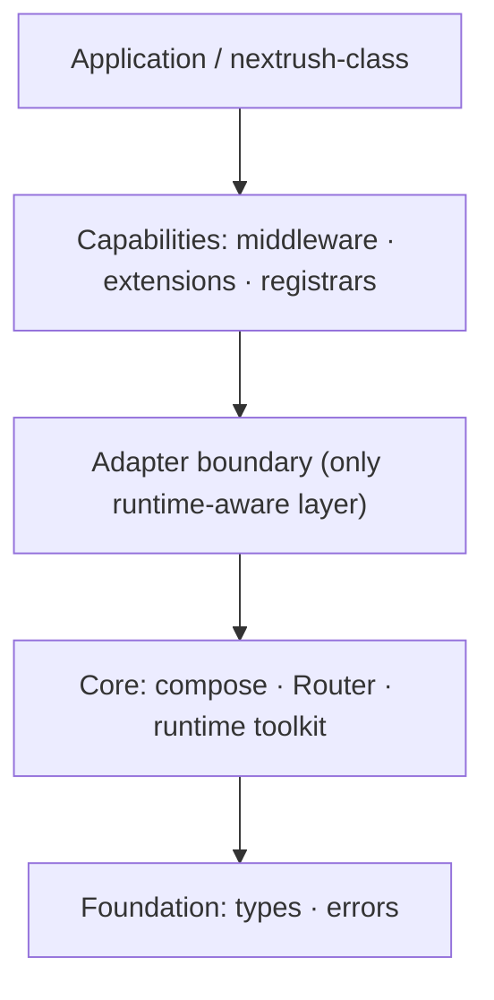
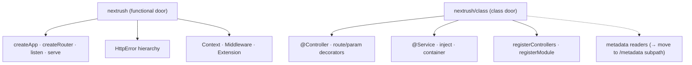
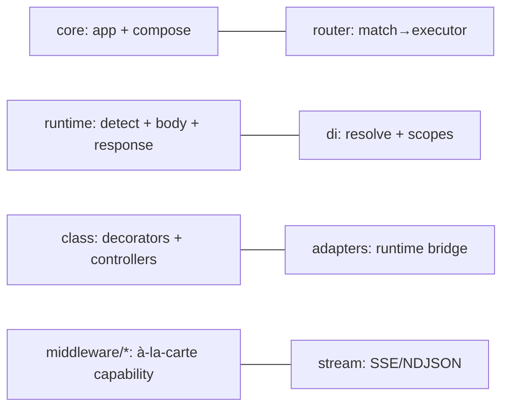
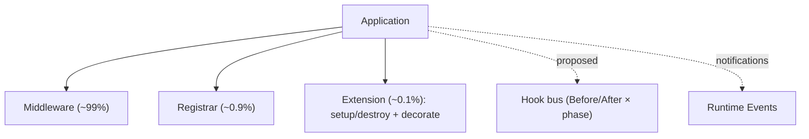
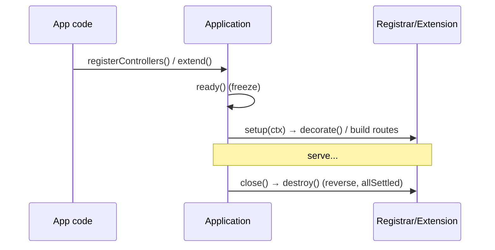
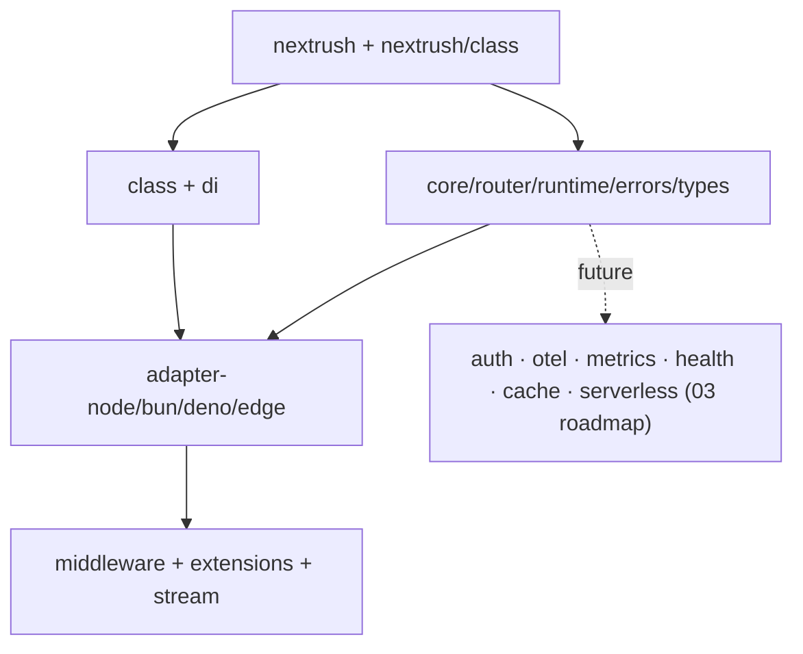

# NextRush — Framework Design Review

> **Review type:** Formal design review before a major open-source release — the lead-architect "does this deserve a stable v1?" judgment. **Design quality, not implementation quality or performance.**
> **Context (not repeated):** `01-production-readiness-audit.md`, `02-production-roadmap.md`, `03-gap-checklist.md`, `07-runtime-architecture.md`.
> **Evidence discipline:** conclusions are grounded in the repository; unconfirmed items are marked **[UNVERIFIED]**. Finding IDs `D-##`; full detail (Evidence · Problem · Why it matters · Trade-offs · Recommendation · Priority · Effort · Acceptance) in *Prioritized Recommendations*.

---

# Executive Summary

NextRush is a **well-designed framework with a genuinely good core and one unfinished decision: which of its two paradigms it *is*.** The load-bearing architectural choices are correct and rare — a runtime-agnostic Web-Platform core, a clean acyclic package hierarchy, an honest extension taxonomy, and an immutable-after-boot application graph. These are the expensive-to-fix-later decisions, and they are already right. The framework is **architecturally elegant** at the core.

Where it is not yet v1-stable is at the **seams of its public identity**:

- **Two paradigms, one framework.** A lean functional API (`nextrush`) and a NestJS-shaped class API (`nextrush/class`) coexist. Individually both are good; together they create a "which NextRush am I learning?" tax the docs must resolve, and the class surface (~40 exports) is large next to the functional one. **[D-01]**
- **The public surface is only partially frozen.** `@nextrush/class` has a sealed, snapshot-tested surface (the B2 remediation), but this is **not repo-wide** — ~35 packages can still widen accidentally, and the deprecated `@nextrush/controllers`/`@nextrush/decorators` shims still re-export the same symbols (triple import path). Freezing before this is fixed hardens accidental internals into semver promises. **[D-02, D-03]**
- **A first-party guarantee on a third-party foundation.** DI is a thin `tsyringe` wrapper; the framework's zero-dependency story and its DI stability both depend on a maintenance-mode package. **[D-04]**
- **Honest-but-unfinished abstractions.** `@Module.exports` is recorded, not enforced (modules group, don't encapsulate); the runtime hook bus for observability is designed but not shipped. Both are documented honestly — but a NestJS-shaped `exports` that does nothing is a DX trap at scale. **[D-06, D-11]**

**The verdict up front (matching the trajectory of the prior class-tier reviews):** *approve the architecture; ship `1.0.0-rc`; do not stamp `1.0.0` stable until the public surface is sealed repo-wide, the shims are removed, and the paradigm story is made explicit.* None of these is a redesign; all are cheaper now than after adoption freezes the import paths. This is a **narrow, closable gate**, not a rejection — the framework is one consolidation-and-freeze pass away from being one developers can happily depend on for a decade.

---

# Overall Framework Score

| Dimension | Score /10 | One-line basis |
|---|---|---|
| **Framework Architecture** | **8.3** | Clean acyclic layering, extension taxonomy, adapter model, immutable graph; minus hook-bus-not-shipped + DI global default |
| **Public API** | **7.5** | Excellent functional core + Context; minus dual-paradigm surface, triple import path via shims |
| **TypeScript Design** | **8.5** | Strict, `noUncheckedIndexedAccess`, zero-`any` shipping, typed `extend<T>`, declaration maps; minus legacy decorators |
| **Package Architecture** | **7.5** | Strict hierarchy, DI kept separate, class consolidated; minus ~35 packages + shims + partial internal tier |
| **Developer Experience** | **7.5** | Scaffolder + CLI + testing harness + best-in-class DI errors + two clean doors; minus decorator toolchain footgun, docs depth |
| **Documentation** | **7.0** | Elite RFC/ADR corpus, tiered standards; partial user docs, some accuracy drift |
| **Maintainability** | **8.0** | Strict layering, ~300-line cap, RFC/TDD gate, forced-verification culture; minus `router.ts` size, tsyringe, bus-factor |
| **Extensibility** | **8.0** | Taxonomy + adapter contract + extension model; minus hooks proposed, encapsulation unenforced |
| **API Stability** | **6.5** | Surface snapshot for `class` only; shims still ship; "3.x vs v1" story unresolved |
| **Overall Framework Design** | **≈ 7.7 / 10** | Strong bones, early-mature surface — **`1.0.0-rc` ready, not `1.0.0` stable** |

*No dimension is inflated: the top scores (TypeScript, Architecture) reflect verifiable properties (zero-`any`, 0 `node:` in core, acyclic hierarchy); the lower scores (API Stability, Documentation) reflect surface/freeze gaps, not code quality.*

---

# Framework Philosophy

**Does NextRush have a clear identity? Mostly yes — with one honest ambiguity.**

## What problem does it solve?
NextRush is a **minimal, modular, runtime-portable TypeScript HTTP framework**: a small dependency-free core that runs identically on Node, Bun, Deno, and the edge, with capability delivered as separately-installed, tree-shakeable packages. It targets the space between "too minimal" (raw Hono-style) and "too heavy" (full NestJS) — *à-la-carte capability on a portable core.* This is a real, defensible niche.

## What makes it different?
- **Runtime-agnostic by construction**, not by porting — the core imports no runtime API (verified: 0 `node:` in `core/router/runtime/di/stream/errors/types`). Most frameworks are Node-first with edge bolted on; NextRush is the inverse.
- **A dependency-free *functional* path** — the most common deployment pulls no runtime dependencies (reflect-metadata/tsyringe load only on the class path).
- **AI/agentic-oriented streaming** as a first-class concern (`@nextrush/stream`: SSE/NDJSON).
- **An explicit extension taxonomy** (Middleware/Registrar/Extension) instead of a plugin-class lifecycle — a deliberate simplification.

## Is the philosophy consistent? Is every package aligned?
**At the core, yes.** The layering, the "capability as a package" model, and the extension taxonomy are applied consistently. Middleware are leaves; the core stays tiny; the adapter is the only runtime-aware layer.

**At the edges, there is one tension — the dual paradigm.** The functional philosophy ("minimal, à-la-carte, dependency-free") and the class philosophy ("NestJS-familiar DI/decorators/modules") are each internally coherent but pull in opposite directions on *simplicity vs. batteries*. The framework handles this well mechanically (two clean import doors, `nextrush` vs `nextrush/class`; the functional path stays reflection-free) — but it has **not yet stated, in one sentence, which paradigm is the front door and which is the option.** A framework's identity is what a newcomer believes it is after five minutes; today they could form two different beliefs. **[D-01]**

## Does it feel cohesive?
**The runtime feels cohesive; the surface feels like two products sharing a repo.** The cohesion problem is not architectural (the layering is clean) — it is *narrative and surface* (triple export paths via shims, ~40-symbol class barrel, "modules" that don't encapsulate). Cohesion is recoverable with a consolidation pass, not a redesign.

**Design-philosophy verdict:** a clear, defensible identity at the core; a paradigm-positioning decision owed to users before v1. State it explicitly: *"NextRush is a minimal functional HTTP core; the class API is an optional, NestJS-familiar layer for teams that want DI + decorators."* Then align docs, scaffolder defaults, and the surface to that sentence.

---

# Public API Review

## Functional surface (`nextrush`) — the strong part

`createApp(options?)` · `createRouter()` · `listen(app, port)` · `serve(app, opts)` · `app.use()` · `app.route(path, router)` · `app.get|post|put|patch|delete|head|all` · `app.extend()` · `setErrorHandler()` · `endpoint()` · the `HttpError` hierarchy + `createError`/`errorHandler`/`notFoundHandler`/`isHttpError` · `Context`/`Middleware`/`Extension` types.

| Criterion | Assessment |
|---|---|
| **Naming** | ✅ Precise, industry-familiar (`use`, `route`, verb methods, `listen`/`serve`). |
| **Consistency** | ✅ Verb methods symmetric; all mutation methods return `this` (fluent + chainable). |
| **Symmetry** | ⚠️ Two small asymmetries: `listen(app, port)` takes only a port while `serve(app, opts)` takes full options; and there is intentionally **no `app.options()` verb** (collides with the `app.options` config property) — honestly documented, use `app.all()`/CORS. **[D-14]** |
| **Simplicity** | ✅ The functional core is genuinely small and holdable in the head. |
| **Predictability** | ✅ `ctx.json/send/html/redirect` are `void` (write to response); verbs delegate to the app router; freeze-after-`ready()` is consistent. |
| **Discoverability** | ✅ (functional) — one import, obvious names. |
| **Return types** | ✅ `extend()` returns `this & TDecorated` — typed decoration with no `declare module`, a genuinely elegant touch. |
| **Error APIs** | ✅ Typed hierarchy + `ctx.throw(status, msg)` + `ctx.assert(cond, status)` — Koa-familiar, well-shaped. |
| **Config APIs** | ✅ `ApplicationOptions { env, proxy, logger, router, container }` + adapter options; ⚠️ no typed *env* config yet (`03` T035). |
| **Helper APIs** | ✅ `endpoint()`, `isHttpError`, `isMiddleware`, `flattenMiddleware` — small, purposeful. |

## Class surface (`nextrush/class`) — good, but wide

~40 exports: `@Controller` + route/param/response decorators, `@UseGuard`/`@Catch`/`@UseFilter`/`@UseInterceptor`, `@Module`, `registerControllers`/`registerModule`, the DI surface (`@Service`/`@Repository`/`@Config`/`@Injectable`/`@Optional`/`inject`/`container`), lifecycle (`OnInit`/`OnShutdown` + `isOnInit`/`isOnShutdown`).

| Criterion | Assessment |
|---|---|
| **NestJS familiarity** | ✅ Decorator names match the mental model most users arrive with. |
| **Surface size** | ⚠️ ~40 symbols in one barrel is a lot next to the functional core; autocomplete is busy. |
| **Sealed surface** | ✅ Internals (`deepFreeze`, `bootstrapPipeline`, etc.) moved behind `packages/class/src/internal.ts` with a `public-surface.test.ts` snapshot (B2 closed). |
| **Triple import path** | ⚠️ `Controller`/`Get`/`Service` are still reachable from `@nextrush/controllers` + `@nextrush/decorators` (deprecated shims) **and** `nextrush/class`. Removal tracked (`03` T053). **[D-02]** |
| **Metadata readers public** | ⚠️ `getRouteMetadata`/`getControllerDefinition`/`getAllParamMetadata` leak internal representation; useful for tooling but pollute the newcomer surface — namespace under a subpath (`03` T037). **[D-...]** |
| **Duck-typed lifecycle** | ⚠️ `OnInit`/`OnShutdown` have no decorator to hang IntelliSense on; discoverable only via docs. |

## Disposition

| Keep (never change) | Change before v1 | Remove | Redundant / violates consistency |
|---|---|---|---|
| `Context` contract, `Middleware`, `Extension<T>`, `createApp`/`createRouter`/`listen`/`serve`, `HttpError` hierarchy, verb methods | `listen` → accept an options object (or document the port-only limit); namespace class metadata readers; positioning of the two paradigms (D-01) | Deprecated `catchAsync`, `ErrorContext`/`ErrorMiddleware` (errors/middleware); the `controllers`/`decorators` shims (T053) | Triple export path (shims); `catchAsync` (async errors already propagate) |

**Net:** the functional API is close to freeze-ready; the class API needs the shim removal + metadata namespacing before its import paths are frozen.

---

# TypeScript Design Review

TypeScript is NextRush's strongest single dimension — and it is strong for the *right* reason: **restraint.** It uses the type system to make the public contract precise, not to show off.

| Area | Assessment | Evidence |
|---|---|---|
| **Strict mode** | ✅ Full | `tsconfig.base.json`: `strict`, `noUncheckedIndexedAccess`, `noUnusedLocals/Parameters`, `noImplicitReturns`, `verbatimModuleSyntax`, `isolatedModules` |
| **Zero `any` (shipping)** | ✅ Verified | every `any` match is under `__tests__`; boundaries use `unknown` (`ctx.body: unknown`) |
| **Public types** | ✅ Precise | `Context`, `Middleware`, `Extension<TDecorated>`, `ApplicationOptions`, `RouteEntry` — complete, documented |
| **Generic design** | ✅ Disciplined | generics where they earn it (`extend<T>`, event maps); not over-generic elsewhere |
| **Conditional/utility types** | ✅ Modest | no deep conditional-type gymnastics that break IntelliSense — a deliberate, correct restraint |
| **Type inference** | ✅ Good at boundaries | `unknown` bodies force narrowing; params/query typed `Record<string,string>` |
| **Declaration files + maps** | ✅ | `declaration` + `declarationMap` + `sourceMap` all on; `dist/*.d.ts` shipped |
| **IntelliSense** | ⚠️ | Excellent for functional; class barrel breadth + shims add noise (D-02) |
| **Type safety** | ✅ | typed error hierarchy; `import type` at boundaries; no internal types leaked (post-B2) |
| **Type complexity** | ✅ Low | a *feature* — the types are readable, which is why IntelliSense stays fast |
| **Breaking-change risk** | ⚠️ High cost | ESM-only + **legacy decorator dialect** (`experimentalDecorators`+`emitDecoratorMetadata`) + broad class surface — all expensive to change post-v1 |

**The one strategic TypeScript risk is the decorator dialect.** DI parameter injection depends on `design:paramtypes` (legacy emit); TC39 standard decorators don't provide it. This is a documented, deliberate bet (`ADR-0001`) with reflection isolated to one boundary — the right posture — but it is the single type-level decision most likely to force a future breaking migration. It does not block v1; it must be *acknowledged* in the freeze (D-05).

**TypeScript design verdict:** freeze-ready in substance. The type surface is precise, safe, and pleasantly un-clever. The action items are surface hygiene (namespace metadata readers, remove shims) and one documented long-term bet (decorators), not type redesign.

---

# Package Architecture Review

## The hierarchy (verified, strict, acyclic)

```
types → errors → core → router → di → class → adapters → middleware
                          ↘ runtime (Web-Platform toolkit) ↗
```

This is the **best single property of the codebase**: dependency direction is never violated (lower never imports higher), there are no circular dependencies, and cross-package imports go through published barrels. It is exactly the layering a framework should have, and it should be preserved verbatim.

## Per-package disposition

| Package | Responsibility | Cohesion | Verdict |
|---|---|---|---|
| `@nextrush/types` | Shared contracts | High | **Stay** — foundation |
| `@nextrush/errors` | HTTP error hierarchy | High | **Stay** |
| `@nextrush/core` | Application, compose, extension lifecycle | High | **Stay** |
| `@nextrush/router` | Segment-trie routing | High | **Stay** (split `router.ts`, D-08) |
| `@nextrush/runtime` | Web-Platform toolkit (detection/BodySource/WebResponseBuilder/headers) | High | **Stay** |
| `@nextrush/di` | Container + scopes | Mostly | **Stay separate** (reusable), but own it (drop tsyringe, D-04) |
| `@nextrush/class` | Class runtime (decorators/controllers/modules/guards/…) | High | **Stay** — the correct consolidation |
| `@nextrush/stream` | SSE/NDJSON | High | **Stay** |
| `@nextrush/adapter-{node,bun,deno,edge}` | Runtime bridges | High | **Stay** |
| `@nextrush/adapter-conformance` | Cross-adapter parity tests | High | **Stay (internal/dev tier)** — mark not-public |
| `@nextrush/{cors,helmet,csrf,rate-limit,body-parser,multipart,compression,cookies,validation,request-id,timer,static,template,logger,openapi}` | À-la-carte middleware | High | **Stay** |
| `@nextrush/{events,websocket}` | Extensions | High | **Stay** |
| `@nextrush/dev` | Dev server + build + generators | Acceptable (toolkit) | **Stay** — name is vague; `@nextrush/cli`/`toolkit` would be clearer (low priority) |
| `@nextrush/testing` | `createTestModule()` harness | High | **Stay** — high adoption value |
| `create-nextrush` | Scaffolder | High | **Stay** |
| `nextrush` (meta) | Functional entry + `class` subpath | High | **Stay** — the canonical doors |
| `@nextrush/controllers` | Re-export shim | — (empty) | **Deprecate → Remove** (D-02, `03` T053) |
| `@nextrush/decorators` | Re-export shim | — (empty) | **Deprecate → Remove** (D-02, `03` T053) |

## Boundaries, coupling, cohesion
- **Coupling is correct in direction** but has one external tie: `@nextrush/di → tsyringe` (D-04). A notable *positive*: `@nextrush/openapi` reads the **router's** route metadata, not controller metadata — OpenAPI and controllers are correctly decoupled, so the class layer isn't a hidden dependency of doc generation.
- **Cohesion is high per package** after the §4 reorg and the `builder.ts` split.
- **No package is a god-package**; the one oversized *file* is `router.ts` (~28 KB, over the 300-line cap — D-08).

## Naming, size, ownership, growth
- **Naming:** precise across the tree except `dev` (vague) and the two shims (now misleading — removal fixes it).
- **Package count:** ~35 today; the `03` roadmap adds ~15 (auth/otel/metrics/health/config/cache/redis/serverless/queue/cron/webhooks/graphql/rpc). At ~50 packages an **internal/public tier convention** and a **compatibility matrix** are mandatory (D-03, D-10).
- **Ownership:** single maintainer across all packages — a governance/bus-factor risk for a public v1 (D-13).

**Package-architecture verdict:** the *structure* is v1-grade; the *inventory hygiene* (remove shims, mark the internal/dev tier, publish a support matrix) is the freeze prerequisite.

---

# Framework Architecture Review

*Are responsibilities correctly separated? Overwhelmingly yes.*

| Subsystem | Separation assessment | Verdict |
|---|---|---|
| **Runtime** (`@nextrush/runtime`) | Web-Platform toolkit; owns detection/capabilities/body/response-building; no app logic | ✅ Clean |
| **Core** (`@nextrush/core`) | `Application` is **transport-agnostic** — no `listen`; owns middleware stack + extension lifecycle + error dispatch | ✅ Excellent (the key separation) |
| **Router** | Owns match→executor; pre-compiles at boot; introspection off the hot path | ✅ Clean |
| **Middleware** | Single `(ctx, next)` contract; `compose()` is the only pipeline | ✅ Clean |
| **Plugin system** | Deliberately *not* a system — it's the Middleware/Registrar/Extension taxonomy | ✅ Correct simplification |
| **Extension system** | `extend()`/`ready()`/`destroy()`; app-scoped, boot/teardown lifecycle | ✅ Clean |
| **Dependency Injection** | Separate package; scopes; **global container default** (isolation opt-in) | ⚠️ Isolation default (D-04-adjacent, `03` T033) |
| **Decorators** | In `@nextrush/class`; reflection isolated to one boundary | ✅ isolated / ⚠️ legacy dialect (D-05) |
| **Configuration** | Freeze-after-`ready()` ✅; **no typed/validated layer yet** | ⚠️ (`03` T035) |
| **Error model** | `HttpError` hierarchy + phase-based handling + single serializer; prod-safe | ✅ Strong |
| **Streaming** | Separate package; Web Streams; disconnect-aware | ✅ Clean |
| **Request lifecycle** | One `Context`, executors compiled once, capability-negotiated | ✅ Clean (see `07`) |
| **Response pipeline** | `WebResponseBuilder` (fetch) / native (Node); write-once; CRLF-guarded | ✅ Clean |
| **Adapter model** | Two-tier (`ServerAdapter`/`FetchAdapter`); conformance-verified parity | ✅ Elegant |

**The one architectural decision that is a *design smell* (not a bug):** DI as a `tsyringe` wrapper with a global-container default. It works and is honestly documented, but it makes a first-party guarantee (DI stability, isolation, zero-dep) depend on a third-party, maintenance-mode package and a global default that hardens into a breaking migration. This is the architecture item most worth resolving before mass adoption (own the container + isolation-by-default, `03` T050/T033).

**The one *unfinished* abstraction:** `@Module.exports` (grouping without enforced encapsulation). Honestly documented, but it teaches a NestJS mental model the runtime doesn't honor — enforce it or relabel it "grouping" before v1 (D-06).

**Framework-architecture verdict:** responsibilities are correctly separated; the runtime is genuinely well-architected. The action items are one design smell (DI foundation) and one unfinished abstraction (module encapsulation) — neither requires re-architecting, both are additive within existing seams.

---

# Developer Experience Review

| Aspect | Rating | Evidence / note |
|---|---|---|
| **First-time experience** | 8/10 | `create-nextrush` scaffolder (functional/class/full presets); two clean import doors |
| **Installation** | 8/10 | `pnpm add nextrush` (functional); class via the `nextrush/class` subpath (consolidated — no longer a four-package install) |
| **Getting started** | 7/10 | README quick-start is strong; class first-run needs the metadata-emitting toolchain |
| **CLI** | 7.5/10 | `nextrush dev|build|generate` + codemods + diagnostics; Windows/`rm -rf`/`--watch` issues fixed (audit history) |
| **Error messages** | 9/10 | **DI errors are best-in-class** — structured with numbered remediation (`di/errors.ts`); guard/controller errors typed |
| **Documentation** | 7/10 | Elite RFC/ADR + tiered standards; user-facing depth partial (Fumadocs site in `apps/docs`) |
| **Examples** | 6.5/10 | Playground + `examples/openapi-basic`; needs a broad cookbook + an enterprise example (`03` T036) |
| **IDE / IntelliSense** | 7/10 | Strong types; class barrel + shims add autocomplete noise (D-02) |
| **Debugging / stack traces** | 6.5/10 | Reflection + registrar layers add frames; no source-map-aware handler naming; diagnostics help |
| **Logging** | 8/10 | Pluggable `Logger`, no-op default; structured; `@nextrush/logger` + request-id |
| **Learning curve** | 7/10 | Functional = Hono/Express-tier (easy); class = NestJS-sized surface with sub-NestJS docs |
| **Migration** | 7/10 | `consolidate-imports` codemod + `docs/migrations/*` + changesets discipline |

**The #1 DX footgun** is the class path's decorator-metadata toolchain requirement — a bare `tsx`/`esbuild` build yields "TypeInfo not known" at runtime. It is documented (`ADR-0001`) and inherent to the legacy dialect, but it is the most common first-run failure; the deterministic-metadata build + loud preflight (`03` T008) is the fix. **The DX ceiling is held down by three things, all fixable: the metadata footgun, the class autocomplete noise, and docs depth — none is a design flaw.**

---

# Consistency Review

| Dimension | Assessment |
|---|---|
| **Naming** | ✅ Consistent — decorators mirror NestJS; DI/core names precise. Outlier: `@nextrush/dev` (vague). |
| **Folder structure** | ✅ Feature-cohesive; runner-per-concern in the class package (`guard-runner`/`filter-runner`/`interceptor-runner`); §4 reorg applied. |
| **File organization** | ✅ Each package: `src/index.ts` barrel + `tsup.config.ts` + `vitest.config.ts` + `README` + `CHANGELOG`. Uniform. |
| **Terminology** | ✅ Canonical terms defined + enforced by steering (Context, Middleware, Extension, Registrar, Handler, Route, Application). |
| **Package conventions** | ✅ Uniform manifests, `sideEffects`, `exports` maps, `publishConfig`. |
| **Coding style** | ✅ Prettier + ESLint + strict TS; enforced in CI. |
| **Documentation style** | ✅ Tiered doc standards + a voice guide; MDX component discipline. |
| **Examples** | ⚠️ Sparse/uneven coverage across packages. |
| **Error messages** | ✅ Mostly consistent typed errors; DI is the gold standard others should match. |
| **Runtime concepts** | ✅ Identical across adapters by conformance suite. |

**Residual inconsistencies (all tracked):** the triple import path via shims (D-02), and the **`radix-tree.ts`/`RadixNode` naming vs the actual segment trie** (D-07) — the code says "segment trie, not a compressed radix tree" while the file, type, JSDoc, and npm keyword say "radix." These are the two places the framework contradicts itself; both are cheap to fix and should be before freeze.

**Consistency verdict:** unusually high for a framework this young — the steering-enforced conventions show. The two contradictions above are the only real blemishes.

---

# Maintainability Assessment

| Factor | Assessment | Evidence |
|---|---|---|
| **Code organization** | ✅ Strong | strict layering + ~300-line cap (mostly honored) |
| **Architectural boundaries** | ✅ Enforced | acyclic hierarchy; barrels; `import type` at boundaries |
| **Technical debt** | ⚠️ Bounded, known | shims, tsyringe coupling, `router.ts` size, legacy dialect, unenforced `exports` — all catalogued (`03`) |
| **Cyclomatic complexity** | ✅ Low | small focused functions; runner-per-concern |
| **Fan-in hotspots** | ⚠️ Watch | `di.resolve` fan-in ≈ 99 (central; high blast radius); template helpers high fan-in |
| **Cohesion / coupling** | ✅ Good / correct-direction | one external tie (`di→tsyringe`) |
| **Deprecated APIs** | ✅ Managed | `catchAsync`, `ErrorContext`, shims — `@deprecated` with removal window (`ADR-0005`) |
| **Dead code** | ✅ Clean | prior audits verified dead/phantom exports removed |
| **Refactoring opportunities** | split `router.ts` (D-08); namespace metadata readers; own the DI container | |
| **Long-term maintenance cost** | ✅ Low–moderate | RFC/TDD/forced-no-cache-verification culture keeps it low; **single maintainer** raises it (D-13) |

**Maintainability verdict:** the process discipline (RFC before public API, test-first, forced verification, changeset-gated releases) is genuinely above-average and is the reason the debt is *bounded and catalogued* rather than sprawling. The dominant long-term risk is not the code — it is the **bus factor of one** across ~35 packages.

---

# Extensibility Assessment

| Extension point | Maturity | Assessment |
|---|---|---|
| **Middleware development** | ✅ Excellent | one `(ctx, next)` contract; trivial to author; ~99% of needs |
| **Registrar development** | ✅ Good | plain `registerX(app, opts)` functions; no ceremony |
| **Extension development** | ✅ Good | `Extension<T>` + `decorate` + `needs`; typed decoration; sparse *authoring docs* |
| **Adapter development** | ✅ Strong | two-tier contract + conformance suite → a new runtime is "implement + declare capabilities" |
| **Middleware APIs** | ✅ | Koa-familiar, composable |
| **Runtime hooks** | ⚠️ **Proposed, not shipped** | only `setup`/`destroy` + error handler today; observability/plugins must wedge in — the typed hook bus (`07`) is the gap (D-11) |
| **Framework/internal extension points** | ⚠️ | metadata readers exist but leak representation; `ApplicationGraph` read-type is a good seam |
| **Future compatibility** | ✅ | additive-friendly barrels + RFC gate |
| **Third-party package development** | ⚠️ | possible now (middleware/registrar); a *plugin marketplace* needs the hook bus + a frozen extension contract + an internal tier |

**Extensibility verdict:** the *composition model* (taxonomy + adapters) is excellent and future-proof. The gap is the **cross-cutting extension surface** — without the runtime hook bus, an observability/security plugin cannot cleanly wrap the request pipeline. Shipping the hook bus (`07` design; `03` T026/T028) is the single highest-leverage extensibility investment before inviting an ecosystem.

---

# Documentation Review

| Artifact | State | Note |
|---|---|---|
| **README files** | ✅ Strong | Root + per-package READMEs; honest performance framing (withdrawn numbers) |
| **RFCs** | ✅ Elite | 12 RFCs in `docs/RFC/` (plugin system, request scope, modules, interceptors, filters, lifecycle, stream, validation, …) |
| **ADRs** | ✅ Good | 6 ADRs in `docs/adr/` (decorator dialect, extension model, class consolidation, reflection boundary, tiers, deferred features) |
| **Architecture docs** | ✅ | `07-runtime-architecture.md` + steering instructions |
| **API documentation** | ⚠️ Partial | Tiered standards exist; not every public API has a reference entry (D-12) |
| **Tutorials / guides** | ⚠️ Partial | Fumadocs site (`apps/docs`); getting-started good; enterprise topics thin |
| **Examples** | ⚠️ Sparse | `examples/openapi-basic` + playground; no broad cookbook |
| **Migration guides** | ✅ | `docs/migrations/*` (class consolidation, extension model) |

**Missing:** enterprise topics (observability, config, deployment hardening, graceful shutdown), an end-to-end enterprise example, and complete per-API reference. **Outdated/contradictory:** the "Zero Dependencies" claim (false for the class path) and the "radix" router naming (it's a segment trie) — both accuracy defects that undermine otherwise-strong docs (D-07, D-12). **Duplicate:** the deprecated shims + `nextrush/class` document the same symbols in multiple places (resolved by shim removal). **Confusing:** which import path is canonical, and what `@Module.exports` guarantees (D-01, D-06).

**Documentation verdict:** the *contributor-facing* docs (RFC/ADR/steering) are best-in-class for a project this age; the *user-facing* docs are mid-maturity and carry two accuracy defects. Docs are a stated core value here — closing the accuracy defects is a freeze prerequisite, and filling the enterprise/reference gaps is a v1.0 (not RC) requirement.

---

# Contributor Experience

| Aspect | Assessment | Evidence |
|---|---|---|
| **Repository structure** | ✅ Clear | Turborepo + pnpm workspaces; `packages/`, `apps/`, `docs/`, `examples/` |
| **Build system** | ✅ | `turbo run build` + `tsup` per package; `pnpm verify` (build+test+typecheck+lint) |
| **Testing strategy** | ✅ Strong | Vitest; 145+ test files; conformance suite; forced-no-cache verification culture; `@nextrush/testing` harness |
| **Coding standards** | ✅ Enforced | ESLint + Prettier + strict TS + steering instructions |
| **RFC workflow** | ✅ Mature | RFC-before-public-API is an explicit rule (12 RFCs prove it's followed) |
| **ADR workflow** | ✅ | 6 ADRs; decisions recorded with triggers |
| **PR workflow** | ✅ | CI changeset guard forces a changeset for release-impacting changes |
| **Release process** | ✅ | Changesets + `changeset publish --provenance`; documented in `PUBLISHING.md` |
| **Issue templates** | ⚠️ [UNVERIFIED] | Not confirmed in `.github/` (recommend adding) |
| **Code ownership** | ⚠️ | Single maintainer; no CODEOWNERS with >1 owner (D-13) |
| **Contributor onboarding** | ✅ | `CONTRIBUTING.md` + steering; RFC/TDD expectations explicit |

**Contributor-experience verdict:** the *process* is unusually disciplined — RFC gate, test-first iron law, forced verification, changeset-gated releases. This is the machinery of a project that intends to last. The one structural risk is **governance**: a single maintainer and no multi-owner CODEOWNERS/governance doc. Before inviting a contributor ecosystem, publish a governance model + recruit maintainers (D-13); an ecosystem cannot form around a bus-factor of one.

---

# Ecosystem Comparison

Design-lens comparison (not performance). Legend: 🟢 Better · ⚪ Equal · 🟡 Behind · 🔴 Missing (from NextRush's view).

| Design dimension | vs Express | vs Fastify | vs Hono | vs Nitro | vs NestJS | vs Elysia |
|---|---|---|---|---|---|---|
| **Framework design (core)** | 🟢 | ⚪ | ⚪ | 🟡 | 🟢 | ⚪ |
| **Runtime portability** | 🟢 | 🟢 | 🟡 (Hono proven) | 🟡 (Nitro presets) | 🟢 | ⚪ |
| **API design (functional)** | 🟢 | ⚪ | ⚪ | ⚪ | 🟢 | 🟡 (Elysia e2e types) |
| **API design (class/DI)** | 🟢 | 🟢 | 🟢 | 🟢 | 🟡 (Nest is the standard) | 🟢 |
| **Package organization** | 🟢 | ⚪ | ⚪ | ⚪ | 🟢 | ⚪ |
| **TypeScript design** | 🟢 | 🟢 | ⚪ | ⚪ | ⚪ | 🟡 |
| **Extensibility model** | 🟢 | 🟡 (Fastify encapsulation) | ⚪ | ⚪ | 🟡 (Nest modules) | ⚪ |
| **Developer experience** | 🟢 | 🟡 | 🟡 | 🟡 | 🟡 | 🟡 |
| **Documentation** | 🟡 | 🟡 | 🟡 | 🟡 | 🟡 | 🟡 |
| **Maintainability (process)** | 🟢 | ⚪ | ⚪ | ⚪ | ⚪ | 🟢 |
| **API stability / maturity** | 🟡 | 🟡 | 🟡 | 🟡 | 🟡 | 🟡 |
| **Ecosystem breadth** | 🟡 | 🟡 | 🟡 | 🟡 | 🟡 | 🟡 |

**Where NextRush is Better:** a genuinely runtime-agnostic core (vs Express/Nest's Node-lock), a dependency-free functional path, first-class DI+decorators *without* NestJS's weight, and an unusually disciplined RFC/TDD/verification process for its age.

**Where it is Equal:** functional ergonomics and TypeScript rigor sit with Fastify/Hono; the class model is Nest-shaped but lighter.

**Where it is Behind:** **documentation depth, ecosystem breadth, and proven maturity** — uniformly the young-project gaps. Against **Hono** (proven multi-runtime + RPC) and **Nitro** (universal deploy presets), NextRush is behind precisely where those two are strongest: on-runtime proof and turnkey deployment. Against **Elysia**, it lacks end-to-end type inference / an Eden-style typed client. Against **NestJS**, it lacks the ecosystem/module-encapsulation maturity (though its class layer is simpler and portable).

**Where it is Missing:** end-to-end typed RPC (`03` T049), a serverless deploy-preset story (T038), and — like most young frameworks — a plugin marketplace.

**Positioning read:** NextRush's honest slot is *"Hono's portability + Nest's ergonomics, minus both their maturity."* That is a real and attractive niche; the design supports it. The gap to the leaders is proof and breadth (roadmap work), not design quality.

---

# API Freeze Assessment

**Is NextRush ready for API freeze? The functional core is; the class surface and the repo-wide contract are not.**

| Category | APIs | Action |
|---|---|---|
| **Never change (freeze as-is)** | `Context` contract; `Middleware`/`Next`; `Extension<T>`/`ExtensionContext`; `createApp`/`createRouter`/`listen`/`serve`; verb methods + `use`/`route`; `HttpError` hierarchy + `createError`/`errorHandler`/`notFoundHandler`/`isHttpError`; the two adapter contracts | Lock behind a repo-wide surface snapshot (`03` T005) |
| **Change before v1** | `listen` → accept an options object (or document port-only); resolve the paradigm positioning (D-01); fix `radix`→`segment-trie` naming (D-07) | Small, do pre-freeze |
| **Deprecate → remove** | `@nextrush/controllers` + `@nextrush/decorators` shims; `catchAsync`; `ErrorContext`/`ErrorMiddleware` | `03` T053 + deprecation window |
| **Become internal** | Class metadata readers (`getRouteMetadata`, `getControllerDefinition`, `getAllParamMetadata`) → `nextrush/class/metadata` subpath | `03` T037 |
| **Require redesign before freeze** | `@Module.exports` — enforce encapsulation or relabel "grouping" (shipping a no-op that mimics NestJS is a trap) | `03` T032 or docs downgrade |
| **Documented long-term bet (freeze with an exit)** | Legacy decorator dialect | `ADR-0001` states the TC39 exit trigger; freeze with reflection isolated |

**Freeze blockers (must close before a `1.0.0` stable tag):**
1. **Repo-wide surface snapshots** (only `@nextrush/class` is sealed today) — otherwise ~35 packages freeze accidental internals. **[D-03]**
2. **Shim removal** — otherwise the triple import path is frozen forever. **[D-02]**
3. **`@Module.exports` decision** — enforce or relabel before the mental model hardens. **[D-06]**
4. **Version/support narrative** — "3.x on npm vs marketed v1" + a compatibility/support matrix. **[D-10]**

**Recommendation (consistent with the class-tier reviews):** tag **`1.0.0-rc`** now — the functional core is contract-stable and the class internals are sealed. Tag **`1.0.0`** only after the four blockers close. This is a *narrow* gate: none requires redesign, all are cheaper pre-adoption.

---

# Technical Debt

Catalogued, bounded, and cross-referenced to `03-gap-checklist.md`. None is hidden; the RFC/ADR/steering discipline keeps debt visible.

| Debt | Severity | Design impact | Tracked |
|---|---|---|---|
| Deprecated shims still shipping (triple import path) | High (freeze) | API consistency + frozen import paths | `03` T053 · D-02 |
| Public surface sealed only for `@nextrush/class` | High (freeze) | Accidental internals frozen at v1 | `03` T005 · D-03 |
| DI = `tsyringe` wrapper + global default | Medium | First-party guarantee on 3rd-party maintenance-mode dep; isolation | `03` T050/T033 · D-04 |
| `@Module.exports` not enforced | Medium | Teaches a mental model the runtime breaks | `03` T032 · D-06 |
| Legacy decorator dialect | Medium | Future forced migration risk (contained by isolation) | `ADR-0001` · D-05 |
| `router.ts` ~28 KB (> 300-line cap) | Low | Maintainability hotspot | `03` T014 · D-08 |
| Runtime hook bus not shipped | Medium | Cross-cutting extensibility (observability) | `07` design; `03` T026/T028 · D-11 |
| `radix-tree.ts`/`RadixNode` naming vs segment trie | Low | Self-contradiction; contributor confusion | `03` T002 · D-07 |
| "Zero Dependencies" claim inaccurate (class path) | Low (accuracy) | Docs/trust | `03` T001 · D-12 |
| Single maintainer / no governance doc | High (sustainability) | Bus factor for a public v1 | `03` T059 · D-13 |
| Metadata readers leak internal representation | Low | Surface hygiene | `03` T037 |

**Debt verdict:** the debt is **well-managed** — every item is catalogued with a tracked task, which is itself a maturity signal. The *freeze-blocking* debt (shims, surface snapshots, module `exports`, version story) is a small, cheap subset; the rest is post-v1 hardening.

---

# Prioritized Recommendations

*Each: Evidence · Problem · Why it matters · Trade-offs · Recommendation · Priority · Effort · Acceptance.*

### D-01 — State the paradigm positioning (functional vs class)
- **Evidence:** `nextrush` (functional) + `nextrush/class` (NestJS-shaped) coexist; both are internally coherent but pull opposite on simplicity-vs-batteries.
- **Problem:** No single-sentence statement of which is the front door; a newcomer can form two different beliefs about "what NextRush is."
- **Why it matters:** Identity is what a developer believes after five minutes; ambiguity dilutes adoption and docs.
- **Trade-offs:** Committing a primary paradigm may feel like de-emphasizing the other; mitigated by framing class as the *optional* layer.
- **Recommendation:** Publish the positioning: *"minimal functional HTTP core; class API is an optional NestJS-familiar layer."* Align docs, scaffolder default, and marketing.
- **Priority:** P1 · **Effort:** XS (S with docs) · **Acceptance:** README + docs landing state the positioning; scaffolder default reflects it.

### D-02 — Remove the deprecated shims (kill the triple import path)
- **Evidence:** `@nextrush/controllers` + `@nextrush/decorators` are single-file re-export shims; `Controller`/`Get`/`Service` reachable from three places.
- **Problem:** Three import paths for one symbol; frozen forever if shipped at v1.
- **Why it matters:** API consistency + a permanent maintenance/semver liability.
- **Trade-offs:** Breaking for shim users; mitigated by the `consolidate-imports` codemod + ADR-0005 window.
- **Recommendation:** Remove on the stated timeline before `1.0.0`; codemod + migration guide.
- **Priority:** P1 · **Effort:** S · **Acceptance:** shims absent from the registry; codemod migrates a fixture to `nextrush/class`.

### D-03 — Repo-wide public-surface snapshots
- **Evidence:** Only `@nextrush/class` has `public-surface.test.ts`; ~35 packages unguarded.
- **Problem:** Accidental export widening freezes into semver at v1.
- **Why it matters:** The freeze is a promise across all packages, not one.
- **Trade-offs:** Adds a test per package + a snapshot-update step to PRs; small.
- **Recommendation:** Generalize the class snapshot to every published package; CI-gated.
- **Priority:** P0 (freeze blocker) · **Effort:** M · **Acceptance:** an unintended export fails CI in any package.

### D-04 — Own the DI container; isolation by default
- **Evidence:** `di/container.ts` = "wrapper around tsyringe"; global container default.
- **Problem:** First-party DI guarantee + zero-dep story depend on a maintenance-mode dep + a global default.
- **Why it matters:** A tsyringe break is a framework incident; global default blocks multi-tenant isolation and hardens into a breaking migration.
- **Trade-offs:** Implementation cost + a major-version migration; preserve the public DI surface to bound breakage.
- **Recommendation:** Replace tsyringe (`03` T050); make per-app isolation default at the next major (T033).
- **Priority:** P2 · **Effort:** L · **Acceptance:** DI suites green with tsyringe removed; two in-process apps isolated by default.

### D-05 — Freeze the decorator dialect with a documented exit
- **Evidence:** `tsconfig.base.json` `experimentalDecorators`+`emitDecoratorMetadata`; `ADR-0001`.
- **Problem:** Legacy dialect is load-bearing for DI param injection; TC39 standard decorators don't emit `design:paramtypes`.
- **Why it matters:** Most likely future forced breaking migration.
- **Trade-offs:** Staying is pragmatic now; migrating now breaks all class users for no gain.
- **Recommendation:** Keep for v1; ensure ADR-0001 states the exit trigger; keep reflection isolated (already done).
- **Priority:** P2 · **Effort:** XS · **Acceptance:** ADR states the trigger + plan; a lint/test asserts reflection stays in one module.

### D-06 — Enforce or relabel `@Module.exports`
- **Evidence:** README + RFC: "modules group, do not encapsulate; `exports` recorded, not enforced."
- **Problem:** A NestJS-shaped `exports` that does nothing is a DX trap discovered at scale.
- **Why it matters:** Enterprises rely on module-private providers; a silent no-op erodes trust.
- **Trade-offs:** Enforcing is real work (per-module container); relabeling is cheap but reduces the promise.
- **Recommendation:** Enforce encapsulation (`03` T032) or relabel "module grouping" until it lands — before the mental model hardens at v1.
- **Priority:** P2 · **Effort:** L (enforce) / XS (relabel) · **Acceptance:** a non-exported provider is unresolvable outside its module, or docs say "grouping only."

### D-07 — Fix the segment-trie naming drift
- **Evidence:** `router.ts` header: "segment trie, not a compressed radix tree"; file `radix-tree.ts`, type `RadixNode`, npm keyword `radix-tree`.
- **Problem:** The framework contradicts itself.
- **Why it matters:** Contributor/evaluator confusion; misleading metadata.
- **Trade-offs:** None (internal names) if a `@deprecated` alias covers any public symbol.
- **Recommendation:** Rename to `segment-trie`/`TrieNode`; fix JSDoc + npm keywords (`03` T002).
- **Priority:** P1 · **Effort:** S · **Acceptance:** no `radix` token except a historical note.

### D-08 — Split `router.ts` (> 300-line cap)
- **Evidence:** `packages/router/src/router.ts` ≈ 28 KB.
- **Problem:** Exceeds the project's own file-size ceiling; maintainability hotspot.
- **Why it matters:** Repo steering treats god files as a gate failure.
- **Trade-offs:** Characterize-then-refactor (behavior unchanged); modest effort.
- **Recommendation:** Split into cohesive units (`03` T014).
- **Priority:** P2 · **Effort:** S · **Acceptance:** no shipping file > 300 lines; router tests unchanged/green.

### D-09 — Ratify ESM-only as an explicit boundary
- **Evidence:** every `exports` map has only an `import` condition.
- **Problem:** `require()` consumers excluded (may be intentional).
- **Why it matters:** Defensible, but must be a *stated* v1 boundary, not an accident.
- **Trade-offs:** Dual-publish doubles surface + dual-package hazard; ESM-only is cleaner.
- **Recommendation:** Document ESM-only as supported; revisit dual-publish only on real demand (`03` T051).
- **Priority:** P3 · **Effort:** XS (decision) · **Acceptance:** a documented ESM-only policy.

### D-10 — Version/stability narrative + compatibility matrix
- **Evidence:** published at `3.x` while "preparing v1"; mixed independent versions; shims shipping.
- **Problem:** Adopters can't reason about stability.
- **Why it matters:** Semver clarity is table stakes for enterprise adoption.
- **Recommendation:** Publish `COMPATIBILITY.md` + support policy + shim-removal timeline (`03` T007).
- **Priority:** P0 (freeze) · **Effort:** S · **Acceptance:** matrix + policy published, cross-checked against actual versions.

### D-11 — Ship the runtime hook bus
- **Evidence:** only `setup`/`destroy` + error handler today; `07` designs the typed hook bus.
- **Problem:** Cross-cutting concerns (observability/security plugins) can't cleanly wrap the pipeline.
- **Why it matters:** Highest-leverage extensibility investment before an ecosystem forms.
- **Trade-offs:** A new concept; kept zero-cost when unused.
- **Recommendation:** Implement the hook bus (`03` T026/T028).
- **Priority:** P1 · **Effort:** M · **Acceptance:** a per-stage hook fires and is consumed by an OTel package.

### D-12 — Fix documentation accuracy + fill enterprise/reference gaps
- **Evidence:** "Zero Dependencies" (false for class path); partial API reference; thin enterprise topics.
- **Problem:** Accuracy defects undermine otherwise-strong docs; gaps cap adoption.
- **Why it matters:** Docs are a stated core value.
- **Recommendation:** Correct claims (`03` T001); complete reference + enterprise guides (`03` T058).
- **Priority:** P1 · **Effort:** L · **Acceptance:** `docs:validate:strict` green; no claim contradicted by source.

### D-13 — Governance + maintainers
- **Evidence:** single author across ~35 packages; no multi-owner CODEOWNERS.
- **Problem:** Bus factor of one.
- **Why it matters:** An ecosystem cannot form around a single maintainer; enterprises avoid it.
- **Recommendation:** Publish governance; recruit maintainers or state a succession plan (`03` T059).
- **Priority:** P2 · **Effort:** M · **Acceptance:** GOVERNANCE.md + CODEOWNERS with >1 owner (or stated plan).

### D-14 — Resolve/document the `app.options` asymmetry
- **Evidence:** no `app.options()` verb (collides with `app.options` config); documented.
- **Problem:** A verb-method gap that surprises users.
- **Why it matters:** API symmetry/predictability.
- **Trade-offs:** Renaming the config property is breaking; the current doc note is acceptable.
- **Recommendation:** Keep as-is; ensure it's prominently documented; consider `app.method('OPTIONS', ...)` as the symmetric escape hatch.
- **Priority:** P3 · **Effort:** XS · **Acceptance:** documented + a symmetric alternative exists.

---

# Future Evolution Strategy

Can the current *design* carry the next decade? Assessed per axis — the test is "additive within an existing seam?" (good) vs "forces a core change?" (bad).

| Future need | Design supports it? | Seam | Verdict |
|---|---|---|---|
| **New runtimes** | ✅ | New adapter + `probeCapabilities()` | Additive — the central strength |
| **HTTP/3 / QUIC** | ✅ | `ServerAdapter` concern; `Context` is transport-agnostic | No core change |
| **AI workloads** | ✅ | `@nextrush/stream` (SSE/NDJSON) + `ctx.signal` cancellation | Already served |
| **Streaming (advanced)** | ✅ | Web Streams backpressure | Additive |
| **Workers / parallelism** | ✅ | Negotiated via `capabilities.workers` | Additive |
| **New adapters** | ✅ | Two-tier contract + conformance | Bounded work |
| **New middleware** | ✅ | Leaf packages; à-la-carte | Trivial |
| **New package ecosystem** | ⚠️ | Needs hook bus + internal tier + governance first | Gated on D-03/D-11/D-13 |
| **Future language features (TC39 decorators)** | ⚠️ | Reflection isolated; migration contained | Gated on ADR-0001 trigger |
| **Large enterprise apps** | ⚠️ | Needs module encapsulation + observability + auth | Gated on `03` Phase 3 |

**The strategic read:** on the axes the design was *built for* (runtime portability, composition, streaming, adapters), it scales cleanly with zero core change — this is the ten-year bet paying off. The axes that need real new design are **module encapsulation**, **the hook bus**, and **the ecosystem prerequisites** (internal tier, governance) — all additive within current seams, none a re-architecture. The design is future-proof; the *surface and ecosystem scaffolding* are what need finishing.

---

# Mermaid Diagrams

### Framework Layers



### Package Dependency Graph

```mermaid
graph LR
  types --> errors --> core --> router --> di --> class
  core --> runtime
  runtime --> adapters
  class --> adapters --> middleware
  class -. shims .-> controllers
  class -. shims .-> decorators
```

### Public API Relationships



### Package Responsibilities



### Extension Architecture



### Plugin Architecture



### Framework Module Relationships



---

# Final Verdict

**Is NextRush a well-designed framework? Yes. Is it ready for a stable v1 today? No — it is ready for `1.0.0-rc`.**

If I were the lead architect deciding on the stable tag, I would **approve the architecture without reservation and block the `1.0.0` label** — the same narrow, closable gate the class-tier reviews reached, now confirmed at the whole-framework level.

**Why approve the design:** the decisions that are expensive to reverse are already correct. A runtime-agnostic Web-Platform core (0 `node:` in core, verified), a strict acyclic package hierarchy that is never violated, an honest extension taxonomy that avoided a parallel plugin lifecycle, a two-tier adapter model proven by a conformance suite, freeze-after-`ready()` immutability, and a strict, zero-`any`, pleasantly un-clever TypeScript surface. Add an unusually disciplined process (RFC-before-API, test-first, forced verification, changeset-gated releases) and the result is a framework whose *bones* are those of a project meant to last a decade. On design quality alone it is **≈ 7.7/10** and rising.

**Why block the stable tag:** the things still wrong are all at the *public surface and identity*, and all get harder the moment adoption freezes them:
1. **Seal the surface repo-wide** (only `@nextrush/class` is sealed) — D-03, freeze blocker.
2. **Remove the shims** (kill the triple import path) — D-02.
3. **Decide `@Module.exports`** (enforce or relabel — stop shipping a NestJS-shaped no-op) — D-06.
4. **State the paradigm positioning** and **publish the version/support narrative** — D-01, D-10.
5. **Fix the two self-contradictions** (`radix`→segment-trie naming; "Zero Dependencies") — D-07, D-12.

None is a redesign. All are cheaper now than after a million apps import `Controller` from three places and depend on an `exports` that never encapsulated.

**What would make developers enjoy it for years:** ship the **runtime hook bus** (D-11) so observability/security plugins compose cleanly; **own the DI container** (D-04) so the framework's guarantees don't rest on a maintenance-mode dependency; fill the **docs and enterprise examples** (D-12); and establish **governance** (D-13) so the ecosystem has more than one person to build on. Do these across the `03` roadmap and the design becomes not just sound but *loved*.

**Recommendation: ship `1.0.0-rc` now; tag `1.0.0` after the five freeze blockers close.** NextRush is a genuinely good framework one consolidation-and-freeze pass away from being an excellent one.

---

*End of framework design review. Findings D-01…D-14 are tracked; re-review after the freeze blockers close.*
