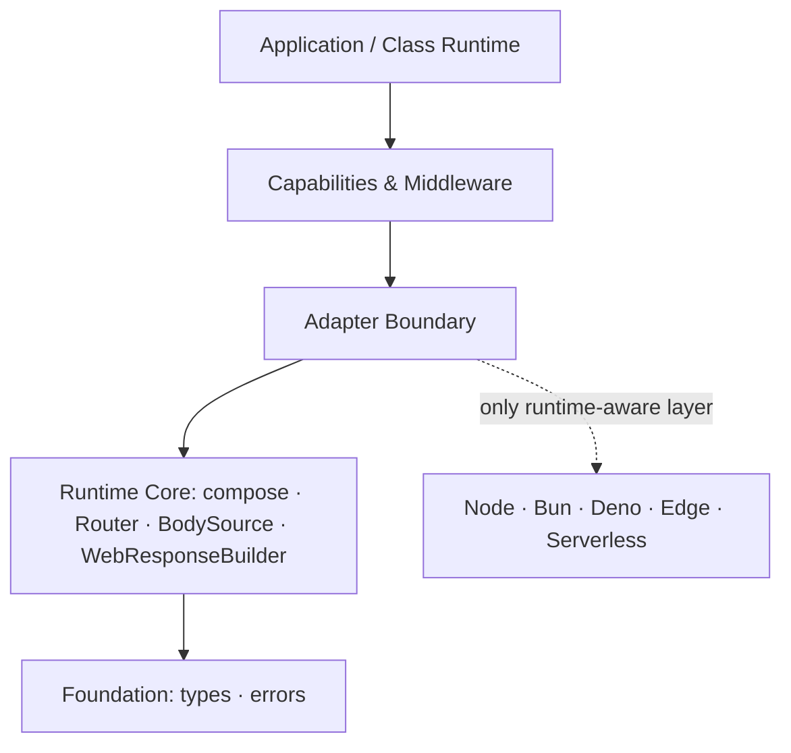
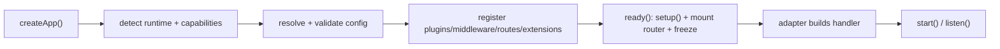
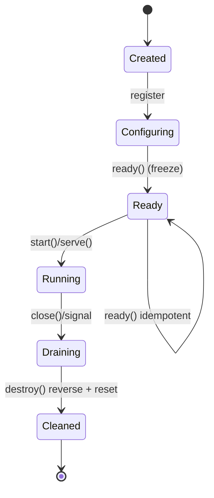
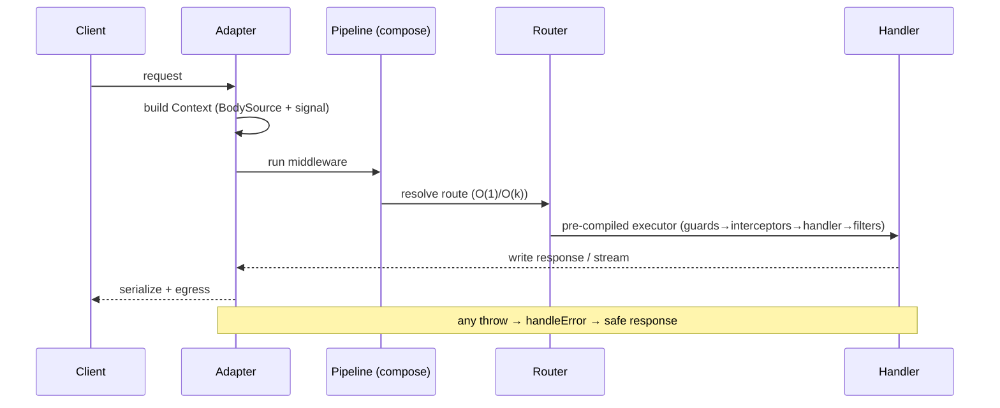
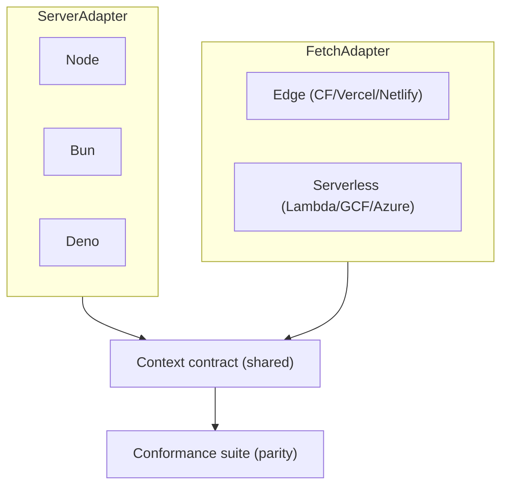
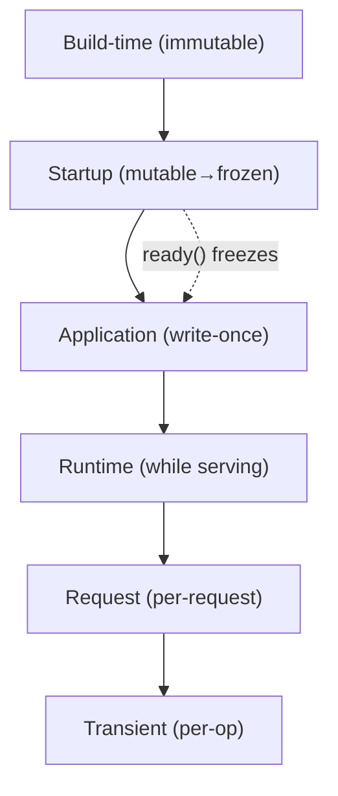
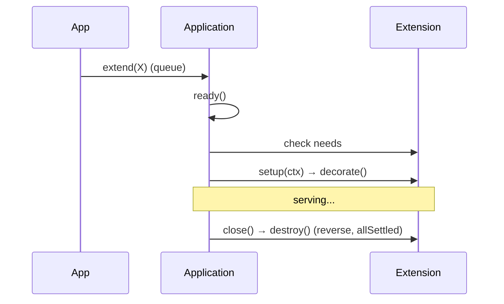
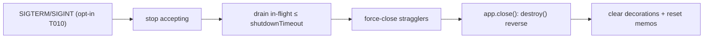
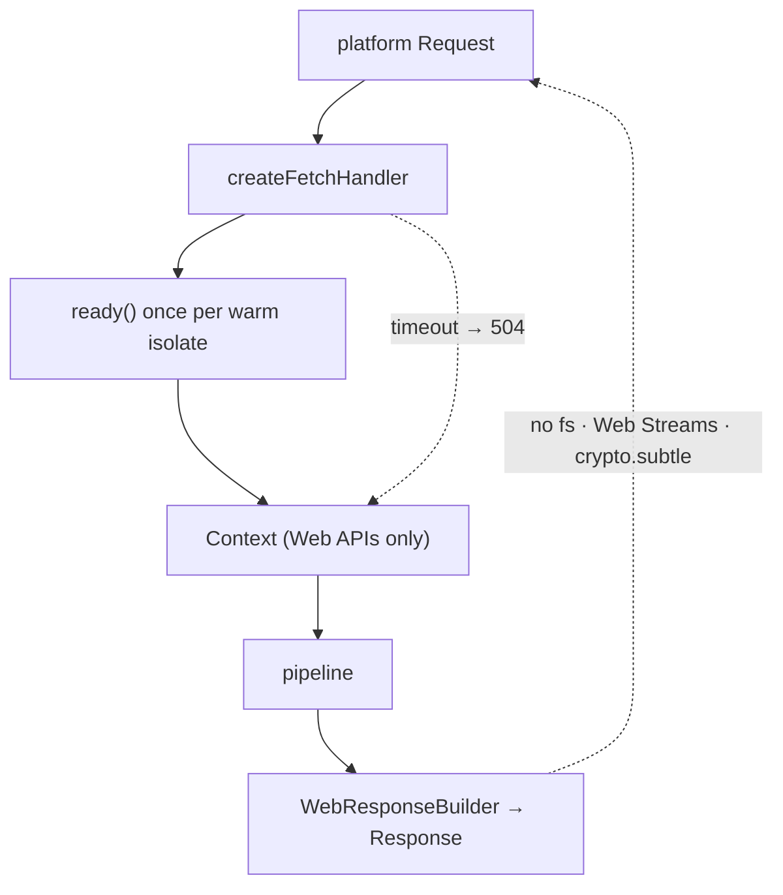
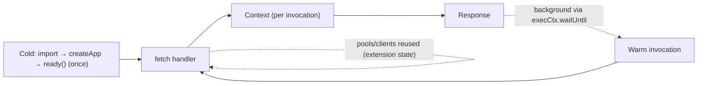

<!--
  NextRush — Runtime Architecture Specification
  Status: AUTHORITATIVE (spec) · Draft v1 · Supersedes ad-hoc runtime design
  This document defines HOW the runtime must work. Implementation follows it, not the reverse.
  Where this spec and the source disagree on CURRENT behavior, the source wins and this doc is corrected.
  Where this spec marks a design [PROPOSED], the spec is the target and the source will follow.
-->

# NextRush — Runtime Architecture Specification

> **Inputs (context, not repeated):** `01-production-readiness-audit.md`, `02-production-roadmap.md`, `03-gap-checklist.md`.
> **This is a specification**, not an audit or an implementation guide. Every future runtime feature MUST conform to it.
> **Provenance tags** used throughout:
> - **[CURRENT]** — verified in today's source; the spec ratifies it.
> - **[FORMALIZED]** — behavior exists informally; this spec makes it a contract.
> - **[PROPOSED]** — not yet in source; this spec is the target design (traceable to a `03-gap-checklist.md` task where applicable).
> **Normative language:** MUST / MUST NOT / SHOULD / MAY per RFC 2119.

---

# Executive Summary

NextRush's runtime is built on one thesis: **the Web Platform is the base runtime; Node.js is an adapter.** The request path speaks `Request`/`Response`/`ReadableStream`/`AbortSignal`/`URL`/`crypto.subtle` and nothing else; every runtime-specific concern lives behind an **adapter** that negotiates **capabilities**. This is already substantially true in the codebase (core packages contain zero `node:` imports) — this spec makes it a permanent, enforced contract rather than an emergent property.

The runtime is defined by five load-bearing decisions:

1. **Web-Platform core, adapters at the edges.** The core never imports a runtime API. Node/Bun/Deno/Edge/Serverless are adapters conforming to one of two contracts. **[CURRENT/FORMALIZED]**
2. **Two-tier adapter model.** `ServerAdapter` (long-lived listeners: Node/Bun/Deno) and `FetchAdapter` (per-invocation `(Request) => Response`: Edge/Serverless) share one `Context` contract validated by a conformance suite. **[CURRENT/FORMALIZED]**
3. **Freeze-after-ready immutability.** Configuration, middleware, routes, and extensions are mutable only until `ready()`; after boot the runtime is an immutable graph executed against a frozen shape. **[CURRENT]**
4. **Explicit context first, ambient context optional.** `ctx` is passed explicitly (edge-safe, allocation-transparent). An `AsyncLocalStorage`-backed ambient accessor is an **opt-in** capability for tracing/correlation, never a core assumption. **[PROPOSED — gap T026]**
5. **A single typed lifecycle bus.** One ordered, typed hook surface (`Before/After` × phase, plus error hooks) replaces ad-hoc callbacks; the existing `extend/ready/close` + extension `setup/destroy` are its first consumers. **[PROPOSED — formalizes the Extension model]**

The runtime is **edge-first and serverless-native by construction**: because the core is Web-Platform-only, edge is not a port — it is the reference target, and Node is the "extra capabilities" case. The spec's job is to keep it that way for ten years and a million dependents.

---

# Vision

**Ten-year invariant:** *one runtime core, many adapters, one context contract.*

- A new JavaScript runtime is supported by writing an adapter that implements a contract and declares its capabilities — **no core change**.
- The request/response hot path allocates nothing it does not need and closes over nothing per request.
- The public runtime API is small enough to hold in your head and frozen enough to depend on for a decade.
- Capability differences (filesystem, Node streams, sockets) are **negotiated, never assumed**: code asks "can this runtime do X?" and degrades or refuses explicitly.
- Observability, identity, and persistence are **capabilities layered on the runtime**, not baked into it — so the core stays tiny and the edge bundle stays small.

The runtime succeeds when a developer can move the same application from a Node server to a Cloudflare Worker to an AWS Lambda by **changing one import** (the adapter) and nothing else.

---

# Design Principles

Each principle is paired with the architectural mechanism that enforces it. A principle without a mechanism is a wish.

| # | Principle | Enforcing mechanism |
|---|---|---|
| 1 | **Runtime independence** | Core packages MUST NOT import `node:*` or reference `process`/`Buffer`/`fs` in runtime code. Enforced by lint + a conformance test (T020). **[CURRENT+PROPOSED]** |
| 2 | **Edge-first design** | The `Context` contract and request path use only WinterCG Minimum Common API. Node-only features are adapter extensions. **[CURRENT]** |
| 3 | **Serverless compatibility** | Stateless request model; app built once per warm instance; `FetchAdapter` is invocation-shaped. **[CURRENT + PROPOSED T038]** |
| 4 | **Node compatibility** | `ServerAdapter` exposes full Node semantics (streams, keep-alive, drain) as an adapter capability, not a core dependency. **[CURRENT]** |
| 5 | **WinterCG compatibility** | Allowed-global allowlist asserted in CI; forbidden Node globals fail the build. **[PROPOSED T020]** |
| 6 | **High performance** | Pre-compiled route executors, index-based middleware dispatch, static-route O(1) fast path, frozen graph. **[CURRENT]** |
| 7 | **Low memory usage** | Frozen empty params, no per-request closures, lazy signal creation, no deep clones in the lifecycle. **[CURRENT]** |
| 8 | **Zero unnecessary allocations** | Hot-path allocation is a review-blocking defect; `combineAbortSignal`/`ctx.signal` created lazily on first access. **[CURRENT]** |
| 9 | **Simple abstractions** | One `Context`, one `Middleware` signature, two adapter contracts, one hook bus. No parallel lifecycles. **[CURRENT/FORMALIZED]** |
| 10 | **Extensibility** | Extension taxonomy: Middleware (~99%) / Registrar (~0.9%) / Extension (~0.1%). **[CURRENT]** |
| 11 | **Long-term maintainability** | Strict layering (`types→errors→core→router→di→class→adapters→middleware`), 300-line file cap, ADR/RFC gate. **[CURRENT]** |
| 12 | **Strong package boundaries** | Lower layers never import higher; cross-package imports via published barrels only; type-only at boundaries. **[CURRENT]** |
| 13 | **Minimal public API** | Every published package guards its export set with a surface snapshot; internals behind `internal.ts`. **[CURRENT (class) + PROPOSED T005 (repo-wide)]** |
| 14 | **Backward compatibility** | Public contract frozen at v1; changes are additive; removals require deprecation window + codemod + migration guide. **[FORMALIZED]** |

**Precedence rule:** when two principles conflict, the order is *correctness → runtime independence → performance → ergonomics*. Performance never justifies importing a runtime API into the core.

---

# Current Runtime Review

*Analysis of why each current decision succeeds or fails against the ten-year bar. Not criticism — cause and effect.*

## What works and MUST remain

| Element | Why it succeeds | Verdict |
|---|---|---|
| **Runtime-agnostic core** (0 `node:` imports in `core/router/runtime/di/stream/errors/types`) | Makes edge the natural target, not a port; the single most valuable property. | **Keep, enforce in CI.** |
| **Capability matrix** (`capabilitiesFor` + `probeCapabilities` fallback) | Turns "which runtime" into "which capabilities" — the correct abstraction for an unknown future runtime. | **Keep, elevate to the negotiation contract.** |
| **`compose()` middleware** (index dispatch, double-`next` guard, sync-throw→rejection) | Correct Koa semantics with no per-request closure chain; hot-path friendly. | **Keep verbatim.** |
| **`Application` lifecycle** (memoized `ready()`/`close()`, freeze-after-boot, `Promise.allSettled` teardown, decorate-collision detection) | Idempotent, race-safe boot/shutdown; immutability eliminates a class of runtime bugs. | **Keep; make the hook bus its extension point.** |
| **`AbortSignal.any` cancellation** (`combineAbortSignal`) | Web-standard, available on all targets (Node ≥20.3/Bun/Deno/Workers); unifies client-disconnect + timeout. | **Keep as the cancellation primitive.** |
| **`BodySource` abstraction** (`AbstractBodySource`/`WebBodySource`/`EmptyBodySource` + limits) | Cross-runtime body reading with size limits at the boundary. | **Keep.** |
| **`WebResponseBuilder` + header safety** | Shared Fetch-API response logic for Bun/Deno/Edge; one code path, four runtimes. | **Keep.** |
| **Conformance suite** (`adapters/conformance`) | Encodes "all adapters behave identically" as executable truth. | **Keep; run on real runtimes (T003/T019).** |
| **Extension taxonomy** (middleware/registrar/extension) | Removed a parallel plugin lifecycle; composition through one seam. | **Keep as the extensibility model.** |

## What should be redesigned or formalized

| Element | Why today's shape limits the future | Redesign |
|---|---|---|
| **Lifecycle surface** — only `extend`/`ready`/`close` + extension `setup`/`destroy` | No granular, ordered, typed hook points for observability/plugins; each cross-cutting concern must wedge into `setup()`. | **Formalize a typed hook bus** (this spec's *Runtime Hooks*). **[PROPOSED]** |
| **Context propagation** — explicit only, no ambient context | Correct and edge-safe, but tracing/correlation/logging must thread `ctx` manually; no `traceparent` propagation seam. | **Add an opt-in `AsyncLocalStorage` accessor** behind a capability flag (T026). **[PROPOSED]** |
| **Configuration** — freeze exists, no validated layer | Env/secret config is ad-hoc; no schema, no fail-fast on missing env. | **Add a validated, immutable config model** (T035). **[PROPOSED]** |
| **Observability** — request-id + logger only | No trace/metric/health seam; enterprises can't instrument the pipeline. | **Define observability hooks + capability** (T025–T028, T011). **[PROPOSED]** |
| **DI default** — global container, opt-in isolation | Global-by-default blocks multi-tenant/warm-reuse isolation. | **Per-app isolation as the v-next default** (T033), behind a major. **[PROPOSED]** |
| **Serverless** — no event adapter | Only fetch-based edge serverless works; classic FaaS needs a bridge. | **`FetchAdapter`-based serverless adapter + container reuse** (T038). **[PROPOSED]** |

## Runtime assumptions today (and their status)

- `process.*` in the core is confined to **runtime detection** and guarded with `typeof process !== 'undefined'`; core middleware explicitly MUST NOT read `process.env`. **[CURRENT — safe]**
- `reflect-metadata` loads **only** on the class path (`nextrush/class`); the functional path is reflection-free. **[CURRENT — good]**
- **ESM-only**; no `require` export condition. **[CURRENT — a deliberate boundary to ratify, not a bug]**
- **Node engine floor ≥ 22.** **[CURRENT — to be justified, T057]**

## Future scalability risks (design-level)

1. **A single flat extension surface** cannot express ordered cross-cutting concerns (tracing must wrap everything) → *hook bus*.
2. **Global DI** hardens into a breaking migration the longer adoption grows → *isolation default flip before mass adoption*.
3. **tsyringe coupling** is a third-party foundation for a first-party guarantee → *own the container* (T050).
4. **Unbounded public surface across ~35 packages** freezes accidental internals at v1 → *repo-wide surface snapshots* (T005).

---

# Runtime Goals

Measurable, enforceable targets this architecture MUST satisfy. Each maps to a validation mechanism.

| Goal | Target | Enforced by |
|---|---|---|
| Core runtime independence | 0 `node:*`/`process`/`Buffer` references in core runtime code | Lint rule + conformance test (T020) |
| Adapter parity | Byte-identical observable behavior across adapters for the shared contract | Conformance suite on real runtimes (T003/T019) |
| Routing complexity | O(1) static, O(k) dynamic (k = path segments) | Router design + benchmark (T017) |
| Boot determinism | `ready()` idempotent; identical graph across re-boots | Existing memoization + tests |
| Public surface stability | Zero unintended export changes post-v1 | Surface snapshots (T005) |
| Edge bundle budget | Minimal functional bundle < platform limit (e.g., CF 1 MB) | Size CI (T012) |
| Cold-start budget | Functional-path cold start within a published budget | Serverless bench (T038/T063) |
| Cancellation correctness | Client disconnect and timeout both abort `ctx.signal` | `combineAbortSignal` + tests |
| Zero hot-path allocation regressions | No new per-request allocation without justification | Perf gate (T018) |

A runtime feature that cannot state its goal in these terms is not ready to be specified.

---

# Runtime Architecture

## The layered model

The runtime is a **strict, acyclic stack**. Every arrow points down; no lower layer knows a higher one exists.

```
┌───────────────────────────────────────────────────────────────┐
│  Application (functional) / Class Runtime (nextrush/class)      │  ← composition
├───────────────────────────────────────────────────────────────┤
│  Middleware · Extensions · Registrars   (capabilities)          │  ← à-la-carte
├───────────────────────────────────────────────────────────────┤
│  ADAPTERS: ServerAdapter | FetchAdapter  (runtime boundary)     │  ← the ONLY runtime-aware layer
├───────────────────────────────────────────────────────────────┤
│  Runtime Core: Application · compose() · Router · BodySource ·  │
│  WebResponseBuilder · Capabilities · Context contract           │  ← Web-Platform-only
├───────────────────────────────────────────────────────────────┤
│  Foundation: @nextrush/types · @nextrush/errors                 │  ← contracts, no logic
└───────────────────────────────────────────────────────────────┘
```

**The invariant that makes this timeless:** the *runtime boundary* is a single, thin layer (adapters). Everything below it is Web-Platform-only and therefore portable by construction; everything above it is capability code that never touches a runtime API directly. A new runtime = one new adapter box, zero changes below or above.

## Two-tier adapter model **[CURRENT/FORMALIZED]**

There are exactly two adapter shapes, because there are exactly two runtime execution models:

| Contract | Execution model | Targets | Owns |
|---|---|---|---|
| **`ServerAdapter`** | Long-lived process, accepts connections | Node, Bun, Deno (self-hosted) | Listen, keep-alive, connection drain, graceful shutdown, socket timeouts |
| **`FetchAdapter`** | Per-invocation `(Request) => Response` | Cloudflare, Vercel Edge, Netlify Edge, Deno Deploy, **[PROPOSED]** Lambda/GCF/Azure | Map platform request→`Context`, per-invocation timeout, no process lifecycle |

Both produce the **same `Context`** and run the **same middleware/route pipeline**. The conformance suite asserts they are observationally identical for the shared contract. This is the structural reason NextRush is edge-first: the `FetchAdapter` is not a downgrade of the Node adapter — they are peers over one core.

## Package relationships

Physical packages map to the layers (see *Mermaid Diagrams → Package Relationships*). The rules:

- `@nextrush/types` and `@nextrush/errors` are pure contracts — importable by anything, importing nothing runtime-aware.
- `@nextrush/core`, `@nextrush/router`, `@nextrush/runtime`, `@nextrush/di`, `@nextrush/stream` are the **runtime core** — Web-Platform-only.
- `@nextrush/adapter-*` are the **only** packages permitted to import `node:*`, `Bun`, `Deno`, or platform globals.
- `@nextrush/class` sits above core as an optional paradigm; it adds reflection but never a runtime API.
- Middleware/extensions are leaves; a Node-coupled middleware (`static`, `multipart` disk, `template` engines, `websocket`) MUST declare itself Node-only (T022).

## Data flow (one sentence)

*A platform request enters an adapter → the adapter builds a `Context` over a `BodySource` and a combined `AbortSignal` → the composed middleware/route pipeline runs → the handler writes to `Context` → the adapter serializes via `WebResponseBuilder` (fetch adapters) or the native response (server adapters) → the adapter drains and cleans up.*

---

# Runtime Components

Each component is specified by **Responsibility · Contract (minimal) · Lifetime · Provenance**. Contracts are intentionally small; a component that needs a large surface is mis-factored.

### Application **[CURRENT]**
- **Responsibility:** own the middleware stack, extension registry, DI container reference, error handler, and the boot/shutdown state machine. Compose the request handler.
- **Contract:** `use()`, `route()`, verb methods, `extend()`, `ready()`, `callback()`, `start()`, `close()`, `setErrorHandler()`, `decorate()` (internal), `logger`, `options`, `container`, `router`.
- **Lifetime:** one per application; mutable until `ready()`, frozen after.
- **Note:** the Application is transport-agnostic — it has no `listen`. Listening is an adapter concern.

### Runtime (`@nextrush/runtime`) **[CURRENT]**
- **Responsibility:** the Web-Platform toolkit shared by all adapters — capability detection, environment detection, `BodySource`, `WebResponseBuilder`, header/IP utilities, cancellation combiner, shared constants, startup-error normalization.
- **Contract:** `detectRuntime()`, `getRuntime()`, `capabilitiesFor()`, `getRuntimeCapabilities()`, `combineAbortSignal()`, `WebResponseBuilder`, `*BodySource`, `resolveClientIp()`, `normalizeStartupError()`, constants.
- **Lifetime:** stateless module (cached detection); process-lifetime.

### Adapter **[CURRENT/FORMALIZED]**
- **Responsibility:** bridge a specific runtime to the core; own everything runtime-specific.
- **Contract:** `ServerAdapter { serve(app, opts): ServerInstance; createHandler(app): Handler }` **or** `FetchAdapter { createFetchHandler(app, opts): (Request, execCtx?) => Response }`. Both build `Context` via a `createXContext()` factory.
- **Lifetime:** the adapter module is process-lifetime; a `ServerInstance` lives from `serve()` to `close()`.

### Context (`ctx`) **[CURRENT]**
- **Responsibility:** the single per-request object — request input, response output, state, cancellation, streaming, runtime introspection.
- **Contract:** `method/url/path/query/headers/ip/params/body` (input); `status/json/send/html/redirect/set/stream/sse/ndjson/sendStream` (output); `throw/assert` (errors); `get/next/state` (control); `raw/runtime/bodySource/signal` (escape/primitives).
- **Lifetime:** one per request; created by the adapter, discarded after the response flushes. MUST NOT be retained past the request.

### Request abstraction **[CURRENT]**
- **Responsibility:** normalize the platform request behind read-only `ctx` accessors + `bodySource`.
- **Contract:** exposed *through* `Context` (`method/url/path/query/headers/ip/body/bodySource`), not as a separate public object. `ctx.raw.req` is the escape hatch.
- **Lifetime:** per request.

### Response abstraction **[CURRENT]**
- **Responsibility:** accumulate status/headers/body and serialize per adapter (native `ServerResponse` on Node; `Response` via `WebResponseBuilder` on fetch adapters).
- **Contract:** through `Context` output methods + `responded` flag; `assertHeaderSafe`/`isBodylessResponse` guard correctness.
- **Lifetime:** per request; write-once semantics (double-response detection).

### Router (`@nextrush/router`) **[CURRENT]**
- **Responsibility:** map method+path → pre-compiled executor. Segment trie + O(1) static-route map.
- **Contract:** `get/post/…/all`, `route()`, `routes(): Middleware`, `getRoutes()` (introspection, off the hot path), `endpoint()` (metadata).
- **Lifetime:** built at registration, sealed at `ready()`; executors compiled once, never per request.

### Middleware **[CURRENT]**
- **Responsibility:** the unit of capability; Koa-style `(ctx, next)`.
- **Contract:** `type Middleware = (ctx, next) => void | Promise<void>`; `compose(middleware[])`.
- **Lifetime:** registered before `ready()`; the composed function is snapshot at compose time.

### Plugin / Registrar **[CURRENT]**
- **Responsibility:** wire a subsystem via a plain function (e.g. `registerControllers`, `registerModule`). ~0.9% of extension needs.
- **Contract:** `registerX(app, opts): void | Promise<void>` — no lifecycle class.
- **Lifetime:** invoked before `ready()`.

### Extension **[CURRENT]**
- **Responsibility:** long-lived, app-scoped service with boot/teardown (~0.1% of needs; e.g. the event bus).
- **Contract:** `Extension<TDecorated> { name; needs?; setup(ctx): void|Promise; destroy?(): void|Promise }`; registered via `app.extend()`, decorates the app typed as `this & TDecorated`.
- **Lifetime:** `setup()` at `ready()`, `destroy()` at `close()` (reverse order).

### Service Container (`@nextrush/di`) **[CURRENT]**
- **Responsibility:** dependency resolution with scopes.
- **Contract:** `register/resolve`, `@Service/@Repository/@Config`, scopes `singleton|transient|request`, child-container isolation.
- **Lifetime:** singleton graph = application-lifetime; request scope = per request (child container); transient = per resolve. **[PROPOSED T033]** per-app isolation becomes default.

### Runtime State **[FORMALIZED]** — see *Runtime State Model*.
### Runtime Metadata **[CURRENT]**
- **Responsibility:** static, introspectable facts — route table (`getRoutes()`), the immutable Application Graph (class runtime), runtime info (`getRuntimeInfo()`), diagnostics.
- **Contract:** read-only; produced at build/boot, never mutated at request time.

### Runtime Events **[PROPOSED]**
- **Responsibility:** decoupled runtime signals (started, request-completed, error, shutdown) for observers.
- **Contract:** built on `@nextrush/events` (the reference Extension); a typed `RuntimeEventMap`. Distinct from Hooks: events are fire-and-forget notifications; hooks are ordered, awaited interception points.

### Runtime Hooks **[PROPOSED]** — see *Runtime Hooks*.
### Runtime Configuration **[CURRENT + PROPOSED]** — see *Configuration Model*.

### Capability Detection **[CURRENT]**
- **Responsibility:** answer "can this runtime do X?" without importing X.
- **Contract:** `RuntimeCapabilities { nodeStreams, webStreams, fileSystem, webSocket, fetch, cryptoSubtle, workers }`; `capabilitiesFor(runtime)` (curated) + `probeCapabilities()` (feature-detected fallback for unknown runtimes).
- **Lifetime:** computed once, cached.
- **Rule:** capability code MUST branch on capabilities, never on `runtime === 'node'`.

### Environment Detection **[CURRENT]**
- **Responsibility:** identify the runtime + platform for adapter selection and edge specialization.
- **Contract:** `detectRuntime(): 'node'|'bun'|'deno'|'deno-deploy'|'cloudflare-workers'|'vercel-edge'|'edge'|'unknown'`; `detectEdgeRuntime()` for platform flags (Cloudflare/Vercel/Netlify).
- **Lifetime:** cached; resettable for tests.

---

# Runtime State Model

State is classified by **owner** and **lifetime**. The rule that prevents an entire class of bugs: *state may only be written during its own phase; later phases read it.* Immutability is the default; mutability is a justified exception.

| Tier | Owner | Written during | Lifetime | Mutability | Examples |
|---|---|---|---|---|---|
| **Build-time state** | Compiler / bundler | build | build only | n/a at runtime | tree-shaken graph, decorator metadata emit, `sideEffects` map |
| **Startup state** | Adapter / bootstrap | before `ready()` | until frozen | mutable → frozen | resolved config, registered middleware/routes/extensions, capability + environment detection |
| **Application state** | `Application` + DI singletons + extension decorations | at `ready()` (`setup()`) | process/app lifetime | write-once at boot, then read-only | `app.events`, singleton services, `app.decorate()` values, the immutable Application Graph |
| **Runtime state** | Adapter / `Application` flags | at `serve()`/`start()` | while serving | controlled (`isRunning`) | server handle, listening address, open-connection set, `_isRunning`/`_isReady` |
| **Request state** | `Context` + request-scoped container | per request | one request | mutable within the request only | `ctx.state`, `ctx.params`, request-scoped service instances, `ctx.signal` |
| **Transient state** | caller | per operation | one call | ephemeral | transient DI instances, per-call buffers |

**Ownership contracts:**
- **Startup → frozen:** after `ready()`, `use/route/extend/setErrorHandler` MUST throw (`assertConfigurable`). This is the boundary between "startup state" and "application state." **[CURRENT]**
- **Application state is write-once:** `decorate()` rejects collisions; singletons resolve once. Re-boot (tests/hot-reload) clears and re-derives. **[CURRENT]**
- **Request state never escapes the request:** retaining `ctx` past the response is a defect. Request-scoped DI lives in a per-request child container discarded at request end. **[CURRENT]**
- **No global mutable runtime state** beyond cached detection (idempotent) and the DI container (whose global-default is being replaced by per-app isolation, T033). **[CURRENT + PROPOSED]**

---

# Runtime Lifecycle

The application moves through **ordered phases**. Each phase has an owner, a permitted set of mutations, and a hook pair (see *Runtime Hooks*). The lifecycle is the same across every adapter; only *who calls it* differs (a `ServerAdapter` calls it inside `serve()`; a `FetchAdapter` calls `ready()` once per warm instance).

```
create → bootstrap → configure → build dependency graph →
register (plugins → middleware → routes → extensions) →
ready (freeze) → start → listen → [serve requests] → shutdown → cleanup
```

| Phase | Owner | What happens | Mutations allowed | Provenance |
|---|---|---|---|---|
| **Application Creation** | user / meta `createApp` | Instantiate `Application`; the `nextrush` meta wires a default router; class path wires a container. | construct | [CURRENT] |
| **Runtime Bootstrap** | adapter | Detect runtime + capabilities; select the code paths. Fire `BeforeBootstrap`/`AfterBootstrap`. | none (read-only detection) | [CURRENT detect] + [PROPOSED hooks] |
| **Configuration** | config layer | Resolve + validate config (env/file/defaults); produce an immutable config object. | build config, then freeze | [CURRENT freeze] + [PROPOSED validation T035] |
| **Dependency Graph** | DI container | Register providers; (class) collect the immutable Application Graph. | register providers | [CURRENT] |
| **Plugin/Registrar Registration** | registrars | `registerControllers`/`registerModule` build routes + register providers; eager DI validation fails fast. | add routes/providers | [CURRENT] |
| **Middleware Registration** | user | `app.use()` in order; order is semantics. | push middleware | [CURRENT] |
| **Route Registration** | router | Routes compiled to executors; static routes into O(1) map. | add routes | [CURRENT] |
| **Extension Registration** | user | `app.extend()` queues extensions (setup deferred). | queue extensions | [CURRENT] |
| **Ready** | `Application.ready()` | Run `needs` checks, `setup()` each extension in order, mount the app router last, **freeze config**. Idempotent + memoized. Fire `BeforeReady`/`AfterReady`. | none after this point | [CURRENT] + [PROPOSED hooks] |
| **Runtime Startup** | adapter | Build the request handler (`callback()`), create the server/handler, apply timeouts, mark `start()`. | none | [CURRENT] |
| **Listening** | `ServerAdapter` only | Bind host/port; normalize startup errors (EADDRINUSE→typed). `FetchAdapter` skips this. | none | [CURRENT] |
| **Serving** | pipeline | Per-request lifecycle (next section). | request state only | [CURRENT] |
| **Shutdown** | adapter → `Application.close()` | Stop accepting; drain in-flight (server) within `shutdownTimeout`, else force-close; `destroy()` extensions in reverse via `allSettled`. Fire `BeforeShutdown`/`AfterShutdown`. | teardown | [CURRENT] + [PROPOSED hooks + signal wiring T010] |
| **Resource Cleanup** | `Application.close()` | Delete decorations, clear extensions, reset memos + router mount so the instance can re-boot. | reset to pre-boot | [CURRENT] |

**Design rule:** every phase is **idempotent or guarded**. `ready()`/`close()` are memoized so concurrent callers (two signal handlers, racing warm invocations) share one boot/one teardown. **[CURRENT]**

---

# Request Lifecycle

The complete path from an incoming platform request to the response leaving the runtime. Identical pipeline across adapters; the only per-adapter difference is request ingestion and response egress.

| Step | Action | Owner | Notes | Provenance |
|---|---|---|---|---|
| 1 | **Ingress** | adapter | `ServerAdapter`: `(req,res)` from `http.createServer`. `FetchAdapter`: a `Request` (+ optional platform `execCtx`). | [CURRENT] |
| 2 | **Signal assembly** | adapter | Combine the platform request signal (client disconnect) with an adapter-owned timeout controller via `combineAbortSignal` → `ctx.signal`. Created **lazily** on first access. | [CURRENT] |
| 3 | **BodySource bind** | adapter | Wrap the body in a `BodySource` (Node stream vs `Request.body`) with a size limit; body is **not** read yet. | [CURRENT] |
| 4 | **Context creation** | adapter (`createXContext`) | Build `ctx`: method/url/path/query/headers/ip/params(empty frozen)/state(fresh)/raw/runtime/bodySource/signal. One allocation, no body read. | [CURRENT] |
| 5 | **`BeforeRequest` hook** | hook bus | Observability/correlation entry point; may attach `ctx.state`. | [PROPOSED] |
| 6 | **Middleware execution** | `compose()` | Index-based dispatch; each middleware may `await next()`. Double-`next` rejects; sync throw → rejection. | [CURRENT] |
| 7 | **Body parsing (if used)** | body-parser middleware | Reads `bodySource`, enforces limit + depth guard, sets `ctx.body`. Only if the app opts in. | [CURRENT] |
| 8 | **Route resolution** | router (mounted last) | Static O(1) map, else segment-trie O(k). Populates `ctx.params`. `BeforeHandler` hook fires. | [CURRENT] + [PROPOSED hook] |
| 9 | **Dependency resolution** | DI (class path) | Controller resolved (memoized singleton) or a fresh request-scoped graph; guards resolved (eagerly validated at boot). | [CURRENT] |
| 10 | **Handler / controller execution** | route executor | Pre-compiled executor runs guards → interceptors(onion) → handler → filters; or the functional handler directly. | [CURRENT] |
| 11 | **Response production** | handler → `Context` | `json/send/html/redirect` or `stream/sse/ndjson`. `AfterHandler` hook fires. Write-once (double-response detected). | [CURRENT] + [PROPOSED hook] |
| 12 | **`BeforeResponse` hook** | hook bus | Last chance to set headers (e.g., `Server-Timing`, `traceparent`). | [PROPOSED] |
| 13 | **Serialization / egress** | adapter | `ServerAdapter`: write to `ServerResponse`. `FetchAdapter`: build `Response` via `WebResponseBuilder` (header-safety asserted, bodyless statuses handled). | [CURRENT] |
| 14 | **Streaming (if used)** | `@nextrush/stream` | `ctx.sendStream(ReadableStream)` / `sse` / `ndjson`; backpressure via Web Streams; `writer.signal` observes disconnect. | [CURRENT] |
| 15 | **Error handling (any step)** | `Application.handleError` | Thrown error → custom handler → default serializer (`writeDefaultErrorResponse`, prod hides stack/message). Handler failures swallowed-and-logged so the request always settles. `Error` hooks fire. | [CURRENT] + [PROPOSED hooks] |
| 16 | **`AfterResponse` / cleanup** | pipeline + adapter | Flush; release request-scoped container; `ctx` becomes garbage. `AfterRequest` hook fires with timing/outcome. No cross-request retention. | [CURRENT] + [PROPOSED hook] |

**Hot-path guarantees (normative):**
- One `Context` allocation per request; `ctx.signal` and any timeout controller are lazy.
- Route executors and the composed middleware function are built **once** at boot, never per request.
- Static routes and empty params allocate nothing (frozen `EMPTY_PARAMS`).
- No middleware runs after the response is committed without an explicit warning (dev) — the pipeline detects a `next()` after commit.

---

# Adapter Contract

The adapter is the **only** runtime-aware layer. Its contract is deliberately narrow so that supporting a new runtime is bounded work.

## The two contracts **[CURRENT/FORMALIZED]**

```
// Long-lived listener (Node, Bun, Deno self-hosted)
interface ServerAdapter<App, Opts, Instance> {
  serve(app: App, opts?: Opts): Promise<Instance>;   // ready() → build handler → listen → return control
  createHandler(app: App): PlatformHandler;           // for embedding in an existing server
}

// Per-invocation (Edge, Serverless)
interface FetchAdapter<App, Opts> {
  createFetchHandler(app: App, opts?: Opts): (request: Request, execCtx?: unknown) => Promise<Response>;
}
```

Both are validated by a **compile-time conformance guard** (an unused typed const proving the module implements the shape) and the **runtime conformance suite**. Adapters MUST NOT widen `Context`; they MAY expose adapter-specific options.

## Responsibilities (every adapter)

1. **Ingest** the platform request; **build `Context`** via a `createXContext()` factory over a `BodySource` and a combined `AbortSignal`.
2. **Run** `app.callback()` (the composed pipeline) — never re-implement middleware/routing.
3. **Egress** the response: native writer (server) or `WebResponseBuilder` (fetch).
4. **Own runtime specifics**: timeouts, keep-alive, drain, signal sources, error normalization.
5. **Declare capabilities** it relies on; **negotiate** the rest.

## Lifecycle by adapter type

- **`ServerAdapter`:** `serve()` → `await app.ready()` → `createHandler` → create server → set `server.timeout`/`keepAliveTimeout` → `listen` (normalize startup errors) → `app.start()` → return `{ server, address, close }`. `close()` drains within `shutdownTimeout`, force-closes stragglers, then `app.close()`. **[CURRENT]**
- **`FetchAdapter`:** `createFetchHandler()` → `await app.ready()` **once per warm instance** → return the fetch function; each invocation builds a `Context`, runs the pipeline, returns a `Response`; optional per-invocation `timeout` races to a 504. No listen/drain phase. **[CURRENT]**

## Required vs optional capabilities

| Capability | ServerAdapter | FetchAdapter | If absent |
|---|---|---|---|
| Build `Context` from platform request | Required | Required | not an adapter |
| Run composed pipeline unchanged | Required | Required | not conformant |
| `AbortSignal` for cancellation | Required | Required | degrade: no cancellation (log) |
| Web `ReadableStream` egress | Required (via Node bridge) | Required | streaming disabled |
| Connection drain / keep-alive | Required | N/A | — |
| Filesystem | Optional (Node/Bun) | Absent (edge) | fs-dependent middleware refuse |
| Node streams | Optional | Absent | use Web Streams |
| Platform `execCtx.waitUntil` | N/A | Optional | best-effort background work skipped |

## Feature detection & capability negotiation **[CURRENT + FORMALIZED]**

- Detection is **passive** (`detectRuntime`, `capabilitiesFor`, `probeCapabilities`) and cached.
- **Negotiation contract:** capability code calls `getRuntimeCapabilities()` and either (a) uses the capability, (b) degrades gracefully, or (c) refuses with a clear error. Code MUST NOT switch on `runtime === 'x'` for capability decisions — only for genuinely platform-specific *optimizations*.
- **Unknown runtimes** get `probeCapabilities()` (feature-detected), so a future runtime that supports the Web Platform works with **no code change** — the ten-year guarantee in one function.

## Per-adapter matrix

| Adapter | Contract | Status | Owns |
|---|---|---|---|
| **Node** | `ServerAdapter` | [CURRENT] | `http.createServer`, drain, timeouts, `IncomingMessage`/`ServerResponse` bridge |
| **Bun** | `ServerAdapter` | [CURRENT] | `Bun.serve`, Web-native req/res |
| **Deno** | `ServerAdapter` | [CURRENT] | `Deno.serve`, permissions, `deno.d.ts` typing |
| **Edge** | `FetchAdapter` | [CURRENT] | `createFetchHandler` + Cloudflare/Vercel/Netlify variants, timeout→504 |
| **Serverless** | `FetchAdapter` | [PROPOSED T038] | event→`Request` (APIGW v1/v2, Lambda URL, GCF, Azure), container reuse |
| **Future (e.g., new JS runtime)** | either | [PROPOSED] | implement the contract + declare capabilities; zero core change |

---

# Runtime Hooks **[PROPOSED — formalizes the Extension model]**

Today the only interception points are extension `setup()`/`destroy()` and the error handler. This spec defines a **single, typed, ordered hook bus** so observability, plugins, and cross-cutting concerns attach without wedging into `setup()`. Hooks are **awaited, ordered interception points**; *events* (separate) are fire-and-forget notifications.

## Hook set and timing

| Hook | Fires | Phase | Can | Async |
|---|---|---|---|---|
| `BeforeBootstrap` | before runtime/capability detection | Bootstrap | inspect raw options | ✓ |
| `AfterBootstrap` | after detection, before config | Bootstrap | read capabilities/environment | ✓ |
| `BeforeReady` | before extension `setup()` runs | Ready | register last-minute providers | ✓ |
| `AfterReady` | after freeze, before serving | Ready | warm caches, assert invariants | ✓ |
| `BeforeRequest` | per request, before middleware | Serving | seed `ctx.state`, start trace span | ✓ |
| `BeforeHandler` | after route resolved, before handler | Serving | authz context, span attributes | ✓ |
| `AfterHandler` | handler returned, before egress | Serving | shape result, record timing | ✓ |
| `BeforeResponse` | before serialization | Serving | set headers (`traceparent`, `Server-Timing`) | ✓ |
| `AfterResponse` | after flush | Serving | end span, emit metrics | ✓ (non-blocking egress) |
| `AfterRequest` | request fully settled | Serving | cleanup, final timing/outcome | ✓ |
| `BeforeShutdown` | on shutdown signal, before drain | Shutdown | stop intake, flush buffers | ✓ |
| `AfterShutdown` | after teardown complete | Shutdown | final flush of telemetry | ✓ |
| `onError` | any thrown error, per phase | all | observe/transform (not swallow) | ✓ |

## Rules

- **Ordering is registration order**, per phase (same discipline as extensions/middleware). No implicit priority.
- **Hooks are awaited**; a slow hook slows the phase — this is intentional (back-pressure, not fire-and-forget). Fire-and-forget belongs to *Runtime Events*.
- **A throwing hook** routes to `onError` for its phase; it MUST NOT silently corrupt the phase. Request-phase hook errors become request errors; boot-phase hook errors fail boot (fail-fast).
- **Hooks never mutate frozen state.** `Before/AfterReady` are the last writable points; serving-phase hooks touch only request state.
- **Zero-cost when unused:** an empty hook list is a no-op branch on the hot path (no allocation, no iteration cost beyond a length check).

---

# Plugin Architecture

NextRush's extensibility is a **taxonomy, not a single plugin class** — the decision that removed a parallel lifecycle. **[CURRENT]**

| Tier | Share | Mechanism | Lifecycle | Use when |
|---|---|---|---|---|
| **Middleware** | ~99% | `app.use(fn)` | compose-time snapshot | request-scoped behavior |
| **Registrar** | ~0.9% | `registerX(app, opts)` (plain fn) | invoked pre-`ready()` | wiring a subsystem (controllers, modules) |
| **Extension** | ~0.1% | `app.extend(ext)` | `setup()`@ready / `destroy()`@close | long-lived app-scoped service (event bus) |

## Lifecycle & registration **[CURRENT]**
- Extensions are **queued** by `extend()` (synchronous, chainable); `setup()` runs at `ready()` in registration order; `destroy()` at `close()` in reverse.
- Registration is **frozen after `ready()`** — no dynamic plugin loading into a running app (a deliberate constraint for determinism; dynamic behavior belongs to middleware).

## Dependencies & ordering **[CURRENT]**
- Extensions declare `needs: string[]`; boot fails fast if a dependency was never registered (distinct message) or is registered out of order.
- **No auto-sort:** registration order is the contract. Explicit ordering beats implicit topological magic for debuggability.

## Isolation **[CURRENT + PROPOSED]**
- Extensions `decorate()` the app under a unique name; collisions throw. **[CURRENT]**
- **DI isolation:** providers currently register on a shared container by default; opt-in per-app isolation exists. This spec makes **per-app isolation the default** at the next major (T033) so a plugin cannot read/replace another app's services. **[PROPOSED]**
- **Module encapsulation** (`@Module.exports` enforced) gives provider-level isolation within an app. **[PROPOSED T032]**

## Error handling **[CURRENT]**
- A failing `setup()` fails boot (fail-fast, before serving traffic).
- A failing `destroy()` never strands siblings (`Promise.allSettled`); errors are collected and returned from `close()`.
- Plugin request-time errors propagate through the normal request error model — plugins get no special error channel.

## Version compatibility **[FORMALIZED]**
- Extensions target the `Extension`/`ExtensionContext` contract in `@nextrush/types`; that contract is part of the frozen v1 surface.
- Additive-only evolution: new optional hook fields/capabilities MAY be added; existing fields MUST NOT change meaning. A breaking extension-contract change requires a major + migration guide.

---

# Configuration Model

Configuration is **immutable after `ready()`, validated at the boundary, and layered with explicit precedence.** **[CURRENT freeze · PROPOSED validation T035]**

## Layering & precedence (highest wins)

```
explicit code overrides  >  environment variables  >  config file  >  framework defaults
```

- **Defaults** are declared in code (e.g., `DEFAULT_TIMEOUT_MS`, `DEFAULT_SHUTDOWN_TIMEOUT_MS`, `DEFAULT_KEEP_ALIVE_TIMEOUT_MS`, `DEFAULT_BODY_LIMIT`) — a single source of truth per value (the spec forbids copy-pasted defaults across adapters). **[CURRENT]**
- **Environment** and **file** layers are read and coerced through a **Standard Schema** validator (reuse `@nextrush/validation` infra); missing/invalid required values **fail boot** with an actionable message. **[PROPOSED T035]**
- **Code overrides** (`createApp(options)`, adapter options) are the final say.

## Lifecycle

1. **Resolve** all layers → a plain object. 2. **Validate** against a schema (types, ranges, required). 3. **Freeze** into an immutable config exposed to the app, adapters, and extensions. 4. **Read-only thereafter** — no runtime reconfiguration; a config change means a re-boot (or a new warm instance in serverless).

## Rules

- **No magic literals** in runtime code; every tunable is a named default (steering §Configuration). **[CURRENT]**
- **Secrets never logged;** the config layer redacts known-secret keys in any diagnostic dump. **[PROPOSED T035]**
- **Feature flags** are config values with defaults; a flag that gates a capability MUST also check the corresponding runtime capability (a flag cannot enable filesystem on the edge).
- **Environment detection ≠ configuration:** runtime/platform detection is automatic and cached; it feeds adapter selection, not user config.

---

# Error Model

Errors are classified by **phase**, because the correct response differs by phase: a boot error must **fail fast and loud**; a request error must **isolate to the request and never leak internals**.

| Class | Origin | Strategy | Response | Provenance |
|---|---|---|---|---|
| **Startup errors** | listen/bind, bad config, missing dep | **Fail fast**, do not serve | Typed `ServerStartError` (`normalizeStartupError`: EADDRINUSE, EACCES, …); process exits non-zero | [CURRENT] |
| **Bootstrap/plugin errors** | extension `setup()`, eager DI validation | **Fail fast** before traffic | Typed DI errors (`DependencyResolutionError`/`CircularDependencyError`) surfaced at boot, not first request | [CURRENT] |
| **Request errors** | middleware/handler/guard throws | **Isolate**; map to HTTP | `HttpError` hierarchy → status; prod hides stack + message unless `error.expose` | [CURRENT] |
| **Adapter errors** | serialization, socket, egress | **Contain**; never crash the process | Log + 500 if headers not sent; drop if already committed | [CURRENT] |
| **Shutdown errors** | extension `destroy()` | **Collect, never strand** | `Promise.allSettled` → `close()` returns `Error[]` | [CURRENT] |
| **Hook errors** | any runtime hook | **Route to phase `onError`** | boot-phase → fail boot; request-phase → request error | [PROPOSED] |

## Guarantees (normative)

- **The default error handler cannot itself crash the request:** handler failures are swallowed-and-logged so a request always settles (never rejects out of `callback()` into the adapter). **[CURRENT]**
- **One error serializer:** core and `@nextrush/errors` share `writeDefaultErrorResponse` — the default response shape cannot drift. **[CURRENT]**
- **Production leak prevention:** internal paths, stack traces, and package structure MUST NOT appear in production error responses. `expose` opt-in per error. **[CURRENT]**
- **Recovery strategy is explicit, never silent:** no empty `catch {}`. A caught error is logged, re-thrown, or mapped — one of the three, always.
- **Cancellation is not an error:** an aborted `ctx.signal` (client disconnect / timeout) unwinds cooperatively; handlers observe `signal`, streams stop, and the request settles without a 500.

---

# Observability

Observability is a **capability layered on the hook bus**, not core logic — keeping the core tiny and the edge bundle small. **[PROPOSED T011/T025–T028]** on top of **[CURRENT]** logging + request-id.

## The seam

- **Context propagation:** an **opt-in** `AsyncLocalStorage`-backed ambient accessor (T026) carries correlation/trace context so logs and spans correlate without threading `ctx` through every function. Off by default (edge-safe, zero-cost); enabled by the OTel/logging capability. Explicit `ctx` remains the primary model.
- **Hook-driven instrumentation:** tracing/metrics attach at `BeforeRequest`/`BeforeHandler`/`AfterHandler`/`AfterResponse`/`AfterRequest` — no core changes to add a new observability backend.

## Pillars

| Pillar | Design | Package |
|---|---|---|
| **Logging** | Pluggable `Logger` (no-op default; `console`/pino/winston); structured; never logs secrets. | core `Logger` [CURRENT] + `@nextrush/logger` |
| **Request IDs** | Generated/propagated per request; on `ctx.state` + response header. | `@nextrush/request-id` [CURRENT] |
| **Correlation IDs** | Extracted from inbound headers (or generated), propagated downstream + into logs/spans via the ambient accessor. | [PROPOSED T026] |
| **Metrics** | RED (rate/errors/duration) with **low-cardinality** route labels from route metadata; `/metrics` endpoint. | `@nextrush/metrics` [PROPOSED T027] |
| **OpenTelemetry** | Server spans; W3C `traceparent` extract/inject; span attributes from `endpoint()` metadata; exporter-agnostic. | `@nextrush/otel` [PROPOSED T025] |
| **Timing** | Per-stage durations via hooks; optional `Server-Timing` header. | hook bus [PROPOSED] |
| **Diagnostics** | Opt-in, dev-time introspection: route table, provider graph, circular deps, boot timings. | class `getClassDiagnostics` [CURRENT] |
| **Profiling** | Not built-in; the runtime exposes hook timing + `ctx.signal`; profiling is a runtime-native tool concern (Node `--prof`, Workers tracing). | — |
| **Health** | Liveness/readiness endpoints + check registry for orchestrators. | `@nextrush/health` [PROPOSED T011] |

## Rules

- Observability MUST be **removable** — an app that installs none pays zero runtime cost (empty hook lists, no ambient context).
- Metric label cardinality MUST be bounded (route templates, not raw paths with params).
- Trace-context propagation MUST use W3C `traceparent`/`tracestate` (interop with the wider ecosystem), never a bespoke header.

---

# Edge Runtime Design

Edge is the **reference target**, not a port. The design principle: *if the core needs an API the edge lacks, the core is wrong.*

## Supported APIs (the allowed surface)

The request path uses **only** the WinterCG Minimum Common Web Platform API:

| API | Use | Provenance |
|---|---|---|
| `Request` / `Response` | ingress/egress on `FetchAdapter` | [CURRENT] |
| `ReadableStream` / `WritableStream` | streaming bodies (`ctx.sendStream`, SSE, NDJSON) | [CURRENT] |
| `AbortController` / `AbortSignal` / `AbortSignal.any` | cancellation (`ctx.signal`) | [CURRENT] |
| `URL` / `URLSearchParams` | path/query parsing | [CURRENT] |
| `crypto` / `crypto.subtle` | hashing, JWT, signing (edge-portable) | [CURRENT probe · PROPOSED jwt T030] |
| `TextEncoder`/`TextDecoder`, `Headers`, `structuredClone`, timers | utilities | [CURRENT] |

## Unsupported / forbidden on edge (adapter-only)

`node:fs`, `node:net`/`tls`, `node:http`, `node:worker_threads`, `Buffer` (use `Uint8Array`), synchronous filesystem, persistent local disk, long-lived background timers past the invocation. Any package needing these is **Node-only** and MUST declare it (T022). Node-coupled today: `@nextrush/static`, `@nextrush/multipart` (disk), `@nextrush/template` engines, `@nextrush/websocket`.

## Runtime limitations to design around

- **No filesystem** (Deno Deploy, Workers): static assets come from the platform/KV, not `fs`.
- **CPU/time limits** (Workers ~30 s CPU; Vercel Edge ~25 s wall): the edge adapter's per-invocation `timeout` returns **504** before the platform kills the isolate. **[CURRENT]**
- **Bundle-size limits** (Workers 1 MB): see below.
- **Cold isolates**: no warm-up guarantees; `import 'reflect-metadata'` (class path) mutates global `Reflect` per isolate — the functional path avoids it entirely.

## Bundle optimization (normative)

- The functional entry MUST be reflect-metadata-free and tree-shakeable (`sideEffects: false`); a size test asserts it (T012/T023).
- Middleware are separate packages → import only what a route needs.
- The edge adapter documents the "import core + adapter-edge only" minimal path.
- **Budget:** the minimal functional edge bundle MUST stay under the tightest platform limit (CF 1 MB) with headroom; CI enforces it (T012).

---

# Serverless Runtime Design

Serverless is the `FetchAdapter` model plus an **invocation/warm-instance discipline**. The runtime is built once per warm container and reused across invocations.

## Cold start vs warm container

```
Cold:  import modules → createApp() → register → await ready() (once)  ── then ──►  invoke
Warm:  (skip all above)                                                            invoke
```

- **Build once, serve many:** `app` and `await app.ready()` run at module scope (or a memoized `let app; app ??= await build()`), so warm invocations skip boot entirely. **[CURRENT model · PROPOSED recipe/adapter T038]**
- **Cold-start budget:** the DI-free functional path is the low-cold-start default; the class path's reflect-metadata + eager DI cost is disclosed (T017) and opt-in.

## Stateless execution

- No cross-invocation mutable request state; `ctx` and request-scoped DI are per invocation and discarded.
- Application state (singletons, extension decorations) is safe to reuse across warm invocations **iff** it is genuinely stateless or intentionally cached — the runtime does not create hidden per-request singletons.

## Startup optimization & lazy loading

- Heavy/optional subsystems (DB clients, template engines) are lazy-initialized on first use, not at import.
- `ready()` is memoized so concurrent warm invocations racing the first request share one boot.

## Resource reuse & shutdown

- Connection pools/clients created at `setup()` persist across warm invocations (extension state).
- **Shutdown on serverless is best-effort:** platforms may freeze/thaw rather than signal; `AfterShutdown`/`destroy()` run on genuine teardown, and long-lived flushes should use the platform's `execCtx.waitUntil` when available.

## Adapter surface **[PROPOSED T038]**

`@nextrush/adapter-serverless`: event→`Request` mappers for APIGW v1/v2, Lambda Function URL (response streaming), GCF, Azure; a documented container-reuse pattern; one verified example + cold-start benchmark per provider.

---

# Future Runtime Strategy

The architecture is designed so each future capability is **additive within an existing seam**, never a re-architecture.

| Future capability | How it lands | Seam | New core change? |
|---|---|---|---|
| **New JS runtime** | New adapter implementing `ServerAdapter`/`FetchAdapter`; `probeCapabilities()` handles it if Web-standard | Adapter contract | **No** |
| **Multiple runtimes in one app** | Per-target builds selecting the adapter; shared app code | Adapter contract | No |
| **AI / agentic workloads** | Already served by `@nextrush/stream` (SSE/NDJSON) + `ctx.signal` for cancellation of long generations | Streaming + cancellation | No |
| **Streaming (advanced)** | Web Streams backpressure is the model; transforms compose | `@nextrush/stream` | No |
| **WebSockets (edge-native)** | New capability package using `WebSocketPair`/Durable Objects (Node WS stays a `ServerAdapter` capability) | Capability pkg (T024) | No core change |
| **HTTP/3 / QUIC** | A `ServerAdapter` concern (Node/Bun/Deno HTTP/3 servers) — the `Context` contract is transport-agnostic | Adapter | **No** (contract already transport-agnostic) |
| **Workers / worker threads** | Adapter/capability: parallelism is negotiated (`capabilities.workers`), never assumed | Capability | No |
| **Distributed execution** | Hooks + events emit the signals a scheduler/mesh needs; state stays request-scoped or externalized (cache/queue) | Hook bus + events + `@nextrush/cache`/`queue` | No |

**The strategic bet:** by keeping the `Context` contract transport- and runtime-agnostic and pushing every runtime concern into adapters + capabilities, the set of "things that force a core change" shrinks to near zero. That is what makes the design plausibly correct in ten years.

---

# Architectural Decision Records

Each ADR: **Decision · Context · Alternatives · Why rejected · Trade-offs · Long-term impact.**

### ADR-R1 — The Web Platform is the base runtime; Node is an adapter
- **Decision:** The runtime core depends only on Web-standard APIs; all runtime-specific code lives in adapters.
- **Context:** Core packages already contain zero `node:` imports; edge must be first-class.
- **Alternatives:** (a) Node-first core with an edge "compatibility layer"; (b) two separate cores.
- **Why rejected:** (a) makes edge a perpetual second-class port and leaks Node assumptions; (b) doubles maintenance and drifts.
- **Trade-offs:** Node-specific optimizations must be expressed as adapter capabilities, not core shortcuts.
- **Long-term impact:** A new Web-standard runtime works with no core change — the central ten-year guarantee.

### ADR-R2 — Two adapter contracts, not one
- **Decision:** `ServerAdapter` (long-lived) and `FetchAdapter` (per-invocation) over one `Context`.
- **Context:** Servers and edge/serverless have fundamentally different execution models; one interface can't honestly model both.
- **Alternatives:** (a) One universal adapter; (b) per-platform bespoke integrations.
- **Why rejected:** (a) forces a lowest-common-denominator that fits neither; (b) explodes surface + kills portability.
- **Trade-offs:** Two contracts to learn — but each is tiny and the `Context` is shared.
- **Long-term impact:** New targets slot into exactly one contract; conformance proves parity.

### ADR-R3 — Explicit context first; ambient context is opt-in
- **Decision:** `ctx` is passed explicitly; an `AsyncLocalStorage` ambient accessor is an opt-in capability.
- **Context:** Tracing/correlation want ambient context; edge/perf want zero hidden cost.
- **Alternatives:** (a) ALS always-on; (b) never offer ambient context.
- **Why rejected:** (a) imposes a runtime assumption + overhead on everyone (edge, hot path); (b) makes tracing ergonomically painful.
- **Trade-offs:** Two ways to read context; mitigated by "explicit is default, ambient is a documented capability."
- **Long-term impact:** Observability scales without taxing apps that don't use it.

### ADR-R4 — Freeze after `ready()`
- **Decision:** Config/middleware/routes/extensions are immutable after boot; the runtime executes a frozen graph.
- **Context:** Mutable-at-runtime frameworks suffer order-dependent, non-deterministic bugs.
- **Alternatives:** Hot-reconfigurable runtime.
- **Why rejected:** Determinism + performance (snapshot once) outweigh the rare need to reconfigure live; reconfiguration = re-boot / new warm instance.
- **Trade-offs:** No live plugin loading; deliberate.
- **Long-term impact:** The runtime is reasoned about as a pure function of its frozen shape.

### ADR-R5 — Extension taxonomy over a plugin class
- **Decision:** Middleware (~99%) / Registrar (~0.9%) / Extension (~0.1%); no `Plugin` lifecycle class.
- **Context:** A plugin lifecycle became a parallel machinery to middleware.
- **Alternatives:** A formal plugin system (NestJS/Fastify style).
- **Why rejected:** Most "plugins" are just middleware or a function; a lifecycle class is ceremony for the 99% case.
- **Trade-offs:** The rare long-lived service uses `Extension`; users must pick the right tier (documented).
- **Long-term impact:** One composition model; features compose through it (lifecycle hooks reuse the Extension seam).

### ADR-R6 — Capability negotiation over runtime branching
- **Decision:** Code branches on `RuntimeCapabilities`, not on `runtime === 'x'` (except platform-specific optimizations).
- **Context:** Runtime identity is a poor proxy for what a runtime can do; future runtimes are unknown.
- **Alternatives:** Switch on runtime name everywhere.
- **Why rejected:** Name-switching breaks on every new runtime and mishandles capable-but-unrecognized ones.
- **Trade-offs:** A capability matrix to maintain; `probeCapabilities()` covers unknowns.
- **Long-term impact:** Graceful, correct behavior on runtimes that don't exist yet.

### ADR-R7 — A single typed hook bus **[PROPOSED]**
- **Decision:** One ordered, typed `Before/After` × phase (+ error) hook surface for all cross-cutting concerns.
- **Context:** Only `setup/destroy` + error handler exist; observability must wedge in.
- **Alternatives:** (a) Ad-hoc per-feature callbacks; (b) an event emitter for everything.
- **Why rejected:** (a) sprawls and can't order; (b) events are fire-and-forget — interception needs awaited ordering.
- **Trade-offs:** A new concept; kept zero-cost when unused.
- **Long-term impact:** Observability/security/plugins attach without core edits.

### ADR-R8 — ESM-only
- **Decision:** Publish ESM only; no `require` condition.
- **Context:** All packages are `type: module`; the ecosystem is ESM-forward in 2026.
- **Alternatives:** Dual CJS/ESM publish.
- **Why rejected:** Dual-publish doubles build/test surface and invites dual-package hazards; ESM-only is a clean, defensible boundary.
- **Trade-offs:** Excludes `require()` consumers (documented; revisited in T051 if demand warrants).
- **Long-term impact:** Simpler builds, smaller surface; aligns with runtime + tooling direction.

### ADR-R9 — Own the DI container; per-app isolation by default **[PROPOSED]**
- **Decision:** Replace the tsyringe wrapper with an in-house container (T050) and make per-app isolation the default (T033).
- **Context:** DI is a first-party guarantee built on a third-party, low-activity dependency with a global-by-default model.
- **Alternatives:** Keep tsyringe; keep global default.
- **Why rejected:** A tsyringe break is a framework-level incident; global default blocks multi-tenant/warm-reuse isolation and hardens into a breaking migration with adoption.
- **Trade-offs:** Implementation cost + a major-version migration; preserve the public DI surface to bound breakage.
- **Long-term impact:** Restores a true zero-runtime-dependency story and safe multi-app isolation.

### ADR-R10 — Legacy decorator dialect, with a documented exit
- **Decision:** Stay on `experimentalDecorators` + `emitDecoratorMetadata` for v1; isolate reflection behind one boundary; publish the TC39 migration trigger.
- **Context:** DI parameter injection depends on `design:paramtypes`; TC39 standard decorators don't emit it.
- **Alternatives:** Adopt standard decorators now.
- **Why rejected:** Standard decorators can't yet power constructor-type reflection tsyringe/DI needs; migrating now breaks all class users for no gain.
- **Trade-offs:** A dependency on a "deprecated" TS flag; contained by isolating reflection to one module.
- **Long-term impact:** A controlled, single-seam migration when/if TC39 support lands — not a rewrite.

---

# Mermaid Diagrams

### 1 — Runtime Architecture



### 2 — Package Relationships

```mermaid
graph LR
  types --> errors --> core --> router --> di --> class
  core --> runtime
  class --> adapters
  runtime --> adapters
  adapters --> middleware
  class -. "reflect-metadata" .-> class
```

### 3 — Runtime Initialization



### 4 — Application Lifecycle



### 5 — Request Lifecycle



### 6 — Adapter Architecture



### 7 — Runtime State



### 8 — Plugin Lifecycle



### 9 — Shutdown Flow



### 10 — Edge Runtime



### 11 — Serverless Runtime



---

# Migration Strategy

This spec is mostly **ratification** (the core already embodies most of it) plus a bounded set of **additive** changes and one **major-gated** cluster. Sequenced to match `03-gap-checklist.md`.

| Stage | Change | Nature | Gap tasks |
|---|---|---|---|
| **0 — Ratify & enforce** | Lint/conformance for the Web-Platform-only invariant; repo-wide surface snapshots; accuracy fixes | Non-breaking | T001, T002, T005, T020 |
| **1 — Prove** | Multi-runtime CI (real Bun/Deno/workerd); edge on real runtimes | Non-breaking | T003, T019, T021 |
| **2 — Operate** | Signal-wired graceful shutdown; hook bus; observability seam (ALS opt-in, OTel/metrics/health) | Additive | T010, T026, T025, T027, T011, T028 |
| **3 — Configure & secure** | Validated immutable config; identity capabilities | Additive | T035, T030, T029, T031 |
| **4 — Serverless** | `FetchAdapter`-based serverless adapter + container-reuse | Additive (new package) | T038 |
| **5 — Major-gated** | Per-app DI isolation default; own the container (drop tsyringe); module encapsulation; shim removal | **Breaking** — one coordinated major | T033, T050, T032, T053 |

**Rules:** each breaking item ships with a changeset, a `docs/migrations/*` guide, a codemod where mechanical, and a deprecation window. Batch the Stage-5 breaking changes into **one** major to minimize churn. Nothing in Stages 0–4 breaks existing apps.

**Compatibility guarantee:** the `Context`, `Middleware`, `Extension`, and adapter contracts are the frozen v1 surface. The hook bus and observability are **additive** to them — an app using neither is unaffected and pays zero cost.

---

# Runtime Blueprint

The one-page canonical shape. If a future change contradicts this blueprint, either the change is wrong or this spec must be amended by ADR — never silently diverged from.

**Core thesis:** *Web Platform is the base; Node is an adapter; capabilities are negotiated; the graph is frozen after `ready()`.*

**Contracts (frozen at v1):**
- `Context` — one per request, Web-Platform-shaped, discarded after response.
- `Middleware = (ctx, next) => void | Promise<void>` — composed once at boot.
- `ServerAdapter` | `FetchAdapter` — the only runtime-aware layer; conformance-verified parity.
- `Extension<T>` + registrar functions — the extensibility taxonomy.
- `RuntimeCapabilities` — the negotiation surface for present + future runtimes.

**Invariants (MUST hold forever):**
1. Core packages import no runtime API (`node:*`/`process`/`Buffer`/`Bun`/`Deno`). 
2. Adapters never re-implement middleware/routing; they build `Context` and run `app.callback()`.
3. Configuration/routes/middleware/extensions are immutable after `ready()`.
4. The hot path allocates one `Context`, compiles executors once, and closes over nothing per request.
5. Capability code branches on capabilities, not runtime identity.
6. Production error responses never leak internals; the default handler never crashes the request.
7. Observability/identity/persistence are removable capabilities, not core logic.

**Lifecycle:** `create → bootstrap → configure → graph → register → ready(freeze) → start → listen → serve → shutdown → cleanup`, each phase idempotent-or-guarded, each with a `Before/After` hook.

**Extensibility:** Middleware (99%) · Registrar (0.9%) · Extension (0.1%) · Hooks (cross-cutting) · Events (notifications).

**Ten-year test for any proposal:** *Does it require a change below the adapter boundary? If yes, it is probably wrong. If it works via a new adapter, a new capability, a new middleware/extension, or a hook — it belongs.*

---

*End of Runtime Architecture Specification. Amendments require an ADR appended to this document.*
