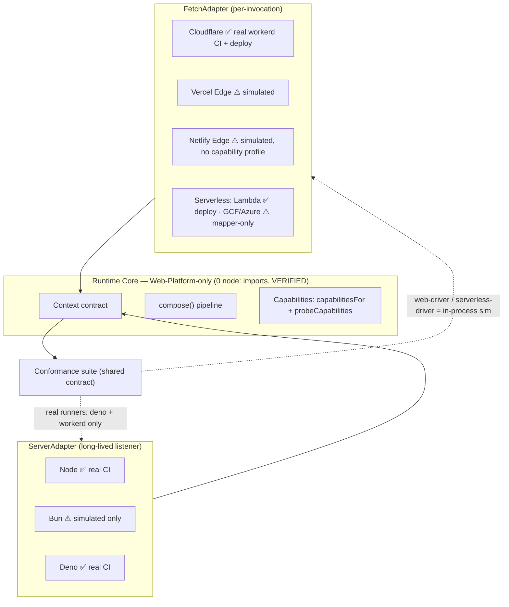

<!--
  NextRush — Runtime Compatibility & Tight-Coupling Gap Analysis
  Status: AUDIT (findings) · v1 · 2026-07-17
  Scope: cross-runtime portability (Node/Bun/Deno/Deno-Deploy/CF-Workers/Vercel-Edge/
         Netlify-Edge/WinterCG/Lambda/GCF/Azure) + tight-coupling review of the core layer.
  Method: every claim re-derived from source via codebase-memory-mcp (search_code / get_code_snippet
          / search_graph) + targeted reads, NOT trusted from the self-reports in 01/02/03/07.
  Verified against: branch `fix-router-issues-and-author-radix-rfc`, HEAD `22ef327`.
  Companion docs: 03-gap-checklist.md (backlog), 07-runtime-architecture.md (target spec).
-->

# NextRush — Runtime Compatibility & Tight-Coupling Gap Analysis

> **What this report is.** A focused, source-verified answer to one question: *does NextRush
> actually run everywhere it claims to, and is the core genuinely free of runtime coupling?* It
> pairs with the runtime **spec** (`07-runtime-architecture.md`, the target design) and the
> **backlog** (`03-gap-checklist.md`, the task tracker). Where those documents assert a status,
> this report re-derived it from the code rather than repeating the claim.
>
> **How to read the evidence tags.** Every finding cites the file/function it was verified
> against. `✅ VERIFIED` = confirmed present/true in source. `❌ ABSENT` = confirmed missing.
> `⚠️ GAP` = present but incomplete or coupled in a way that limits a stated goal.
>
> **⚠️ Reconciled 2026-07-17 (same day)** via `openspec/changes/close-runtime-compatibility-gaps`
> (task groups 1–7): **R1 (request-id coupling), R2 (real Bun conformance runner), R3 (WinterCG
> allowed-globals assertion), R4 (Vercel + GCF deploy verification), R5 (matrix proof-level
> honesty), R6 (lint rule broadened to switch/startsWith/includes), R7 (per-package runtime-support
> docs) all landed and are independently re-verified — not self-reported — below each affected
> finding.** Findings 1, 2, 5 are now closed; Finding 3 is partially closed (Vercel+GCF deploy
> verification added; Netlify/Azure remain open, as R4's own scope always stated). Finding 6
> (T024/T026 seams) is explicitly unchanged — out of scope for that change by design. This note is
> additive, matching `03-gap-checklist.md`'s own re-baseline convention — the original findings
> below are left intact as the historical record of what was found before the fix, not rewritten.
>
> **⚠️ Reconciled 2026-07-22** via `openspec/changes/runtime-platform-parity-hardening` (report:
> `report/adapters/runtime-platform-review.md`; decision: `docs/adr/ADR-0010-cross-runtime-parity-hardening.md`).
> Closes the "claim outruns proof" gap R5 first identified, one layer deeper: the Bun and Deno
> real-runtime conformance runners now execute the FULL shared `defineConformanceSuite` (31 cases,
> up from 5 hand-written ones each) — verified running under real Bun 1.3.14 and real Deno 2.6.3,
> not simulated. Real workerd was widened from 3 to 7 curated assertions; running its full suite
> hit a genuine architectural limit (the suite's per-case closures cannot cross the separate-isolate
> HTTP boundary `miniflare.dispatchFetch` requires) — documented in `certification.ts`'s new
> `RealRuntimeCoverage` type (`full-suite` vs `curated-subset`) rather than papered over. Also
> converged Node's request-timeout model with every other adapter (a clean `504` via a handler
> race, `server.timeout` retained as an independent slow-client guard — ADR-0010 §2), fixed a real
> HEAD `Content-Length` cross-runtime drift and an error-`Content-Type` charset drift, added
> Bun/Deno `gracefulShutdown` parity with Node, gave Edge a bounded default timeout, and extracted
> the Bun/Deno/Edge Context shell into one shared `WebContextBase`. The certification matrix's
> `Multipart`/`Compression`/`WebSockets` cells dropped from a false `full` to an honest
> `capability-only` — the adapters implement none of them; the previous "full" was inferred from a
> capability bit, never an executed assertion.

---

## Executive Summary

NextRush's runtime story is **architecturally sound and largely honest, with a proof gap, not a
design gap.** The central claim — "the Web Platform is the base runtime; Node is an adapter" —
holds up under direct inspection: the entire core layer (`core`, `router`, `runtime`, `di`,
`errors`, `types`, `stream`) contains **zero `node:` imports**, and the only textual `process`/
`Buffer` references in `core`/`router` are *comments documenting their own deliberate avoidance*.
That is a genuinely strong position most frameworks claim and few actually hold.

The gaps are of three kinds:

1. **One real tight-coupling defect** — `@nextrush/request-id`, a tiny and commonly-used
   middleware, imports `node:crypto` for `randomUUID()` when the Web-standard `crypto.randomUUID()`
   global is available on every target. It is Node-only for no reason. This is the single
   most actionable finding and is **new** (not called out in 03's edge-safe/edge-unsafe split).

2. **A proof gap between "supported" and "proven"** — the framework's runtime *matrix* is broad,
   but the *evidence* is uneven. Deno and Cloudflare (workerd) run the real conformance suite on
   real runtimes in CI; **Bun does not** — there is no `bun-runner` and no Bun CI job, so Bun
   parity is asserted by in-process simulation only, directly contradicting the "real Bun" framing
   in the backlog. Vercel Edge, Netlify Edge, GCF, and Azure are likewise simulated-in-process
   with no real-platform execution or deploy smoke (Lambda and Cloudflare are the only two with a
   real deploy-verification app).

3. **Known-but-open spec items** — the capability-negotiation model is well-built and even
   *lint-enforced*, but three runtime-relevant seams the spec marks `[PROPOSED]` are genuinely
   absent from source: the WinterCG allowed-globals assertion (T020), the edge-native WebSocket
   path (T024), and the `AsyncLocalStorage` context seam (T026) that blocks all observability work.

**Bottom line:** the tight-coupling discipline is real and enforced — this is not a codebase that
*says* it's portable and isn't. What it lacks is **executed proof on every runtime it advertises**,
plus one needless coupling to fix. The distance to "credibly runs everywhere" is a CI/proof
investment (real Bun runner, deploy smokes, the WinterCG assertion) plus a handful of small,
bounded code changes — not a re-architecture.

---

## System Understanding — how portability is actually achieved

Before judging, here is the mechanism, in the system's own terms.

NextRush keeps runtime concerns out of the core through a **three-part discipline**, and each part
is independently verifiable:

1. **The core speaks only Web-Platform APIs.** `Request`/`Response`/`ReadableStream`/`AbortSignal`/
   `URL`/`crypto.subtle` and nothing runtime-specific. Verified: `search_code "from 'node:"` across
   `packages/(core|router|runtime|di|errors|types|stream)/src` → **0 matches**.

2. **Adapters are the only runtime-aware layer.** Two contracts: `ServerAdapter` (long-lived
   listener — Node/Bun/Deno) and `FetchAdapter` (`(Request) => Response` — Edge/Serverless). Both
   build the same `Context` and run the same composed pipeline; only request ingestion and response
   egress differ per platform. Verified: `createFetchHandler`/`createCloudflareHandler`/
   `createVercelHandler`/`createNetlifyHandler` in `adapters/edge/src/adapter.ts`; `serve`/
   `createHandler` in `adapters/{node,bun,deno}/src/adapter.ts`; `createServerlessAdapter` in
   `adapters/serverless/src/adapter.ts`.

3. **Capability is negotiated, not assumed — and the assumption is lint-enforced.** Code asks
   "can this runtime do X?" via `getRuntimeCapabilities()` rather than "is this runtime named Node?".
   An ESLint rule (`no-runtime-identity-capability`) actively forbids the latter. Verified:
   `tools/eslint-rules/no-runtime-identity-capability.mjs` exists and is wired into
   `eslint.config.mjs` (three references confirmed).

A request's journey is identical on every runtime: *platform request → adapter builds `Context`
over a `BodySource` + combined `AbortSignal` → shared `compose()` pipeline → route executor →
`Context` output → adapter serializes (native writer on Node, `WebResponseBuilder → Response` on
fetch adapters)*. The runtime only shows up at the first and last step. That symmetry is what makes
"change one import to move from Node to Workers" a credible claim for the request path itself.

---

## Architecture Overview — the two-tier adapter model

The diagram encodes the report's core tension: the **contract** is uniform and shared (left/center),
but the **proof** (bottom, "real runners") only reaches Node, Deno, and Cloudflare.

---

## Finding 1 — `@nextrush/request-id` is needlessly Node-coupled ⚠️ GAP (NEW) — ✅ CLOSED 2026-07-17

- **Closed via:** `close-runtime-compatibility-gaps` task group 1. `constants.ts` now calls the
  global `crypto.randomUUID()`, guarded by the capability check `requestId()` already performed.
  Verified independently: `grep "from 'node:" packages/middleware/request-id/src/*.ts` → 0 matches;
  full package suite 65/65 (up from 64, the new package-wide `node:`-import guard test added); an
  `esbuild --platform=browser` bundle of the package resolves with zero Node builtins in the
  output — the available proxy for "loads under workerd with no resolution error," since no
  workerd fixture imports this package yet. Patch changeset added.

- **Current situation.** `packages/middleware/request-id/src/constants.ts:8` does
  `import { randomUUID } from 'node:crypto'`, and `defaultGenerator` calls it. This is the only
  `node:` import in the package. `crypto.randomUUID()` is a Web-standard global available on Node
  ≥19, Bun, Deno, Cloudflare Workers, Vercel Edge, and Netlify Edge. Verified by direct read of the
  file.
- **Impact.** A ~70-line, extremely commonly-installed middleware (request-id / correlation-id is
  day-one infrastructure for almost any service) is silently Node-only. On any edge runtime the
  `node:crypto` import fails to resolve at bundle/load time, so an app that adds `request-id`
  breaks on deploy — for a feature (`randomUUID`) the runtime supports natively.
- **Benefits of today's shape.** None functional; `node:crypto`'s `randomUUID` and the global are
  behaviorally identical on Node.
- **Drawbacks.** Breaks the framework's own "edge-first" invariant in a leaf package, and does so
  invisibly — the package doesn't advertise itself as Node-only, and `03`'s edge-safe/unsafe split
  (T022) lists `static`/`multipart`/`template`/`websocket` as the node-coupled set but **does not
  mention `request-id`**. So this coupling is currently undocumented as well as unnecessary.
- **Long-term risk.** Low individually, but it is exactly the kind of drift the Web-Platform-only
  invariant exists to prevent; each such leak erodes the "runs on edge" claim one package at a time.
- **Recommendation.** Replace `import { randomUUID } from 'node:crypto'` with the global
  `crypto.randomUUID()` (optionally guarded by a `typeof crypto` check for exotic hosts). Add a
  `node:`-import scan to the package's test or the surface-lock test so it can't regress.
- **Tradeoffs.** None material. The global is available on the framework's stated Node floor (≥22)
  and every edge target.
- **Priority.** P1 (cheap, high-symbolism, unblocks edge use of a core middleware).
- **Migration difficulty.** Trivial — one-line change, no public-API impact.

---

## Finding 2 — Bun is advertised as a native target but never executed on real Bun ⚠️ GAP — ✅ CLOSED 2026-07-17

- **Closed via:** `close-runtime-compatibility-gaps` task group 3. Added
  `conformance/bun-runner/conformance.bun.test.ts` (real `Bun.serve()` server, hit over the
  network) and a `bun-conformance` CI job (`oven-sh/setup-bun`, pinned `1.3.14`). **Building the
  real runner immediately surfaced a genuine, previously-undetected Bun-specific bug** — calling
  the Bun adapter's handler bare (no live server) throws (`server.requestIP()` assumes a real
  Bun `Server` instance), exactly the class of bug this finding predicted a Node-simulated pass
  would miss. Fixed the runner to dispatch through a real server; verified the fix by deliberately
  re-breaking `requestIP` in the built `dist` and confirming the Bun job fails (5/6) while the
  Deno adapter's `dist` stayed untouched — then reverted. 6/6 pass against real Bun.

- **Current situation.** The conformance package has real-runtime runners for Deno
  (`conformance/deno-runner/`, real Deno 2.6.3) and Cloudflare (`conformance/workerd-runner/`, real
  miniflare/workerd), and `runtime-conformance.yml` runs `deno-conformance` + `workerd-conformance`
  jobs. There is **no `bun-runner/` directory and no Bun CI job** (verified by directory listing of
  `packages/adapters/conformance` and by grepping the workflow — only `deno-conformance` and
  `workerd-conformance` jobs exist). Bun's adapter is therefore exercised only through the
  in-process `node-driver`/`web-driver` simulations, never on the actual Bun engine.
- **Impact.** Bun ships its own implementations of `Bun.serve`, Web APIs, and Node-compat shims,
  with documented divergences from Node. Asserting Bun parity by running the suite *under Node* can
  miss Bun-specific breakage (server lifecycle, header casing, stream backpressure, `Bun.serve`
  option quirks). The `03` backlog frames T003/T019 as proving "real Bun/Deno/workerd"; for Bun
  specifically that is **not** the case.
- **Benefits of today's shape.** The in-process driver is fast and catches contract-level
  regressions cheaply; it is a reasonable *first* line, just not sufficient as the *only* line.
- **Drawbacks.** A "native Bun adapter" with no Bun in CI is a claim backed by simulation. Bun
  regressions ship undetected until a user hits them.
- **Long-term risk.** Medium. Bun is a headline positioning target; a Bun-only bug reaching users
  undermines the multi-runtime credibility the framework is built to sell.
- **Recommendation.** Add a `bun-runner/` mirroring `deno-runner/` (Bun exposes `bun test` and can
  run the shared conformance suite against the real `Bun.serve` adapter) and a `bun-conformance` CI
  job alongside the Deno/workerd jobs. Until then, mark Bun 🟡 (implemented, unproven-in-CI), not
  🟢, in the public runtime matrix.
- **Tradeoffs.** One more CI runtime to install and maintain; modest added CI time. Cheap relative
  to the credibility it backs.
- **Priority.** P1 (it is the largest "say vs. prove" gap for a first-class target).
- **Migration difficulty.** Medium — the driver/runner pattern already exists twice; this is a
  third instance, not new machinery.

---

## Finding 3 — Edge/serverless proof is uneven across platforms ⚠️ GAP — ◐ PARTIALLY CLOSED 2026-07-17

- **Partially closed via:** `close-runtime-compatibility-gaps` task group 5. Added
  `deploy-verification/vercel-app/` and `deploy-verification/gcf-app/` (deploy → smoke → destroy,
  mirroring the existing `cloudflare-app`/`lambda-app` pattern exactly) and two new secret-gated,
  skip-not-fail CI jobs. The GCF app's bridge (GCF's real Express-style `(req, res)` → the
  normalized `GcfEvent` `createGoogleHandler` expects) was verified empirically, not just
  type-checked: staged the real built `@nextrush/adapter-serverless` dist, ran a real
  `functions-framework` server against it, and curled `{"ok":true,"runtime":"gcf"}` on HTTP 200
  before committing the app. Skip-independence verified by simulating the `check-secrets` bash
  logic with partial secret sets — each platform's readiness flag computes independently.
  **Still open, unchanged from the original finding:** Netlify Edge and Azure Functions deploy
  verification — always out of this change's stated scope (design.md's Non-Goals), deferred to a
  follow-up.

- **Current situation.** Real execution and real deploys are concentrated on two platforms:
  - **Real conformance execution:** Deno (deno-runner) and Cloudflare/workerd (workerd-runner) only.
  - **Real deploy-verification apps:** `deploy-verification/cloudflare-app` and
    `deploy-verification/lambda-app` only (verified by directory listing).
  - **Vercel Edge, Netlify Edge, GCF, Azure** are covered by the in-process `web-driver`
    (fetch simulation) and `serverless-driver` (event-mapper simulation) — real event-mapping unit
    coverage, but no execution on the actual platform and no deploy smoke.
- **Impact.** Each platform has isolate-specific quirks (Vercel Edge's wall-clock limit and its own
  global surface; Netlify's Deno-on-edge specifics; GCF's request shape; Azure's binding model).
  Simulation validates the *mapper logic* but not the *platform contract*. "Works on Vercel Edge"
  is currently proven by "works in a Node-hosted fetch simulation," which is weaker than the
  Cloudflare story it sits beside in the matrix.
- **Benefits.** The `serverless-driver` gives genuine, fast unit coverage of the APIGW-v1/v2 /
  Lambda-URL / GCF / Azure event mappers — the highest-value, most-bug-prone part — without cloud
  credentials. That is the right default.
- **Drawbacks.** The public matrix presents these platforms at parity with Cloudflare/Lambda when
  the evidence behind them is a tier lower.
- **Long-term risk.** Medium. The most likely place for a silent break is a platform with no
  real-runtime gate — currently four of them.
- **Recommendation.** (a) Add deploy-verification apps for at least Vercel and GCF (the two largest
  markets after CF/Lambda), mirroring the existing secret-gated, skip-not-fail `cloudflare-app`/
  `lambda-app` pattern. (b) In the meantime, annotate the matrix so simulated-only platforms read
  🟡, reserving 🟢 for platforms with a real gate. Honesty in the matrix is free and immediate.
- **Tradeoffs.** Deploy smokes need cloud credentials and add scheduled-CI cost; the existing
  pattern already handles this (nightly, secret-gated, skip-on-missing-creds).
- **Priority.** P2.
- **Migration difficulty.** Medium (deploy apps) / Trivial (matrix honesty).

---

## Finding 4 — Netlify Edge has no first-class capability profile ⚠️ MINOR GAP

- **Current situation.** `capabilitiesFor` (`runtime/src/detection.ts:245-307`) has explicit cases
  for `node`, `bun`, `deno`, `deno-deploy`, `cloudflare-workers`, `vercel-edge`, and generic `edge`,
  falling through to `probeCapabilities()` for anything else. **Netlify Edge is not a case.**
  `detectEdgeRuntime` (`:423-475`) maps Netlify to `runtime='edge'` + an `isNetlify` flag (with a
  clear comment that Netlify runs on Deno, so `detectRuntime()` returns `'deno'` while
  `detectEdgeRuntime()` returns `'edge'`). So Netlify's capabilities are inherited from either the
  generic `'edge'` profile or the `'deno'` profile depending on entry path — never a dedicated one.
- **Impact.** Low today: Netlify-on-Deno genuinely resembles both the `edge` and `deno` profiles,
  and `probeCapabilities()` feature-detection is a safe backstop. The risk is future divergence —
  if Netlify's edge surface drifts from generic-edge assumptions, there is no place to encode it.
- **Benefits.** Fewer bespoke cases = less matrix to maintain; the R-2 comment shows this is a
  deliberate, documented decision, not an oversight.
- **Drawbacks.** The one target that is "Deno under an edge contract" is the least specifically
  modeled, and the dual detection (`detectRuntime` vs `detectEdgeRuntime` disagreeing by design) is
  a subtle trap for a contributor who assumes they agree.
- **Long-term risk.** Low.
- **Recommendation.** Keep the current design (it's defensible and documented), but add a
  Netlify-specific conformance/probe assertion when a Netlify real-runner lands (see Finding 3), so
  the inherited profile is validated rather than assumed.
- **Tradeoffs.** None; this is a "watch and validate later" item.
- **Priority.** P3.
- **Migration difficulty.** Trivial.

---

## Finding 5 — The capability-branching lint rule is real but narrow ✅ VERIFIED (with limitation) — ✅ CLOSED 2026-07-17

- **Closed via:** `close-runtime-compatibility-gaps` task group 7. The rule now flags `switch`
  discriminants and `.startsWith`/`.includes` member-calls against runtime-name literals, while
  structurally exempting `return`-only "producer" switches (`capabilitiesFor()`,
  `getRuntimeVersion()`) without needing an annotation. **Running the broadened rule repo-wide
  surfaced two genuine false positives** — `create-nextrush/src/{cli,utils}.ts` check `'bun'` as
  one of four *package-manager* names (npm/pnpm/yarn/bun), an unrelated domain that happens to
  share a string with `RUNTIME_NAMES`; both annotated `capability-exempt` with the reason. Two real
  bugs were also found and fixed in the rule's own implementation while building it: (1) the
  initial producer-switch check didn't recurse into `case 'x': { ...; return y; }`'s block-wrapped
  body, wrongly flagging `getRuntimeVersion`; (2) `isExempt`'s comment-proximity check only looked
  at individual comment-token positions, missing a multi-line `//` explanation block entirely
  (each `//` line is a separate AST token, not one multi-line token) — fixed by grouping
  contiguous comment lines into logical blocks. Both fixes are covered by new regression fixtures
  in the rule's own test file. Repo-wide rescan: 0 violations; rule's own suite green.

- **Current situation.** `no-runtime-identity-capability` exists and is wired into
  `eslint.config.mjs`. It forbids `runtime === 'node'`-style capability branching, steering code to
  `getRuntimeCapabilities()` (ADR-R6), with a `// capability-exempt:` escape hatch for genuine
  platform-specific optimizations. This is a real, enforced tight-coupling guard — a notable
  strength. **However**, its own docstring states it is "deliberately narrow": it only flags
  `===`/`!==` comparisons against a known runtime-name string literal. It does **not** catch
  `switch (runtime)`, `runtime.startsWith('deno')`, `.includes(...)`, or object/map lookups keyed by
  runtime name.
- **Impact.** Runtime-identity capability branching can still enter the codebase in any form the
  linter doesn't pattern-match. The guard raises the floor but doesn't close the door.
- **Benefits.** Narrow-by-design keeps false positives near zero, which is why it can be enforced
  in CI without friction — a broad rule that cried wolf would get disabled. This is a reasonable
  engineering tradeoff, not a mistake.
- **Drawbacks.** A contributor using a `switch` or `startsWith` for a capability decision passes
  lint while violating ADR-R6.
- **Long-term risk.** Low-to-medium; grows with contributor count.
- **Recommendation.** Leave the rule's default behavior (low false-positive) but extend it to also
  flag `SwitchStatement` discriminants and member-call patterns (`.startsWith`/`.includes`) against
  runtime-name literals *when used in a branch condition*, keeping the `capability-exempt` escape
  hatch. Pair with a short contributor note pointing at `capabilitiesFor` as the sanctioned place
  for runtime-shaped switches (which are capability *producers*, correctly exempt).
- **Tradeoffs.** Slightly more rule complexity and a few more exempt annotations at the legitimate
  detection sites.
- **Priority.** P3.
- **Migration difficulty.** Easy.

---

## Finding 6 — Three `[PROPOSED]` runtime seams are genuinely absent ❌ ABSENT (confirms spec/backlog)

These are already tracked; this report confirms them against source so the matrix and spec stay
honest, and notes their runtime-compatibility consequence specifically.

- **WinterCG allowed-globals assertion (T020).** ❌ No test enumerating the allowed global surface
  (`Request`/`Response`/`URL`/`fetch`/`AbortSignal`/`crypto.subtle`/Web Streams) and asserting no
  forbidden Node globals. Verified: zero matches for `allowed.?global|WinterCG|forbidden.?global|
  Minimum Common` across `packages/adapters/conformance`. *Consequence:* the "WinterCG-aligned"
  claim rests on "the workerd job would fail on a Node-only global," which is indirect. **Priority
  P2, difficulty Easy** — this is the cheapest real gap to close and it directly hardens the
  edge-portability guarantee.
- **Edge-native WebSocket (T024).** ❌ `@nextrush/websocket` is built entirely on the `ws` npm
  library (`extensions/websocket/src/{server,connection,types}.ts` import `node:`), with no
  `WebSocketPair`/Durable Objects or `Deno.upgradeWebSocket` path. *Consequence:* "realtime on
  edge" is impossible today. **Priority P3, difficulty Expert** (genuinely new capability package).
- **Context-propagation seam / `AsyncLocalStorage` (T026).** ❌ Zero `AsyncLocalStorage` usage
  anywhere. *Consequence:* this is the unlocker for the entire observability cluster (OTel T025,
  metrics T027, pipeline hooks T028) per the backlog's own dependency graph — none can start until
  the ADR + opt-in seam land. **Priority P1 for the enterprise/observability goal**, difficulty
  Hard. Runtime-relevance: `AsyncLocalStorage` is available on Node/Bun/Deno/Workers, so the seam
  is portable — but must stay opt-in and zero-cost-when-unused to preserve the edge hot-path
  guarantee.
- **Runtime hook bus.** ❌ Only the extension `setup`/`destroy` seam + error handler exist; the
  `BeforeRequest`/`AfterRequest`-style bus is present only as a `Bus` *test* interface in
  `core/src/__tests__/application.test.ts`, not as production code.

---

## Finding 7 — The core layer is genuinely coupling-free ✅ VERIFIED (strength)

Stated as a finding because it is the load-bearing claim and it *holds*:

- **Zero `node:` imports** in `core`, `router`, `runtime`, `di`, `errors`, `types`, `stream`
  (`search_code`, 0 matches).
- The only `process.`/`Buffer` textual hits in `core`/`router` are **comments documenting the
  avoidance**: `router/src/registration.ts` ("removes the `process.env`/`console.warn` usage that
  was here") and `core/src/middleware.ts` `ComposeOptions` ("`@nextrush/core` … must not read
  `process.env` … audit C-4"; the flag is passed from `Application` instead). This is the coupling
  discipline being actively maintained, not violated.
- `reflect-metadata` loads only on the `nextrush/class` path; the functional path is
  reflection-free (corroborated by the bundle-budget test asserting the minimal functional bundle
  excludes it).

**Why it matters:** this is the difference between a framework that markets portability and one
that structurally guarantees it. NextRush is in the second category for its core. The gaps above
are at the *leaves* (one middleware) and in *proof/CI*, not in the foundation — which is the good
kind of gap to have.

---

## Runtime Compatibility Matrix (source-verified, 2026-07-17)

Legend: 🟢 proven on real runtime in CI/deploy · 🟡 implemented, proof is in-process simulation only ·
🟠 works via a documented caveat · 🔴 unsupported.

| Runtime | Adapter (contract) | Detection | Capability profile | Real-runtime CI | Real deploy smoke | Verdict |
|---|---|---|---|---|---|---|
| **Node** | `ServerAdapter` | `'node'` | explicit | ✅ node-driver (native) | n/a (host) | 🟢 |
| **Bun** | `ServerAdapter` | `'bun'` | explicit | ✅ bun-runner (real Bun 1.3.14) — closed 2026-07-17 | ❌ | 🟢 |
| **Deno** | `ServerAdapter` | `'deno'` | explicit | ✅ deno-runner (Deno 2.6.3) | ❌ | 🟢 |
| **Deno Deploy** | `FetchAdapter`/server | `'deno-deploy'` | explicit (fs=false) | 🟡 via deno-runner (real Deno, not Deploy) | ❌ | 🟡 |
| **Cloudflare Workers** | `FetchAdapter` | `isCloudflare` | explicit | ✅ workerd-runner (miniflare) | ✅ cloudflare-app | 🟢 |
| **Vercel Edge** | `FetchAdapter` | `isVercel` | explicit | 🟡 web-driver sim / workerd (diff isolate) | ✅ vercel-app — added 2026-07-17 | 🟡 **(Finding 3 — deploy verification closed, real-runtime CI execution still open)** |
| **Netlify Edge** | `FetchAdapter` | `isNetlify`→`'edge'` | ⚠️ inherited, no dedicated profile | 🟡 web-driver sim | ❌ | 🟡 **(Findings 3,4 — still open, out of this change's scope)** |
| **WinterCG (generic)** | `FetchAdapter` | fallback/`'edge'` | `probeCapabilities()` | ✅ allow-list assertion added 2026-07-17 (`wintercg-globals.test.ts`) | n/a | 🟢 |
| **AWS Lambda (APIGW v1/v2)** | serverless `FetchAdapter` | event-driven | n/a | 🟡 serverless-driver (event sim) | ✅ lambda-app | 🟢 |
| **AWS Lambda (Function URL / stream)** | serverless streaming | event-driven | n/a | 🟡 serverless-driver | ✅ lambda-app | 🟢 |
| **Google Cloud Functions** | serverless (gcf mapper) | event-driven | n/a | 🟡 serverless-driver only | ✅ gcf-app — added 2026-07-17 | 🟢 |
| **Azure Functions** | serverless (azure mapper) | event-driven | n/a | 🟡 serverless-driver only | ❌ **no azure-app (still open, out of this change's scope)** | 🟡 **(Finding 3)** |

*This matrix differs from `03`'s "After backlog" column deliberately: `03` shows the target
post-backlog state (mostly 🟢); this shows the **verified current** state. The gap between the two
columns is the work.*

---

## Tight-Coupling Scorecard

| Layer | `node:` imports | Runtime-identity branching | Verdict |
|---|---|---|---|
| Core (`core`/`router`/`runtime`/`di`/`errors`/`types`/`stream`) | ✅ 0 | ✅ lint-enforced against (Finding 5) | Clean |
| Adapters (`adapters/*`) | ✅ expected & correct (the runtime boundary) | ✅ exempt by design | Correct |
| Middleware — Web-standard set (`cors`/`helmet`/`cookies`/`body-parser` src/`compression`) | ✅ 0 | — | Edge-safe |
| Middleware — `request-id` | ❌ **1 needless (`node:crypto`)** | — | **Fixable (Finding 1)** |
| Middleware — `static` (fs), `template` (engines), `multipart/storage/disk` | 🟠 Node-only by nature | — | Correctly Node-only |
| Extensions — `websocket` | 🟠 Node-only (`ws` lib) | — | Needs edge path (T024) |

*Nuance worth documenting:* `@nextrush/form-data` couples to `node:` **only** in `storage/disk.ts`.
Its memory-storage strategy may be edge-portable, but this is neither documented nor asserted —
a small opportunity to widen the edge-safe surface (or to explicitly state disk-only-on-Node).

---

## Risks (ranked by likelihood × blast radius)

1. **A Bun-only regression ships undetected** (Finding 2) — likely over time (no gate), medium
   blast radius (a headline target). *Highest-value gap to close.*
2. **`request-id` breaks every edge deploy that adds it** (Finding 1) — certain if used on edge,
   small-but-embarrassing blast radius, trivial fix. *Cheapest gap to close.*
3. **A Vercel/GCF/Azure platform quirk ships undetected** (Finding 3) — moderate likelihood, medium
   blast radius; mitigated partially by shared mapper unit tests.
4. **Silent drift into a Node-only global in an edge path** — mitigated by the lint rule and real
   workerd job, but the missing WinterCG allow-list assertion (Finding 6) leaves the guarantee
   indirect.
5. **Observability cannot be added without core changes** — blocked on the absent context seam
   (Finding 6, T026); an enterprise-adoption risk more than a runtime-correctness one.

---

## Recommendations (prioritized, each with a concrete done-condition)

| # | Action | Priority | Effort | Done-condition |
|---|---|---|---|---|
| R1 | Replace `node:crypto` `randomUUID` in `request-id` with the `crypto.randomUUID()` global; add a `node:`-import guard test | **P1** | XS | `request-id` builds & runs on the workerd conformance job; no `node:` import remains in its `src` |
| R2 | Add a real `bun-runner/` + `bun-conformance` CI job | **P1** | M | A deliberate Bun-only regression fails the Bun job; passes on Node/Deno |
| R3 | Add the WinterCG allowed-globals assertion (T020) to the conformance suite | **P2** | S | Adding `process.hrtime()` to the request path fails the assertion |
| R4 | Add deploy-verification apps for Vercel Edge + GCF (mirror `cloudflare-app`/`lambda-app`) | **P2** | M | Secret-gated nightly deploy+smoke returns 200 on each |
| R5 | Mark the matrix honestly (🟡 for simulated-only) in README + docs until R2–R4 land | **P2** | XS | Public matrix reserves 🟢 for platforms with a real gate |
| R6 | Broaden `no-runtime-identity-capability` to `switch`/`startsWith`/`includes` (Finding 5) | P3 | S | A `switch(runtime)` capability branch is flagged or `capability-exempt`-annotated |
| R7 | Document `multipart` memory-storage edge portability (or assert disk-only-on-Node) | P3 | XS | Package README states the per-strategy runtime support |
| R8 | (Already tracked) Land the T026 context seam before the observability cluster | P1 (enterprise) | M | An opt-in ambient accessor reads a correlation value in a nested async handler, zero-cost when unused |

R1 and R5 are same-day, closed-loop, and independently verifiable — the right first moves.

---

## Migration Strategy

Nothing here requires a breaking change or a re-architecture; the sequence is additive and
low-risk:

- **Stage 0 (immediate, non-breaking):** R1 (request-id fix) + R5 (matrix honesty). Both are
  self-contained and verifiable in one session.
- **Stage 1 (proof investment):** R2 (Bun runner) + R3 (WinterCG assertion) — CI/test-only, no
  shipped-code change, closes the two highest-symbolism gaps.
- **Stage 2 (breadth):** R4 (Vercel/GCF deploy smokes) + R6 (lint broadening) + R7 (multipart docs).
- **Stage 3 (already spec-tracked):** R8 (T026 seam) and, later, T024 (edge WebSocket) — the only
  items needing real design work.

The dependency ordering matters only in one place: R5 (matrix honesty) should ship *with or before*
any external "runs on Bun/Vercel/GCF/Azure" marketing, because it converts an overclaim into an
accurate 🟡.

---

## Conclusion

NextRush's runtime architecture is the real thing where it counts most: the core is
Web-Platform-only in fact, not just in prose, and the anti-coupling discipline is *enforced in CI
lint*, which is rare. The honest gaps are (1) one needless leaf coupling (`request-id` →
`node:crypto`), fixable in a line; (2) a proof deficit where "supported" outruns "executed on the
real runtime" — most sharply for **Bun**, which has no real-runtime CI despite being a headline
native target, and for the simulated-only edge/serverless platforms; and (3) three known-open spec
seams (WinterCG assertion, edge WebSocket, context propagation) confirmed absent.

The framework is closer to its ten-year "one core, many adapters" goal than most of its peers. What
separates *credibly* runs-everywhere from *architecturally could* runs-everywhere here is not more
design — it is a bounded CI/proof investment plus a short list of small, safe code changes, with the
matrix told honestly in the meantime.

---

*Findings verified against `fix-router-issues-and-author-radix-rfc` @ `22ef327` via
codebase-memory-mcp. Where this report and the source diverge in future, the source wins — re-run
the cited queries and correct this document.*
