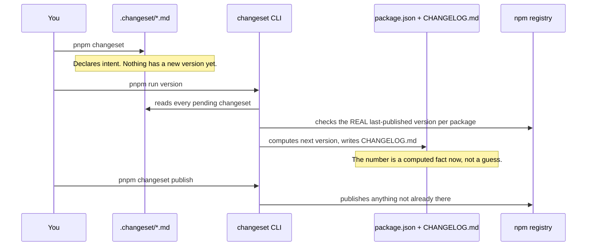
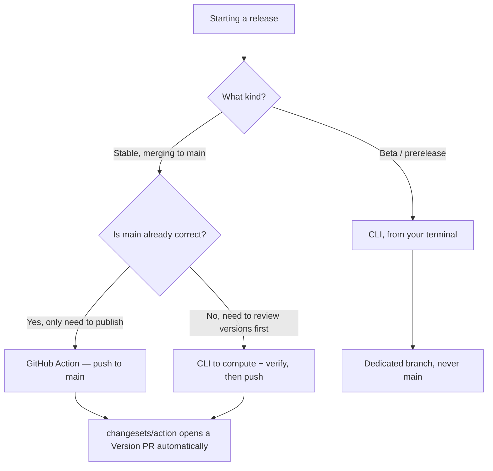
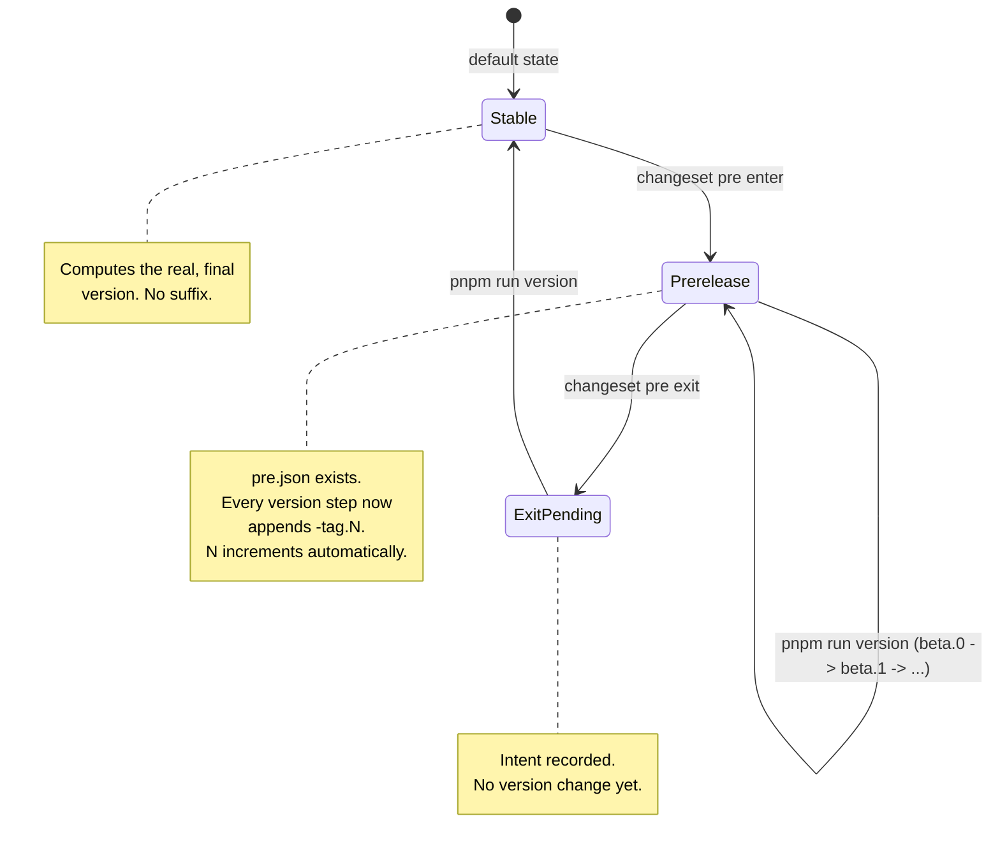

Someone on this team ran a beta release from scratch on 2026-07-24 and got three things wrong
before getting them right: a version number that lied about its own history, a batch of
never-published packages that would've leaked onto the public `latest` tag, and a dependency
injection bug that took thirty-three seconds to fail instead of thirty milliseconds. None of
those were exotic. They were the kind of mistake anyone running Changesets for the first time on
a real monorepo makes, and this handbook exists so nobody here makes them twice.

Read this end to end before you touch a release. It's long on purpose — every section earns its
length from something that actually went wrong, not from padding a "best practices" checklist.

## What you're actually managing

NextRush isn't one package. It's `nextrush`, `@nextrush/core`, `@nextrush/router`, and about
thirty more, published independently but versioned as a coordinated whole where it matters. Nine
of them — the framework's essential runtime — move together, always at the same number, because
splitting a `core` release from a `router` release would make "which versions actually work
together" a research question for every user. Everything else versions on its own clock.

That split is the first thing to internalize. It decides where a package lives in
`.changeset/config.json`, and it decides whether a bug fix in `@nextrush/cors` needs anyone
outside that package to care.

## Part 1 — The concept: why Changesets, and how it actually computes a version

### The problem it solves

Two people are pushing to the same monorepo. One fixes a typo in `@nextrush/cors`. The other
removes a public export from `@nextrush/core`. Both changes need a changelog entry and a version
bump — but not the same severity, and not the same number. Do this by hand across thirty-five
packages for long enough and you'll either forget an entry or ship a patch that was secretly a
breaking change.

Changesets turns "remember to bump the version" into a file you commit with your PR. Run
`pnpm changeset`, answer which packages you touched and how badly, and you get a small markdown
file in `.changeset/` — nothing versioned yet, only a written statement of intent. That file sits
there, reviewable in the PR diff, until someone runs the version step and turns every pending
statement into an actual number.

### The three commands, and what each one really does



- **`pnpm changeset`** is the only interactive step. It asks which packages changed, how severely
  (patch, minor, major), and what the changelog should say. One markdown file comes out.
- **`pnpm run version`** (this repo's alias for `changeset version`, with a guard bolted on —
  more on that later) reads every pending changeset, figures out the real next version per
  package, writes it into `package.json` and `CHANGELOG.md`, then deletes the changesets it
  consumed. This is the step that actually decides numbers.
- **`pnpm changeset publish`** walks the workspace and publishes whatever version is sitting in
  each `package.json`, but only if that exact version string doesn't already exist on the
  registry. That idempotence matters — you can run it twice safely, and it's why a first-ever
  bootstrap publish works at all.

### How the next version gets computed — the part that bites people

Here's the mental model that would've saved us a debugging session: the next version is never
whatever's sitting in your local `package.json`. It's computed from the **last version actually
published to npm**, plus the highest-severity changeset pending against that package.

```
next version = bump(real npm version, highest pending severity)
```

On 2026-07-24, our local files said `3.1.0` for the core group. That number meant nothing —
nobody had ever published it. npm's actual last release was `3.0.7`. Sixteen pending changesets
included several `major` bumps. So the real next version was `4.0.0`, and the local `3.1.0` was
was going to get overwritten the moment anyone ran the version step. If we'd trusted the working
tree instead of checking the registry, we'd have shipped a `.1` minor release over a batch of
genuinely breaking changes — telling every user "this is safe to upgrade blindly" when it wasn't.

That's the rule, stated plainly: **check `npm view <package> version` before you trust any
computed number.** Every phase below comes back to this.

### Fixed vs. independent — one number for the core, separate clocks for everything else

```json
"fixed": [[
  "@nextrush/types", "@nextrush/errors", "@nextrush/core", "@nextrush/router",
  "@nextrush/runtime", "@nextrush/di", "@nextrush/adapter-node", "nextrush"
]]
```

Every package inside one `fixed` array always moves to the same version, together, even if only
one of them actually changed. That's deliberate — users install `nextrush` and expect its
dependencies to be one coherent unit, not eight packages each on their own clock.

Anything not listed there versions independently. `@nextrush/cors` sitting at `3.0.5` while core
sits at `3.0.7` isn't a bug. They've never needed to match, and there's no reason they ever
will.

One thing worth calling out because we got it wrong once: `@nextrush/stream` looked, from the
README's prose, like it belonged in the core group — "ships with `@nextrush/adapter-node`" reads
like a dependency. It isn't one. We checked the actual import graph: `stream` depends only on
`@nextrush/types`, and `core` has zero references to it anywhere. `adapter-node` consumes it the
same way it would consume any middleware — a normal dependency, not a version-lockstep coupling.
**Always verify the real dependency graph before deciding fixed vs. independent.** A README's
phrasing is not evidence.

## Part 2 — CLI or GitHub Actions? The decision, not only the commands

You asked which one to use. The honest answer is: it depends on where you are in the release, and
right now — for a beta — the Action literally can't help you.



Here's why the split exists, not only what it is:

**The GitHub Action (`release.yml`) only triggers on `push` to `main`.** That's in the workflow
file, plain as day — `on.push.branches: [main]`. A beta release is supposed to run from a
dedicated branch (`release/4.0.0-beta`, say), specifically so entering prerelease mode doesn't
block every other unrelated PR from shipping until you exit it. Push to that branch, and the
Action stays silent. No trigger, no automation, nothing happens. So for the entire beta window,
CLI isn't the recommended path — it's the only one that does anything at all.

**Once you merge back to `main` for the stable cut, the Action becomes the right tool.** It opens
a "Version Packages" pull request automatically, keeps it updated as more changesets land, and
publishes to npm the moment that PR merges. That's real automation worth using — no reason to
hand-run commands for a release the Action is built to handle.

So: beta from your terminal, stable through the Action once you're back on `main`. If you ever
want the Action to also cover beta branches, that's a config change (`on.push.branches: [main,
'release/**']`), not a CLI-vs-Action philosophy shift — worth doing eventually, not required to
ship this release.

## Part 3 — The full release lifecycle, start to finish

This is the actual procedure. Follow it top to bottom. Every checkpoint exists because skipping it
cost us real time on 2026-07-24 — they're not defensive ceremony, they're scar tissue.

### Phase 1 — Decide the version, then the channel

Two decisions, and they get confused for each other constantly. The version number isn't a choice — semver decides
it for you. If anything pending is breaking, it's a major, full stop, regardless of what the
working tree currently says. The channel — stable, beta, alpha, rc — is where you actually have
freedom.

Read every pending changeset in full. Not the filename — the content. Two changesets can look
like duplicates from their names and turn out to be two entirely different, non-overlapping
changes (we had exactly this: `remove-backcompat-aliases` and
`remove-deprecated-controllers-decorators` sounded redundant, weren't). For each one, note every
package and bump type it touches. If anything says `major`, or removes a public export, or moves
a dependency into `peerDependencies`, the release is major-version territory. No exceptions for
"but it's mostly small."

Then pick the channel. `alpha` if the API surface itself might still shift between builds. `beta`
if the surface is believed final and you're hunting bugs — this is the normal default. `rc` only
for a short, final check right before a stable cut you don't expect to need changes on.

### Phase 2 — Run the baseline guard before you compute anything

This is the step that didn't exist when we made the mistake, and would've caught it in one
command instead of three follow-up debugging turns.

```bash
pnpm validate:changeset-baselines
```

This script reads every pending changeset's frontmatter, checks each named package against the
real npm registry, and fails loudly if a `patch`, `minor`, or `major` bump is declared against a
package that has **never been published**. Why that matters: `changeset version` has no idea
whether a package has real history. It applies the bump literally, on top of whatever baseline it
finds. Declare a `major` bump against a package sitting at an un-published `1.0.0`, and you get
`2.0.0` — a number that claims a `1.x` line existed when it never did. We shipped exactly that
mistake across nine packages before catching it by hand.

It's wired into `pnpm run version` automatically now, so it runs even if you forget. Run it
explicitly here anyway — you want to see the failure before you're mid-release, not after.

<Callout type="warn">
If it fails, the fix is always the same: open the flagged changeset, delete that package's line
from the frontmatter. Its `package.json` version already **is** its correct first release. A
changeset entry adds nothing for a package with no history to be relative to — it only risks
producing the exact wrong number this guard exists to catch.
</Callout>

### Phase 3 — Hold never-published packages out of the beta

This one won't get caught by the guard above, and it's a separate, real edge case. Changesets has
one behavior that's worth watching for: **a package's first-ever publish always lands on the `latest`
npm dist-tag**, prerelease mode or not. There's no flag that changes this for a brand-new
package — it's unconditional, and it's documented plainly in Changesets' own prereleases guide.

Think through what that means for a beta. If a package that's never touched npm rides along in a
beta publish, it becomes world-visible on `latest` the instant you publish — no `@beta` needed, no
opt-in required. The entire point of gating a channel behind an explicit tag evaporates for
that one package.

So: for every package with a pending changeset, check `npm view <name> version`. Empty result
means never published. Every one of those goes into `.changeset/config.json`'s `ignore` array for
the duration of the beta window — Changesets' own mechanism for a temporary hold, version-bumped
and changelogged, never actually pushed to the registry. Don't use `"private": true` for this;
that's a permanent block, a different tool for a different job. Only pull a package out of
`ignore` once you've exited prerelease mode and are publishing the real stable cut — at that
point its first publish is a normal `latest` release with nothing ambiguous about it.

We held twenty-three packages back this way on 2026-07-24: `@nextrush/stream`, `@nextrush/class`,
every never-published middleware, both new adapters, `@nextrush/dev`, `create-nextrush`,
`@nextrush/testing`. None of them had shipped before. All of them wait for stable.

### Phase 4 — Enter prerelease mode and compute

```bash
git checkout -b release/4.0.0-beta   # dedicated branch, never main
pnpm changeset pre enter beta
pnpm run version                     # runs the baseline guard first, then changeset version
```

`pre enter beta` writes `.changeset/pre.json`, marking the repo as "in prerelease mode, tag is
beta." From here, every version the tool computes gets a `-beta.N` suffix instead of shipping
straight — `4.0.0-beta.0`, and `N` climbs on its own (`beta.1`, `beta.2`) each time you run the
version step again, so you don't have to hand-manage suffix numbers across a multi-week window.



Don't trust the diff blind. Run `git diff --stat`, look at what actually changed, and check three
things every time: every package inside the fixed group landed on the exact same number as its
siblings; every independent package's new version is a sane bump from its real npm history, not
from whatever the working tree happened to say; and nothing that's supposed to be in `ignore`
shows up as changed at all. If something with zero npm history changed and it's *not* in
`ignore`, stop — you missed a package in Phase 3.

### Phase 5 — Verify before you publish anything

```bash
pnpm build
pnpm test
pnpm typecheck
pnpm lint
```

All four, zero failures, across every package the release touches. Don't publish on "the
changesets read well so it's probably fine" — that's exactly the assumption that let a real bug
slip through on this repo.

Here's the concrete story, because it's worth knowing what "slow but passing" actually looked
like. A circular-dependency test in `@nextrush/di` was supposed to fail fast when two services
depended on each other. Instead it hung for thirty-three seconds before finally throwing the
right error. It passed. Green checkmark, count it as done. Except thirty-three seconds for what
should be a millisecond operation is not "eventually correct" — it's a real bug wearing a passing
test as camouflage. The actual cause: the fast cycle-detection guard only fired for one dependency
injection path, and constructor-injection cycles fell through to a much slower fallback that
happened to still work, at a cost nobody would tolerate in production. If a test in your
release run finishes unusually slowly, that's a signal to open it up, not a number to wait out.

### Phase 6 — Publish the beta

```bash
pnpm changeset publish --tag beta
```

Confirm the output lists only what you expect — nothing from `ignore` should appear anywhere.
Then check the registry directly:

```bash
npm view nextrush dist-tags
```

`beta` should point at the new version. `latest` should be exactly where it was before you
started. If `latest` moved, something published without `--tag beta` while still in prerelease
mode — stop and figure out why immediately, don't assume it's fine because the version number
still has a `-beta` suffix in it.

Tell your testers the actual install command: `npm install nextrush@beta`. Nobody guesses that on
their own.

### Phase 7 — The beta window

Collect real bug reports for however long you planned — fifteen days, in our case. Every fix
during the window gets its own changeset and runs back through Phases 2, 4 (only the version
step), 5, and 6. You're already in prerelease mode; there's no need to re-enter it for each
iteration.

`latest` doesn't move during this entire window. If it does, someone ran a plain
`changeset publish` with no tag while prerelease mode was still active — that's the failure mode
worth actually watching for, because it's silent until a user complains their stable install
suddenly changed.

### Phase 8 — Exit and ship stable

```bash
pnpm changeset pre exit
pnpm run version
```

`pre exit` only records the intent — no version changes yet. The version step right after it is
what strips the `-beta.N` suffix and computes the real final numbers.

Before you touch the `ignore` list, run the baseline guard again. Packages held back during beta
might have picked up new changesets during that window — changesets aimed at their eventual first
release — and those need the same never-published check the original batch did. Remove packages
from `ignore` one at a time, and after each one, check its computed version is a sane first
release (`1.0.0`, not something inflated). Then run the full Phase 5 verification gate again — a
beta window's worth of fixes deserves the same scrutiny the original release got, not a lighter
pass because "it's basically done."

```bash
pnpm changeset publish   # no --tag: this is what moves latest
npm view nextrush dist-tags   # confirm latest actually moved
```

## Part 4 — Every real edge case, named

| What happened | Why | What catches it now |
| --- | --- | --- |
| Local `package.json` said `3.1.0`; npm's real last release was `3.0.7` | The working tree isn't the source of truth — the registry is | Phase 1: always compute from real npm history, never from what's already in the file |
| A `major`/`minor` changeset targeted a package with zero publish history | `changeset version` has no concept of "this has no history to bump from" — it applies the severity literally | Phase 2: `validate:changeset-baselines`, wired into `pnpm run version` |
| A never-published package almost rode along in a beta publish | First publish always lands on `latest`, prerelease mode or not — unconditional, undocumented-until-you-hit-it behavior | Phase 3: the `ignore` list, held until stable |
| `@nextrush/stream` sat in the core `fixed` group with zero real dependency on core | README prose implied a coupling that the actual import graph didn't have | Always check the real dependency graph, not the description |
| A circular-dependency test passed after 33 seconds instead of milliseconds | A fast cycle guard only covered one DI resolution path; the other path fell through to a much slower, technically-correct fallback | Phase 5: an unusually slow test is a bug to investigate, not a green check to accept |
| Two packages (`@nextrush/controllers`, `@nextrush/decorators`) are live on npm but deleted from the repo | Changesets only versions packages that exist in the current workspace — a removed package is invisible to the whole flow | Not automated. Deprecate manually with `npm deprecate`, tracked as its own task, never folded into a version bump |

That last one is worth a sentence on its own, because it's the one thing in this whole handbook
that genuinely has no automated fix. If you delete a package from the monorepo, npm doesn't know
that happened. Anyone can still `npm install` it. The only way to signal "this is abandoned" is
`npm deprecate <package>@"*" "moved to X"` — a manual, one-time command, run once outside the
whole Changesets flow, and it's the one step nothing in the pipeline reminds you to run.

## Quick reference — every command, in order

```bash
# Prep
pnpm validate:changeset-baselines

# Enter beta, compute
git checkout -b release/x.y.z-beta
pnpm changeset pre enter beta
pnpm run version
git diff --stat   # look before you trust it

# Verify
pnpm build && pnpm test && pnpm typecheck && pnpm lint

# Publish beta
pnpm changeset publish --tag beta
npm view nextrush dist-tags

# Repeat version/verify/publish per fix during the window

# Exit and ship stable
pnpm validate:changeset-baselines
# edit .changeset/config.json — remove ready packages from "ignore"
pnpm changeset pre exit
pnpm run version
pnpm build && pnpm test && pnpm typecheck && pnpm lint
pnpm changeset publish
npm view nextrush dist-tags
```

See `PUBLISHING.md` at the repo root for the package tiers, CI trigger details, and the GitHub
setup this handbook assumes (secrets, workflow permissions, that kind of thing). This page is the
lifecycle and the reasoning; that one is the reference table you keep open in a second tab.
