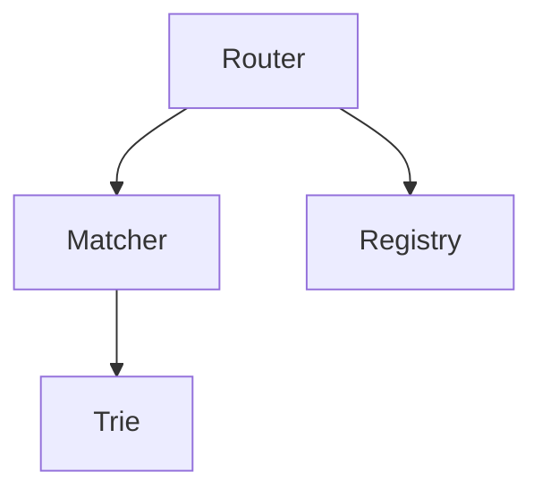
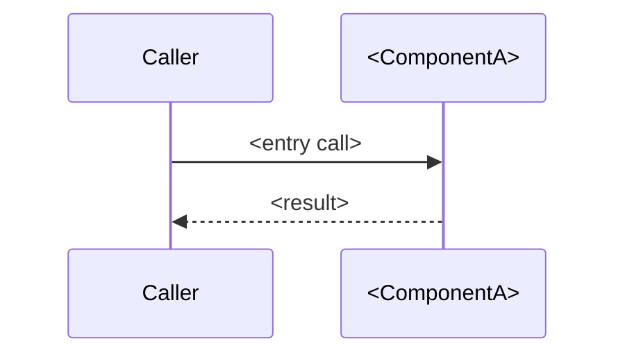
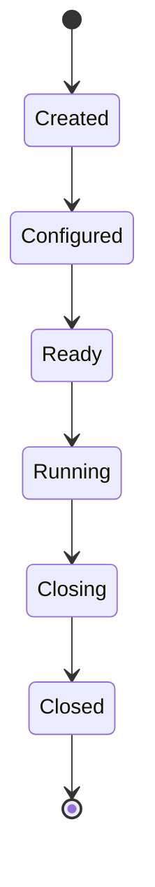

<!--
============================================================================
 NextRush PACKAGE ARCHITECTURE TEMPLATE  (v4)  —  copy, don't edit in place.
 Target surface: GitHub (contributors & advanced users). This is the package's
 ENGINEERING CONSTITUTION — it answers: what is this package responsible for ·
 what is it deliberately NOT · what rules must never break · why these decisions
 over the obvious alternatives · where is it safe to extend. README.md answers
 HOW TO USE IT (npm product page). The two are a pair; every package ships both
 and they cross-link. Sibling: docs/templates/package-readme.template.md.
============================================================================

HOW TO USE
  1. Copy to packages/<path>/ARCHITECTURE.md, replace every <PLACEHOLDER>,
     delete every guidance block (HTML comments + "> 📝" lines) before shipping.
  2. Keep the FIXED section order (design-system consistency, like the README).
  3. Depth follows the package tier (documentation.instructions.md):
       Tier 1 core — full treatment, every section.
       Tier 2      — at-a-glance, responsibilities, non-goals, position, overview,
                     module map, lifecycle, invariants, key decisions.
       Tier 3      — at-a-glance + responsibilities + one diagram + decisions
                     (or skip the file for a thin re-export).

  DIAGRAMS — GitHub renders richly: Mermaid, alerts (> [!NOTE]), <details>.
  Pick the PRECISE, MODERN type per EDS-012 + the `mermaid` skill (load
  ~/.kiro/skills/mermaid/SKILL.md, read references/<type>.md) — NOT a default
  flowchart for everything: system topology → architecture-beta or C4; request
  lifecycle → sequence; states → stateDiagram; data/types → class or ER;
  packet/binary layout → packet; data flow by volume → sankey. flowchart is only
  for genuine branching/wiring. A basic-by-default diagram where a truer type fit
  is a quality-gate failure. Every diagram earns its place (EDS-012). Code is the
  source of truth: when this doc and src/ disagree, the code wins and this file is
  fixed. The diagram-notation LEGEND is GLOBAL (CONTRIBUTING / docs conventions) —
  it is NOT repeated per package. (npm README = ASCII only, no Mermaid.)

  CALLOUTS — standardized set (see package-readme-authoring-guide.md):
  NOTE · TIP · IMPORTANT · WARNING · CAUTION.
============================================================================
-->

# @nextrush/NAME — Architecture

> <PLACEHOLDER: one sentence — the internal design this document covers.>

## At a glance

<!-- The 30-second architectural summary. Delete any row that doesn't apply. Keep to one screen. -->

|  |  |
| --- | --- |
| **Package** | `@nextrush/NAME` |
| **Layer** | `<types · errors · core · router · runtime · di · class · adapter · middleware · extension>` |
| **Depends on** | `<lower packages, or "none — zero-dependency">` |
| **Depended on by** | `<higher packages / adapters / apps>` |
| **Public entry** | `src/index.ts` (barrel — exports only) |
| **Internal modules** | `<n>` files · largest ~`<x>` LOC (cap 300) |
| **On the request hot path?** | `<yes | no>` |
| **Runtime coupling** | `<none — Web-standard only | Node-only, behind adapter>` |
| **State model** | `<stateless | per-request | app-scoped, guarded>` |

## Responsibilities

<!-- ⭐ Boundaries first. What this package OWNS, and — just as important — what it does NOT. -->

**This package owns:**
- ✓ <PLACEHOLDER>
- ✓ <PLACEHOLDER>

**This package does NOT own:**
- ✗ <PLACEHOLDER — owned by @nextrush/<other>>
- ✗ <PLACEHOLDER — owned by @nextrush/<other>>

## Non-goals

<!-- ⭐ What it INTENTIONALLY doesn't do — prevents scope creep. Distinct from "does not own":
     non-goals are things it could plausibly do but deliberately won't. -->

- <PLACEHOLDER: e.g. parse request bodies · authenticate users · manage sockets>

## Constraints

<!-- ⭐ The rules the design must hold to — these EXPLAIN the later decisions. -->

Must remain:
- <PLACEHOLDER: runtime-independent · zero-dependency · ESM-only · public API stable · adapter-agnostic>

## Position in the package hierarchy

<!-- Lower never imports from higher (architecture.instructions.md). Counterpart to the README tree. -->

```mermaid
flowchart TB
    types --> errors --> core --> router --> runtime --> di --> class
    class --> adapters["adapter-*"] --> middleware["middleware / extensions"]
    THIS["@nextrush/NAME — this package"]:::here
    middleware --> THIS
    classDef here fill:#2563eb,color:#fff,stroke:#1e40af;
```

> [!IMPORTANT]
> Imports flow **downward only**. `@nextrush/NAME` may import from the layers below it and MUST
> NOT be imported by them — enforced in review (project-rules §1).

**Dependency rules:**
- **Allowed:** `@nextrush/NAME → <lower>` · `→ @nextrush/types`
- **Forbidden:** `@nextrush/NAME → <higher / adapter / sibling>`

---

## Overview

<!-- 📝 What this package implements and the single organizing idea. 2–4 paragraphs. -->

<PLACEHOLDER: what it does internally and the one idea that shapes it.>

### Design principles

<!-- 📝 The load-bearing principles, each PAIRED with the mechanism that enforces it — a principle
     without an enforcing mechanism is a wish. -->

1. **<Principle>.** <the lint rule / type guard / test / structure that enforces it>
2. **<Principle>.** <…>

---

## Module structure

```text
src/
├── index.ts        # Public API exports (barrel only, no implementation)
├── <file>.ts       # <responsibility>
└── <file>.ts       # <responsibility>
```

### Module responsibilities

| Module | Responsibility (the one thing it owns) |
| ------ | -------------------------------------- |
| `<file>.ts` | <…> |

## Component relationships

<!-- ⭐ How the internal pieces relate — architecture is about relationships, not just a file list. -->



---

## Lifecycle

<!-- 📝 BOTH: an execution lifecycle (sequence) AND, for stateful packages, a state lifecycle. -->





<PLACEHOLDER: the non-obvious ordering/timing the diagrams don't explain.>

## State ownership

<!-- ⭐ Who owns what state — one of the biggest architectural concepts; prevents whole classes of bugs. -->

| Owner | State it owns | Scope |
| ----- | ------------- | ----- |
| `<Application>` | `<extensions, lifecycle>` | app |
| `<this package>` | `<e.g. route tree>` | app (built at startup) |
| `<Context>` | `<request/response, params>` | per-request |

---

## Data structures

<!-- 📝 (Tier 1) The key internal types and WHY they're shaped that way. class/ER diagram if relationships matter. -->

```ts
// The load-bearing internal type(s). Explain the shape CHOICE, not just the fields.
```

## Performance characteristics

<!-- 📝 CONDITIONAL — hot-path packages only (router · core · body-parser · serializer · static ·
     adapters · compression · stream). Else DELETE the whole section. Numbers reproducible from apps/benchmark. -->

| Path | Complexity | Allocations | Notes |
| ---- | ---------- | ----------- | ----- |
| <hot path> | O(<k>) | <per-request / none> | <fast-path note> |

**Memory model:**
- **Shared (one copy):** <PLACEHOLDER: e.g. the route tree, static map>
- **Per request:** <PLACEHOLDER: e.g. Context, params, response>

## Concurrency & edge behaviour

<!-- 📝 Not only races — state the sharing model: shared/immutable/thread-safe/per-request. Plus
     idempotency, cancellation/abort, client-disconnect. N/A line for a pure stateless package. -->

- **Shared, immutable after startup:** <PLACEHOLDER>
- **Per-request, never shared:** <PLACEHOLDER>
- **Abort / disconnect / timeout:** <PLACEHOLDER>

> [!WARNING]
> <PLACEHOLDER: an invariant a contributor could easily break, or delete this callout.>

## Trust boundaries

<!-- ⭐ Where untrusted input crosses into trusted code, and what enforces the boundary — architectural
     trust, not a list of security tips. -->

```text
User input ──▶ HTTP ──▶ Context ──▶ validation ──▶ business logic
                                     ▲
                                     └─ the boundary THIS package enforces (or relies on)
```

<PLACEHOLDER: what this package treats as untrusted, and how the boundary is enforced.>

## Extension points

<!-- ⭐ Split explicitly — contributors must know where change is safe and where it isn't. -->

**Supported extension points:**
- <PLACEHOLDER: the seams meant to be extended>

**Forbidden (sealed):**
- <PLACEHOLDER: what must NOT be extended, to preserve the invariants below>

---

## Architectural invariants

<!-- ⭐⭐⭐ THE most valuable section. The constitution: rules that must NEVER change without an RFC.
     These guide reviews and prevent accidental regressions. -->

The following are part of the package architecture. They do not change without an RFC:

- <PLACEHOLDER: e.g. The router is immutable after `ready()`.>
- <PLACEHOLDER: e.g. Context is request-scoped and never shared.>
- <PLACEHOLDER: e.g. This package imports no runtime API.>
- <PLACEHOLDER: e.g. The public API is explicit and sealed (ADR-0005).>

## Engineering decisions

<!-- ⭐ ADR-shaped, for each major decision. Link the ADR/RFC that owns it; don't duplicate content. -->

| Decision | Chosen | Trade-off accepted | Reference |
| -------- | ------ | ------------------ | --------- |
| <what> | <choice> | <cost> | [RFC/ADR](../../docs/...) |

## Rejected alternatives

<!-- ⭐ Its own section (not just a table column) — a valuable historical record. -->

### <PLACEHOLDER: Alternative, e.g. Radix tree>
<PLACEHOLDER: why it was rejected.>

---

## Testing strategy

<!-- 📝 Architecture is protected by tests — name the categories, not just unit/integration. -->

- **Unit:** <what>
- **Integration:** <what, against what real dependency>
- **Invariant tests:** <the tests that guard the invariants above>
- **Conformance / cross-adapter parity:** <yes — packages/adapters/conformance | N/A>
- **Benchmark / regression:** <hot-path allocation & complexity guards>
- **Coverage:** ≥90% lines/functions (CI-enforced).

## Evolution strategy

<!-- ⭐ What may change, what may not — and the timeline. -->

- **Stable (semver-guarded):** <the public API>
- **May change without notice:** <internals / module layout>
- **Changes only via RFC:** <the architecture & invariants above>

**Timeline:** <PLACEHOLDER: e.g. 3.0 hybrid router → 3.1 introspection → future: opt-in radix (RFC-015)>

## Contributor notes

<!-- ⭐ A safeguard for the next contributor. What to read before touching this package. -->

Before changing this package, read: <PLACEHOLDER: [RFC-…], [ADR-…], the conformance suite, the benchmark>.

## Architecture checklist

<!-- ⭐ Makes the architecture ACTIONABLE at review time. -->

Before changing this package, confirm:
- [ ] Does this preserve the architectural invariants?
- [ ] Does this increase coupling or cross a dependency rule?
- [ ] Does this affect a hot path (allocations / complexity)?
- [ ] Does this change the public API (semver / ADR-0005)?
- [ ] Does it need an RFC?

---

## References & see also

- **README (how to use it):** [`./README.md`](./README.md)
- **Governing RFC(s):** <PLACEHOLDER: [`docs/RFC/...`](../../docs/RFC/...)>
- **ADR(s):** <PLACEHOLDER: [`docs/adr/ADR-...`](../../docs/adr/...)>
- **OpenSpec capability:** <PLACEHOLDER: [`openspec/specs/<capability>`](../../openspec/specs/...)>
- **Benchmarks:** [`apps/benchmark`](https://github.com/0xTanzim/nextRush/tree/main/apps/benchmark)

<!--
============================================================================
 DONE CHECKLIST — tick before committing:
============================================================================
 [ ] "At a glance" table filled — layer, deps, entry, module count, hot-path, state model.
 [ ] Responsibilities (owns / does NOT own) and Non-goals stated — boundaries are explicit.
 [ ] Constraints listed — they explain the decisions below.
 [ ] "Position in the hierarchy" places this package at its REAL layer; dependency rules stated.
 [ ] Architectural invariants section present — the rules that need an RFC to change.
 [ ] State ownership + trust boundaries covered (or N/A for a pure stateless package).
 [ ] Extension points split into Supported / Forbidden.
 [ ] Engineering decisions link their RFC/ADR; Rejected alternatives has its own section.
 [ ] Performance section OMITTED unless this is a hot-path package.
 [ ] Evolution strategy + contributor notes + architecture checklist present.
 [ ] Section order matches the fixed sequence; tier depth respected (Tier 3 short).
 [ ] Module structure matches actual src/ (code wins over this doc).
 [ ] NO per-page diagram legend (it's global — CONTRIBUTING / docs conventions).
 [ ] Linked from README.md's Architecture section; links back to README here.
 [ ] All guidance blocks (HTML comments + "> 📝" lines) deleted.
============================================================================
-->
