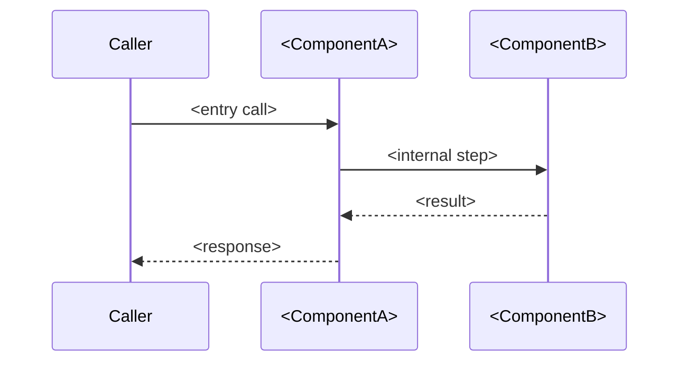

```mermaid
flowchart TB
    A[<input>] --> B{<decision>}
    B -->|<case>| C[<path>]
    B -->|<case>| D[<path>]
```

<!--
============================================================================
 NextRush PACKAGE ARCHITECTURE TEMPLATE  (v4)  —  copy, don't edit in place.
 Target surface: GitHub (contributors & advanced users). This is the INTERNAL
 design doc — it answers HOW IT WORKS and WHY. README.md answers HOW TO USE IT
 and is the npm product page. The two are a pair: every package ships both, and
 they cross-link. Sibling template: docs/templates/package-readme.template.md.
============================================================================

HOW TO USE
  1. Copy to packages/<path>/ARCHITECTURE.md, replace every <PLACEHOLDER>,
     delete every guidance block (HTML comments + "> 📝" lines) before shipping.
  2. Keep the FIXED section order below so every package's ARCHITECTURE feels the
     same (design-system consistency, exactly like the README):
       Title · At a glance · Position in the hierarchy · Overview + Philosophy ·
       Module structure · Lifecycle · Core components · Data structures ·
       Performance (hot-path only) · Concurrency · Extension points · Testing ·
       Decisions & trade-offs · References · Diagram legend
  3. Depth follows the package tier (documentation.instructions.md):
       Tier 1 core — full treatment, every section.
       Tier 2      — at-a-glance, hierarchy, overview, module map, lifecycle
                     diagram, key decisions.
       Tier 3      — at-a-glance + one diagram + decisions (or skip the file
                     entirely if the package is a thin re-export).

  DIAGRAMS — this file is GitHub-only, so unlike the README it renders EVERYTHING
  richly: use Mermaid, GitHub alerts (> [!NOTE]), and <details>. Match the
  diagram to the subject:
    • sequence  → a request/execution lifecycle
    • flowchart → decision/branching logic, component wiring
    • state     → a lifecycle with states (idle → active → closed)
    • class/ER  → data-structure relationships
  Every diagram must communicate what prose can't — no decorative diagrams
  (EDS-012). The code is the source of truth: when this doc and src/ disagree,
  the code wins and this file is corrected.

  CALLOUTS — same standardized set as the README (single source of truth is
  package-readme-authoring-guide.md): NOTE (context) · TIP (best practice) ·
  IMPORTANT (must-know invariant/contract) · WARNING (footgun) · CAUTION (risk).
============================================================================
-->

# @nextrush/NAME — Architecture

> <PLACEHOLDER: one sentence — the internal design this document covers, e.g.
> "Internal design of the segment trie, route compilation, and the match hot path.">

## At a glance

<!-- The 30-second architectural summary — the counterpart to the README's identity block.
     Delete any row that doesn't apply. Keep it to one screen. -->

|  |  |
| --- | --- |
| **Package** | `@nextrush/NAME` |
| **Layer** | `<types · errors · core · router · runtime · di · class · adapter · middleware · extension>` |
| **Depends on** | `<lower packages, or "none — zero-dependency">` |
| **Depended on by** | `<higher packages / adapters / apps>` |
| **Public entry** | `src/index.ts` (barrel — exports only) |
| **Internal modules** | `<n>` files · largest ~`<x>` LOC (cap 300) |
| **On the request hot path?** | `<yes | no>` |
| **Runtime coupling** | `<none — Web-standard only | Node-only, behind adapter>` |
| **State model** | `<stateless | per-request | app-scoped, guarded>` |

## Position in the package hierarchy

<!-- Where this package sits — lower never imports from higher (architecture.instructions.md).
     The counterpart to the README's "you are here" tree. Trim the chain to what's relevant. -->

```mermaid
flowchart TB
    types --> errors --> core --> router --> runtime --> di --> class
    class --> adapters["adapter-*"] --> middleware["middleware / extensions"]
    THIS["@nextrush/NAME — this package"]:::here
    %% place THIS at its real layer; example shows a middleware-tier package:
    middleware --> THIS
    classDef here fill:#2563eb,color:#fff,stroke:#1e40af;
```

> [!IMPORTANT]
> Imports flow **downward only**. `@nextrush/NAME` may import from the layers above it in this
> chain and MUST NOT be imported by any of them — enforced in review (project-rules §1).

---

## Overview

<!--
> 📝 What this package implements and the single organizing idea behind it. 2–4 paragraphs.
>    State the one design principle a reader must hold to understand everything else.
-->

<PLACEHOLDER: what it does internally and the one idea that shapes it.>

### Design philosophy

<!-- 📝 The numbered load-bearing principles, each PAIRED with the mechanism that enforces it —
     a principle without an enforcing mechanism is a wish (see architecture.instructions.md). -->

1. **<Principle>.** <How the code enforces it — the lint rule / type guard / test / structure.>
2. **<Principle>.** <…>
3. **<Principle>.** <…>

See <PLACEHOLDER: [`docs/RFC/...`](../../docs/RFC/...)> for the full decision history.

---

## Module structure

<!--
> 📝 The real file layout, one-line purpose each. Keep in sync with src/. Respect the
>    ≤300-line ceiling (code-structure.md); flag any module near the cap here.
-->

```text
src/
├── index.ts        # Public API exports (barrel only, no implementation)
├── <file>.ts       # <responsibility>
└── <file>.ts       # <responsibility>
```

### Module responsibilities

| Module | Responsibility (the one thing it owns) |
| ------ | -------------------------------------- |
| `<file>.ts` | <…> |
| `<file>.ts` | <…> |

---

## Request / execution lifecycle

<!--
> 📝 The heart of the doc. A Mermaid SEQUENCE diagram of how a call flows through the
>    package's parts, then a prose walk-through of the NON-OBVIOUS steps (ordering
>    constraints, why something is awaited/detached, where errors go).
-->



<PLACEHOLDER: walk through the steps the diagram alone doesn't explain — the "why it's ordered
this way" a reader would otherwise get wrong.>

> [!NOTE]
> <PLACEHOLDER: a non-obvious ordering/timing fact worth calling out, or delete this callout.>

---

## Core components

<!--
> 📝 (Tier 1–2) One subsection per significant internal component. A flowchart or state
>    diagram where logic branches or has states; prose for the invariants it maintains
>    and the edge cases it handles.
-->

### <PLACEHOLDER: Component>



<PLACEHOLDER: the invariant this component guarantees and the edge cases it covers.>

---

## Data structures

<!--
> 📝 (Tier 1) The key internal types/records and WHY they're shaped that way — e.g.
>    "null-prototype params to block prototype-pollution", "flat array over map for
>    O(1) hot-path scan". A class/ER diagram if relationships matter.
-->

```ts
// The load-bearing internal type(s). Explain the shape CHOICE, not just the fields.
```

---

## Performance characteristics

<!--
> 📝 CONDITIONAL — include ONLY for hot-path packages (router · core · body-parser ·
>    serializer · static · adapters · compression · stream). For everything else,
>    DELETE this whole section (heading included) — same rule as the README's
>    Performance section. Numbers must be reproducible from apps/benchmark; be honest
>    about designed-for vs. measured.
-->

| Path | Complexity | Allocations | Notes |
| ---- | ---------- | ----------- | ----- |
| <hot path> | O(<k>) | <per-request / none> | <fast-path note> |

---

## Concurrency & edge behaviour

<!--
> 📝 Shared state and how races are avoided, idempotency, cancellation/abort handling,
>    behaviour under client disconnect or timeout. Omit with an N/A line for a pure,
>    stateless package.
-->

<PLACEHOLDER: concurrency invariants and abort/timeout behaviour, or "_Not applicable — stateless_".>

> [!WARNING]
> <PLACEHOLDER: an invariant a contributor could easily break (e.g. "never mutate the
> shared route table after `ready()`"), or delete this callout.>

---

## Extension points

<!-- 📝 What's designed to be swapped/extended (adapters, mappers, hooks) vs. what is
     deliberately sealed — so contributors know where change is safe. -->

<PLACEHOLDER: the seams meant for extension, and the parts intentionally closed.>

---

## Testing strategy

<!--
> 📝 How this package proves correctness: unit vs. integration (real dependency), and —
>    for anything adapter-touching — the cross-adapter conformance parity check.
-->

- **Unit:** <what>
- **Integration:** <what, against what real dependency>
- **Cross-adapter parity:** <yes — packages/adapters/conformance | N/A>
- **Coverage:** ≥90% lines/functions (CI-enforced).

---

## Design decisions & trade-offs

<!--
> 📝 The "why not the obvious alternative" record — the questions a contributor would
>    otherwise re-litigate. Link the ADR/RFC that owns each durable decision; don't
>    duplicate its content.
-->

| Decision | Chosen | Rejected alternative | Why | Reference |
| -------- | ------ | -------------------- | --- | --------- |
| <what> | <choice> | <alt> | <one line> | [RFC/ADR](../../docs/...) |

---

## References & see also

- **README (how to use it):** [`./README.md`](./README.md)
- **Governing RFC(s):** <PLACEHOLDER: [`docs/RFC/...`](../../docs/RFC/...)>
- **ADR(s):** <PLACEHOLDER: [`docs/adr/ADR-...`](../../docs/adr/...)>
- **OpenSpec capability:** <PLACEHOLDER: [`openspec/specs/<capability>`](../../openspec/specs/...)>
- **Documentation site:** [nextRush docs](https://0xtanzim.github.io/nextRush/docs)
- **Benchmarks:** [`apps/benchmark`](../../apps/benchmark)

## Diagram legend

<!-- 📝 Keep the diagram vocabulary identical across every package's ARCHITECTURE.md. -->

| Notation | Meaning |
| -------- | ------- |
| solid arrow `-->` | synchronous call / data flow |
| dashed arrow `-.->` | async event / signal (abort, disconnect) |
| `{diamond}` | decision / branch |
| `[[subroutine]]` | delegated to another module |
| highlighted node | the package this document describes |

<!--
============================================================================
 DONE CHECKLIST — tick before committing:
============================================================================
 [ ] "At a glance" table filled — layer, deps, entry, module count, hot-path, state model.
 [ ] "Position in the hierarchy" diagram places this package at its REAL layer.
 [ ] Section order matches the fixed sequence above; tier depth respected (Tier 3 short).
 [ ] Module structure matches the actual src/ (code wins over this doc).
 [ ] ≥1 Mermaid diagram that communicates what prose can't; lifecycle walk-through
     covers the non-obvious ordering, not just the picture.
 [ ] Performance section OMITTED unless this is a hot-path package (no empty section).
 [ ] Every durable design decision links its RFC/ADR (no duplicated content).
 [ ] Cross-adapter parity noted for anything adapter-touching.
 [ ] Callouts use the standardized types (NOTE / TIP / IMPORTANT / WARNING / CAUTION).
 [ ] Linked from README.md's Architecture section; links back to README here.
 [ ] All guidance blocks (HTML comments + "> 📝" lines) deleted.
============================================================================
-->
