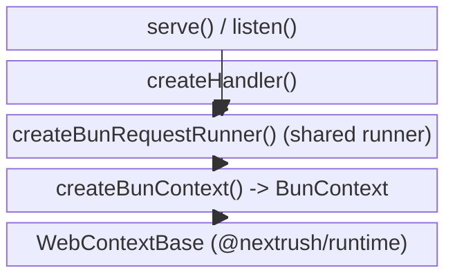
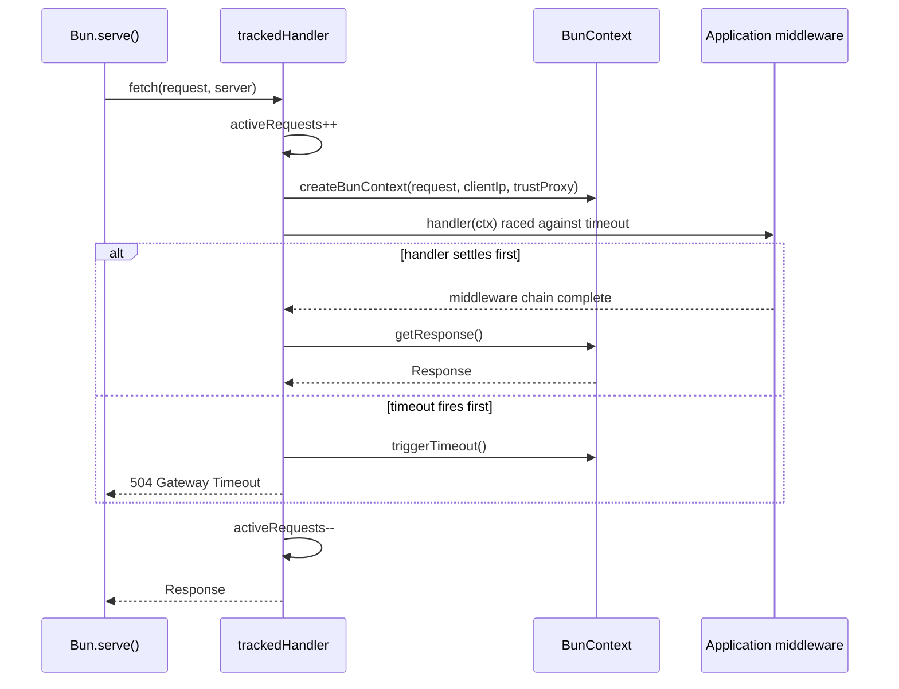
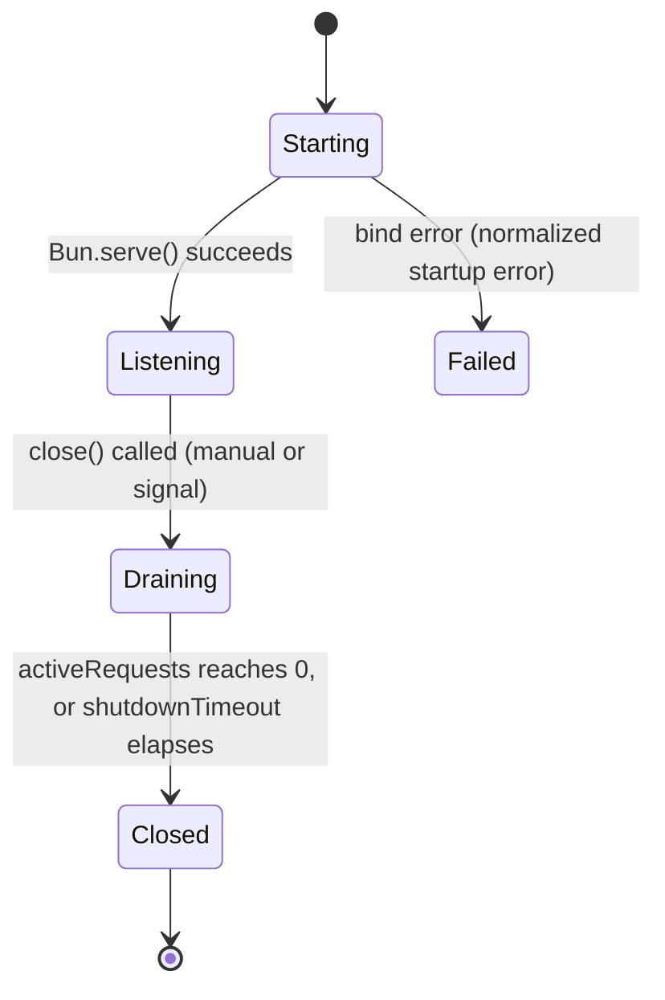

# @nextrush/adapter-bun -- Architecture

> How this package connects a NextRush `Application` to `Bun.serve()`: request handling,
> in-flight tracking, and the graceful-shutdown drain sequence.

## At a glance

|  |  |
| --- | --- |
| **Package** | `@nextrush/adapter-bun` |
| **Layer** | adapter |
| **Depends on** | `@nextrush/core`, `@nextrush/errors`, `@nextrush/runtime`, `@nextrush/stream`, `@nextrush/types` |
| **Depended on by** | Bun-targeting applications (leaf package -- no other NextRush package imports it) |
| **Public entry** | `src/index.ts` (barrel -- exports only) |
| **Internal modules** | 4 files -- largest `adapter.ts` (~540 lines; the package's serve/shutdown engine) |
| **On the request hot path?** | Yes -- every request passes through `createBunRequestRunner`'s handler |
| **Runtime coupling** | Bun-only, by design -- the one package permitted to call `Bun.serve()` |
| **State model** | Per-request `BunContext`; app-scoped in-flight request counter for shutdown draining |

## Responsibilities

**This package owns:**
- Translating a `Bun.serve()` fetch call into a NextRush middleware invocation
- Constructing a `BunContext` per request, including client-IP resolution via `server.requestIP()`
- The per-request timeout race (`Promise.race` against a timer, cooperative cancellation via `ctx.triggerTimeout()`)
- In-flight request counting and the connection-drain sequence for graceful shutdown
- Normalizing `Bun.serve()` startup failures (e.g. port already in use) into the shared typed startup error every adapter throws

**This package does NOT own:**
- Response-building logic (`json`/`send`/`html`/`redirect`/`set`) -- owned by `WebContextBase` in `@nextrush/runtime`, shared across every Web-standard adapter
- Body parsing beyond raw byte access -- owned by `@nextrush/body-parser`
- Route matching -- owned by `@nextrush/router`
- Middleware composition and extension lifecycle -- owned by `@nextrush/core`

## Non-goals

- Does not implement its own body-reading primitive -- delegates to `WebBodySource` in `@nextrush/runtime`, the same one Deno and Edge use
- Does not attempt HTTP/1.1 or TLS protocol handling itself -- that is `Bun.serve()`'s job; this package only shapes its `fetch`/`error`/`tls` options
- Does not support running two independent servers from one `serve()` call -- one `Application` per `serve()` invocation

## Constraints

Must remain:
- Bun-only in its runtime coupling -- this is the one package in the adapter family allowed to reference `Bun.*` globals; `core`/`router`/`middleware` never do
- Behaviorally identical to `@nextrush/adapter-node`/`@nextrush/adapter-deno`/`@nextrush/adapter-edge` for every option this package shares with them (`port`, `host`, `timeout`, `shutdownTimeout`, `gracefulShutdown`) -- enforced by the internal conformance suite (out of scope for this document)
- Backward compatible on its sealed public export list (`src/__tests__/public-surface.test.ts` locks it)

## Position in the package hierarchy

```mermaid
block-beta
  columns 3
  types["types"] errors["errors"] core["core"]
  router["router"] runtime["runtime"] di["di"]
  class["class"] stream["stream"] THIS["adapter-bun (this package)"]

  types --> errors
  errors --> core
  core --> router
  router --> runtime
  runtime --> di
  di --> class
  runtime --> stream
  core --> THIS
  runtime --> THIS
  stream --> THIS

  style THIS fill:#2563eb,color:#fff,stroke:#1e40af
```

> [!IMPORTANT]
> Imports flow downward only. `@nextrush/adapter-bun` imports from `core`, `errors`, `runtime`,
> `stream`, and `types`, and MUST NOT be imported by any of them -- enforced in review
> (project-rules SS1).

**Dependency rules:**
- **Allowed:** `@nextrush/adapter-bun -> @nextrush/core`, `-> @nextrush/errors`, `-> @nextrush/runtime`, `-> @nextrush/stream`, `-> @nextrush/types`
- **Forbidden:** any NextRush package importing `@nextrush/adapter-bun` (it is a leaf/application-facing package, never a dependency of another package)

## Overview

The package is a thin translation layer: `Bun.serve({ fetch })` expects one function shaped
`(request, server) => Promise<Response>`, and NextRush applications expect a middleware chain
invoked with a `Context`. `createBunRequestRunner` is that translation -- it builds a
`BunContext` from the incoming `Request`, races the app's middleware chain against a timeout,
and finalizes the response through the context's own response builder rather than constructing
a `Response` by hand at the call site.

`serve()` composes that same runner (via `createHandler`) with one additional concern this
runner itself does not need: in-flight request counting, so that a shutdown request knows when
it is safe to stop draining and force-close. `createHandler` and `serve()` deliberately share
one runner rather than each rolling their own, so a bug fix or option
addition to request handling can never land in one path and not the other.

### Design principles

1. **One request runner, two entry points.** `createBunRequestRunner` is the single
   implementation `createHandler` and `serve()` both call -- enforced by both functions
   literally calling the same private function, not by convention.
2. **Context construction is Bun's only real contribution.** `BunContext` extends the shared
   `WebContextBase` from `@nextrush/runtime` and adds only what Bun's API genuinely supplies
   that Deno/Edge don't -- `server.requestIP()` for client-IP resolution.
3. **The drain path has no second implementation.** Both a manual `close()` call and a
   signal-triggered shutdown invoke the exact same `drainAndClose` function -- there is no
   parallel "signal shutdown" code path to drift from the manual one.

## Module structure

```text
src/
|-- index.ts         # Public API exports (barrel only, no implementation)
|-- adapter.ts        # serve/createHandler/listen, request runner, graceful shutdown
|-- context.ts        # BunContext -- extends WebContextBase with Bun's requestIP() resolution
|-- utils.ts          # parseQueryString re-export + two deprecated header helpers
`-- body-source.ts    # Re-exports the shared WebBodySource/EmptyBodySource from @nextrush/runtime
```

### Module responsibilities

| Module | Responsibility (the one thing it owns) |
| ------ | -------------------------------------- |
| `adapter.ts` | Bun-facing server lifecycle: start, handle, drain, shut down |
| `context.ts` | Resolving Bun-specific inputs (client IP) into the shared `Context` contract |
| `utils.ts` | Backward-compatible header-reading helpers, now unused internally |
| `body-source.ts` | Re-exporting the runtime's shared body-reading primitive under this package's barrel |

## Component relationships



## Lifecycle





The signal-triggered path (`gracefulShutdown: true` or an options object) does not add a second
drain state -- it only decides *whether* `close()` gets called automatically on `SIGTERM`/
`SIGINT`. The `Draining -> Closed` transition is identical either way.

## State ownership

| Owner | State it owns | Scope |
| ----- | ------------- | ----- |
| `Application` (`@nextrush/core`) | Extension lifecycle, middleware chain | app |
| `serve()`'s closure | `activeRequests` counter, `drainResolve` callback | app (one per `serve()` call) |
| `BunContext` | Request/response state, params, `raw` Bun `Request` access | per-request |

## Data structures

```typescript
// The request-runner's own timeout race uses a Symbol sentinel rather than a
// boolean/null flag, so "the timer won" can never be confused with "the
// handler resolved to a falsy value" -- the two outcomes are distinguishable
// by identity, not by value.
const TIMEOUT_SENTINEL = Symbol('timeout');
```

## Concurrency & edge behaviour

- **Shared, immutable after `serve()` starts:** the `Bun.serve()` options object (`bunOptions`) except for the fields `reload()` explicitly re-merges
- **Per-request, never shared:** `BunContext` and its underlying `Request`/response builder
- **Abort / disconnect / timeout:** a per-request timeout races the middleware chain; on expiry, `ctx.triggerTimeout()` cooperatively cancels the still-running handler and the runner returns `504` directly, bypassing the app's own response

> [!WARNING]
> `activeRequests` is a plain closure variable incremented/decremented around each request, not
> an atomic counter -- correct because Bun's `fetch` callback runs on a single JS thread per
> worker, not because of any explicit locking. Do not move this counter to a shared/global scope
> without re-deriving that guarantee.

## Trust boundaries

```text
Untrusted request ──▶ Bun.serve() ──▶ BunContext ──▶ app middleware / validation
                                       ▲
                                       └─ this package's boundary: raw Request in,
                                          typed Context out; no body parsing happens here
```

`createBunRequestRunner` treats the incoming `Request` as fully untrusted -- it resolves the
client IP only through `server.requestIP()` (or the shared `getClientIp` policy when
`trustProxy` is enabled), and never trusts a client-supplied header for IP resolution unless the
app explicitly opts into proxy trust via `app.options.proxy`.

## Extension points

**Supported extension points:**
- `ServeOptions.onListen` / `ServeOptions.onError` -- observe startup and per-request errors
- `ServeOptions.gracefulShutdown` -- opt into signal-wired shutdown without changing the drain logic itself
- `createHandler()` -- for a hand-rolled `Bun.serve()` call that needs options this package doesn't expose directly

**Forbidden (sealed):**
- The request runner (`createBunRequestRunner`) is not exported -- `createHandler` and `serve()` are the only sanctioned entry points, so request handling cannot silently fork into two implementations
- `drainAndClose` is not exported -- the drain sequence is intentionally the same for every shutdown trigger

## Architectural invariants

The following are part of the package architecture. They do not change without an RFC:

- `createHandler` and `serve()` call the exact same request runner -- no second, divergent request-handling path
- The manual `close()` and the signal-triggered shutdown path invoke the exact same `drainAndClose` function
- `maxRequestBodySize` defaults to `1_048_576` (1 MB), deliberately overriding Bun's native 128 MB default to match `@nextrush/body-parser`'s own JSON default
- `BunContext` extends `WebContextBase` and adds only Bun-specific behavior (client-IP resolution); response-building logic is never duplicated here
- This package is the only one in the dependency graph permitted to reference `Bun.*` globals

## Engineering decisions

| Decision | Chosen | Trade-off accepted | Reference |
| -------- | ------ | ------------------- | --------- |
| Server-level body size cap | Set `maxRequestBodySize` explicitly (1 MB default) rather than trust Bun's 128 MB default | Callers with genuinely large payloads must opt in explicitly via `maxRequestBodySize` | -- |
| One shared request runner for `createHandler` and `serve()` | Compose, don't duplicate | `serve()` cannot add per-call behavior without also affecting `createHandler`'s bare handler | -- |
| Signal wiring is opt-in, matching Node's shape | `gracefulShutdown` defaults to `undefined` -- no handler installed; option shape mirrors `@nextrush/adapter-node` | Apps that want signal-based shutdown must explicitly request it | ADR-0010 |

## Rejected alternatives

### A bespoke `BunBodySource` implementation
Earlier revisions of this package implemented body reading independently per adapter. It was
collapsed onto the shared `WebBodySource` in `@nextrush/runtime` so Bun/Deno/Edge read bodies
identically and a fix lands once instead of three times.

### Trusting Bun's native 128 MB body-size default
Bun.serve buffers the entire request body before the framework's `fetch` handler ever runs, so
leaving the platform default in place would let a 128 MB payload through before NextRush's own
`@nextrush/body-parser` limit (1 MB by default) ever gets a chance to reject it. Setting
`maxRequestBodySize` explicitly closes that gap at the layer that can actually enforce it early.

## Testing strategy

- **Unit:** `adapter.test.ts`, `context.test.ts`, `utils.test.ts`, `body-source.test.ts`
- **Integration:** `graceful-shutdown.test.ts` -- stubs `Bun.serve()` with a real `node:http` server so the drain/signal-wiring logic under test runs unmocked
- **Invariant tests:** `public-surface.test.ts` locks the exported symbol set; `per-request-work-trim.test.ts` and `context-response-microtrims.test.ts` guard hot-path allocation behavior
- **Conformance / cross-adapter parity:** yes -- validated against sibling adapters by the internal conformance suite (`packages/adapters/conformance`, out of scope for this document)
- **Coverage:** >=90% lines/functions (CI-enforced)

## Evolution strategy

- **Stable (semver-guarded):** the sealed export list in `src/index.ts` (locked by `public-surface.test.ts`)
- **May change without notice:** internal module layout, the private request runner's implementation details
- **Changes only via RFC:** the shared-runner invariant, the drain-sequence invariant, and the `maxRequestBodySize` default

## Contributor notes

Before changing this package, read: ADR-0010 (graceful shutdown contract), the shared
`WebContextBase`/`WebBodySource` source in `@nextrush/runtime`, and
`packages/adapters/conformance`'s cross-adapter parity suite.

## Architecture checklist

Before changing this package, confirm:
- [ ] Does this preserve the one-shared-runner invariant?
- [ ] Does this increase coupling to Bun-specific APIs beyond what `context.ts`/`adapter.ts` already need?
- [ ] Does this affect the request hot path (allocations, extra awaits)?
- [ ] Does this change the sealed public API (semver / ADR-0005)?
- [ ] Does it need an RFC?

## References & see also

- **README (how to use it):** [`./README.md`](./README.md)
- **Governing ADR:** [`ADR-0010`](../../../docs/adr/ADR-0010-cross-runtime-parity-hardening.md)
- **Benchmarks:** [`apps/benchmark`](https://github.com/0xTanzim/nextRush/tree/main/apps/benchmark)
