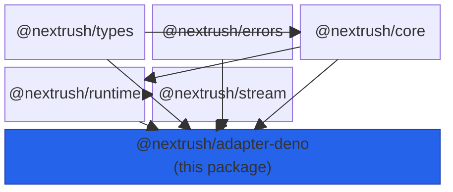
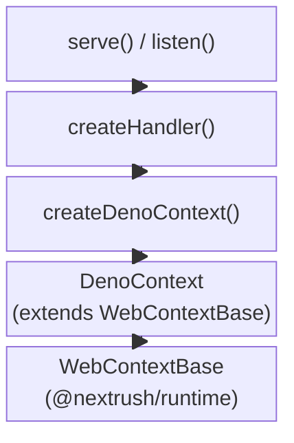
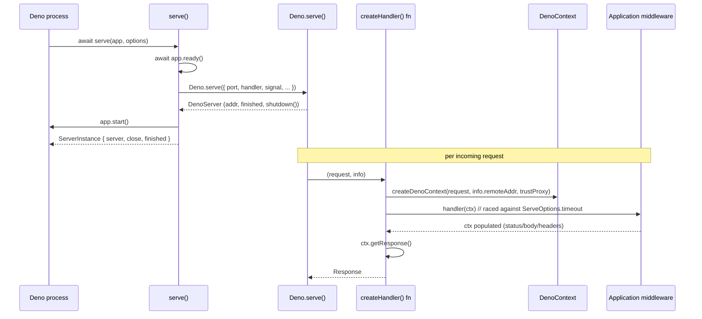
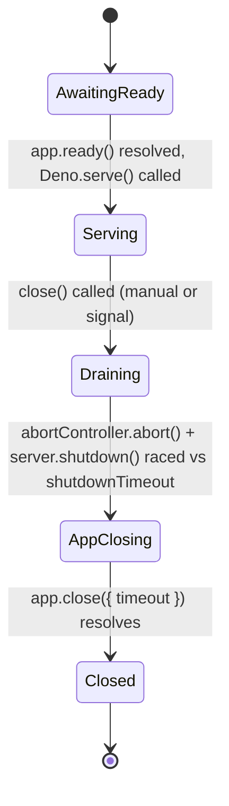

# @nextrush/adapter-deno -- Architecture

> The internal design connecting a NextRush `Application` to Deno's native `Deno.serve()`.

## At a glance

|  |  |
| --- | --- |
| **Package** | `@nextrush/adapter-deno` |
| **Layer** | adapter |
| **Depends on** | `@nextrush/core`, `@nextrush/errors`, `@nextrush/runtime`, `@nextrush/stream`, `@nextrush/types` |
| **Depended on by** | Deno application code (leaf package -- no in-repo package imports it) |
| **Public entry** | `src/index.ts` (barrel -- exports only) |
| **Internal modules** | 4 files -- largest `adapter.ts` at 469 lines (adapter packages are capped at 500 LOC per `architecture.instructions.md`) |
| **On the request hot path?** | Yes -- every Deno request passes through `createHandler`'s returned function |
| **Runtime coupling** | Deno-only by design; the `Deno` global is declared ambiently in `src/deno.d.ts` |
| **State model** | Stateless module scope; per-request `DenoContext`; one `AbortController` per `serve()` call |

## Responsibilities

**This package owns:**
- Translating `Deno.serve()`'s `(Request, DenoServeHandlerInfo)` call shape into a NextRush
  `Application` invocation
- Resolving the client IP from `Deno.serve()`'s per-request `remoteAddr`
- The per-request handler timeout (`Promise.race` against `ServeOptions.timeout`)
- The connection-drain sequence on shutdown (`abortController.abort()` -> `server.shutdown()`
  raced against `shutdownTimeout` -> `app.close()`)
- Optional signal wiring (`gracefulShutdown`) from `SIGTERM`/`SIGINT` to that same drain

**This package does NOT own:**
- Request/response body reading or JSON/text/stream response building -- owned by
  `@nextrush/runtime`'s `WebBodySource` and `WebResponseBuilder` (consumed via `WebContextBase`)
- Route matching, middleware composition, or extension lifecycle -- owned by `@nextrush/core`
  and `@nextrush/router`
- Deno-specific runtime detection -- `getRuntime()` lives in `@nextrush/runtime`

## Non-goals

- Providing a Node.js-compatible `http.Server`-shaped API -- this adapter is Web-standard
  (`Request`/`Response`) end to end, matching Deno's own native surface
- Polyfilling or shimming `Deno.serve()` -- the adapter calls the real Deno global directly
  (confirmed in `src/adapter.ts`: `server = Deno.serve(denoOptions);`)
- Implementing its own body-parsing or streaming logic -- delegated entirely to
  `@nextrush/runtime`

## Constraints

Must remain:
- Deno-only -- no Node.js (`node:*`, `process` outside the Node-compat signal APIs Deno itself
  polyfills), Bun, or Edge-specific code
- Aligned with the shared `ServerAdapter<Application, ServeOptions, ServerInstance>` contract
  from `@nextrush/types`, enforced at compile time by the `_denoConformance` guard in
  `src/adapter.ts`
- Behaviorally identical to `@nextrush/adapter-bun` and `@nextrush/adapter-edge` for anything
  built on `WebContextBase` (body reading, `ctx.json`/`ctx.send`/`ctx.html`, streaming)

## Position in the package hierarchy



> [!IMPORTANT]
> Imports flow downward only. `@nextrush/adapter-deno` may import from the layers above it in
> this diagram (its dependencies) and must not be imported by them -- enforced in review
> (project-rules §1). It has no in-repo dependents; application code is the only consumer.

**Dependency rules:**
- **Allowed:** `@nextrush/adapter-deno -> @nextrush/core` -- `-> @nextrush/runtime` --
  `-> @nextrush/stream` -- `-> @nextrush/errors` -- `-> @nextrush/types`
- **Forbidden:** `@nextrush/adapter-deno -> @nextrush/adapter-bun` /
  `-> @nextrush/adapter-node` / `-> @nextrush/adapter-edge` (sibling adapters never import each
  other)

---

## Overview

This package is the thinnest possible bridge between Deno's native `Deno.serve()` API and a
NextRush `Application`. It contributes almost no original logic of its own: request handling,
body reading, and response construction are implemented once in `@nextrush/runtime` (shared
with the Bun and Edge adapters, since all three speak the Web-standard `Request`/`Response`
contract) and inherited here through `WebContextBase`. What remains genuinely specific to this
package is small and explicit -- resolving the client IP from `Deno.serve()`'s connection info,
the ambient `Deno` global type declarations, and the shutdown-signal wiring that Deno's
Node-compatibility layer makes possible.

The organizing idea is **composition over reimplementation**: rather than each Web-standard
adapter (Bun, Deno, Edge) shipping its own copy of body parsing and response building, they all
extend `WebContextBase` and differ only in the one or two things their host runtime does
differently -- for Deno, that is IP resolution from `remoteAddr` and using `process.once` (Deno
2's Node-compat shim) for signal handling.

### Design principles

1. **Shared logic lives once, in `@nextrush/runtime`.** Enforced by `DenoContext` extending
   `WebContextBase` rather than reimplementing `json`/`send`/`html`/`redirect`/`get`/`next` --
   verified in `src/context.ts`, which contains only the constructor and IP resolution.
2. **The adapter contract is checked at compile time, not just by convention.** `src/adapter.ts`
   assigns `serve`/`createHandler` to a `ServerAdapter<...>`-typed constant
   (`_denoConformance`) and `createDenoContext` to an `AdapterContextFactory<...>`-typed
   constant (`_denoContextFactory`) purely so a shape mismatch is a TypeScript error.
3. **One drain implementation, two entry points.** `drainAndClose()` is the only function that
   actually stops the server; both the manually-called `close()` and the signal-triggered path
   built by `buildCloseWithGracefulShutdown()` call it, so there is no risk of the two paths
   drifting apart.

---

## Module structure

```text
src/
|-- index.ts        # Public API exports (barrel only, no implementation)
|-- adapter.ts       # serve/listen/createHandler, shutdown sequencing, conformance guards
|-- context.ts       # DenoContext: extends WebContextBase, resolves IP from remoteAddr
|-- utils.ts         # Deprecated content-type/content-length helpers (kept for compat)
|-- body-source.ts   # Re-exports @nextrush/runtime's shared WebBodySource
`-- deno.d.ts         # Hand-rolled ambient Deno.serve type declarations (no @types/deno dep)
```

### Module responsibilities

| Module | Responsibility (the one thing it owns) |
| ------ | --------------------------------------- |
| `adapter.ts` | The full `serve()`/`listen()`/`createHandler()` surface, per-request timeout, and the shutdown/signal-wiring sequence |
| `context.ts` | `DenoContext` -- the one Deno-specific piece of context construction: IP resolution from `remoteAddr` |
| `utils.ts` | Deprecated `getContentType`/`getContentLength` helpers, kept only for backward compatibility (unused internally per their own `@deprecated` tags) |
| `body-source.ts` | Re-exports `@nextrush/runtime`'s `WebBodySource`/`EmptyBodySource` under this package's public surface |
| `deno.d.ts` | Ambient global declarations for the subset of `Deno.serve` this adapter calls -- the zero-`@types/deno`-dependency policy requires hand-rolling this |

## Component relationships



---

## Lifecycle





The two diagrams cover different concerns: the sequence diagram is the per-request path through
`createHandler`'s returned function; the state diagram is the server's own lifecycle across a
single `serve()`/`close()` cycle. `gracefulShutdown` only changes what *triggers* the
`Draining` transition (a signal vs. a direct `close()` call) -- the transition itself is
identical either way, since both paths call the same `drainAndClose()`.

## State ownership

| Owner | State it owns | Scope |
| ----- | -------------- | ----- |
| `Application` (`@nextrush/core`) | Registered middleware, extensions, lifecycle flags (`isRunning`, etc.) | app |
| `serve()`'s closure | The `AbortController` used to signal `Deno.serve()`'s `signal` option | one call to `serve()` |
| `DenoContext` | Request/response state (headers, status, body), resolved `ip` | per-request |
| `buildCloseWithGracefulShutdown()`'s closure | The memoized `drainPromise` and installed signal listeners | one call to `serve()`, until `close()` completes |

---

## Data structures

```ts
// The two option/result shapes a caller actually interacts with. Their shape is
// deliberately mirrored across adapter-node/-bun/-deno so switching runtimes is
// an import change, not a type change at call sites.
export interface ServeOptions {
  port?: number;
  host?: string;
  onListen?: (info: { port: number; host: string; hostname: string }) => void;
  onError?: (error: Error) => void;
  cert?: string;
  key?: string;
  shutdownTimeout?: number;
  timeout?: number;
  logger?: Logger;
  gracefulShutdown?: boolean | GracefulShutdownOptions;
}

export interface ServerInstance {
  server: DenoServer;
  port: number;
  host: string;
  close(): Promise<void>;
  address(): { port: number; host: string; hostname: string };
  finished: Promise<void>;
}
```

`address()` returns `hostname` as an alias of `host` for compatibility with earlier call sites;
`host` is the canonical field going forward.

## Concurrency & edge behaviour

- **Shared, immutable after `serve()` returns:** the `Application` instance and its registered
  middleware/extensions -- no per-request mutation of the app itself.
- **Per-request, never shared:** `DenoContext` -- one instance per call into the handler
  returned by `createHandler`.
- **Abort / disconnect / timeout:** a handler that exceeds `ServeOptions.timeout` (default 30s)
  is raced against a `setTimeout`-backed sentinel; on expiry, `ctx.triggerTimeout()` is called
  (signaling any in-flight streaming/abort-aware code) and a `504 Gateway Timeout` is returned
  immediately -- the original handler promise is not force-cancelled, only its result is
  discarded.
- **Idempotent shutdown:** `buildCloseWithGracefulShutdown()` memoizes the drain promise
  (`drainPromise ??= ...`), so calling `close()` multiple times, or a signal firing after a
  manual `close()`, both resolve the same in-flight drain rather than starting a second one.

> [!WARNING]
> `server.shutdown()` (Deno's own API) has no built-in timeout and can hang on a stalled
> connection. `drainAndClose()` always races it against `shutdownTimeout` -- removing that race
> would let a single misbehaving connection block shutdown indefinitely.

## Trust boundaries

```text
Deno.serve() (untrusted network input) --> Request object --> DenoContext --> Application middleware
                                                                    ^
                                                                    `-- WebContextBase enforces body-size
                                                                        limits and consumed-once semantics
```

This package treats every incoming `Request` as untrusted. It does not itself validate body
content -- that boundary is enforced by `@nextrush/runtime`'s `WebBodySource` (size limits,
single-consumption guards) and by whatever body-parsing middleware the application registers
(e.g. `@nextrush/body-parser`). The adapter's own responsibility is narrower: never trusting
`remoteAddr` as the real client IP unless `trustProxy` is explicitly set, matching the same
policy Node/Bun/Edge apply.

## Extension points

**Supported extension points:**
- `ServeOptions.onListen` / `onError` -- observe startup and error events without modifying
  adapter behavior
- `ServeOptions.logger` -- override diagnostics output per call

**Forbidden (sealed):**
- The `ServerAdapter<Application, ServeOptions, ServerInstance>` shape itself -- changing
  `serve`/`createHandler`'s signatures breaks the compile-time conformance guard shared with
  the sibling adapters and is a breaking change requiring an RFC
- `DenoContext`'s inheritance from `WebContextBase` -- reimplementing response building locally
  would silently diverge Deno's observable behavior from Bun/Edge

---

## Architectural invariants

The following are part of the package architecture. They do not change without an RFC:

- `serve()`/`createHandler()` call `Deno.serve()` directly -- no compatibility shim or
  polyfilled HTTP server is introduced.
- All body-reading and response-building logic is inherited from `@nextrush/runtime`'s
  `WebContextBase`/`WebBodySource`/`WebResponseBuilder`, never reimplemented locally.
- `drainAndClose()` is the only function that performs the connection-drain sequence; both the
  manual and signal-triggered shutdown paths call it.
- `gracefulShutdown` installs no signal handler when omitted or falsy -- process behavior is
  unchanged unless a caller explicitly opts in.
- The public export set matches `src/index.ts` exactly, snapshotted by
  `__tests__/public-surface.test.ts`.

## Engineering decisions

| Decision | Chosen | Trade-off accepted | Reference |
| -------- | ------ | -------------------- | --------- |
| Share Context/body logic across Web-standard adapters | Extend `WebContextBase` from `@nextrush/runtime` instead of a Deno-specific reimplementation | This package's own source is small, but a bug in `WebContextBase` affects Bun/Deno/Edge simultaneously | RFC-NEXTRUSH-ADAPTER-CONTRACT |
| Graceful shutdown signal wiring | Opt-in via `gracefulShutdown`, using Deno 2's Node-compat `process.once`/`removeListener` | Ties the feature to Deno's Node-compat layer rather than a Deno-native signal API | ADR-0010 |
| Per-request timeout | `Promise.race` against a `setTimeout` sentinel in `createHandler` | The original handler promise keeps running after timeout; only its result is discarded, not the work itself | -- |

## Rejected alternatives

### A Deno-specific body-reading implementation
Rejected in favor of the shared `WebBodySource` in `@nextrush/runtime`. Deno, Bun, and Edge all
expose the same `Request`/`ReadableStream` Web APIs for body access, so a bespoke
`DenoBodySource` would only duplicate logic that already needs to behave identically across
those three runtimes -- and any future divergence would have been a cross-adapter parity bug,
not a feature.

### Polyfilling Node's `http.Server` shape on top of `Deno.serve()`
Rejected. Deno's native `Deno.serve()` already speaks the same `Request`/`Response` contract
this adapter's shared base expects; wrapping it in a Node-`http`-shaped facade would add
translation overhead and an extra layer to keep in sync with zero behavioral benefit.

---

## Testing strategy

- **Unit:** `src/__tests__/adapter.test.ts`, `context.test.ts`, `utils.test.ts`,
  `body-source.test.ts` -- exercise `serve`/`createHandler`/`DenoContext` behavior directly.
- **Integration:** `src/__tests__/graceful-shutdown.test.ts` stubs `Deno.serve` to verify the
  full signal-wiring and drain sequence end to end.
- **Invariant tests:** `src/__tests__/public-surface.test.ts` locks the exact public export set.
- **Micro-behavior regression:** `context-response-microtrims.test.ts` and
  `per-request-work-trim.test.ts` guard specific per-request allocation/behavior trims.
- **Conformance / cross-adapter parity:** exercised by `packages/adapters/conformance` (private,
  out of scope for this document) against the shared `ServerAdapter` contract.
- **Coverage:** >=90% lines/functions (CI-enforced).

## Evolution strategy

- **Stable (semver-guarded):** `serve`, `listen`, `createHandler`, `DenoContext`,
  `createDenoContext`, and the `ServeOptions`/`ServerInstance`/`GracefulShutdownOptions` types.
- **May change without notice:** the ambient `Deno.serve` type declarations in `src/deno.d.ts`
  if Deno's own API surface changes (tracked by the version note in that file).
- **Changes only via RFC:** the `ServerAdapter` conformance contract and the decision to inherit
  from `WebContextBase` rather than reimplement locally.

## Contributor notes

Before changing this package, read the `ServerAdapter`/`AdapterContextFactory` types in
`@nextrush/types`, `WebContextBase` in `@nextrush/runtime`, and the graceful-shutdown test suite
-- most correctness bugs in this package are actually bugs in the shared base, not in the
Deno-specific glue.

## Architecture checklist

Before changing this package, confirm:
- [ ] Does this preserve the architectural invariants?
- [ ] Does this increase coupling or cross a dependency rule?
- [ ] Does this affect the request hot path (allocations / complexity)?
- [ ] Does this change the public API (semver / ADR-0005)?
- [ ] Does it need an RFC?

---

## References & see also

- **README (how to use it):** [`./README.md`](./README.md)
- **Governing contract:** `@nextrush/types`'s `ServerAdapter`/`AdapterContextFactory`
- **ADR:** [ADR-0010](https://github.com/0xTanzim/nextRush/blob/main/docs/adr/) (graceful
  shutdown signal wiring, shared shape across Node/Bun/Deno)
- **Package tiers:** [ADR-0005](https://github.com/0xTanzim/nextRush/blob/main/docs/adr/ADR-0005-package-tiers-sealed-surface-deprecation.md)
- **Benchmarks:** [`apps/benchmark`](https://github.com/0xTanzim/nextRush/tree/main/apps/benchmark)
